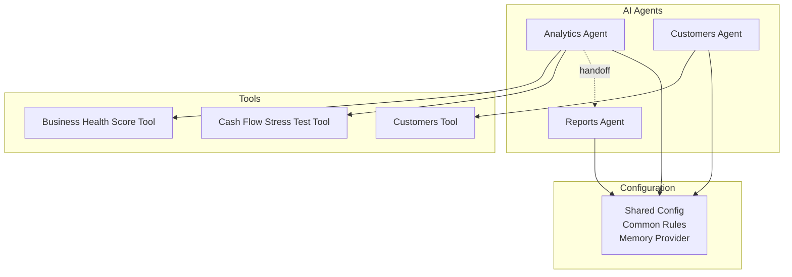
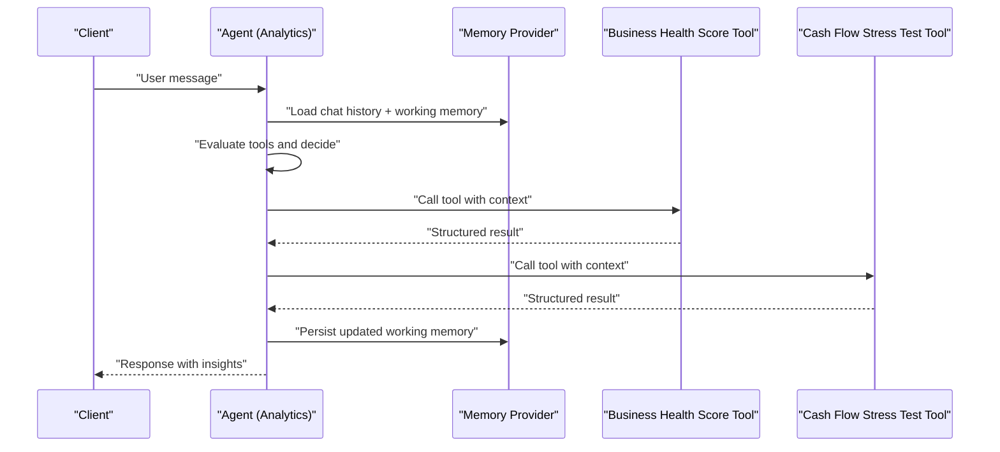
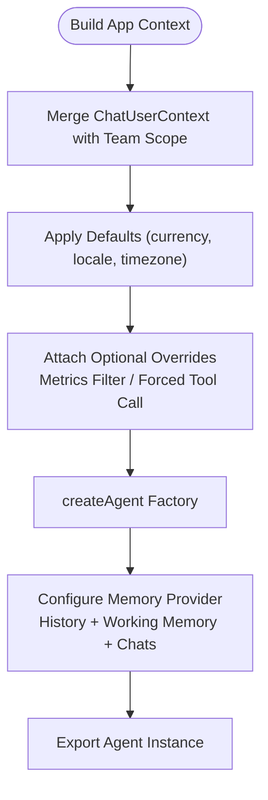
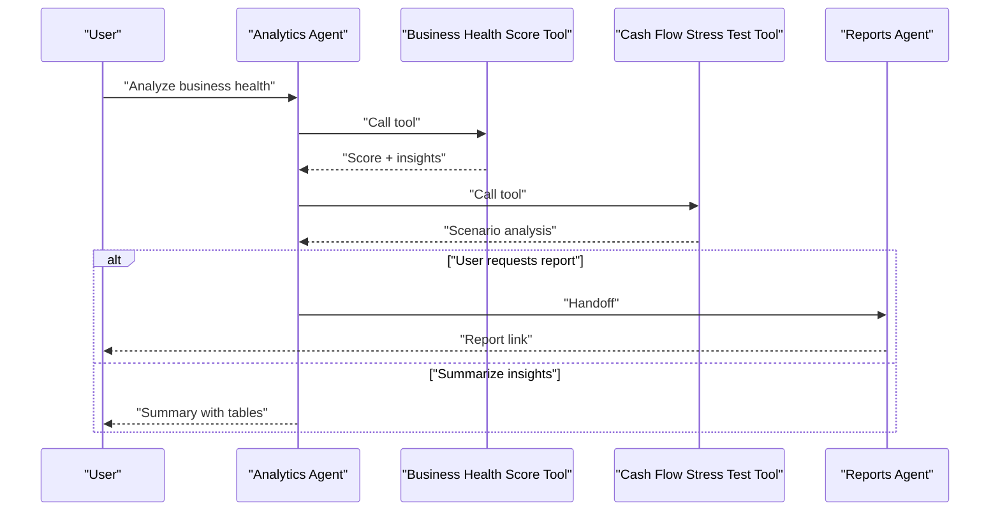
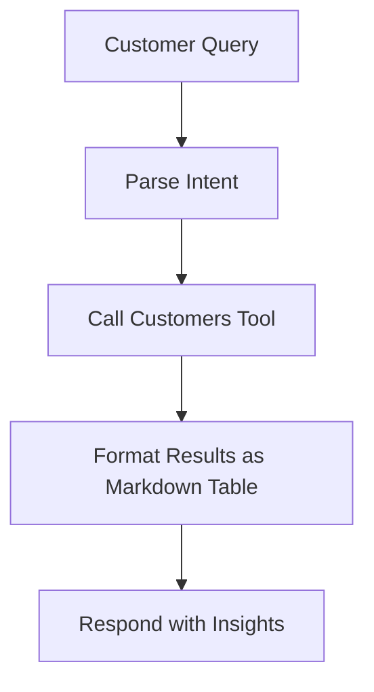
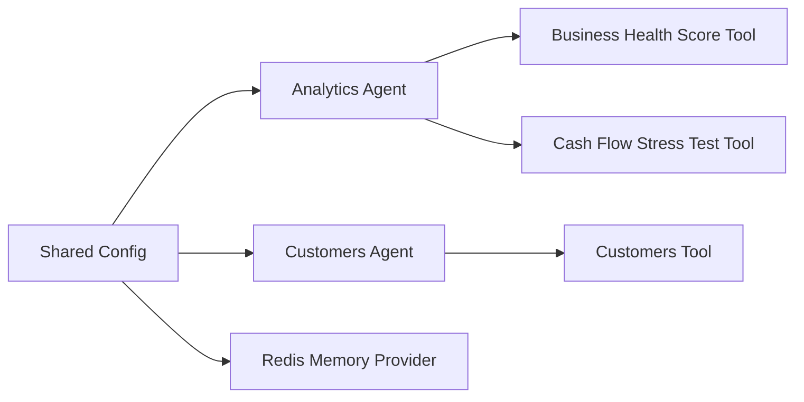

# AI Agent Framework

<cite>
**Referenced Files in This Document**
- [shared.ts](file://midday/apps/api/src/ai/agents/config/shared.ts)
- [analytics.ts](file://midday/apps/api/src/ai/agents/analytics.ts)
- [customers.ts](file://midday/apps/api/src/ai/agents/customers.ts)
- [get-business-health-score.ts](file://midday/apps/api/src/ai/tools/get-business-health-score.ts)
- [get-cash-flow-stress-test.ts](file://midday/apps/api/src/ai/tools/get-cash-flow-stress-test.ts)
- [get-customers.ts](file://midday/apps/api/src/ai/tools/get-customers.ts)
- [reports.ts](file://midday/apps/api/src/ai/agents/reports.ts)
</cite>

## Table of Contents
1. [Introduction](#introduction)
2. [Project Structure](#project-structure)
3. [Core Components](#core-components)
4. [Architecture Overview](#architecture-overview)
5. [Detailed Component Analysis](#detailed-component-analysis)
6. [Dependency Analysis](#dependency-analysis)
7. [Performance Considerations](#performance-considerations)
8. [Troubleshooting Guide](#troubleshooting-guide)
9. [Conclusion](#conclusion)
10. [Appendices](#appendices)

## Introduction
This document describes Faworra’s AI agent framework used in the backend API service. It explains the agent architecture patterns, how to implement custom agents, and how memory is managed. It also documents specialized agents for analytics, customer management, and outlines patterns for invoicing, transactions, reporting, time tracking, research, and operations. Guidance is provided for agent configuration (memory templates, instruction prompts, shared configurations), lifecycle management, state persistence, and inter-agent communication. Examples of customization, prompt engineering techniques, and performance optimization strategies are included.

## Project Structure
The AI agent system resides under the API application and is organized into:
- Agents: Specialized conversational agents for distinct business domains
- Tools: Domain-specific functions exposed to agents
- Configuration: Shared agent creation, memory templates, and common rules
- Reports: A specialized agent for report generation and handoff

**Diagram sources**
- [shared.ts](file://midday/apps/api/src/ai/agents/config/shared.ts#L133-L162)
- [analytics.ts](file://midday/apps/api/src/ai/agents/analytics.ts#L12-L37)
- [customers.ts](file://midday/apps/api/src/ai/agents/customers.ts#L9-L30)
- [reports.ts](file://midday/apps/api/src/ai/agents/reports.ts#L1-L200)

**Section sources**
- [shared.ts](file://midday/apps/api/src/ai/agents/config/shared.ts#L1-L163)
- [analytics.ts](file://midday/apps/api/src/ai/agents/analytics.ts#L1-L38)
- [customers.ts](file://midday/apps/api/src/ai/agents/customers.ts#L1-L31)

## Core Components
- Agent creation factory: Centralized agent builder that injects memory, history, working memory, and chat helpers
- Memory subsystem: Redis-backed memory with history limits, working memory templates, and automatic chat title/suggestion generation
- Common agent rules: Shared behavioral guidelines for consistent agent behavior
- Context builder: Aggregates user/team context, localization, and optional filter/tool overrides
- Specialized agents: Analytics and customer agents demonstrate domain-specific instructions, tools, and optional handoffs

Key implementation references:
- Agent factory and memory configuration: [shared.ts](file://midday/apps/api/src/ai/agents/config/shared.ts#L133-L162)
- Memory provider and templates: [shared.ts](file://midday/apps/api/src/ai/agents/config/shared.ts#L9-L22)
- Common behavior rules: [shared.ts](file://midday/apps/api/src/ai/agents/config/shared.ts#L36-L44)
- Context builder: [shared.ts](file://midday/apps/api/src/ai/agents/config/shared.ts#L98-L129)
- Analytics agent: [analytics.ts](file://midday/apps/api/src/ai/agents/analytics.ts#L12-L37)
- Customers agent: [customers.ts](file://midday/apps/api/src/ai/agents/customers.ts#L9-L30)

**Section sources**
- [shared.ts](file://midday/apps/api/src/ai/agents/config/shared.ts#L1-L163)
- [analytics.ts](file://midday/apps/api/src/ai/agents/analytics.ts#L1-L38)
- [customers.ts](file://midday/apps/api/src/ai/agents/customers.ts#L1-L31)

## Architecture Overview
The AI agent framework follows a modular pattern:
- Agents encapsulate domain logic and orchestrate tool usage
- Tools are pure functions that query data sources and return structured results
- Memory is injected via a provider to persist history, working memory, and chat metadata
- Shared configuration ensures consistent behavior and context propagation

**Diagram sources**
- [shared.ts](file://midday/apps/api/src/ai/agents/config/shared.ts#L133-L162)
- [analytics.ts](file://midday/apps/api/src/ai/agents/analytics.ts#L12-L37)
- [get-business-health-score.ts](file://midday/apps/api/src/ai/tools/get-business-health-score.ts#L1-L200)
- [get-cash-flow-stress-test.ts](file://midday/apps/api/src/ai/tools/get-cash-flow-stress-test.ts#L1-L200)

## Detailed Component Analysis

### Shared Configuration and Memory Management
The shared configuration defines:
- Memory templates and instructions for chat title and suggestions
- Common agent behavior rules
- Application context shape and builder
- Agent factory that injects memory provider and chat helpers

**Diagram sources**
- [shared.ts](file://midday/apps/api/src/ai/agents/config/shared.ts#L98-L129)
- [shared.ts](file://midday/apps/api/src/ai/agents/config/shared.ts#L133-L162)

Implementation highlights:
- Memory provider backed by Redis adapter
- Working memory scoped per user with a template
- Chat title and suggestions generated by a small model
- History capped to a fixed limit

**Section sources**
- [shared.ts](file://midday/apps/api/src/ai/agents/config/shared.ts#L1-L163)

### Analytics Agent
Purpose:
- Business health scoring, cash flow forecasting, and stress testing
- Structured insights with actionable focus areas
- Optional handoff to the Reports agent

Key characteristics:
- Model selection and temperature tuned for analytical tasks
- Uses shared instructions and common rules
- Parallel tool calls encouraged
- Max turns constrained for efficiency

**Diagram sources**
- [analytics.ts](file://midday/apps/api/src/ai/agents/analytics.ts#L12-L37)
- [get-business-health-score.ts](file://midday/apps/api/src/ai/tools/get-business-health-score.ts#L1-L200)
- [get-cash-flow-stress-test.ts](file://midday/apps/api/src/ai/tools/get-cash-flow-stress-test.ts#L1-L200)
- [reports.ts](file://midday/apps/api/src/ai/agents/reports.ts#L1-L200)

**Section sources**
- [analytics.ts](file://midday/apps/api/src/ai/agents/analytics.ts#L1-L38)

### Customer Management Agent
Purpose:
- Assist with customer data, profitability analysis, and CRM-related queries
- Streamlined for quick, focused responses

Key characteristics:
- Smaller model variant for cost/performance balance
- Emphasis on leading with key information
- Single primary tool for customer data retrieval

**Diagram sources**
- [customers.ts](file://midday/apps/api/src/ai/agents/customers.ts#L9-L30)
- [get-customers.ts](file://midday/apps/api/src/ai/tools/get-customers.ts#L1-L200)

**Section sources**
- [customers.ts](file://midday/apps/api/src/ai/agents/customers.ts#L1-L31)

### Reports Agent
The Reports agent is referenced by the Analytics agent for generating downloadable reports. It demonstrates:
- Handoff capability from another agent
- Integration with the memory system for context continuity

**Section sources**
- [reports.ts](file://midday/apps/api/src/ai/agents/reports.ts#L1-L200)

## Dependency Analysis
Agent dependencies are primarily functional and declarative:
- Agents depend on shared configuration for memory and rules
- Agents depend on tools for data access
- Tools are independent and reusable across agents
- Memory provider is injected globally via the agent factory

**Diagram sources**
- [shared.ts](file://midday/apps/api/src/ai/agents/config/shared.ts#L133-L162)
- [analytics.ts](file://midday/apps/api/src/ai/agents/analytics.ts#L12-L37)
- [customers.ts](file://midday/apps/api/src/ai/agents/customers.ts#L9-L30)
- [get-business-health-score.ts](file://midday/apps/api/src/ai/tools/get-business-health-score.ts#L1-L200)
- [get-cash-flow-stress-test.ts](file://midday/apps/api/src/ai/tools/get-cash-flow-stress-test.ts#L1-L200)
- [get-customers.ts](file://midday/apps/api/src/ai/tools/get-customers.ts#L1-L200)

**Section sources**
- [shared.ts](file://midday/apps/api/src/ai/agents/config/shared.ts#L1-L163)
- [analytics.ts](file://midday/apps/api/src/ai/agents/analytics.ts#L1-L38)
- [customers.ts](file://midday/apps/api/src/ai/agents/customers.ts#L1-L31)

## Performance Considerations
- Model selection: Choose smaller models for routine tasks (e.g., customer agent) and reserve larger models for complex analysis (e.g., analytics agent)
- Temperature tuning: Lower temperature for deterministic, concise outputs; higher for exploratory tasks
- Parallel tool calls: Encourage concurrent tool invocations when independent to reduce latency
- History limits: Keep memory history bounded to control token usage and retrieval costs
- Working memory templates: Use concise, structured templates to minimize context bloat
- Tool composition: Prefer focused tools with clear inputs/outputs to reduce retries and improve throughput

## Troubleshooting Guide
Common issues and remedies:
- Memory not persisting: Verify Redis adapter configuration and connectivity; confirm memory provider is attached during agent creation
- Excessive context length: Reduce history limit or refine working memory template; ensure context formatting stays concise
- Tool failures: Wrap tool calls with error handling; provide fallback responses and retry logic
- Agent drift: Reinforce common behavior rules and consider stricter max turn limits
- Handoff failures: Ensure handoff targets are configured and reachable; validate context propagation across agents

## Conclusion
Faworra’s AI agent framework provides a scalable, memory-aware foundation for building domain-specific agents. By centralizing configuration, enforcing common behavior, and leveraging a robust memory provider, teams can implement specialized agents for analytics, customer management, and more. The patterns demonstrated here—agent factories, tool-driven workflows, and structured memory—enable maintainable, performant, and extensible AI integrations.

## Appendices

### Agent Configuration Reference
- Agent factory: [shared.ts](file://midday/apps/api/src/ai/agents/config/shared.ts#L133-L162)
- Memory provider and templates: [shared.ts](file://midday/apps/api/src/ai/agents/config/shared.ts#L9-L22)
- Common behavior rules: [shared.ts](file://midday/apps/api/src/ai/agents/config/shared.ts#L36-L44)
- Context builder: [shared.ts](file://midday/apps/api/src/ai/agents/config/shared.ts#L98-L129)

### Specialized Agents Index
- Analytics agent: [analytics.ts](file://midday/apps/api/src/ai/agents/analytics.ts#L12-L37)
- Customer management agent: [customers.ts](file://midday/apps/api/src/ai/agents/customers.ts#L9-L30)
- Reports agent: [reports.ts](file://midday/apps/api/src/ai/agents/reports.ts#L1-L200)

### Tools Index
- Business health score tool: [get-business-health-score.ts](file://midday/apps/api/src/ai/tools/get-business-health-score.ts#L1-L200)
- Cash flow stress test tool: [get-cash-flow-stress-test.ts](file://midday/apps/api/src/ai/tools/get-cash-flow-stress-test.ts#L1-L200)
- Customers tool: [get-customers.ts](file://midday/apps/api/src/ai/tools/get-customers.ts#L1-L200)