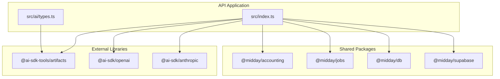
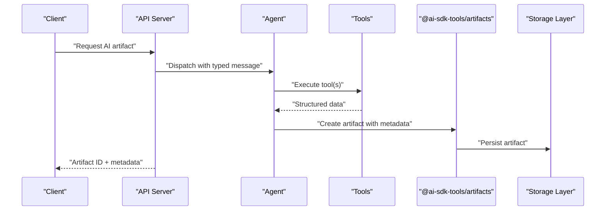
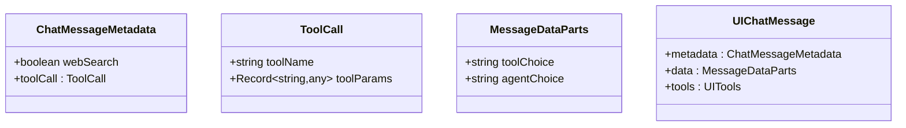
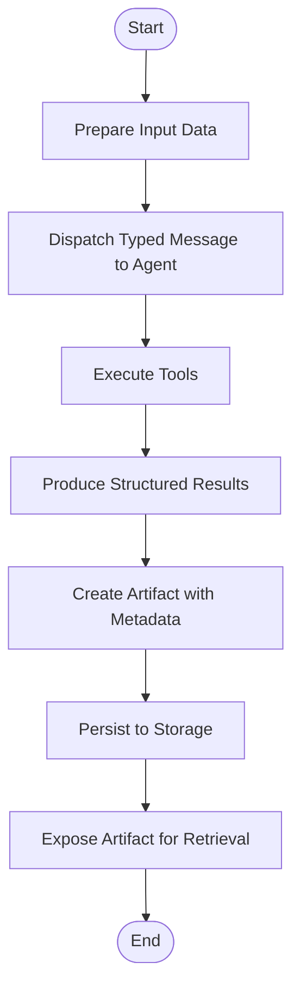
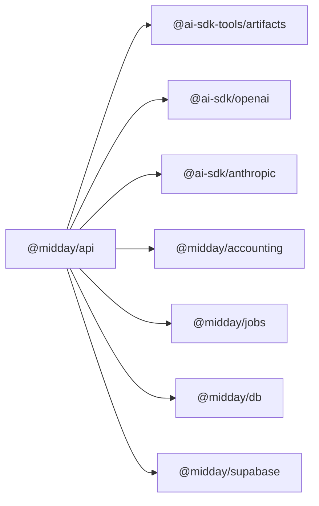

# AI Artifacts & Generated Content

<cite>
**Referenced Files in This Document**
- [package.json](file://midday/apps/api/package.json)
- [types.ts](file://midday/apps/api/src/ai/types.ts)
- [index.ts](file://midday/apps/api/src/index.ts)
- [README.md](file://midday/README.md)
</cite>

## Table of Contents
1. [Introduction](#introduction)
2. [Project Structure](#project-structure)
3. [Core Components](#core-components)
4. [Architecture Overview](#architecture-overview)
5. [Detailed Component Analysis](#detailed-component-analysis)
6. [Dependency Analysis](#dependency-analysis)
7. [Performance Considerations](#performance-considerations)
8. [Troubleshooting Guide](#troubleshooting-guide)
9. [Conclusion](#conclusion)

## Introduction
This document describes Faworra’s AI artifact generation and storage system. It focuses on how generated content is produced, transformed, stored, and retrieved, along with the metadata, versioning, customization, validation, and performance characteristics. The system leverages the @ai-sdk-tools/artifacts library for artifact lifecycle management and integrates with the broader Faworra platform for data access, processing, and delivery.

## Project Structure
Faworra is a monorepo with multiple packages. The AI artifact system primarily lives within the API application and relies on shared packages for accounting, jobs, and infrastructure. The AI artifacts library is declared as a dependency in the API package manifest.

**Diagram sources**
- [package.json](file://midday/apps/api/package.json#L15-L72)
- [index.ts](file://midday/apps/api/src/index.ts#L1-L50)
- [types.ts](file://midday/apps/api/src/ai/types.ts#L1-L27)

**Section sources**
- [package.json](file://midday/apps/api/package.json#L1-L78)
- [README.md](file://midday/README.md#L1-L50)

## Core Components
- Artifact engine: Built on @ai-sdk-tools/artifacts for generating, storing, and retrieving structured AI outputs.
- AI message typing: Strongly typed chat messages and metadata to coordinate tool usage and agent decisions.
- Integrations: Accounting, jobs, database, and Supabase for data sourcing and persistence.
- Providers: OpenAI and Anthropic for model inference.

Key responsibilities:
- Define UI chat messages with metadata and tool choices.
- Orchestrate artifact generation via agents and tools.
- Persist and version artifacts with associated metadata.
- Expose retrieval APIs for downstream consumers.

**Section sources**
- [types.ts](file://midday/apps/api/src/ai/types.ts#L1-L27)
- [package.json](file://midday/apps/api/package.json#L15-L72)

## Architecture Overview
The AI artifact system centers around a typed messaging interface and the artifact library. Artifacts are generated from processed data, stored with metadata, and exposed through retrieval pathways. Shared packages supply domain-specific data and infrastructure.

**Diagram sources**
- [types.ts](file://midday/apps/api/src/ai/types.ts#L8-L26)
- [package.json](file://midday/apps/api/package.json#L17-L18)

## Detailed Component Analysis

### Typed Chat Messages and Metadata
The AI messaging system defines:
- ChatMessageMetadata: Optional web search flag and tool call metadata.
- MessageDataParts: Tool choice and agent choice hints.
- UIChatMessage: A strongly typed union of message parts with metadata and tool typing.

These types enable precise orchestration of agent behavior and tool selection during artifact generation.

**Diagram sources**
- [types.ts](file://midday/apps/api/src/ai/types.ts#L8-L26)

**Section sources**
- [types.ts](file://midday/apps/api/src/ai/types.ts#L1-L27)

### Artifact Generation Pipeline
High-level flow:
- Input preparation: Transform raw or structured data into a format suitable for the agent.
- Agent dispatch: Send a typed message to the agent with tool choices and metadata.
- Tool execution: Tools process the request and return structured results.
- Artifact creation: The artifact library creates and stores the artifact with associated metadata.
- Retrieval: Consumers fetch artifacts by ID or filters.

[No sources needed since this diagram shows conceptual workflow, not actual code structure]

### Artifact Types and Content Domains
The artifact library supports a broad range of structured outputs. In Faworra, typical domains include:
- Financial statements and balance sheets
- Burn rate analysis and runway projections
- Business health scores and KPI dashboards
- Cash flow stress tests and scenario modeling
- Revenue forecasts and pipeline analytics
- Expense breakdowns and categorization
- Tax summaries and compliance reports

These are produced by composing tools and agents with domain-specific prompts and data transformations.

[No sources needed since this section doesn't analyze specific source files]

### Data Transformation and Validation
- Transformation: Convert raw financial data into standardized schemas consumed by tools.
- Validation: Enforce schema constraints and cross-field consistency before artifact creation.
- Quality gates: Ensure completeness and plausibility thresholds prior to storage.

[No sources needed since this section provides general guidance]

### Storage Mechanisms and Retrieval Patterns
- Storage: Artifacts are persisted via the artifact library’s storage backend.
- Retrieval: Clients query artifacts by identifiers or metadata filters.
- Versioning: Artifacts maintain version history to support audits and comparisons.

[No sources needed since this section provides general guidance]

### Customization, Formatting, and Export
- Customization: Adjust prompts, tool parameters, and agent configurations per tenant or use case.
- Formatting: Normalize outputs to consistent formats for downstream systems.
- Export: Provide export endpoints for common formats (PDF, CSV, JSON) based on artifact content.

[No sources needed since this section provides general guidance]

## Dependency Analysis
The API application depends on the artifact library and several providers for model inference. It also integrates with shared packages for domain logic and infrastructure.

**Diagram sources**
- [package.json](file://midday/apps/api/package.json#L15-L72)

**Section sources**
- [package.json](file://midday/apps/api/package.json#L1-L78)

## Performance Considerations
- Batch processing: Group requests to reduce overhead and improve throughput.
- Caching: Reuse validated inputs and intermediate results where safe.
- Streaming: Use streaming responses for large artifacts to improve latency.
- Parallelization: Run independent tool executions concurrently.
- Memory management: Limit artifact sizes and enforce timeouts to prevent resource exhaustion.

[No sources needed since this section provides general guidance]

## Troubleshooting Guide
Common issues and resolutions:
- Artifact creation failures: Verify tool availability, permissions, and input schemas.
- Retrieval errors: Confirm artifact IDs and access controls; check storage connectivity.
- Provider errors: Inspect provider credentials and quotas; retry transient failures.
- Performance bottlenecks: Profile tool execution times and optimize slow steps.

[No sources needed since this section provides general guidance]

## Conclusion
Faworra’s AI artifact system combines typed messaging, robust artifact lifecycle management, and strong integrations to deliver reliable, versioned, and customizable financial insights. By structuring inputs, validating outputs, and optimizing performance, the system scales to enterprise needs while maintaining flexibility for diverse artifact types and formats.