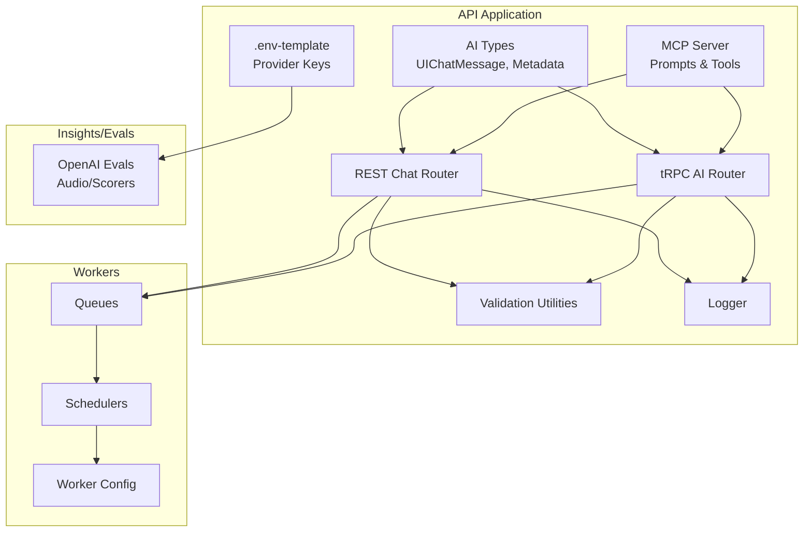
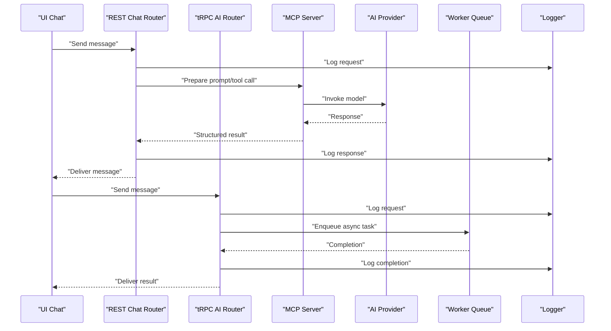
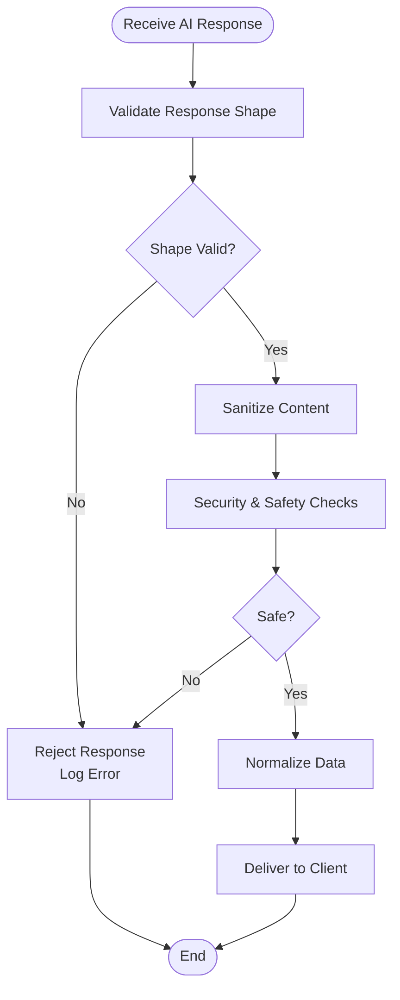
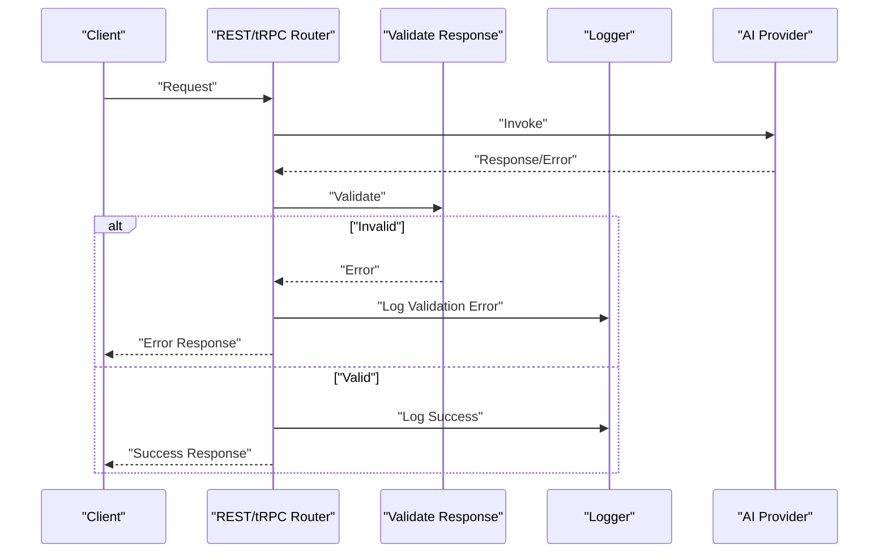
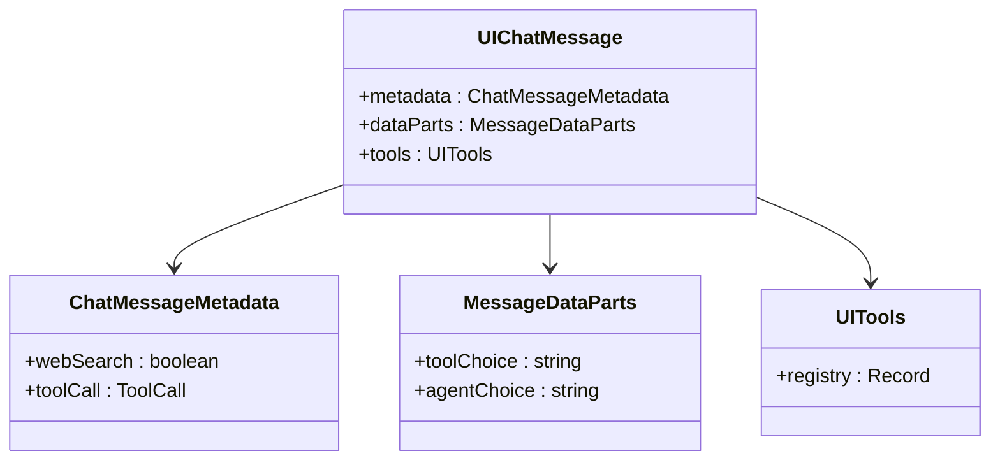
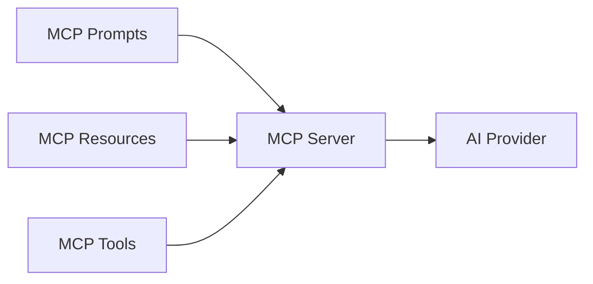
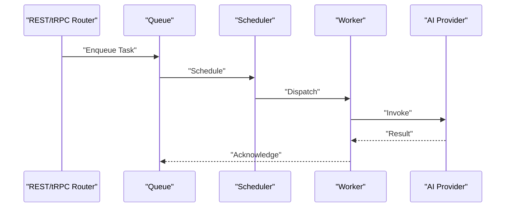
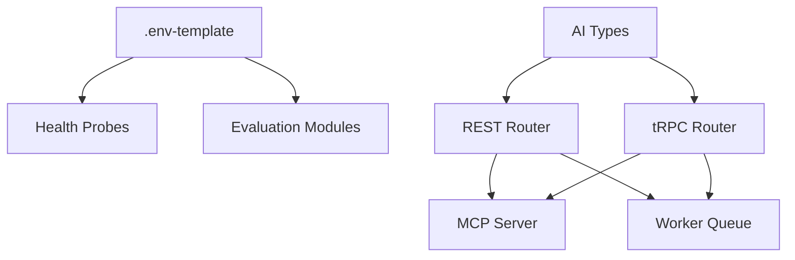

# AI Configuration & Management

<cite>
**Referenced Files in This Document**
- [types.ts](file://midday/apps/api/src/ai/types.ts)
- [.env-template](file://midday/apps/api/.env-template)
- [probes.ts](file://midday/packages/health/src/probes.ts)
- [generator.ts](file://midday/packages/insights/src/content/generator.ts)
- [audio.eval.ts](file://midday/packages/insights/evals/audio.eval.ts)
- [insight.eval.ts](file://midday/packages/insights/evals/insight.eval.ts)
- [audio-scorers.ts](file://midday/packages/insights/evals/audio-scorers.ts)
- [scorers.ts](file://midday/packages/insights/evals/scorers.ts)
- [validate-response.ts](file://midday/apps/api/src/utils/validate-response.ts)
- [logger.ts](file://midday/apps/api/src/utils/logger.ts)
- [rest/routers/chat.ts](file://midday/apps/api/src/rest/routers/chat.ts)
- [trpc/routers/ai.ts](file://midday/apps/api/src/trpc/routers/ai.ts)
- [schemas/chat.ts](file://midday/apps/api/src/schemas/chat.ts)
- [mcp/server.ts](file://midday/apps/api/src/mcp/server.ts)
- [mcp/prompts.ts](file://midday/apps/api/src/mcp/prompts.ts)
- [mcp/resources.ts](file://midday/apps/api/src/mcp/resources.ts)
- [mcp/tools/](file://midday/apps/api/src/mcp/tools/)
- [worker/queues/](file://midday/worker/src/queues/)
- [worker/utils/](file://midday/worker/src/utils/)
- [worker/schedulers/](file://midday/worker/src/schedulers/)
- [worker/config.ts](file://midday/worker/src/config.ts)
</cite>

## Table of Contents
1. [Introduction](#introduction)
2. [Project Structure](#project-structure)
3. [Core Components](#core-components)
4. [Architecture Overview](#architecture-overview)
5. [Detailed Component Analysis](#detailed-component-analysis)
6. [Dependency Analysis](#dependency-analysis)
7. [Performance Considerations](#performance-considerations)
8. [Troubleshooting Guide](#troubleshooting-guide)
9. [Conclusion](#conclusion)
10. [Appendices](#appendices)

## Introduction
This document describes the AI system configuration and management across the application. It covers provider configuration options, model selection criteria, API key management, validation frameworks for AI responses, error handling and fallback strategies, user context and preferences, personalization settings, best practices, performance tuning, monitoring, cost optimization, rate limiting, and quota management for supported AI providers.

## Project Structure
The AI system spans several areas:
- API application AI types and messaging contracts
- Environment configuration for multiple providers
- Health probes and evaluation modules using OpenAI
- Validation utilities for AI responses
- REST and tRPC routers for chat and AI interactions
- MCP (Model Context Protocol) server, prompts, and tools
- Worker queues and schedulers for background AI tasks
- Schemas for chat and related data models

**Diagram sources**
- [types.ts](file://midday/apps/api/src/ai/types.ts#L1-L27)
- [.env-template](file://midday/apps/api/.env-template#L42-L149)
- [validate-response.ts](file://midday/apps/api/src/utils/validate-response.ts)
- [logger.ts](file://midday/apps/api/src/utils/logger.ts)
- [rest/routers/chat.ts](file://midday/apps/api/src/rest/routers/chat.ts)
- [trpc/routers/ai.ts](file://midday/apps/api/src/trpc/routers/ai.ts)
- [mcp/server.ts](file://midday/apps/api/src/mcp/server.ts)
- [mcp/prompts.ts](file://midday/apps/api/src/mcp/prompts.ts)
- [mcp/resources.ts](file://midday/apps/api/src/mcp/resources.ts)
- [worker/queues/](file://midday/worker/src/queues/)
- [worker/schedulers/](file://midday/worker/src/schedulers/)
- [worker/config.ts](file://midday/worker/src/config.ts)
- [audio.eval.ts](file://midday/packages/insights/evals/audio.eval.ts#L1-L20)
- [scorers.ts](file://midday/packages/insights/evals/scorers.ts#L300-L320)
- [audio-scorers.ts](file://midday/packages/insights/evals/audio-scorers.ts#L400-L420)

**Section sources**
- [types.ts](file://midday/apps/api/src/ai/types.ts#L1-L27)
- [.env-template](file://midday/apps/api/.env-template#L42-L149)

## Core Components
- AI message types define structured chat messages with metadata for tool calls and web search flags, enabling typed integrations with UI tool registries.
- Provider configuration keys are centralized in environment templates for OpenAI, Google Generative AI, Mistral, and Anthropic.
- Health probes and evaluation modules demonstrate OpenAI usage patterns and API key sourcing.
- Validation utilities and logging provide response validation and observability.
- REST and tRPC routers expose chat and AI endpoints.
- MCP server, prompts, and tools enable structured model interactions.
- Worker queues and schedulers orchestrate background AI tasks.
- Schemas define chat and related data contracts.

**Section sources**
- [types.ts](file://midday/apps/api/src/ai/types.ts#L1-L27)
- [.env-template](file://midday/apps/api/.env-template#L42-L149)
- [probes.ts](file://midday/packages/health/src/probes.ts#L250-L270)
- [audio.eval.ts](file://midday/packages/insights/evals/audio.eval.ts#L1-L20)
- [validate-response.ts](file://midday/apps/api/src/utils/validate-response.ts)
- [logger.ts](file://midday/apps/api/src/utils/logger.ts)
- [rest/routers/chat.ts](file://midday/apps/api/src/rest/routers/chat.ts)
- [trpc/routers/ai.ts](file://midday/apps/api/src/trpc/routers/ai.ts)
- [mcp/server.ts](file://midday/apps/api/src/mcp/server.ts)
- [mcp/prompts.ts](file://midday/apps/api/src/mcp/prompts.ts)
- [mcp/resources.ts](file://midday/apps/api/src/mcp/resources.ts)
- [worker/queues/](file://midday/worker/src/queues/)
- [worker/schedulers/](file://midday/worker/src/schedulers/)
- [worker/config.ts](file://midday/worker/src/config.ts)
- [schemas/chat.ts](file://midday/apps/api/src/schemas/chat.ts)

## Architecture Overview
The AI system integrates front-end UI chat with backend routers, validation/logging, MCP-based model interactions, and worker-based background processing. Provider keys are loaded from environment variables, and evaluation modules show OpenAI usage patterns.

**Diagram sources**
- [rest/routers/chat.ts](file://midday/apps/api/src/rest/routers/chat.ts)
- [trpc/routers/ai.ts](file://midday/apps/api/src/trpc/routers/ai.ts)
- [mcp/server.ts](file://midday/apps/api/src/mcp/server.ts)
- [logger.ts](file://midday/apps/api/src/utils/logger.ts)
- [worker/queues/](file://midday/worker/src/queues/)

## Detailed Component Analysis

### AI Provider Configuration Options
Supported providers and their configuration keys:
- OpenAI: OPENAI_API_KEY
- Google Generative AI: GOOGLE_GENERATIVE_AI_API_KEY
- Mistral: MISTRAL_API_KEY
- Anthropic: ANTHROPIC_API_KEY (present in template)

Configuration keys are defined in the API environment template. Health probes and evaluation modules demonstrate OpenAI usage patterns and API key sourcing.

**Section sources**
- [.env-template](file://midday/apps/api/.env-template#L42-L149)
- [probes.ts](file://midday/packages/health/src/probes.ts#L260-L260)
- [audio.eval.ts](file://midday/packages/insights/evals/audio.eval.ts#L15-L15)
- [insight.eval.ts](file://midday/packages/insights/evals/insight.eval.ts#L19-L19)
- [audio-scorers.ts](file://midday/packages/insights/evals/audio-scorers.ts#L410-L410)
- [scorers.ts](file://midday/packages/insights/evals/scorers.ts#L309-L309)

### Model Selection Criteria
Model selection is provider-specific and typically configured in client code or service wrappers. The repository demonstrates OpenAI usage in evaluation modules, indicating model choice is external to the provided files. For practical selection:
- Choose models aligned with task type (text, audio, embeddings).
- Consider latency, cost, and quality SLAs.
- Use provider SDKs to configure model parameters and safety settings.

[No sources needed since this section provides general guidance]

### API Key Management
API keys are loaded from environment variables and used by health probes and evaluation modules. Ensure:
- Keys are stored securely and rotated periodically.
- Access is restricted to authorized environments.
- Secrets are not committed to version control.

**Section sources**
- [.env-template](file://midday/apps/api/.env-template#L42-L149)
- [probes.ts](file://midday/packages/health/src/probes.ts#L260-L260)
- [audio.eval.ts](file://midday/packages/insights/evals/audio.eval.ts#L15-L15)
- [insight.eval.ts](file://midday/packages/insights/evals/insight.eval.ts#L19-L19)
- [audio-scorers.ts](file://midday/packages/insights/evals/audio-scorers.ts#L410-L410)
- [scorers.ts](file://midday/packages/insights/evals/scorers.ts#L309-L309)

### Validation Framework for AI Responses
AI responses are validated using a dedicated utility that ensures response shape and content meet expectations. This helps prevent downstream failures and maintains data integrity.

**Diagram sources**
- [validate-response.ts](file://midday/apps/api/src/utils/validate-response.ts)

**Section sources**
- [validate-response.ts](file://midday/apps/api/src/utils/validate-response.ts)

### Error Handling Strategies
Error handling combines logging and validation:
- Logging captures request and response metadata for diagnostics.
- Validation rejects malformed or unsafe responses.
- Health probes surface provider connectivity issues.

**Diagram sources**
- [validate-response.ts](file://midday/apps/api/src/utils/validate-response.ts)
- [logger.ts](file://midday/apps/api/src/utils/logger.ts)
- [rest/routers/chat.ts](file://midday/apps/api/src/rest/routers/chat.ts)
- [trpc/routers/ai.ts](file://midday/apps/api/src/trpc/routers/ai.ts)

**Section sources**
- [logger.ts](file://midday/apps/api/src/utils/logger.ts)
- [validate-response.ts](file://midday/apps/api/src/utils/validate-response.ts)
- [rest/routers/chat.ts](file://midday/apps/api/src/rest/routers/chat.ts)
- [trpc/routers/ai.ts](file://midday/apps/api/src/trpc/routers/ai.ts)

### Fallback Mechanisms
Fallback strategies can be implemented at multiple layers:
- Provider fallback: switch to alternate provider when primary fails.
- Model fallback: use smaller/lighter models for constrained environments.
- Tool fallback: degrade to simpler tools or disable advanced features.
- Retry with exponential backoff for transient errors.

[No sources needed since this section provides general guidance]

### User Context Management, Preferences, and Personalization
- Chat schemas define message and metadata contracts supporting tool choices and agent selections.
- UI chat message types encapsulate metadata for web search and tool calls, enabling personalized routing.
- Preferences can be stored per user and applied to model selection and tool invocation.

**Diagram sources**
- [types.ts](file://midday/apps/api/src/ai/types.ts#L7-L26)

**Section sources**
- [types.ts](file://midday/apps/api/src/ai/types.ts#L1-L27)
- [schemas/chat.ts](file://midday/apps/api/src/schemas/chat.ts)

### MCP Integration
The MCP server, prompts, and resources coordinate structured model interactions. Tools are organized under the MCP tools directory and integrated into the server pipeline.

**Diagram sources**
- [mcp/server.ts](file://midday/apps/api/src/mcp/server.ts)
- [mcp/prompts.ts](file://midday/apps/api/src/mcp/prompts.ts)
- [mcp/resources.ts](file://midday/apps/api/src/mcp/resources.ts)
- [mcp/tools/](file://midday/apps/api/src/mcp/tools/)

**Section sources**
- [mcp/server.ts](file://midday/apps/api/src/mcp/server.ts)
- [mcp/prompts.ts](file://midday/apps/api/src/mcp/prompts.ts)
- [mcp/resources.ts](file://midday/apps/api/src/mcp/resources.ts)
- [mcp/tools/](file://midday/apps/api/src/mcp/tools/)

### Worker-Based Background AI Processing
Background AI tasks are orchestrated via queues and schedulers, with worker configuration controlling concurrency and retry policies.

**Diagram sources**
- [worker/queues/](file://midday/worker/src/queues/)
- [worker/schedulers/](file://midday/worker/src/schedulers/)
- [worker/config.ts](file://midday/worker/src/config.ts)

**Section sources**
- [worker/queues/](file://midday/worker/src/queues/)
- [worker/schedulers/](file://midday/worker/src/schedulers/)
- [worker/config.ts](file://midday/worker/src/config.ts)

## Dependency Analysis
Provider usage is evident in health probes and evaluation modules, while configuration keys are centralized in the environment template. The AI types define contracts consumed by routers and MCP.

**Diagram sources**
- [.env-template](file://midday/apps/api/.env-template#L42-L149)
- [probes.ts](file://midday/packages/health/src/probes.ts#L260-L260)
- [audio.eval.ts](file://midday/packages/insights/evals/audio.eval.ts#L15-L15)
- [types.ts](file://midday/apps/api/src/ai/types.ts#L1-L27)
- [rest/routers/chat.ts](file://midday/apps/api/src/rest/routers/chat.ts)
- [trpc/routers/ai.ts](file://midday/apps/api/src/trpc/routers/ai.ts)
- [mcp/server.ts](file://midday/apps/api/src/mcp/server.ts)
- [worker/queues/](file://midday/worker/src/queues/)

**Section sources**
- [.env-template](file://midday/apps/api/.env-template#L42-L149)
- [probes.ts](file://midday/packages/health/src/probes.ts#L260-L260)
- [audio.eval.ts](file://midday/packages/insights/evals/audio.eval.ts#L15-L15)
- [types.ts](file://midday/apps/api/src/ai/types.ts#L1-L27)
- [rest/routers/chat.ts](file://midday/apps/api/src/rest/routers/chat.ts)
- [trpc/routers/ai.ts](file://midday/apps/api/src/trpc/routers/ai.ts)
- [mcp/server.ts](file://midday/apps/api/src/mcp/server.ts)
- [worker/queues/](file://midday/worker/src/queues/)

## Performance Considerations
- Select appropriate models for the workload to balance latency and accuracy.
- Use streaming responses where supported to improve perceived performance.
- Apply caching for repeated prompts and reduce redundant provider calls.
- Monitor queue depths and worker throughput to prevent backlog.
- Tune retry delays and backoff strategies to handle provider throttling gracefully.

[No sources needed since this section provides general guidance]

## Troubleshooting Guide
Common issues and remedies:
- Missing or invalid API keys: Verify environment variables and permissions.
- Validation failures: Inspect response shapes and sanitize inputs.
- Provider timeouts or rate limits: Implement retries with exponential backoff and fallbacks.
- Logging and observability: Use structured logs to trace requests and responses.

**Section sources**
- [validate-response.ts](file://midday/apps/api/src/utils/validate-response.ts)
- [logger.ts](file://midday/apps/api/src/utils/logger.ts)
- [probes.ts](file://midday/packages/health/src/probes.ts#L260-L260)

## Conclusion
The AI system integrates provider configuration, validation, logging, MCP-based interactions, and worker-backed processing. Centralized environment configuration supports multiple providers, while schemas and types ensure robust message handling. Implementing provider fallbacks, performance tuning, and comprehensive monitoring will enhance reliability and cost-efficiency.

[No sources needed since this section summarizes without analyzing specific files]

## Appendices

### Configuration Best Practices
- Store secrets in environment variables and restrict access.
- Use distinct keys per environment (dev/staging/production).
- Rotate keys regularly and monitor for leaks.
- Document provider-specific model capabilities and constraints.

**Section sources**
- [.env-template](file://midday/apps/api/.env-template#L42-L149)

### Monitoring Approaches
- Track request/response latencies and error rates.
- Observe queue sizes and worker utilization.
- Log provider-specific metrics (tokens, requests, costs).
- Alert on sustained errors or quota nearing limits.

[No sources needed since this section provides general guidance]

### Cost Optimization, Rate Limiting, and Quota Management
- Prefer lower-cost models for non-critical tasks.
- Implement request batching and caching to reduce calls.
- Enforce rate limits at gateway and per-provider.
- Set quotas and alerts for provider spending caps.

[No sources needed since this section provides general guidance]