# AI/ML Integration

<cite>
**Referenced Files in This Document**
- [types.ts](file://midday/apps/api/src/ai/types.ts)
- [shared.ts](file://midday/apps/api/src/ai/agents/config/shared.ts)
- [main.ts](file://midday/apps/api/src/ai/agents/main.ts)
- [analytics.ts](file://midday/apps/api/src/ai/agents/analytics.ts)
- [customers.ts](file://midday/apps/api/src/ai/agents/customers.ts)
- [general.ts](file://midday/apps/api/src/ai/agents/general.ts)
- [invoices.ts](file://midday/apps/api/src/ai/agents/invoices.ts)
- [operations.ts](file://midday/apps/api/src/ai/agents/operations.ts)
- [index.ts](file://midday/apps/api/src/mcp/index.ts)
- [prompts.ts](file://midday/apps/api/src/mcp/prompts.ts)
- [resources.ts](file://midday/apps/api/src/mcp/resources.ts)
- [server.ts](file://midday/apps/api/src/mcp/server.ts)
- [types.ts](file://midday/apps/api/src/mcp/types.ts)
- [generate-test-insight.ts](file://midday/worker/scripts/generate-test-insight.ts)
- [README.md](file://midday/docs/document-processing.md)
</cite>

## Table of Contents
1. [Introduction](#introduction)
2. [Project Structure](#project-structure)
3. [Core Components](#core-components)
4. [Architecture Overview](#architecture-overview)
5. [Detailed Component Analysis](#detailed-component-analysis)
6. [Dependency Analysis](#dependency-analysis)
7. [Performance Considerations](#performance-considerations)
8. [Troubleshooting Guide](#troubleshooting-guide)
9. [Conclusion](#conclusion)
10. [Appendices](#appendices)

## Introduction
This document explains Faworra’s AI and machine learning integration, focusing on the AI agent framework, custom agent implementation patterns, tool integration system, Model Context Protocol (MCP) implementation, and the document processing pipeline. It also covers AI-powered features such as intelligent categorization, automated insights generation, document processing with OCR, and predictive analytics. Configuration options for AI providers, prompt engineering guidelines, quality assurance processes, and ethical AI considerations are included to guide responsible deployment and operation.

## Project Structure
The AI/ML capabilities are primarily implemented in the API application under the ai directory and integrated with MCP. Worker scripts handle background AI tasks such as generating test insights. The structure supports modular agent development, tool registries, and provider-agnostic configurations.

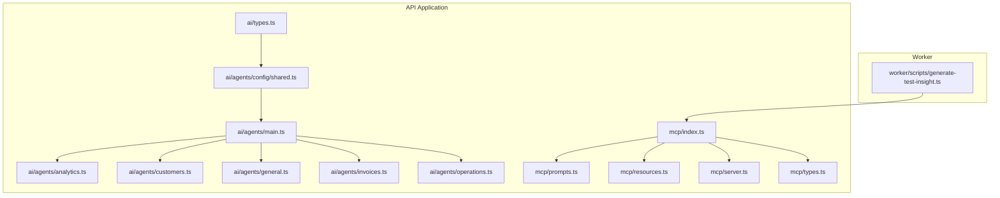

**Diagram sources**
- [types.ts](file://midday/apps/api/src/ai/types.ts#L1-L27)
- [shared.ts](file://midday/apps/api/src/ai/agents/config/shared.ts#L1-L200)
- [main.ts](file://midday/apps/api/src/ai/agents/main.ts#L1-L200)
- [analytics.ts](file://midday/apps/api/src/ai/agents/analytics.ts#L1-L200)
- [customers.ts](file://midday/apps/api/src/ai/agents/customers.ts#L1-L200)
- [general.ts](file://midday/apps/api/src/ai/agents/general.ts#L1-L200)
- [invoices.ts](file://midday/apps/api/src/ai/agents/invoices.ts#L1-L200)
- [operations.ts](file://midday/apps/api/src/ai/agents/operations.ts#L1-L200)
- [index.ts](file://midday/apps/api/src/mcp/index.ts#L1-L200)
- [prompts.ts](file://midday/apps/api/src/mcp/prompts.ts#L1-L200)
- [resources.ts](file://midday/apps/api/src/mcp/resources.ts#L1-L200)
- [server.ts](file://midday/apps/api/src/mcp/server.ts#L1-L200)
- [types.ts](file://midday/apps/api/src/mcp/types.ts#L1-L200)
- [generate-test-insight.ts](file://midday/worker/scripts/generate-test-insight.ts#L1-L200)

**Section sources**
- [types.ts](file://midday/apps/api/src/ai/types.ts#L1-L27)
- [shared.ts](file://midday/apps/api/src/ai/agents/config/shared.ts#L1-L200)
- [main.ts](file://midday/apps/api/src/ai/agents/main.ts#L1-L200)
- [index.ts](file://midday/apps/api/src/mcp/index.ts#L1-L200)

## Core Components
- AI Agent Framework: Defines agent creation, configuration, and context formatting utilities. Agents are provider-agnostic and integrate with tool registries.
- Custom Agent Implementations: Specialized agents for analytics, customers, general assistance, invoices, and operations, each selecting relevant tools and orchestrating workflows.
- Tool Integration System: Tools encapsulate domain-specific actions (e.g., retrieving financial data, performing web search) and are invoked by agents.
- Model Context Protocol (MCP): Provides a standardized interface for model interactions, prompts, resources, and server-side orchestration.
- Document Processing Pipeline: Supports OCR and structured extraction for document insights and categorization.
- Predictive Analytics: Includes tools for cash flow stress testing and business health scoring.

**Section sources**
- [shared.ts](file://midday/apps/api/src/ai/agents/config/shared.ts#L1-L200)
- [analytics.ts](file://midday/apps/api/src/ai/agents/analytics.ts#L1-L200)
- [customers.ts](file://midday/apps/api/src/ai/agents/customers.ts#L1-L200)
- [general.ts](file://midday/apps/api/src/ai/agents/general.ts#L1-L200)
- [invoices.ts](file://midday/apps/api/src/ai/agents/invoices.ts#L1-L200)
- [operations.ts](file://midday/apps/api/src/ai/agents/operations.ts#L1-L200)
- [index.ts](file://midday/apps/api/src/mcp/index.ts#L1-L200)
- [prompts.ts](file://midday/apps/api/src/mcp/prompts.ts#L1-L200)
- [resources.ts](file://midday/apps/api/src/mcp/resources.ts#L1-L200)
- [server.ts](file://midday/apps/api/src/mcp/server.ts#L1-L200)
- [types.ts](file://midday/apps/api/src/mcp/types.ts#L1-L200)
- [generate-test-insight.ts](file://midday/worker/scripts/generate-test-insight.ts#L1-L200)

## Architecture Overview
The AI system is built around an agent-centric architecture with a shared configuration module that initializes providers and memory. Agents compose tools to fulfill user intents, while MCP provides a protocol for model interactions and resource management. Worker scripts augment the system with background AI tasks.

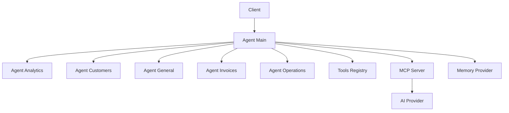

**Diagram sources**
- [main.ts](file://midday/apps/api/src/ai/agents/main.ts#L1-L200)
- [shared.ts](file://midday/apps/api/src/ai/agents/config/shared.ts#L1-L200)
- [analytics.ts](file://midday/apps/api/src/ai/agents/analytics.ts#L1-L200)
- [customers.ts](file://midday/apps/api/src/ai/agents/customers.ts#L1-L200)
- [general.ts](file://midday/apps/api/src/ai/agents/general.ts#L1-L200)
- [invoices.ts](file://midday/apps/api/src/ai/agents/invoices.ts#L1-L200)
- [operations.ts](file://midday/apps/api/src/ai/agents/operations.ts#L1-L200)
- [index.ts](file://midday/apps/api/src/mcp/index.ts#L1-L200)
- [server.ts](file://midday/apps/api/src/mcp/server.ts#L1-L200)

## Detailed Component Analysis

### AI Agent Framework
The agent framework centralizes provider initialization, memory management, and context formatting. It exposes utilities to create agents and format context for LLM consumption. This enables consistent behavior across specialized agents.

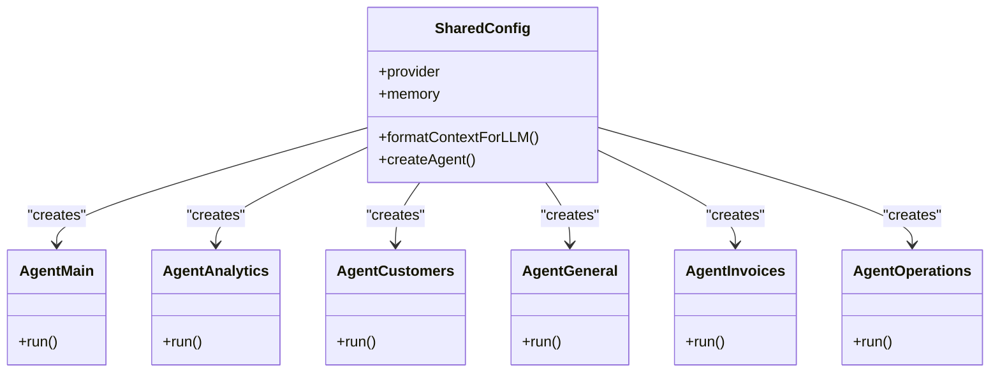

**Diagram sources**
- [shared.ts](file://midday/apps/api/src/ai/agents/config/shared.ts#L1-L200)
- [main.ts](file://midday/apps/api/src/ai/agents/main.ts#L1-L200)
- [analytics.ts](file://midday/apps/api/src/ai/agents/analytics.ts#L1-L200)
- [customers.ts](file://midday/apps/api/src/ai/agents/customers.ts#L1-L200)
- [general.ts](file://midday/apps/api/src/ai/agents/general.ts#L1-L200)
- [invoices.ts](file://midday/apps/api/src/ai/agents/invoices.ts#L1-L200)
- [operations.ts](file://midday/apps/api/src/ai/agents/operations.ts#L1-L200)

**Section sources**
- [shared.ts](file://midday/apps/api/src/ai/agents/config/shared.ts#L1-L200)
- [main.ts](file://midday/apps/api/src/ai/agents/main.ts#L1-L200)

### Custom Agent Implementations
Each agent specializes in a domain area and selects appropriate tools to fulfill requests. They share the same configuration and memory infrastructure but differ in tool selection and orchestration logic.

- Analytics Agent: Integrates predictive analytics tools for financial insights.
- Customers Agent: Focuses on customer-related queries and data retrieval.
- General Agent: Handles broad assistant-style tasks and web search.
- Invoices Agent: Manages invoice-related operations.
- Operations Agent: Coordinates operational data retrieval and transformations.

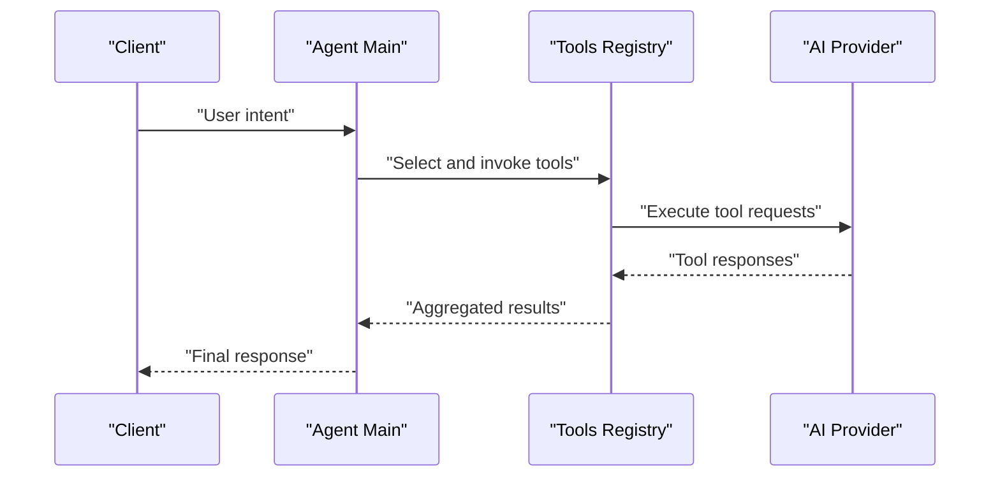

**Diagram sources**
- [main.ts](file://midday/apps/api/src/ai/agents/main.ts#L1-L200)
- [analytics.ts](file://midday/apps/api/src/ai/agents/analytics.ts#L1-L200)
- [customers.ts](file://midday/apps/api/src/ai/agents/customers.ts#L1-L200)
- [general.ts](file://midday/apps/api/src/ai/agents/general.ts#L1-L200)
- [invoices.ts](file://midday/apps/api/src/ai/agents/invoices.ts#L1-L200)
- [operations.ts](file://midday/apps/api/src/ai/agents/operations.ts#L1-L200)

**Section sources**
- [analytics.ts](file://midday/apps/api/src/ai/agents/analytics.ts#L1-L200)
- [customers.ts](file://midday/apps/api/src/ai/agents/customers.ts#L1-L200)
- [general.ts](file://midday/apps/api/src/ai/agents/general.ts#L1-L200)
- [invoices.ts](file://midday/apps/api/src/ai/agents/invoices.ts#L1-L200)
- [operations.ts](file://midday/apps/api/src/ai/agents/operations.ts#L1-L200)

### Tool Integration System
Tools encapsulate domain-specific actions and are invoked by agents. Examples include retrieving business health scores, performing cash flow stress tests, fetching customer and invoice data, and conducting web searches. This modular design allows easy extension and maintenance.

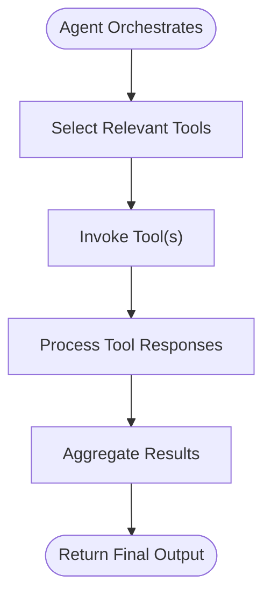

**Diagram sources**
- [analytics.ts](file://midday/apps/api/src/ai/agents/analytics.ts#L1-L200)
- [general.ts](file://midday/apps/api/src/ai/agents/general.ts#L1-L200)
- [customers.ts](file://midday/apps/api/src/ai/agents/customers.ts#L1-L200)
- [invoices.ts](file://midday/apps/api/src/ai/agents/invoices.ts#L1-L200)
- [operations.ts](file://midday/apps/api/src/ai/agents/operations.ts#L1-L200)

**Section sources**
- [analytics.ts](file://midday/apps/api/src/ai/agents/analytics.ts#L1-L200)
- [general.ts](file://midday/apps/api/src/ai/agents/general.ts#L1-L200)
- [customers.ts](file://midday/apps/api/src/ai/agents/customers.ts#L1-L200)
- [invoices.ts](file://midday/apps/api/src/ai/agents/invoices.ts#L1-L200)
- [operations.ts](file://midday/apps/api/src/ai/agents/operations.ts#L1-L200)

### Model Context Protocol (MCP) Implementation
MCP provides a standardized interface for model interactions, including prompts, resources, and server orchestration. It enables consistent behavior across different AI providers and facilitates extensibility.

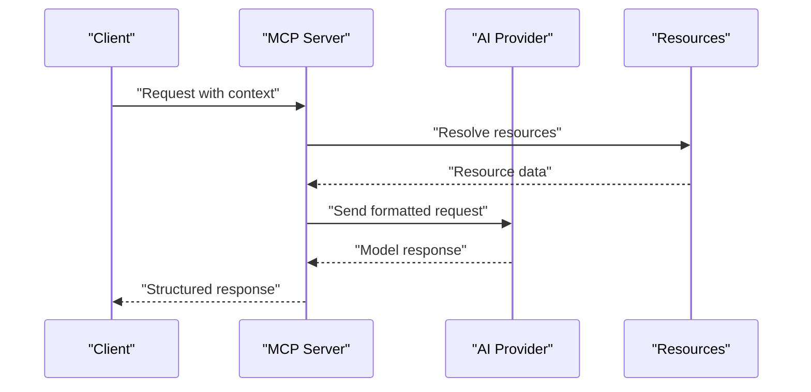

**Diagram sources**
- [index.ts](file://midday/apps/api/src/mcp/index.ts#L1-L200)
- [prompts.ts](file://midday/apps/api/src/mcp/prompts.ts#L1-L200)
- [resources.ts](file://midday/apps/api/src/mcp/resources.ts#L1-L200)
- [server.ts](file://midday/apps/api/src/mcp/server.ts#L1-L200)
- [types.ts](file://midday/apps/api/src/mcp/types.ts#L1-L200)

**Section sources**
- [index.ts](file://midday/apps/api/src/mcp/index.ts#L1-L200)
- [prompts.ts](file://midday/apps/api/src/mcp/prompts.ts#L1-L200)
- [resources.ts](file://midday/apps/api/src/mcp/resources.ts#L1-L200)
- [server.ts](file://midday/apps/api/src/mcp/server.ts#L1-L200)
- [types.ts](file://midday/apps/api/src/mcp/types.ts#L1-L200)

### AI Artifact Generation and Storage
Artifacts generated by AI workflows are stored and managed via the MCP server and associated resources. This ensures traceability and reusability of AI outputs.

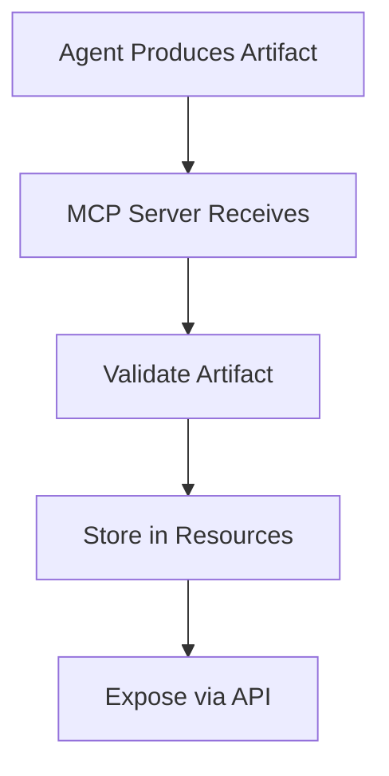

**Diagram sources**
- [server.ts](file://midday/apps/api/src/mcp/server.ts#L1-L200)
- [resources.ts](file://midday/apps/api/src/mcp/resources.ts#L1-L200)

**Section sources**
- [server.ts](file://midday/apps/api/src/mcp/server.ts#L1-L200)
- [resources.ts](file://midday/apps/api/src/mcp/resources.ts#L1-L200)

### Document Processing Pipeline
The document processing pipeline integrates OCR and structured extraction to support intelligent categorization and automated insights. Documentation outlines the end-to-end flow for processing documents and deriving insights.

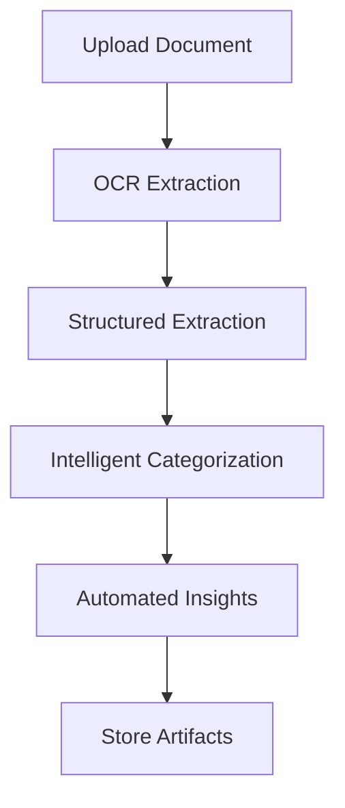

**Diagram sources**
- [README.md](file://midday/docs/document-processing.md#L1-L200)

**Section sources**
- [README.md](file://midday/docs/document-processing.md#L1-L200)

### Predictive Analytics
Predictive analytics tools include cash flow stress testing and business health scoring. These tools are integrated into the analytics agent to provide forward-looking insights.

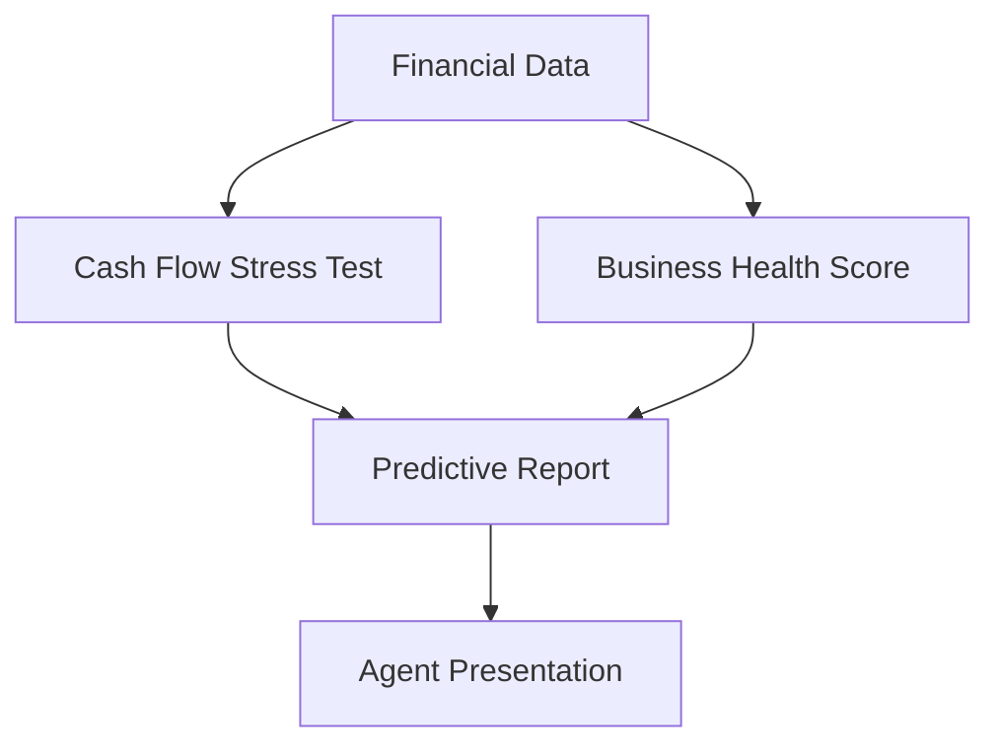

**Diagram sources**
- [analytics.ts](file://midday/apps/api/src/ai/agents/analytics.ts#L1-L200)

**Section sources**
- [analytics.ts](file://midday/apps/api/src/ai/agents/analytics.ts#L1-L200)

### Background AI Tasks with Worker Scripts
Worker scripts augment the system with background AI tasks such as generating test insights, ensuring scalable and asynchronous processing.

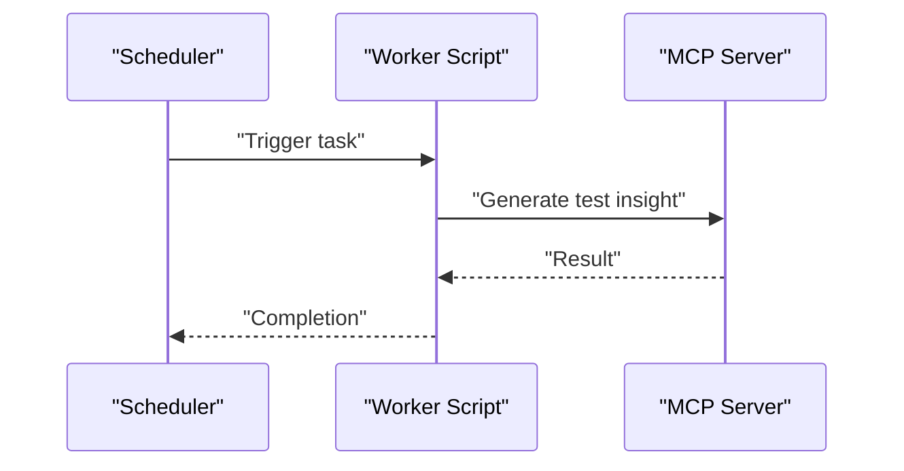

**Diagram sources**
- [generate-test-insight.ts](file://midday/worker/scripts/generate-test-insight.ts#L1-L200)

**Section sources**
- [generate-test-insight.ts](file://midday/worker/scripts/generate-test-insight.ts#L1-L200)

## Dependency Analysis
The AI system exhibits low coupling between agents and high cohesion within each agent’s tool selection. MCP acts as a central coordinator for model interactions and resource management. Provider and memory abstractions enable flexible configuration across environments.

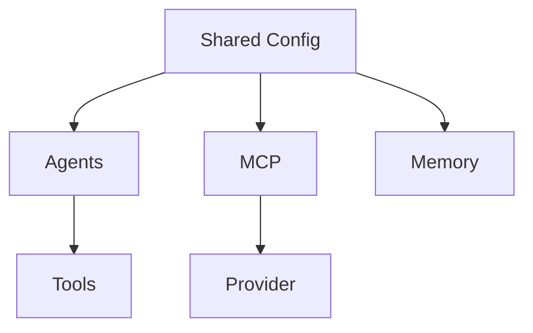

**Diagram sources**
- [shared.ts](file://midday/apps/api/src/ai/agents/config/shared.ts#L1-L200)
- [main.ts](file://midday/apps/api/src/ai/agents/main.ts#L1-L200)
- [index.ts](file://midday/apps/api/src/mcp/index.ts#L1-L200)

**Section sources**
- [shared.ts](file://midday/apps/api/src/ai/agents/config/shared.ts#L1-L200)
- [main.ts](file://midday/apps/api/src/ai/agents/main.ts#L1-L200)
- [index.ts](file://midday/apps/api/src/mcp/index.ts#L1-L200)

## Performance Considerations
- Provider Abstraction: Centralized provider initialization reduces overhead and simplifies switching between providers.
- Memory Management: Memory provider integration supports caching and session persistence, improving response times.
- Asynchronous Workflows: Worker scripts offload heavy computations, preventing blocking of primary API routes.
- Context Formatting: Efficient context formatting minimizes token usage and latency.

[No sources needed since this section provides general guidance]

## Troubleshooting Guide
- Provider Initialization Failures: Verify provider credentials and network connectivity. Check logs for initialization errors.
- Tool Invocation Errors: Inspect tool parameters and resource availability. Confirm tool registration and permissions.
- MCP Communication Issues: Validate MCP server configuration and resource resolution. Ensure prompts and resources are correctly defined.
- Memory Provider Problems: Confirm memory provider configuration and connection. Review cache policies and TTL settings.
- Worker Task Failures: Monitor worker logs and retry mechanisms. Validate scheduled triggers and MCP integration.

**Section sources**
- [shared.ts](file://midday/apps/api/src/ai/agents/config/shared.ts#L1-L200)
- [index.ts](file://midday/apps/api/src/mcp/index.ts#L1-L200)
- [server.ts](file://midday/apps/api/src/mcp/server.ts#L1-L200)
- [generate-test-insight.ts](file://midday/worker/scripts/generate-test-insight.ts#L1-L200)

## Conclusion
Faworra’s AI/ML integration centers on a robust agent framework, modular tool system, and standardized MCP protocol. The architecture supports scalable, provider-agnostic AI capabilities with strong emphasis on performance, maintainability, and extensibility. The document processing pipeline and predictive analytics further enhance the platform’s intelligence, while worker scripts ensure efficient background processing.

[No sources needed since this section summarizes without analyzing specific files]

## Appendices

### Configuration Options for AI Providers
- Provider Selection: Configure the AI provider through the shared configuration module to align with environment needs.
- Memory Provider: Enable memory provider integration for session persistence and caching.
- MCP Settings: Adjust MCP server configuration for prompts, resources, and model interactions.

**Section sources**
- [shared.ts](file://midday/apps/api/src/ai/agents/config/shared.ts#L1-L200)
- [index.ts](file://midday/apps/api/src/mcp/index.ts#L1-L200)
- [server.ts](file://midday/apps/api/src/mcp/server.ts#L1-L200)

### Prompt Engineering Guidelines
- Clarity and Specificity: Frame prompts to minimize ambiguity and align with desired outputs.
- Role Definition: Clearly define roles and responsibilities for agents and tools.
- Constraints and Boundaries: Include constraints to prevent hallucinations and ensure factual responses.
- Iterative Refinement: Continuously refine prompts based on performance and feedback.

[No sources needed since this section provides general guidance]

### Quality Assurance Processes
- Unit Testing: Validate individual tools and agents with targeted tests.
- Integration Testing: Ensure seamless coordination between agents, tools, and MCP.
- Load Testing: Assess performance under varying loads and concurrency.
- Monitoring and Observability: Track latency, error rates, and provider usage.

[No sources needed since this section provides general guidance]

### Ethical AI Considerations, Bias Mitigation, and Explainability
- Bias Mitigation: Regularly audit prompts and datasets to reduce bias. Diversify training data and monitor outcomes.
- Explainability: Provide explanations for AI decisions where feasible. Log tool choices and reasoning steps.
- Transparency: Maintain clear documentation of AI capabilities and limitations. Communicate ethical guidelines to users.
- Governance: Establish governance policies for AI usage, including oversight and redress mechanisms.

[No sources needed since this section provides general guidance]