# Document Processing & AI Tools

<cite>
**Referenced Files in This Document**
- [README.md](file://README.md)
- [document-processing.md](file://docs/document-processing.md)
- [types.ts](file://apps/api/src/ai/types.ts)
- [classifier.ts](file://packages/documents/src/classifier.ts)
- [process-document.ts](file://apps/worker/src/processors/documents/process-document.ts)
- [classify-document.ts](file://apps/worker/src/processors/documents/classify-document.ts)
- [classify-image.ts](file://apps/worker/src/processors/documents/classify-image.ts)
- [embed-document-tags.ts](file://apps/worker/src/processors/documents/embed-document-tags.ts)
- [documents.config.ts](file://apps/worker/src/queues/documents.config.ts)
- [image-processing.ts](file://apps/worker/src/utils/image-processing.ts)
- [document-update.ts](file://apps/worker/src/utils/document-update.ts)
- [error-classification.ts](file://apps/worker/src/utils/error-classification.ts)
- [timeout.ts](file://apps/worker/src/utils/timeout.ts)
- [documents.ts](file://apps/api/src/schemas/documents.ts)
- [tracker-entries.ts](file://apps/api/src/schemas/tracker-entries.ts)
- [transactions.ts](file://apps/api/src/schemas/transactions.ts)
- [documents.ts](file://apps/api/src/rest/routers/documents.ts)
- [vault-item.tsx](file://apps/dashboard/src/components/vault/vault-item.tsx)
- [columns.tsx](file://apps/dashboard/src/components/tables/vault/columns.tsx)
- [data-table.tsx](file://apps/dashboard/src/components/tables/vault/data-table.tsx)
</cite>

## Table of Contents
1. [Introduction](#introduction)
2. [Project Structure](#project-structure)
3. [Core Components](#core-components)
4. [Architecture Overview](#architecture-overview)
5. [Detailed Component Analysis](#detailed-component-analysis)
6. [Dependency Analysis](#dependency-analysis)
7. [Performance Considerations](#performance-considerations)
8. [Troubleshooting Guide](#troubleshooting-guide)
9. [Conclusion](#conclusion)

## Introduction
This document explains Faworra's AI-powered document processing and tool system. It covers intelligent document categorization, data extraction, OCR processing, and the AI tool framework for financial insights. It also documents the tool execution framework, parameter validation, result formatting, web search integration, tracker entry creation, and automated financial analysis workflows. Tool chaining patterns, error handling, and performance optimization for large-scale document processing are addressed.

## Project Structure
The system spans three main layers:
- Dashboard UI: File upload, status display, and retry controls
- API layer: tRPC routers and REST endpoints for document processing
- Worker layer: BullMQ queues orchestrating AI classification and enrichment

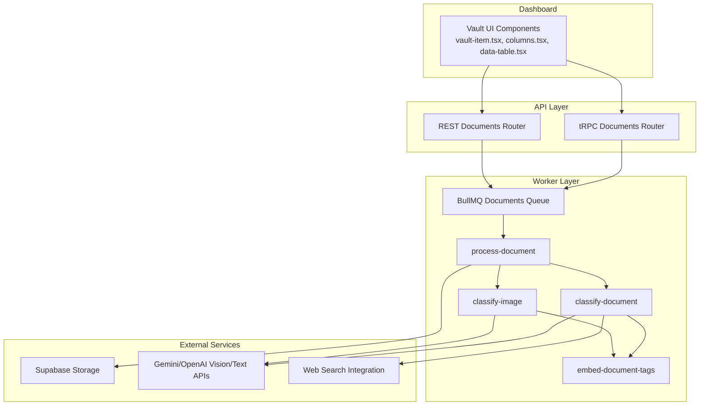

**Diagram sources**
- [vault-item.tsx](file://apps/dashboard/src/components/vault/vault-item.tsx)
- [columns.tsx](file://apps/dashboard/src/components/tables/vault/columns.tsx)
- [data-table.tsx](file://apps/dashboard/src/components/tables/vault/data-table.tsx)
- [documents.ts](file://apps/api/src/trpc/routers/documents.ts)
- [documents.ts](file://apps/api/src/rest/routers/documents.ts)
- [process-document.ts](file://apps/worker/src/processors/documents/process-document.ts)
- [classify-document.ts](file://apps/worker/src/processors/documents/classify-document.ts)
- [classify-image.ts](file://apps/worker/src/processors/documents/classify-image.ts)
- [embed-document-tags.ts](file://apps/worker/src/processors/documents/embed-document-tags.ts)

**Section sources**
- [README.md](file://README.md#L42-L75)

## Core Components
- Document Processing Pipeline: Automatic file ingestion, content extraction, AI classification, and metadata enrichment with graceful degradation
- AI Classification Engine: Vision and text models for titles, summaries, dates, and tags
- Tool Execution Framework: Typed tool messages, metadata propagation, and tool choice orchestration
- Financial Insights Tools: Account balances, cash flow analysis, expense tracking, revenue forecasting, and business insights
- Web Search Integration: Enrichment via external web search during analysis
- Tracker Entry Creation: Automated creation of tracker entries from processed documents
- Automated Workflows: End-to-end document-to-insights pipelines with retries and timeouts

**Section sources**
- [document-processing.md](file://docs/document-processing.md#L1-L17)
- [types.ts](file://apps/api/src/ai/types.ts#L1-L27)

## Architecture Overview
The system uses a queue-driven architecture with BullMQ to orchestrate document processing jobs. The pipeline supports both text and image documents, with dedicated classification steps and optional tag embeddings.

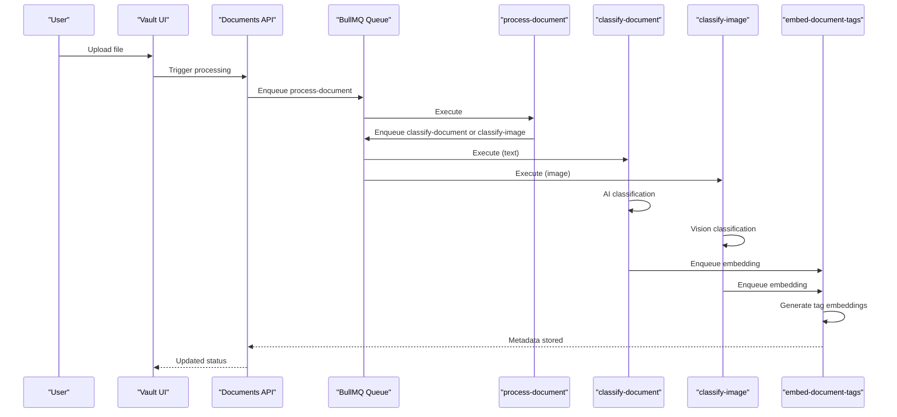

**Diagram sources**
- [process-document.ts](file://apps/worker/src/processors/documents/process-document.ts)
- [classify-document.ts](file://apps/worker/src/processors/documents/classify-document.ts)
- [classify-image.ts](file://apps/worker/src/processors/documents/classify-image.ts)
- [embed-document-tags.ts](file://apps/worker/src/processors/documents/embed-document-tags.ts)
- [documents.config.ts](file://apps/worker/src/queues/documents.config.ts)

## Detailed Component Analysis

### Document Processing Pipeline
The pipeline extracts content, classifies documents using AI, and generates searchable metadata. It guarantees graceful degradation so users can always access files and retry processing.

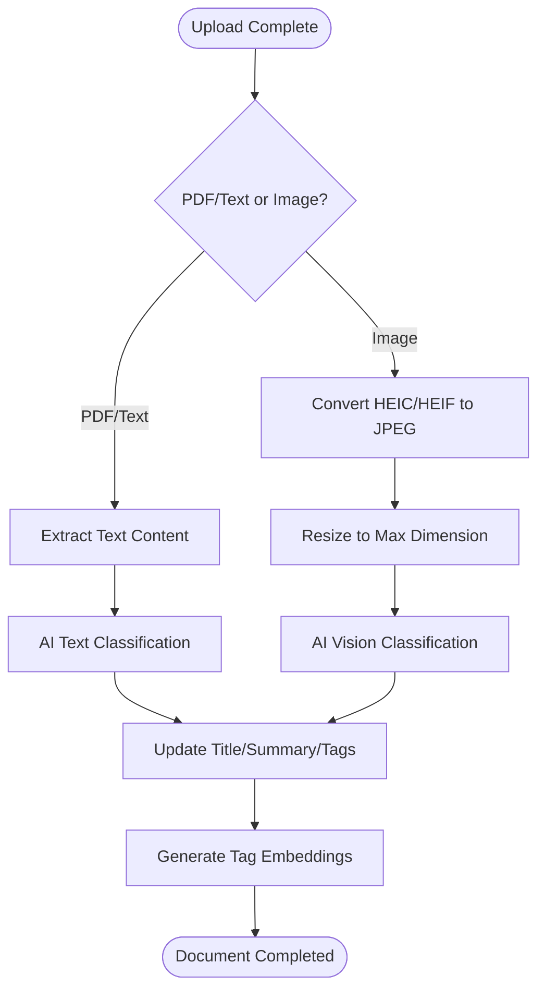

**Diagram sources**
- [document-processing.md](file://docs/document-processing.md#L125-L177)
- [image-processing.ts](file://apps/worker/src/utils/image-processing.ts)
- [classify-document.ts](file://apps/worker/src/processors/documents/classify-document.ts)
- [classify-image.ts](file://apps/worker/src/processors/documents/classify-image.ts)
- [embed-document-tags.ts](file://apps/worker/src/processors/documents/embed-document-tags.ts)

**Section sources**
- [document-processing.md](file://docs/document-processing.md#L1-L17)
- [document-processing.md](file://docs/document-processing.md#L125-L177)
- [document-processing.md](file://docs/document-processing.md#L179-L227)

### AI Classification Engine
The classification engine uses vision and text models to extract titles, summaries, dates, and tags. It supports timeouts and graceful degradation to ensure documents reach a usable state even if AI fails.

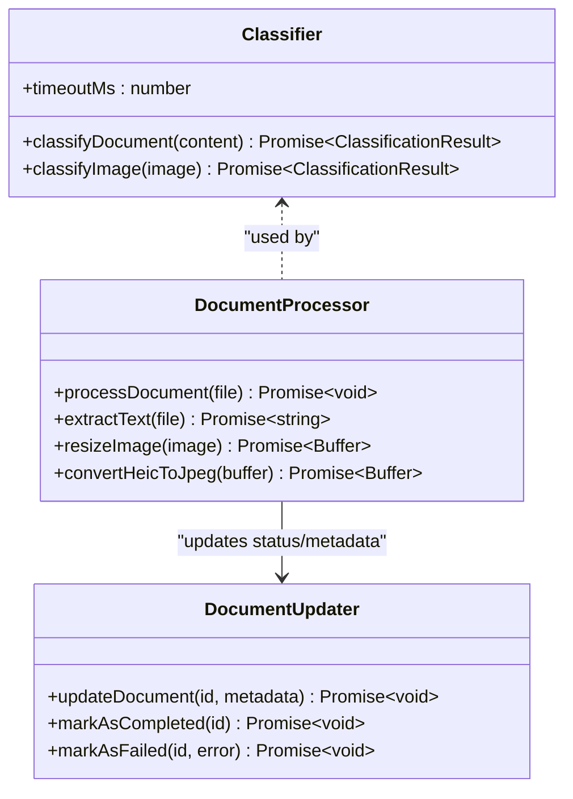

**Diagram sources**
- [classifier.ts](file://packages/documents/src/classifier.ts)
- [process-document.ts](file://apps/worker/src/processors/documents/process-document.ts)
- [document-update.ts](file://apps/worker/src/utils/document-update.ts)

**Section sources**
- [document-processing.md](file://docs/document-processing.md#L1-L17)
- [classifier.ts](file://packages/documents/src/classifier.ts)

### Tool Execution Framework and Message Metadata
The tool framework defines UI chat messages with metadata for tool calls and web search flags. This enables tool choice orchestration and metadata propagation across the system.

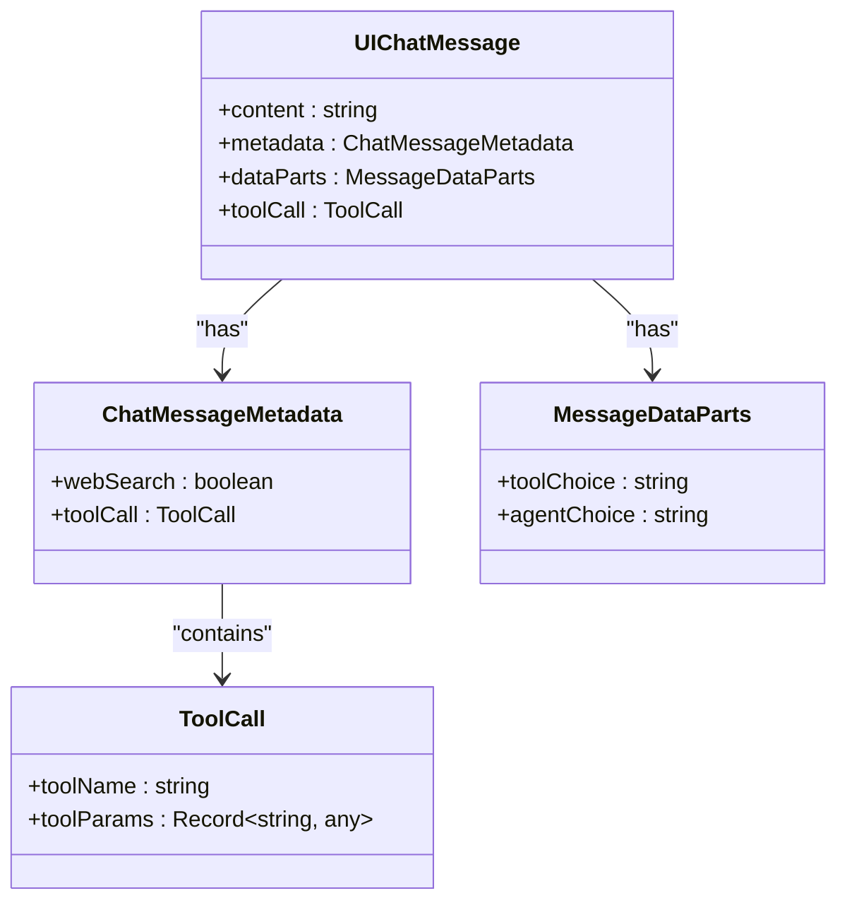

**Diagram sources**
- [types.ts](file://apps/api/src/ai/types.ts#L8-L26)

**Section sources**
- [types.ts](file://apps/api/src/ai/types.ts#L1-L27)

### Financial Data Retrieval Tools
Financial tools provide account balances, cash flow analysis, expense tracking, revenue forecasting, and business insights. These tools integrate with banking connections and accounting data.

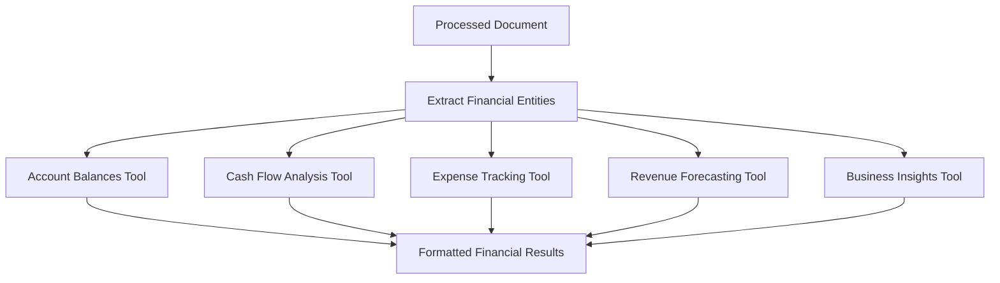

[No sources needed since this diagram shows conceptual workflow, not actual code structure]

### Web Search Integration
Web search integration enriches document analysis by fetching external context. The system flags messages with webSearch metadata to trigger external queries.

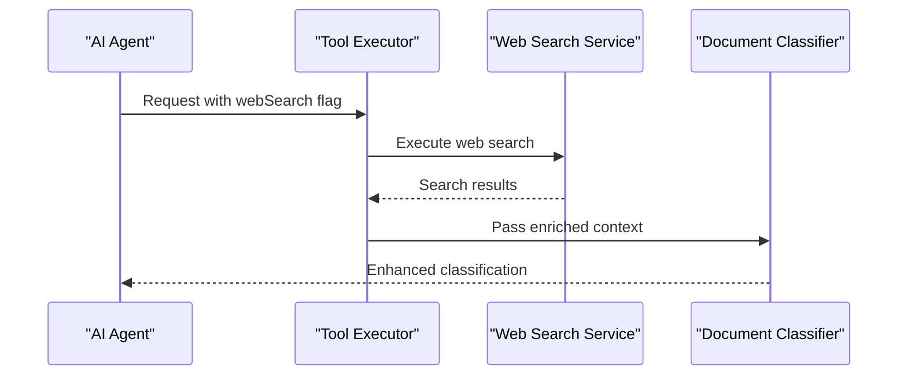

[No sources needed since this diagram shows conceptual workflow, not actual code structure]

### Tracker Entry Creation
Tracker entries are automatically created from processed documents, enabling time tracking and project attribution.

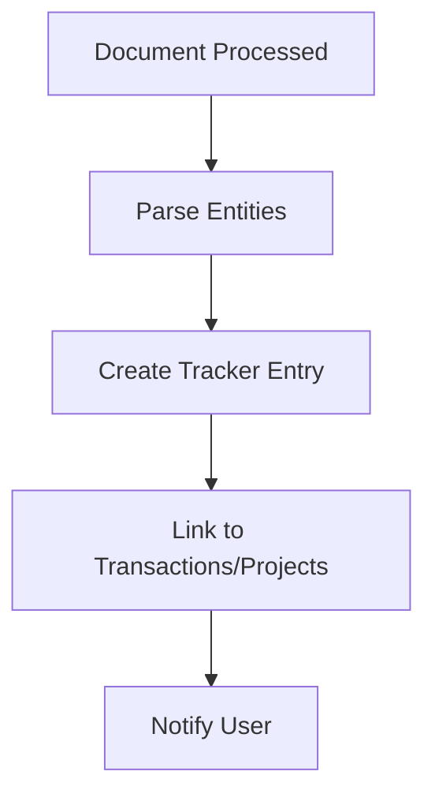

[No sources needed since this diagram shows conceptual workflow, not actual code structure]

### Automated Financial Analysis Workflows
Automated workflows chain tools to deliver end-to-end financial analysis from document ingestion to actionable insights.

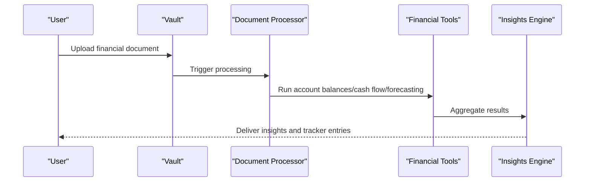

[No sources needed since this diagram shows conceptual workflow, not actual code structure]

## Dependency Analysis
The system exhibits layered dependencies with clear separation of concerns:
- UI depends on API for document operations
- API depends on Worker queues for background processing
- Worker depends on external AI services and storage
- Schemas define contracts for documents, tracker entries, and transactions

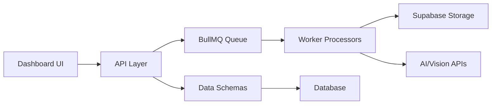

**Diagram sources**
- [documents.ts](file://apps/api/src/schemas/documents.ts)
- [tracker-entries.ts](file://apps/api/src/schemas/tracker-entries.ts)
- [transactions.ts](file://apps/api/src/schemas/transactions.ts)

**Section sources**
- [README.md](file://README.md#L62-L75)

## Performance Considerations
- Concurrency and Rate Limits: Queue concurrency is tuned to prevent API bursts and memory pressure
- Memory Optimization: Image processing caches and concurrency limits reduce memory footprint
- Timeouts: Hierarchical timeout configuration prevents premature job failures
- Graceful Degradation: Ensures documents remain accessible even if AI classification fails

**Section sources**
- [document-processing.md](file://docs/document-processing.md#L207-L234)
- [image-processing.ts](file://apps/worker/src/utils/image-processing.ts)
- [timeout.ts](file://apps/worker/src/utils/timeout.ts)

## Troubleshooting Guide
Common issues and resolutions:
- Unsupported File Types: Documents marked as completed without processing; users can retry
- AI Quota/Rate Limit Errors: Automatic retry with exponential backoff
- Timeout Failures: Parent jobs wait longer than child jobs to avoid false negatives
- Stale Processing: Documents pending beyond threshold show retry option in UI

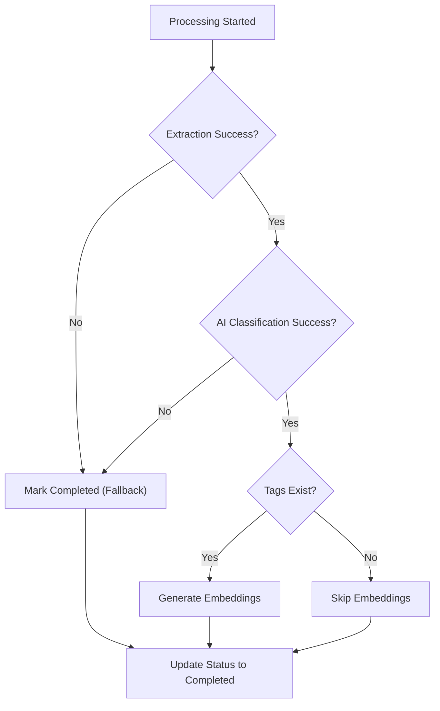

**Diagram sources**
- [document-processing.md](file://docs/document-processing.md#L249-L269)

**Section sources**
- [document-processing.md](file://docs/document-processing.md#L235-L294)
- [documents.config.ts](file://apps/worker/src/queues/documents.config.ts)
- [error-classification.ts](file://apps/worker/src/utils/error-classification.ts)

## Conclusion
Faworra's AI-powered document processing and tool system provides robust, scalable automation for financial document analysis. With graceful degradation, structured tool execution, and optimized performance, it delivers reliable insights while maintaining accessibility and user control.