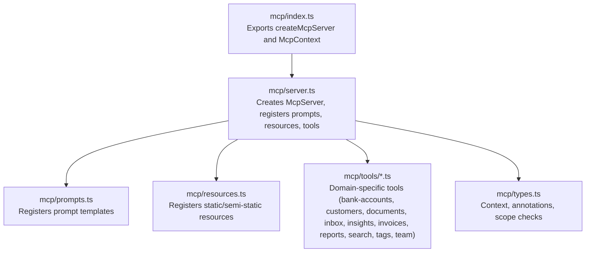
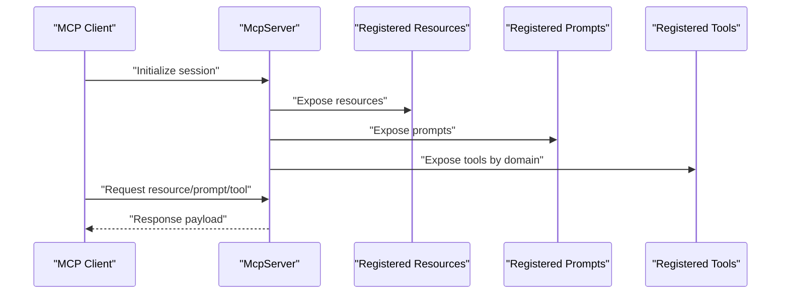
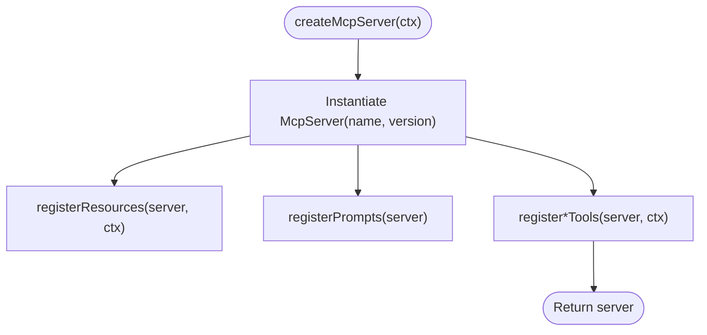
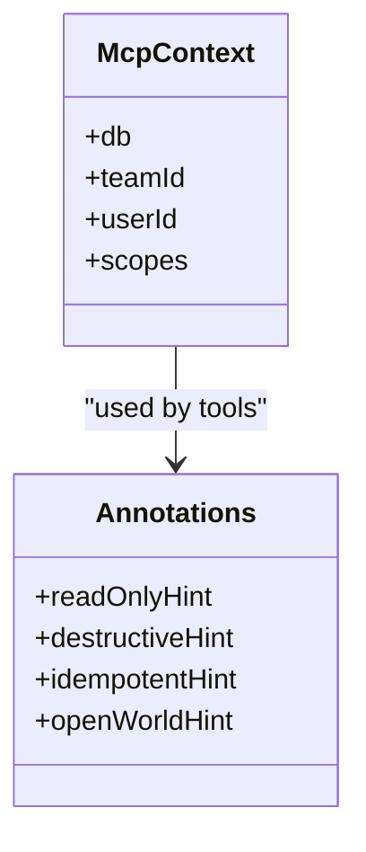
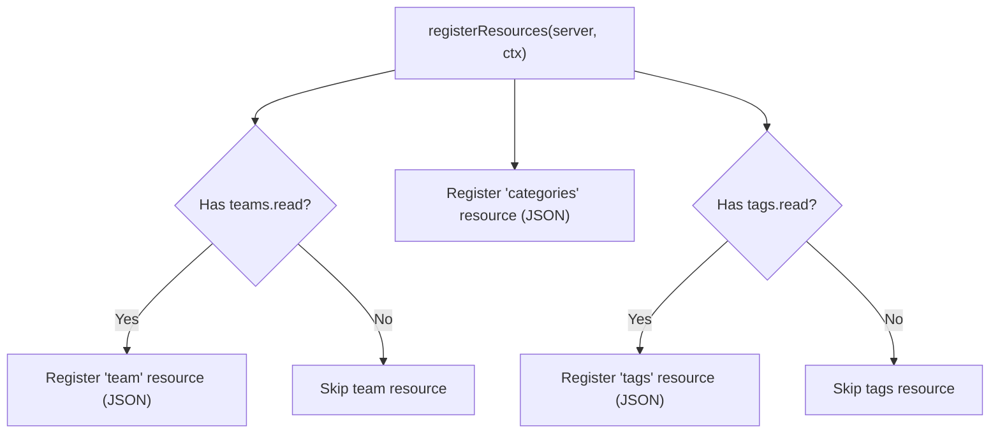
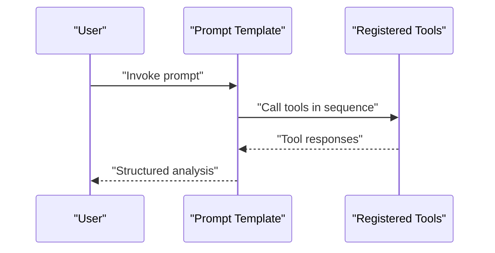
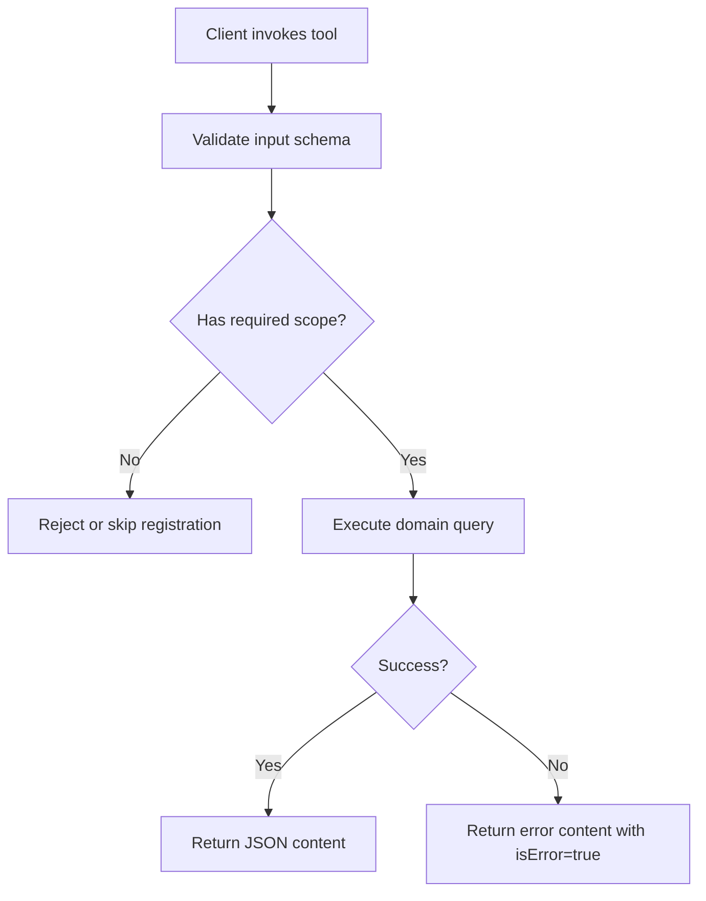
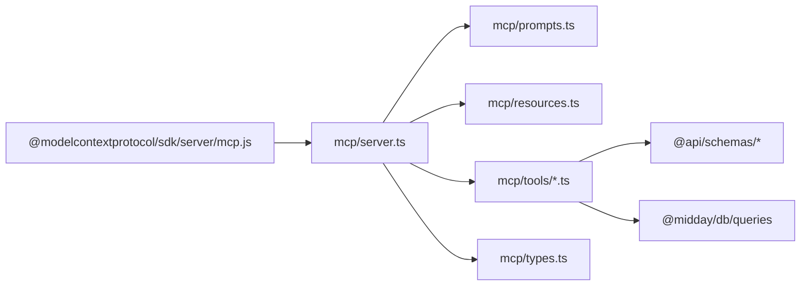

# Model Context Protocol (MCP)

<cite>
**Referenced Files in This Document**
- [index.ts](file://midday/apps/api/src/mcp/index.ts)
- [server.ts](file://midday/apps/api/src/mcp/server.ts)
- [types.ts](file://midday/apps/api/src/mcp/types.ts)
- [prompts.ts](file://midday/apps/api/src/mcp/prompts.ts)
- [resources.ts](file://midday/apps/api/src/mcp/resources.ts)
- [bank-accounts.ts](file://midday/apps/api/src/mcp/tools/bank-accounts.ts)
- [customers.ts](file://midday/apps/api/src/mcp/tools/customers.ts)
- [documents.ts](file://midday/apps/api/src/mcp/tools/documents.ts)
- [inbox.ts](file://midday/apps/api/src/mcp/tools/inbox.ts)
- [insights.ts](file://midday/apps/api/src/mcp/tools/insights.ts)
- [invoices.ts](file://midday/apps/api/src/mcp/tools/invoices.ts)
- [reports.ts](file://midday/apps/api/src/mcp/tools/reports.ts)
- [search.ts](file://midday/apps/api/src/mcp/tools/search.ts)
- [tags.ts](file://midday/apps/api/src/mcp/tools/tags.ts)
- [team.ts](file://midday/apps/api/src/mcp/tools/team.ts)
</cite>

## Table of Contents
1. [Introduction](#introduction)
2. [Project Structure](#project-structure)
3. [Core Components](#core-components)
4. [Architecture Overview](#architecture-overview)
5. [Detailed Component Analysis](#detailed-component-analysis)
6. [Dependency Analysis](#dependency-analysis)
7. [Performance Considerations](#performance-considerations)
8. [Troubleshooting Guide](#troubleshooting-guide)
9. [Conclusion](#conclusion)
10. [Appendices](#appendices)

## Introduction
This document describes Faworra’s Model Context Protocol (MCP) implementation within the API application. It explains the MCP server architecture, protocol registration model, resource management, and standardized tool interfaces across domains such as bank accounts, customers, documents, inbox, insights, invoices, reports, search, tags, team, and transactions. It also covers the prompt engineering system, resource discovery mechanisms, tool execution patterns, client integration considerations, protocol versioning, compatibility, security, rate limiting, and performance optimization strategies.

## Project Structure
The MCP implementation is organized under the API application’s MCP module. The primary entry exports the MCP server factory and context types. The server composes prompts, resources, and tools by domain.

**Diagram sources**
- [index.ts](file://midday/apps/api/src/mcp/index.ts#L1-L3)
- [server.ts](file://midday/apps/api/src/mcp/server.ts#L1-L48)
- [prompts.ts](file://midday/apps/api/src/mcp/prompts.ts#L1-L165)
- [resources.ts](file://midday/apps/api/src/mcp/resources.ts#L1-L80)
- [types.ts](file://midday/apps/api/src/mcp/types.ts#L1-L28)

**Section sources**
- [index.ts](file://midday/apps/api/src/mcp/index.ts#L1-L3)
- [server.ts](file://midday/apps/api/src/mcp/server.ts#L1-L48)

## Core Components
- McpContext: Holds database connection, team and user identifiers, and permission scopes. Used to gate tools and resources by scope.
- McpServer creation: Initializes the MCP server with a name and version, then registers resources, prompts, and tools.
- Tool registration pattern: Each domain registers read-only and write tools with Zod schemas and standardized annotations.
- Resource registration: Static or semi-static data exposed via resource URIs with MIME type metadata.
- Prompt templates: Predefined analyses that instruct the LLM to call specific tools in a prescribed order.

Key implementation references:
- Server creation and composition: [server.ts](file://midday/apps/api/src/mcp/server.ts#L20-L47)
- Context and annotations: [types.ts](file://midday/apps/api/src/mcp/types.ts#L5-L27)
- Resource registration: [resources.ts](file://midday/apps/api/src/mcp/resources.ts#L6-L79)
- Prompt registration: [prompts.ts](file://midday/apps/api/src/mcp/prompts.ts#L4-L164)

**Section sources**
- [server.ts](file://midday/apps/api/src/mcp/server.ts#L20-L47)
- [types.ts](file://midday/apps/api/src/mcp/types.ts#L5-L27)
- [resources.ts](file://midday/apps/api/src/mcp/resources.ts#L6-L79)
- [prompts.ts](file://midday/apps/api/src/mcp/prompts.ts#L4-L164)

## Architecture Overview
The MCP server follows a modular architecture:
- Central server orchestrator registers prompts, resources, and tools.
- Tools are grouped by domain and registered conditionally based on scope checks.
- Resources are registered once and exposed via stable URIs.
- Prompts define canonical workflows that guide tool invocation sequences.

**Diagram sources**
- [server.ts](file://midday/apps/api/src/mcp/server.ts#L20-L47)
- [resources.ts](file://midday/apps/api/src/mcp/resources.ts#L6-L79)
- [prompts.ts](file://midday/apps/api/src/mcp/prompts.ts#L4-L164)

## Detailed Component Analysis

### MCP Server and Composition
- Creates an MCP server instance with a product name and semantic version.
- Registers resources (team info, categories, tags) with appropriate scope gating.
- Registers prompt templates for common financial and operational analyses.
- Registers tools by domain, passing the McpContext to each registration function.

**Diagram sources**
- [server.ts](file://midday/apps/api/src/mcp/server.ts#L20-L47)

**Section sources**
- [server.ts](file://midday/apps/api/src/mcp/server.ts#L20-L47)

### Context, Scopes, and Annotations
- McpContext encapsulates database handle, team and user IDs, and scopes.
- hasScope checks required permissions before registering tools/resources.
- READ_ONLY_ANNOTATIONS annotate idempotent, non-destructive read operations.
- Write and destructive operations use explicit annotations to signal intent.

**Diagram sources**
- [types.ts](file://midday/apps/api/src/mcp/types.ts#L5-L27)

**Section sources**
- [types.ts](file://midday/apps/api/src/mcp/types.ts#L5-L27)

### Resource Management
- Team resource: Exposed when teams.read scope is present; returns team metadata as JSON.
- Categories resource: Exposed to all authenticated users; static category taxonomy.
- Tags resource: Exposed when tags.read scope is present; returns custom tags.

**Diagram sources**
- [resources.ts](file://midday/apps/api/src/mcp/resources.ts#L6-L79)

**Section sources**
- [resources.ts](file://midday/apps/api/src/mcp/resources.ts#L6-L79)

### Prompt Engineering System
- Financial Health Check: Guides collection of revenue, profit, burn rate, runway, spending, and invoice summary.
- Invoice Follow-up: Asks to list overdue/unpaid invoices, fetch details, customer info, and produce follow-up plans.
- Expense Analysis: Requests spending breakdown, expense classification, and actionable recommendations.
- Customer Insights: Aggregates customer lists, revenue per customer, and payment patterns.

**Diagram sources**
- [prompts.ts](file://midday/apps/api/src/mcp/prompts.ts#L4-L164)

**Section sources**
- [prompts.ts](file://midday/apps/api/src/mcp/prompts.ts#L4-L164)

### Standardized Tool Interfaces

#### Bank Accounts
- Tool: bank_accounts_list
- Scope requirement: bank-accounts.read
- Input schema: validated shape from bank-accounts schema
- Behavior: lists team bank accounts with balances and connection status

**Section sources**
- [bank-accounts.ts](file://midday/apps/api/src/mcp/tools/bank-accounts.ts#L1-L34)

#### Customers
- Tools:
  - customers_list (read)
  - customers_get (read)
  - customers_create (write)
  - customers_update (write)
  - customers_delete (destructive)
- Scope requirements: customers.read, customers.write
- Input schemas: derived from customers schema
- Behavior: CRUD operations with existence checks and error signaling

**Section sources**
- [customers.ts](file://midday/apps/api/src/mcp/tools/customers.ts#L32-L271)

#### Documents
- Tools:
  - documents_list (read)
  - documents_get (read)
- Scope requirement: documents.read
- Behavior: paginated listing and retrieval by ID

**Section sources**
- [documents.ts](file://midday/apps/api/src/mcp/tools/documents.ts#L1-L63)

#### Inbox
- Tools:
  - inbox_list (read)
  - inbox_get (read)
- Scope requirement: inbox.read
- Behavior: lists inbox items with filtering and retrieves item details

**Section sources**
- [inbox.ts](file://midday/apps/api/src/mcp/tools/inbox.ts#L1-L65)

#### Insights
- Tools:
  - insights_list (read)
  - insights_latest (read)
  - insights_get (read)
  - insights_by_period (read)
- Scope requirement: insights.read
- Behavior: paginated listing, latest, specific ID, and period-based retrieval

**Section sources**
- [insights.ts](file://midday/apps/api/src/mcp/tools/insights.ts#L15-L134)

#### Invoices
- Tools:
  - invoices_list (read)
  - invoices_get (read)
  - invoices_summary (read)
  - invoices_update (write)
  - invoices_mark_paid (write)
  - invoices_delete (destructive)
  - invoices_duplicate (write)
  - invoices_cancel (write)
- Scope requirements: invoices.read, invoices.write
- Behavior: comprehensive invoice lifecycle management with validations and status checks

**Section sources**
- [invoices.ts](file://midday/apps/api/src/mcp/tools/invoices.ts#L37-L415)

#### Reports
- Tools:
  - reports_revenue
  - reports_profit
  - reports_burn_rate
  - reports_runway
  - reports_expenses
  - reports_spending
  - reports_tax_summary
  - reports_growth_rate
  - reports_profit_margin
  - reports_cash_flow
  - reports_recurring_expenses
  - reports_revenue_forecast
  - reports_balance_sheet
- Scope requirement: reports.read
- Behavior: financial analytics across multiple KPIs and reporting types

**Section sources**
- [reports.ts](file://midday/apps/api/src/mcp/tools/reports.ts#L32-L349)

#### Search
- Tool: search_global
- Scope requirement: search.read
- Behavior: global search across invoices, transactions, customers, documents, and more

**Section sources**
- [search.ts](file://midday/apps/api/src/mcp/tools/search.ts#L1-L37)

#### Tags
- Tools:
  - tags_list (read)
  - tags_get (read)
- Scope requirement: tags.read
- Behavior: lists and retrieves tags

**Section sources**
- [tags.ts](file://midday/apps/api/src/mcp/tools/tags.ts#L1-L56)

#### Team
- Tools:
  - team_get (read)
  - team_members (read)
- Scope requirement: teams.read
- Behavior: retrieves team info and member list

**Section sources**
- [team.ts](file://midday/apps/api/src/mcp/tools/team.ts#L1-L53)

### Tool Execution Patterns
- Schema-driven inputs: Each tool defines a Zod schema for validation.
- Scope gating: Tools are registered only when the context has the required scope.
- Read-only vs write/destroy annotations: Tools declare idempotency and destructiveness to assist clients and servers in safe orchestration.
- Error handling: Tools return structured content and set isError flag when applicable.

**Diagram sources**
- [types.ts](file://midday/apps/api/src/mcp/types.ts#L25-L27)
- [customers.ts](file://midday/apps/api/src/mcp/tools/customers.ts#L186-L197)
- [invoices.ts](file://midday/apps/api/src/mcp/tools/invoices.ts#L262-L282)

## Dependency Analysis
- External SDK: The server relies on the MCP SDK to create and manage the server lifecycle.
- Internal schemas: Tools consume API schemas for input validation.
- Database queries: Tools delegate to domain-specific database query functions.
- Scope enforcement: Centralized via hasScope in types.

**Diagram sources**
- [server.ts](file://midday/apps/api/src/mcp/server.ts#L1-L18)
- [prompts.ts](file://midday/apps/api/src/mcp/prompts.ts#L1-L2)
- [resources.ts](file://midday/apps/api/src/mcp/resources.ts#L1-L4)
- [types.ts](file://midday/apps/api/src/mcp/types.ts#L1-L3)

**Section sources**
- [server.ts](file://midday/apps/api/src/mcp/server.ts#L1-L18)
- [types.ts](file://midday/apps/api/src/mcp/types.ts#L1-L10)

## Performance Considerations
- Pagination and limits: Many tools accept cursor and pageSize parameters to constrain result sets.
- Read-only optimization: Read-only tools are annotated as idempotent to enable caching and retry strategies.
- Batch-friendly designs: Resource URIs and prompt templates encourage batch retrieval patterns.
- Avoid unnecessary writes: Destructive and write operations are gated by explicit annotations and scopes.

[No sources needed since this section provides general guidance]

## Troubleshooting Guide
- Missing scope: If a tool does not appear, verify the context includes the required scope.
- Tool not found: Confirm the tool name matches the registered name and that the tool was registered under the correct domain.
- Validation errors: Ensure inputs conform to the tool’s Zod schema.
- Resource not available: Confirm the resource URI and that the context has the required scope.

**Section sources**
- [types.ts](file://midday/apps/api/src/mcp/types.ts#L25-L27)
- [customers.ts](file://midday/apps/api/src/mcp/tools/customers.ts#L186-L197)
- [invoices.ts](file://midday/apps/api/src/mcp/tools/invoices.ts#L262-L282)

## Conclusion
Faworra’s MCP implementation provides a robust, extensible framework for exposing financial and operational capabilities to LLM clients. The server composes prompts, resources, and domain-specific tools with strong scope-based access control and standardized annotations. This enables secure, predictable, and efficient integrations while maintaining clear separation of concerns across domains.

[No sources needed since this section summarizes without analyzing specific files]

## Appendices

### Protocol Versioning and Compatibility
- Server identity: The server declares a product name and semantic version during initialization.
- Backward compatibility: Tool and resource names should remain stable; introduce new tools for breaking changes.
- Client expectations: Clients can rely on consistent tool signatures and resource URIs.

**Section sources**
- [server.ts](file://midday/apps/api/src/mcp/server.ts#L21-L24)

### Security Implications
- Scope-based gating: Tools and resources are only registered when the context has the required scopes.
- Read-only hints: Idempotent reads can be cached or retried safely.
- Destructive hints: Explicitly flagged destructive operations to prevent accidental changes.

**Section sources**
- [types.ts](file://midday/apps/api/src/mcp/types.ts#L14-L20)
- [customers.ts](file://midday/apps/api/src/mcp/tools/customers.ts#L25-L30)
- [invoices.ts](file://midday/apps/api/src/mcp/tools/invoices.ts#L29-L35)

### MCP Client Integration Examples
- Initialize the MCP server in your application and expose it over your transport.
- Discover resources via resource URIs and prompt templates via prompt names.
- Invoke tools by name with validated inputs; handle isError flags and structured content.

[No sources needed since this section provides general guidance]