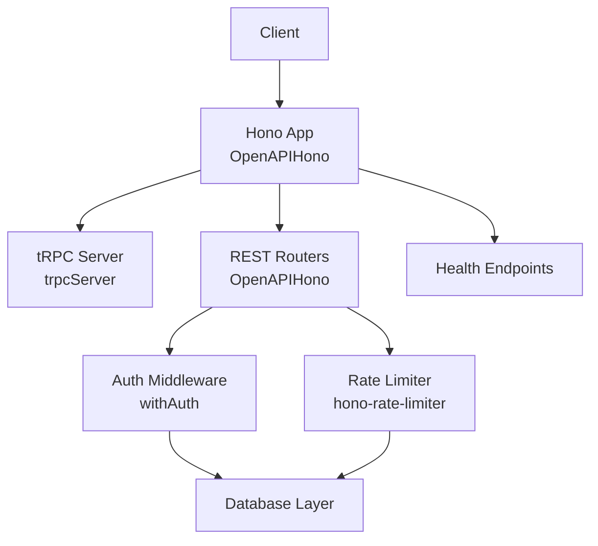
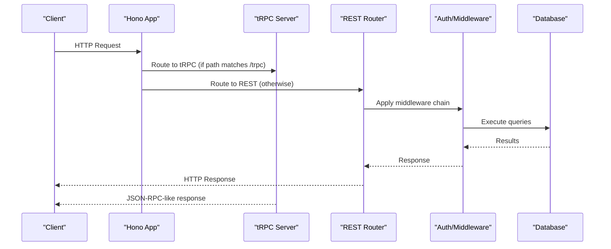
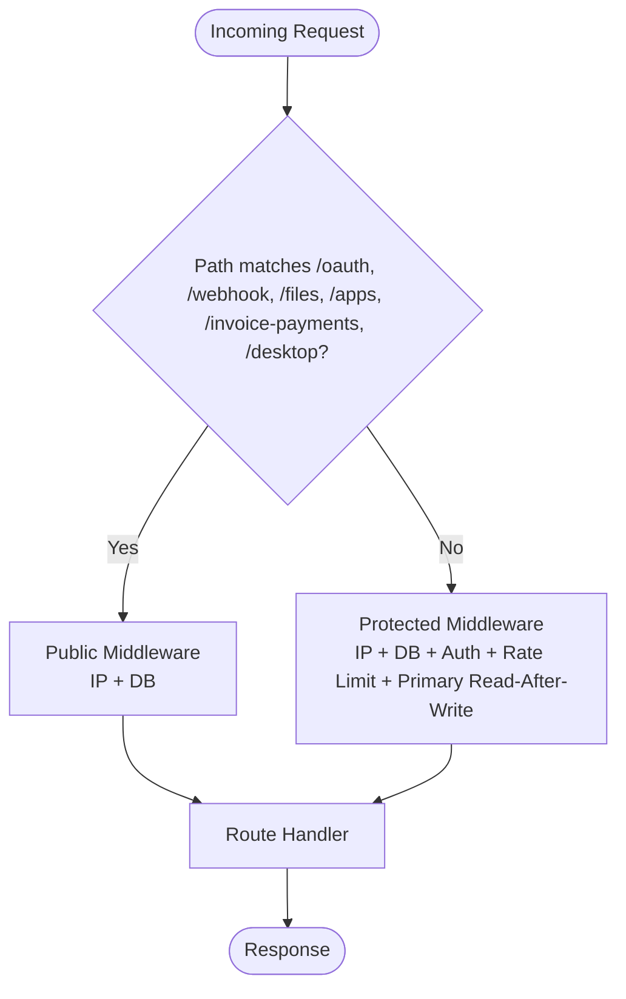
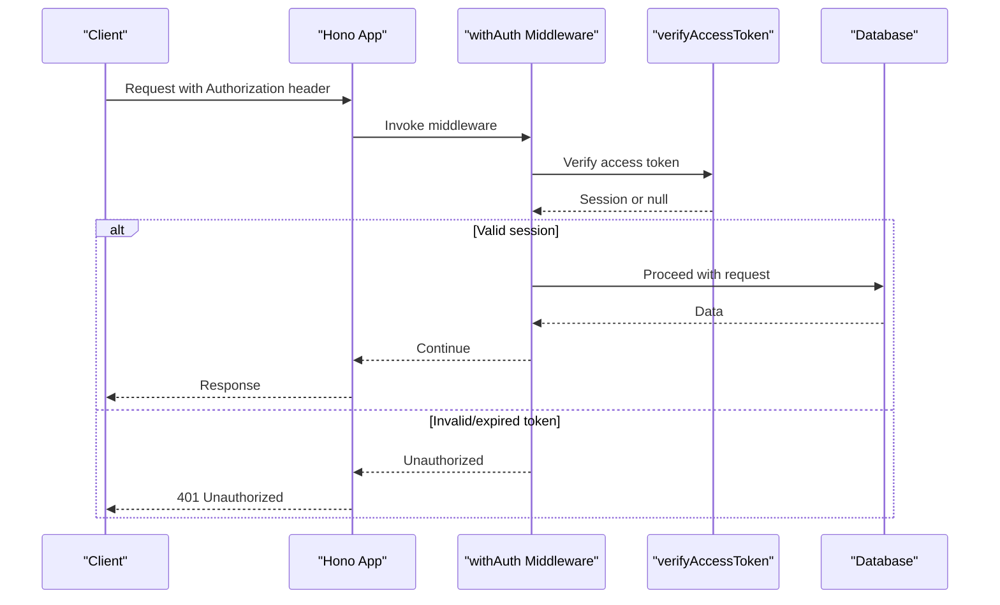
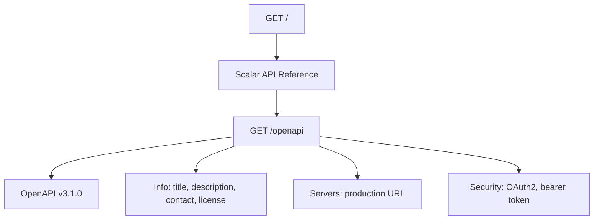
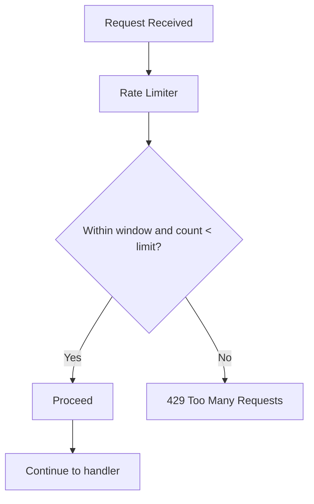
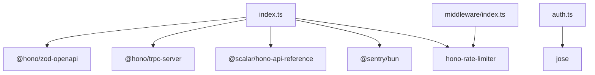

# API Documentation

<cite>
**Referenced Files in This Document**
- [index.ts](file://midday/apps/api/src/index.ts)
- [routers/index.ts](file://midday/apps/api/src/rest/routers/index.ts)
- [_app.ts](file://midday/apps/api/src/trpc/routers/_app.ts)
- [middleware/index.ts](file://midday/apps/api/src/rest/middleware/index.ts)
- [auth.ts](file://midday/apps/api/src/utils/auth.ts)
- [scopes.ts](file://midday/apps/api/src/utils/scopes.ts)
</cite>

## Table of Contents
1. [Introduction](#introduction)
2. [Project Structure](#project-structure)
3. [Core Components](#core-components)
4. [Architecture Overview](#architecture-overview)
5. [Detailed Component Analysis](#detailed-component-analysis)
6. [Dependency Analysis](#dependency-analysis)
7. [Performance Considerations](#performance-considerations)
8. [Troubleshooting Guide](#troubleshooting-guide)
9. [Conclusion](#conclusion)
10. [Appendices](#appendices)

## Introduction
This document describes the REST and tRPC APIs exposed by the Hono-based backend. It covers:
- OpenAPI specification exposure and interactive documentation
- Authentication and authorization mechanisms
- Request/response patterns and error handling
- Rate limiting policy
- Versioning and backward compatibility considerations
- Real-time features and streaming
- Webhook endpoints
- SDK integration guidance and common usage scenarios

## Project Structure
The API server is implemented as a Hono application with:
- REST endpoints grouped under a mounted router
- tRPC procedures organized under a central router
- OpenAPI documentation generation and interactive reference
- Health checks and readiness probes
- CORS, security headers, and request tracing

**Diagram sources**
- [index.ts](file://midday/apps/api/src/index.ts#L26-L176)
- [routers/index.ts](file://midday/apps/api/src/rest/routers/index.ts#L28-L61)
- [middleware/index.ts](file://midday/apps/api/src/rest/middleware/index.ts#L22-L36)

**Section sources**
- [index.ts](file://midday/apps/api/src/index.ts#L26-L176)
- [routers/index.ts](file://midday/apps/api/src/rest/routers/index.ts#L28-L61)

## Core Components
- OpenAPI and Interactive Docs
  - OpenAPI endpoint: GET /openapi
  - Interactive reference: GET /
  - Security schemes registered: bearer token and OAuth2
- REST API
  - Public routes: OAuth, webhooks, files, apps, invoice payments, desktop
  - Protected routes: Requires authentication via unified middleware
- tRPC API
  - Central router composes domain-specific routers (accounting, banking, customers, documents, invoices, transactions, etc.)
- Authentication and Authorization
  - Access tokens verified against a JWT secret
  - Scopes define granular permissions per resource
- Rate Limiting
  - Per-user sliding window (10 minutes, 100 requests)
- Health and Diagnostics
  - /health, /health/ready, /health/dependencies
  - Optional performance logging for tRPC requests

**Section sources**
- [index.ts](file://midday/apps/api/src/index.ts#L132-L174)
- [routers/index.ts](file://midday/apps/api/src/rest/routers/index.ts#L30-L59)
- [_app.ts](file://midday/apps/api/src/trpc/routers/_app.ts#L44-L85)
- [middleware/index.ts](file://midday/apps/api/src/rest/middleware/index.ts#L26-L36)
- [auth.ts](file://midday/apps/api/src/utils/auth.ts#L20-L43)
- [scopes.ts](file://midday/apps/api/src/utils/scopes.ts#L1-L96)

## Architecture Overview
The API server exposes two primary interfaces:
- REST: Hono routes grouped by domain
- tRPC: Procedures invoked over HTTP with typed inputs/outputs

**Diagram sources**
- [index.ts](file://midday/apps/api/src/index.ts#L88-L113)
- [routers/index.ts](file://midday/apps/api/src/rest/routers/index.ts#L30-L59)
- [middleware/index.ts](file://midday/apps/api/src/rest/middleware/index.ts#L22-L36)

## Detailed Component Analysis

### REST API Endpoints
- Public Routes
  - OAuth: Authorization and token exchange flows
  - Webhooks: Event delivery endpoints
  - Files: Upload/download endpoints
  - Apps: Marketplace and app integrations
  - Invoice Payments: Payment processing endpoints
  - Desktop: Desktop client integration endpoints
- Protected Routes
  - Transactions, Teams, Users, Customers, Bank Accounts, Tags, Documents, Inbox, Insights, Invoices, Search, Reports, Tracker Projects/Entries, Chat, Transcription, MCP

Middleware pipeline for protected routes:
- IP capture
- Database connection
- Authentication (API key or OAuth)
- Rate limiter (per user)
- Primary-read-after-write routing

**Diagram sources**
- [routers/index.ts](file://midday/apps/api/src/rest/routers/index.ts#L30-L59)
- [middleware/index.ts](file://midday/apps/api/src/rest/middleware/index.ts#L12-L36)

**Section sources**
- [routers/index.ts](file://midday/apps/api/src/rest/routers/index.ts#L30-L59)
- [middleware/index.ts](file://midday/apps/api/src/rest/middleware/index.ts#L12-L36)

### tRPC Procedure Definitions
- Central router composes domain routers:
  - Accounting, Banking, Notifications, Notification Settings, Apps, Bank Accounts, Bank Connections, Chats, Customers, Documents, Document Tag Assignments, Document Tags, Chat Feedback, Inbox, Inbox Accounts, Insights, Institutions, Invoice, Invoice Payments, Invoice Products, Invoice Recurring, Invoice Template, Jobs, Reports, OAuth Applications, Billing, Suggested Actions, Tags, Team, Tracker Entries, Tracker Projects, Transaction Attachments, Transaction Categories, Transactions, Transaction Tags, User, Search, Short Links, API Keys, Widgets
- Types exported for client-side inference:
  - RouterOutputs
  - RouterInputs

```mermaid
graph LR
App["_app.ts<br/>createTRPCRouter"] --> Acc["accountingRouter"]
App --> Bank["bankingRouter"]
App --> Noti["notificationsRouter"]
App --> NotiSet["notificationSettingsRouter"]
App --> Apps["appsRouter"]
App --> BA["bankAccountsRouter"]
App --> BC["bankConnectionsRouter"]
App --> Chats["chatsRouter"]
App --> Cust["customersRouter"]
App --> Docs["documentsRouter"]
App --> DTA["documentTagAssignmentsRouter"]
App --> DT["documentTagsRouter"]
App --> CF["chatFeedbackRouter"]
App --> Inbox["inboxRouter"]
App --> IA["inboxAccountsRouter"]
App --> Ins["insightsRouter"]
App --> Inst["institutionsRouter"]
App --> Inv["invoiceRouter"]
App --> InvPay["invoicePaymentsRouter"]
App --> InvProd["invoiceProductsRouter"]
App --> InvRec["invoiceRecurringRouter"]
App --> InvTpl["invoiceTemplateRouter"]
App --> Jobs["jobsRouter"]
App --> Rep["reportsRouter"]
App --> OA["oauthApplicationsRouter"]
App --> Bill["billingRouter"]
App --> SA["suggestedActionsRouter"]
App --> Tags["tagsRouter"]
App --> Team["teamRouter"]
App --> TE["trackerEntriesRouter"]
App --> TP["trackerProjectsRouter"]
App --> TA["transactionAttachmentsRouter"]
App --> TCat["transactionCategoriesRouter"]
App --> Tx["transactionsRouter"]
App --> TT["transactionTagsRouter"]
App --> User["userRouter"]
App --> Search["searchRouter"]
App --> SL["shortLinksRouter"]
App --> AK["apiKeysRouter"]
App --> W["widgetsRouter"]
```

**Diagram sources**
- [_app.ts](file://midday/apps/api/src/trpc/routers/_app.ts#L44-L85)

**Section sources**
- [_app.ts](file://midday/apps/api/src/trpc/routers/_app.ts#L44-L85)

### Authentication and Authorization
- Authentication
  - Access tokens validated via JWT verification using a shared secret
  - Session object populated with user identity and optional metadata
- Authorization
  - Scopes define fine-grained permissions across resources
  - Presets: all_access, read_only, restricted
  - Scope expansion supports wildcard-like behavior for broad access

**Diagram sources**
- [middleware/index.ts](file://midday/apps/api/src/rest/middleware/index.ts#L22-L36)
- [auth.ts](file://midday/apps/api/src/utils/auth.ts#L20-L43)

**Section sources**
- [auth.ts](file://midday/apps/api/src/utils/auth.ts#L20-L43)
- [scopes.ts](file://midday/apps/api/src/utils/scopes.ts#L1-L96)
- [middleware/index.ts](file://midday/apps/api/src/rest/middleware/index.ts#L22-L36)

### OpenAPI Specification and Interactive Reference
- OpenAPI endpoint: GET /openapi
- Interactive scalar reference: GET /
- Security schemes:
  - bearer token (HTTP, scheme=bearer)
  - OAuth2 (empty flow for API key usage)

**Diagram sources**
- [index.ts](file://midday/apps/api/src/index.ts#L132-L174)

**Section sources**
- [index.ts](file://midday/apps/api/src/index.ts#L132-L174)

### Rate Limiting Policy
- Window: 10 minutes
- Limit: 100 requests per user ID
- Key generator uses session user ID if present; otherwise "unknown"
- Status code: 429 on violation

**Diagram sources**
- [middleware/index.ts](file://midday/apps/api/src/rest/middleware/index.ts#L26-L34)

**Section sources**
- [middleware/index.ts](file://midday/apps/api/src/rest/middleware/index.ts#L26-L34)

### Health and Readiness
- GET /health: Basic liveness
- GET /health/ready: Readiness probe using dependency checks
- GET /health/dependencies: Dependency status report

**Section sources**
- [index.ts](file://midday/apps/api/src/index.ts#L118-L130)

### Error Handling Patterns
- tRPC error handling logs and forwards internal errors to Sentry (excluding client errors)
- Global Hono error handler captures unhandled exceptions and sends generic 500 response
- Sentry integration records tags and request traces

**Section sources**
- [index.ts](file://midday/apps/api/src/index.ts#L93-L111)
- [index.ts](file://midday/apps/api/src/index.ts#L202-L211)

### Real-Time Features and Streaming
- WebSocket and streaming responses are not implemented in the current codebase
- The REST and tRPC layers operate on request/response semantics

[No sources needed since this section provides general guidance]

### Webhook Implementation Details
- Webhook endpoints are mounted under /webhook
- Slack webhook headers are whitelisted in CORS configuration
- Implementations for specific providers are contained within the webhook router module

**Section sources**
- [routers/index.ts](file://midday/apps/api/src/rest/routers/index.ts#L26-L33)
- [index.ts](file://midday/apps/api/src/index.ts#L35-L65)

### Versioning and Backward Compatibility
- OpenAPI version: 3.1.0
- API version: 0.0.1 (as declared in OpenAPI info)
- Backward compatibility is not explicitly enforced in the codebase; clients should pin to a specific version and handle deprecations gracefully

**Section sources**
- [index.ts](file://midday/apps/api/src/index.ts#L132-L155)

### SDK Integration and Common Usage Scenarios
- tRPC client integration
  - Use generated types (RouterInputs/RouterOutputs) for compile-time safety
  - Invoke procedures via HTTP transport with typed payloads
- REST client integration
  - Use bearer token or API key in Authorization header
  - Follow documented endpoints and schemas from OpenAPI
- Example scenarios
  - Fetch invoices: REST GET /invoices or tRPC invoice.list
  - Create a transaction: REST POST /transactions or tRPC transactions.create
  - Authenticate: REST with Authorization header or OAuth flow
  - Stream insights: Not supported; use polling or scheduled retrieval

[No sources needed since this section provides general guidance]

## Dependency Analysis
- External libraries
  - @hono/zod-openapi: OpenAPI schema and doc generation
  - @hono/trpc-server: tRPC over HTTP
  - @scalar/hono-api-reference: Interactive API reference
  - hono-rate-limiter: Request throttling
  - jose: JWT verification
  - @sentry/bun: Error reporting
- Internal composition
  - REST routers compose domain-specific routers
  - tRPC _app composes domain routers
  - Auth and scope utilities support authorization

**Diagram sources**
- [index.ts](file://midday/apps/api/src/index.ts#L4-L16)
- [auth.ts](file://midday/apps/api/src/utils/auth.ts#L1-L44)
- [middleware/index.ts](file://midday/apps/api/src/rest/middleware/index.ts#L1-L7)

**Section sources**
- [index.ts](file://midday/apps/api/src/index.ts#L4-L16)
- [auth.ts](file://midday/apps/api/src/utils/auth.ts#L1-L44)
- [middleware/index.ts](file://midday/apps/api/src/rest/middleware/index.ts#L1-L7)

## Performance Considerations
- Database pool statistics logging can be enabled via environment variable
- Optional tRPC performance logging prints request timing, procedure counts, and pool stats
- Graceful shutdown ensures clean closure of DB and Redis connections

**Section sources**
- [index.ts](file://midday/apps/api/src/index.ts#L178-L199)
- [index.ts](file://midday/apps/api/src/index.ts#L67-L86)
- [index.ts](file://midday/apps/api/src/index.ts#L217-L254)

## Troubleshooting Guide
- 401 Unauthorized
  - Missing or invalid Authorization header
  - Token verification failure
- 429 Too Many Requests
  - Exceeded per-user rate limit
- 500 Internal Server Error
  - Unhandled exceptions captured and logged
  - Sentry events recorded with request context
- Health probes failing
  - Check dependency readiness and network connectivity

**Section sources**
- [index.ts](file://midday/apps/api/src/index.ts#L202-L211)
- [middleware/index.ts](file://midday/apps/api/src/rest/middleware/index.ts#L26-L34)
- [index.ts](file://midday/apps/api/src/index.ts#L120-L130)

## Conclusion
The API provides a modern, typed interface combining REST and tRPC with robust authentication, authorization, and observability. Clients should integrate using the OpenAPI spec and tRPC types, adhere to rate limits, and monitor health endpoints for operational status.

## Appendices
- Security schemes
  - bearer token: HTTP bearer authentication
  - OAuth2: Empty flow for API key usage
- CORS configuration
  - Origins controlled by environment variable
  - Methods: GET, POST, PUT, DELETE, OPTIONS, PATCH
  - Headers include standard and provider-specific headers

**Section sources**
- [index.ts](file://midday/apps/api/src/index.ts#L35-L65)
- [index.ts](file://midday/apps/api/src/index.ts#L163-L169)