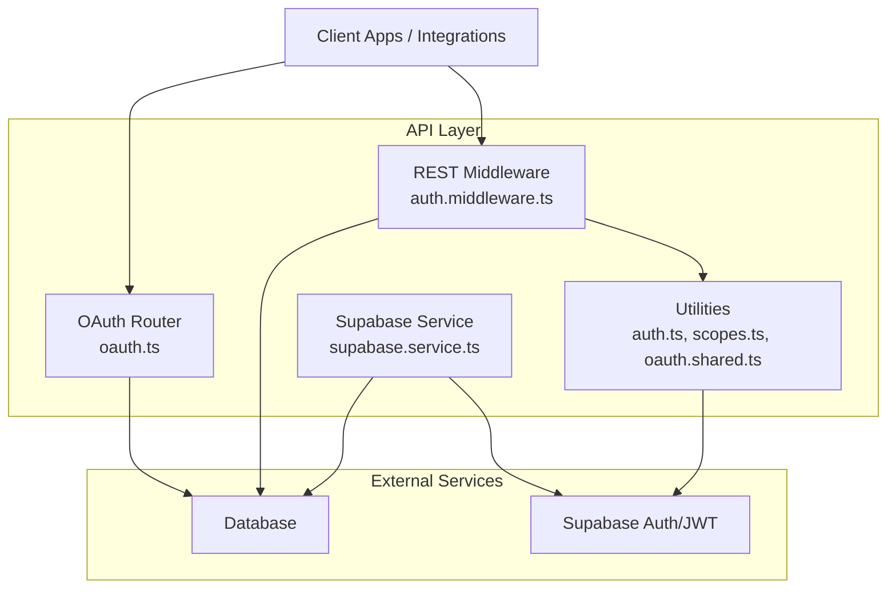
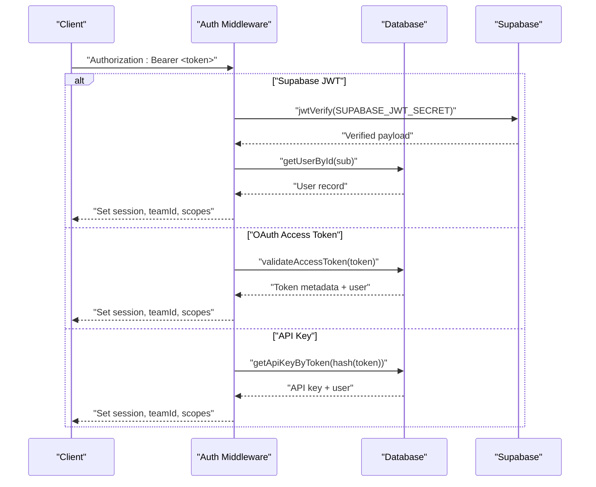
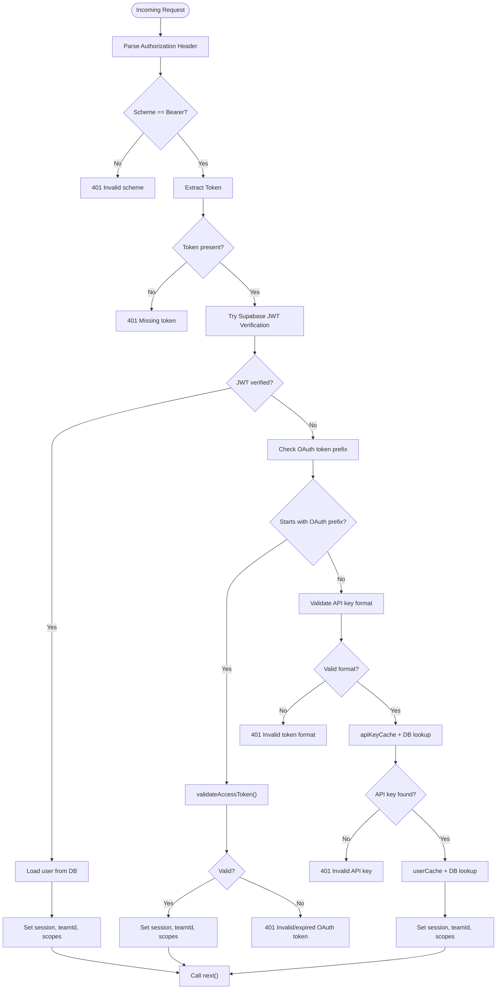
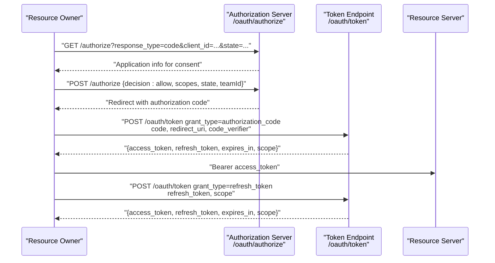
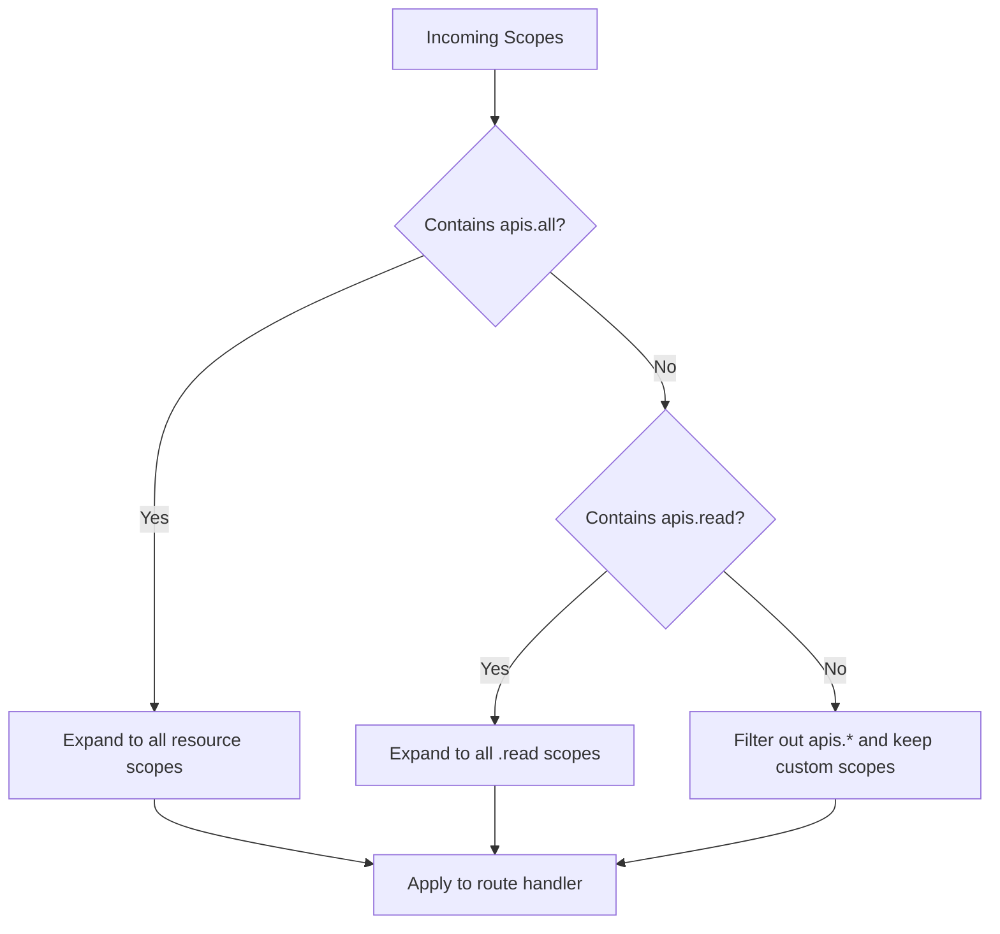
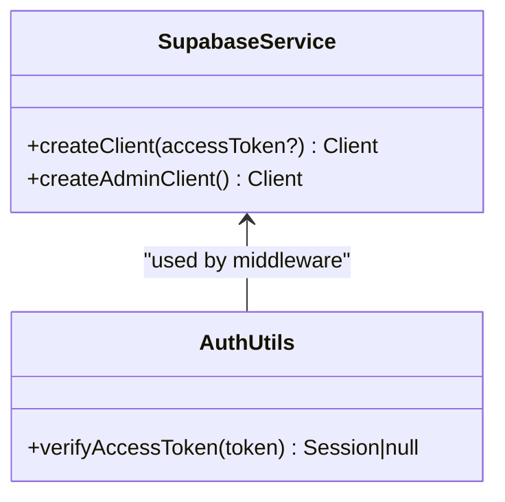
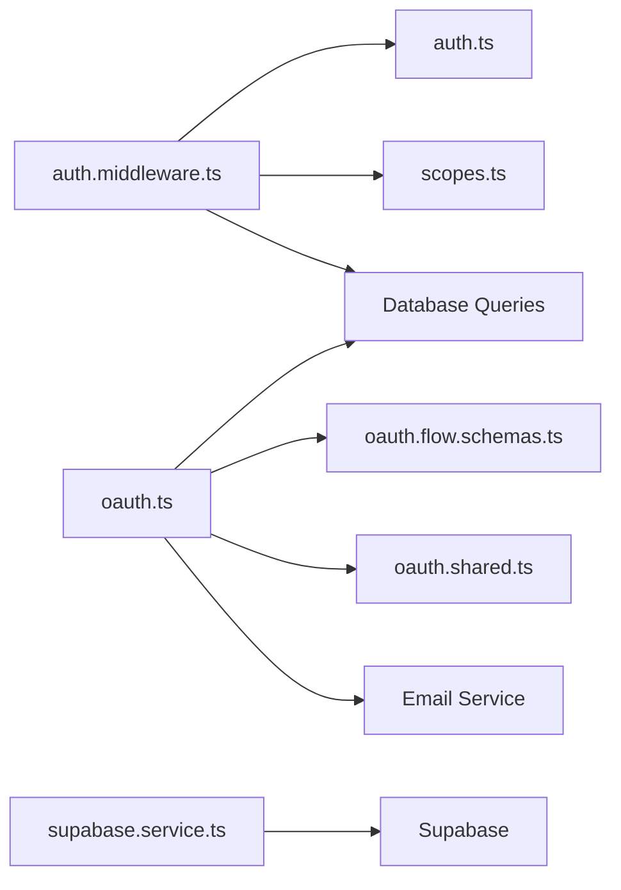

# Authentication & Authorization

<cite>
**Referenced Files in This Document**
- [auth.ts](file://midday/apps/api/src/utils/auth.ts)
- [auth.middleware.ts](file://midday/apps/api/src/rest/middleware/auth.ts)
- [oauth.ts](file://midday/apps/api/src/rest/routers/oauth.ts)
- [oauth.utils.ts](file://midday/apps/api/src/rest/utils/oauth.ts)
- [oauth.shared.ts](file://midday/apps/api/src/utils/oauth.ts)
- [scopes.ts](file://midday/apps/api/src/utils/scopes.ts)
- [supabase.service.ts](file://midday/apps/api/src/services/supabase.ts)
- [oauth.flow.schemas.ts](file://midday/apps/api/src/schemas/oauth-flow.ts)
</cite>

## Table of Contents
1. [Introduction](#introduction)
2. [Project Structure](#project-structure)
3. [Core Components](#core-components)
4. [Architecture Overview](#architecture-overview)
5. [Detailed Component Analysis](#detailed-component-analysis)
6. [Dependency Analysis](#dependency-analysis)
7. [Performance Considerations](#performance-considerations)
8. [Troubleshooting Guide](#troubleshooting-guide)
9. [Conclusion](#conclusion)
10. [Appendices](#appendices)

## Introduction
This document describes Faworra’s API security model with a focus on authentication and authorization. It covers:
- API key authentication
- OAuth 2.0 flows (authorization, token exchange, refresh, revoke)
- Session-based authentication via Supabase JWTs
- Scope-based permissions and role hierarchies
- JWT token handling and refresh token mechanisms
- Security headers and best practices
- Supabase integration for authentication services and user management
- Examples of implementing flows, handling token expiration, and managing sessions
- CORS configuration, protection against common attacks, multi-factor authentication, IP whitelisting, and audit logging requirements

## Project Structure
The authentication and authorization logic is primarily implemented in the API application under:
- Utilities for JWT verification and scopes
- REST middleware for enforcing authentication and authorization
- OAuth 2.0 endpoints and shared utilities
- Supabase service client for authenticated operations

**Diagram sources**
- [auth.middleware.ts](file://midday/apps/api/src/rest/middleware/auth.ts#L1-L152)
- [oauth.ts](file://midday/apps/api/src/rest/routers/oauth.ts#L1-L630)
- [auth.ts](file://midday/apps/api/src/utils/auth.ts#L1-L44)
- [scopes.ts](file://midday/apps/api/src/utils/scopes.ts#L1-L96)
- [oauth.shared.ts](file://midday/apps/api/src/utils/oauth.ts#L1-L24)
- [supabase.service.ts](file://midday/apps/api/src/services/supabase.ts#L1-L22)

**Section sources**
- [auth.middleware.ts](file://midday/apps/api/src/rest/middleware/auth.ts#L1-L152)
- [oauth.ts](file://midday/apps/api/src/rest/routers/oauth.ts#L1-L630)
- [auth.ts](file://midday/apps/api/src/utils/auth.ts#L1-L44)
- [scopes.ts](file://midday/apps/api/src/utils/scopes.ts#L1-L96)
- [oauth.shared.ts](file://midday/apps/api/src/utils/oauth.ts#L1-L24)
- [supabase.service.ts](file://midday/apps/api/src/services/supabase.ts#L1-L22)

## Core Components
- Authentication middleware validates Authorization headers and routes to appropriate handlers based on token type.
- JWT verification utility supports Supabase JWTs.
- OAuth router implements authorization, token exchange, refresh, and revoke endpoints with PKCE and state validation.
- Scopes utility defines granular permissions and presets.
- Supabase service provides authenticated client creation for server-side operations.

Key responsibilities:
- Token parsing and validation
- Session population with team and user context
- Scope expansion and enforcement
- OAuth client credential validation and PKCE support
- Secure redirect handling and error mapping

**Section sources**
- [auth.middleware.ts](file://midday/apps/api/src/rest/middleware/auth.ts#L16-L151)
- [auth.ts](file://midday/apps/api/src/utils/auth.ts#L20-L43)
- [oauth.ts](file://midday/apps/api/src/rest/routers/oauth.ts#L53-L627)
- [scopes.ts](file://midday/apps/api/src/utils/scopes.ts#L1-L96)
- [supabase.service.ts](file://midday/apps/api/src/services/supabase.ts#L4-L21)

## Architecture Overview
The system supports three primary authentication modes:
- Supabase JWT-based session authentication
- OAuth 2.0 access tokens for third-party integrations
- API keys for server-to-server or CLI usage

**Diagram sources**
- [auth.middleware.ts](file://midday/apps/api/src/rest/middleware/auth.ts#L16-L151)
- [auth.ts](file://midday/apps/api/src/utils/auth.ts#L20-L43)

## Detailed Component Analysis

### Authentication Middleware
The middleware enforces authentication across all protected routes:
- Validates Authorization header presence and scheme
- Supports three token types:
  - Supabase JWTs (verified server-side)
  - OAuth access tokens (starting with a specific prefix)
  - API keys (with strict format validation and caching)
- Populates session, teamId, and expanded scopes
- Applies rate limiting per IP for public endpoints

**Diagram sources**
- [auth.middleware.ts](file://midday/apps/api/src/rest/middleware/auth.ts#L16-L151)

**Section sources**
- [auth.middleware.ts](file://midday/apps/api/src/rest/middleware/auth.ts#L16-L151)

### JWT Token Handling
- Supabase JWT verification uses a server-side secret to validate tokens.
- Verified payload is mapped into a session object containing user identity and optional metadata.
- Session is enriched with teamId and expanded scopes.

Best practices:
- Keep the JWT secret secure and rotate periodically.
- Validate token audience and issuer if configured.
- Limit token lifetime and refresh tokens securely.

**Section sources**
- [auth.ts](file://midday/apps/api/src/utils/auth.ts#L20-L43)

### OAuth 2.0 Flows
Endpoints and responsibilities:
- Authorization endpoint: validates client_id, redirect_uri, scopes, enforces PKCE for public clients, and returns application info for consent.
- Authorization decision endpoint: verifies user session, validates team membership, creates authorization codes, and handles denials.
- Token exchange endpoint: supports authorization_code and refresh_token grants, validates client credentials, enforces PKCE, and returns access/refresh tokens.
- Token revoke endpoint: revokes access or refresh tokens after validating client credentials.

Security controls:
- PKCE enforced for public clients
- Strict state parameter validation for CSRF protection
- Redirect URI validation
- Rate limiting on OAuth endpoints
- Timing-safe client secret comparison
- Standardized error mapping for provider-specific errors

**Diagram sources**
- [oauth.ts](file://midday/apps/api/src/rest/routers/oauth.ts#L53-L627)
- [oauth.flow.schemas.ts](file://midday/apps/api/src/schemas/oauth-flow.ts#L4-L108)

**Section sources**
- [oauth.ts](file://midday/apps/api/src/rest/routers/oauth.ts#L53-L627)
- [oauth.utils.ts](file://midday/apps/api/src/rest/utils/oauth.ts#L18-L127)
- [oauth.shared.ts](file://midday/apps/api/src/utils/oauth.ts#L10-L23)
- [oauth.flow.schemas.ts](file://midday/apps/api/src/schemas/oauth-flow.ts#L4-L108)

### Scope-Based Permissions and Role Hierarchies
- Defined scopes enumerate read/write access to resources.
- Presets:
  - All access: equivalent to all resource scopes
  - Read-only: all read scopes
  - Restricted: custom subset of scopes
- Expansion logic converts preset scopes into concrete scope sets.
- Access control pattern:
  - Expand incoming scopes
  - Enforce scope checks on protected routes
  - Deny by default (explicit allow)

**Diagram sources**
- [scopes.ts](file://midday/apps/api/src/utils/scopes.ts#L80-L95)

**Section sources**
- [scopes.ts](file://midday/apps/api/src/utils/scopes.ts#L1-L96)

### Session-Based Authentication and Supabase Integration
- Supabase service client supports creating authenticated clients with an access token or using a service key for admin operations.
- Server-side flows can leverage Supabase client to query auth tables or perform privileged operations.

**Diagram sources**
- [supabase.service.ts](file://midday/apps/api/src/services/supabase.ts#L4-L21)
- [auth.ts](file://midday/apps/api/src/utils/auth.ts#L20-L43)

**Section sources**
- [supabase.service.ts](file://midday/apps/api/src/services/supabase.ts#L1-L22)
- [auth.ts](file://midday/apps/api/src/utils/auth.ts#L1-L44)

### API Key Authentication
- Tokens must match a specific format; otherwise rejected immediately.
- Hashed token is looked up in cache; if absent, queried from the database and cached.
- User is resolved via cache or database and attached to the session.
- Last-used timestamps are updated for telemetry and security monitoring.

Implementation highlights:
- Format validation prevents misuse of token prefixes
- Caching reduces database load
- Team scoping ensures isolation

**Section sources**
- [auth.middleware.ts](file://midday/apps/api/src/rest/middleware/auth.ts#L95-L151)

### Security Headers and Best Practices
- Authorization header enforcement with bearer scheme
- Rate limiting for OAuth endpoints
- PKCE for public clients
- Strict state parameter validation
- Redirect URI validation
- Timing-safe client secret comparison
- Sanitized redirect URLs to prevent open redirects

Recommended additions:
- Content-Security-Policy, X-Frame-Options, X-Content-Type-Options, Referrer-Policy
- HSTS for HTTPS deployments
- CORS configuration allowing only trusted origins and necessary headers/methods

**Section sources**
- [auth.middleware.ts](file://midday/apps/api/src/rest/middleware/auth.ts#L16-L31)
- [oauth.ts](file://midday/apps/api/src/rest/routers/oauth.ts#L41-L51)
- [oauth.utils.ts](file://midday/apps/api/src/rest/utils/oauth.ts#L71-L127)
- [oauth.shared.ts](file://midday/apps/api/src/utils/oauth.ts#L10-L23)

### Multi-Factor Authentication, IP Whitelisting, and Audit Logging
- MFA enrollment and verification are handled in the dashboard actions and UI components; server-side enforcement can be integrated at the middleware level by checking MFA status during session creation.
- IP whitelisting can be implemented by extending the middleware to validate client IPs against a configured allowlist.
- Audit logging should capture:
  - Successful/failed authentication attempts
  - OAuth authorization decisions
  - Token issuance and revocation events
  - Scope changes and access denials

[No sources needed since this section provides general guidance]

## Dependency Analysis

**Diagram sources**
- [auth.middleware.ts](file://midday/apps/api/src/rest/middleware/auth.ts#L1-L152)
- [auth.ts](file://midday/apps/api/src/utils/auth.ts#L1-L44)
- [scopes.ts](file://midday/apps/api/src/utils/scopes.ts#L1-L96)
- [oauth.ts](file://midday/apps/api/src/rest/routers/oauth.ts#L1-L630)
- [oauth.flow.schemas.ts](file://midday/apps/api/src/schemas/oauth-flow.ts#L1-L332)
- [oauth.shared.ts](file://midday/apps/api/src/utils/oauth.ts#L1-L24)
- [supabase.service.ts](file://midday/apps/api/src/services/supabase.ts#L1-L22)

**Section sources**
- [auth.middleware.ts](file://midday/apps/api/src/rest/middleware/auth.ts#L1-L152)
- [oauth.ts](file://midday/apps/api/src/rest/routers/oauth.ts#L1-L630)

## Performance Considerations
- Caching: API key and user caches reduce database queries for repeated authentications.
- Token verification: Prefer server-side JWT verification only when necessary; cache validated sessions where feasible.
- Rate limiting: Applied to OAuth endpoints to mitigate abuse.
- Minimize database roundtrips by batching lookups and leveraging cached data.

[No sources needed since this section provides general guidance]

## Troubleshooting Guide
Common issues and resolutions:
- 401 Unauthorized
  - Missing or invalid Authorization header
  - Invalid token format or expired token
  - Fix: Ensure Bearer scheme and valid token; refresh if expired
- 400 Bad Request (OAuth)
  - Invalid client_id or redirect_uri
  - Missing PKCE for public clients
  - Invalid scopes
  - Fix: Verify client registration and redirect URIs; include code_verifier for public clients
- 400 Bad Request (Token Exchange)
  - Authorization code expired or already used
  - Redirect URI mismatch
  - Fix: Restart authorization flow; ensure redirect_uri matches
- 400 Bad Request (Refresh)
  - Invalid or expired refresh token
  - Fix: Re-authenticate user and obtain a new refresh token
- 403 Forbidden
  - User not a member of the selected team
  - Fix: Ensure user belongs to the requested team

**Section sources**
- [auth.middleware.ts](file://midday/apps/api/src/rest/middleware/auth.ts#L19-L31)
- [oauth.ts](file://midday/apps/api/src/rest/routers/oauth.ts#L89-L121)
- [oauth.ts](file://midday/apps/api/src/rest/routers/oauth.ts#L213-L242)
- [oauth.ts](file://midday/apps/api/src/rest/routers/oauth.ts#L443-L479)
- [oauth.ts](file://midday/apps/api/src/rest/routers/oauth.ts#L514-L539)

## Conclusion
Faworra’s API security model combines robust session-based authentication via Supabase JWTs, OAuth 2.0 with PKCE and state validation, and API key authentication with caching and scope-based access control. The system emphasizes strong validation, rate limiting, and standardized error handling. Extending the model with MFA, IP whitelisting, and comprehensive audit logging will further strengthen security posture.

[No sources needed since this section summarizes without analyzing specific files]

## Appendices

### Implementation Examples (paths only)
- Initialize Supabase client for authenticated requests
  - [supabase.service.ts](file://midday/apps/api/src/services/supabase.ts#L4-L14)
- Verify access token and populate session
  - [auth.ts](file://midday/apps/api/src/utils/auth.ts#L20-L43)
  - [auth.middleware.ts](file://midday/apps/api/src/rest/middleware/auth.ts#L35-L61)
- Enforce authentication and scopes
  - [auth.middleware.ts](file://midday/apps/api/src/rest/middleware/auth.ts#L16-L151)
  - [scopes.ts](file://midday/apps/api/src/utils/scopes.ts#L80-L95)
- OAuth authorization flow
  - [oauth.ts](file://midday/apps/api/src/rest/routers/oauth.ts#L53-L141)
  - [oauth.flow.schemas.ts](file://midday/apps/api/src/schemas/oauth-flow.ts#L4-L40)
- OAuth token exchange and refresh
  - [oauth.ts](file://midday/apps/api/src/rest/routers/oauth.ts#L320-L546)
  - [oauth.flow.schemas.ts](file://midday/apps/api/src/schemas/oauth-flow.ts#L51-L108)
- OAuth token revocation
  - [oauth.ts](file://midday/apps/api/src/rest/routers/oauth.ts#L548-L627)
- Client credential validation and error mapping
  - [oauth.shared.ts](file://midday/apps/api/src/utils/oauth.ts#L10-L23)
  - [oauth.utils.ts](file://midday/apps/api/src/rest/utils/oauth.ts#L18-L66)