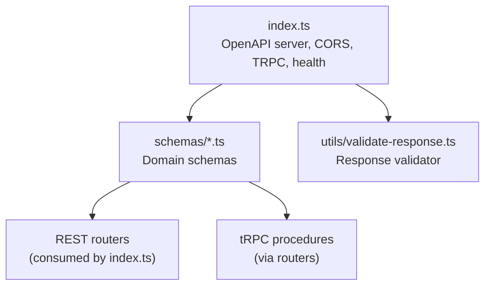
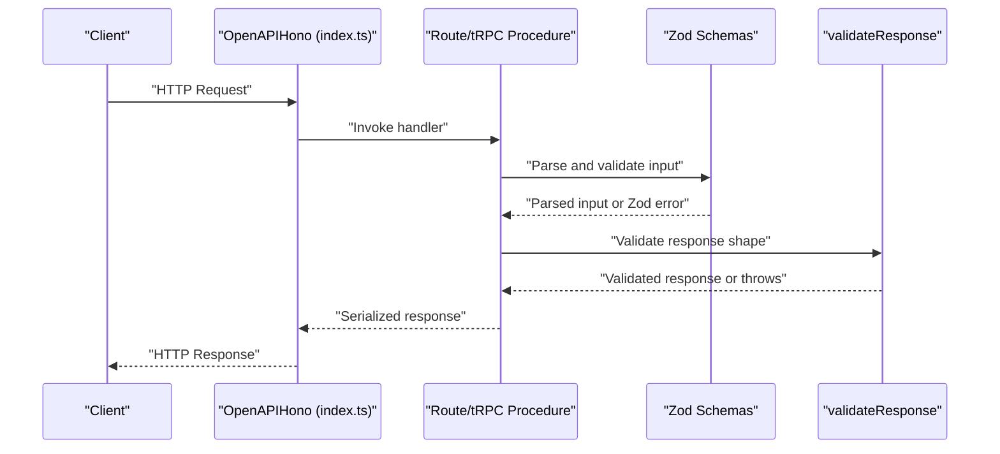
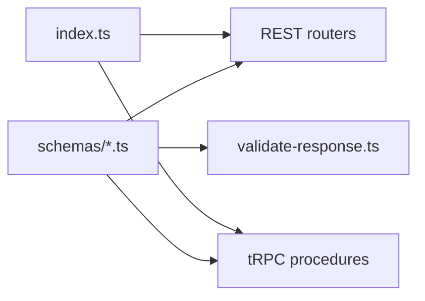

# Data Schemas & Validation

<cite>
**Referenced Files in This Document**
- [index.ts](file://midday/apps/api/src/index.ts)
- [validate-response.ts](file://midday/apps/api/src/utils/validate-response.ts)
- [accounting.ts](file://midday/apps/api/src/schemas/accounting.ts)
- [invoice.ts](file://midday/apps/api/src/schemas/invoice.ts)
- [customers.ts](file://midday/apps/api/src/schemas/customers.ts)
- [transactions.ts](file://midday/apps/api/src/schemas/transactions.ts)
- [documents.ts](file://midday/apps/api/src/schemas/documents.ts)
- [search.ts](file://midday/apps/api/src/schemas/search.ts)
</cite>

## Table of Contents
1. [Introduction](#introduction)
2. [Project Structure](#project-structure)
3. [Core Components](#core-components)
4. [Architecture Overview](#architecture-overview)
5. [Detailed Component Analysis](#detailed-component-analysis)
6. [Dependency Analysis](#dependency-analysis)
7. [Performance Considerations](#performance-considerations)
8. [Troubleshooting Guide](#troubleshooting-guide)
9. [Conclusion](#conclusion)
10. [Appendices](#appendices)

## Introduction
This document describes Faworra’s API request and response validation layer built with Zod and OpenAPI. It catalogs TypeScript interfaces and Zod schemas across business domains, explains validation rules, serialization/deserialization patterns, type safety enforcement, search and pagination parameters, and error handling. It also outlines constraints, enums, and business rules, and provides guidance for schema evolution and backward compatibility.

## Project Structure
The API server initializes OpenAPI documentation and registers routes. Validation utilities enforce response correctness. Domain-specific schemas live under a dedicated schemas directory and are consumed by REST and tRPC layers.

**Diagram sources**
- [index.ts](file://midday/apps/api/src/index.ts#L26-L176)
- [validate-response.ts](file://midday/apps/api/src/utils/validate-response.ts#L1-L20)

**Section sources**
- [index.ts](file://midday/apps/api/src/index.ts#L1-L288)

## Core Components
- Zod schemas define request/response contracts, constraints, and OpenAPI metadata.
- OpenAPI integration exposes interactive docs and enforces parameter placement (path/query/body).
- Response validation utility ensures runtime shape correctness and logs failures.

Key responsibilities:
- Request parsing and coercion (e.g., coerce numbers, UUID parsing).
- Enum constraints and allowed values.
- Nested object and array validation.
- OpenAPI metadata for docs generation and parameter binding.

**Section sources**
- [invoice.ts](file://midday/apps/api/src/schemas/invoice.ts#L1-L1502)
- [customers.ts](file://midday/apps/api/src/schemas/customers.ts#L1-L513)
- [transactions.ts](file://midday/apps/api/src/schemas/transactions.ts#L1-L938)
- [documents.ts](file://midday/apps/api/src/schemas/documents.ts#L1-L269)
- [search.ts](file://midday/apps/api/src/schemas/search.ts#L1-L140)
- [validate-response.ts](file://midday/apps/api/src/utils/validate-response.ts#L1-L20)

## Architecture Overview
The API leverages OpenAPI-aware Zod schemas to validate incoming requests and outgoing responses. REST endpoints and tRPC procedures consume these schemas. A global response validator can be used to assert response shapes at runtime.

**Diagram sources**
- [index.ts](file://midday/apps/api/src/index.ts#L26-L176)
- [validate-response.ts](file://midday/apps/api/src/utils/validate-response.ts#L1-L20)
- [invoice.ts](file://midday/apps/api/src/schemas/invoice.ts#L686-L851)

## Detailed Component Analysis

### Accounting Provider Integration
- Enumerations constrain provider IDs to supported integrations.
- Export, sync status, disconnect, and account retrieval schemas define request/response contracts for provider operations.

Validation highlights:
- Array of UUIDs for transaction IDs.
- Optional filters for provider and transaction IDs.
- Strict enum for provider identifiers.

**Section sources**
- [accounting.ts](file://midday/apps/api/src/schemas/accounting.ts#L1-L42)

### Invoices
Core schemas:
- Editor content validation via TipTap JSON structures.
- Draft invoice templates and line items with strict numeric bounds and optional fields.
- Invoice creation request/response schemas with delivery options and scheduling.
- Search, pagination, and filtering parameters for listing invoices.
- Summary aggregation and status updates.

Key constraints:
- Numeric ranges for tax rates and percentages.
- ISO 8601 datetime fields with offsets.
- Enums for statuses and delivery types.
- OpenAPI metadata for query/path parameters.

Complex structures:
- Nested template objects with optional editor fields.
- Arrays of line items with product associations.
- Response envelopes with pagination metadata.

**Section sources**
- [invoice.ts](file://midday/apps/api/src/schemas/invoice.ts#L1-L1502)

### Customers
Core schemas:
- Customer list filtering and pagination.
- Upsert customer with email list validation.
- Enrichment queueing and portal toggling.
- Invoice summary per customer.

Constraints:
- Email list validation for billing contacts.
- Numeric and string constraints with optional fields.
- Enumerations for portal and enrichment states.

**Section sources**
- [customers.ts](file://midday/apps/api/src/schemas/customers.ts#L1-L513)

### Transactions
Core schemas:
- Comprehensive filtering: categories, tags, accounts, assignees, statuses, recurring, attachments, amount ranges, exact amounts, type, manual flag, export status, fulfillment.
- Pagination and sorting tuples.
- Transaction CRUD operations and batch updates.
- Similar transactions and match search.

Constraints:
- Large pageSize upper bound for performance.
- Status enums and frequency enumerations.
- Nested category, account, and attachments structures.

**Section sources**
- [transactions.ts](file://midday/apps/api/src/schemas/transactions.ts#L1-L938)

### Documents
Core schemas:
- List documents with text search, tags, and date range filters.
- Retrieve related documents and regenerate pre-signed URLs.
- Pre-signed URL generation with expiration and download controls.

Constraints:
- MIME type, size, and path tokens.
- Pre-signed URL validity window.

**Section sources**
- [documents.ts](file://midday/apps/api/src/schemas/documents.ts#L1-L269)

### Search
Core schemas:
- Global search across entities with limits and thresholds.
- Unified attachment search results for inbox and invoices.

Constraints:
- Limits for total and per-table results.
- Relevance scoring and typed result payloads.

**Section sources**
- [search.ts](file://midday/apps/api/src/schemas/search.ts#L1-L140)

## Dependency Analysis
Schemas are consumed by:
- REST routers registered in the main server.
- tRPC procedures via shared schema definitions.
- Response validation utility for runtime checks.

**Diagram sources**
- [index.ts](file://midday/apps/api/src/index.ts#L19-L176)
- [validate-response.ts](file://midday/apps/api/src/utils/validate-response.ts#L1-L20)

**Section sources**
- [index.ts](file://midday/apps/api/src/index.ts#L1-L288)

## Performance Considerations
- Pagination limits: enforce upper bounds to prevent heavy queries (e.g., transactions pageSize max).
- Coercion: use coerce for numeric parameters to reduce parsing overhead.
- Enumerations: restrict inputs to known sets to simplify downstream processing.
- OpenAPI metadata: improves client-side validation and reduces round trips.

[No sources needed since this section provides general guidance]

## Troubleshooting Guide
Common issues and resolutions:
- Validation errors: Inspect flattened Zod errors to identify failing fields and reasons.
- Response shape mismatches: Enable response validation to catch unexpected shapes.
- Parameter binding: Ensure query/path parameters align with OpenAPI metadata.
- Large payloads: Respect pageSize and limit constraints to avoid timeouts.

Debugging techniques:
- Log request traces and correlation IDs.
- Use OpenAPI docs to verify endpoint signatures.
- Validate schemas locally with minimal test inputs.

**Section sources**
- [validate-response.ts](file://midday/apps/api/src/utils/validate-response.ts#L1-L20)
- [index.ts](file://midday/apps/api/src/index.ts#L93-L111)

## Conclusion
Faworra’s API employs a robust schema-first design using Zod and OpenAPI. Constraints, enums, and nested structures ensure type safety and predictable behavior. Pagination, search, and filtering are standardized across domains. Response validation adds an extra safety net. These patterns facilitate maintainability, observability, and gradual schema evolution.

[No sources needed since this section summarizes without analyzing specific files]

## Appendices

### Data Transformation Patterns
- Serialization/deserialization: Zod parses and coerces inputs; OpenAPI metadata annotates parameter locations.
- Nested structures: Objects with arrays of tagged items, attachments, and related entities are validated recursively.
- Editor content: TipTap JSON structures are validated and documented for rich-text fields.

**Section sources**
- [invoice.ts](file://midday/apps/api/src/schemas/invoice.ts#L5-L66)
- [transactions.ts](file://midday/apps/api/src/schemas/transactions.ts#L428-L477)

### Error Response Formats
- Validation failures: Zod safeParse returns structured errors; flatten them for diagnostics.
- Global error handling: Centralized error handler logs and returns generic server errors.

**Section sources**
- [validate-response.ts](file://midday/apps/api/src/utils/validate-response.ts#L7-L19)
- [index.ts](file://midday/apps/api/src/index.ts#L202-L211)

### Schema Evolution and Backward Compatibility
- Prefer additive changes: introduce optional fields and new enums rather than removing or renaming.
- Use OpenAPI descriptions to document deprecations and alternatives.
- Maintain stable parameter names and positions for query/path parameters.
- Keep response envelopes consistent to avoid breaking clients.

[No sources needed since this section provides general guidance]