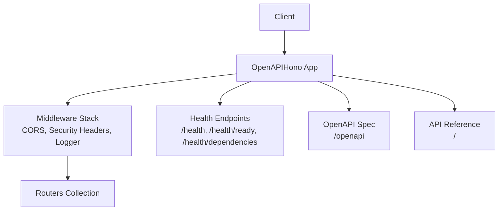
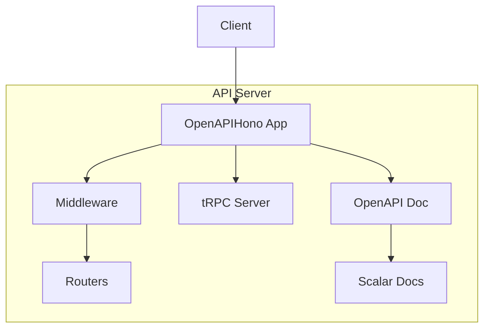
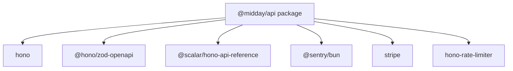

# REST API Reference

<cite>
**Referenced Files in This Document**
- [index.ts](file://midday/apps/api/src/index.ts)
- [package.json](file://midday/apps/api/package.json)
- [package.json](file://midday/package.json)
</cite>

## Table of Contents
1. [Introduction](#introduction)
2. [Project Structure](#project-structure)
3. [Core Components](#core-components)
4. [Architecture Overview](#architecture-overview)
5. [Detailed Component Analysis](#detailed-component-analysis)
6. [Dependency Analysis](#dependency-analysis)
7. [Performance Considerations](#performance-considerations)
8. [Troubleshooting Guide](#troubleshooting-guide)
9. [Conclusion](#conclusion)
10. [Appendices](#appendices)

## Introduction
This document describes the REST API surface exposed by the API application. It focuses on the HTTP endpoints registered via the router composition, middleware configuration, and security schemes. It also outlines the authentication mechanisms, CORS policy, and operational endpoints such as health checks and OpenAPI documentation generation.

Where applicable, this document references the actual source files that define the API behavior.

## Project Structure
The API application is implemented using Hono and OpenAPI integration. The server initializes middleware, registers health endpoints, sets up CORS, and mounts the router collection under the root path. It also exposes an OpenAPI specification and an interactive API reference.

**Diagram sources**
- [index.ts](file://midday/apps/api/src/index.ts#L26-L176)

**Section sources**
- [index.ts](file://midday/apps/api/src/index.ts#L26-L176)

## Core Components
- Application bootstrap and middleware pipeline
  - Initializes OpenAPI-enabled Hono app, secure headers, and CORS.
  - Configures request logging and optional performance tracing for tRPC.
  - Registers tRPC server integration and global error handling.
- Router mounting
  - Routes are mounted under the root path using a routers collection.
- Operational endpoints
  - Health: basic status, readiness, and dependency checks.
  - OpenAPI: generates OpenAPI 3.1.0 spec and serves it at /openapi.
  - Interactive docs: Scalar-based API reference served at "/".
- Authentication and security
  - Security schemes include OAuth2 and a bearer token scheme named "token".
  - CORS allows a configurable set of origins and headers, including Slack webhook headers.

**Section sources**
- [index.ts](file://midday/apps/api/src/index.ts#L26-L176)
- [index.ts](file://midday/apps/api/src/index.ts#L132-L174)
- [index.ts](file://midday/apps/api/src/index.ts#L163-L169)
- [index.ts](file://midday/apps/api/src/index.ts#L35-L65)

## Architecture Overview
The API server composes multiple concerns:
- Routing: mounted under "/" via the routers collection.
- Middleware: CORS, security headers, logging, and tRPC integration.
- Documentation: OpenAPI spec and interactive reference.
- Observability: health probes, dependency checks, and Sentry error reporting.

**Diagram sources**
- [index.ts](file://midday/apps/api/src/index.ts#L26-L176)

## Detailed Component Analysis

### Authentication and Authorization
- Security schemes
  - OAuth2: supported as a security requirement for API operations.
  - Bearer token scheme named "token": intended for default authentication.
- Request headers
  - Authorization: bearer token accepted for protected endpoints.
  - Additional headers may be required depending on integration needs (e.g., Slack webhook headers).
- Scope and permissions
  - No explicit scopes or roles are defined in the server initialization. Authorization behavior depends on downstream routers and services.

**Section sources**
- [index.ts](file://midday/apps/api/src/index.ts#L155-L160)
- [index.ts](file://midday/apps/api/src/index.ts#L163-L169)
- [index.ts](file://midday/apps/api/src/index.ts#L40-L56)

### CORS Policy
- Allowed origins: configurable via environment variable.
- Methods: GET, POST, PUT, DELETE, OPTIONS, PATCH.
- Allowed headers: Content-Type, Authorization, and several others including Slack-specific headers.
- Exposed headers: Content-Length, Content-Type, Cache-Control, Cross-Origin-Resource-Policy.
- Max age: 86400 seconds.

**Section sources**
- [index.ts](file://midday/apps/api/src/index.ts#L35-L65)

### Operational Endpoints
- Health
  - GET /health: returns {"status":"ok"}.
  - GET /health/ready: readiness probe using dependency checks.
  - GET /health/dependencies: dependency status report.
- OpenAPI
  - GET /openapi: serves OpenAPI 3.1.0 specification.
- Interactive API Reference
  - GET /: renders Scalar API reference pointing to /openapi.

Notes:
- These endpoints are defined in the server initialization and are not tied to specific router files in the current snapshot.

**Section sources**
- [index.ts](file://midday/apps/api/src/index.ts#L118-L130)
- [index.ts](file://midday/apps/api/src/index.ts#L132-L174)

### Webhook Endpoints
- Slack webhook headers
  - x-slack-signature and x-slack-request-timestamp are explicitly allowed in CORS.
- Inbox and external integrations
  - No explicit webhook endpoints are defined in the server initialization. Integration-specific endpoints are likely implemented in dedicated routers and services.

Recommendation:
- Consult the inbox and banking packages for webhook endpoint definitions and payload schemas.

**Section sources**
- [index.ts](file://midday/apps/api/src/index.ts#L53-L56)

### Rate Limiting
- No explicit rate limiter middleware is registered in the server initialization.
- Consider integrating a rate limiting solution (e.g., a Hono-compatible rate limiter) at the application level.

[No sources needed since this section provides general guidance]

### Pagination, Filtering, and Sorting
- No generic pagination, filtering, or sorting utilities are registered in the server initialization.
- These capabilities are typically implemented per-resource in individual routers and services.

[No sources needed since this section provides general guidance]

### Error Handling
- Global error handler
  - Captures unhandled exceptions and sends them to Sentry, returning a standardized internal server error response.
- tRPC error handling
  - Logs tRPC errors and forwards them to Sentry for internal server errors, skipping client errors.

**Section sources**
- [index.ts](file://midday/apps/api/src/index.ts#L201-L211)
- [index.ts](file://midday/apps/api/src/index.ts#L93-L112)

### SDK Integration Patterns
- The API supports OpenAPI generation and Scalar-based documentation, enabling SDK generation via standard OpenAPI tooling.
- Authentication
  - Use the "token" bearer scheme for default authentication.
  - Alternatively, integrate OAuth2 flows as defined by your deployment.

[No sources needed since this section provides general guidance]

## Dependency Analysis
The API application declares its dependencies via package.json. Notable entries include:
- Hono and related middleware for routing and OpenAPI.
- @scalar/hono-api-reference for interactive documentation.
- Sentry for error reporting.
- Stripe SDK for payment-related integrations.
- Rate limiter library for potential rate limiting.

**Diagram sources**
- [package.json](file://midday/apps/api/package.json#L15-L72)

**Section sources**
- [package.json](file://midday/apps/api/package.json#L15-L72)
- [package.json](file://midday/package.json#L4-L7)

## Performance Considerations
- Optional performance tracing for tRPC requests can be enabled via an environment flag.
- Database pool statistics logging can be scheduled at a configurable interval.

Recommendations:
- Monitor DB pool usage and adjust intervals based on deployment scale.
- Enable performance tracing in staging/production environments to profile request latency.

**Section sources**
- [index.ts](file://midday/apps/api/src/index.ts#L67-L86)
- [index.ts](file://midday/apps/api/src/index.ts#L178-L199)

## Troubleshooting Guide
- Internal server errors
  - The global error handler returns a standardized JSON error and logs to Sentry.
- Health probe failures
  - Use /health/ready and /health/dependencies to diagnose readiness and dependency statuses.
- CORS issues
  - Verify ALLOWED_API_ORIGINS and ensure the requesting origin is included.
- Authentication failures
  - Confirm Authorization header format and token validity according to the "token" scheme.

**Section sources**
- [index.ts](file://midday/apps/api/src/index.ts#L201-L211)
- [index.ts](file://midday/apps/api/src/index.ts#L120-L130)
- [index.ts](file://midday/apps/api/src/index.ts#L35-L65)
- [index.ts](file://midday/apps/api/src/index.ts#L163-L169)

## Conclusion
The API server provides a solid foundation for REST operations with built-in health checks, OpenAPI documentation, and interactive reference. Authentication is supported via OAuth2 and a bearer token scheme. CORS and middleware are configured to support common integrations, including Slack webhooks. Specific resource endpoints (invoices, transactions, customers, documents, bank accounts, and webhooks) are implemented in dedicated routers and services; consult the relevant packages for detailed endpoint definitions and schemas.

[No sources needed since this section summarizes without analyzing specific files]

## Appendices

### Endpoint Catalog (from server initialization)
- GET /health
- GET /health/ready
- GET /health/dependencies
- GET /openapi
- GET /
- Route mounting under "/" via routers collection

Note: Specific resource endpoints are not defined in the server initialization file and are implemented elsewhere in the codebase.

**Section sources**
- [index.ts](file://midday/apps/api/src/index.ts#L118-L176)