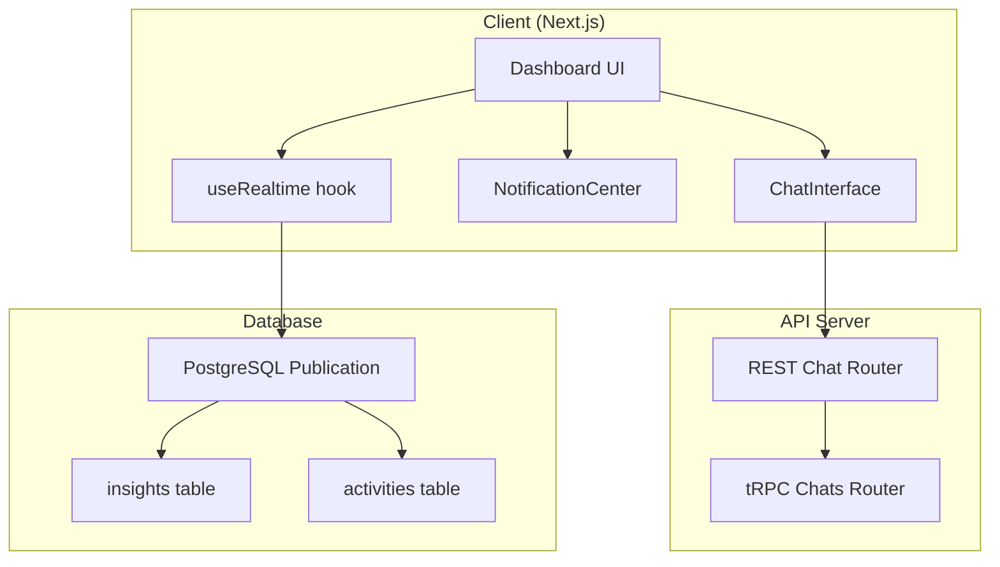
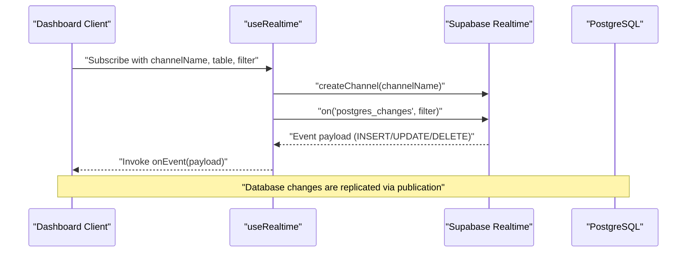
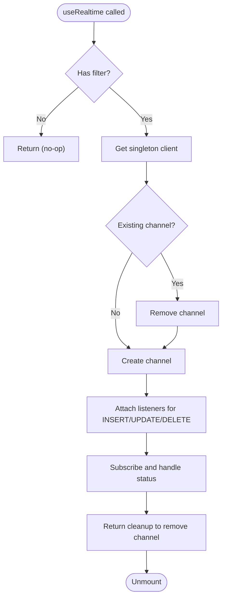
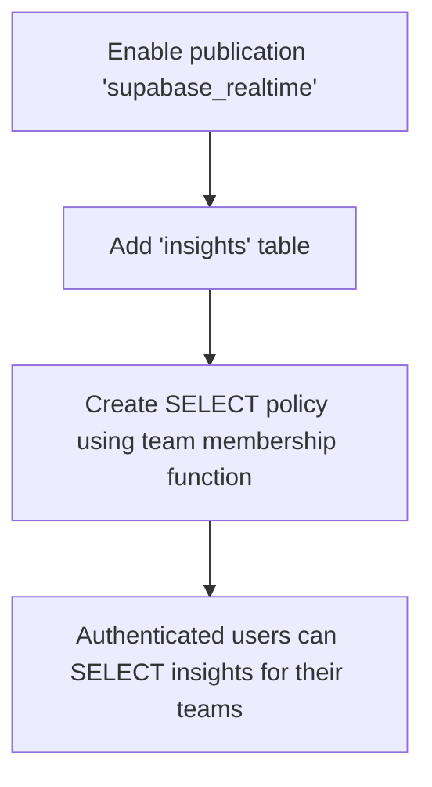
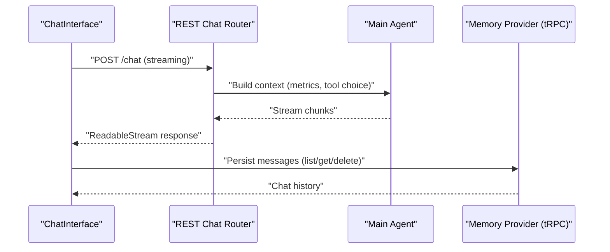
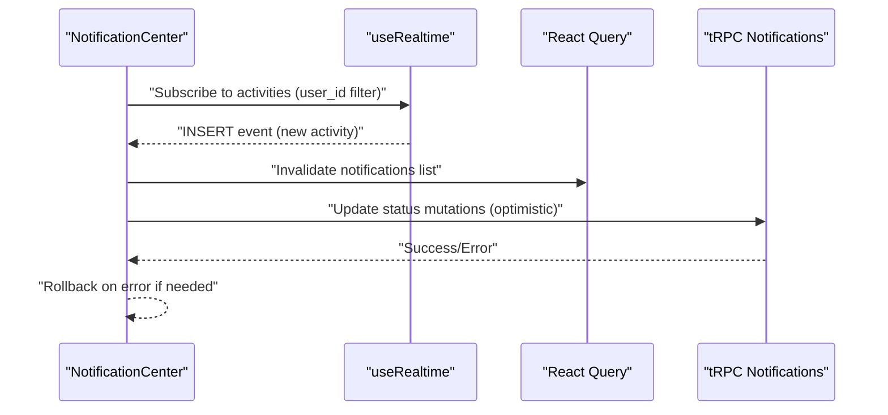
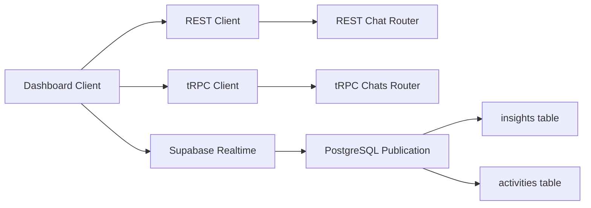

# Real-time Features & WebSocket

<cite>
**Referenced Files in This Document**
- [use-realtime.ts](file://midday/apps/dashboard/src/hooks/use-realtime.ts)
- [0018_add_insights_realtime.sql](file://midday/packages/db/migrations/0018_add_insights_realtime.sql)
- [chat.ts](file://midday/apps/api/src/rest/routers/chat.ts)
- [chats.ts](file://midday/apps/api/src/trpc/routers/chats.ts)
- [chat.ts](file://midday/apps/api/src/schemas/chat.ts)
- [chat-interface.tsx](file://midday/apps/dashboard/src/components/chat/chat-interface.tsx)
- [use-notifications.ts](file://midday/apps/dashboard/src/hooks/use-notifications.ts)
- [notification-center.tsx](file://midday/apps/dashboard/src/components/notification-center/notification-center.tsx)
</cite>

## Table of Contents
1. [Introduction](#introduction)
2. [Project Structure](#project-structure)
3. [Core Components](#core-components)
4. [Architecture Overview](#architecture-overview)
5. [Detailed Component Analysis](#detailed-component-analysis)
6. [Dependency Analysis](#dependency-analysis)
7. [Performance Considerations](#performance-considerations)
8. [Troubleshooting Guide](#troubleshooting-guide)
9. [Conclusion](#conclusion)

## Introduction
This document explains Faworra’s real-time features and WebSocket-based event delivery. It covers how the system establishes real-time subscriptions, the event-driven architecture built on PostgreSQL changes via Supabase Realtime, and how clients receive live updates for notifications and insights. It also documents the chat streaming pipeline, the tRPC-backed chat persistence layer, and practical guidance for connection management, reconnection strategies, error handling, and performance optimization.

## Project Structure
Faworra’s real-time stack spans the API server, database, and the Next.js dashboard client:
- Real-time subscriptions are handled client-side using Supabase Realtime channels.
- PostgreSQL publication enables live replication for specific tables.
- The dashboard exposes a chat interface that streams responses from the API and integrates with real-time notifications.

**Diagram sources**
- [use-realtime.ts](file://midday/apps/dashboard/src/hooks/use-realtime.ts#L44-L134)
- [0018_add_insights_realtime.sql](file://midday/packages/db/migrations/0018_add_insights_realtime.sql#L1-L12)
- [chat.ts](file://midday/apps/api/src/rest/routers/chat.ts#L16-L80)
- [chats.ts](file://midday/apps/api/src/trpc/routers/chats.ts#L10-L57)
- [notification-center.tsx](file://midday/apps/dashboard/src/components/notification-center/notification-center.tsx#L16-L144)

**Section sources**
- [use-realtime.ts](file://midday/apps/dashboard/src/hooks/use-realtime.ts#L1-L136)
- [0018_add_insights_realtime.sql](file://midday/packages/db/migrations/0018_add_insights_realtime.sql#L1-L12)
- [chat.ts](file://midday/apps/api/src/rest/routers/chat.ts#L1-L83)
- [chats.ts](file://midday/apps/api/src/trpc/routers/chats.ts#L1-L58)
- [chat.ts](file://midday/apps/api/src/schemas/chat.ts#L1-L168)
- [chat-interface.tsx](file://midday/apps/dashboard/src/components/chat/chat-interface.tsx#L1-L247)
- [use-notifications.ts](file://midday/apps/dashboard/src/hooks/use-notifications.ts#L1-L338)
- [notification-center.tsx](file://midday/apps/dashboard/src/components/notification-center/notification-center.tsx#L1-L146)

## Core Components
- Realtime subscription hook: Provides a reusable, singleton Supabase client and manages channel lifecycle with explicit event filters.
- Database publication: Enables Supabase Realtime to stream changes for specific tables.
- Chat streaming pipeline: REST endpoint streams AI responses to the client; tRPC persists chat history.
- Notification center: Subscribes to new activity records and updates the UI in real time.

**Section sources**
- [use-realtime.ts](file://midday/apps/dashboard/src/hooks/use-realtime.ts#L26-L34)
- [0018_add_insights_realtime.sql](file://midday/packages/db/migrations/0018_add_insights_realtime.sql#L1-L12)
- [chat.ts](file://midday/apps/api/src/rest/routers/chat.ts#L16-L80)
- [chats.ts](file://midday/apps/api/src/trpc/routers/chats.ts#L10-L57)
- [use-notifications.ts](file://midday/apps/dashboard/src/hooks/use-notifications.ts#L65-L81)

## Architecture Overview
Faworra uses a hybrid real-time architecture:
- PostgreSQL changes are published via a publication and consumed by Supabase Realtime channels.
- Clients subscribe to channels and receive INSERT/UPDATE/DELETE events for filtered rows.
- The dashboard displays live notifications and insights updates without polling.
- Chat messages are streamed from the API and persisted via tRPC.

**Diagram sources**
- [use-realtime.ts](file://midday/apps/dashboard/src/hooks/use-realtime.ts#L68-L113)
- [0018_add_insights_realtime.sql](file://midday/packages/db/migrations/0018_add_insights_realtime.sql#L1-L12)

## Detailed Component Analysis

### Realtime Subscription Hook
The hook encapsulates:
- Singleton Supabase client initialization.
- Dynamic channel creation and removal.
- Explicit event filtering (INSERT, UPDATE, DELETE) to avoid wildcard pitfalls.
- Lifecycle cleanup to prevent leaks.

**Diagram sources**
- [use-realtime.ts](file://midday/apps/dashboard/src/hooks/use-realtime.ts#L59-L134)

**Section sources**
- [use-realtime.ts](file://midday/apps/dashboard/src/hooks/use-realtime.ts#L44-L134)

### Database Publication and RLS Policy
The migration enables Supabase Realtime for the insights table and defines a row-level security policy for SELECT access based on team membership.

**Diagram sources**
- [0018_add_insights_realtime.sql](file://midday/packages/db/migrations/0018_add_insights_realtime.sql#L1-L12)

**Section sources**
- [0018_add_insights_realtime.sql](file://midday/packages/db/migrations/0018_add_insights_realtime.sql#L1-L12)

### Chat Streaming Pipeline
The chat interface streams responses from the API and integrates with the AI tooling:
- The client prepares a request with contextual metadata (agent/tool choices, metrics filter).
- The API validates the request, builds user context, and streams the response.
- Messages are stored via tRPC for retrieval and deletion.

**Diagram sources**
- [chat-interface.tsx](file://midday/apps/dashboard/src/components/chat/chat-interface.tsx#L87-L113)
- [chat.ts](file://midday/apps/api/src/rest/routers/chat.ts#L16-L80)
- [chats.ts](file://midday/apps/api/src/trpc/routers/chats.ts#L10-L57)

**Section sources**
- [chat-interface.tsx](file://midday/apps/dashboard/src/components/chat/chat-interface.tsx#L87-L113)
- [chat.ts](file://midday/apps/api/src/rest/routers/chat.ts#L16-L80)
- [chats.ts](file://midday/apps/api/src/trpc/routers/chats.ts#L10-L57)
- [chat.ts](file://midday/apps/api/src/schemas/chat.ts#L70-L132)

### Notification Center and Real-time Updates
The notification center subscribes to new activity records and updates the UI state:
- Subscribes to INSERT events on the activities table filtered by user_id.
- Invalidates queries to refresh unread/archived lists.
- Supports optimistic updates for status changes.

**Diagram sources**
- [use-notifications.ts](file://midday/apps/dashboard/src/hooks/use-notifications.ts#L65-L81)
- [notification-center.tsx](file://midday/apps/dashboard/src/components/notification-center/notification-center.tsx#L16-L144)

**Section sources**
- [use-notifications.ts](file://midday/apps/dashboard/src/hooks/use-notifications.ts#L38-L337)
- [notification-center.tsx](file://midday/apps/dashboard/src/components/notification-center/notification-center.tsx#L16-L144)

## Dependency Analysis
- Client-side dependencies:
  - Supabase client for Realtime channels.
  - React Query for caching and optimistic updates.
  - tRPC for typed client-server interactions.
- Server-side dependencies:
  - REST router for streaming chat responses.
  - tRPC router for chat persistence.
  - Database publication and RLS policies.

**Diagram sources**
- [use-realtime.ts](file://midday/apps/dashboard/src/hooks/use-realtime.ts#L3-L8)
- [chat.ts](file://midday/apps/api/src/rest/routers/chat.ts#L1-L14)
- [chats.ts](file://midday/apps/api/src/trpc/routers/chats.ts#L1-L8)
- [0018_add_insights_realtime.sql](file://midday/packages/db/migrations/0018_add_insights_realtime.sql#L1-L12)

**Section sources**
- [use-realtime.ts](file://midday/apps/dashboard/src/hooks/use-realtime.ts#L3-L8)
- [chat.ts](file://midday/apps/api/src/rest/routers/chat.ts#L1-L14)
- [chats.ts](file://midday/apps/api/src/trpc/routers/chats.ts#L1-L8)
- [0018_add_insights_realtime.sql](file://midday/packages/db/migrations/0018_add_insights_realtime.sql#L1-L12)

## Performance Considerations
- Minimize wildcard subscriptions: Use explicit event filters to reduce overhead.
- Coalesce updates: Batch frequent updates where appropriate to avoid UI thrashing.
- Optimize query sizes: Limit page sizes for notifications and chat histories.
- Connection reuse: The singleton client reduces connection churn.
- Stream efficiently: Ensure streaming endpoints chunk responses appropriately.
- Database indexing: Maintain indexes on filtered columns (e.g., user_id, team_id) to speed up replication.

[No sources needed since this section provides general guidance]

## Troubleshooting Guide
Common issues and remedies:
- Channel errors or timeouts: Check network connectivity and subscription filters; ensure the publication includes target tables.
- Stale state after RLS changes: Use a new channel name to avoid cached filters.
- Frequent re-subscriptions: Avoid including mutable arrays like events in dependencies; keep them static.
- Optimistic update rollbacks: Confirm mutation error handling invalidates queries and restores previous state.

**Section sources**
- [use-realtime.ts](file://midday/apps/dashboard/src/hooks/use-realtime.ts#L106-L112)
- [use-notifications.ts](file://midday/apps/dashboard/src/hooks/use-notifications.ts#L172-L187)

## Conclusion
Faworra’s real-time architecture leverages Supabase Realtime to deliver live updates for notifications and insights, while the chat system streams AI responses and persists conversations via tRPC. By using explicit filters, singleton clients, and optimistic updates, the system achieves responsive, scalable real-time experiences with robust error handling and predictable performance.