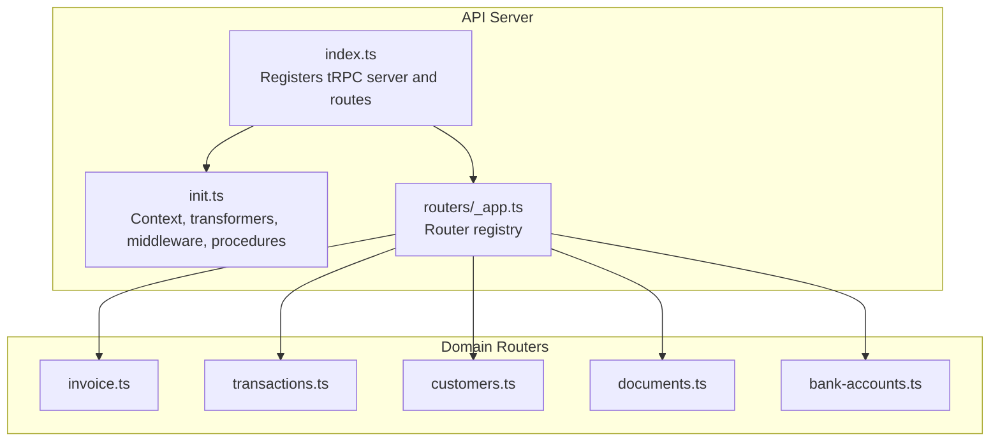
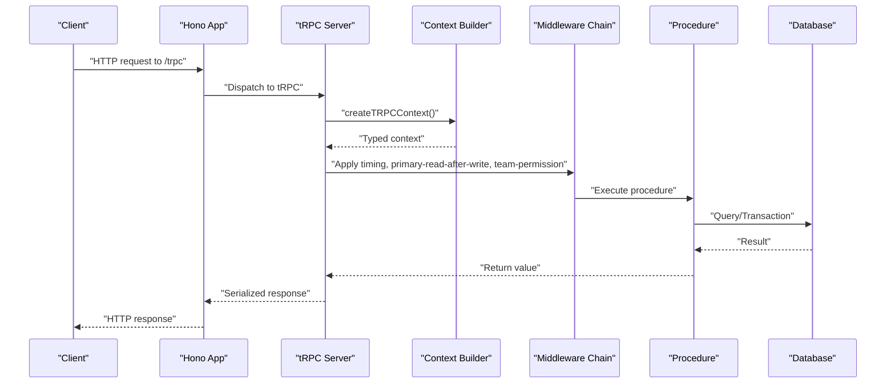
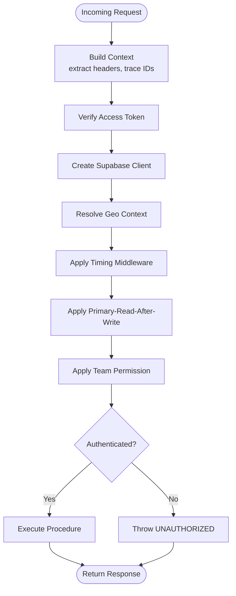
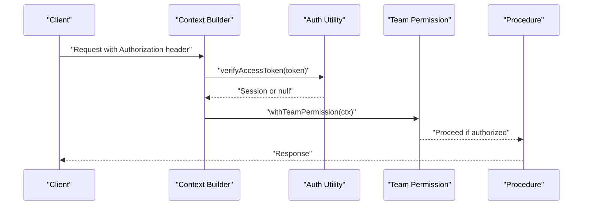
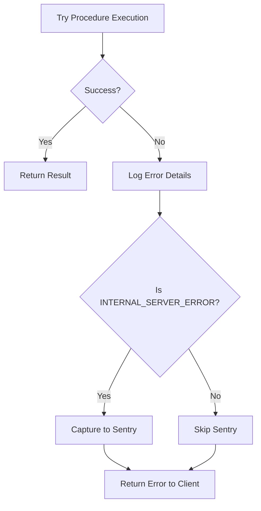
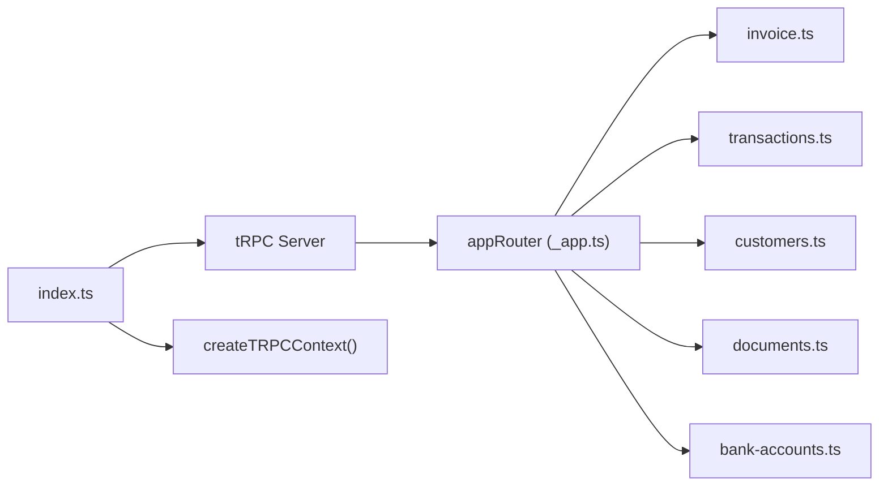

# tRPC Procedures

<cite>
**Referenced Files in This Document**
- [init.ts](file://midday/apps/api/src/trpc/init.ts)
- [_app.ts](file://midday/apps/api/src/trpc/routers/_app.ts)
- [index.ts](file://midday/apps/api/src/index.ts)
- [invoice.ts](file://midday/apps/api/src/trpc/routers/invoice.ts)
- [transactions.ts](file://midday/apps/api/src/trpc/routers/transactions.ts)
- [customers.ts](file://midday/apps/api/src/trpc/routers/customers.ts)
- [documents.ts](file://midday/apps/api/src/trpc/routers/documents.ts)
- [bank-accounts.ts](file://midday/apps/api/src/trpc/routers/bank-accounts.ts)
- [invoice-schema.ts](file://midday/apps/api/src/schemas/invoice.ts)
- [transactions-schema.ts](file://midday/apps/api/src/schemas/transactions.ts)
- [customers-schema.ts](file://midday/apps/api/src/schemas/customers.ts)
- [documents-schema.ts](file://midday/apps/api/src/schemas/documents.ts)
- [bank-accounts-schema.ts](file://midday/apps/api/src/schemas/bank-accounts.ts)
- [auth.ts](file://midday/apps/api/src/utils/auth.ts)
- [team-permission.ts](file://midday/apps/api/src/trpc/middleware/team-permission.ts)
- [primary-read-after-write.ts](file://midday/apps/api/src/trpc/middleware/primary-read-after-write.ts)
- [dashboard trpc client](file://midday/apps/dashboard/src/trpc/root.ts)
- [dashboard trpc hooks](file://midday/apps/dashboard/src/trpc/hooks.ts)
- [dashboard trpc queries](file://midday/apps/dashboard/src/trpc/queries.ts)
- [dashboard trpc mutations](file://midday/apps/dashboard/src/trpc/mutations.ts)
</cite>

## Table of Contents
1. [Introduction](#introduction)
2. [Project Structure](#project-structure)
3. [Core Components](#core-components)
4. [Architecture Overview](#architecture-overview)
5. [Detailed Component Analysis](#detailed-component-analysis)
6. [Dependency Analysis](#dependency-analysis)
7. [Performance Considerations](#performance-considerations)
8. [Troubleshooting Guide](#troubleshooting-guide)
9. [Conclusion](#conclusion)
10. [Appendices](#appendices)

## Introduction
This document describes Faworra's strongly typed tRPC procedures powering the API backend. It covers router definitions for invoice, transaction, customer, document, and bank account domains, along with tRPC context setup, middleware pipeline, authentication integration, client-side usage patterns, error handling, type safety, procedure composition, batching, subscriptions, real-time features, and performance optimization strategies.

## Project Structure
The tRPC layer is organized around a central initialization module that defines context, middleware, and procedure builders, and a router registry that composes domain-specific routers.

**Diagram sources**
- [index.ts](file://midday/apps/api/src/index.ts#L88-L113)
- [init.ts](file://midday/apps/api/src/trpc/init.ts#L82-L187)
- [_app.ts](file://midday/apps/api/src/trpc/routers/_app.ts#L44-L85)

**Section sources**
- [index.ts](file://midday/apps/api/src/index.ts#L1-L288)
- [init.ts](file://midday/apps/api/src/trpc/init.ts#L1-L187)
- [_app.ts](file://midday/apps/api/src/trpc/routers/_app.ts#L1-L91)

## Core Components
- tRPC context builder: Creates a typed context with session, Supabase client, database handle, geo metadata, team scoping, primary/replica routing hints, and request tracing identifiers.
- Middleware chain: Timing, primary-read-after-write routing, team permission checks, and authentication enforcement.
- Procedure builders: Public, protected, internal, and protected-or-internal procedures with standardized middleware application.
- Router registry: Central composition of domain routers under a single app router.

Key behaviors:
- Authentication: Verified via access token header; internal service calls validated via a dedicated internal key header.
- Team scoping: Procedures enforce team membership and visibility.
- Database routing: Optional override to force writes to the primary database after write operations.
- Request tracing: Request ID and Cloudflare Ray ID propagated through context for observability.

**Section sources**
- [init.ts](file://midday/apps/api/src/trpc/init.ts#L20-L80)
- [init.ts](file://midday/apps/api/src/trpc/init.ts#L89-L187)
- [_app.ts](file://midday/apps/api/src/trpc/routers/_app.ts#L44-L85)

## Architecture Overview
The tRPC server integrates with Hono, exposes OpenAPI documentation, and applies a consistent middleware pipeline to all procedures.

**Diagram sources**
- [index.ts](file://midday/apps/api/src/index.ts#L88-L113)
- [init.ts](file://midday/apps/api/src/trpc/init.ts#L32-L80)
- [init.ts](file://midday/apps/api/src/trpc/init.ts#L89-L187)

## Detailed Component Analysis

### tRPC Context and Middleware Pipeline
- Context fields: session, supabase client, database handle, geo metadata, teamId, forcePrimary, isInternalRequest, requestId, cfRay.
- Middleware:
  - Timing: logs procedure durations when debug mode is enabled.
  - Primary-read-after-write: Ensures reads after writes use the primary database when requested.
  - Team permission: Enforces team-scoped access for protected procedures.
  - Authentication: Validates session for protected/internal procedures; rejects missing/unauthorized sessions.

**Diagram sources**
- [init.ts](file://midday/apps/api/src/trpc/init.ts#L32-L80)
- [init.ts](file://midday/apps/api/src/trpc/init.ts#L89-L187)

**Section sources**
- [init.ts](file://midday/apps/api/src/trpc/init.ts#L20-L80)
- [init.ts](file://midday/apps/api/src/trpc/init.ts#L89-L187)

### Invoice Procedures
Domain: Invoice management, including creation, updates, payments, templates, and recurring invoices.

- Router: invoice.ts
- Validation schemas: invoice-schema.ts
- Typical procedures:
  - Create/update invoice
  - List invoices with filters
  - Get invoice by ID
  - Delete invoice
  - Manage invoice payments
  - Manage invoice products
  - Manage invoice templates
  - Manage recurring invoices

Input/Output types:
- Inputs: Strongly typed based on zod schemas in invoice-schema.ts.
- Outputs: Domain entity shapes for invoices, payments, products, templates, and recurring schedules.

Validation:
- Zod schemas define strict input validation and serialization.

Return formats:
- JSON serialized via superjson transformer; strongly typed outputs inferred from router definitions.

Real-time:
- Subscriptions supported via tRPC subscriptions; see Subscription Patterns below.

**Section sources**
- [invoice.ts](file://midday/apps/api/src/trpc/routers/invoice.ts)
- [invoice-schema.ts](file://midday/apps/api/src/schemas/invoice.ts)

### Transaction Procedures
Domain: Bank transaction ingestion, categorization, tagging, and retrieval.

- Router: transactions.ts
- Validation schemas: transactions-schema.ts
- Typical procedures:
  - List transactions with pagination and filters
  - Get transaction by ID
  - Create/update/delete transactions
  - Attach files to transactions
  - Assign categories/tags
  - Bulk operations

Input/Output types:
- Inputs: Transaction creation/update payloads and filters.
- Outputs: Transaction records with related attachments, categories, and tags.

Validation:
- Zod schemas enforce field constraints and data types.

Return formats:
- Strongly typed via tRPC; serialized with superjson.

**Section sources**
- [transactions.ts](file://midday/apps/api/src/trpc/routers/transactions.ts)
- [transactions-schema.ts](file://midday/apps/api/src/schemas/transactions.ts)

### Customer Procedures
Domain: Customer profiles, lists, and related analytics.

- Router: customers.ts
- Validation schemas: customers-schema.ts
- Typical procedures:
  - List customers with filters
  - Get customer by ID
  - Create/update customer
  - Delete customer
  - Export customer data

Input/Output types:
- Inputs: Customer profile fields.
- Outputs: Customer entities and summary metrics.

Validation:
- Strict schemas for create/update operations.

Return formats:
- Strongly typed and serialized.

**Section sources**
- [customers.ts](file://midday/apps/api/src/trpc/routers/customers.ts)
- [customers-schema.ts](file://midday/apps/api/src/schemas/customers.ts)

### Document Procedures
Domain: Document storage, metadata, tagging, and retrieval.

- Router: documents.ts
- Validation schemas: documents-schema.ts
- Typical procedures:
  - Upload and manage document metadata
  - List documents with filters
  - Get document by ID
  - Tag documents
  - Delete documents

Input/Output types:
- Inputs: Document upload and metadata payloads.
- Outputs: Document entities and tag assignments.

Validation:
- Zod schemas for uploads and metadata.

Return formats:
- Strongly typed via tRPC.

**Section sources**
- [documents.ts](file://midday/apps/api/src/trpc/routers/documents.ts)
- [documents-schema.ts](file://midday/apps/api/src/schemas/documents.ts)

### Bank Account Procedures
Domain: Bank account linking, synchronization, and account management.

- Router: bank-accounts.ts
- Validation schemas: bank-accounts-schema.ts
- Typical procedures:
  - List linked bank accounts
  - Get account by ID
  - Sync account transactions
  - Disconnect accounts
  - Reconnect failed accounts

Input/Output types:
- Inputs: Account linking and sync parameters.
- Outputs: Bank account entities and sync status.

Validation:
- Zod schemas for linking and sync operations.

Return formats:
- Strongly typed via tRPC.

**Section sources**
- [bank-accounts.ts](file://midday/apps/api/src/trpc/routers/bank-accounts.ts)
- [bank-accounts-schema.ts](file://midday/apps/api/src/schemas/bank-accounts.ts)

### Authentication Integration
- User-facing authentication: Bearer token extracted from Authorization header; verified via access token utility.
- Internal service authentication: x-internal-key header validated against environment variable.
- Session scoping: Team-aware procedures enforce team membership and visibility.

**Diagram sources**
- [init.ts](file://midday/apps/api/src/trpc/init.ts#L32-L80)
- [auth.ts](file://midday/apps/api/src/utils/auth.ts)
- [team-permission.ts](file://midday/apps/api/src/trpc/middleware/team-permission.ts)

**Section sources**
- [init.ts](file://midday/apps/api/src/trpc/init.ts#L32-L80)
- [auth.ts](file://midday/apps/api/src/utils/auth.ts)
- [team-permission.ts](file://midday/apps/api/src/trpc/middleware/team-permission.ts)

### Client-Side Usage Patterns
- Type-safe clients: Generated TypeScript types from tRPC router outputs enable compile-time safety.
- Queries and mutations: Dashboard uses generated hooks for fetching and mutating data.
- Composition: Combine multiple queries and mutations in React components.
- Batching: tRPC supports automatic batching of requests to reduce overhead.
- Subscriptions: Real-time updates via tRPC subscriptions; WebSocket transport handled by tRPC server.

References:
- Root client definition and router mapping
- Generated hooks and query/mutation utilities

**Section sources**
- [dashboard trpc client](file://midday/apps/dashboard/src/trpc/root.ts)
- [dashboard trpc hooks](file://midday/apps/dashboard/src/trpc/hooks.ts)
- [dashboard trpc queries](file://midday/apps/dashboard/src/trpc/queries.ts)
- [dashboard trpc mutations](file://midday/apps/dashboard/src/trpc/mutations.ts)

### Error Handling
- Global error logging: All tRPC errors are logged with structured context.
- Sentry integration: Internal server errors are captured and tagged with path and input payload.
- Client error filtering: Non-internal errors (e.g., UNAUTHORIZED, NOT_FOUND) are excluded from Sentry to avoid noise.

**Diagram sources**
- [index.ts](file://midday/apps/api/src/index.ts#L93-L111)

**Section sources**
- [index.ts](file://midday/apps/api/src/index.ts#L93-L111)

### Procedure Composition, Batching, and Subscriptions
- Composition: Procedures can call other procedures within the same router or across routers for complex workflows.
- Batching: tRPC automatically batches multiple procedure calls in a single request to minimize network overhead.
- Subscriptions: Real-time updates are supported via tRPC subscriptions; WebSocket transport is managed by the tRPC server.

[No sources needed since this section provides general guidance]

### Real-Time Features and WebSocket Integration
- Subscriptions: Implemented via tRPC subscription procedures in domain routers.
- Transport: WebSocket-based streaming for real-time updates.
- Use cases: Live invoice updates, transaction sync notifications, document processing status.

[No sources needed since this section provides general guidance]

## Dependency Analysis
The API server registers the tRPC server with Hono and wires the app router composed from domain routers.

**Diagram sources**
- [index.ts](file://midday/apps/api/src/index.ts#L88-L113)
- [_app.ts](file://midday/apps/api/src/trpc/routers/_app.ts#L44-L85)

**Section sources**
- [index.ts](file://midday/apps/api/src/index.ts#L88-L113)
- [_app.ts](file://midday/apps/api/src/trpc/routers/_app.ts#L44-L85)

## Performance Considerations
- Transformer: superjson enables robust serialization/deserialization of complex types.
- Timing middleware: Optional performance logging per procedure and request-level aggregation.
- Primary-read-after-write: Ensures eventual consistency by routing reads/writes appropriately.
- Request tracing: Propagates request IDs and Cloudflare Ray IDs for end-to-end tracing.
- Database pool monitoring: Periodic logging of database connection pool statistics.

Recommendations:
- Enable DEBUG_PERF in staging to profile slow procedures.
- Prefer batching for multiple small requests.
- Use selective subscriptions to limit real-time payload volume.
- Cache frequently accessed data at the application layer when appropriate.

**Section sources**
- [init.ts](file://midday/apps/api/src/trpc/init.ts#L82-L84)
- [init.ts](file://midday/apps/api/src/trpc/init.ts#L89-L99)
- [init.ts](file://midday/apps/api/src/trpc/init.ts#L101-L107)
- [index.ts](file://midday/apps/api/src/index.ts#L67-L86)
- [index.ts](file://midday/apps/api/src/index.ts#L186-L199)

## Troubleshooting Guide
Common issues and resolutions:
- UNAUTHORIZED errors: Verify Authorization header and access token validity; confirm internal key headers for service-to-service calls.
- Team permission failures: Ensure the session belongs to the correct team and has required scopes.
- Database consistency: Use forcePrimary flag when reads must reflect recent writes.
- Logging and Sentry: Review tRPC error logs and Sentry events for stack traces and input payloads.

**Section sources**
- [init.ts](file://midday/apps/api/src/trpc/init.ts#L121-L138)
- [init.ts](file://midday/apps/api/src/trpc/init.ts#L146-L159)
- [index.ts](file://midday/apps/api/src/index.ts#L93-L111)

## Conclusion
Faworra’s tRPC layer provides a strongly typed, secure, and observable foundation for remote procedures across invoicing, transactions, customers, documents, and bank accounts. The centralized context and middleware pipeline ensure consistent authentication, team scoping, and performance monitoring, while client-side code generation delivers type safety and ergonomic usage patterns.

## Appendices
- Router registry composition: See app router for all domain routers.
- Client-side integration: Generated tRPC hooks and root client in the dashboard app.

**Section sources**
- [_app.ts](file://midday/apps/api/src/trpc/routers/_app.ts#L44-L85)
- [dashboard trpc client](file://midday/apps/dashboard/src/trpc/root.ts)
- [dashboard trpc hooks](file://midday/apps/dashboard/src/trpc/hooks.ts)
- [dashboard trpc queries](file://midday/apps/dashboard/src/trpc/queries.ts)
- [dashboard trpc mutations](file://midday/apps/dashboard/src/trpc/mutations.ts)