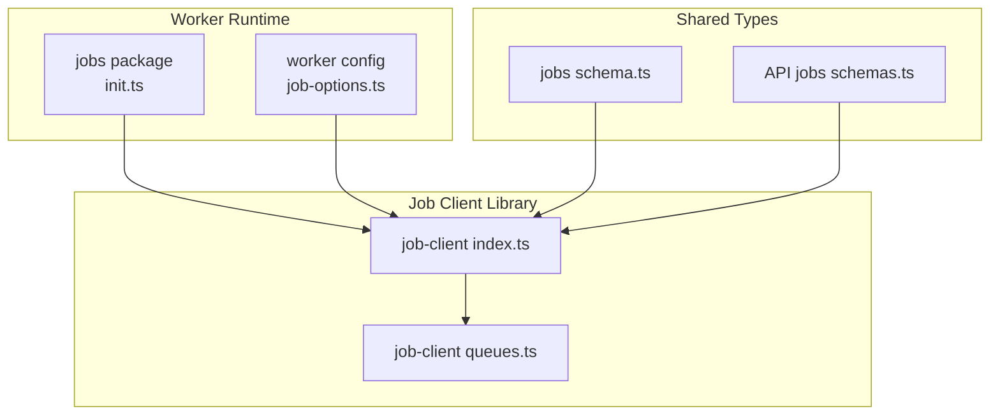
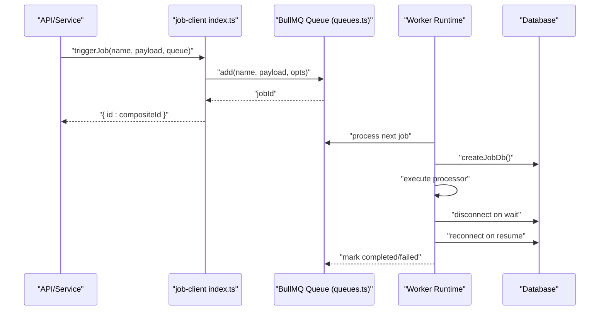
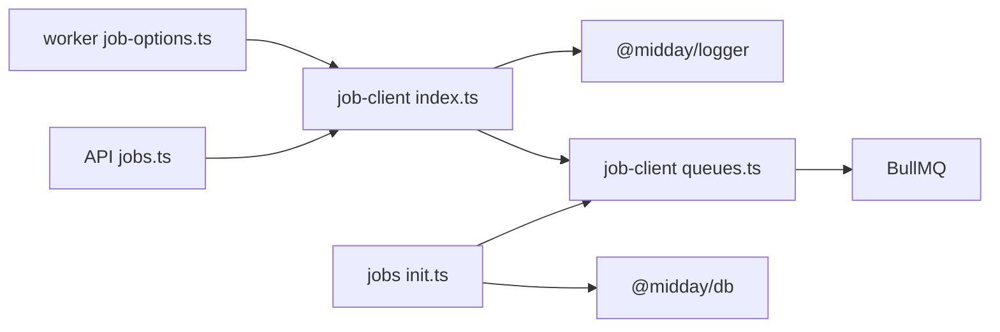
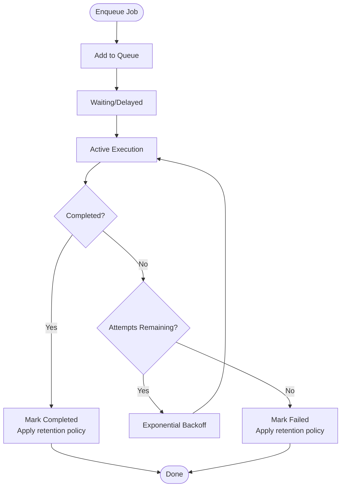

# Background Jobs & Queue Processing

<cite>
**Referenced Files in This Document**
- [init.ts](file://midday/packages/jobs/src/init.ts)
- [schema.ts](file://midday/packages/jobs/src/schema.ts)
- [index.ts](file://midday/packages/job-client/src/index.ts)
- [queues.ts](file://midday/packages/job-client/src/queues.ts)
- [job-options.ts](file://midday/apps/worker/src/config/job-options.ts)
- [jobs.ts](file://midday/apps/api/src/schemas/jobs.ts)
- [job-client package.json](file://midday/packages/job-client/package.json)
- [jobs package.json](file://midday/packages/jobs/package.json)
</cite>

## Table of Contents
1. [Introduction](#introduction)
2. [Project Structure](#project-structure)
3. [Core Components](#core-components)
4. [Architecture Overview](#architecture-overview)
5. [Detailed Component Analysis](#detailed-component-analysis)
6. [Dependency Analysis](#dependency-analysis)
7. [Performance Considerations](#performance-considerations)
8. [Troubleshooting Guide](#troubleshooting-guide)
9. [Conclusion](#conclusion)
10. [Appendices](#appendices)

## Introduction
This document describes Faworra's background job processing system built on BullMQ. It covers queue architecture, job scheduling, worker coordination, configuration, processor patterns, and lifecycle management. It also documents job types (accounting, customer enrichment, document processing, inbox matching, invoice generation), error handling, retries, prioritization, monitoring, scaling, dead-letter strategies, and persistence. Practical examples show how to enqueue jobs, track progress, and optimize performance.

## Project Structure
The job system spans three primary areas:
- Worker runtime initialization and database lifecycle management for jobs
- Client library for enqueuing, waiting, and querying jobs
- Shared job schemas and types used across services

**Diagram sources**
- [init.ts](file://midday/packages/jobs/src/init.ts#L1-L48)
- [job-options.ts](file://midday/apps/worker/src/config/job-options.ts#L1-L14)
- [index.ts](file://midday/packages/job-client/src/index.ts#L1-L324)
- [queues.ts](file://midday/packages/job-client/src/queues.ts#L1-L102)
- [schema.ts](file://midday/packages/jobs/src/schema.ts#L1-L316)
- [jobs.ts](file://midday/apps/api/src/schemas/jobs.ts#L1-L31)

**Section sources**
- [init.ts](file://midday/packages/jobs/src/init.ts#L1-L48)
- [job-options.ts](file://midday/apps/worker/src/config/job-options.ts#L1-L14)
- [index.ts](file://midday/packages/job-client/src/index.ts#L1-L324)
- [queues.ts](file://midday/packages/job-client/src/queues.ts#L1-L102)
- [schema.ts](file://midday/packages/jobs/src/schema.ts#L1-L316)
- [jobs.ts](file://midday/apps/api/src/schemas/jobs.ts#L1-L31)

## Core Components
- BullMQ Queue client with centralized connection options and default job policies
- Job client API for enqueuing, waiting for completion, and querying status
- Worker-side defaults for retries and backoff
- Shared Zod schemas for job payloads and notification-driven jobs
- Worker runtime middleware for database lifecycle during job execution

Key responsibilities:
- Enqueue jobs with optional delay and deduplication via custom job IDs
- Poll for completion with exponential backoff and timeout
- Retrieve job status, progress, and results
- Configure queue-level retention for completed and failed jobs
- Manage database connections per job run to avoid connection starvation

**Section sources**
- [index.ts](file://midday/packages/job-client/src/index.ts#L31-L76)
- [index.ts](file://midday/packages/job-client/src/index.ts#L88-L208)
- [index.ts](file://midday/packages/job-client/src/index.ts#L219-L324)
- [queues.ts](file://midday/packages/job-client/src/queues.ts#L54-L89)
- [job-options.ts](file://midday/apps/worker/src/config/job-options.ts#L7-L13)
- [init.ts](file://midday/packages/jobs/src/init.ts#L26-L47)
- [schema.ts](file://midday/packages/jobs/src/schema.ts#L20-L316)

## Architecture Overview
The system uses BullMQ queues backed by Redis. Clients enqueue jobs into named queues. Workers consume queues and execute processors. The worker runtime initializes a database connection per job run and tears it down on wait/resume to conserve connections.

**Diagram sources**
- [index.ts](file://midday/packages/job-client/src/index.ts#L31-L76)
- [queues.ts](file://midday/packages/job-client/src/queues.ts#L54-L89)
- [init.ts](file://midday/packages/jobs/src/init.ts#L26-L47)

## Detailed Component Analysis

### BullMQ Queue Configuration and Retention
- Connection parsing from REDIS_QUEUE_URL with protocol-aware TLS handling
- Production-specific connection tuning and retry strategy
- Default job options: 3 attempts with exponential backoff starting at 1 second
- Completed job retention: up to 24 hours or 1000 jobs (whichever limit is hit first)
- Failed job retention: up to 7 days
- Global error listener on queues to prevent unhandled exceptions

Operational implications:
- Jobs are resilient to transient failures via retries
- Completed/failed jobs persist for observability and debugging
- Production environments benefit from reduced connection churn and explicit retry limits

**Section sources**
- [queues.ts](file://midday/packages/job-client/src/queues.ts#L14-L49)
- [queues.ts](file://midday/packages/job-client/src/queues.ts#L59-L75)
- [queues.ts](file://midday/packages/job-client/src/queues.ts#L81-L83)

### Job Client API: Enqueue, Wait, and Status
- triggerJob: Adds a job to a named queue with optional delay and custom jobId for deduplication
- triggerJobAndWait: Enqueues and polls for completion with exponential backoff and configurable timeout
- getJobStatus: Resolves queue and job IDs from a composite ID, validates team ownership, and returns status, progress, result, and error

Monitoring and safety:
- Logs enqueue timing and completion metrics
- Polling avoids blocking workers and prevents stalled jobs
- Authorization checks ensure team-visible jobs remain private

**Section sources**
- [index.ts](file://midday/packages/job-client/src/index.ts#L31-L76)
- [index.ts](file://midday/packages/job-client/src/index.ts#L88-L208)
- [index.ts](file://midday/packages/job-client/src/index.ts#L219-L324)

### Worker Defaults and Lifecycle
- DEFAULT_JOB_OPTIONS defines standard retry behavior for workers
- Worker runtime middleware:
  - Creates a fresh database instance per job run
  - Closes connections on wait to free pools
  - Recreates connections on resume after suspension

This pattern ensures predictable resource usage and avoids connection leaks in long-running or suspended jobs.

**Section sources**
- [job-options.ts](file://midday/apps/worker/src/config/job-options.ts#L7-L13)
- [init.ts](file://midday/packages/jobs/src/init.ts#L26-L47)

### Job Schemas and Payload Types
The jobs package defines Zod schemas for job payloads and notification-driven job payloads. These include:
- Invoice generation and reminders
- Document processing and attachments
- Transaction exports and imports
- Bank connection setup and reconnection
- Inbox setup and Slack uploads
- Customer invitations and base currency updates
- Team deletion and onboardboarding

These schemas standardize payloads and enable strong typing across services.

**Section sources**
- [schema.ts](file://midday/packages/jobs/src/schema.ts#L20-L316)

### API Integration for Job Status
The API exposes typed schemas for retrieving job status by composite ID, ensuring consistent request/response shapes for clients.

**Section sources**
- [jobs.ts](file://midday/apps/api/src/schemas/jobs.ts#L7-L31)

## Dependency Analysis
The job client depends on BullMQ and the shared logger. The worker runtime depends on the jobs package for database lifecycle management. The API depends on the job client for status queries.

**Diagram sources**
- [jobs.ts](file://midday/apps/api/src/schemas/jobs.ts#L1-L31)
- [index.ts](file://midday/packages/job-client/src/index.ts#L1-L324)
- [queues.ts](file://midday/packages/job-client/src/queues.ts#L1-L102)
- [job-options.ts](file://midday/apps/worker/src/config/job-options.ts#L1-L14)
- [init.ts](file://midday/packages/jobs/src/init.ts#L1-L48)

**Section sources**
- [job-client package.json](file://midday/packages/job-client/package.json)
- [jobs package.json](file://midday/packages/jobs/package.json)

## Performance Considerations
- Use triggerJobAndWait judiciously; prefer polling for long-running jobs to avoid blocking workers
- Leverage custom jobId for deduplication to prevent redundant work
- Tune queue default attempts/backoff to balance reliability and latency
- Monitor queue backlog and job durations; scale workers horizontally for hot queues
- Keep completed/failed job retention aligned with operational needs to control Redis growth
- Use exponential backoff polling to reduce Redis load for long jobs

[No sources needed since this section provides general guidance]

## Troubleshooting Guide
Common issues and remedies:
- Missing REDIS_QUEUE_URL: The queue client throws an error if the environment variable is absent
- Job timeouts: triggerJobAndWait enforces a timeout; adjust or refactor long-running tasks
- Unauthorized job access: getJobStatus validates team ownership; ensure composite IDs are constructed properly
- Stalled jobs: Avoid waitUntilFinished inside workers; use polling instead
- Connection exhaustion: Worker runtime closes DB connections on wait and recreates on resume

**Section sources**
- [queues.ts](file://midday/packages/job-client/src/queues.ts#L17-L19)
- [index.ts](file://midday/packages/job-client/src/index.ts#L167-L174)
- [index.ts](file://midday/packages/job-client/src/index.ts#L119-L120)
- [init.ts](file://midday/packages/jobs/src/init.ts#L37-L47)

## Conclusion
Faworra’s job system combines BullMQ with a pragmatic client library and worker runtime to deliver reliable, observable background processing. With standardized schemas, robust retry/backoff, and careful resource management, it supports diverse workloads from document processing to invoice generation. Proper monitoring, scaling, and retention policies ensure operational stability and performance.

[No sources needed since this section summarizes without analyzing specific files]

## Appendices

### Job Types and Use Cases
- Accounting: transaction exports, imports, and notifications
- Customer Enrichment: invitations and profile updates
- Document Processing: PDF/text extraction and metadata tagging
- Inbox Matching: auto-matching, cross-currency matching, and review workflows
- Invoice Generation: creation, sending, reminders, scheduling, and cancellation

These types are represented by strongly-typed Zod schemas for safe inter-service communication.

**Section sources**
- [schema.ts](file://midday/packages/jobs/src/schema.ts#L20-L316)

### Job Lifecycle Management

**Diagram sources**
- [queues.ts](file://midday/packages/job-client/src/queues.ts#L61-L75)

### Practical Examples (by file path)
- Enqueue a job: [index.ts](file://midday/packages/job-client/src/index.ts#L31-L76)
- Enqueue and wait for completion: [index.ts](file://midday/packages/job-client/src/index.ts#L88-L208)
- Get job status: [index.ts](file://midday/packages/job-client/src/index.ts#L219-L324)
- Define job payload schemas: [schema.ts](file://midday/packages/jobs/src/schema.ts#L20-L316)
- Worker retry defaults: [job-options.ts](file://midday/apps/worker/src/config/job-options.ts#L7-L13)
- Worker DB lifecycle: [init.ts](file://midday/packages/jobs/src/init.ts#L26-L47)