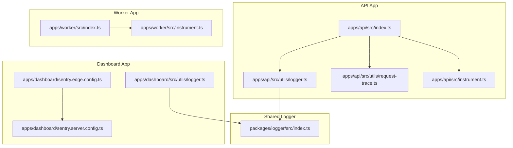
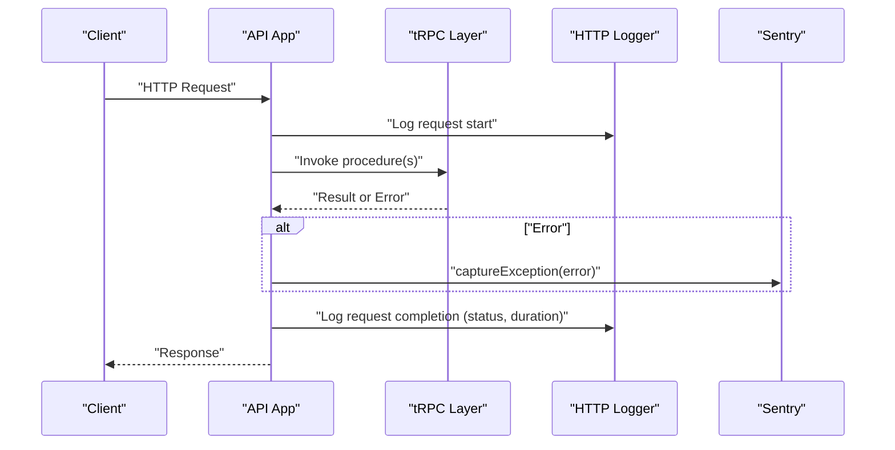
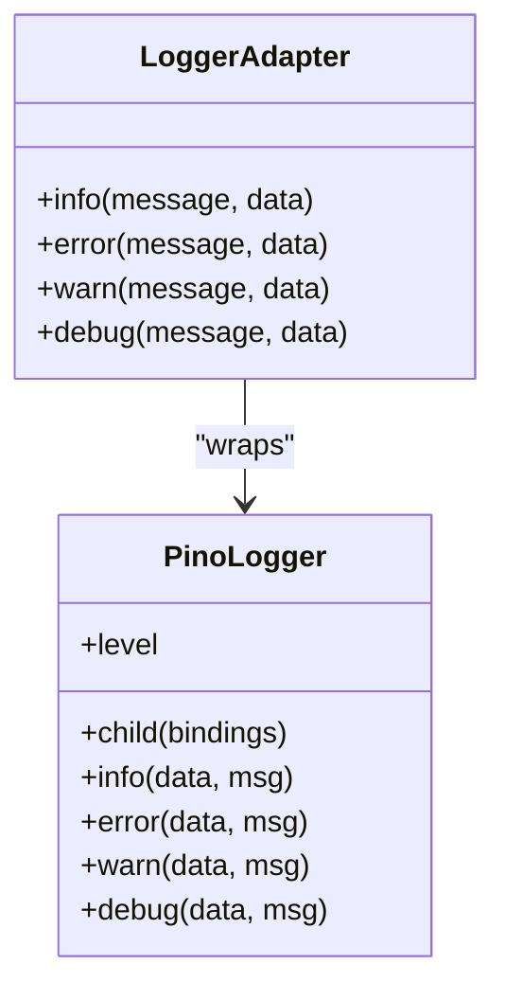
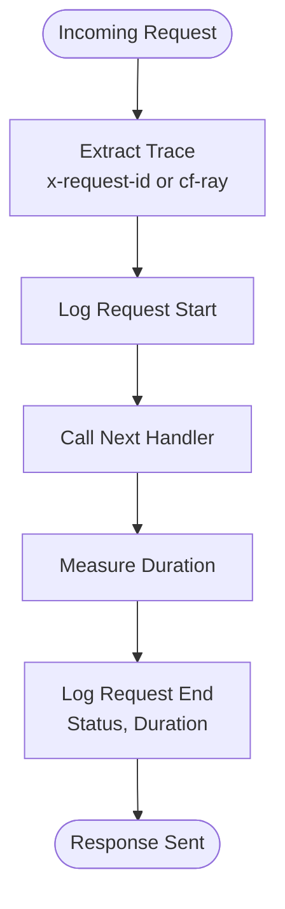
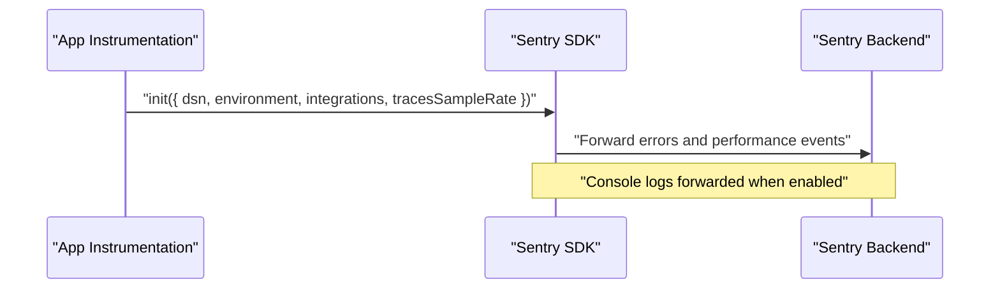
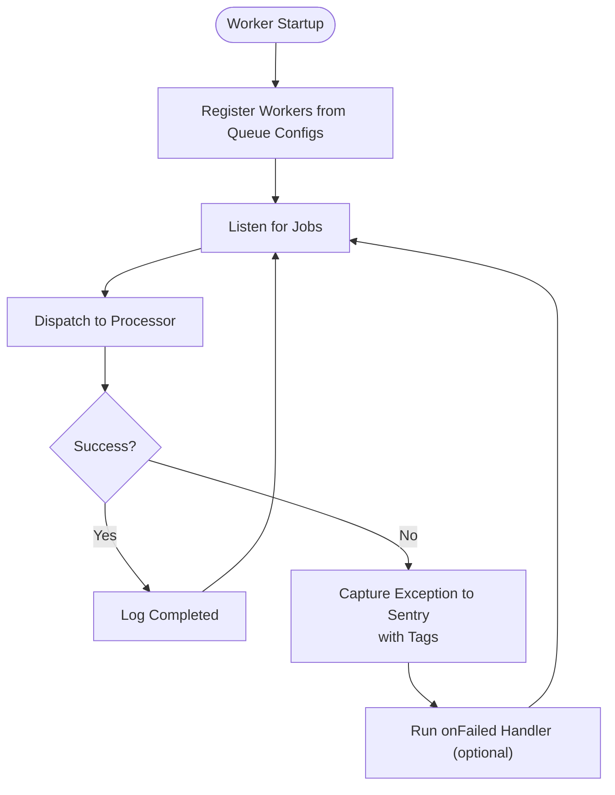
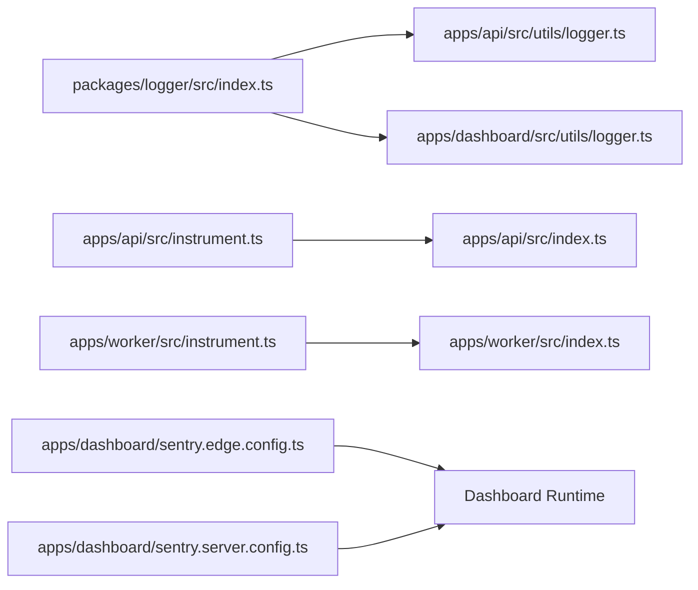

# Debugging & Profiling Tools

<cite>
**Referenced Files in This Document**
- [packages/logger/src/index.ts](file://packages/logger/src/index.ts)
- [apps/api/src/utils/logger.ts](file://apps/api/src/utils/logger.ts)
- [apps/api/src/utils/request-trace.ts](file://apps/api/src/utils/request-trace.ts)
- [apps/api/src/instrument.ts](file://apps/api/src/instrument.ts)
- [apps/api/src/index.ts](file://apps/api/src/index.ts)
- [apps/worker/src/instrument.ts](file://apps/worker/src/instrument.ts)
- [apps/worker/src/index.ts](file://apps/worker/src/index.ts)
- [apps/dashboard/sentry.edge.config.ts](file://apps/dashboard/sentry.edge.config.ts)
- [apps/dashboard/sentry.server.config.ts](file://apps/dashboard/sentry.server.config.ts)
- [apps/dashboard/src/utils/logger.ts](file://apps/dashboard/src/utils/logger.ts)
</cite>

## Table of Contents
1. [Introduction](#introduction)
2. [Project Structure](#project-structure)
3. [Core Components](#core-components)
4. [Architecture Overview](#architecture-overview)
5. [Detailed Component Analysis](#detailed-component-analysis)
6. [Dependency Analysis](#dependency-analysis)
7. [Performance Considerations](#performance-considerations)
8. [Troubleshooting Guide](#troubleshooting-guide)
9. [Conclusion](#conclusion)

## Introduction
This document explains the debugging and profiling tooling used across Faworra’s applications. It covers logging strategies, structured logging formats, log aggregation approaches, debugging techniques for API endpoints, background jobs, and frontend components, plus profiling tools for performance, memory, and CPU analysis. It also documents error tracking via Sentry, exception handling patterns, and operational debugging workflows for multi-service environments, queues, and real-time features.

## Project Structure
The debugging and profiling tooling spans three primary areas:
- Shared structured logging via a dedicated logger package
- Application-specific logging middleware and request tracing
- Sentry-powered error tracking and performance monitoring
- Worker-side job processing with centralized error capture and health endpoints

**Diagram sources**
- [apps/api/src/index.ts](file://apps/api/src/index.ts#L1-L288)
- [apps/api/src/utils/logger.ts](file://apps/api/src/utils/logger.ts#L1-L33)
- [apps/api/src/utils/request-trace.ts](file://apps/api/src/utils/request-trace.ts#L1-L17)
- [apps/api/src/instrument.ts](file://apps/api/src/instrument.ts#L1-L54)
- [apps/worker/src/index.ts](file://apps/worker/src/index.ts#L1-L312)
- [apps/worker/src/instrument.ts](file://apps/worker/src/instrument.ts#L1-L35)
- [apps/dashboard/sentry.edge.config.ts](file://apps/dashboard/sentry.edge.config.ts#L1-L22)
- [apps/dashboard/sentry.server.config.ts](file://apps/dashboard/sentry.server.config.ts#L1-L21)
- [apps/dashboard/src/utils/logger.ts](file://apps/dashboard/src/utils/logger.ts#L1-L4)
- [packages/logger/src/index.ts](file://packages/logger/src/index.ts#L1-L145)

**Section sources**
- [apps/api/src/index.ts](file://apps/api/src/index.ts#L1-L288)
- [apps/worker/src/index.ts](file://apps/worker/src/index.ts#L1-L312)
- [apps/dashboard/sentry.edge.config.ts](file://apps/dashboard/sentry.edge.config.ts#L1-L22)
- [apps/dashboard/sentry.server.config.ts](file://apps/dashboard/sentry.server.config.ts#L1-L21)
- [packages/logger/src/index.ts](file://packages/logger/src/index.ts#L1-L145)

## Core Components
- Structured logging with Pino and a logger adapter that supports contextual prefixes, runtime log level changes, and safe serialization.
- HTTP request logging middleware for API requests with timing and correlation IDs.
- Request tracing utilities to propagate x-request-id or fallback to cf-ray or UUID.
- Sentry integration for error capture, performance monitoring, and logs forwarding in API, worker, and dashboard apps.
- Worker job processing with centralized error handling, failure tagging, and health/readiness endpoints.

Key implementation references:
- Shared logger adapter and Pino configuration: [packages/logger/src/index.ts](file://packages/logger/src/index.ts#L1-L145)
- API HTTP logger middleware: [apps/api/src/utils/logger.ts](file://apps/api/src/utils/logger.ts#L1-L33)
- Request tracing helpers: [apps/api/src/utils/request-trace.ts](file://apps/api/src/utils/request-trace.ts#L1-L17)
- API Sentry initialization: [apps/api/src/instrument.ts](file://apps/api/src/instrument.ts#L1-L54)
- Worker Sentry initialization: [apps/worker/src/instrument.ts](file://apps/worker/src/instrument.ts#L1-L35)
- Dashboard Sentry configs: [apps/dashboard/sentry.edge.config.ts](file://apps/dashboard/sentry.edge.config.ts#L1-L22), [apps/dashboard/sentry.server.config.ts](file://apps/dashboard/sentry.server.config.ts#L1-L21)
- Worker job error handling and health endpoints: [apps/worker/src/index.ts](file://apps/worker/src/index.ts#L1-L312)
- API error handling and DB pool stats logging: [apps/api/src/index.ts](file://apps/api/src/index.ts#L1-L288)

**Section sources**
- [packages/logger/src/index.ts](file://packages/logger/src/index.ts#L1-L145)
- [apps/api/src/utils/logger.ts](file://apps/api/src/utils/logger.ts#L1-L33)
- [apps/api/src/utils/request-trace.ts](file://apps/api/src/utils/request-trace.ts#L1-L17)
- [apps/api/src/instrument.ts](file://apps/api/src/instrument.ts#L1-L54)
- [apps/worker/src/instrument.ts](file://apps/worker/src/instrument.ts#L1-L35)
- [apps/worker/src/index.ts](file://apps/worker/src/index.ts#L1-L312)
- [apps/api/src/index.ts](file://apps/api/src/index.ts#L1-L288)

## Architecture Overview
The system integrates structured logging, request tracing, and Sentry across API, worker, and dashboard applications. The API app logs HTTP requests, captures tRPC errors, and forwards exceptions to Sentry. The worker app runs BullMQ workers, centralizes error handling, and exposes a Workbench dashboard for queue inspection. Sentry is initialized differently per app, enabling performance sampling and logs forwarding.

**Diagram sources**
- [apps/api/src/utils/logger.ts](file://apps/api/src/utils/logger.ts#L1-L33)
- [apps/api/src/index.ts](file://apps/api/src/index.ts#L88-L113)
- [apps/api/src/instrument.ts](file://apps/api/src/instrument.ts#L1-L54)

**Section sources**
- [apps/api/src/utils/logger.ts](file://apps/api/src/utils/logger.ts#L1-L33)
- [apps/api/src/index.ts](file://apps/api/src/index.ts#L88-L113)
- [apps/api/src/instrument.ts](file://apps/api/src/instrument.ts#L1-L54)

## Detailed Component Analysis

### Structured Logging Package
The shared logger package provides:
- Pino-backed logger with configurable pretty-printing in development and JSON in production
- Safe serializer bindings for requests, responses, and errors
- Logger adapter with contextual prefixes and runtime log level changes
- Child logger creation for scoping logs by component or subsystem

**Diagram sources**
- [packages/logger/src/index.ts](file://packages/logger/src/index.ts#L39-L114)

Operational characteristics:
- Environment-driven pretty printing and log level
- Robustness against transport stream errors
- Context-aware logging via child loggers

**Section sources**
- [packages/logger/src/index.ts](file://packages/logger/src/index.ts#L1-L145)

### API HTTP Logging and Request Tracing
The API app injects an HTTP middleware that:
- Extracts correlation identifiers (x-request-id, cf-ray, or UUID)
- Logs request start and completion with status and duration
- Emits periodic DB pool statistics when enabled

**Diagram sources**
- [apps/api/src/utils/logger.ts](file://apps/api/src/utils/logger.ts#L5-L32)
- [apps/api/src/utils/request-trace.ts](file://apps/api/src/utils/request-trace.ts#L10-L16)
- [apps/api/src/index.ts](file://apps/api/src/index.ts#L186-L199)

Additional performance diagnostics:
- Optional tRPC performance logging gated by an environment flag
- Centralized error handling for tRPC and global Hono error handler

**Section sources**
- [apps/api/src/utils/logger.ts](file://apps/api/src/utils/logger.ts#L1-L33)
- [apps/api/src/utils/request-trace.ts](file://apps/api/src/utils/request-trace.ts#L1-L17)
- [apps/api/src/index.ts](file://apps/api/src/index.ts#L67-L86)
- [apps/api/src/index.ts](file://apps/api/src/index.ts#L201-L211)

### Sentry Integration
Sentry is initialized per application with tailored configurations:
- API app: initializes Sentry with console logs integration, performance sampling, and filters for health endpoints
- Worker app: similar setup with filters excluding admin endpoints
- Dashboard app: Sentry configs for edge and server runtimes with sampling and logs enabled

**Diagram sources**
- [apps/api/src/instrument.ts](file://apps/api/src/instrument.ts#L3-L52)
- [apps/worker/src/instrument.ts](file://apps/worker/src/instrument.ts#L3-L33)
- [apps/dashboard/sentry.edge.config.ts](file://apps/dashboard/sentry.edge.config.ts#L8-L21)
- [apps/dashboard/sentry.server.config.ts](file://apps/dashboard/sentry.server.config.ts#L7-L20)

**Section sources**
- [apps/api/src/instrument.ts](file://apps/api/src/instrument.ts#L1-L54)
- [apps/worker/src/instrument.ts](file://apps/worker/src/instrument.ts#L1-L35)
- [apps/dashboard/sentry.edge.config.ts](file://apps/dashboard/sentry.edge.config.ts#L1-L22)
- [apps/dashboard/sentry.server.config.ts](file://apps/dashboard/sentry.server.config.ts#L1-L21)

### Worker Job Processing and Health
The worker app:
- Dynamically creates BullMQ workers per queue configuration
- Centralizes error and failure handling with Sentry tagging
- Exposes health/readiness endpoints and a Workbench dashboard for queue inspection
- Periodically logs DB pool statistics and implements graceful shutdown

**Diagram sources**
- [apps/worker/src/index.ts](file://apps/worker/src/index.ts#L25-L118)
- [apps/worker/src/index.ts](file://apps/worker/src/index.ts#L177-L182)
- [apps/worker/src/index.ts](file://apps/worker/src/index.ts#L232-L277)

**Section sources**
- [apps/worker/src/index.ts](file://apps/worker/src/index.ts#L1-L312)

### Frontend Logging Utilities
The dashboard app includes a lightweight logger utility that delegates to console, suitable for client-side debugging and non-production contexts.

**Section sources**
- [apps/dashboard/src/utils/logger.ts](file://apps/dashboard/src/utils/logger.ts#L1-L4)

## Dependency Analysis
The following diagram shows how applications depend on the shared logger and Sentry configurations:

**Diagram sources**
- [packages/logger/src/index.ts](file://packages/logger/src/index.ts#L1-L145)
- [apps/api/src/utils/logger.ts](file://apps/api/src/utils/logger.ts#L1-L33)
- [apps/dashboard/src/utils/logger.ts](file://apps/dashboard/src/utils/logger.ts#L1-L4)
- [apps/api/src/instrument.ts](file://apps/api/src/instrument.ts#L1-L54)
- [apps/api/src/index.ts](file://apps/api/src/index.ts#L1-L288)
- [apps/worker/src/instrument.ts](file://apps/worker/src/instrument.ts#L1-L35)
- [apps/worker/src/index.ts](file://apps/worker/src/index.ts#L1-L312)
- [apps/dashboard/sentry.edge.config.ts](file://apps/dashboard/sentry.edge.config.ts#L1-L22)
- [apps/dashboard/sentry.server.config.ts](file://apps/dashboard/sentry.server.config.ts#L1-L21)

**Section sources**
- [packages/logger/src/index.ts](file://packages/logger/src/index.ts#L1-L145)
- [apps/api/src/utils/logger.ts](file://apps/api/src/utils/logger.ts#L1-L33)
- [apps/api/src/instrument.ts](file://apps/api/src/instrument.ts#L1-L54)
- [apps/worker/src/instrument.ts](file://apps/worker/src/instrument.ts#L1-L35)
- [apps/dashboard/sentry.edge.config.ts](file://apps/dashboard/sentry.edge.config.ts#L1-L22)
- [apps/dashboard/sentry.server.config.ts](file://apps/dashboard/sentry.server.config.ts#L1-L21)

## Performance Considerations
- Logging overhead: Pino is optimized for speed; pretty printing is controlled by an environment variable to avoid dev-mode overhead in production.
- Request tracing: Minimal overhead via header extraction and optional fallback generation.
- Sentry sampling: Controlled trace sampling rates reduce telemetry volume in production.
- DB pool stats: Optional periodic logging of pool stats helps detect connection pressure without continuous overhead.
- Worker shutdown: Graceful shutdown ensures in-flight jobs complete and Sentry events flush.

[No sources needed since this section provides general guidance]

## Troubleshooting Guide

Common debugging workflows:
- API request tracing
  - Ensure x-request-id is propagated; if absent, cf-ray or a generated UUID is used.
  - Verify HTTP logging middleware is active and inspect request start/completion logs.
  - Check DB pool stats logs for connection saturation.

- tRPC error diagnostics
  - Inspect tRPC error handler logs and Sentry events tagged with source and path.
  - Review performance logs when DEBUG_PERF is enabled.

- Worker job failures
  - Confirm worker error and failed handlers are capturing exceptions and tags.
  - Use the Workbench dashboard to inspect queues, failed jobs, and retry policies.
  - Validate readiness endpoints for DB/queue connectivity.

- Sentry visibility
  - Verify DSN and environment variables are set appropriately per app.
  - Confirm trace sampling and beforeSend filters align with desired coverage.
  - Check that console logs integration is enabled to forward logs to Sentry.

Diagnostic commands and checks:
- Health endpoints
  - API: GET /health and /health/ready
  - Worker: GET /health and /health/ready
- DB pool stats
  - API: periodic logs emitted when interval > 0
  - Worker: periodic logs emitted when interval > 0
- Workbench dashboard
  - Worker: mounted under /admin with optional basic auth

Operational tips:
- Increase log level temporarily using the runtime log level setter in the logger package for deeper inspection.
- Use request IDs to correlate logs across API, worker, and external services.
- For long-running jobs, monitor worker shutdown logs to ensure graceful termination.

**Section sources**
- [apps/api/src/utils/request-trace.ts](file://apps/api/src/utils/request-trace.ts#L10-L16)
- [apps/api/src/utils/logger.ts](file://apps/api/src/utils/logger.ts#L5-L32)
- [apps/api/src/index.ts](file://apps/api/src/index.ts#L118-L130)
- [apps/api/src/index.ts](file://apps/api/src/index.ts#L186-L199)
- [apps/api/src/index.ts](file://apps/api/src/index.ts#L88-L113)
- [apps/worker/src/index.ts](file://apps/worker/src/index.ts#L177-L182)
- [apps/worker/src/index.ts](file://apps/worker/src/index.ts#L205-L226)
- [apps/worker/src/index.ts](file://apps/worker/src/index.ts#L134-L162)
- [apps/api/src/instrument.ts](file://apps/api/src/instrument.ts#L3-L52)
- [apps/worker/src/instrument.ts](file://apps/worker/src/instrument.ts#L3-L33)
- [packages/logger/src/index.ts](file://packages/logger/src/index.ts#L140-L142)

## Conclusion
Faworra’s debugging and profiling toolchain combines a robust, structured logger, request tracing, and Sentry-powered error tracking across API, worker, and dashboard applications. The design emphasizes observability with minimal overhead, centralized error capture, and practical operational controls such as health endpoints, DB pool stats, and graceful shutdowns. Teams can leverage request IDs, contextual logs, and Sentry to diagnose issues quickly across services, queues, and real-time features.