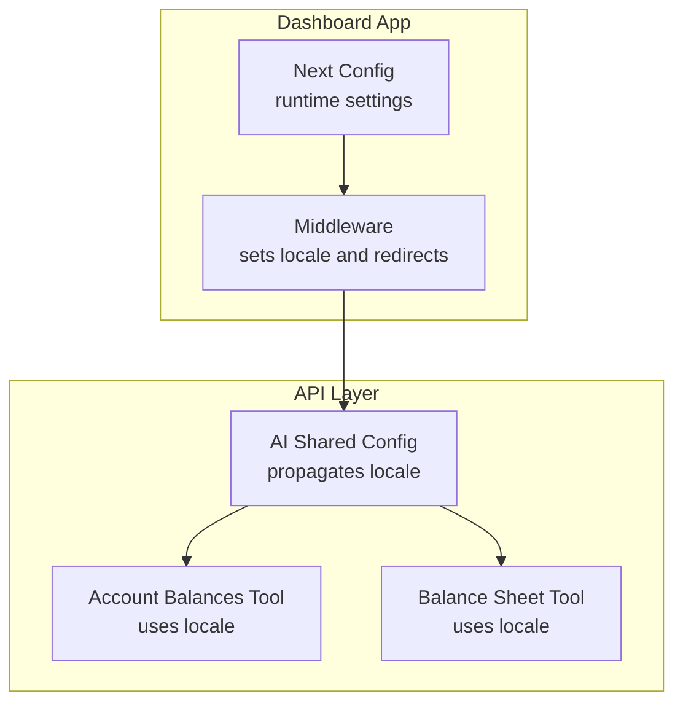
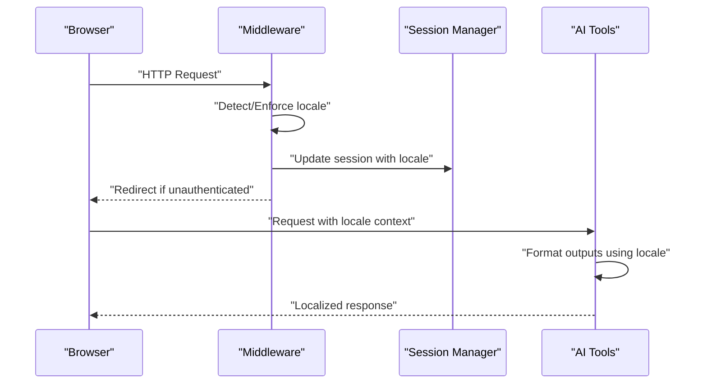
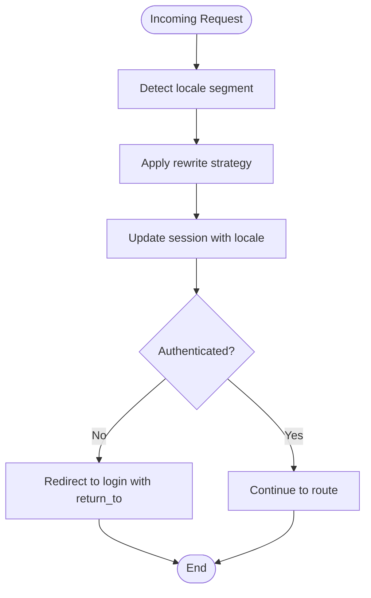
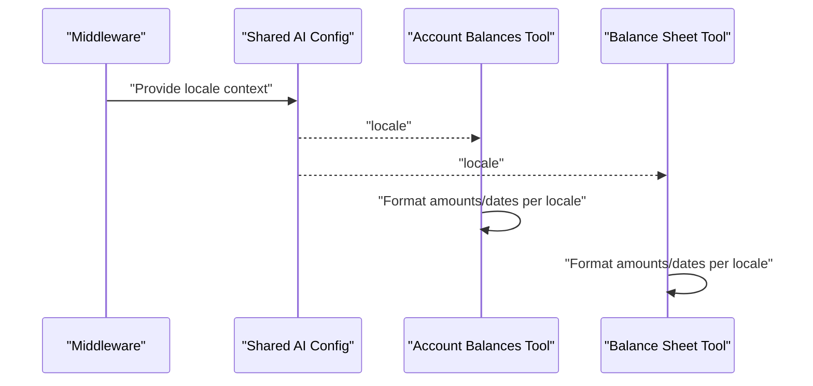
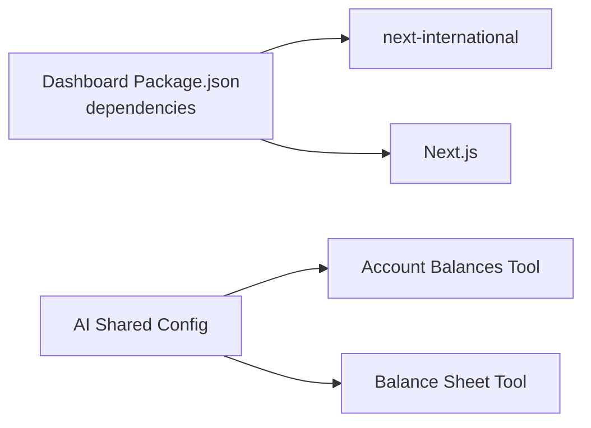

# Internationalization (i18n) & Localization

<cite>
**Referenced Files in This Document**
- [middleware.ts](file://midday/apps/dashboard/src/middleware.ts)
- [next.config.ts](file://midday/apps/dashboard/next.config.ts)
- [package.json](file://midday/apps/dashboard/package.json)
- [shared.ts](file://midday/apps/api/src/ai/agents/config/shared.ts)
- [get-account-balances.ts](file://midday/apps/api/src/ai/tools/get-account-balances.ts)
- [get-balance-sheet.ts](file://midday/apps/api/src/ai/tools/get-balance-sheet.ts)
</cite>

## Table of Contents
1. [Introduction](#introduction)
2. [Project Structure](#project-structure)
3. [Core Components](#core-components)
4. [Architecture Overview](#architecture-overview)
5. [Detailed Component Analysis](#detailed-component-analysis)
6. [Dependency Analysis](#dependency-analysis)
7. [Performance Considerations](#performance-considerations)
8. [Troubleshooting Guide](#troubleshooting-guide)
9. [Conclusion](#conclusion)
10. [Appendices](#appendices)

## Introduction
This document explains Faworra’s internationalization and localization system with a focus on the current implementation in the dashboard application and supporting backend services. It covers the Next.js i18n middleware configuration, locale propagation to server-side logic, and practical guidance for extending language support, organizing translation keys, pluralization, date/time formatting, RTL considerations, currency formatting, and regional customization. The goal is to provide actionable guidance for translators, content creators, and developers working with multilingual features.

## Project Structure
Faworra’s i18n implementation centers around:
- Next.js i18n middleware for routing and locale-aware navigation
- Locale propagation via request context to backend services
- Date/time and number formatting utilities integrated across components and tools

Key locations:
- Dashboard middleware initializes and enforces locale-aware routing
- Next.js configuration supports build and runtime behavior
- Backend AI tools consume locale context for localized financial data presentation

**Diagram sources**
- [middleware.ts](file://midday/apps/dashboard/src/middleware.ts#L7-L11)
- [next.config.ts](file://midday/apps/dashboard/next.config.ts#L1-L95)
- [shared.ts](file://midday/apps/api/src/ai/agents/config/shared.ts#L29-L29)
- [get-account-balances.ts](file://midday/apps/api/src/ai/tools/get-account-balances.ts#L49-L69)
- [get-balance-sheet.ts](file://midday/apps/api/src/ai/tools/get-balance-sheet.ts#L75-L267)

**Section sources**
- [middleware.ts](file://midday/apps/dashboard/src/middleware.ts#L1-L86)
- [next.config.ts](file://midday/apps/dashboard/next.config.ts#L1-L95)

## Core Components
- Next.js i18n Middleware: Initializes locale handling and enforces rewrite strategy for locale segments. It integrates with session management and redirects unauthenticated users appropriately.
- Locale Propagation: The middleware passes locale context downstream to backend services through request context, enabling tools to format financial data according to locale-specific standards.
- Formatting Utilities: Date/time and number formatting are handled via widely adopted libraries integrated in the project dependencies.

Implementation highlights:
- Middleware defines supported locales and default locale, and applies a rewrite strategy for locale segments.
- Session-aware middleware ensures authenticated routes remain locale-aware while enforcing access controls.
- Backend AI tools accept a locale parameter and use it to tailor financial summaries and reports.

**Section sources**
- [middleware.ts](file://midday/apps/dashboard/src/middleware.ts#L7-L11)
- [middleware.ts](file://midday/apps/dashboard/src/middleware.ts#L13-L81)
- [shared.ts](file://midday/apps/api/src/ai/agents/config/shared.ts#L29-L29)
- [shared.ts](file://midday/apps/api/src/ai/agents/config/shared.ts#L71-L71)
- [shared.ts](file://midday/apps/api/src/ai/agents/config/shared.ts#L117-L117)
- [get-account-balances.ts](file://midday/apps/api/src/ai/tools/get-account-balances.ts#L49-L69)
- [get-balance-sheet.ts](file://midday/apps/api/src/ai/tools/get-balance-sheet.ts#L75-L267)

## Architecture Overview
The i18n architecture follows a request-first flow:
- Incoming requests are processed by the middleware to detect or enforce the locale segment.
- The middleware updates session state and redirects as needed.
- Downstream backend services receive locale context and format outputs accordingly.

**Diagram sources**
- [middleware.ts](file://midday/apps/dashboard/src/middleware.ts#L13-L81)
- [shared.ts](file://midday/apps/api/src/ai/agents/config/shared.ts#L117-L117)
- [get-account-balances.ts](file://midday/apps/api/src/ai/tools/get-account-balances.ts#L49-L69)
- [get-balance-sheet.ts](file://midday/apps/api/src/ai/tools/get-balance-sheet.ts#L75-L267)

## Detailed Component Analysis

### Next.js i18n Middleware
- Purpose: Enforce locale-aware routing and integrate with session management.
- Configuration: Defines supported locales, default locale, and URL mapping strategy.
- Behavior: Strips locale prefix for internal routing, performs redirects for unauthenticated users, and preserves return paths.

**Diagram sources**
- [middleware.ts](file://midday/apps/dashboard/src/middleware.ts#L7-L11)
- [middleware.ts](file://midday/apps/dashboard/src/middleware.ts#L13-L81)

**Section sources**
- [middleware.ts](file://midday/apps/dashboard/src/middleware.ts#L7-L11)
- [middleware.ts](file://midday/apps/dashboard/src/middleware.ts#L13-L81)

### Locale Propagation to Backend Services
- Context: The shared AI configuration propagates locale context to tools.
- Usage: Account balances and balance sheet tools consume the locale to format financial data.

**Diagram sources**
- [shared.ts](file://midday/apps/api/src/ai/agents/config/shared.ts#L29-L29)
- [shared.ts](file://midday/apps/api/src/ai/agents/config/shared.ts#L71-L71)
- [shared.ts](file://midday/apps/api/src/ai/agents/config/shared.ts#L117-L117)
- [get-account-balances.ts](file://midday/apps/api/src/ai/tools/get-account-balances.ts#L49-L69)
- [get-balance-sheet.ts](file://midday/apps/api/src/ai/tools/get-balance-sheet.ts#L75-L267)

**Section sources**
- [shared.ts](file://midday/apps/api/src/ai/agents/config/shared.ts#L29-L29)
- [shared.ts](file://midday/apps/api/src/ai/agents/config/shared.ts#L71-L71)
- [shared.ts](file://midday/apps/api/src/ai/agents/config/shared.ts#L117-L117)
- [get-account-balances.ts](file://midday/apps/api/src/ai/tools/get-account-balances.ts#L49-L69)
- [get-balance-sheet.ts](file://midday/apps/api/src/ai/tools/get-balance-sheet.ts#L75-L267)

### Translation Key Organization and Pluralization
- Current state: The repository does not include dedicated translation JSON files under the dashboard app. The i18n middleware currently supports a single locale.
- Recommendation: Introduce a structured translation key hierarchy aligned with feature areas (e.g., shared, auth, dashboard, accounting). Use nested keys for readability and maintainability.
- Pluralization: Implement plural rules per locale using a robust i18n library that supports ICU-style pluralization. Centralize pluralization logic in reusable components or hooks.

[No sources needed since this section provides general guidance]

### Date/Time and Currency Formatting
- Current state: Financial tools pass locale context to formatting functions. The project includes date-fns and related timezone utilities in dependencies.
- Recommendation: Centralize date/time and currency formatting in shared utilities. Use locale-aware formatters for consistent output across components and tools.

**Section sources**
- [package.json](file://midday/apps/dashboard/package.json#L59-L59)
- [get-account-balances.ts](file://midday/apps/api/src/ai/tools/get-account-balances.ts#L49-L69)
- [get-balance-sheet.ts](file://midday/apps/api/src/ai/tools/get-balance-sheet.ts#L75-L267)

### RTL Language Support and Regional Customization
- Current state: No explicit RTL handling or regional customization is present in the analyzed files.
- Recommendation: Add directionality detection and layout adjustments for RTL languages. Provide regional presets for number formats, date formats, and currencies.

[No sources needed since this section provides general guidance]

## Dependency Analysis
The dashboard app depends on Next.js and next-international for middleware-based locale handling. Backend AI tools depend on locale context passed from shared configuration.

**Diagram sources**
- [package.json](file://midday/apps/dashboard/package.json#L69-L69)
- [package.json](file://midday/apps/dashboard/package.json#L68-L68)
- [shared.ts](file://midday/apps/api/src/ai/agents/config/shared.ts#L117-L117)
- [get-account-balances.ts](file://midday/apps/api/src/ai/tools/get-account-balances.ts#L49-L69)
- [get-balance-sheet.ts](file://midday/apps/api/src/ai/tools/get-balance-sheet.ts#L75-L267)

**Section sources**
- [package.json](file://midday/apps/dashboard/package.json#L68-L69)
- [shared.ts](file://midday/apps/api/src/ai/agents/config/shared.ts#L117-L117)

## Performance Considerations
- Middleware overhead: Keep middleware logic minimal and avoid heavy computations per request.
- Dynamic imports: Prefer lazy-loading locale-specific resources to reduce initial bundle size.
- Formatting costs: Cache frequently used formatters and avoid repeated locale parsing.

[No sources needed since this section provides general guidance]

## Troubleshooting Guide
Common issues and resolutions:
- Unexpected locale segment in URLs: Verify middleware rewrite strategy and ensure locale stripping aligns with routing expectations.
- Authentication redirects: Confirm that return_to parameters are preserved during redirects and that protected routes handle locale-aware paths correctly.
- Backend formatting inconsistencies: Ensure locale context is consistently passed from shared configuration to tools and that formatting utilities are applied uniformly.

**Section sources**
- [middleware.ts](file://midday/apps/dashboard/src/middleware.ts#L21-L31)
- [middleware.ts](file://midday/apps/dashboard/src/middleware.ts#L43-L51)
- [shared.ts](file://midday/apps/api/src/ai/agents/config/shared.ts#L117-L117)

## Conclusion
Faworra’s current i18n setup focuses on locale-aware routing and backend localization through shared context. To expand multilingual support, introduce structured translation keys, implement pluralization and RTL handling, and centralize date/time and currency formatting. These enhancements will improve maintainability, consistency, and scalability across the platform.

[No sources needed since this section summarizes without analyzing specific files]

## Appendices

### Adding New Languages
- Extend middleware locales and default locale.
- Introduce translation key files organized by feature area.
- Implement pluralization and date/time formatting per locale.
- Test redirects, authentication flows, and backend formatting.

**Section sources**
- [middleware.ts](file://midday/apps/dashboard/src/middleware.ts#L7-L11)

### Managing Translation Files
- Maintain a clear key hierarchy (e.g., shared, auth, dashboard).
- Use nested keys for context and avoid duplication.
- Centralize pluralization and formatting logic for reuse.

[No sources needed since this section provides general guidance]

### Handling Locale-Specific Content
- Pass locale context from middleware to backend services.
- Apply locale-aware formatting in components and tools.
- Preserve return_to parameters during redirects.

**Section sources**
- [middleware.ts](file://midday/apps/dashboard/src/middleware.ts#L13-L81)
- [shared.ts](file://midday/apps/api/src/ai/agents/config/shared.ts#L117-L117)