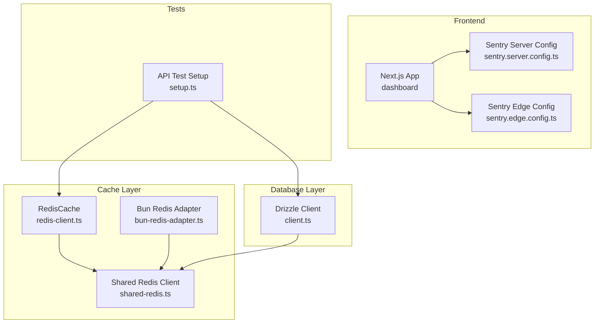
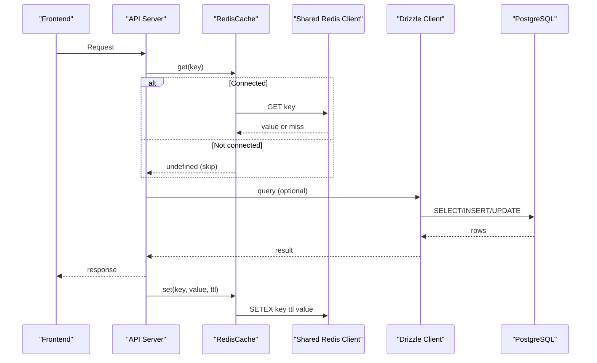
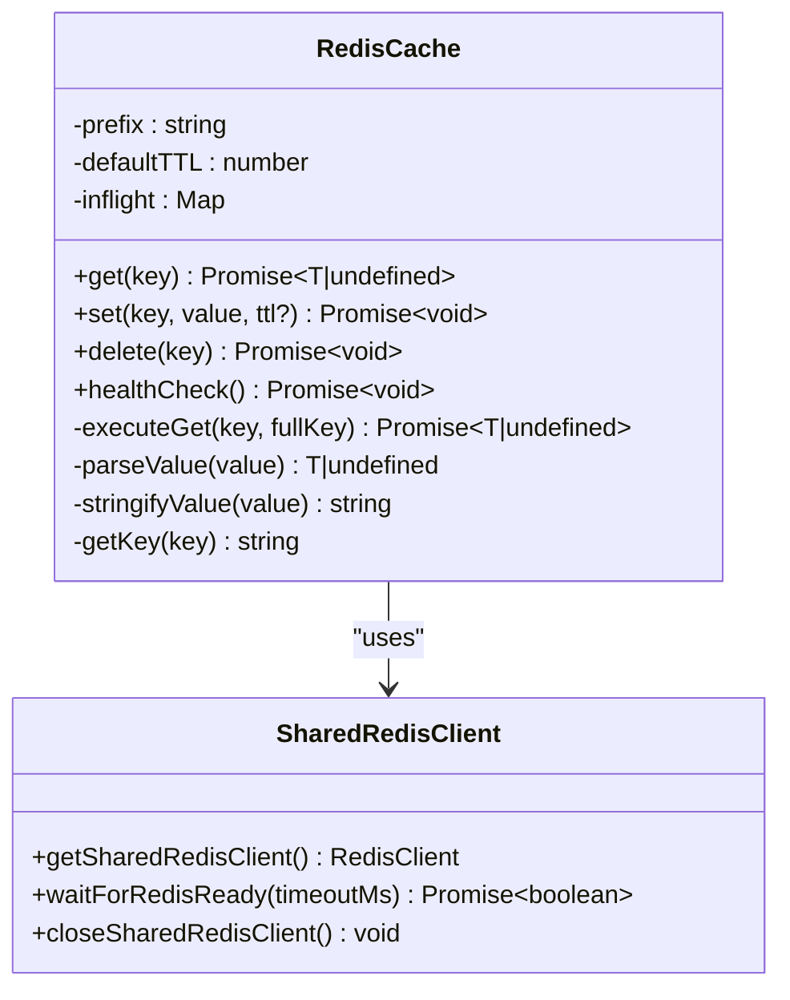
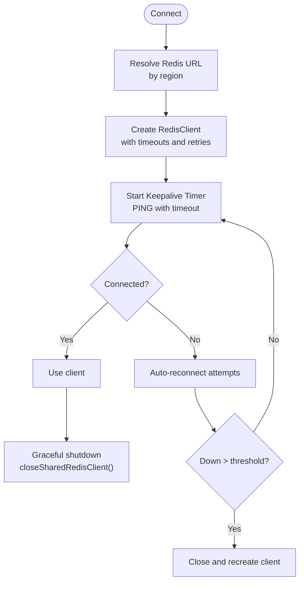
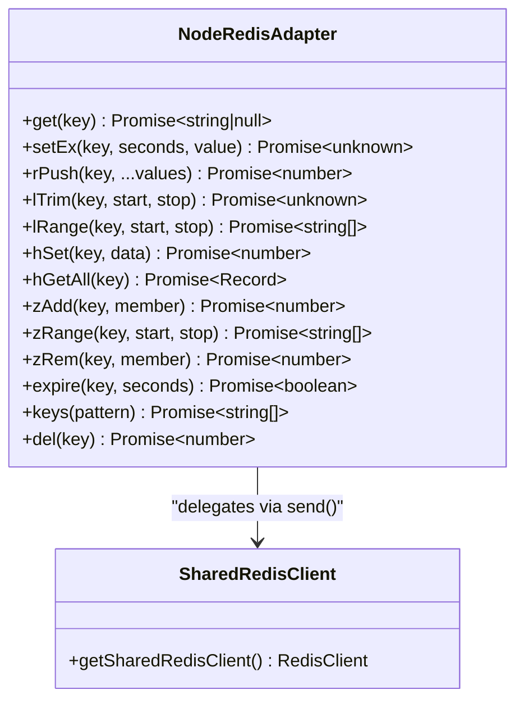
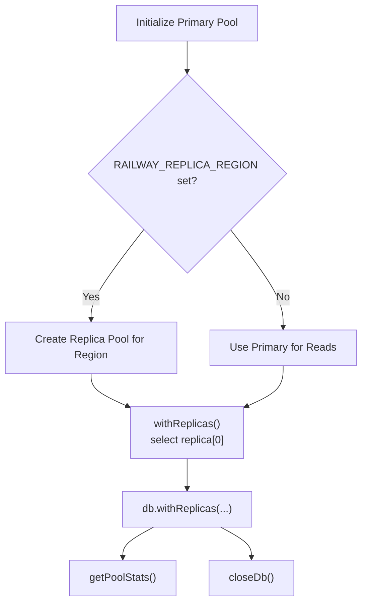
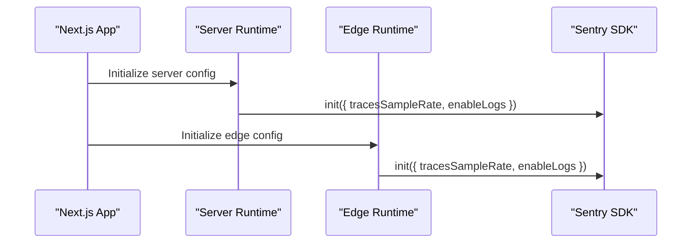
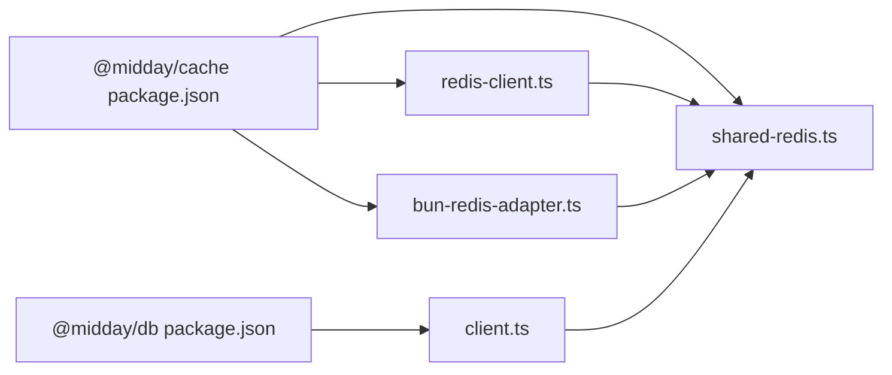

# Performance Optimization & Monitoring

<cite>
**Referenced Files in This Document**
- [redis-client.ts](file://midday/packages/cache/src/redis-client.ts)
- [shared-redis.ts](file://midday/packages/cache/src/shared-redis.ts)
- [bun-redis-adapter.ts](file://midday/packages/cache/src/bun-redis-adapter.ts)
- [client.ts](file://midday/packages/db/src/client.ts)
- [package.json](file://midday/packages/cache/package.json)
- [package.json](file://midday/packages/db/package.json)
- [sentry.server.config.ts](file://midday/apps/dashboard/sentry.server.config.ts)
- [sentry.edge.config.ts](file://midday/apps/dashboard/sentry.edge.config.ts)
- [setup.ts](file://midday/apps/api/src/__tests__/setup.ts)
</cite>

## Table of Contents
1. [Introduction](#introduction)
2. [Project Structure](#project-structure)
3. [Core Components](#core-components)
4. [Architecture Overview](#architecture-overview)
5. [Detailed Component Analysis](#detailed-component-analysis)
6. [Dependency Analysis](#dependency-analysis)
7. [Performance Considerations](#performance-considerations)
8. [Troubleshooting Guide](#troubleshooting-guide)
9. [Conclusion](#conclusion)
10. [Appendices](#appendices)

## Introduction
This document explains Faworra’s performance optimization strategies and monitoring systems across caching, database, frontend, and infrastructure layers. It covers Redis-based caching with connection resilience and TTL management, database connection pooling with replicas and instrumentation, frontend performance via Next.js configuration, and observability with Sentry. Practical guidance is included for profiling, bottleneck identification, scaling, and troubleshooting.

## Project Structure
The performance-critical parts of the system are organized into focused packages and applications:
- Caching: a dedicated cache package with Redis client, shared client, adapters, and specialized caches
- Database: a database package with Drizzle ORM, connection pooling, replicas, and instrumentation
- Frontend: Next.js application with Sentry edge/server configuration
- Tests: a comprehensive test setup that mocks database and cache layers for performance testing

**Diagram sources**
- [redis-client.ts](file://midday/packages/cache/src/redis-client.ts#L25-L208)
- [shared-redis.ts](file://midday/packages/cache/src/shared-redis.ts#L187-L245)
- [bun-redis-adapter.ts](file://midday/packages/cache/src/bun-redis-adapter.ts#L55-L150)
- [client.ts](file://midday/packages/db/src/client.ts#L104-L178)
- [sentry.server.config.ts](file://midday/apps/dashboard/sentry.server.config.ts#L7-L20)
- [sentry.edge.config.ts](file://midday/apps/dashboard/sentry.edge.config.ts#L8-L21)
- [setup.ts](file://midday/apps/api/src/__tests__/setup.ts#L348-L353)

**Section sources**
- [package.json](file://midday/packages/cache/package.json#L1-L30)
- [package.json](file://midday/packages/db/package.json#L1-L59)

## Core Components
- Redis caching with TTL, timeouts, slow command logging, and inflight deduplication
- Shared Redis client with auto-reconnect, keepalive, regional routing, and self-healing
- Bun Redis adapter for AI memory compatibility
- Database client with connection pooling, replica routing, and pool event logging
- Sentry configuration for server and edge environments

**Section sources**
- [redis-client.ts](file://midday/packages/cache/src/redis-client.ts#L25-L208)
- [shared-redis.ts](file://midday/packages/cache/src/shared-redis.ts#L187-L245)
- [bun-redis-adapter.ts](file://midday/packages/cache/src/bun-redis-adapter.ts#L55-L150)
- [client.ts](file://midday/packages/db/src/client.ts#L104-L178)
- [sentry.server.config.ts](file://midday/apps/dashboard/sentry.server.config.ts#L7-L20)
- [sentry.edge.config.ts](file://midday/apps/dashboard/sentry.edge.config.ts#L8-L21)

## Architecture Overview
High-level runtime flow for caching and database performance:

**Diagram sources**
- [redis-client.ts](file://midday/packages/cache/src/redis-client.ts#L68-L120)
- [shared-redis.ts](file://midday/packages/cache/src/shared-redis.ts#L187-L215)
- [client.ts](file://midday/packages/db/src/client.ts#L170-L178)

## Detailed Component Analysis

### Redis Caching Strategy
RedisCache encapsulates:
- Prefix scoping and default TTL
- Inflight request deduplication to avoid thundering herds
- Command timeouts and slow command warnings
- Health checks and graceful fallback when disconnected

**Diagram sources**
- [redis-client.ts](file://midday/packages/cache/src/redis-client.ts#L25-L208)
- [shared-redis.ts](file://midday/packages/cache/src/shared-redis.ts#L187-L245)

Key behaviors:
- Timeout protection prevents stalled commands from blocking callers
- Slow command thresholds log latency for diagnostics
- Inflight map ensures concurrent requests for the same key share a single fetch
- Health checks and fallbacks prevent cascading failures

**Section sources**
- [redis-client.ts](file://midday/packages/cache/src/redis-client.ts#L68-L120)
- [redis-client.ts](file://midday/packages/cache/src/redis-client.ts#L122-L161)
- [redis-client.ts](file://midday/packages/cache/src/redis-client.ts#L163-L190)
- [redis-client.ts](file://midday/packages/cache/src/redis-client.ts#L192-L206)

### Shared Redis Client and Regional Routing
The shared client:
- Selects a regional Redis URL based on environment
- Auto-reconnects with capped retries
- Periodic keepalive with timeout and slow PING warnings
- Self-healing: recreates client if disconnected beyond threshold
- Graceful shutdown support

**Diagram sources**
- [shared-redis.ts](file://midday/packages/cache/src/shared-redis.ts#L12-L30)
- [shared-redis.ts](file://midday/packages/cache/src/shared-redis.ts#L110-L177)
- [shared-redis.ts](file://midday/packages/cache/src/shared-redis.ts#L187-L215)
- [shared-redis.ts](file://midday/packages/cache/src/shared-redis.ts#L217-L230)
- [shared-redis.ts](file://midday/packages/cache/src/shared-redis.ts#L236-L244)

Operational controls:
- Connection timeout and idle timeout tuned per environment
- Keepalive interval and timeout to detect network issues early
- Logging for connection lifecycle and slow operations

**Section sources**
- [shared-redis.ts](file://midday/packages/cache/src/shared-redis.ts#L110-L177)
- [shared-redis.ts](file://midday/packages/cache/src/shared-redis.ts#L187-L215)
- [shared-redis.ts](file://midday/packages/cache/src/shared-redis.ts#L217-L230)
- [shared-redis.ts](file://midday/packages/cache/src/shared-redis.ts#L236-L244)

### Bun Redis Adapter for AI Memory Compatibility
The adapter exposes a node-redis-like interface using Bun’s native RedisClient, enabling integrations that expect PascalCase methods and EX semantics.

**Diagram sources**
- [bun-redis-adapter.ts](file://midday/packages/cache/src/bun-redis-adapter.ts#L15-L29)
- [bun-redis-adapter.ts](file://midday/packages/cache/src/bun-redis-adapter.ts#L55-L150)
- [shared-redis.ts](file://midday/packages/cache/src/shared-redis.ts#L187-L215)

**Section sources**
- [bun-redis-adapter.ts](file://midday/packages/cache/src/bun-redis-adapter.ts#L55-L150)

### Database Connection Pooling and Replicas
The database client:
- Uses a connection pool with environment-aware sizing and timeouts
- Supports regional read replicas with automatic selection
- Instruments pool events and attaches logging for pool lifecycle
- Exposes helpers to get pool stats and close gracefully

**Diagram sources**
- [client.ts](file://midday/packages/db/src/client.ts#L104-L117)
- [client.ts](file://midday/packages/db/src/client.ts#L121-L155)
- [client.ts](file://midday/packages/db/src/client.ts#L170-L178)
- [client.ts](file://midday/packages/db/src/client.ts#L196-L211)
- [client.ts](file://midday/packages/db/src/client.ts#L216-L219)

Operational controls:
- Pool sizes scale with environment (development vs production)
- Idle timeouts and maxUses reduce stale connections
- SSL configuration disabled in development, strict in production
- Pool event logging aids troubleshooting

**Section sources**
- [client.ts](file://midday/packages/db/src/client.ts#L18-L28)
- [client.ts](file://midday/packages/db/src/client.ts#L68-L101)
- [client.ts](file://midday/packages/db/src/client.ts#L104-L178)
- [client.ts](file://midday/packages/db/src/client.ts#L196-L211)
- [client.ts](file://midday/packages/db/src/client.ts#L216-L219)

### Frontend Performance and Observability (Next.js + Sentry)
- Sentry is initialized for server and edge runtimes with sampling and logs enabled
- Production disables debug output and reduces trace sampling to control cost
- Next.js application integrates Sentry configuration files for edge and server contexts

**Diagram sources**
- [sentry.server.config.ts](file://midday/apps/dashboard/sentry.server.config.ts#L7-L20)
- [sentry.edge.config.ts](file://midday/apps/dashboard/sentry.edge.config.ts#L8-L21)

**Section sources**
- [sentry.server.config.ts](file://midday/apps/dashboard/sentry.server.config.ts#L7-L20)
- [sentry.edge.config.ts](file://midday/apps/dashboard/sentry.edge.config.ts#L8-L21)

## Dependency Analysis
Package-level exports and interdependencies:

**Diagram sources**
- [package.json](file://midday/packages/cache/package.json#L13-L28)
- [package.json](file://midday/packages/db/package.json#L21-L36)
- [redis-client.ts](file://midday/packages/cache/src/redis-client.ts#L1-L4)
- [shared-redis.ts](file://midday/packages/cache/src/shared-redis.ts#L1-L4)
- [bun-redis-adapter.ts](file://midday/packages/cache/src/bun-redis-adapter.ts#L13-L13)
- [client.ts](file://midday/packages/db/src/client.ts#L1-L9)

**Section sources**
- [package.json](file://midday/packages/cache/package.json#L13-L28)
- [package.json](file://midday/packages/db/package.json#L21-L36)

## Performance Considerations
- Caching
  - Use appropriate TTLs to balance freshness and load
  - Monitor slow command logs to identify hotspots
  - Leverage inflight deduplication for high-concurrency endpoints
  - Warm caches during deployments using targeted preloading
- Database
  - Tune pool sizes and idle timeouts per environment
  - Prefer regional replicas for read-heavy workloads
  - Instrument and log pool events to track saturation and errors
  - Use connection reuse with maxUses to avoid long-lived stale connections
- Frontend
  - Enable Sentry sampling in production to control overhead
  - Use Next.js static generation and incremental regeneration for content-heavy pages
  - Optimize images and assets with proper compression and formats
- Observability
  - Use Sentry traces and logs to correlate slow requests
  - Track pool utilization and Redis latency to detect bottlenecks
  - Alert on sustained slow PING or elevated Redis command latencies

[No sources needed since this section provides general guidance]

## Troubleshooting Guide
Common issues and remedies:
- Redis connectivity flapping
  - Verify keepalive PING logs and reconnect counts
  - Confirm regional URL resolution and environment variables
  - Check self-healing behavior when downtime exceeds threshold
- Slow database queries
  - Inspect pool stats and event logs for saturation
  - Review idle client errors and connection acquisition timing
  - Validate replica URL selection and fallback to primary
- Frontend performance regressions
  - Compare Sentry trace volumes and error rates
  - Validate image loader and asset pipeline configuration
- Test and local performance validation
  - Use the test setup to mock database and cache layers
  - Simulate cache misses and slow Redis operations under load

**Section sources**
- [shared-redis.ts](file://midday/packages/cache/src/shared-redis.ts#L50-L101)
- [shared-redis.ts](file://midday/packages/cache/src/shared-redis.ts#L187-L215)
- [client.ts](file://midday/packages/db/src/client.ts#L68-L101)
- [client.ts](file://midday/packages/db/src/client.ts#L196-L211)
- [setup.ts](file://midday/apps/api/src/__tests__/setup.ts#L348-L353)

## Conclusion
Faworra’s performance stack combines resilient Redis caching with regional routing, robust database pooling and replicas, and production-grade Sentry observability. By tuning TTLs, pool sizes, and sampling, and by leveraging instrumentation and tests, teams can maintain responsiveness under load and quickly diagnose issues.

[No sources needed since this section summarizes without analyzing specific files]

## Appendices
- Practical examples
  - Cache warming: prefill frequently accessed keys during maintenance windows
  - Invalidation patterns: invalidate by prefix for feature rollouts, use atomic updates for counters
  - Query tuning: add selective indexes on high-cardinality filters; prefer prepared statements
  - Frontend: split large components, defer heavy assets, and leverage Next.js dynamic imports
- Profiling and capacity planning
  - Use Sentry performance metrics to identify hot endpoints
  - Correlate pool utilization and Redis latency to plan capacity increases
  - Run synthetic loads against staging to validate improvements

[No sources needed since this section provides general guidance]