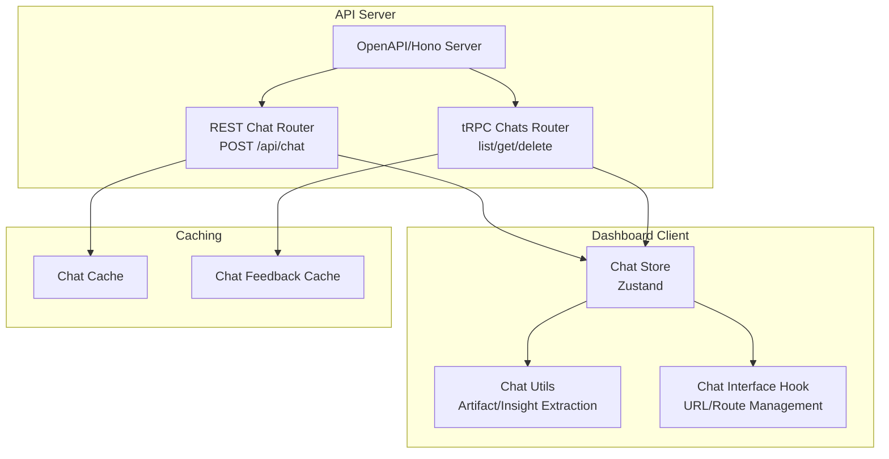
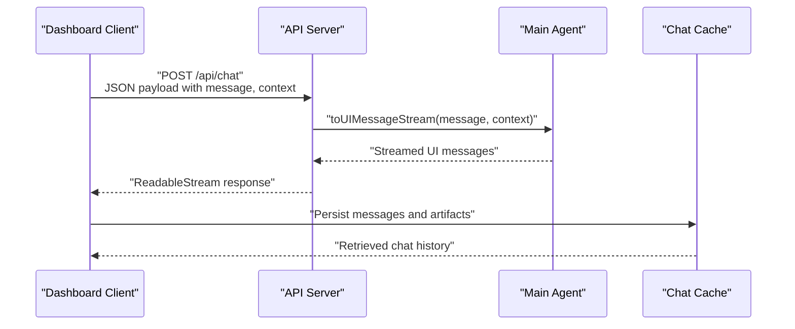
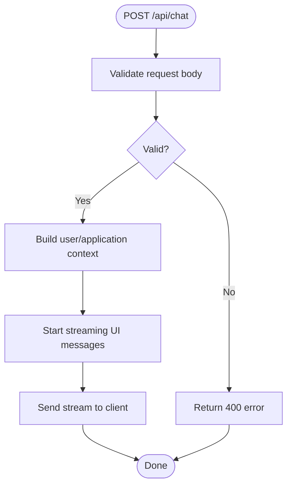
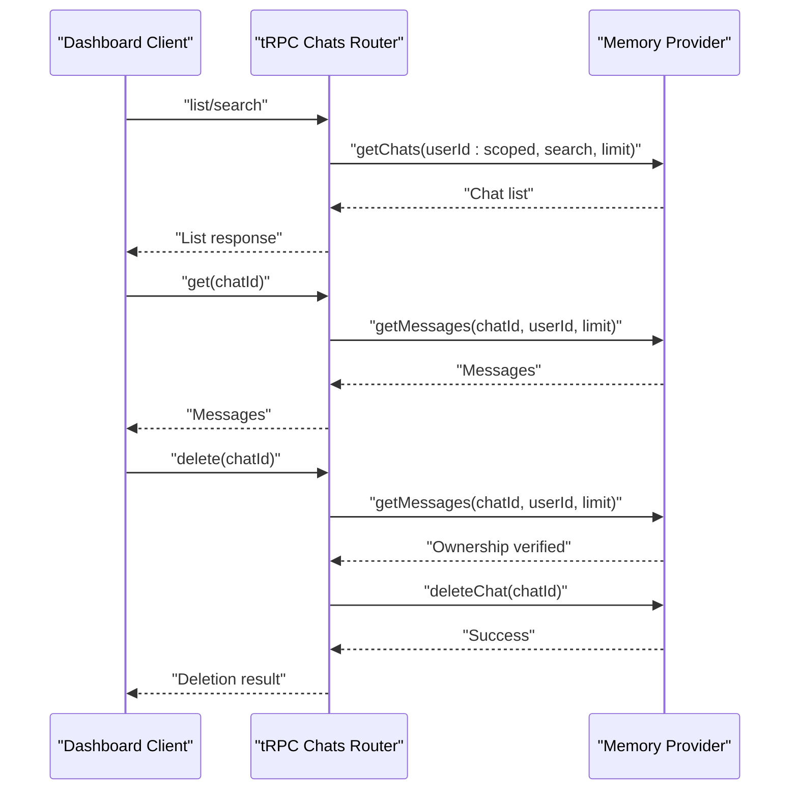
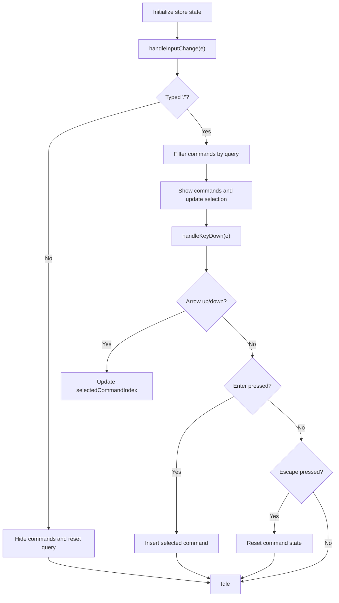
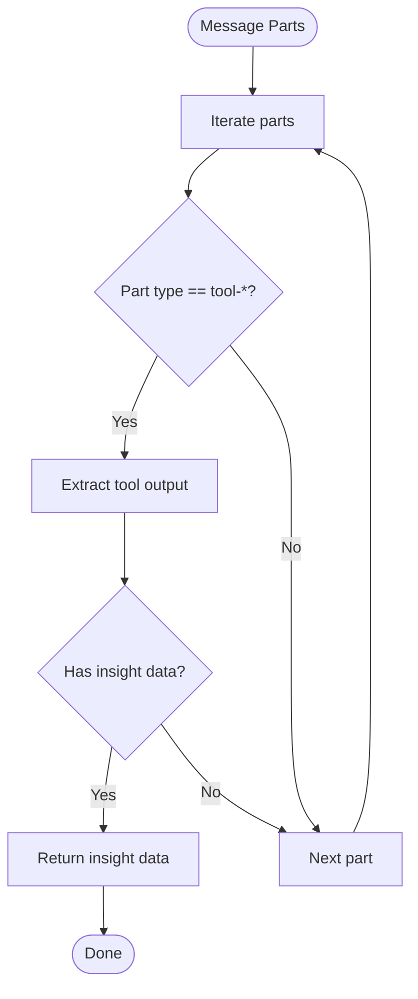
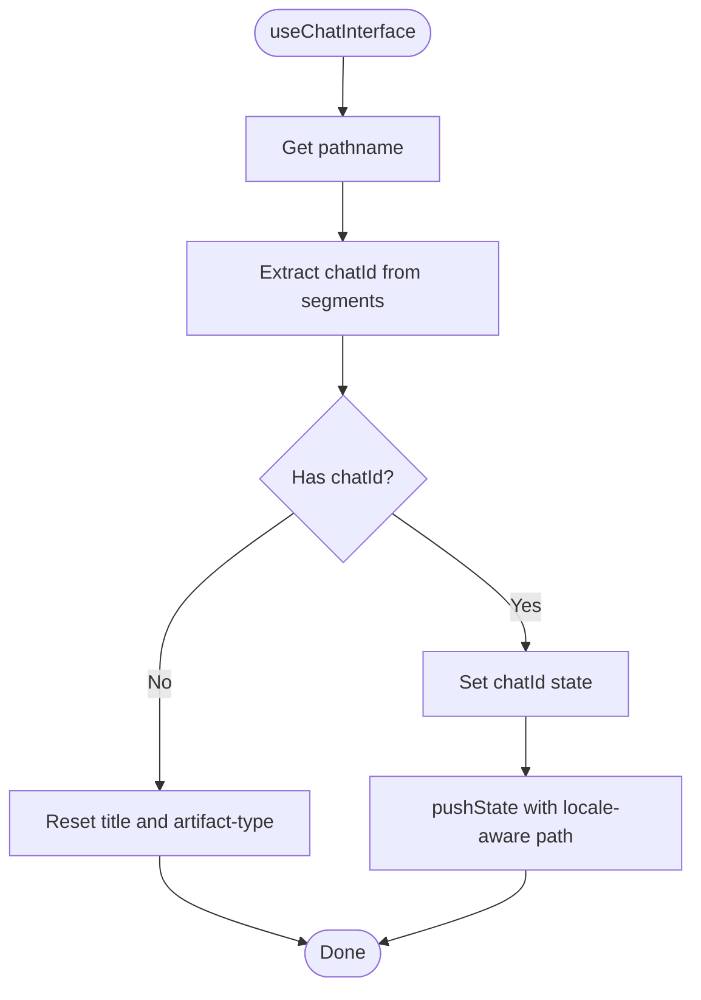
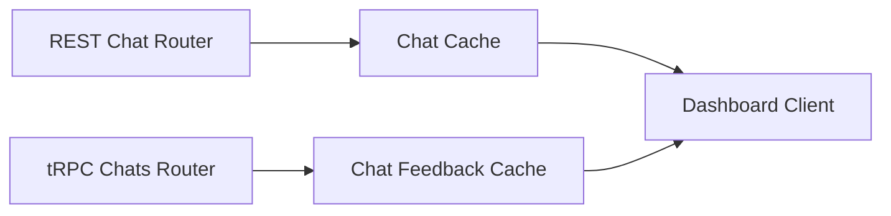
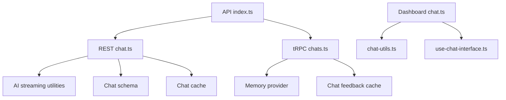

# Real-time Features & WebSocket Implementation

<cite>
**Referenced Files in This Document**
- [index.ts](file://midday/apps/api/src/index.ts)
- [chat.ts](file://midday/apps/api/src/rest/routers/chat.ts)
- [chats.ts](file://midday/apps/api/src/trpc/routers/chats.ts)
- [chat.ts](file://midday/apps/dashboard/src/store/chat.ts)
- [chat-utils.ts](file://midday/apps/dashboard/src/lib/chat-utils.ts)
- [use-chat-interface.ts](file://midday/apps/dashboard/src/hooks/use-chat-interface.ts)
- [chat-cache.ts](file://midday/packages/cache/src/chat-cache.ts)
- [chat-feedback-cache.ts](file://midday/packages/cache/src/chat-feedback-cache.ts)
- [chat.ts](file://midday/apps/website/src/app/api/docs/chat/route.ts)
</cite>

## Table of Contents
1. [Introduction](#introduction)
2. [Project Structure](#project-structure)
3. [Core Components](#core-components)
4. [Architecture Overview](#architecture-overview)
5. [Detailed Component Analysis](#detailed-component-analysis)
6. [Dependency Analysis](#dependency-analysis)
7. [Performance Considerations](#performance-considerations)
8. [Troubleshooting Guide](#troubleshooting-guide)
9. [Conclusion](#conclusion)
10. [Appendices](#appendices)

## Introduction
This document explains Faworra’s real-time features and WebSocket implementation. It focuses on the real-time architecture, connection management, event-driven communication patterns, and collaborative capabilities such as live chat, real-time data updates, and concurrent editing. It also covers presence detection, room management, message broadcasting, connection reliability, reconnection strategies, fallback mechanisms, integration examples, performance considerations, and debugging techniques for WebSocket connections.

Note: The current codebase primarily exposes a chat streaming endpoint and a tRPC-based chat management API. There is no explicit WebSocket server or client-side WebSocket implementation visible in the provided files. Therefore, this document describes the existing real-time capabilities and outlines recommended patterns for extending the system with WebSocket-based real-time features.

## Project Structure
The real-time features span three primary areas:
- API server exposing chat streaming and tRPC endpoints
- Dashboard client integrating chat UX and state management
- Caching layers supporting chat data persistence and feedback

**Diagram sources**
- [index.ts](file://midday/apps/api/src/index.ts#L1-L288)
- [chat.ts](file://midday/apps/api/src/rest/routers/chat.ts#L1-L83)
- [chats.ts](file://midday/apps/api/src/trpc/routers/chats.ts#L1-L58)
- [chat.ts](file://midday/apps/dashboard/src/store/chat.ts#L1-L567)
- [chat-utils.ts](file://midday/apps/dashboard/src/lib/chat-utils.ts#L1-L136)
- [use-chat-interface.ts](file://midday/apps/dashboard/src/hooks/use-chat-interface.ts#L1-L88)
- [chat-cache.ts](file://midday/packages/cache/src/chat-cache.ts)
- [chat-feedback-cache.ts](file://midday/packages/cache/src/chat-feedback-cache.ts)

**Section sources**
- [index.ts](file://midday/apps/api/src/index.ts#L1-L288)
- [chat.ts](file://midday/apps/api/src/rest/routers/chat.ts#L1-L83)
- [chats.ts](file://midday/apps/api/src/trpc/routers/chats.ts#L1-L58)
- [chat.ts](file://midday/apps/dashboard/src/store/chat.ts#L1-L567)
- [chat-utils.ts](file://midday/apps/dashboard/src/lib/chat-utils.ts#L1-L136)
- [use-chat-interface.ts](file://midday/apps/dashboard/src/hooks/use-chat-interface.ts#L1-L88)
- [chat-cache.ts](file://midday/packages/cache/src/chat-cache.ts)
- [chat-feedback-cache.ts](file://midday/packages/cache/src/chat-feedback-cache.ts)

## Core Components
- REST Chat Streaming Endpoint: Accepts chat requests and streams AI-generated UI messages to clients.
- tRPC Chat Management: Provides list, get, and delete operations for chat sessions and messages.
- Dashboard Chat Store: Manages input state, command suggestions, recording, upload, and UI state for the chat interface.
- Chat Utilities: Extracts insights, artifacts, and tool metadata from streamed messages.
- Chat Interface Hook: Derives chat identifiers from URLs and manages navigation state.
- Caching: Chat cache and feedback cache support persistent storage and retrieval of chat data.

**Section sources**
- [chat.ts](file://midday/apps/api/src/rest/routers/chat.ts#L1-L83)
- [chats.ts](file://midday/apps/api/src/trpc/routers/chats.ts#L1-L58)
- [chat.ts](file://midday/apps/dashboard/src/store/chat.ts#L1-L567)
- [chat-utils.ts](file://midday/apps/dashboard/src/lib/chat-utils.ts#L1-L136)
- [use-chat-interface.ts](file://midday/apps/dashboard/src/hooks/use-chat-interface.ts#L1-L88)
- [chat-cache.ts](file://midday/packages/cache/src/chat-cache.ts)
- [chat-feedback-cache.ts](file://midday/packages/cache/src/chat-feedback-cache.ts)

## Architecture Overview
The current real-time architecture centers on:
- Request-response streaming via REST for chat interactions
- tRPC for structured CRUD operations on chat sessions
- Client-side state management and UI extraction utilities
- Optional caching for persisted chat data and feedback

**Diagram sources**
- [chat.ts](file://midday/apps/api/src/rest/routers/chat.ts#L16-L80)
- [chat.ts](file://midday/apps/dashboard/src/store/chat.ts#L415-L567)
- [chat-cache.ts](file://midday/packages/cache/src/chat-cache.ts)

**Section sources**
- [chat.ts](file://midday/apps/api/src/rest/routers/chat.ts#L1-L83)
- [chat.ts](file://midday/apps/dashboard/src/store/chat.ts#L1-L567)
- [chat-cache.ts](file://midday/packages/cache/src/chat-cache.ts)

## Detailed Component Analysis

### REST Chat Streaming Endpoint
Responsibilities:
- Validates incoming chat requests
- Builds user and application context
- Streams AI-generated UI messages to clients
- Supports tool forcing and metrics filtering

Key behaviors:
- Input validation using Zod schema
- Context construction with user/team/timezone/location
- Streaming with smoothing and source inclusion
- Tool forcing for widget-triggered actions

**Diagram sources**
- [chat.ts](file://midday/apps/api/src/rest/routers/chat.ts#L16-L80)

**Section sources**
- [chat.ts](file://midday/apps/api/src/rest/routers/chat.ts#L1-L83)

### tRPC Chat Management
Responsibilities:
- List chats with optional search and pagination
- Retrieve messages for a given chat
- Delete chats with ownership verification

Key behaviors:
- Protected procedures enforcing authentication
- Ownership checks via message retrieval
- Scoped user identifiers combining user and team IDs

**Diagram sources**
- [chats.ts](file://midday/apps/api/src/trpc/routers/chats.ts#L10-L57)

**Section sources**
- [chats.ts](file://midday/apps/api/src/trpc/routers/chats.ts#L1-L58)

### Dashboard Chat Store
Responsibilities:
- Manage input state, recording, uploading, and command suggestions
- Compute filtered command suggestions based on typed input
- Handle keyboard navigation and command insertion
- Provide utilities for clearing input and resetting command state

Key behaviors:
- Command suggestion filtering by command, title, and keywords
- Cursor-aware replacement of command placeholders with full titles
- Navigation via arrow keys and Enter selection

**Diagram sources**
- [chat.ts](file://midday/apps/dashboard/src/store/chat.ts#L415-L567)

**Section sources**
- [chat.ts](file://midday/apps/dashboard/src/store/chat.ts#L1-L567)

### Chat Utilities
Responsibilities:
- Extract insight data from streamed UI message parts
- Detect running insight tools to control loading states
- Identify bank account requirement errors
- Map tool calls to artifact types for rendering

Key behaviors:
- Iterates through message parts to locate tool outputs
- Returns first matching artifact type or null if none found

**Diagram sources**
- [chat-utils.ts](file://midday/apps/dashboard/src/lib/chat-utils.ts#L61-L91)

**Section sources**
- [chat-utils.ts](file://midday/apps/dashboard/src/lib/chat-utils.ts#L1-L136)

### Chat Interface Hook
Responsibilities:
- Extract chat IDs from URL pathnames
- Update browser history while preserving query parameters
- Reset UI state when navigating away from chat pages

Key behaviors:
- Parses locale prefixes and constructs chat routes
- Handles browser popstate events for back/forward navigation

**Diagram sources**
- [use-chat-interface.ts](file://midday/apps/dashboard/src/hooks/use-chat-interface.ts#L21-L79)

**Section sources**
- [use-chat-interface.ts](file://midday/apps/dashboard/src/hooks/use-chat-interface.ts#L1-L88)

### Caching Layers
Responsibilities:
- Persist and retrieve chat messages and artifacts
- Store feedback associated with chat interactions
- Support scalable retrieval for chat history and insights

Key behaviors:
- Chat cache stores messages and metadata
- Feedback cache records user interactions and sentiment

**Diagram sources**
- [chat.ts](file://midday/apps/api/src/rest/routers/chat.ts#L16-L80)
- [chats.ts](file://midday/apps/api/src/trpc/routers/chats.ts#L10-L57)
- [chat-cache.ts](file://midday/packages/cache/src/chat-cache.ts)
- [chat-feedback-cache.ts](file://midday/packages/cache/src/chat-feedback-cache.ts)

**Section sources**
- [chat-cache.ts](file://midday/packages/cache/src/chat-cache.ts)
- [chat-feedback-cache.ts](file://midday/packages/cache/src/chat-feedback-cache.ts)

## Dependency Analysis
- API server composes OpenAPI, CORS, logging, and tRPC middleware.
- REST chat router depends on AI streaming utilities and schemas.
- tRPC chats router depends on memory provider abstractions.
- Dashboard store integrates with chat utilities and URL interface hook.
- Caching packages provide persistence for chat and feedback data.

**Diagram sources**
- [index.ts](file://midday/apps/api/src/index.ts#L1-L288)
- [chat.ts](file://midday/apps/api/src/rest/routers/chat.ts#L1-L83)
- [chats.ts](file://midday/apps/api/src/trpc/routers/chats.ts#L1-L58)
- [chat.ts](file://midday/apps/dashboard/src/store/chat.ts#L1-L567)
- [chat-utils.ts](file://midday/apps/dashboard/src/lib/chat-utils.ts#L1-L136)
- [use-chat-interface.ts](file://midday/apps/dashboard/src/hooks/use-chat-interface.ts#L1-L88)
- [chat-cache.ts](file://midday/packages/cache/src/chat-cache.ts)
- [chat-feedback-cache.ts](file://midday/packages/cache/src/chat-feedback-cache.ts)

**Section sources**
- [index.ts](file://midday/apps/api/src/index.ts#L1-L288)
- [chat.ts](file://midday/apps/api/src/rest/routers/chat.ts#L1-L83)
- [chats.ts](file://midday/apps/api/src/trpc/routers/chats.ts#L1-L58)
- [chat.ts](file://midday/apps/dashboard/src/store/chat.ts#L1-L567)
- [chat-utils.ts](file://midday/apps/dashboard/src/lib/chat-utils.ts#L1-L136)
- [use-chat-interface.ts](file://midday/apps/dashboard/src/hooks/use-chat-interface.ts#L1-L88)
- [chat-cache.ts](file://midday/packages/cache/src/chat-cache.ts)
- [chat-feedback-cache.ts](file://midday/packages/cache/src/chat-feedback-cache.ts)

## Performance Considerations
- Streaming chunking: The REST chat endpoint uses word-level chunking to improve perceived latency.
- Caching: Chat and feedback caches reduce repeated computation and network overhead.
- Pagination: tRPC list queries support limits to constrain payload sizes.
- Logging and monitoring: API server logs database pool stats and request traces for observability.

Recommendations:
- Implement server-sent events (SSE) or WebSocket for true real-time updates.
- Add exponential backoff and jitter for reconnection attempts.
- Use connection keep-alive and heartbeat mechanisms.
- Apply rate limiting and message batching to reduce load.

[No sources needed since this section provides general guidance]

## Troubleshooting Guide
Common issues and resolutions:
- Streaming errors: Validate request payloads and ensure context availability.
- Permission denied on deletion: Confirm ownership via message retrieval before deletion.
- UI state inconsistencies: Use the interface hook to maintain URL-driven state.
- Missing insights/artifacts: Verify tool output extraction logic and cache entries.

Debugging techniques:
- Enable performance logging for tRPC procedures.
- Inspect Sentry breadcrumbs and error tags for unhandled exceptions.
- Monitor database pool stats and Redis client lifecycle during graceful shutdown.

**Section sources**
- [chat.ts](file://midday/apps/api/src/rest/routers/chat.ts#L16-L80)
- [chats.ts](file://midday/apps/api/src/trpc/routers/chats.ts#L33-L56)
- [index.ts](file://midday/apps/api/src/index.ts#L202-L280)

## Conclusion
Faworra currently implements a robust chat streaming endpoint and tRPC-based chat management layer. While there is no explicit WebSocket server or client-side WebSocket implementation in the provided files, the existing architecture supports extension toward real-time collaboration. By adding WebSocket endpoints, presence detection, room management, and message broadcasting, the system can evolve into a full real-time platform with live chat, concurrent editing, and synchronized client-server updates.

[No sources needed since this section summarizes without analyzing specific files]

## Appendices

### API Definitions
- REST Chat Endpoint
  - Method: POST
  - Path: /api/chat
  - Authentication: Required
  - Body: Chat request schema
  - Response: Server-sent stream of UI messages

- tRPC Chat Procedures
  - list: Input includes search and limit; returns chat list
  - get: Input includes chatId; returns messages with pagination
  - delete: Input includes chatId; verifies ownership before deletion

**Section sources**
- [chat.ts](file://midday/apps/api/src/rest/routers/chat.ts#L16-L80)
- [chats.ts](file://midday/apps/api/src/trpc/routers/chats.ts#L10-L57)
- [chat.ts](file://midday/apps/website/src/app/api/docs/chat/route.ts)