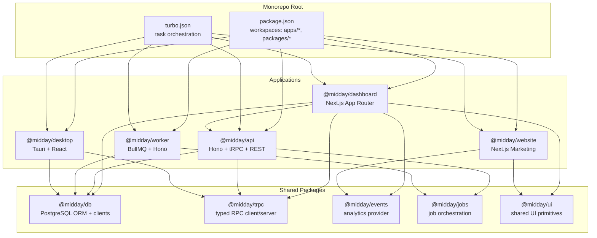
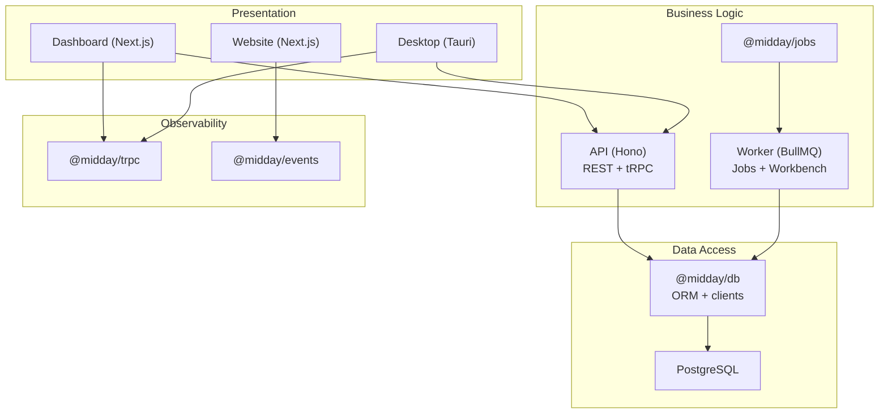
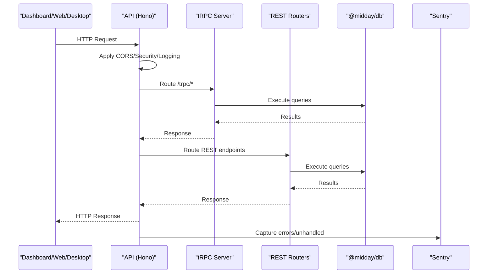
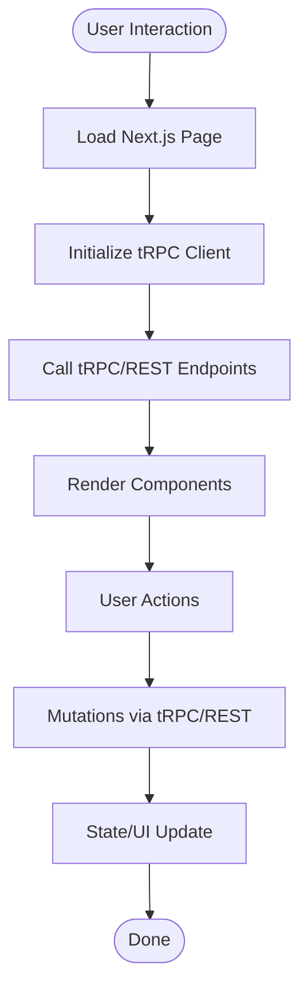
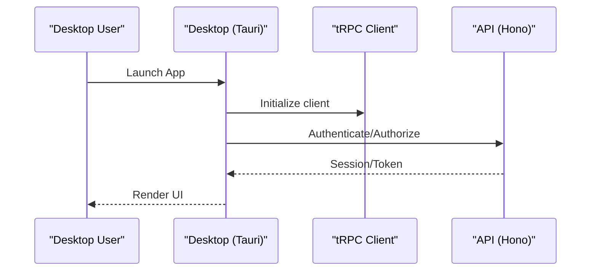
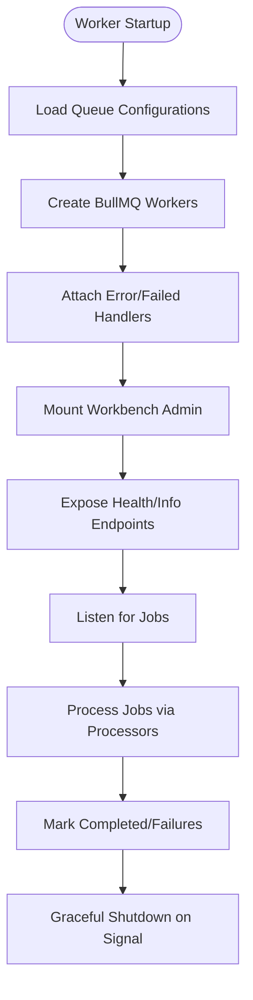
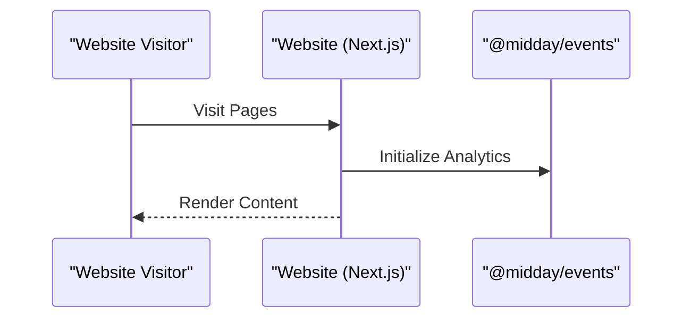
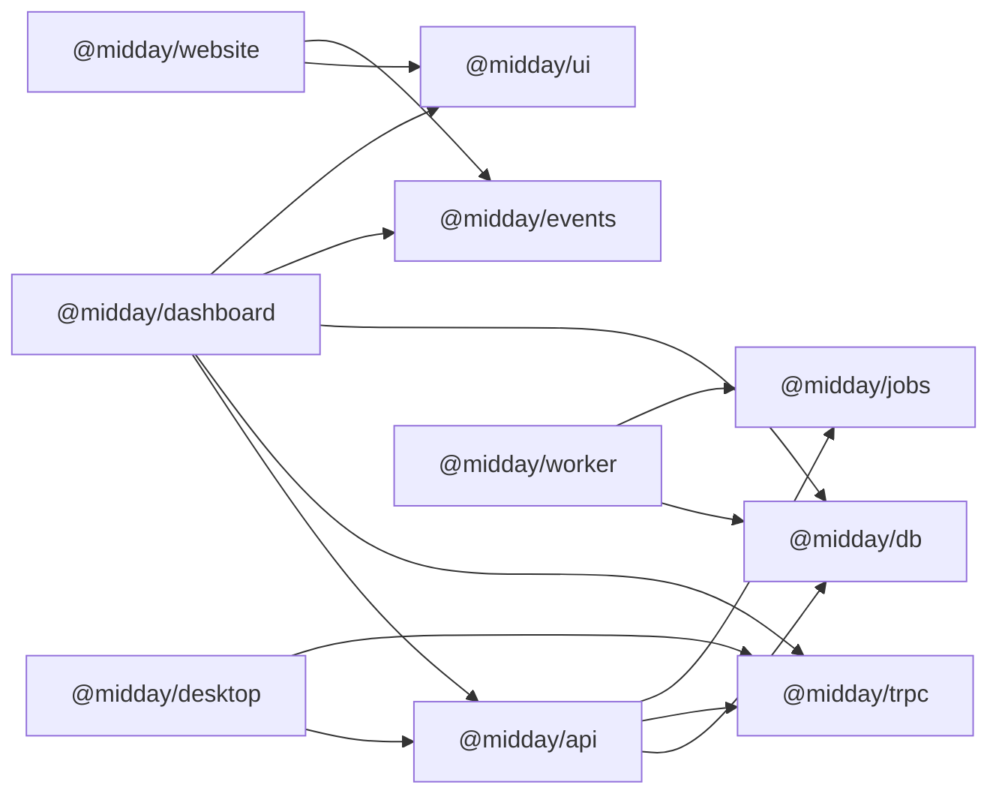

# Architecture Overview

<cite>
**Referenced Files in This Document**
- [package.json](file://midday/package.json)
- [turbo.json](file://midday/turbo.json)
- [api/package.json](file://midday/apps/api/package.json)
- [api/src/index.ts](file://midday/apps/api/src/index.ts)
- [dashboard/package.json](file://midday/apps/dashboard/package.json)
- [desktop/package.json](file://midday/apps/desktop/package.json)
- [desktop/src/main.tsx](file://midday/apps/desktop/src/main.tsx)
- [worker/package.json](file://midday/apps/worker/package.json)
- [worker/src/index.ts](file://midday/apps/worker/src/index.ts)
- [website/package.json](file://midday/apps/website/package.json)
- [website/src/app/layout.tsx](file://midday/apps/website/src/app/layout.tsx)
- [db/package.json](file://midday/packages/db/package.json)
- [trpc/package.json](file://midday/packages/trpc/package.json)
- [events/package.json](file://midday/packages/events/package.json)
- [jobs/package.json](file://midday/packages/jobs/package.json)
</cite>

## Table of Contents
1. [Introduction](#introduction)
2. [Project Structure](#project-structure)
3. [Core Components](#core-components)
4. [Architecture Overview](#architecture-overview)
5. [Detailed Component Analysis](#detailed-component-analysis)
6. [Dependency Analysis](#dependency-analysis)
7. [Performance Considerations](#performance-considerations)
8. [Troubleshooting Guide](#troubleshooting-guide)
9. [Conclusion](#conclusion)

## Introduction
This document describes Faworra’s (Midday) system architecture as a modern monorepo built with a layered design pattern. The system comprises five main applications and twenty-five plus shared packages. The applications are:
- API (Hono-based backend with tRPC and REST)
- Dashboard (Next.js frontend)
- Desktop (Tauri desktop application)
- Worker (background job processing with BullMQ)
- Website (Next.js marketing site)

The shared packages encapsulate cross-cutting concerns such as database access, typed RPC, events/analytics, jobs orchestration, and UI utilities. The architecture follows a layered pattern separating presentation, business logic, and data access, while implementing microservices and event-driven patterns for scalability and resilience.

## Project Structure
The repository uses a monorepo layout managed by Turborepo and Bun. Workspaces define the five applications and the shared packages. Scripts enable parallel development and targeted builds per application.

**Diagram sources**
- [package.json](file://midday/package.json#L4-L7)
- [turbo.json](file://midday/turbo.json#L1-L87)
- [api/package.json](file://midday/apps/api/package.json#L28-L48)
- [dashboard/package.json](file://midday/apps/dashboard/package.json#L28-L39)
- [desktop/package.json](file://midday/apps/desktop/package.json#L18-L29)
- [worker/package.json](file://midday/apps/worker/package.json#L13-L35)
- [website/package.json](file://midday/apps/website/package.json#L13-L23)
- [db/package.json](file://midday/packages/db/package.json#L37-L53)
- [trpc/package.json](file://midday/packages/trpc/package.json#L17-L21)
- [events/package.json](file://midday/packages/events/package.json#L13-L23)
- [jobs/package.json](file://midday/packages/jobs/package.json#L16-L34)

**Section sources**
- [package.json](file://midday/package.json#L1-L70)
- [turbo.json](file://midday/turbo.json#L1-L87)

## Core Components
- API Application: Hono server exposing REST endpoints and tRPC routes, OpenAPI documentation, health/readiness probes, Sentry error reporting, and CORS/security middleware.
- Dashboard Application: Next.js App Router frontend consuming tRPC and REST APIs, integrating analytics, PDF generation, and Stripe for payments.
- Desktop Application: Tauri-based desktop client using React, with plugins for filesystem, dialogs, updater, and deep linking.
- Worker Application: Background job processor using BullMQ, Workbench admin UI, health checks, and centralized error handling.
- Website Application: Next.js marketing site with SEO, analytics, and content components.

Key shared packages:
- @midday/db: Drizzle ORM client, SQL utilities, API keys, search query builder, and health helpers.
- @midday/trpc: Typed RPC client/server exports for API communication.
- @midday/events: Analytics provider integration for client-side telemetry.
- @midday/jobs: Job orchestration and Trigger.dev integration.

**Section sources**
- [api/src/index.ts](file://midday/apps/api/src/index.ts#L26-L176)
- [dashboard/package.json](file://midday/apps/dashboard/package.json#L16-L97)
- [desktop/src/main.tsx](file://midday/apps/desktop/src/main.tsx#L1-L9)
- [worker/src/index.ts](file://midday/apps/worker/src/index.ts#L25-L120)
- [website/src/app/layout.tsx](file://midday/apps/website/src/app/layout.tsx#L1-L153)
- [db/package.json](file://midday/packages/db/package.json#L21-L36)
- [trpc/package.json](file://midday/packages/trpc/package.json#L12-L16)
- [events/package.json](file://midday/packages/events/package.json#L19-L23)
- [jobs/package.json](file://midday/packages/jobs/package.json#L13-L15)

## Architecture Overview
The system follows a layered architecture:
- Presentation Layer: Dashboard (Next.js) and Website (Next.js) deliver user interfaces. Desktop (Tauri) provides native desktop UX.
- Business Logic Layer: API (Hono) exposes REST and tRPC endpoints; Worker handles background jobs; Shared packages encapsulate domain logic.
- Data Access Layer: @midday/db provides PostgreSQL access via Drizzle ORM and maintains separate clients for API and Worker contexts.

Microservices and event-driven characteristics:
- API and Worker operate as distinct services behind a shared data plane.
- Worker uses BullMQ queues and Workbench for observability and admin controls.
- Events/analytics are decoupled via @midday/events for client-side telemetry.

**Diagram sources**
- [api/src/index.ts](file://midday/apps/api/src/index.ts#L26-L176)
- [worker/src/index.ts](file://midday/apps/worker/src/index.ts#L128-L200)
- [dashboard/package.json](file://midday/apps/dashboard/package.json#L28-L39)
- [desktop/package.json](file://midday/apps/desktop/package.json#L18-L29)
- [website/package.json](file://midday/apps/website/package.json#L13-L23)
- [db/package.json](file://midday/packages/db/package.json#L37-L53)
- [trpc/package.json](file://midday/packages/trpc/package.json#L17-L21)
- [events/package.json](file://midday/packages/events/package.json#L13-L23)
- [jobs/package.json](file://midday/packages/jobs/package.json#L16-L34)

## Detailed Component Analysis

### API Application
The API server initializes instrumentation, registers middleware (CORS, secure headers, logging), mounts tRPC and REST routers, and exposes health endpoints. It integrates Sentry for error reporting and manages graceful shutdown with database and Redis client cleanup.

**Diagram sources**
- [api/src/index.ts](file://midday/apps/api/src/index.ts#L26-L176)
- [api/src/index.ts](file://midday/apps/api/src/index.ts#L202-L211)
- [api/src/index.ts](file://midday/apps/api/src/index.ts#L262-L280)

**Section sources**
- [api/src/index.ts](file://midday/apps/api/src/index.ts#L26-L176)
- [api/src/index.ts](file://midday/apps/api/src/index.ts#L213-L288)

### Dashboard Application
The Dashboard is a Next.js application that consumes tRPC and REST endpoints, integrates analytics, PDF rendering, and payment providers. It relies on shared packages for UI, events, and Supabase integration.

**Diagram sources**
- [dashboard/package.json](file://midday/apps/dashboard/package.json#L16-L97)

**Section sources**
- [dashboard/package.json](file://midday/apps/dashboard/package.json#L16-L97)

### Desktop Application
The Desktop app initializes a minimal React root and leverages Tauri plugins for OS-level features. It communicates with the API via tRPC and REST.

**Diagram sources**
- [desktop/src/main.tsx](file://midday/apps/desktop/src/main.tsx#L1-L9)
- [desktop/package.json](file://midday/apps/desktop/package.json#L18-L29)

**Section sources**
- [desktop/src/main.tsx](file://midday/apps/desktop/src/main.tsx#L1-L9)
- [desktop/package.json](file://midday/apps/desktop/package.json#L18-L29)

### Worker Application
The Worker creates BullMQ workers per queue configuration, registers schedulers, and exposes a Workbench admin UI. It includes centralized error handling and readiness checks.

**Diagram sources**
- [worker/src/index.ts](file://midday/apps/worker/src/index.ts#L25-L120)
- [worker/src/index.ts](file://midday/apps/worker/src/index.ts#L128-L200)
- [worker/src/index.ts](file://midday/apps/worker/src/index.ts#L232-L281)

**Section sources**
- [worker/src/index.ts](file://midday/apps/worker/src/index.ts#L25-L120)
- [worker/src/index.ts](file://midday/apps/worker/src/index.ts#L128-L200)
- [worker/src/index.ts](file://midday/apps/worker/src/index.ts#L232-L312)

### Website Application
The Website is a Next.js marketing site that sets up analytics and global styles, integrating with shared UI and events packages.

**Diagram sources**
- [website/src/app/layout.tsx](file://midday/apps/website/src/app/layout.tsx#L1-L153)
- [website/package.json](file://midday/apps/website/package.json#L13-L23)

**Section sources**
- [website/src/app/layout.tsx](file://midday/apps/website/src/app/layout.tsx#L1-L153)
- [website/package.json](file://midday/apps/website/package.json#L13-L23)

## Dependency Analysis
The monorepo enforces workspace-based dependencies among applications and shared packages. The API depends on @midday/db, @midday/trpc, @midday/jobs, and others. The Dashboard depends on @midday/api, @midday/trpc, @midday/db, and UI packages. The Worker depends on @midday/db and @midday/jobs. The Desktop depends on @midday/api and @midday/trpc. The Website depends on @midday/ui and @midday/events.

**Diagram sources**
- [api/package.json](file://midday/apps/api/package.json#L28-L48)
- [dashboard/package.json](file://midday/apps/dashboard/package.json#L28-L39)
- [desktop/package.json](file://midday/apps/desktop/package.json#L18-L29)
- [worker/package.json](file://midday/apps/worker/package.json#L13-L35)
- [website/package.json](file://midday/apps/website/package.json#L13-L23)
- [db/package.json](file://midday/packages/db/package.json#L37-L53)
- [trpc/package.json](file://midday/packages/trpc/package.json#L17-L21)
- [events/package.json](file://midday/packages/events/package.json#L13-L23)
- [jobs/package.json](file://midday/packages/jobs/package.json#L16-L34)

**Section sources**
- [api/package.json](file://midday/apps/api/package.json#L28-L48)
- [dashboard/package.json](file://midday/apps/dashboard/package.json#L28-L39)
- [desktop/package.json](file://midday/apps/desktop/package.json#L18-L29)
- [worker/package.json](file://midday/apps/worker/package.json#L13-L35)
- [website/package.json](file://midday/apps/website/package.json#L13-L23)
- [db/package.json](file://midday/packages/db/package.json#L37-L53)
- [trpc/package.json](file://midday/packages/trpc/package.json#L17-L21)
- [events/package.json](file://midday/packages/events/package.json#L13-L23)
- [jobs/package.json](file://midday/packages/jobs/package.json#L16-L34)

## Performance Considerations
- API and Worker log database pool statistics periodically to monitor utilization and prevent saturation.
- API includes a performance logger for tRPC procedures when enabled, capturing request timing and pool stats.
- Worker logs DB pool stats and uses a longer graceful shutdown window to drain in-flight jobs.
- Turborepo caching and persistent tasks reduce rebuild times during development.
- Sentry integration captures errors and unhandled exceptions to maintain runtime stability.

[No sources needed since this section provides general guidance]

## Troubleshooting Guide
Common operational signals:
- API graceful shutdown sequences close database connections and flush Sentry events on SIGTERM/SIGINT.
- Worker gracefully closes BullMQ workers, waits for in-flight jobs, and flushes Sentry events.
- Both API and Worker capture unhandled exceptions and rejections with structured error details.

Health and readiness:
- API exposes /health, /health/ready, and /health/dependencies endpoints for readiness probes.
- Worker exposes /health and /health/ready endpoints and a /info endpoint listing queues and Workbench URL.

**Section sources**
- [api/src/index.ts](file://midday/apps/api/src/index.ts#L217-L258)
- [api/src/index.ts](file://midday/apps/api/src/index.ts#L262-L280)
- [worker/src/index.ts](file://midday/apps/worker/src/index.ts#L232-L281)
- [worker/src/index.ts](file://midday/apps/worker/src/index.ts#L286-L311)

## Conclusion
Faworra’s architecture combines a monorepo structure with layered design, microservices boundaries, and event-driven background processing. The API, Dashboard, Desktop, Worker, and Website collaborate through shared packages that encapsulate data access, typed RPC, and observability. This foundation supports scalable development, cross-platform delivery, and robust operational practices.