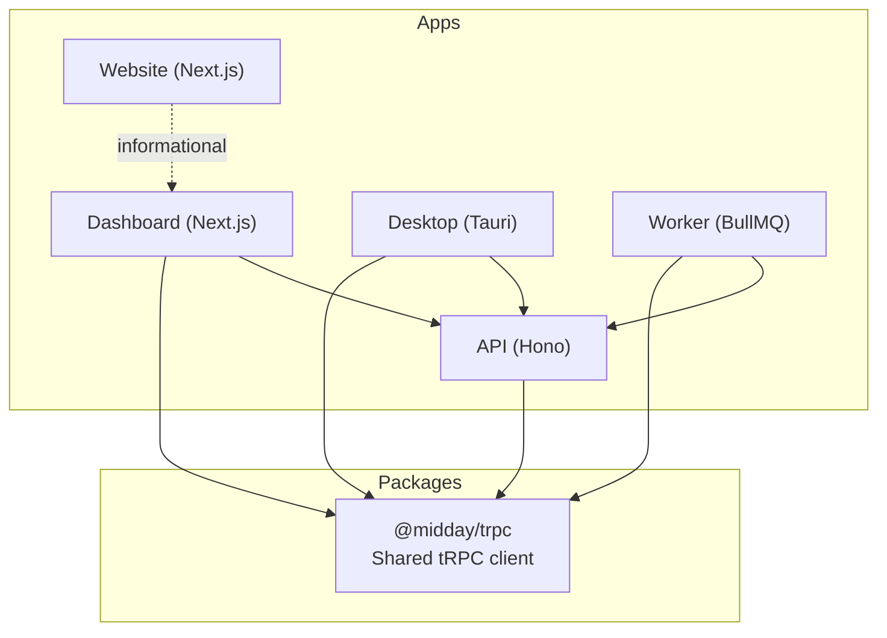
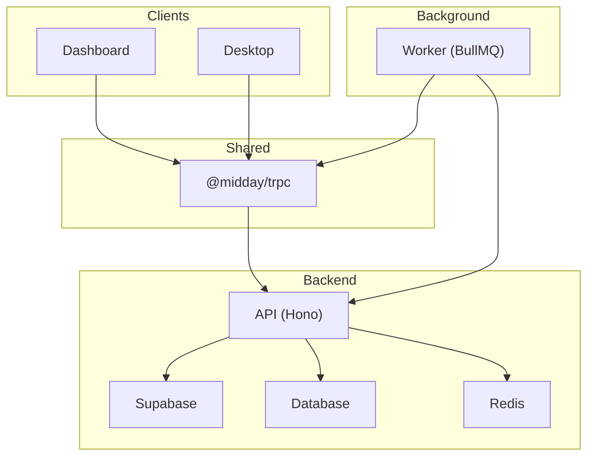
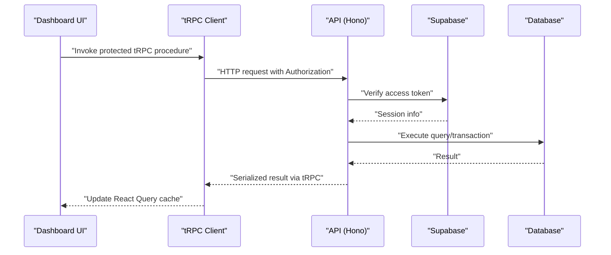
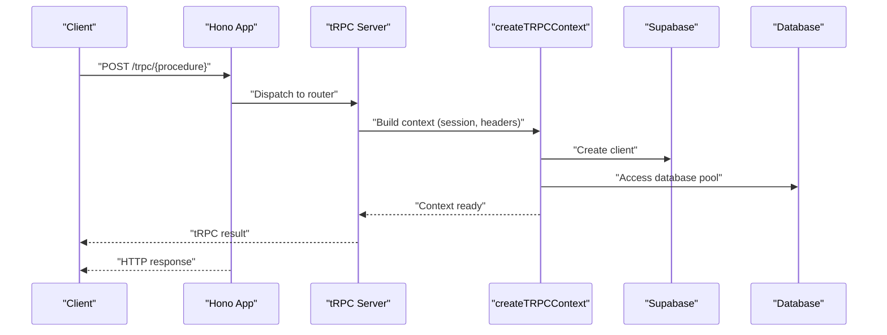
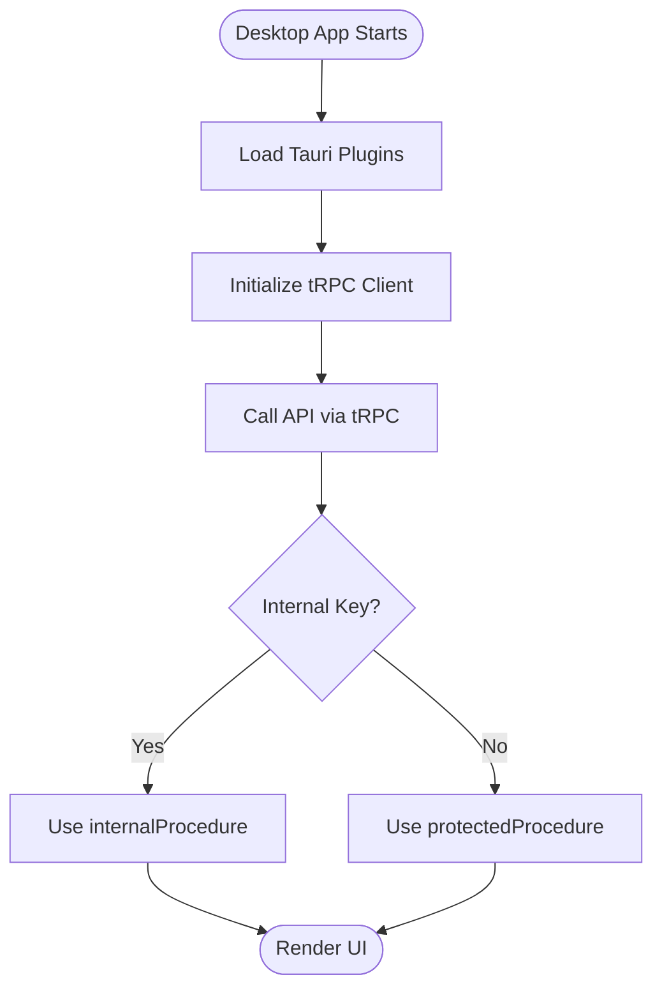
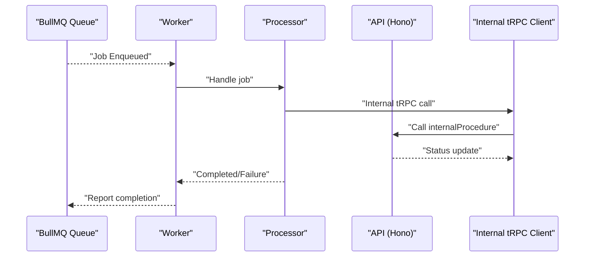
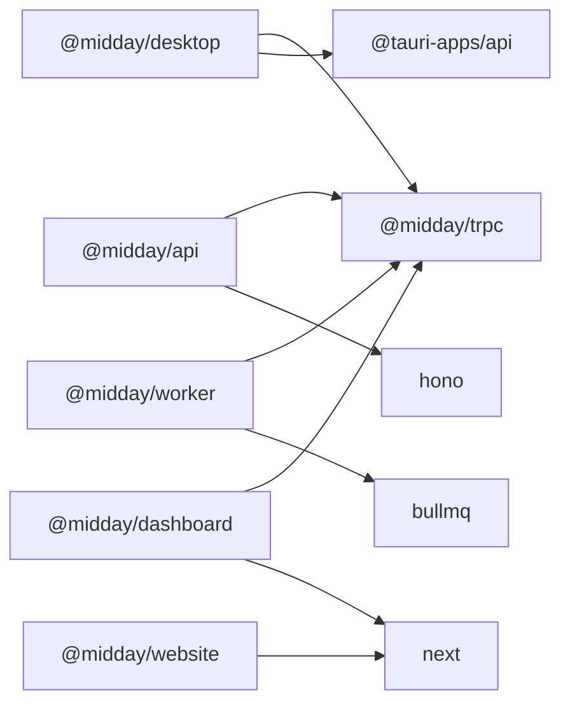

# Component Relationships

<cite>
**Referenced Files in This Document**
- [package.json](file://package.json)
- [apps/api/package.json](file://apps/api/package.json)
- [apps/api/src/index.ts](file://apps/api/src/index.ts)
- [apps/api/src/trpc/init.ts](file://apps/api/src/trpc/init.ts)
- [apps/dashboard/package.json](file://apps/dashboard/package.json)
- [apps/dashboard/src/trpc/client.tsx](file://apps/dashboard/src/trpc/client.tsx)
- [apps/desktop/package.json](file://apps/desktop/package.json)
- [apps/desktop/src/main.tsx](file://apps/desktop/src/main.tsx)
- [apps/worker/package.json](file://apps/worker/package.json)
- [apps/worker/src/index.ts](file://apps/worker/src/index.ts)
- [apps/website/package.json](file://apps/website/package.json)
- [apps/website/src/app/layout.tsx](file://apps/website/src/app/layout.tsx)
- [packages/trpc/package.json](file://packages/trpc/package.json)
- [packages/trpc/src/index.ts](file://packages/trpc/src/index.ts)
</cite>

## Table of Contents
1. [Introduction](#introduction)
2. [Project Structure](#project-structure)
3. [Core Components](#core-components)
4. [Architecture Overview](#architecture-overview)
5. [Detailed Component Analysis](#detailed-component-analysis)
6. [Dependency Analysis](#dependency-analysis)
7. [Performance Considerations](#performance-considerations)
8. [Troubleshooting Guide](#troubleshooting-guide)
9. [Conclusion](#conclusion)

## Introduction
This document explains how Faworra’s applications and shared packages interact to form a cohesive system:
- Dashboard (Next.js) consumes tRPC APIs and renders the primary user interface.
- API (Hono) exposes REST endpoints and tRPC routes, orchestrating business logic and integrating with databases and external services.
- Desktop (Tauri) provides a native client experience and integrates with the backend via tRPC and internal API keys.
- Worker runs background jobs using BullMQ, processing tasks asynchronously and communicating with the API and shared services.
- Website (Next.js) serves marketing and informational pages.
- Shared packages encapsulate reusable logic, including tRPC clients and internal communication patterns.

We focus on data flow, tRPC connections, internal service-to-service calls, background job processing, and how components depend on each other.

## Project Structure
The repository uses a monorepo layout with workspaces for apps and packages. The key applications and shared packages are organized as follows:
- apps/dashboard: Next.js frontend with tRPC client configuration and UI components.
- apps/api: Hono-based backend exposing REST and tRPC endpoints.
- apps/desktop: Tauri desktop app with React UI and Tauri plugins.
- apps/worker: Background job processor using BullMQ and Hono admin dashboard.
- apps/website: Next.js marketing website.
- packages/trpc: Shared tRPC client and internal client utilities.

**Diagram sources**
- [apps/dashboard/package.json](file://apps/dashboard/package.json#L1-L112)
- [apps/api/package.json](file://apps/api/package.json#L1-L78)
- [apps/desktop/package.json](file://apps/desktop/package.json#L1-L40)
- [apps/worker/package.json](file://apps/worker/package.json#L1-L57)
- [apps/website/package.json](file://apps/website/package.json#L1-L40)
- [packages/trpc/package.json](file://packages/trpc/package.json#L1-L26)

**Section sources**
- [package.json](file://package.json#L1-L70)
- [apps/dashboard/package.json](file://apps/dashboard/package.json#L1-L112)
- [apps/api/package.json](file://apps/api/package.json#L1-L78)
- [apps/desktop/package.json](file://apps/desktop/package.json#L1-L40)
- [apps/worker/package.json](file://apps/worker/package.json#L1-L57)
- [apps/website/package.json](file://apps/website/package.json#L1-L40)
- [packages/trpc/package.json](file://packages/trpc/package.json#L1-L26)

## Core Components
- Dashboard (Next.js)
  - Consumes tRPC via a preconfigured client and React Query integration.
  - Depends on @midday/trpc for client configuration and internal client utilities.
  - Integrates with Supabase for authentication and database access through the API.
- API (Hono)
  - Exposes tRPC routes and REST endpoints.
  - Provides internal procedures for service-to-service calls using an internal API key.
  - Implements CORS, security headers, health checks, and OpenAPI documentation.
- Desktop (Tauri)
  - React-based UI with Tauri plugins for filesystem, dialogs, updater, and deep linking.
  - Communicates with the API using tRPC and internal keys for privileged operations.
- Worker (BullMQ)
  - Runs background jobs, registers workers per queue, and exposes a Workbench admin UI.
  - Uses internal tRPC calls to coordinate with the API and update statuses.
- Website (Next.js)
  - Marketing and informational pages; not part of the core financial workflow.
- Shared Packages
  - @midday/trpc: Defines exported types and provides an internal tRPC client singleton for service-to-service calls.

**Section sources**
- [apps/dashboard/package.json](file://apps/dashboard/package.json#L16-L98)
- [apps/api/src/index.ts](file://apps/api/src/index.ts#L1-L288)
- [apps/api/src/trpc/init.ts](file://apps/api/src/trpc/init.ts#L1-L187)
- [apps/desktop/package.json](file://apps/desktop/package.json#L1-L40)
- [apps/desktop/src/main.tsx](file://apps/desktop/src/main.tsx#L1-L9)
- [apps/worker/src/index.ts](file://apps/worker/src/index.ts#L1-L312)
- [apps/website/src/app/layout.tsx](file://apps/website/src/app/layout.tsx#L1-L153)
- [packages/trpc/src/index.ts](file://packages/trpc/src/index.ts#L1-L19)

## Architecture Overview
The system separates concerns across applications while sharing a common tRPC abstraction:
- Dashboard and Desktop call the API via tRPC using user sessions or internal keys.
- Worker performs asynchronous tasks and communicates with the API using internal tRPC calls.
- API enforces authentication and authorization, exposes health/readiness endpoints, and integrates with Supabase and the database.

**Diagram sources**
- [apps/api/src/index.ts](file://apps/api/src/index.ts#L1-L288)
- [apps/api/src/trpc/init.ts](file://apps/api/src/trpc/init.ts#L1-L187)
- [apps/worker/src/index.ts](file://apps/worker/src/index.ts#L1-L312)
- [packages/trpc/src/index.ts](file://packages/trpc/src/index.ts#L1-L19)

## Detailed Component Analysis

### Dashboard (Next.js) Communication
- tRPC client configuration
  - The dashboard imports and configures a tRPC client for server-side and client-side usage.
  - It leverages @trpc/client and @trpc/tanstack-react-query for efficient caching and refetching.
- Authentication and authorization
  - Calls to the API require a valid access token; protected procedures enforce permissions.
- Real-time updates
  - React Query is used for optimistic updates and automatic refetching of data after mutations.

**Diagram sources**
- [apps/dashboard/package.json](file://apps/dashboard/package.json#L55-L56)
- [apps/api/src/trpc/init.ts](file://apps/api/src/trpc/init.ts#L121-L138)
- [apps/api/src/index.ts](file://apps/api/src/index.ts#L88-L113)

**Section sources**
- [apps/dashboard/package.json](file://apps/dashboard/package.json#L16-L98)
- [apps/api/src/trpc/init.ts](file://apps/api/src/trpc/init.ts#L121-L138)
- [apps/api/src/index.ts](file://apps/api/src/index.ts#L88-L113)

### API (Hono) Endpoints and tRPC
- tRPC server integration
  - The API mounts a tRPC server with a custom context that includes session, Supabase client, database, geolocation, and tracing identifiers.
  - It defines public, protected, internal, and protected-or-internal procedures to control access.
- REST endpoints
  - CORS and security headers are applied globally.
  - Health and readiness endpoints report service status and dependency checks.
  - OpenAPI documentation is exposed via Scalar.
- Error handling and observability
  - Errors are logged and reported to Sentry; unhandled exceptions/rejections are captured and flushed on shutdown.

**Diagram sources**
- [apps/api/src/index.ts](file://apps/api/src/index.ts#L4-L26)
- [apps/api/src/index.ts](file://apps/api/src/index.ts#L88-L113)
- [apps/api/src/trpc/init.ts](file://apps/api/src/trpc/init.ts#L32-L80)

**Section sources**
- [apps/api/src/index.ts](file://apps/api/src/index.ts#L1-L288)
- [apps/api/src/trpc/init.ts](file://apps/api/src/trpc/init.ts#L1-L187)

### Desktop (Tauri) Integration
- Dependencies
  - Uses Tauri plugins for filesystem, dialogs, global shortcuts, process control, updater, and deep linking.
- Communication pattern
  - Similar to the dashboard, the desktop app uses tRPC to communicate with the API.
  - For privileged operations, it can leverage internal procedures via an internal API key header.

**Diagram sources**
- [apps/desktop/package.json](file://apps/desktop/package.json#L18-L30)
- [apps/api/src/trpc/init.ts](file://apps/api/src/trpc/init.ts#L146-L159)

**Section sources**
- [apps/desktop/package.json](file://apps/desktop/package.json#L1-L40)
- [apps/desktop/src/main.tsx](file://apps/desktop/src/main.tsx#L1-L9)
- [apps/api/src/trpc/init.ts](file://apps/api/src/trpc/init.ts#L146-L159)

### Worker (Background Jobs)
- Job processing
  - Workers are created per queue configuration and process jobs using registered processors.
  - Centralized error handling logs and reports failures to Sentry.
- Admin dashboard
  - Workbench is mounted under /admin with optional basic auth to inspect queues and job statuses.
- Internal tRPC calls
  - Workers use internal tRPC clients to coordinate with the API and update statuses.

**Diagram sources**
- [apps/worker/src/index.ts](file://apps/worker/src/index.ts#L25-L118)
- [apps/worker/src/index.ts](file://apps/worker/src/index.ts#L134-L162)
- [packages/trpc/src/index.ts](file://packages/trpc/src/index.ts#L8-L18)

**Section sources**
- [apps/worker/src/index.ts](file://apps/worker/src/index.ts#L1-L312)
- [packages/trpc/src/index.ts](file://packages/trpc/src/index.ts#L1-L19)

### Website (Next.js)
- Purpose
  - Serves marketing and informational pages; not involved in core financial workflows.
- Integration
  - Uses shared UI components and analytics providers.

**Section sources**
- [apps/website/package.json](file://apps/website/package.json#L1-L40)
- [apps/website/src/app/layout.tsx](file://apps/website/src/app/layout.tsx#L1-L153)

## Dependency Analysis
- Workspace dependencies
  - All apps declare workspace dependencies on shared packages (e.g., @midday/trpc, @midday/db, @midday/supabase).
- Shared tRPC client
  - @midday/trpc exports types and an internal client singleton for service-to-service calls.
- Application-specific dependencies
  - Dashboard and Desktop depend on @midday/trpc for client configuration.
  - API depends on @midday/trpc for server-side router types and internal client utilities.
  - Worker depends on @midday/trpc for internal tRPC calls and on BullMQ for job processing.

**Diagram sources**
- [apps/dashboard/package.json](file://apps/dashboard/package.json#L28-L38)
- [apps/api/package.json](file://apps/api/package.json#L15-L50)
- [apps/desktop/package.json](file://apps/desktop/package.json#L18-L30)
- [apps/worker/package.json](file://apps/worker/package.json#L13-L48)
- [apps/website/package.json](file://apps/website/package.json#L13-L33)
- [packages/trpc/package.json](file://packages/trpc/package.json#L12-L16)

**Section sources**
- [apps/dashboard/package.json](file://apps/dashboard/package.json#L28-L38)
- [apps/api/package.json](file://apps/api/package.json#L15-L50)
- [apps/desktop/package.json](file://apps/desktop/package.json#L18-L30)
- [apps/worker/package.json](file://apps/worker/package.json#L13-L48)
- [apps/website/package.json](file://apps/website/package.json#L13-L33)
- [packages/trpc/package.json](file://packages/trpc/package.json#L12-L16)

## Performance Considerations
- tRPC timing and logging
  - The API supports optional performance logging for context creation and procedure execution when DEBUG_PERF is enabled.
- Database pool monitoring
  - Both API and Worker log database pool statistics at configurable intervals.
- Health and readiness
  - Health endpoints provide quick diagnostics for service availability and dependency readiness.

**Section sources**
- [apps/api/src/trpc/init.ts](file://apps/api/src/trpc/init.ts#L17-L18)
- [apps/api/src/index.ts](file://apps/api/src/index.ts#L67-L86)
- [apps/api/src/index.ts](file://apps/api/src/index.ts#L120-L130)
- [apps/worker/src/index.ts](file://apps/worker/src/index.ts#L205-L226)
- [apps/worker/src/index.ts](file://apps/worker/src/index.ts#L177-L182)

## Troubleshooting Guide
- Authentication failures
  - protectedProcedure throws UNAUTHORIZED if no valid session is present.
  - internalProcedure requires a matching internal API key header.
- Error reporting
  - API and Worker capture unhandled exceptions and rejections to Sentry and log detailed error contexts.
- Health checks
  - Use /health and /health/ready endpoints to verify service status and dependency readiness.

**Section sources**
- [apps/api/src/trpc/init.ts](file://apps/api/src/trpc/init.ts#L121-L138)
- [apps/api/src/trpc/init.ts](file://apps/api/src/trpc/init.ts#L146-L159)
- [apps/api/src/index.ts](file://apps/api/src/index.ts#L202-L211)
- [apps/api/src/index.ts](file://apps/api/src/index.ts#L118-L130)
- [apps/worker/src/index.ts](file://apps/worker/src/index.ts#L286-L296)
- [apps/worker/src/index.ts](file://apps/worker/src/index.ts#L177-L182)

## Conclusion
Faworra’s architecture cleanly separates concerns across Dashboard, API, Desktop, Worker, and Website while leveraging shared packages to reduce coupling. tRPC provides a consistent protocol for client-server communication, with internal procedures enabling secure service-to-service calls. Background job processing is handled asynchronously via BullMQ, and health/readiness endpoints ensure operational visibility. Together, these components form a scalable and maintainable system.