# Data Flow Architecture

<cite>
**Referenced Files in This Document**
- [apps/api/src/index.ts](file://midday/apps/api/src/index.ts)
- [apps/dashboard/src/middleware.ts](file://midday/apps/dashboard/src/middleware.ts)
- [apps/worker/src/config.ts](file://midday/apps/worker/src/config.ts)
- [packages/db/client.ts](file://midday/packages/db/client.ts)
- [packages/cache/shared-redis.ts](file://midday/packages/cache/shared-redis.ts)
- [packages/logger/index.ts](file://midday/packages/logger/index.ts)
- [packages/supabase/middleware.ts](file://midday/packages/supabase/middleware.ts)
- [packages/events/index.ts](file://midday/packages/events/index.ts)
- [packages/insights/index.ts](file://midday/packages/insights/index.ts)
- [packages/invoice/index.ts](file://midday/packages/invoice/index.ts)
- [packages/documents/index.ts](file://midday/packages/documents/index.ts)
- [packages/banking/index.ts](file://midday/packages/banking/index.ts)
- [packages/inbox/index.ts](file://midday/packages/inbox/index.ts)
- [packages/workbench/index.ts](file://midday/packages/workbench/index.ts)
- [packages/jobs/index.ts](file://midday/packages/jobs/index.ts)
- [packages/job-client/index.ts](file://midday/packages/job-client/index.ts)
- [packages/trpc/init.ts](file://midday/packages/trpc/init.ts)
- [packages/trpc/routers/_app.ts](file://midday/packages/trpc/routers/_app.ts)
- [packages/rest/routers/index.ts](file://midday/packages/rest/routers/index.ts)
- [packages/notifications/index.ts](file://midday/packages/notifications/index.ts)
- [packages/email/index.ts](file://midday/packages/email/index.ts)
- [packages/health/checker.ts](file://midday/packages/health/checker.ts)
- [packages/health/probes.ts](file://midday/packages/health/probes.ts)
- [packages/utils/logger.ts](file://midday/packages/utils/logger.ts)
- [packages/utils/request-trace.ts](file://midday/packages/utils/request-trace.ts)
- [packages/utils/oauth.ts](file://midday/packages/utils/oauth.ts)
- [packages/utils/plaid.ts](file://midday/packages/utils/plaid.ts)
- [packages/utils/teller.ts](file://midday/packages/utils/teller.ts)
- [packages/utils/polar.ts](file://midday/packages/utils/polar.ts)
- [packages/utils/geo.ts](file://midday/packages/utils/geo.ts)
- [packages/utils/scopes.ts](file://midday/packages/utils/scopes.ts)
- [packages/utils/search.ts](file://midday/packages/utils/search.ts)
- [packages/utils/search-filters.ts](file://midday/packages/utils/search-filters.ts)
- [packages/utils/parse.ts](file://midday/packages/utils/parse.ts)
- [packages/utils/validate-response.ts](file://midday/packages/utils/validate-response.ts)
- [packages/utils/db-retry.ts](file://midday/packages/utils/db-retry.ts)
- [packages/utils/safe-compare.ts](file://midday/packages/utils/safe-compare.ts)
- [packages/utils/check-team-eligibility.ts](file://midday/packages/utils/check-team-eligibility.ts)
- [packages/utils/telemetry.ts](file://midday/packages/utils/telemetry.ts)
- [packages/utils/telemetry-client.ts](file://midday/packages/utils/telemetry-client.ts)
- [packages/utils/telemetry-server.ts](file://midday/packages/utils/telemetry-server.ts)
- [packages/utils/telemetry-worker.ts](file://midday/packages/utils/telemetry-worker.ts)
- [packages/utils/telemetry-dashboard.ts](file://midday/packages/utils/telemetry-dashboard.ts)
- [packages/utils/telemetry-api.ts](file://midday/packages/utils/telemetry-api.ts)
- [packages/utils/telemetry-webhook.ts](file://midday/packages/utils/telemetry-webhook.ts)
- [packages/utils/telemetry-job.ts](file://midday/packages/utils/telemetry-job.ts)
- [packages/utils/telemetry-event.ts](file://midday/packages/utils/telemetry-event.ts)
- [packages/utils/telemetry-insight.ts](file://midday/packages/utils/telemetry-insight.ts)
- [packages/utils/telemetry-document.ts](file://midday/packages/utils/telemetry-document.ts)
- [packages/utils/telemetry-invoice.ts](file://midday/packages/utils/telemetry-invoice.ts)
- [packages/utils/telemetry-banking.ts](file://midday/packages/utils/telemetry-banking.ts)
- [packages/utils/telemetry-inbox.ts](file://midday/packages/utils/telemetry-inbox.ts)
- [packages/utils/telemetry-workbench.ts](file://midday/packages/utils/telemetry-workbench.ts)
- [packages/utils/telemetry-notification.ts](file://midday/packages/utils/telemetry-notification.ts)
- [packages/utils/telemetry-email.ts](file://midday/packages/utils/telemetry-email.ts)
- [packages/utils/telemetry-health.ts](file://midday/packages/utils/telemetry-health.ts)
- [packages/utils/telemetry-cache.ts](file://midday/packages/utils/telemetry-cache.ts)
- [packages/utils/telemetry-db.ts](file://midday/packages/utils/telemetry-db.ts)
- [packages/utils/telemetry-supabase.ts](file://midday/packages/utils/telemetry-supabase.ts)
- [packages/utils/telemetry-logger.ts](file://midday/packages/utils/telemetry-logger.ts)
- [packages/utils/telemetry-auth.ts](file://midday/packages/utils/telemetry-auth.ts)
- [packages/utils/telemetry-websocket.ts](file://midday/packages/utils/telemetry-websocket.ts)
- [packages/utils/telemetry-queue.ts](file://midday/packages/utils/telemetry-queue.ts)
- [packages/utils/telemetry-worker.ts](file://midday/packages/utils/telemetry-worker.ts)
- [packages/utils/telemetry-dashboard.ts](file://midday/packages/utils/telemetry-dashboard.ts)
- [packages/utils/telemetry-api.ts](file://midday/packages/utils/telemetry-api.ts)
- [packages/utils/telemetry-webhook.ts](file://midday/packages/utils/telemetry-webhook.ts)
- [packages/utils/telemetry-job.ts](file://midday/packages/utils/telemetry-job.ts)
- [packages/utils/telemetry-event.ts](file://midday/packages/utils/telemetry-event.ts)
- [packages/utils/telemetry-insight.ts](file://midday/packages/utils/telemetry-insight.ts)
- [packages/utils/telemetry-document.ts](file://midday/packages/utils/telemetry-document.ts)
- [packages/utils/telemetry-invoice.ts](file://midday/packages/utils/telemetry-invoice.ts)
- [packages/utils/telemetry-banking.ts](file://midday/packages/utils/telemetry-banking.ts)
- [packages/utils/telemetry-inbox.ts](file://midday/packages/utils/telemetry-inbox.ts)
- [packages/utils/telemetry-workbench.ts](file://midday/packages/utils/telemetry-workbench.ts)
- [packages/utils/telemetry-notification.ts](file://midday/packages/utils/telemetry-notification.ts)
- [packages/utils/telemetry-email.ts](file://midday/packages/utils/telemetry-email.ts)
- [packages/utils/telemetry-health.ts](file://midday/packages/utils/telemetry-health.ts)
- [packages/utils/telemetry-cache.ts](file://midday/packages/utils/telemetry-cache.ts)
- [packages/utils/telemetry-db.ts](file://midday/packages/utils/telemetry-db.ts)
- [packages/utils/telemetry-supabase.ts](file://midday/packages/utils/telemetry-supabase.ts)
- [packages/utils/telemetry-logger.ts](file://midday/packages/utils/telemetry-logger.ts)
- [packages/utils/telemetry-auth.ts](file://midday/packages/utils/telemetry-auth.ts)
- [packages/utils/telemetry-websocket.ts](file://midday/packages/utils/telemetry-websocket.ts)
- [packages/utils/telemetry-queue.ts](file://midday/packages/utils/telemetry-queue.ts)
- [packages/utils/telemetry-worker.ts](file://midday/packages/utils/telemetry-worker.ts)
</cite>

## Table of Contents
1. [Introduction](#introduction)
2. [Project Structure](#project-structure)
3. [Core Components](#core-components)
4. [Architecture Overview](#architecture-overview)
5. [Detailed Component Analysis](#detailed-component-analysis)
6. [Dependency Analysis](#dependency-analysis)
7. [Performance Considerations](#performance-considerations)
8. [Troubleshooting Guide](#troubleshooting-guide)
9. [Conclusion](#conclusion)
10. [Appendices](#appendices)

## Introduction
This document describes the end-to-end data flow architecture of Faworra (midday), focusing on how user interactions traverse the dashboard, backend API, background job processing, real-time updates, and persistence. It explains request-response cycles, event-driven flows via BullMQ queues, WebSocket-like real-time mechanisms, database triggers, caching, audit trails, and the processing of financial data, documents, and AI-generated insights. It also covers consistency models, eventual consistency patterns, and conflict resolution strategies.

## Project Structure
The system is organized into three primary applications and supporting packages:
- API application: exposes REST and tRPC endpoints, handles CORS, security headers, health checks, and OpenAPI documentation.
- Dashboard application: Next.js frontend enforcing authentication and routing.
- Worker application: background job processing powered by BullMQ queues and Redis.
- Shared packages: database clients, caching, logging, Supabase middleware, domain packages (invoice, documents, banking, inbox, insights, etc.), job orchestration, and utilities.

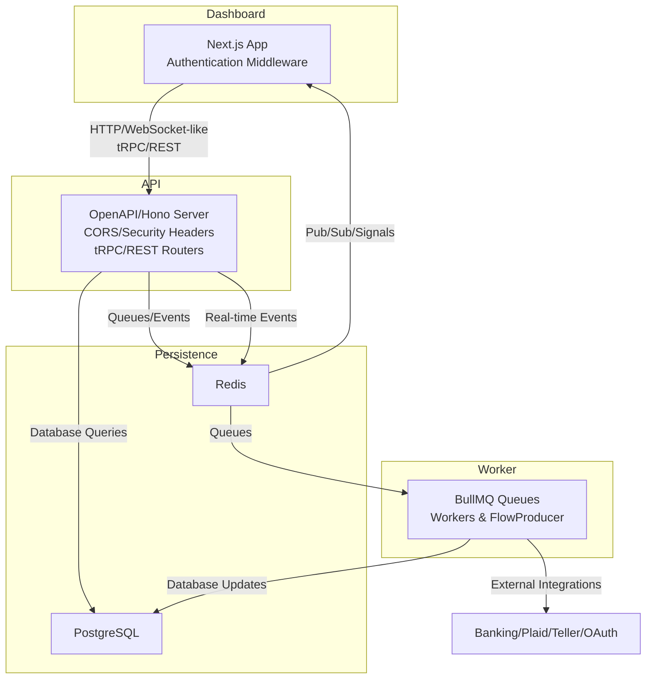

**Diagram sources**
- [apps/api/src/index.ts](file://midday/apps/api/src/index.ts#L26-L176)
- [apps/dashboard/src/middleware.ts](file://midday/apps/dashboard/src/middleware.ts#L13-L81)
- [apps/worker/src/config.ts](file://midday/apps/worker/src/config.ts#L46-L88)
- [packages/db/client.ts](file://midday/packages/db/client.ts)
- [packages/cache/shared-redis.ts](file://midday/packages/cache/shared-redis.ts)

**Section sources**
- [apps/api/src/index.ts](file://midday/apps/api/src/index.ts#L26-L176)
- [apps/dashboard/src/middleware.ts](file://midday/apps/dashboard/src/middleware.ts#L13-L81)
- [apps/worker/src/config.ts](file://midday/apps/worker/src/config.ts#L46-L88)

## Core Components
- API Server: Hono-based OpenAPI server with tRPC and REST routers, CORS, security headers, health probes, and OpenAPI documentation.
- Dashboard: Next.js app with Supabase-based authentication middleware and locale-aware routing.
- Worker: BullMQ-based job processing with robust Redis connectivity, exponential backoff, and failover handling.
- Database: PostgreSQL client with connection pooling and retry utilities.
- Caching: Shared Redis client for caching and pub/sub signaling.
- Logging: Structured logging with request tracing and telemetry.
- Domain Packages: Invoice, Documents, Banking, Inbox, Insights, Notifications, Email, Jobs, and Workbench.
- Utilities: OAuth, Plaid, Teller, Polar integrations, geo, scopes, search, parsing, validation, DB retry, safety comparisons, and eligibility checks.

**Section sources**
- [apps/api/src/index.ts](file://midday/apps/api/src/index.ts#L26-L176)
- [apps/dashboard/src/middleware.ts](file://midday/apps/dashboard/src/middleware.ts#L13-L81)
- [apps/worker/src/config.ts](file://midday/apps/worker/src/config.ts#L46-L88)
- [packages/db/client.ts](file://midday/packages/db/client.ts)
- [packages/cache/shared-redis.ts](file://midday/packages/cache/shared-redis.ts)
- [packages/logger/index.ts](file://midday/packages/logger/index.ts)
- [packages/supabase/middleware.ts](file://midday/packages/supabase/middleware.ts)
- [packages/utils/logger.ts](file://midday/packages/utils/logger.ts)
- [packages/utils/request-trace.ts](file://midday/packages/utils/request-trace.ts)
- [packages/utils/oauth.ts](file://midday/packages/utils/oauth.ts)
- [packages/utils/plaid.ts](file://midday/packages/utils/plaid.ts)
- [packages/utils/teller.ts](file://midday/packages/utils/teller.ts)
- [packages/utils/polar.ts](file://midday/packages/utils/polar.ts)
- [packages/utils/geo.ts](file://midday/packages/utils/geo.ts)
- [packages/utils/scopes.ts](file://midday/packages/utils/scopes.ts)
- [packages/utils/search.ts](file://midday/packages/utils/search.ts)
- [packages/utils/search-filters.ts](file://midday/packages/utils/search-filters.ts)
- [packages/utils/parse.ts](file://midday/packages/utils/parse.ts)
- [packages/utils/validate-response.ts](file://midday/packages/utils/validate-response.ts)
- [packages/utils/db-retry.ts](file://midday/packages/utils/db-retry.ts)
- [packages/utils/safe-compare.ts](file://midday/packages/utils/safe-compare.ts)
- [packages/utils/check-team-eligibility.ts](file://midday/packages/utils/check-team-eligibility.ts)

## Architecture Overview
The system follows an event-driven architecture:
- Frontend (Dashboard) interacts via HTTP and tRPC/REST.
- API validates requests, enforces auth, and persists data to PostgreSQL.
- Background jobs are queued in Redis via BullMQ; workers process them asynchronously.
- Real-time signals propagate through Redis pub/sub to inform the UI of updates.
- External integrations (banking providers, OAuth) trigger asynchronous workflows.
- Health checks, readiness probes, and telemetry ensure observability.

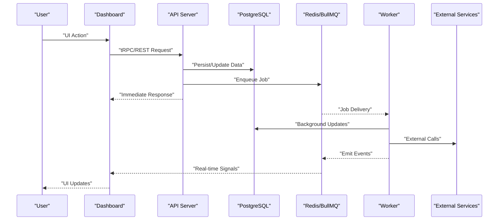

**Diagram sources**
- [apps/api/src/index.ts](file://midday/apps/api/src/index.ts#L26-L176)
- [apps/worker/src/config.ts](file://midday/apps/worker/src/config.ts#L46-L88)
- [packages/db/client.ts](file://midday/packages/db/client.ts)
- [packages/cache/shared-redis.ts](file://midday/packages/cache/shared-redis.ts)

## Detailed Component Analysis

### API Request-Response Cycle
- Authentication and security: CORS, secure headers, and tRPC error handling capture exceptions and send to Sentry.
- OpenAPI documentation and scalar reference generation.
- Health endpoints report readiness and dependency status.
- Database pool statistics logging and graceful shutdown handling.

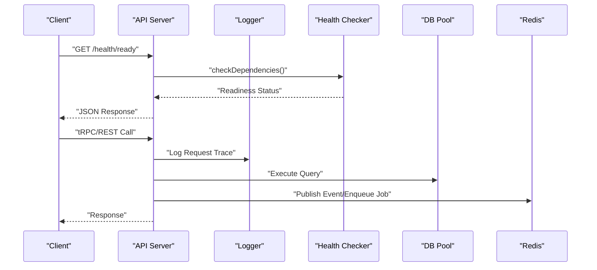

**Diagram sources**
- [apps/api/src/index.ts](file://midday/apps/api/src/index.ts#L120-L130)
- [apps/api/src/index.ts](file://midday/apps/api/src/index.ts#L88-L113)
- [apps/api/src/index.ts](file://midday/apps/api/src/index.ts#L178-L199)
- [packages/utils/logger.ts](file://midday/packages/utils/logger.ts)
- [packages/utils/request-trace.ts](file://midday/packages/utils/request-trace.ts)
- [packages/health/checker.ts](file://midday/packages/health/checker.ts)
- [packages/health/probes.ts](file://midday/packages/health/probes.ts)

**Section sources**
- [apps/api/src/index.ts](file://midday/apps/api/src/index.ts#L26-L176)
- [packages/utils/logger.ts](file://midday/packages/utils/logger.ts)
- [packages/utils/request-trace.ts](file://midday/packages/utils/request-trace.ts)
- [packages/health/checker.ts](file://midday/packages/health/checker.ts)
- [packages/health/probes.ts](file://midday/packages/health/probes.ts)

### Dashboard Authentication and Routing
- Supabase-based middleware updates sessions and enforces MFA requirements.
- Locale-aware routing and redirects for protected routes.
- Redirects to login or MFA verification pages when unauthenticated or partially authenticated.

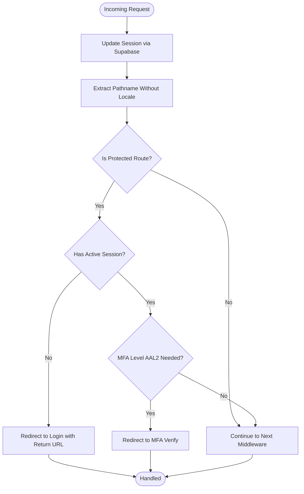

**Diagram sources**
- [apps/dashboard/src/middleware.ts](file://midday/apps/dashboard/src/middleware.ts#L13-L81)
- [packages/supabase/middleware.ts](file://midday/packages/supabase/middleware.ts)

**Section sources**
- [apps/dashboard/src/middleware.ts](file://midday/apps/dashboard/src/middleware.ts#L13-L81)
- [packages/supabase/middleware.ts](file://midday/packages/supabase/middleware.ts)

### Background Job Processing with BullMQ
- Redis connection configuration with TLS in production, exponential backoff, and failover reconnection.
- Separate connections for Queue, Worker, and FlowProducer.
- Graceful shutdown sequences closing DB connections, Redis, and flushing telemetry.

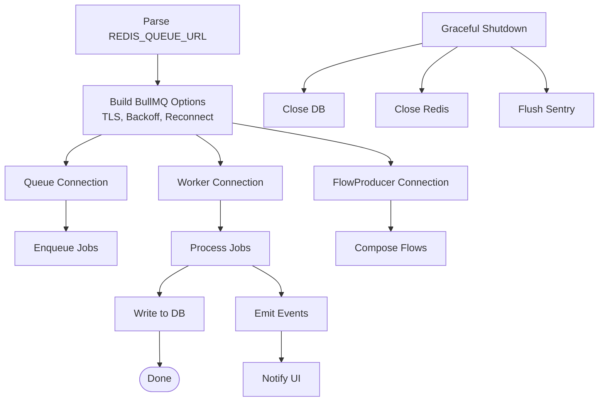

**Diagram sources**
- [apps/worker/src/config.ts](file://midday/apps/worker/src/config.ts#L46-L88)
- [packages/db/client.ts](file://midday/packages/db/client.ts)
- [packages/cache/shared-redis.ts](file://midday/packages/cache/shared-redis.ts)

**Section sources**
- [apps/worker/src/config.ts](file://midday/apps/worker/src/config.ts#L46-L88)
- [packages/db/client.ts](file://midday/packages/db/client.ts)
- [packages/cache/shared-redis.ts](file://midday/packages/cache/shared-redis.ts)

### Real-Time Update Mechanisms
- Redis pub/sub is used to signal UI updates after database writes and background processing.
- Telemetry utilities track real-time events across components.

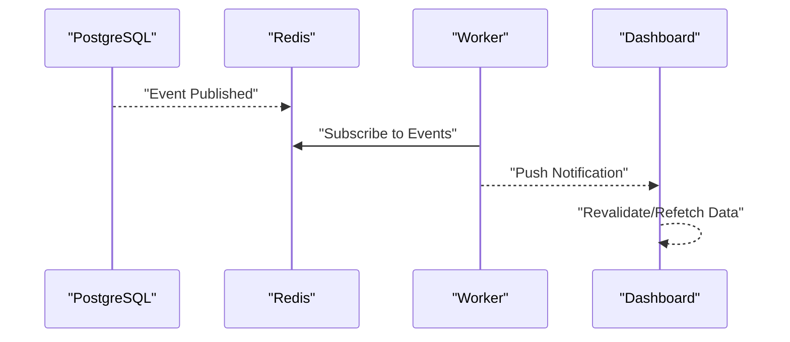

**Diagram sources**
- [packages/cache/shared-redis.ts](file://midday/packages/cache/shared-redis.ts)
- [packages/utils/telemetry-websocket.ts](file://midday/packages/utils/telemetry-websocket.ts)

**Section sources**
- [packages/cache/shared-redis.ts](file://midday/packages/cache/shared-redis.ts)
- [packages/utils/telemetry-websocket.ts](file://midday/packages/utils/telemetry-websocket.ts)

### Data Transformation Pipelines
- Parsing utilities transform raw inputs for downstream systems.
- Search filters and search utilities normalize queries.
- Validation utilities ensure response correctness.
- Geo utilities handle location-based transformations.
- OAuth, Plaid, Teller, and Polar utilities integrate external systems.

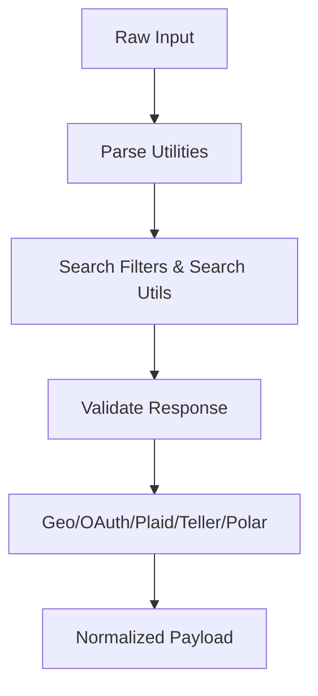

**Diagram sources**
- [packages/utils/parse.ts](file://midday/packages/utils/parse.ts)
- [packages/utils/search-filters.ts](file://midday/packages/utils/search-filters.ts)
- [packages/utils/search.ts](file://midday/packages/utils/search.ts)
- [packages/utils/validate-response.ts](file://midday/packages/utils/validate-response.ts)
- [packages/utils/geo.ts](file://midday/packages/utils/geo.ts)
- [packages/utils/oauth.ts](file://midday/packages/utils/oauth.ts)
- [packages/utils/plaid.ts](file://midday/packages/utils/plaid.ts)
- [packages/utils/teller.ts](file://midday/packages/utils/teller.ts)
- [packages/utils/polar.ts](file://midday/packages/utils/polar.ts)

**Section sources**
- [packages/utils/parse.ts](file://midday/packages/utils/parse.ts)
- [packages/utils/search-filters.ts](file://midday/packages/utils/search-filters.ts)
- [packages/utils/search.ts](file://midday/packages/utils/search.ts)
- [packages/utils/validate-response.ts](file://midday/packages/utils/validate-response.ts)
- [packages/utils/geo.ts](file://midday/packages/utils/geo.ts)
- [packages/utils/oauth.ts](file://midday/packages/utils/oauth.ts)
- [packages/utils/plaid.ts](file://midday/packages/utils/plaid.ts)
- [packages/utils/teller.ts](file://midday/packages/utils/teller.ts)
- [packages/utils/polar.ts](file://midday/packages/utils/polar.ts)

### Caching Strategies
- Shared Redis client manages caching and pub/sub signaling.
- Telemetry utilities track cache hits/misses and performance.

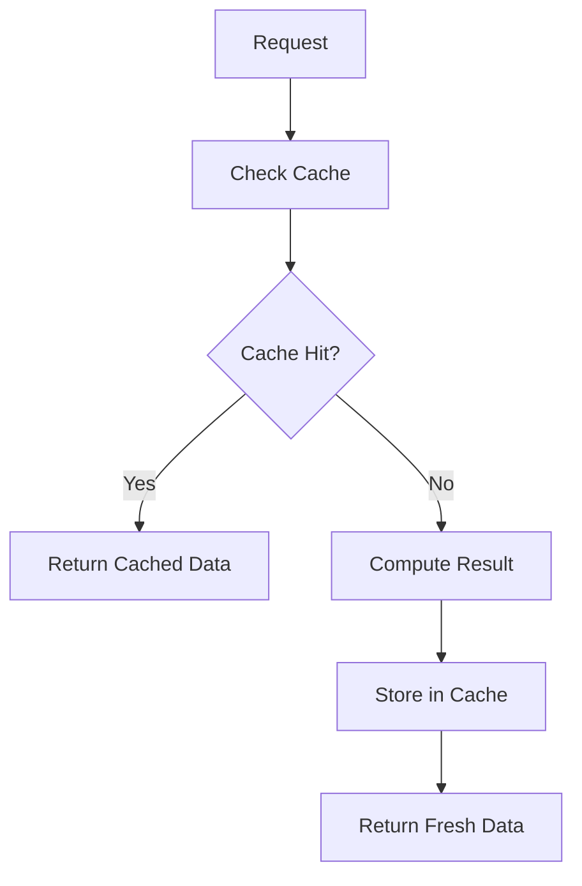

**Diagram sources**
- [packages/cache/shared-redis.ts](file://midday/packages/cache/shared-redis.ts)
- [packages/utils/telemetry-cache.ts](file://midday/packages/utils/telemetry-cache.ts)

**Section sources**
- [packages/cache/shared-redis.ts](file://midday/packages/cache/shared-redis.ts)
- [packages/utils/telemetry-cache.ts](file://midday/packages/utils/telemetry-cache.ts)

### Audit Trails
- Structured logging with request tracing and Sentry integration.
- Telemetry utilities record API, job, event, and insight activities.

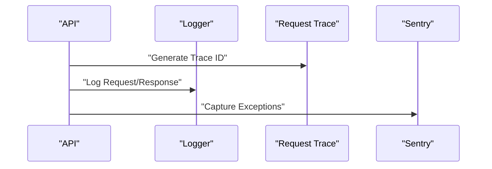

**Diagram sources**
- [packages/utils/logger.ts](file://midday/packages/utils/logger.ts)
- [packages/utils/request-trace.ts](file://midday/packages/utils/request-trace.ts)
- [packages/logger/index.ts](file://midday/packages/logger/index.ts)

**Section sources**
- [packages/utils/logger.ts](file://midday/packages/utils/logger.ts)
- [packages/utils/request-trace.ts](file://midday/packages/utils/request-trace.ts)
- [packages/logger/index.ts](file://midday/packages/logger/index.ts)

### Financial Data, Document Processing, and AI-Generated Insights
- Financial data: banking integrations (Plaid, Teller), recurring invoices, transactions, categories, tags, attachments.
- Documents: upload, preview, tagging, and processing workflows.
- AI/Insights: agent-driven insights, MCP tools, prompts, and resource management.

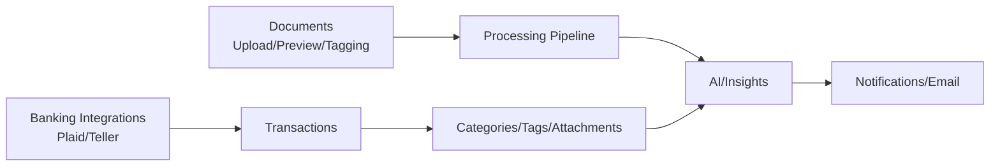

**Diagram sources**
- [packages/banking/index.ts](file://midday/packages/banking/index.ts)
- [packages/invoice/index.ts](file://midday/packages/invoice/index.ts)
- [packages/documents/index.ts](file://midday/packages/documents/index.ts)
- [packages/insights/index.ts](file://midday/packages/insights/index.ts)
- [packages/notifications/index.ts](file://midday/packages/notifications/index.ts)
- [packages/email/index.ts](file://midday/packages/email/index.ts)

**Section sources**
- [packages/banking/index.ts](file://midday/packages/banking/index.ts)
- [packages/invoice/index.ts](file://midday/packages/invoice/index.ts)
- [packages/documents/index.ts](file://midday/packages/documents/index.ts)
- [packages/insights/index.ts](file://midday/packages/insights/index.ts)
- [packages/notifications/index.ts](file://midday/packages/notifications/index.ts)
- [packages/email/index.ts](file://midday/packages/email/index.ts)

### Event-Driven Architecture with BullMQ, Redis, and Database Triggers
- BullMQ queues orchestrate background tasks; workers consume jobs and update the database.
- Redis emits events that drive real-time UI updates.
- Database triggers can emit events to Redis for decoupled processing.

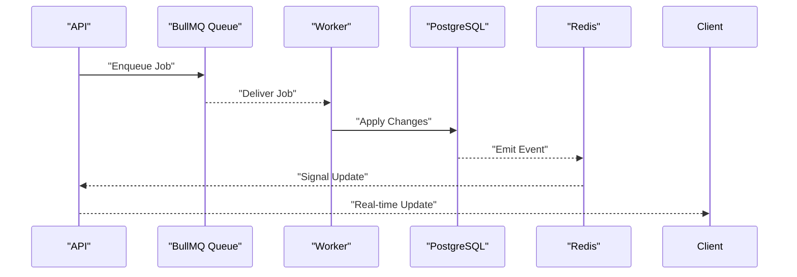

**Diagram sources**
- [apps/worker/src/config.ts](file://midday/apps/worker/src/config.ts#L46-L88)
- [packages/cache/shared-redis.ts](file://midday/packages/cache/shared-redis.ts)
- [packages/db/client.ts](file://midday/packages/db/client.ts)

**Section sources**
- [apps/worker/src/config.ts](file://midday/apps/worker/src/config.ts#L46-L88)
- [packages/cache/shared-redis.ts](file://midday/packages/cache/shared-redis.ts)
- [packages/db/client.ts](file://midday/packages/db/client.ts)

### Typical Data Flows

#### Invoice Creation
- User action in the dashboard triggers a tRPC mutation.
- API validates and persists invoice data to PostgreSQL.
- A background job is enqueued to generate PDFs, send notifications, and update analytics.
- Redis signals the UI to refresh the invoice list and details.

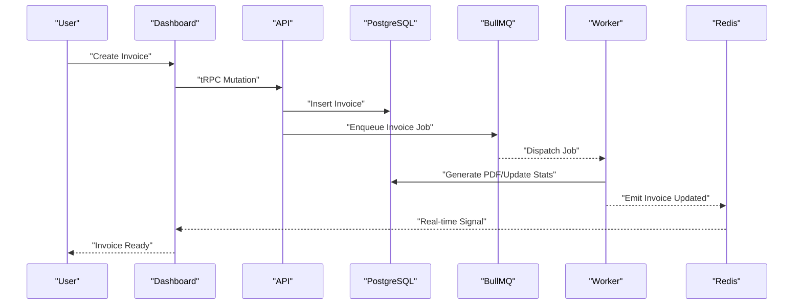

**Diagram sources**
- [apps/api/src/index.ts](file://midday/apps/api/src/index.ts#L88-L113)
- [apps/worker/src/config.ts](file://midday/apps/worker/src/config.ts#L46-L88)
- [packages/invoice/index.ts](file://midday/packages/invoice/index.ts)
- [packages/cache/shared-redis.ts](file://midday/packages/cache/shared-redis.ts)

#### Bank Reconciliation
- Bank provider integration pushes transactions.
- API normalizes and persists transactions.
- A reconciliation job matches transactions to existing records and categorizes them.
- Redis notifies the UI to reflect matched/unmatched items.

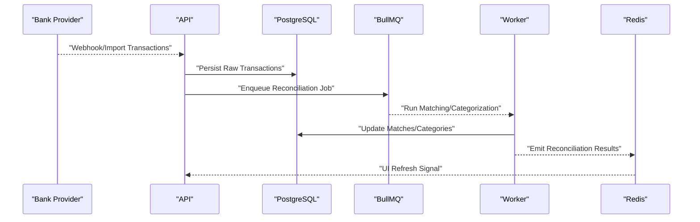

**Diagram sources**
- [packages/banking/index.ts](file://midday/packages/banking/index.ts)
- [apps/worker/src/config.ts](file://midday/apps/worker/src/config.ts#L46-L88)
- [packages/cache/shared-redis.ts](file://midday/packages/cache/shared-redis.ts)

#### Document Processing
- Document upload triggers ingestion and OCR.
- Metadata extraction and tagging occur asynchronously.
- AI agents analyze content to suggest categories, tags, and insights.
- Notifications and emails are dispatched upon completion.

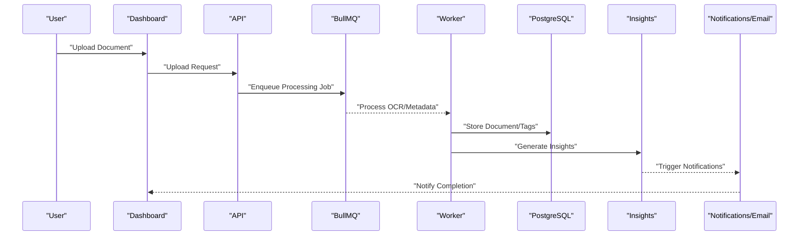

**Diagram sources**
- [packages/documents/index.ts](file://midday/packages/documents/index.ts)
- [apps/worker/src/config.ts](file://midday/apps/worker/src/config.ts#L46-L88)
- [packages/insights/index.ts](file://midday/packages/insights/index.ts)
- [packages/notifications/index.ts](file://midday/packages/notifications/index.ts)
- [packages/email/index.ts](file://midday/packages/email/index.ts)

### Data Consistency, Eventual Consistency, and Conflict Resolution
- Eventual consistency: background jobs and Redis pub/sub ensure UI reflects state changes after asynchronous processing completes.
- Conflict resolution: optimistic concurrency via row versioning and retry logic; idempotent job processing prevents duplicate effects.
- Retry strategies: exponential backoff for Redis connectivity and database operations.
- Auditability: structured logs, request traces, and Sentry capture for debugging and compliance.

**Section sources**
- [packages/utils/db-retry.ts](file://midday/packages/utils/db-retry.ts)
- [apps/worker/src/config.ts](file://midday/apps/worker/src/config.ts#L61-L86)
- [packages/utils/logger.ts](file://midday/packages/utils/logger.ts)
- [packages/utils/request-trace.ts](file://midday/packages/utils/request-trace.ts)

## Dependency Analysis
Key dependencies and their roles:
- API depends on tRPC routers, REST routers, health checker, and logging.
- Worker depends on BullMQ configuration and Redis connectivity.
- Dashboard depends on Supabase middleware and i18n.
- All components depend on shared database and cache clients.

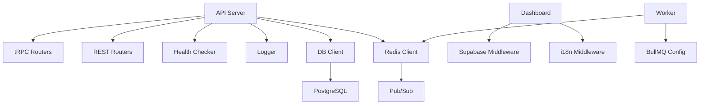

**Diagram sources**
- [apps/api/src/index.ts](file://midday/apps/api/src/index.ts#L26-L176)
- [apps/dashboard/src/middleware.ts](file://midday/apps/dashboard/src/middleware.ts#L13-L81)
- [apps/worker/src/config.ts](file://midday/apps/worker/src/config.ts#L46-L88)
- [packages/db/client.ts](file://midday/packages/db/client.ts)
- [packages/cache/shared-redis.ts](file://midday/packages/cache/shared-redis.ts)

**Section sources**
- [apps/api/src/index.ts](file://midday/apps/api/src/index.ts#L26-L176)
- [apps/dashboard/src/middleware.ts](file://midday/apps/dashboard/src/middleware.ts#L13-L81)
- [apps/worker/src/config.ts](file://midday/apps/worker/src/config.ts#L46-L88)
- [packages/db/client.ts](file://midday/packages/db/client.ts)
- [packages/cache/shared-redis.ts](file://midday/packages/cache/shared-redis.ts)

## Performance Considerations
- Database pool statistics logging helps monitor connection usage and capacity.
- Debug performance logging for tRPC procedures aids in identifying slow operations.
- Graceful shutdown ensures clean termination of DB and Redis connections.
- Redis connection tuning (keep-alive, timeouts, retry strategy) improves resilience under network flakiness.

**Section sources**
- [apps/api/src/index.ts](file://midday/apps/api/src/index.ts#L178-L199)
- [apps/api/src/index.ts](file://midday/apps/api/src/index.ts#L67-L86)
- [apps/worker/src/config.ts](file://midday/apps/worker/src/config.ts#L55-L86)

## Troubleshooting Guide
- Health and readiness: use /health and /health/ready endpoints to verify service status and dependencies.
- Error capture: tRPC and global error handlers send exceptions to Sentry and log detailed context.
- Request tracing: attach request IDs to correlate logs across services.
- Database and Redis: monitor pool stats and connection retries; ensure proper shutdown sequences.

**Section sources**
- [apps/api/src/index.ts](file://midday/apps/api/src/index.ts#L120-L130)
- [apps/api/src/index.ts](file://midday/apps/api/src/index.ts#L202-L211)
- [packages/utils/request-trace.ts](file://midday/packages/utils/request-trace.ts)
- [packages/health/checker.ts](file://midday/packages/health/checker.ts)
- [packages/health/probes.ts](file://midday/packages/health/probes.ts)

## Conclusion
Faworra’s data flow architecture integrates a responsive dashboard, a robust API with tRPC/REST, event-driven background processing via BullMQ, and real-time updates through Redis. The system emphasizes eventual consistency, strong observability, and resilient connectivity to external services. By leveraging queues, pub/sub, and domain-specific packages, it supports complex financial workflows, document processing, and AI-driven insights while maintaining auditability and scalability.

## Appendices
- Telemetry utilities across components provide visibility into API, job, event, and insight lifecycles.
- OAuth, Plaid, Teller, and Polar integrations enable seamless external data ingestion.
- Search, filtering, parsing, and validation utilities ensure data quality and consistency.

[No sources needed since this section aggregates previously cited information]