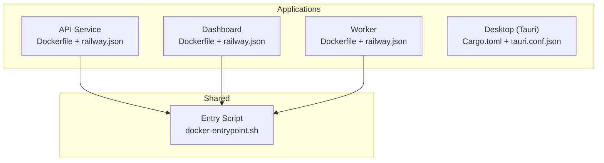
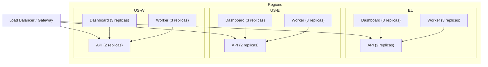
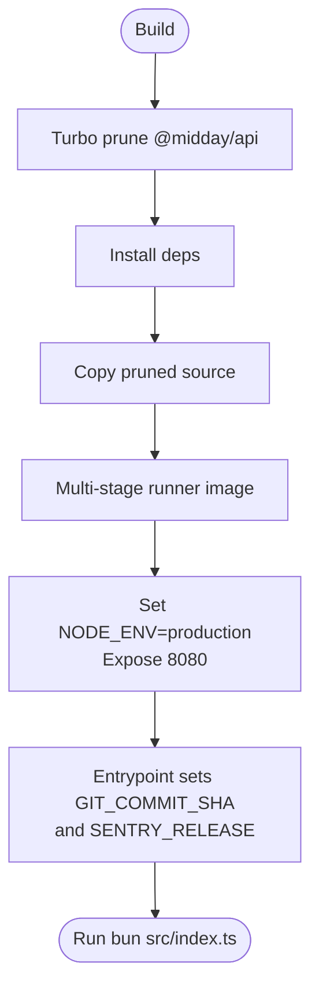
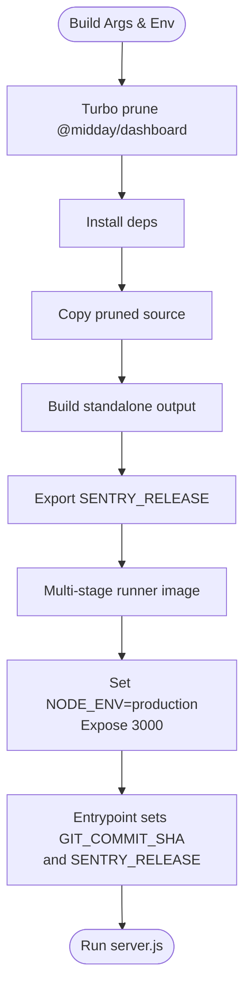
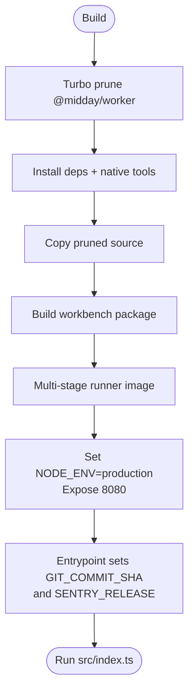
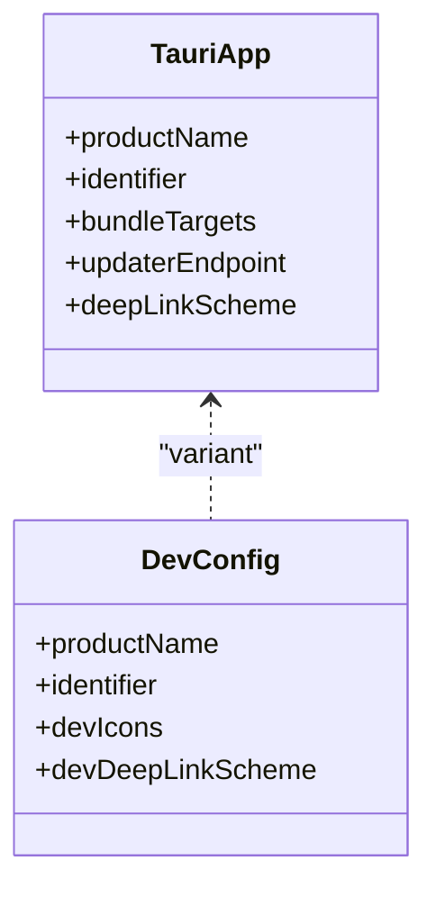
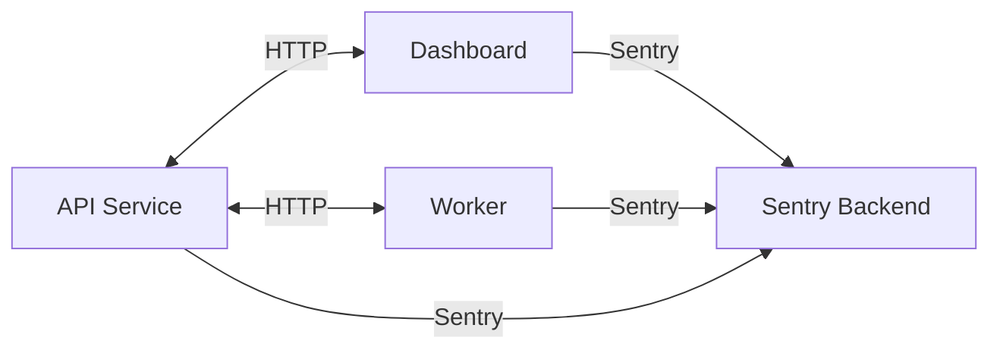

# Deployment Topology

<cite>
**Referenced Files in This Document**
- [Dockerfile (API)](file://midday/apps/api/Dockerfile)
- [railway.json (API)](file://midday/apps/api/railway.json)
- [.env-template (API)](file://midday/apps/api/.env-template)
- [Dockerfile (Dashboard)](file://midday/apps/dashboard/Dockerfile)
- [railway.json (Dashboard)](file://midday/apps/dashboard/railway.json)
- [.env-example (Dashboard)](file://midday/apps/dashboard/.env-example)
- [Dockerfile (Worker)](file://midday/apps/worker/Dockerfile)
- [railway.json (Worker)](file://midday/apps/worker/railway.json)
- [.env-template (Worker)](file://midday/apps/worker/.env-template)
- [docker-entrypoint.sh](file://midday/scripts/docker-entrypoint.sh)
- [Cargo.toml (Desktop)](file://midday/apps/desktop/src-tauri/Cargo.toml)
- [tauri.conf.json (Desktop)](file://midday/apps/desktop/src-tauri/tauri.conf.json)
- [tauri.dev.conf.json (Desktop)](file://midday/apps/desktop/src-tauri/tauri.dev.conf.json)
</cite>

## Table of Contents
1. [Introduction](#introduction)
2. [Project Structure](#project-structure)
3. [Core Components](#core-components)
4. [Architecture Overview](#architecture-overview)
5. [Detailed Component Analysis](#detailed-component-analysis)
6. [Dependency Analysis](#dependency-analysis)
7. [Performance Considerations](#performance-considerations)
8. [Troubleshooting Guide](#troubleshooting-guide)
9. [Conclusion](#conclusion)
10. [Appendices](#appendices)

## Introduction
This document describes the deployment topology for Faworra’s distributed system. It covers containerized deployments with Docker configurations for the API, Dashboard (Next.js), and Worker services, along with cross-platform desktop packaging and distribution via Tauri/Rust. It also outlines infrastructure requirements, scaling patterns, environment management across development, staging, and production, and observability with Sentry. Disaster recovery, backups, and high availability are addressed conceptually, and deployment diagrams illustrate network topology, load balancing, and service discovery patterns.

## Project Structure
The repository follows a monorepo layout with three primary applications and a shared entrypoint script:
- API service (Bun-based, multi-region deployment)
- Dashboard (Next.js, standalone build, Sentry integration)
- Worker (Bun-based, background job processing)
- Desktop client (Tauri/Rust, cross-platform bundling)
- Shared entrypoint script for containers

**Diagram sources**
- [Dockerfile (API)](file://midday/apps/api/Dockerfile#L1-L50)
- [Dockerfile (Dashboard)](file://midday/apps/dashboard/Dockerfile#L1-L101)
- [Dockerfile (Worker)](file://midday/apps/worker/Dockerfile#L1-L62)
- [docker-entrypoint.sh](file://midday/scripts/docker-entrypoint.sh#L1-L13)

**Section sources**
- [Dockerfile (API)](file://midday/apps/api/Dockerfile#L1-L50)
- [Dockerfile (Dashboard)](file://midday/apps/dashboard/Dockerfile#L1-L101)
- [Dockerfile (Worker)](file://midday/apps/worker/Dockerfile#L1-L62)
- [docker-entrypoint.sh](file://midday/scripts/docker-entrypoint.sh#L1-L13)

## Core Components
- API Service
  - Containerized with a multi-stage Docker build leveraging Turbo for pruning and caching.
  - Exposes port 8080 and sets production runtime environment variables.
  - Uses a shared entrypoint to inject commit SHA and Sentry release metadata at runtime.
  - Deployed across multiple regions with multi-region replica counts.

- Dashboard (Next.js)
  - Multi-stage build with CA certificates for Sentry source map uploads.
  - Standalone output deployment with a dedicated runtime user.
  - Builds with environment-specific build args and exports Sentry release metadata.
  - Exposes port 3000 and runs via server.js.

- Worker
  - Multi-stage build with native module support and workspace pruning.
  - Runs background jobs and exposes port 8080.
  - Shares the same entrypoint mechanism for commit/Sentry metadata.

- Desktop (Tauri)
  - Cross-platform bundling with updater and deep link plugins.
  - Platform-specific bundle targets and icon sets.
  - Updater configured with a public key and endpoint.

- Shared Entrypoint
  - Injects GIT_COMMIT_SHA and SENTRY_RELEASE at runtime when not provided by the platform.

**Section sources**
- [Dockerfile (API)](file://midday/apps/api/Dockerfile#L26-L50)
- [Dockerfile (Dashboard)](file://midday/apps/dashboard/Dockerfile#L73-L101)
- [Dockerfile (Worker)](file://midday/apps/worker/Dockerfile#L38-L62)
- [docker-entrypoint.sh](file://midday/scripts/docker-entrypoint.sh#L1-L13)
- [Cargo.toml (Desktop)](file://midday/apps/desktop/src-tauri/Cargo.toml#L1-L40)
- [tauri.conf.json (Desktop)](file://midday/apps/desktop/src-tauri/tauri.conf.json#L1-L46)

## Architecture Overview
The system is deployed across multiple regions with regional replicas for high availability. The Dashboard serves the frontend, the API handles backend requests, and the Worker processes asynchronous tasks. Sentry is integrated at build and runtime for error reporting and release tracking.

**Diagram sources**
- [railway.json (API)](file://midday/apps/api/railway.json#L13-L17)
- [railway.json (Dashboard)](file://midday/apps/dashboard/railway.json#L13-L17)
- [railway.json (Worker)](file://midday/apps/worker/railway.json#L13-L14)

## Detailed Component Analysis

### API Service Deployment
- Build and runtime stages:
  - Prunes workspace for the API using Turbo.
  - Installs dependencies and copies only necessary runtime files.
  - Sets production environment and exposes port 8080.
- Regional deployment:
  - Multi-region configuration with 2 replicas per region.
  - Health checks enabled with extended timeouts.
- Environment variables:
  - Database pooler URLs for primary and regional read replicas.
  - Provider credentials for banking integrations.
  - Redis and queue URLs for caching and background jobs.
  - Logging and API URL overrides.

**Diagram sources**
- [Dockerfile (API)](file://midday/apps/api/Dockerfile#L8-L50)
- [docker-entrypoint.sh](file://midday/scripts/docker-entrypoint.sh#L1-L13)

**Section sources**
- [Dockerfile (API)](file://midday/apps/api/Dockerfile#L1-L50)
- [railway.json (API)](file://midday/apps/api/railway.json#L1-L31)
- [.env-template (API)](file://midday/apps/api/.env-template#L1-L149)

### Dashboard Deployment
- Build specifics:
  - Prunes workspace for the dashboard.
  - Installs CA certificates for Sentry source map uploads.
  - Builds with build args for public environment variables.
  - Exports SENTRY_RELEASE using GIT_COMMIT_SHA.
- Runtime:
  - Standalone output with a dedicated runtime user.
  - Exposes port 3000 and runs server.js.
- Regional deployment:
  - Multi-region configuration with 3 replicas per region.
  - Health checks and overlap/drain settings optimized for smooth updates.

**Diagram sources**
- [Dockerfile (Dashboard)](file://midday/apps/dashboard/Dockerfile#L8-L101)
- [docker-entrypoint.sh](file://midday/scripts/docker-entrypoint.sh#L1-L13)

**Section sources**
- [Dockerfile (Dashboard)](file://midday/apps/dashboard/Dockerfile#L1-L101)
- [railway.json (Dashboard)](file://midday/apps/dashboard/railway.json#L1-L31)
- [.env-example (Dashboard)](file://midday/apps/dashboard/.env-example#L1-L87)

### Worker Deployment
- Build specifics:
  - Prunes workspace for the worker and installs native build dependencies.
  - Builds supporting packages prior to runtime image creation.
- Runtime:
  - Sets production environment and exposes port 8080.
  - Shares the same entrypoint for commit/Sentry metadata.
- Regional deployment:
  - Single region with 3 replicas and health checks.

**Diagram sources**
- [Dockerfile (Worker)](file://midday/apps/worker/Dockerfile#L8-L62)
- [docker-entrypoint.sh](file://midday/scripts/docker-entrypoint.sh#L1-L13)

**Section sources**
- [Dockerfile (Worker)](file://midday/apps/worker/Dockerfile#L1-L62)
- [railway.json (Worker)](file://midday/apps/worker/railway.json#L1-L24)
- [.env-template (Worker)](file://midday/apps/worker/.env-template#L1-L123)

### Desktop Application (Tauri/Rust)
- Packaging:
  - Cross-platform bundling targeting all platforms with updater artifacts.
  - Icon sets for multiple resolutions and formats.
- Plugins:
  - Updater configured with a public key and endpoint.
  - Deep link schemes for desktop protocols.
- Development variants:
  - Separate configuration for dev builds with distinct product name and schemes.

**Diagram sources**
- [tauri.conf.json (Desktop)](file://midday/apps/desktop/src-tauri/tauri.conf.json#L1-L46)
- [tauri.dev.conf.json (Desktop)](file://midday/apps/desktop/src-tauri/tauri.dev.conf.json#L1-L22)

**Section sources**
- [Cargo.toml (Desktop)](file://midday/apps/desktop/src-tauri/Cargo.toml#L1-L40)
- [tauri.conf.json (Desktop)](file://midday/apps/desktop/src-tauri/tauri.conf.json#L1-L46)
- [tauri.dev.conf.json (Desktop)](file://midday/apps/desktop/src-tauri/tauri.dev.conf.json#L1-L22)

## Dependency Analysis
- Containerization dependencies:
  - All services rely on the shared entrypoint script for runtime metadata injection.
  - Build-time environment variables are passed as build args to the Dashboard.
- Inter-service dependencies:
  - Dashboard and Worker both depend on the API for backend operations.
  - Worker depends on Redis queues and external provider APIs.
- Observability:
  - Sentry is integrated at build time for source maps and at runtime for error reporting.

**Diagram sources**
- [Dockerfile (Dashboard)](file://midday/apps/dashboard/Dockerfile#L49-L52)
- [Dockerfile (API)](file://midday/apps/api/Dockerfile#L39-L42)
- [Dockerfile (Worker)](file://midday/apps/worker/Dockerfile#L51-L54)

**Section sources**
- [Dockerfile (Dashboard)](file://midday/apps/dashboard/Dockerfile#L33-L71)
- [Dockerfile (API)](file://midday/apps/api/Dockerfile#L39-L42)
- [Dockerfile (Worker)](file://midday/apps/worker/Dockerfile#L51-L54)

## Performance Considerations
- Build optimization:
  - Turbo workspace pruning reduces build times and image sizes.
  - Native build dependencies are installed only where needed (Worker).
- Runtime efficiency:
  - Standalone Next.js build minimizes startup overhead.
  - Dedicated runtime users and minimal base images reduce attack surface and improve security.
- Scaling:
  - Multi-region replica distribution balances latency and availability.
  - Overlap and drain settings minimize downtime during deployments.

[No sources needed since this section provides general guidance]

## Troubleshooting Guide
- Health checks:
  - Verify health endpoints for each service align with configured paths and timeouts.
- Metadata injection:
  - Ensure GIT_COMMIT_SHA and SENTRY_RELEASE are present at runtime via the entrypoint.
- Sentry releases:
  - Confirm SENTRY_RELEASE matches the expected commit SHA for accurate sourcemap association.
- Environment parity:
  - Validate environment variable sets across development, staging, and production.

**Section sources**
- [railway.json (API)](file://midday/apps/api/railway.json#L7-L12)
- [railway.json (Dashboard)](file://midday/apps/dashboard/railway.json#L7-L12)
- [railway.json (Worker)](file://midday/apps/worker/railway.json#L7-L12)
- [docker-entrypoint.sh](file://midday/scripts/docker-entrypoint.sh#L6-L10)

## Conclusion
Faworra’s deployment topology leverages multi-region, multi-replica deployments for resilience and scalability. Containers are built efficiently using Turbo and multi-stage Dockerfiles, while Sentry integration ensures robust observability. The Dashboard’s standalone build and the Worker’s background processing complement the API, and the Tauri-based desktop client delivers a cross-platform experience with in-place updates and deep linking.

[No sources needed since this section summarizes without analyzing specific files]

## Appendices

### Environment Management Across Environments
- Development:
  - Local defaults for ports, Redis, and Supabase URLs.
  - Example environment files define local overrides and optional integrations.
- Staging:
  - Reduced replica counts per region for cost control.
  - Environment-specific overrides via Railway environments.
- Production:
  - Multi-region replica distribution with higher replica counts.
  - Platform-provided environment variables and secrets managed externally.

**Section sources**
- [.env-example (Dashboard)](file://midday/apps/dashboard/.env-example#L1-L87)
- [.env-template (API)](file://midday/apps/api/.env-template#L1-L149)
- [.env-template (Worker)](file://midday/apps/worker/.env-template#L1-L123)
- [railway.json (API)](file://midday/apps/api/railway.json#L19-L29)
- [railway.json (Dashboard)](file://midday/apps/dashboard/railway.json#L19-L29)
- [railway.json (Worker)](file://midday/apps/worker/railway.json#L16-L22)

### CI/CD Pipeline Architecture and Release Strategies
- Build pipeline:
  - Turbo workspace pruning and targeted builds per application.
  - Build args for public environment variables and Sentry configuration.
- Release tagging:
  - Commit SHA embedded at build time and propagated to runtime for Sentry releases.
- Deployment:
  - Railway-managed deployments with health checks, overlap, and drain settings.
  - Environment-specific overrides for staging vs production.

**Section sources**
- [Dockerfile (Dashboard)](file://midday/apps/dashboard/Dockerfile#L33-L71)
- [Dockerfile (API)](file://midday/apps/api/Dockerfile#L39-L42)
- [Dockerfile (Worker)](file://midday/apps/worker/Dockerfile#L51-L54)
- [docker-entrypoint.sh](file://midday/scripts/docker-entrypoint.sh#L6-L10)
- [railway.json (API)](file://midday/apps/api/railway.json#L1-L31)
- [railway.json (Dashboard)](file://midday/apps/dashboard/railway.json#L1-L31)
- [railway.json (Worker)](file://midday/apps/worker/railway.json#L1-L24)

### Monitoring and Observability
- Sentry:
  - Build-time source map upload for the Dashboard.
  - Runtime error reporting and release tracking via GIT_COMMIT_SHA and SENTRY_RELEASE.
- Database performance monitoring:
  - Use provider-specific dashboards and pooler URLs for primary and regional replicas.
- Application metrics:
  - Integrate metrics collection at the application level and expose via health endpoints.

**Section sources**
- [Dockerfile (Dashboard)](file://midday/apps/dashboard/Dockerfile#L49-L52)
- [docker-entrypoint.sh](file://midday/scripts/docker-entrypoint.sh#L6-L10)
- [.env-template (API)](file://midday/apps/api/.env-template#L9-L18)

### Disaster Recovery, Backups, and High Availability
- High availability:
  - Multi-region deployments with multiple replicas per region.
- Backup strategies:
  - Database backups via provider-managed solutions and offloading to object storage where applicable.
- Disaster recovery:
  - Regional failover and automated rollbacks via platform restart policies and drain settings.

**Section sources**
- [railway.json (API)](file://midday/apps/api/railway.json#L13-L17)
- [railway.json (Dashboard)](file://midday/apps/dashboard/railway.json#L13-L17)
- [railway.json (Worker)](file://midday/apps/worker/railway.json#L13-L14)