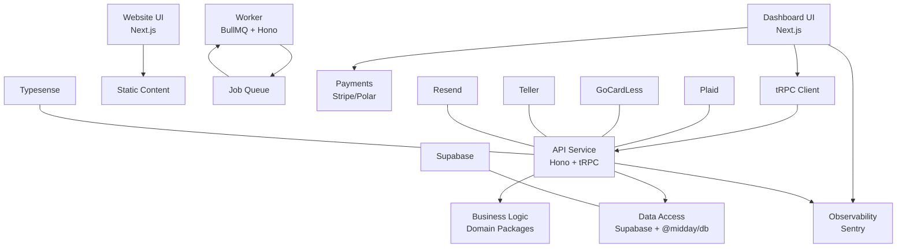
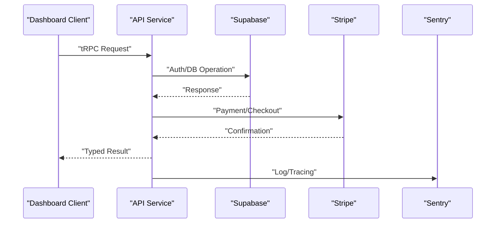
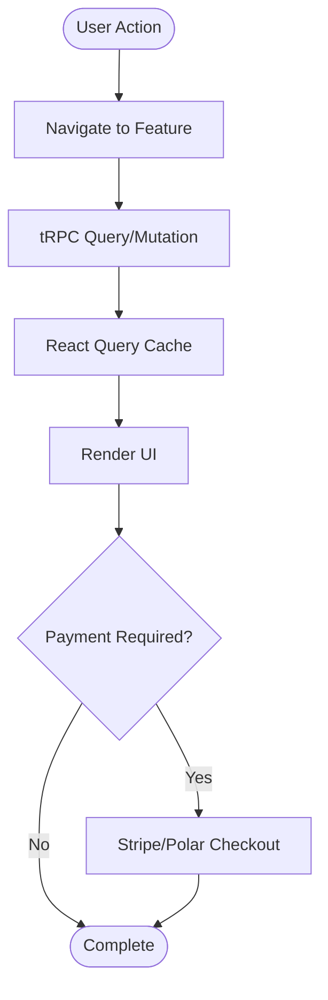
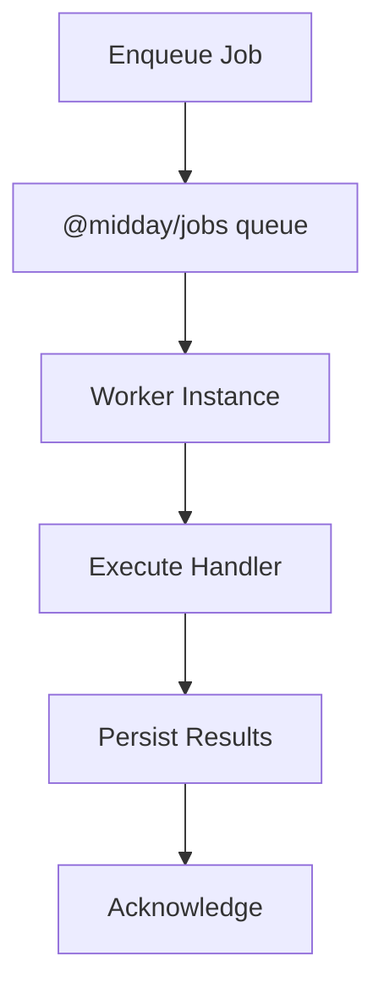
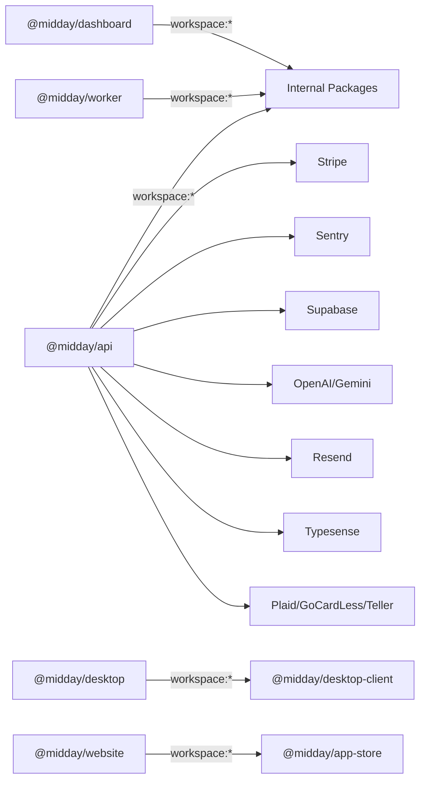

# System Design

<cite>
**Referenced Files in This Document**
- [README.md](file://README.md)
- [turbo.json](file://turbo.json)
- [apps/api/package.json](file://apps/api/package.json)
- [apps/dashboard/package.json](file://apps/dashboard/package.json)
- [apps/worker/package.json](file://apps/worker/package.json)
- [apps/desktop/package.json](file://apps/desktop/package.json)
- [apps/website/package.json](file://apps/website/package.json)
- [packages/tsconfig/package.json](file://packages/tsconfig/package.json)
</cite>

## Table of Contents
1. [Introduction](#introduction)
2. [Project Structure](#project-structure)
3. [Core Components](#core-components)
4. [Architecture Overview](#architecture-overview)
5. [Detailed Component Analysis](#detailed-component-analysis)
6. [Dependency Analysis](#dependency-analysis)
7. [Performance Considerations](#performance-considerations)
8. [Troubleshooting Guide](#troubleshooting-guide)
9. [Conclusion](#conclusion)
10. [Appendices](#appendices)

## Introduction
This document describes the system design of Faworra (formerly Midday), focusing on the monorepo structure, layered architecture, microservices approach, system boundaries, external dependencies, and cloud integrations. The platform consists of five main applications and twenty-five plus shared packages organized as a Turborepo workspace. The design emphasizes separation of concerns across presentation, business logic, and data access layers, while enabling independent deployment of backend services and workers.

## Project Structure
The repository is a monorepo managed by Turborepo with a clear separation of concerns:
- Five main applications:
  - API service (backend HTTP and tRPC server)
  - Dashboard (Next.js frontend)
  - Worker (background job processor)
  - Desktop (Tauri desktop client)
  - Website (Next.js marketing site)
- Twenty-five plus shared packages providing reusable business logic, data access, UI, and infrastructure utilities.

Key characteristics:
- Shared TypeScript configuration via a dedicated package.
- Workspace-based dependency management across apps and packages.
- Environment variable propagation configured centrally for secure secrets.

```mermaid
graph TB
subgraph "Monorepo Root"
TS["packages/tsconfig"]
TURBO["turbo.json"]
end
subgraph "Applications"
API["@midday/api"]
DASH["@midday/dashboard"]
WORKER["@midday/worker"]
DESK["@midday/desktop"]
WEB["@midday/website"]
end
subgraph "Shared Packages"
SUPA["@midday/supabase"]
DB["@midday/db"]
LOG["@midday/logger"]
TRPC["@midday/trpc"]
UI["@midday/ui"]
UTIL["@midday/utils"]
JOBS["@midday/jobs"]
INS["@midday/insights"]
ACC["@midday/accounting"]
INV["@midday/invoice"]
DOC["@midday/documents"]
INB["@midday/inbox"]
CUST["@midday/customers"]
PLAN["@midday/plans"]
NOTI["@midday/notifications"]
EMAIL["@midday/email"]
ENC["@midday/encryption"]
CAT["@midday/categories"]
LOC["@midday/location"]
EV["@midday/events"]
BANK["@midday/banking"]
IMP["@midday/import"]
APPS["@midday/app-store"]
DESKCLI["@midday/desktop-client"]
end
API --> SUPA
API --> DB
API --> LOG
API --> TRPC
API --> JOBS
API --> INS
API --> ACC
API --> INV
API --> DOC
API --> INB
API --> CUST
API --> PLAN
API --> NOTI
API --> EMAIL
API --> ENC
API --> CAT
API --> LOC
API --> EV
API --> BANK
API --> IMP
API --> APPS
DASH --> API
DASH --> TRPC
DASH --> UI
DASH --> UTIL
DASH --> PLAN
DASH --> NOTI
DASH --> SUPA
WORKER --> JOBS
WORKER --> INS
WORKER --> ACC
WORKER --> INV
WORKER --> DOC
WORKER --> INB
WORKER --> CUST
WORKER --> PLAN
WORKER --> NOTI
WORKER --> EMAIL
WORKER --> ENC
WORKER --> CAT
WORKER --> LOC
WORKER --> EV
WORKER --> BANK
WORKER --> IMP
WORKER --> APPS
DESK --> DESKCLI
WEB --> APPS
WEB --> UI
```

**Diagram sources**
- [turbo.json](file://turbo.json#L1-L87)
- [apps/api/package.json](file://apps/api/package.json#L1-L78)
- [apps/dashboard/package.json](file://apps/dashboard/package.json#L1-L112)
- [apps/worker/package.json](file://apps/worker/package.json#L1-L57)
- [apps/desktop/package.json](file://apps/desktop/package.json#L1-L40)
- [apps/website/package.json](file://apps/website/package.json#L1-L40)
- [packages/tsconfig/package.json](file://packages/tsconfig/package.json#L1-L9)

**Section sources**
- [README.md](file://README.md#L42-L75)
- [turbo.json](file://turbo.json#L1-L87)
- [apps/api/package.json](file://apps/api/package.json#L1-L78)
- [apps/dashboard/package.json](file://apps/dashboard/package.json#L1-L112)
- [apps/worker/package.json](file://apps/worker/package.json#L1-L57)
- [apps/desktop/package.json](file://apps/desktop/package.json#L1-L40)
- [apps/website/package.json](file://apps/website/package.json#L1-L40)
- [packages/tsconfig/package.json](file://packages/tsconfig/package.json#L1-L9)

## Core Components
- API service: Exposes REST and tRPC endpoints, orchestrates business logic, and integrates with Supabase for auth, database, and storage. It depends on numerous shared packages for domain capabilities.
- Dashboard: Next.js frontend that consumes tRPC APIs, manages UI state, and integrates with Stripe/Polar for payments and Sentry for observability.
- Worker: Background job processor built on BullMQ and Hono, handling asynchronous tasks and scheduled jobs.
- Desktop: Tauri-based desktop client for offline and native experiences.
- Website: Marketing site for product awareness and SEO.

Technology stack highlights:
- Runtime: Bun for fast startup and execution in API and Worker.
- Frontend: Next.js 16.1.6 with React 19 for the dashboard and website.
- Backend: Hono for routing and tRPC for type-safe remote procedures.
- Database and auth: Supabase (PostgreSQL, Realtime, Auth).
- Payments: Stripe and Polar.
- Observability: Sentry.
- Search: Typesense.
- Bank connections: Plaid (US/Canada), GoCardLess (EU), Teller (US).
- Messaging: Resend for transactional emails.
- Background jobs: Trigger.dev and BullMQ.

**Section sources**
- [README.md](file://README.md#L42-L75)
- [apps/api/package.json](file://apps/api/package.json#L15-L73)
- [apps/dashboard/package.json](file://apps/dashboard/package.json#L16-L98)
- [apps/worker/package.json](file://apps/worker/package.json#L13-L49)
- [apps/desktop/package.json](file://apps/desktop/package.json#L18-L30)
- [apps/website/package.json](file://apps/website/package.json#L13-L33)

## Architecture Overview
The system follows a layered architecture:
- Presentation layer: Dashboard (Next.js) and Website (Next.js) handle UI and user interactions.
- Business logic layer: API service and Worker encapsulate domain logic, orchestration, and background processing.
- Data access layer: Supabase-backed repositories and shared DB package abstract persistence.

Inter-application communication:
- Dashboard communicates with API via tRPC clients.
- Worker subscribes to job queues and executes tasks independently.
- Desktop interacts with API endpoints and local storage.
- Website is primarily static with light integrations.

**Diagram sources**
- [apps/dashboard/package.json](file://apps/dashboard/package.json#L46-L56)
- [apps/api/package.json](file://apps/api/package.json#L15-L73)
- [apps/worker/package.json](file://apps/worker/package.json#L13-L49)
- [README.md](file://README.md#L62-L75)

**Section sources**
- [README.md](file://README.md#L42-L75)
- [apps/api/package.json](file://apps/api/package.json#L15-L73)
- [apps/dashboard/package.json](file://apps/dashboard/package.json#L16-L98)
- [apps/worker/package.json](file://apps/worker/package.json#L13-L49)

## Detailed Component Analysis

### API Service
Responsibilities:
- Serve REST endpoints and tRPC routers.
- Integrate with Supabase for authentication, database, and storage.
- Orchestrate domain workflows using shared packages.
- Provide rate limiting and request tracing.

Key integration points:
- Supabase SDK and utilities.
- Stripe SDK for payment operations.
- Sentry for error reporting.
- OpenAI/Gemini via AI SDK for assistant features.

**Diagram sources**
- [apps/api/package.json](file://apps/api/package.json#L15-L73)
- [apps/dashboard/package.json](file://apps/dashboard/package.json#L46-L56)

**Section sources**
- [apps/api/package.json](file://apps/api/package.json#L1-L78)

### Dashboard Application
Responsibilities:
- Render financial management UI (transactions, invoices, insights).
- Manage user sessions and navigation.
- Integrate with tRPC for data fetching and mutations.
- Payments via Stripe/Polar and analytics via OpenPanel.

**Diagram sources**
- [apps/dashboard/package.json](file://apps/dashboard/package.json#L16-L98)

**Section sources**
- [apps/dashboard/package.json](file://apps/dashboard/package.json#L1-L112)

### Worker Application
Responsibilities:
- Process background jobs (export, notifications, insights generation).
- Scale horizontally across multiple instances.
- Use job queues and schedulers for reliability.

**Diagram sources**
- [apps/worker/package.json](file://apps/worker/package.json#L13-L49)

**Section sources**
- [apps/worker/package.json](file://apps/worker/package.json#L1-L57)

### Desktop Application
Responsibilities:
- Provide a native desktop experience with Tauri.
- Local-first features and deep-link handling.
- Communicate with API endpoints and manage local state.

**Section sources**
- [apps/desktop/package.json](file://apps/desktop/package.json#L1-L40)

### Website Application
Responsibilities:
- Marketing and awareness.
- Lightweight integrations with analytics and media.

**Section sources**
- [apps/website/package.json](file://apps/website/package.json#L1-L40)

## Dependency Analysis
Workspace and external dependencies:
- Internal dependencies are declared via workspace:* across apps and packages.
- Turborepo centralizes environment variables and caching policies.
- External services are integrated via official SDKs and cloud providers.

**Diagram sources**
- [apps/api/package.json](file://apps/api/package.json#L28-L49)
- [apps/dashboard/package.json](file://apps/dashboard/package.json#L28-L38)
- [apps/worker/package.json](file://apps/worker/package.json#L17-L35)
- [apps/desktop/package.json](file://apps/desktop/package.json#L18-L30)
- [apps/website/package.json](file://apps/website/package.json#L16-L18)

**Section sources**
- [turbo.json](file://turbo.json#L21-L61)
- [apps/api/package.json](file://apps/api/package.json#L15-L73)
- [apps/dashboard/package.json](file://apps/dashboard/package.json#L16-L98)
- [apps/worker/package.json](file://apps/worker/package.json#L13-L49)
- [apps/desktop/package.json](file://apps/desktop/package.json#L18-L30)
- [apps/website/package.json](file://apps/website/package.json#L13-L33)

## Performance Considerations
- Hot reloading and fast iteration via Bun runtime in API and Worker.
- Next.js with Turbopack for rapid frontend builds.
- Caching and request tracing to optimize latency.
- Horizontal scaling of Worker instances for background jobs.
- CDN and proxy via Cloudflare for global distribution.
- Database connection pooling and retry utilities for resilience.

[No sources needed since this section provides general guidance]

## Troubleshooting Guide
Common areas to inspect:
- Environment variables for external services (Supabase keys, Stripe, Sentry, Plaid, etc.) propagated by Turborepo.
- Sentry configuration in API and Dashboard for error capture and release tracking.
- Rate limiting and analytics integrations impacting responsiveness.
- Job queue health and worker logs for background task failures.

**Section sources**
- [turbo.json](file://turbo.json#L21-L61)
- [apps/api/package.json](file://apps/api/package.json#L53-L53)
- [apps/dashboard/package.json](file://apps/dashboard/package.json#L46-L46)

## Conclusion
Faworra’s architecture leverages a monorepo with five main applications and a rich set of shared packages to achieve clear separation of concerns. The layered design—presentation, business logic, and data access—combined with a microservices approach for the API and Worker enables independent deployment and scalability. Integrations with Supabase, Stripe, Sentry, and others are first-class, and the technology stack choices support performance, developer velocity, and operational reliability.

[No sources needed since this section summarizes without analyzing specific files]

## Appendices

### System Boundaries and Responsibilities
- API boundary: HTTP and tRPC surface, auth, and domain orchestration.
- Dashboard boundary: UI rendering and user interactions.
- Worker boundary: Asynchronous job execution.
- Desktop boundary: Native client and local-first features.
- Website boundary: Static marketing presence.

**Section sources**
- [README.md](file://README.md#L55-L61)
- [apps/api/package.json](file://apps/api/package.json#L1-L78)
- [apps/dashboard/package.json](file://apps/dashboard/package.json#L1-L112)
- [apps/worker/package.json](file://apps/worker/package.json#L1-L57)
- [apps/desktop/package.json](file://apps/desktop/package.json#L1-L40)
- [apps/website/package.json](file://apps/website/package.json#L1-L40)