# Bank Connections

<cite>
**Referenced Files in This Document**
- [index.ts](file://midday/packages/banking/src/index.ts)
- [interface.ts](file://midday/packages/banking/src/interface.ts)
- [env.ts](file://midday/packages/banking/src/env.ts)
- [institutions.ts](file://midday/packages/banking/src/institutions.ts)
- [plaid-provider.ts](file://midday/packages/banking/src/providers/plaid/plaid-provider.ts)
- [teller-provider.ts](file://midday/packages/banking/src/providers/teller/teller-provider.ts)
- [gocardless-provider.ts](file://midday/packages/banking/src/providers/gocardless/gocardless-provider.ts)
- [enablebanking-provider.ts](file://midday/packages/banking/src/providers/enablebanking/enablebanking-provider.ts)
- [plaid.ts](file://midday/apps/api/src/utils/plaid.ts)
- [teller.ts](file://midday/apps/api/src/utils/teller.ts)
- [bank-connections.ts](file://midday/apps/api/src/schemas/bank-connections.ts)
- [bank-accounts.ts](file://midday/apps/api/src/schemas/bank-accounts.ts)
- [bank-accounts.ts](file://midday/apps/api/src/rest/routers/bank-accounts.ts)
- [bank-connections.ts](file://midday/apps/api/src/trpc/routers/bank-connections.ts)
- [banking.ts](file://midday/apps/api/src/trpc/routers/banking.ts)
- [plaid webhook router](file://midday/apps/api/src/rest/routers/webhooks/plaid/index.ts)
- [teller webhook router](file://midday/apps/api/src/rest/routers/webhooks/teller/index.ts)
- [enablebanking session route](file://midday/apps/dashboard/src/app/api/enablebanking/session/route.ts)
- [bank-account-list.tsx](file://midday/apps/dashboard/src/components/bank-account-list.tsx)
- [bank-connections.tsx](file://midday/apps/dashboard/src/components/bank-connections.tsx)
- [bank-connect-button.tsx](file://midday/apps/dashboard/src/components/bank-connect-button.tsx)
- [reconnect-provider.tsx](file://midday/apps/dashboard/src/components/reconnect-provider.tsx)
- [connection-status.tsx](file://midday/apps/dashboard/src/components/connection-status.tsx)
- [bank-account.tsx](file://midday/apps/dashboard/src/components/bank-account.tsx)
- [bank-account-list-skeleton.tsx](file://midday/apps/dashboard/src/components/bank-account-list-skeleton.tsx)
- [enablebanking-connect.tsx](file://midday/apps/dashboard/src/components/enablebanking-connect.tsx)
- [gocardless-connect.tsx](file://midday/apps/dashboard/src/components/gocardless-connect.tsx)
- [teller-connect.tsx](file://midday/apps/dashboard/src/components/teller-connect.tsx)
- [plaid.ts](file://midday/packages/banking/src/providers/plaid/plaid-api.ts)
- [teller-api.ts](file://midday/packages/banking/src/providers/teller/teller-api.ts)
- [gocardless-api.ts](file://midday/packages/banking/src/providers/gocardless/gocardless-api.ts)
- [enablebanking-api.ts](file://midday/packages/banking/src/providers/enablebanking/enablebanking-api.ts)
- [transform.ts (plaid)](file://midday/packages/banking/src/providers/plaid/transform.ts)
- [transform.ts (teller)](file://midday/packages/banking/src/providers/teller/transform.ts)
- [transform.ts (gocardless)](file://midday/packages/banking/src/providers/gocardless/transform.ts)
- [transform.ts (enablebanking)](file://midday/packages/banking/src/providers/enablebanking/transform.ts)
- [types.ts (plaid)](file://midday/packages/banking/src/providers/plaid/types.ts)
- [types.ts (teller)](file://midday/packages/banking/src/providers/teller/types.ts)
- [types.ts (gocardless)](file://midday/packages/banking/src/providers/gocardless/types.ts)
- [types.ts (enablebanking)](file://midday/packages/banking/src/providers/enablebanking/types.ts)
- [bank-account-reconnect.md](file://midday/docs/bank-account-reconnect.md)
</cite>

## Table of Contents
1. [Introduction](#introduction)
2. [Project Structure](#project-structure)
3. [Core Components](#core-components)
4. [Architecture Overview](#architecture-overview)
5. [Detailed Component Analysis](#detailed-component-analysis)
6. [Dependency Analysis](#dependency-analysis)
7. [Performance Considerations](#performance-considerations)
8. [Troubleshooting Guide](#troubleshooting-guide)
9. [Conclusion](#conclusion)
10. [Appendices](#appendices)

## Introduction
This document explains how Faworra manages bank connections across multiple providers, focusing on Plaid, Teller, GoCardless, and Enable Banking. It covers provider abstraction, OAuth-based bank authentication flows, account discovery, credential storage, multi-bank aggregation, connection status monitoring, security and compliance, and operational troubleshooting. It also provides step-by-step setup guides, API configuration examples, and integration best practices tailored to Faworra’s codebase.

## Project Structure
Faworra centralizes banking integrations in a dedicated package and exposes REST/GraphQL endpoints for clients and dashboards. The banking package defines a provider interface and concrete implementations for each provider. Environment variables configure provider credentials and external services. Webhook routers handle asynchronous updates from providers. The dashboard components provide user-facing controls for connecting, listing, and reconnecting bank accounts.

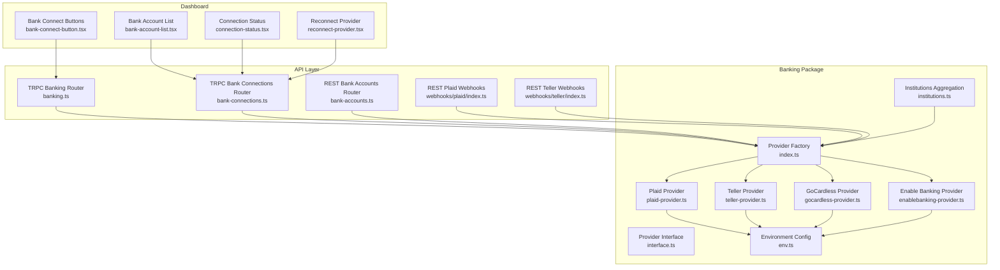

**Diagram sources**
- [index.ts](file://midday/packages/banking/src/index.ts#L1-L157)
- [interface.ts](file://midday/packages/banking/src/interface.ts#L1-L34)
- [env.ts](file://midday/packages/banking/src/env.ts#L1-L24)
- [institutions.ts](file://midday/packages/banking/src/institutions.ts#L1-L196)
- [plaid-provider.ts](file://midday/packages/banking/src/providers/plaid/plaid-provider.ts#L1-L125)
- [teller-provider.ts](file://midday/packages/banking/src/providers/teller/teller-provider.ts#L1-L120)
- [gocardless-provider.ts](file://midday/packages/banking/src/providers/gocardless/gocardless-provider.ts#L1-L113)
- [enablebanking-provider.ts](file://midday/packages/banking/src/providers/enablebanking/enablebanking-provider.ts#L1-L91)
- [bank-connections.ts](file://midday/apps/api/src/trpc/routers/bank-connections.ts)
- [banking.ts](file://midday/apps/api/src/trpc/routers/banking.ts)
- [bank-accounts.ts](file://midday/apps/api/src/rest/routers/bank-accounts.ts)
- [plaid webhook router](file://midday/apps/api/src/rest/routers/webhooks/plaid/index.ts)
- [teller webhook router](file://midday/apps/api/src/rest/routers/webhooks/teller/index.ts)

**Section sources**
- [index.ts](file://midday/packages/banking/src/index.ts#L1-L157)
- [interface.ts](file://midday/packages/banking/src/interface.ts#L1-L34)
- [env.ts](file://midday/packages/banking/src/env.ts#L1-L24)
- [institutions.ts](file://midday/packages/banking/src/institutions.ts#L1-L196)

## Core Components
- Provider factory and interface: A unified entry point selects a provider implementation and delegates operations such as fetching transactions, accounts, balances, institutions, and connection status. Health checks are executed concurrently across providers.
- Provider implementations: Each provider encapsulates API calls and transformations for Plaid, Teller, GoCardless, and Enable Banking.
- Environment configuration: Provider credentials and external service endpoints are loaded from environment variables.
- Institutions aggregation: Institutions are fetched from all providers and normalized into a unified record set with provider metadata.
- Schemas: Strong typing for bank connections and accounts ensures consistent data structures across API boundaries.
- Webhooks: Dedicated routers validate and process asynchronous updates from Plaid and Teller.

**Section sources**
- [index.ts](file://midday/packages/banking/src/index.ts#L18-L136)
- [interface.ts](file://midday/packages/banking/src/interface.ts#L16-L33)
- [env.ts](file://midday/packages/banking/src/env.ts#L4-L23)
- [institutions.ts](file://midday/packages/banking/src/institutions.ts#L163-L195)
- [bank-connections.ts](file://midday/apps/api/src/schemas/bank-connections.ts#L7-L45)
- [bank-accounts.ts](file://midday/apps/api/src/schemas/bank-accounts.ts#L31-L83)

## Architecture Overview
Faworra abstracts provider differences behind a single Provider facade. The dashboard triggers connection flows, while the API orchestrates provider operations and persists normalized account data. Webhooks keep the system synchronized without polling.

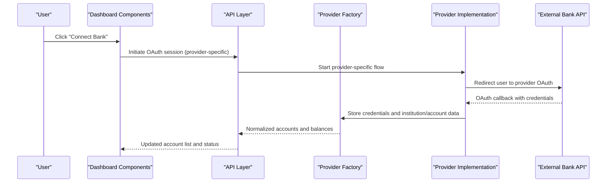

**Diagram sources**
- [index.ts](file://midday/packages/banking/src/index.ts#L27-L47)
- [plaid-provider.ts](file://midday/packages/banking/src/providers/plaid/plaid-provider.ts#L27-L49)
- [teller-provider.ts](file://midday/packages/banking/src/providers/teller/teller-provider.ts#L28-L49)
- [gocardless-provider.ts](file://midday/packages/banking/src/providers/gocardless/gocardless-provider.ts#L31-L47)
- [enablebanking-provider.ts](file://midday/packages/banking/src/providers/enablebanking/enablebanking-provider.ts#L34-L71)

## Detailed Component Analysis

### Provider Abstraction and Multi-Bank Support
The Provider class selects a concrete implementation based on a provider identifier and forwards operations. It supports health checks across all providers and delegates CRUD operations for accounts, balances, transactions, institutions, and connection status.

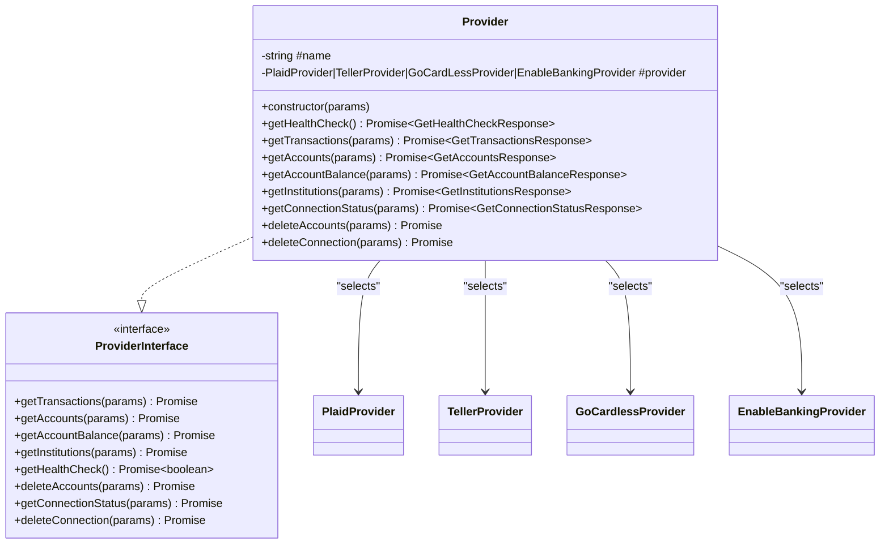

**Diagram sources**
- [index.ts](file://midday/packages/banking/src/index.ts#L18-L136)
- [interface.ts](file://midday/packages/banking/src/interface.ts#L16-L33)
- [plaid-provider.ts](file://midday/packages/banking/src/providers/plaid/plaid-provider.ts#L20-L124)
- [teller-provider.ts](file://midday/packages/banking/src/providers/teller/teller-provider.ts#L17-L119)
- [gocardless-provider.ts](file://midday/packages/banking/src/providers/gocardless/gocardless-provider.ts#L20-L112)
- [enablebanking-provider.ts](file://midday/packages/banking/src/providers/enablebanking/enablebanking-provider.ts#L23-L90)

**Section sources**
- [index.ts](file://midday/packages/banking/src/index.ts#L18-L136)
- [interface.ts](file://midday/packages/banking/src/interface.ts#L16-L33)

### Plaid Integration Setup and OAuth Flow
- OAuth initiation and credential exchange are handled by the Plaid provider implementation.
- Webhook verification uses Plaid’s public key retrieval and JWT validation to ensure authenticity.
- Transactions, accounts, balances, and institutions are fetched and transformed consistently.

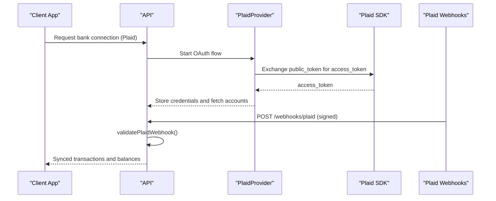

**Diagram sources**
- [plaid-provider.ts](file://midday/packages/banking/src/providers/plaid/plaid-provider.ts#L27-L49)
- [plaid.ts](file://midday/apps/api/src/utils/plaid.ts#L54-L121)
- [plaid webhook router](file://midday/apps/api/src/rest/routers/webhooks/plaid/index.ts)

**Section sources**
- [plaid-provider.ts](file://midday/packages/banking/src/providers/plaid/plaid-provider.ts#L27-L49)
- [plaid.ts](file://midday/apps/api/src/utils/plaid.ts#L54-L121)

### Teller API Connections and OAuth Flow
- Teller requires client certificates and signing secrets for secure communication and webhook verification.
- Account details (such as routing numbers) are retrieved after initial account discovery.
- Webhook verification validates the Teller-Signature header and timestamp.

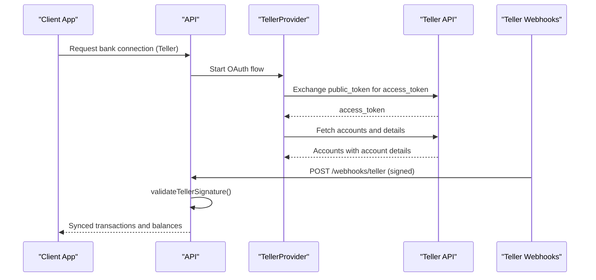

**Diagram sources**
- [teller-provider.ts](file://midday/packages/banking/src/providers/teller/teller-provider.ts#L52-L72)
- [teller.ts](file://midday/apps/api/src/utils/teller.ts#L4-L29)
- [teller webhook router](file://midday/apps/api/src/rest/routers/webhooks/teller/index.ts)

**Section sources**
- [teller-provider.ts](file://midday/packages/banking/src/providers/teller/teller-provider.ts#L52-L72)
- [teller.ts](file://midday/apps/api/src/utils/teller.ts#L4-L29)

### GoCardless and Enable Banking
- GoCardless uses requisitions and sessions to manage consent and account access.
- Enable Banking uses sessions and PSUs (Payment Services User) with optional business/personal types.
- Both providers expose health checks, institutions, accounts, balances, transactions, and connection status.

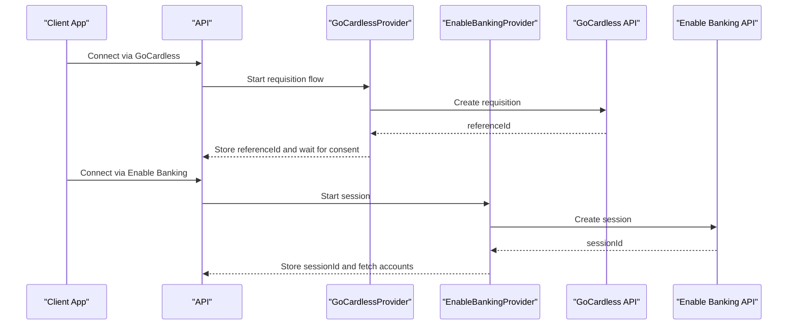

**Diagram sources**
- [gocardless-provider.ts](file://midday/packages/banking/src/providers/gocardless/gocardless-provider.ts#L31-L103)
- [enablebanking-provider.ts](file://midday/packages/banking/src/providers/enablebanking/enablebanking-provider.ts#L34-L81)

**Section sources**
- [gocardless-provider.ts](file://midday/packages/banking/src/providers/gocardless/gocardless-provider.ts#L31-L103)
- [enablebanking-provider.ts](file://midday/packages/banking/src/providers/enablebanking/enablebanking-provider.ts#L34-L81)

### Account Discovery and Credential Storage
- The API schemas define the structure for storing bank connections and accounts, including provider-specific identifiers, account numbers, balances, and metadata.
- The dashboard components render account lists, statuses, and reconnect options.

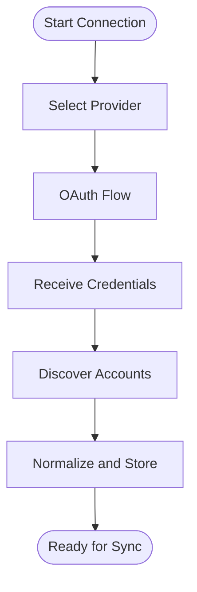

**Diagram sources**
- [bank-connections.ts](file://midday/apps/api/src/schemas/bank-connections.ts#L7-L45)
- [bank-accounts.ts](file://midday/apps/api/src/schemas/bank-accounts.ts#L31-L83)
- [bank-account-list.tsx](file://midday/apps/dashboard/src/components/bank-account-list.tsx)
- [bank-connections.tsx](file://midday/apps/dashboard/src/components/bank-connections.tsx)

**Section sources**
- [bank-connections.ts](file://midday/apps/api/src/schemas/bank-connections.ts#L7-L45)
- [bank-accounts.ts](file://midday/apps/api/src/schemas/bank-accounts.ts#L31-L83)
- [bank-account-list.tsx](file://midday/apps/dashboard/src/components/bank-account-list.tsx)
- [bank-connections.tsx](file://midday/apps/dashboard/src/components/bank-connections.tsx)

### Institution Catalog and Regional Compliance
- Institutions are aggregated from all providers with provider-specific metadata, including available history and consent validity where applicable.
- Logo URLs are normalized and can fall back to external services when provider logos are unavailable.

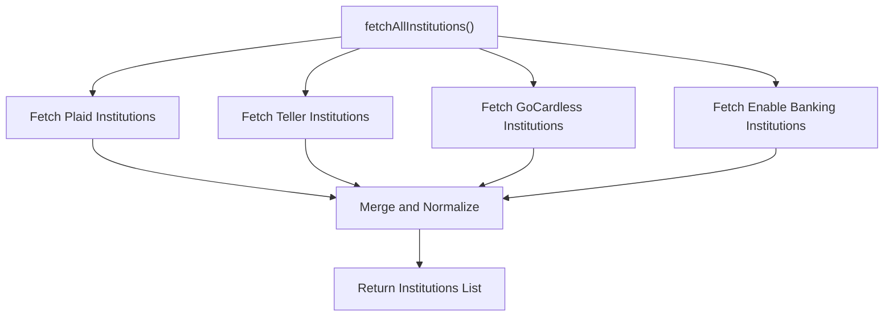

**Diagram sources**
- [institutions.ts](file://midday/packages/banking/src/institutions.ts#L163-L195)

**Section sources**
- [institutions.ts](file://midday/packages/banking/src/institutions.ts#L102-L156)

### Connection Status Monitoring
- Each provider exposes a getConnectionStatus method returning normalized status information.
- The dashboard displays connection status and offers reconnect actions.

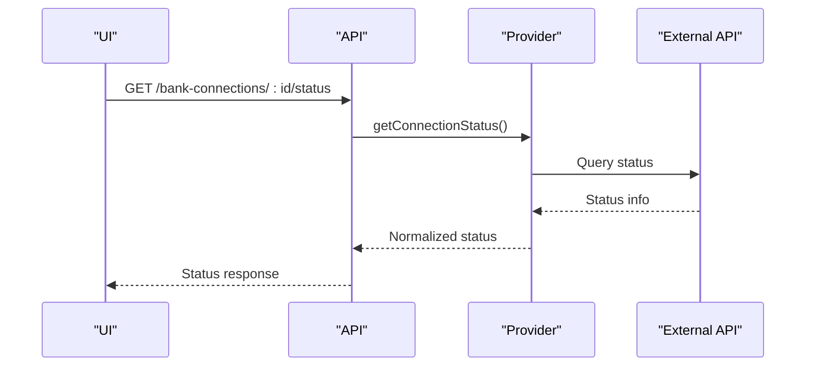

**Diagram sources**
- [plaid-provider.ts](file://midday/packages/banking/src/providers/plaid/plaid-provider.ts#L107-L115)
- [teller-provider.ts](file://midday/packages/banking/src/providers/teller/teller-provider.ts#L102-L110)
- [gocardless-provider.ts](file://midday/packages/banking/src/providers/gocardless/gocardless-provider.ts#L95-L103)
- [enablebanking-provider.ts](file://midday/packages/banking/src/providers/enablebanking/enablebanking-provider.ts#L73-L81)
- [connection-status.tsx](file://midday/apps/dashboard/src/components/connection-status.tsx)

**Section sources**
- [plaid-provider.ts](file://midday/packages/banking/src/providers/plaid/plaid-provider.ts#L107-L115)
- [teller-provider.ts](file://midday/packages/banking/src/providers/teller/teller-provider.ts#L102-L110)
- [gocardless-provider.ts](file://midday/packages/banking/src/providers/gocardless/gocardless-provider.ts#L95-L103)
- [enablebanking-provider.ts](file://midday/packages/banking/src/providers/enablebanking/enablebanking-provider.ts#L73-L81)
- [connection-status.tsx](file://midday/apps/dashboard/src/components/connection-status.tsx)

### Security Measures, PCI Compliance, and Data Encryption
- Webhook verification:
  - Plaid: Uses ES256 JWT verification with cached public keys and SHA-256 body hash validation.
  - Teller: Validates HMAC-SHA256 signatures with a timestamp window.
- Provider credentials are loaded from environment variables and not stored in code.
- Teller requires client certificate and signing secret for outbound requests and inbound webhooks.

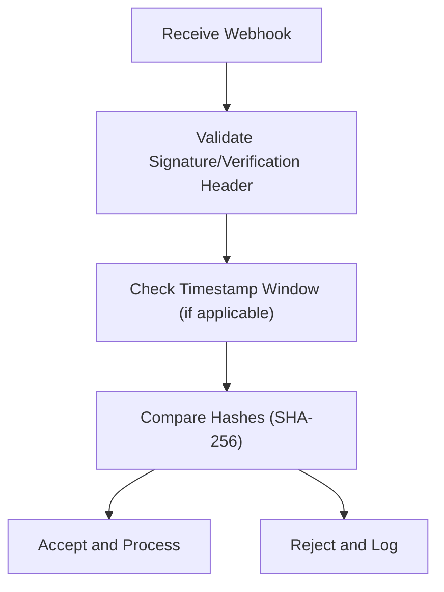

**Diagram sources**
- [plaid.ts](file://midday/apps/api/src/utils/plaid.ts#L54-L121)
- [teller.ts](file://midday/apps/api/src/utils/teller.ts#L4-L29)
- [env.ts](file://midday/packages/banking/src/env.ts#L4-L23)

**Section sources**
- [plaid.ts](file://midday/apps/api/src/utils/plaid.ts#L54-L121)
- [teller.ts](file://midday/apps/api/src/utils/teller.ts#L4-L29)
- [env.ts](file://midday/packages/banking/src/env.ts#L4-L23)

### Step-by-Step Bank Setup Guides

#### Plaid Setup
- Configure environment variables for Plaid client ID, secret, and environment.
- Trigger OAuth via the Plaid provider implementation.
- On success, store the access token and institution/account data.
- Subscribe to Plaid webhooks and validate using the provided verification utility.

**Section sources**
- [env.ts](file://midday/packages/banking/src/env.ts#L6-L8)
- [plaid-provider.ts](file://midday/packages/banking/src/providers/plaid/plaid-provider.ts#L27-L49)
- [plaid.ts](file://midday/apps/api/src/utils/plaid.ts#L54-L121)

#### Teller Setup
- Configure Teller certificate and key (base64), signing secret, and R2 storage credentials.
- Start OAuth with Teller; upon callback, persist access token and fetch accounts with details.
- Validate Teller webhooks using the signature utility.

**Section sources**
- [env.ts](file://midday/packages/banking/src/env.ts#L14-L20)
- [teller-provider.ts](file://midday/packages/banking/src/providers/teller/teller-provider.ts#L52-L72)
- [teller.ts](file://midday/apps/api/src/utils/teller.ts#L4-L29)

#### GoCardless Setup
- Configure GoCardless secret ID and key.
- Create a requisition and wait for user consent; store the reference ID.
- Use the reference ID to fetch accounts and monitor connection status.

**Section sources**
- [env.ts](file://midday/packages/banking/src/env.ts#L9-L10)
- [gocardless-provider.ts](file://midday/packages/banking/src/providers/gocardless/gocardless-provider.ts#L31-L103)

#### Enable Banking Setup
- Configure application ID, key content, and redirect URL.
- Create a session and handle the provider’s OAuth flow.
- Use the session ID to fetch accounts and monitor status.

**Section sources**
- [env.ts](file://midday/packages/banking/src/env.ts#L11-L13)
- [enablebanking-provider.ts](file://midday/packages/banking/src/providers/enablebanking/enablebanking-provider.ts#L34-L81)
- [enablebanking session route](file://midday/apps/dashboard/src/app/api/enablebanking/session/route.ts)

### API Configuration Examples
- Bank connections schema defines the structure for creating/updating connections and accounts.
- TRPC and REST routers expose endpoints for managing connections and accounts.

**Section sources**
- [bank-connections.ts](file://midday/apps/api/src/schemas/bank-connections.ts#L7-L45)
- [bank-accounts.ts](file://midday/apps/api/src/schemas/bank-accounts.ts#L31-L83)
- [bank-connections.ts](file://midday/apps/api/src/trpc/routers/bank-connections.ts)
- [bank-accounts.ts](file://midday/apps/api/src/rest/routers/bank-accounts.ts)

### Integration Best Practices
- Always validate webhooks before processing.
- Use provider-specific health checks to monitor availability.
- Normalize account data and store provider identifiers alongside metadata.
- Keep credentials in environment variables and rotate secrets regularly.
- Implement idempotent webhook handlers to avoid duplicate processing.

**Section sources**
- [index.ts](file://midday/packages/banking/src/index.ts#L50-L87)
- [plaid.ts](file://midday/apps/api/src/utils/plaid.ts#L54-L121)
- [teller.ts](file://midday/apps/api/src/utils/teller.ts#L4-L29)

## Dependency Analysis
The Provider factory depends on each provider implementation. Each provider depends on its respective API client and environment configuration. Webhook routers depend on provider abstractions to process updates.

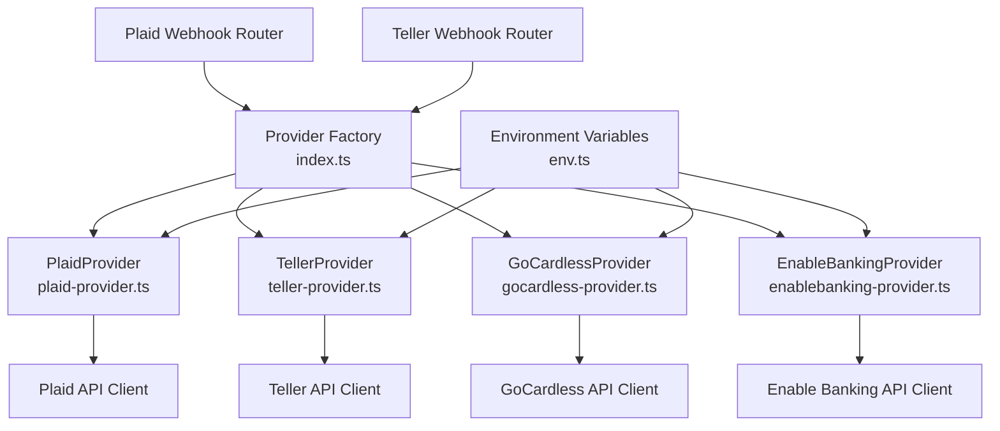

**Diagram sources**
- [index.ts](file://midday/packages/banking/src/index.ts#L27-L47)
- [plaid-provider.ts](file://midday/packages/banking/src/providers/plaid/plaid-provider.ts#L20-L25)
- [teller-provider.ts](file://midday/packages/banking/src/providers/teller/teller-provider.ts#L17-L22)
- [gocardless-provider.ts](file://midday/packages/banking/src/providers/gocardless/gocardless-provider.ts#L20-L25)
- [enablebanking-provider.ts](file://midday/packages/banking/src/providers/enablebanking/enablebanking-provider.ts#L23-L28)
- [env.ts](file://midday/packages/banking/src/env.ts#L4-L23)
- [plaid webhook router](file://midday/apps/api/src/rest/routers/webhooks/plaid/index.ts)
- [teller webhook router](file://midday/apps/api/src/rest/routers/webhooks/teller/index.ts)

**Section sources**
- [index.ts](file://midday/packages/banking/src/index.ts#L27-L47)
- [env.ts](file://midday/packages/banking/src/env.ts#L4-L23)

## Performance Considerations
- Concurrent health checks across providers reduce latency for availability monitoring.
- Institution fetching uses Promise.allSettled to continue even if one provider fails.
- Account details retrieval for Teller is parallelized per account to minimize delays.

**Section sources**
- [index.ts](file://midday/packages/banking/src/index.ts#L56-L67)
- [institutions.ts](file://midday/packages/banking/src/institutions.ts#L163-L195)
- [teller-provider.ts](file://midday/packages/banking/src/providers/teller/teller-provider.ts#L61-L69)

## Troubleshooting Guide
- Webhook validation failures:
  - For Plaid, ensure the verification header exists, the key is cached and unexpired, and the body hash matches.
  - For Teller, confirm the timestamp is recent and the signature matches the computed HMAC.
- Missing credentials:
  - Verify environment variables for each provider are set and correct.
- Connection status issues:
  - Use provider-specific status endpoints and inspect normalized responses.
- Reconnection procedures:
  - Use provider-specific flows to refresh credentials or sessions.
  - Consult the reconnect documentation for step-by-step guidance.

**Section sources**
- [plaid.ts](file://midday/apps/api/src/utils/plaid.ts#L54-L121)
- [teller.ts](file://midday/apps/api/src/utils/teller.ts#L4-L29)
- [env.ts](file://midday/packages/banking/src/env.ts#L4-L23)
- [bank-account-reconnect.md](file://midday/docs/bank-account-reconnect.md)

## Conclusion
Faworra’s banking abstraction provides a unified interface over multiple providers, enabling consistent account discovery, synchronization, and status monitoring. Robust webhook validation, environment-driven configuration, and provider-specific flows ensure secure and reliable bank connections. The dashboard components and API routers deliver a cohesive user and developer experience across multi-provider scenarios.

## Appendices

### Provider Capabilities Matrix
- Plaid: Transactions, Accounts, Balances, Institutions, Health, OAuth, Webhooks
- Teller: Transactions, Accounts, Balances, Institutions, Health, OAuth, Webhooks
- GoCardless: Transactions, Accounts, Balances, Institutions, Health, Sessions, Webhooks
- Enable Banking: Transactions, Accounts, Balances, Institutions, Health, Sessions, Webhooks

**Section sources**
- [plaid-provider.ts](file://midday/packages/banking/src/providers/plaid/plaid-provider.ts#L27-L115)
- [teller-provider.ts](file://midday/packages/banking/src/providers/teller/teller-provider.ts#L28-L110)
- [gocardless-provider.ts](file://midday/packages/banking/src/providers/gocardless/gocardless-provider.ts#L31-L111)
- [enablebanking-provider.ts](file://midday/packages/banking/src/providers/enablebanking/enablebanking-provider.ts#L34-L89)