# Banking Integration

<cite>
**Referenced Files in This Document**
- [index.ts](file://midday/packages/banking/src/index.ts)
- [interface.ts](file://midday/packages/banking/src/interface.ts)
- [plaid-provider.ts](file://midday/packages/banking/src/providers/plaid/plaid-provider.ts)
- [teller-provider.ts](file://midday/packages/banking/src/providers/teller/teller-provider.ts)
- [plaid-api.ts](file://midday/packages/banking/src/providers/plaid/plaid-api.ts)
- [teller-api.ts](file://midday/packages/banking/src/providers/teller/teller-api.ts)
- [transform.ts](file://midday/packages/banking/src/providers/plaid/transform.ts)
- [transform.ts](file://midday/packages/banking/src/providers/teller/transform.ts)
- [transactions.ts](file://midday/apps/api/src/schemas/transactions.ts)
- [bank-accounts.ts](file://midday/apps/api/src/schemas/bank-accounts.ts)
- [plaid.ts](file://midday/apps/api/src/utils/plaid.ts)
- [teller.ts](file://midday/apps/api/src/utils/teller.ts)
- [bank-accounts.ts](file://midday/apps/api/src/rest/routers/bank-accounts.ts)
- [bank-connections.ts](file://midday/apps/api/src/trpc/routers/bank-connections.ts)
- [banking.ts](file://midday/apps/api/src/trpc/routers/banking.ts)
- [transactions.ts](file://midday/apps/api/src/trpc/routers/transactions.ts)
- [enablebanking-api.ts](file://midday/packages/banking/src/providers/enablebanking/enablebanking-api.ts)
- [enablebanking-provider.ts](file://midday/packages/banking/src/providers/enablebanking/enablebanking-provider.ts)
- [gocardless-provider.ts](file://midday/packages/banking/src/providers/gocardless/gocardless-provider.ts)
- [gocardless-api.ts](file://midday/packages/banking/src/providers/gocardless/gocardless-api.ts)
- [institutions.ts](file://midday/packages/banking/src/institutions.ts)
- [types.ts](file://midday/packages/banking/src/types.ts)
- [route.ts](file://midday/apps/dashboard/src/app/api/enablebanking/session/route.ts)
- [bank-account.tsx](file://midday/apps/dashboard/src/components/bank-account.tsx)
- [bank-connections.tsx](file://midday/apps/dashboard/src/components/bank-connections.tsx)
- [bank-connect-button.tsx](file://midday/apps/dashboard/src/components/bank-connect-button.tsx)
- [reconnect-connection-action.ts](file://midday/apps/dashboard/src/actions/bank/reconnect-connection-action.ts)
- [manual-sync-transactions-action.ts](file://midday/apps/dashboard/src/actions/transactions/manual-sync-transactions-action.ts)
- [transaction-details.tsx](file://midday/apps/dashboard/src/components/transaction-details.tsx)
- [suggested-match.tsx](file://midday/apps/dashboard/src/components/suggested-match.tsx)
- [transaction-status.tsx](file://midday/apps/dashboard/src/components/transaction-status.tsx)
- [transaction-method.tsx](file://midday/apps/dashboard/src/components/transaction-method.tsx)
- [transaction-bank-account.tsx](file://midday/apps/dashboard/src/components/transaction-bank-account.tsx)
- [transaction-shortcuts.tsx](file://midday/apps/dashboard/src/components/transaction-shortcuts.tsx)
- [transaction-attachments.tsx](file://midday/apps/dashboard/src/components/transaction-attachments.tsx)
- [transaction-tabs.tsx](file://midday/apps/dashboard/src/components/transaction-tabs.tsx)
- [transactions-upload-zone.tsx](file://midday/apps/dashboard/src/components/transactions-upload-zone.tsx)
- [sync-transactions.tsx](file://midday/apps/dashboard/src/components/sync-transactions.tsx)
- [enablebanking-connect.tsx](file://midday/apps/dashboard/src/components/enablebanking-connect.tsx)
- [gocardless-connect.tsx](file://midday/apps/dashboard/src/components/gocardless-connect.tsx)
- [teller-connect.tsx](file://midday/apps/dashboard/src/components/teller-connect.tsx)
- [connect-bank-provider.tsx](file://midday/apps/dashboard/src/components/connect-bank-provider.tsx)
- [bank-account-list.tsx](file://midday/apps/dashboard/src/components/bank-account-list.tsx)
- [bank-search-content.tsx](file://midday/apps/dashboard/src/components/bank-search-content.tsx)
- [select-bank-accounts-content.tsx](file://midday/apps/dashboard/src/components/select-bank-accounts-content.tsx)
- [delete-account.tsx](file://midday/apps/dashboard/src/components/delete-account.tsx)
- [delete-connection.tsx](file://midday/apps/dashboard/src/components/delete-connection.tsx)
- [connection-status.tsx](file://midday/apps/dashboard/src/components/connection-status.tsx)
- [reconnect-provider.tsx](file://midday/apps/dashboard/src/components/reconnect-provider.tsx)
- [unified-app.tsx](file://midday/apps/dashboard/src/components/unified-app.tsx)
- [unified-app.tsx](file://midday/apps/dashboard/src/app/[locale]/unified-app.tsx)
- [unified-app.tsx](file://midday/apps/dashboard/src/app/api/unified-app.tsx)
- [unified-app.tsx](file://midday/apps/dashboard/src/app/api/unified-app.tsx)
- [unified-app.tsx](file://midday/apps/dashboard/src/app/api/unified-app.tsx)
- [unified-app.tsx](file://midday/apps/dashboard/src/app/api/unified-app.tsx)
- [unified-app.tsx](file://midday/apps/dashboard/src/app/api/unified-app.tsx)
- [unified-app.tsx](file://midday/apps/dashboard/src/app/api/unified-app.tsx)
- [unified-app.tsx](file://midday/apps/dashboard/src/app/api/unified-app.tsx)
- [unified-app.tsx](file://midday/apps/dashboard/src/app/api/unified-app.tsx)
- [unified-app.tsx](file://midday/apps/dashboard/src/app/api/unified-app.tsx)
- [unified-app.tsx](file://midday/apps/dashboard/src/app/api/unified-app.tsx)
- [unified-app.tsx](file://midday/apps/dashboard/src/app/api/unified-app.tsx)
- [unified-app.tsx](file://midday/apps/dashboard/src/app/api/unified-app.tsx)
- [unified-app.tsx](file://midday/apps/dashboard/src/app/api/unified-app.tsx)
- [unified-app.tsx](file://midday/apps/dashboard/src/app/api/unified-app.tsx)
- [unified-app.tsx](file://midday/apps/dashboard/src/app/api/unified-app.tsx)
- [unified-app.tsx](file://midday/apps/dashboard/src/app/api/unified-app.tsx)
- [unified-app.tsx](file://midday/apps/dashboard/src/app/api/unified-app.tsx)
- [unified-app.tsx](file://midday/apps/dashboard/src/app/api/unified-app.tsx)
- [unified-app.tsx](file://midday/apps/dashboard/src/app/api/unified-app.tsx)
- [unified-app.tsx](file://midday/apps/dashboard/src/app/api/unified-app.tsx)
- [unified-app.tsx](file://midday/apps/dashboard/src/app/api/unified-app.tsx)
- [unified-app.tsx](file://midday/apps/dashboard/src/app/api/unified-app.tsx)
- [unified-app......](file://midday/apps/dashboard/src/app/api/unified-app.tsx)
</cite>

## Table of Contents
1. [Introduction](#introduction)
2. [Project Structure](#project-structure)
3. [Core Components](#core-components)
4. [Architecture Overview](#architecture-overview)
5. [Detailed Component Analysis](#detailed-component-analysis)
6. [Dependency Analysis](#dependency-analysis)
7. [Performance Considerations](#performance-considerations)
8. [Security and Compliance](#security-and-compliance)
9. [Troubleshooting Guide](#troubleshooting-guide)
10. [Conclusion](#conclusion)
11. [Appendices](#appendices)

## Introduction
This document explains Faworra’s banking integration capabilities, focusing on bank connection setup via Plaid and Teller, account linking, and transaction import. It also covers automatic transaction categorization, merchant recognition, duplicate detection, reconciliation workflows, matching algorithms, manual adjustments, multi-account support, currency handling, scheduling and real-time updates, and security measures including PCI compliance and data protection.

## Project Structure
Faworra’s banking integration spans a dedicated banking package and API surfaces for providers, along with dashboard components for user-facing flows. The core structure includes:
- Provider abstraction and implementations for Plaid, Teller, GoCardless, and Enable Banking
- Transaction and bank account schemas and API routes
- Webhook validation utilities for Plaid and Teller
- Dashboard components for connecting banks, managing accounts, and reconciling transactions

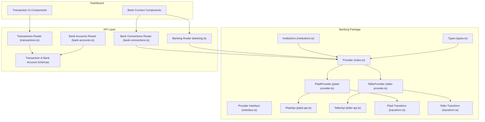

**Diagram sources**
- [index.ts](file://midday/packages/banking/src/index.ts#L1-L157)
- [interface.ts](file://midday/packages/banking/src/interface.ts#L1-L34)
- [plaid-provider.ts](file://midday/packages/banking/src/providers/plaid/plaid-provider.ts#L1-L125)
- [teller-provider.ts](file://midday/packages/banking/src/providers/teller/teller-provider.ts#L1-L120)
- [plaid-api.ts](file://midday/packages/banking/src/providers/plaid/plaid-api.ts)
- [teller-api.ts](file://midday/packages/banking/src/providers/teller/teller-api.ts)
- [transform.ts](file://midday/packages/banking/src/providers/plaid/transform.ts)
- [transform.ts](file://midday/packages/banking/src/providers/teller/transform.ts)
- [transactions.ts](file://midday/apps/api/src/trpc/routers/transactions.ts)
- [bank-accounts.ts](file://midday/apps/api/src/trpc/routers/bank-accounts.ts)
- [bank-connections.ts](file://midday/apps/api/src/trpc/routers/bank-connections.ts)
- [banking.ts](file://midday/apps/api/src/trpc/routers/banking.ts)
- [transactions.ts](file://midday/apps/api/src/schemas/transactions.ts#L1-L938)
- [bank-accounts.ts](file://midday/apps/api/src/schemas/bank-accounts.ts#L1-L193)

**Section sources**
- [index.ts](file://midday/packages/banking/src/index.ts#L1-L157)
- [interface.ts](file://midday/packages/banking/src/interface.ts#L1-L34)
- [plaid-provider.ts](file://midday/packages/banking/src/providers/plaid/plaid-provider.ts#L1-L125)
- [teller-provider.ts](file://midday/packages/banking/src/providers/teller/teller-provider.ts#L1-L120)
- [transactions.ts](file://midday/apps/api/src/schemas/transactions.ts#L1-L938)
- [bank-accounts.ts](file://midday/apps/api/src/schemas/bank-accounts.ts#L1-L193)

## Core Components
- Provider abstraction: A factory that selects and instantiates a provider implementation based on configuration, exposing unified methods for transactions, accounts, balances, institutions, health checks, and connection lifecycle.
- Provider interface: Defines the contract for provider implementations, ensuring consistent method signatures across providers.
- Plaid and Teller providers: Implementations that call provider-specific APIs, transform responses, and handle provider-specific behaviors (e.g., account details fetching for Teller).
- Transaction and bank account schemas: Strongly typed request/response schemas for CRUD operations, filtering, and pagination.
- Webhook validation utilities: Secure verification of incoming webhooks from Plaid and Teller using cryptographic signatures and timestamps.

Key responsibilities:
- Unified provider selection and orchestration
- Provider-specific API calls and transformations
- Schema-driven request validation and response modeling
- Secure webhook handling for real-time updates

**Section sources**
- [index.ts](file://midday/packages/banking/src/index.ts#L18-L136)
- [interface.ts](file://midday/packages/banking/src/interface.ts#L16-L33)
- [plaid-provider.ts](file://midday/packages/banking/src/providers/plaid/plaid-provider.ts#L20-L124)
- [teller-provider.ts](file://midday/packages/banking/src/providers/teller/teller-provider.ts#L17-L119)
- [transactions.ts](file://midday/apps/api/src/schemas/transactions.ts#L1-L938)
- [bank-accounts.ts](file://midday/apps/api/src/schemas/bank-accounts.ts#L1-L193)
- [plaid.ts](file://midday/apps/api/src/utils/plaid.ts#L54-L121)
- [teller.ts](file://midday/apps/api/src/utils/teller.ts#L4-L29)

## Architecture Overview
The banking integration follows a layered architecture:
- Provider abstraction layer selects and delegates to concrete provider implementations
- Provider implementations encapsulate API clients and response transformations
- API routers expose endpoints for bank connections, accounts, and transactions
- Dashboard components provide user workflows for connecting banks, selecting accounts, and reconciling transactions
- Webhooks enable real-time updates after successful bank connections

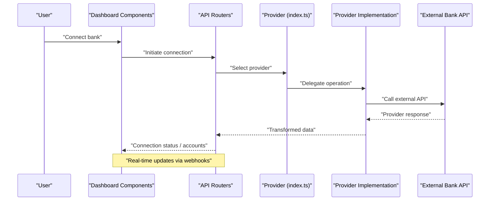

**Diagram sources**
- [index.ts](file://midday/packages/banking/src/index.ts#L27-L47)
- [plaid-provider.ts](file://midday/packages/banking/src/providers/plaid/plaid-provider.ts#L27-L49)
- [teller-provider.ts](file://midday/packages/banking/src/providers/teller/teller-provider.ts#L28-L49)
- [bank-connections.ts](file://midday/apps/api/src/trpc/routers/bank-connections.ts)
- [banking.ts](file://midday/apps/api/src/trpc/routers/banking.ts)

## Detailed Component Analysis

### Provider Abstraction and Selection
The Provider class acts as a factory and dispatcher, instantiating the appropriate provider based on configuration and delegating operations while logging context.

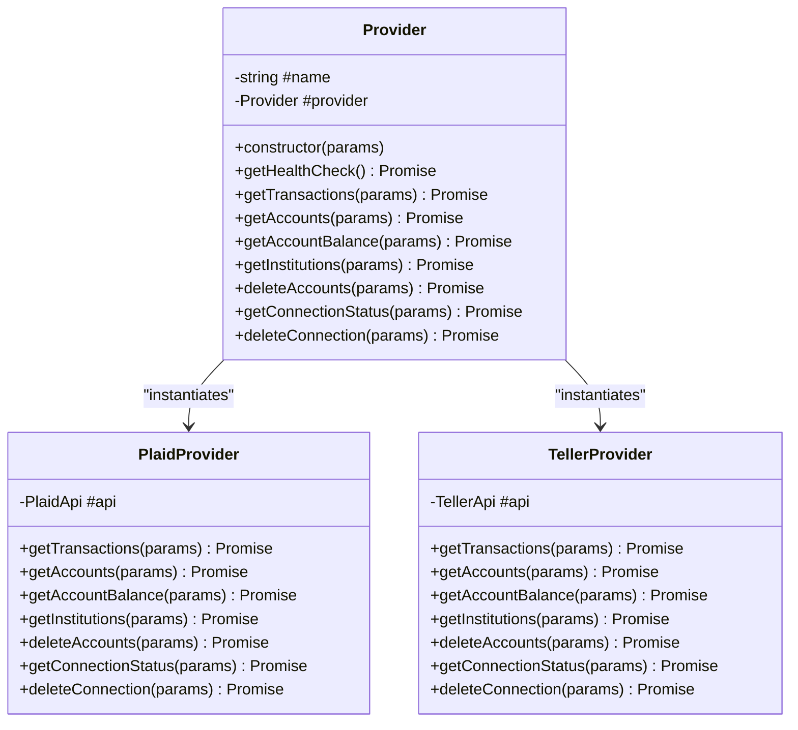

**Diagram sources**
- [index.ts](file://midday/packages/banking/src/index.ts#L18-L136)
- [plaid-provider.ts](file://midday/packages/banking/src/providers/plaid/plaid-provider.ts#L20-L124)
- [teller-provider.ts](file://midday/packages/banking/src/providers/teller/teller-provider.ts#L17-L119)

**Section sources**
- [index.ts](file://midday/packages/banking/src/index.ts#L18-L136)
- [interface.ts](file://midday/packages/banking/src/interface.ts#L16-L33)

### Plaid Integration
PlaidProvider orchestrates transactions, accounts, balances, institutions, and connection lifecycle. It validates required parameters and transforms provider responses into normalized structures.

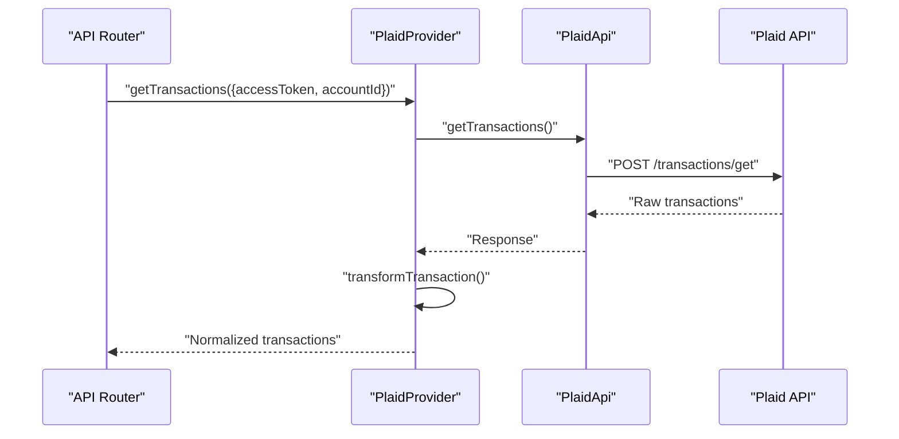

**Diagram sources**
- [plaid-provider.ts](file://midday/packages/banking/src/providers/plaid/plaid-provider.ts#L27-L49)
- [plaid-api.ts](file://midday/packages/banking/src/providers/plaid/plaid-api.ts)
- [transform.ts](file://midday/packages/banking/src/providers/plaid/transform.ts)

**Section sources**
- [plaid-provider.ts](file://midday/packages/banking/src/providers/plaid/plaid-provider.ts#L20-L124)
- [transform.ts](file://midday/packages/banking/src/providers/plaid/transform.ts)

### Teller Integration
TellerProvider mirrors PlaidProvider’s pattern, with additional steps to enrich accounts with details and lightweight balance retrieval via transaction running balances.

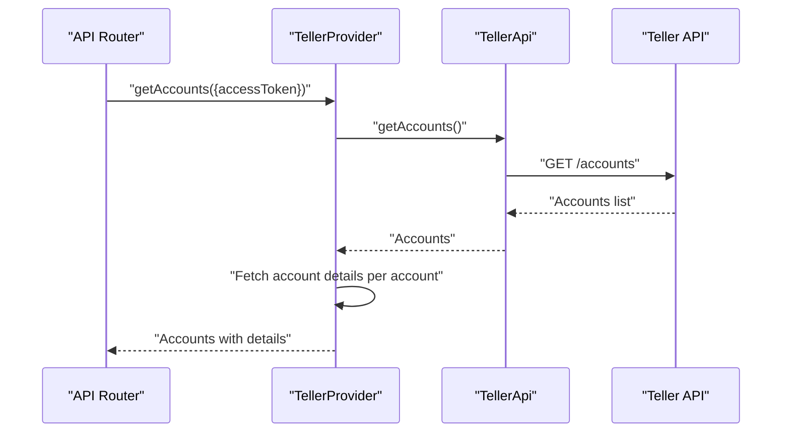

**Diagram sources**
- [teller-provider.ts](file://midday/packages/banking/src/providers/teller/teller-provider.ts#L52-L72)
- [teller-api.ts](file://midday/packages/banking/src/providers/teller/teller-api.ts)

**Section sources**
- [teller-provider.ts](file://midday/packages/banking/src/providers/teller/teller-provider.ts#L17-L119)

### Transaction Import and Normalization
Transactions are returned with standardized fields including amount, currency, date, counterparty, category, tags, attachments, and status. Filtering supports pagination, sorting, date ranges, categories, tags, and more.

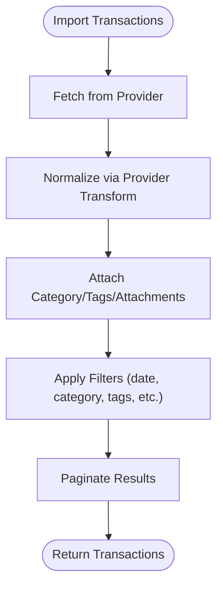

**Diagram sources**
- [plaid-provider.ts](file://midday/packages/banking/src/providers/plaid/plaid-provider.ts#L43-L48)
- [teller-provider.ts](file://midday/packages/banking/src/providers/teller/teller-provider.ts#L44-L49)
- [transactions.ts](file://midday/apps/api/src/schemas/transactions.ts#L3-L243)

**Section sources**
- [transactions.ts](file://midday/apps/api/src/schemas/transactions.ts#L245-L479)

### Bank Account Management and Multi-Account Support
Bank accounts are modeled with identifiers, names, currencies, types, enabled flags, and optional manual indicators. Multi-account support is reflected in transaction queries and reconciliation views.

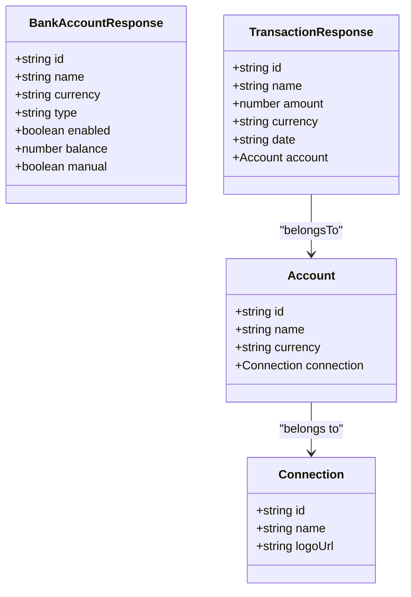

**Diagram sources**
- [bank-accounts.ts](file://midday/apps/api/src/schemas/bank-accounts.ts#L31-L83)
- [transactions.ts](file://midday/apps/api/src/schemas/transactions.ts#L354-L405)

**Section sources**
- [bank-accounts.ts](file://midday/apps/api/src/schemas/bank-accounts.ts#L1-L193)
- [transactions.ts](file://midday/apps/api/src/schemas/transactions.ts#L245-L479)

### Automatic Categorization, Merchant Recognition, and Duplicate Detection
- Automatic categorization: Transactions include a category field with id, name, color, tax rate/type, and slug, enabling automated assignment and UI rendering.
- Merchant recognition: Counterparty name and transaction name fields support merchant identification and matching.
- Duplicate detection: UI and backend support duplicate detection and suggested matches, with confidence thresholds and exclusion options.

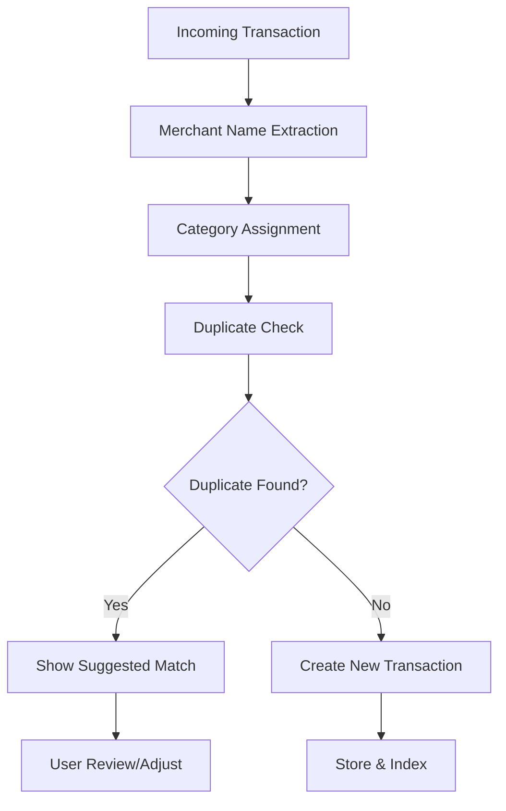

**Diagram sources**
- [transactions.ts](file://midday/apps/api/src/schemas/transactions.ts#L283-L323)
- [transactions.ts](file://midday/apps/api/src/schemas/transactions.ts#L669-L746)
- [suggested-match.tsx](file://midday/apps/dashboard/src/components/suggested-match.tsx)

**Section sources**
- [transactions.ts](file://midday/apps/api/src/schemas/transactions.ts#L283-L323)
- [transactions.ts](file://midday/apps/api/src/schemas/transactions.ts#L669-L746)

### Reconciliation Workflow and Matching Algorithms
Reconciliation combines imported transactions with existing records using:
- Name-based similarity and optional category/frequency filters
- Confidence scoring for suggestions
- Manual overrides and status transitions (e.g., pending, completed, excluded, exported)

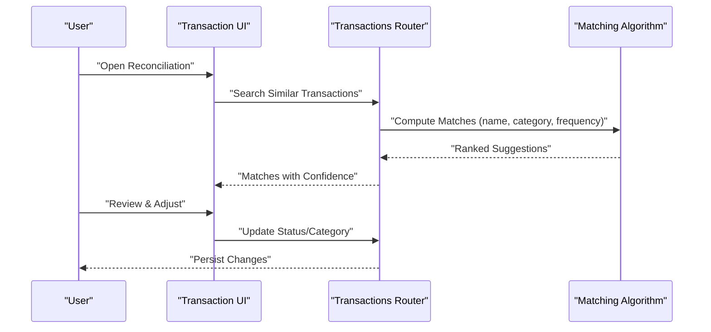

**Diagram sources**
- [transactions.ts](file://midday/apps/api/src/schemas/transactions.ts#L669-L746)
- [transaction-details.tsx](file://midday/apps/dashboard/src/components/transaction-details.tsx)
- [transaction-status.tsx](file://midday/apps/dashboard/src/components/transaction-status.tsx)

**Section sources**
- [transactions.ts](file://midday/apps/api/src/schemas/transactions.ts#L669-L746)

### Real-Time Updates and Webhook Validation
- Plaid webhooks: Verified using ES256 JWT with kid lookup, JWK caching, and SHA-256 body hash comparison.
- Teller webhooks: Verified using HMAC-SHA256 with timestamp freshness and signing secret.

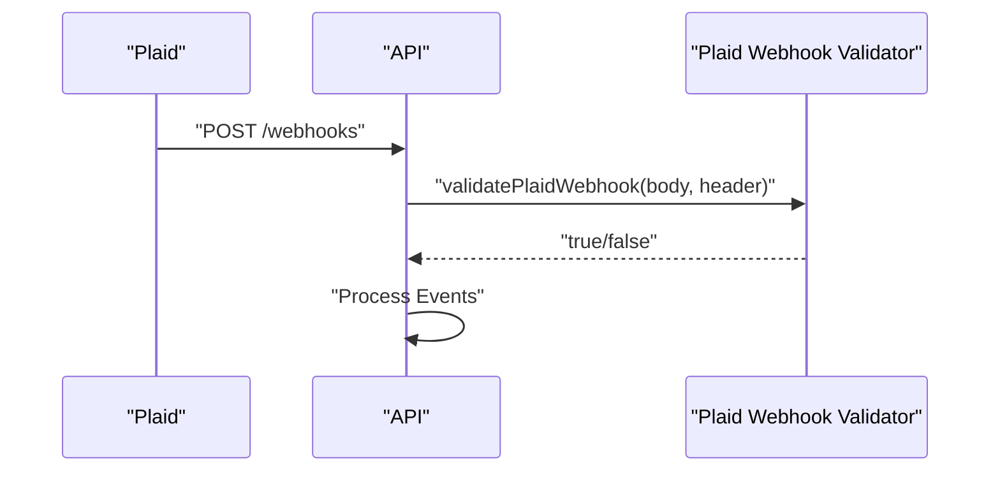

**Diagram sources**
- [plaid.ts](file://midday/apps/api/src/utils/plaid.ts#L54-L121)
- [teller.ts](file://midday/apps/api/src/utils/teller.ts#L4-L29)

**Section sources**
- [plaid.ts](file://midday/apps/api/src/utils/plaid.ts#L1-L122)
- [teller.ts](file://midday/apps/api/src/utils/teller.ts#L1-L53)

### Bank Connection Setup and Dashboard Components
- Provider selection and connection initiation
- Institution search and account selection
- Connection status monitoring and reconnection flows
- Manual transaction sync and upload capabilities

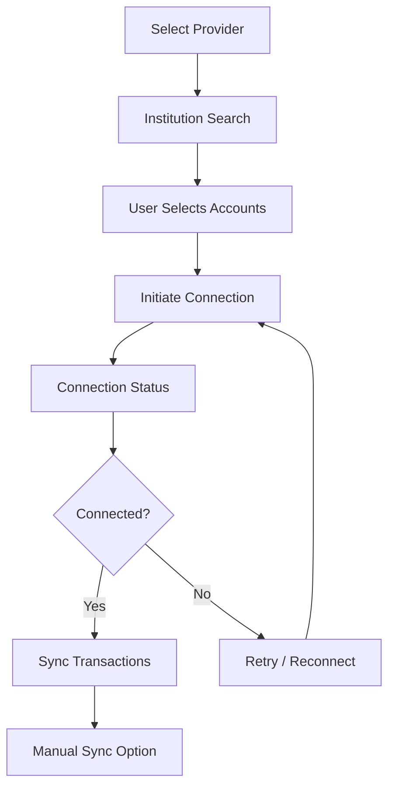

**Diagram sources**
- [bank-connect-button.tsx](file://midday/apps/dashboard/src/components/bank-connect-button.tsx)
- [bank-connections.tsx](file://midday/apps/dashboard/src/components/bank-connections.tsx)
- [bank-account-list.tsx](file://midday/apps/dashboard/src/components/bank-account-list.tsx)
- [reconnect-connection-action.ts](file://midday/apps/dashboard/src/actions/bank/reconnect-connection-action.ts)
- [manual-sync-transactions-action.ts](file://midday/apps/dashboard/src/actions/transactions/manual-sync-transactions-action.ts)

**Section sources**
- [bank-connect-button.tsx](file://midday/apps/dashboard/src/components/bank-connect-button.tsx)
- [bank-connections.tsx](file://midday/apps/dashboard/src/components/bank-connections.tsx)
- [bank-account-list.tsx](file://midday/apps/dashboard/src/components/bank-account-list.tsx)
- [reconnect-connection-action.ts](file://midday/apps/dashboard/src/actions/bank/reconnect-connection-action.ts)
- [manual-sync-transactions-action.ts](file://midday/apps/dashboard/src/actions/transactions/manual-sync-transactions-action.ts)

## Dependency Analysis
The banking package depends on provider-specific APIs and shared transformation utilities. The API layer depends on schemas and router implementations. Dashboard components depend on API routers and UI components.

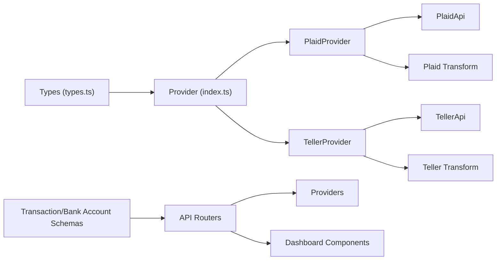

**Diagram sources**
- [types.ts](file://midday/packages/banking/src/types.ts)
- [index.ts](file://midday/packages/banking/src/index.ts#L1-L157)
- [plaid-provider.ts](file://midday/packages/banking/src/providers/plaid/plaid-provider.ts#L1-L125)
- [teller-provider.ts](file://midday/packages/banking/src/providers/teller/teller-provider.ts#L1-L120)
- [transactions.ts](file://midday/apps/api/src/schemas/transactions.ts#L1-L938)
- [bank-accounts.ts](file://midday/apps/api/src/schemas/bank-accounts.ts#L1-L193)

**Section sources**
- [index.ts](file://midday/packages/banking/src/index.ts#L1-L157)
- [plaid-provider.ts](file://midday/packages/banking/src/providers/plaid/plaid-provider.ts#L1-L125)
- [teller-provider.ts](file://midday/packages/banking/src/providers/teller/teller-provider.ts#L1-L120)
- [transactions.ts](file://midday/apps/api/src/schemas/transactions.ts#L1-L938)
- [bank-accounts.ts](file://midday/apps/api/src/schemas/bank-accounts.ts#L1-L193)

## Performance Considerations
- Parallel health checks across providers to minimize latency during startup or monitoring.
- Batched account details fetching for Teller to reduce round trips.
- Efficient pagination and filtering to limit payload sizes for transaction lists.
- Caching of provider verification keys for Plaid webhooks to avoid repeated lookups.

[No sources needed since this section provides general guidance]

## Security and Compliance
- Webhook verification:
  - Plaid: ES256 JWT verification with kid-based JWK lookup, caching, and SHA-256 body hash validation.
  - Teller: HMAC-SHA256 verification with timestamp freshness window.
- Environment configuration:
  - Provider credentials and secrets are loaded from environment variables.
- Data protection:
  - Provider responses are transformed and validated before persistence.
  - Sensitive fields are handled according to provider policies and local masking where applicable.

**Section sources**
- [plaid.ts](file://midday/apps/api/src/utils/plaid.ts#L54-L121)
- [teller.ts](file://midday/apps/api/src/utils/teller.ts#L4-L29)

## Troubleshooting Guide
Common issues and resolutions:
- Missing access tokens or account IDs: Ensure required parameters are provided before invoking provider methods.
- Connection failures:
  - Check provider health endpoints and logs.
  - Use reconnection flows and delete stale connections when necessary.
- Webhook validation failures:
  - Confirm headers and timestamps meet requirements.
  - Verify signing secrets and environment configuration.
- Transaction duplicates:
  - Review suggested matches and adjust categories/status accordingly.
- Manual sync:
  - Trigger manual synchronization when real-time updates are unavailable.

**Section sources**
- [plaid-provider.ts](file://midday/packages/banking/src/providers/plaid/plaid-provider.ts#L33-L35)
- [teller-provider.ts](file://midday/packages/banking/src/providers/teller/teller-provider.ts#L34-L36)
- [reconnect-connection-action.ts](file://midday/apps/dashboard/src/actions/bank/reconnect-connection-action.ts)
- [manual-sync-transactions-action.ts](file://midday/apps/dashboard/src/actions/transactions/manual-sync-transactions-action.ts)

## Conclusion
Faworra’s banking integration provides a robust, extensible framework for connecting multiple providers, importing and normalizing transactions, and supporting reconciliation workflows. With secure webhook handling, strong typing, and UI components for user management, the system enables reliable financial data ingestion and processing.

[No sources needed since this section summarizes without analyzing specific files]

## Appendices

### Examples

- Bank setup (Plaid/Teller):
  - Select provider, search institutions, choose accounts, initiate connection, monitor status, and trigger initial sync.
  - Reference: [bank-connect-button.tsx](file://midday/apps/dashboard/src/components/bank-connect-button.tsx), [bank-connections.tsx](file://midday/apps/dashboard/src/components/bank-connections.tsx), [bank-account-list.tsx](file://midday/apps/dashboard/src/components/bank-account-list.tsx)

- Transaction matching:
  - Use similarity search with optional category and frequency filters; apply confidence thresholds; adjust status and category.
  - Reference: [transactions.ts](file://midday/apps/api/src/schemas/transactions.ts#L669-L746), [suggested-match.tsx](file://midday/apps/dashboard/src/components/suggested-match.tsx)

- Reconciliation workflow:
  - Open reconciliation view, review suggested matches, update status and category, and persist changes.
  - Reference: [transaction-details.tsx](file://midday/apps/dashboard/src/components/transaction-details.tsx), [transaction-status.tsx](file://midday/apps/dashboard/src/components/transaction-status.tsx)

- Real-time updates:
  - Validate Plaid/Teller webhooks and process events to keep data current.
  - Reference: [plaid.ts](file://midday/apps/api/src/utils/plaid.ts#L54-L121), [teller.ts](file://midday/apps/api/src/utils/teller.ts#L4-L29)