# Reconciliation Workflow

<cite>
**Referenced Files in This Document**
- [index.ts](file://midday/packages/banking/src/index.ts)
- [banking.ts](file://midday/apps/api/src/schemas/banking.ts)
- [transactions.ts](file://midday/apps/api/src/schemas/transactions.ts)
- [banking.ts](file://midday/apps/api/src/trpc/routers/banking.ts)
- [transactions.ts](file://midday/apps/api/src/trpc/routers/transactions.ts)
- [use-review-transactions.ts](file://midday/apps/dashboard/src/hooks/use-review-transactions.ts)
- [manual-sync-transactions-action.ts](file://midday/apps/dashboard/src/actions/transactions/manual-sync-transactions-action.ts)
- [match-transaction.tsx](file://midday/apps/dashboard/src/components/inbox/match-transaction.tsx)
- [transaction-match-item.tsx](file://midday/apps/dashboard/src/components/inbox/transaction-match-item.tsx)
- [transaction-unmatch-item.tsx](file://midday/apps/dashboard/src/components/inbox/transaction-unmatch-item.tsx)
- [bulk-reconciliation-animation.tsx](file://midday/packages/ui/src/components/animations/bulk-reconciliation-animation.tsx)
- [reconciliation-step.tsx](file://midday/apps/dashboard/src/components/onboarding/steps/reconciliation-step.tsx)
</cite>

## Table of Contents
1. [Introduction](#introduction)
2. [Project Structure](#project-structure)
3. [Core Components](#core-components)
4. [Architecture Overview](#architecture-overview)
5. [Detailed Component Analysis](#detailed-component-analysis)
6. [Dependency Analysis](#dependency-analysis)
7. [Performance Considerations](#performance-considerations)
8. [Troubleshooting Guide](#troubleshooting-guide)
9. [Conclusion](#conclusion)
10. [Appendices](#appendices)

## Introduction
This document describes the bank reconciliation workflow in Faworra. It covers automatic matching, rule-based reconciliation, manual adjustments, the reconciliation interface, batch matching, conflict resolution, unmatched transaction handling, proposed matches, user approvals, reporting and audit trails, variance analysis, scheduling and periodic matching, historical reconciliation, best practices, common scenarios, troubleshooting, multi-account reconciliation, currency conversion, and performance optimization.

## Project Structure
The reconciliation workflow spans three layers:
- Banking provider abstraction and routing for bank connections and transactions
- Transactions API with reconciliation-related endpoints and jobs
- Dashboard UI for reviewing, matching, and approving transactions

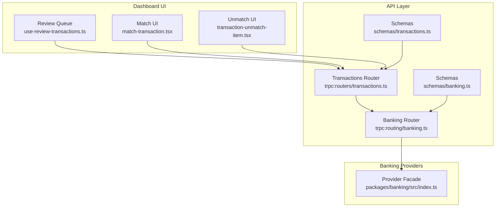

**Diagram sources**
- [banking.ts](file://midday/apps/api/src/trpc/routers/banking.ts#L35-L381)
- [transactions.ts](file://midday/apps/api/src/trpc/routers/transactions.ts#L54-L299)
- [banking.ts](file://midday/apps/api/src/schemas/banking.ts#L1-L92)
- [transactions.ts](file://midday/apps/api/src/schemas/transactions.ts#L1-L800)
- [index.ts](file://midday/packages/banking/src/index.ts#L1-L157)

**Section sources**
- [banking.ts](file://midday/apps/api/src/trpc/routers/banking.ts#L35-L381)
- [transactions.ts](file://midday/apps/api/src/trpc/routers/transactions.ts#L54-L299)
- [banking.ts](file://midday/apps/api/src/schemas/banking.ts#L1-L92)
- [transactions.ts](file://midday/apps/api/src/schemas/transactions.ts#L1-L800)
- [index.ts](file://midday/packages/banking/src/index.ts#L1-L157)

## Core Components
- Provider facade: central orchestration for Plaid, Teller, GoCardLess, and EnableBanking, exposing getTransactions, getAccounts, balances, institutions, health checks, and deletion operations.
- Banking router: exposes endpoints for provider links, connection status, account retrieval, balances, transaction retrieval, and exchange rates.
- Transactions router: exposes endpoints for listing, updating, searching matches, moving to review, exporting, importing, and CSV mapping generation.
- Dashboard hooks and UI: review queue hook, match/unmatch components, and onboarding steps for reconciliation.

Key reconciliation-relevant flows:
- Automatic matching via searchTransactionMatch and enrichment/matching jobs after creation
- Manual adjustments via update/updateMany and move-to-review
- Batch operations via updateMany and export jobs
- Currency conversion via rates endpoint and per-transaction currency fields

**Section sources**
- [index.ts](file://midday/packages/banking/src/index.ts#L18-L136)
- [banking.ts](file://midday/apps/api/src/trpc/routers/banking.ts#L35-L381)
- [transactions.ts](file://midday/apps/api/src/trpc/routers/transactions.ts#L54-L299)
- [use-review-transactions.ts](file://midday/apps/dashboard/src/hooks/use-review-transactions.ts#L10-L39)
- [transactions.ts](file://midday/apps/api/src/schemas/transactions.ts#L699-L746)

## Architecture Overview
The reconciliation pipeline integrates bank providers, transaction processing, and UI review.

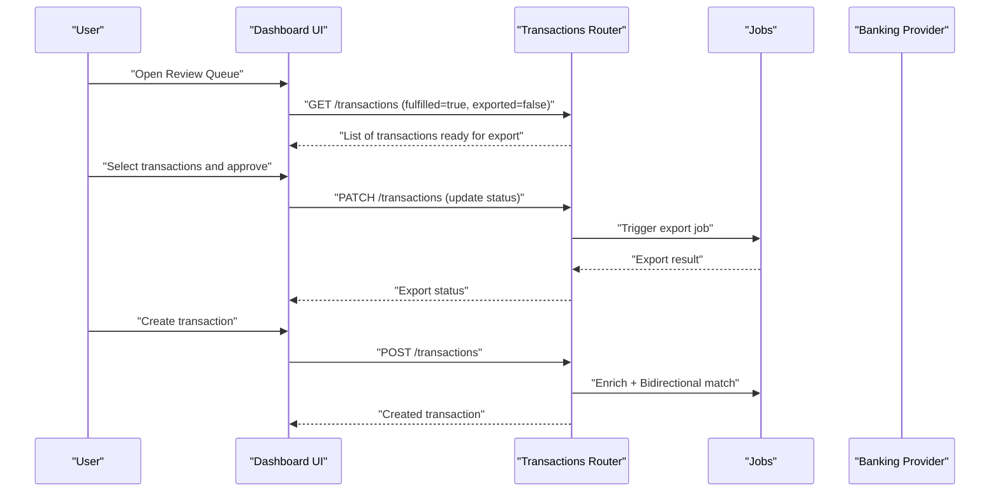

**Diagram sources**
- [transactions.ts](file://midday/apps/api/src/trpc/routers/transactions.ts#L55-L159)
- [transactions.ts](file://midday/apps/api/src/schemas/transactions.ts#L699-L746)
- [banking.ts](file://midday/apps/api/src/trpc/routers/banking.ts#L340-L363)

## Detailed Component Analysis

### Automatic Matching and Proposed Matches
Automatic matching is supported via a dedicated search endpoint and background jobs:
- searchTransactionMatch: queries potential matches with optional confidence thresholds and inclusion of already matched items.
- After creating a transaction, enrichment and bidirectional matching jobs are triggered to propose matches.
- Match UI components allow selecting proposed matches or unmatching conflicting matches.

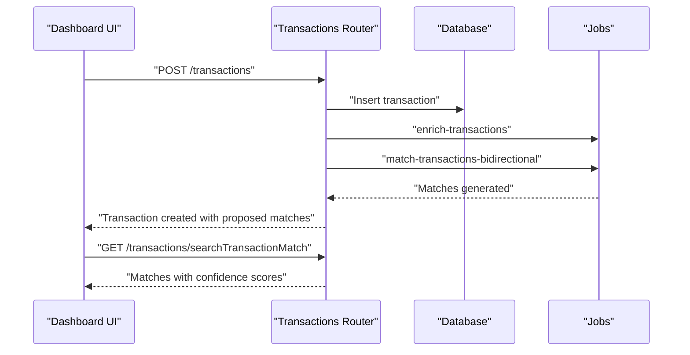

**Diagram sources**
- [transactions.ts](file://midday/apps/api/src/trpc/routers/transactions.ts#L130-L159)
- [transactions.ts](file://midday/apps/api/src/trpc/routers/transactions.ts#L117-L128)
- [transactions.ts](file://midday/apps/api/src/schemas/transactions.ts#L699-L746)

**Section sources**
- [transactions.ts](file://midday/apps/api/src/trpc/routers/transactions.ts#L117-L128)
- [transactions.ts](file://midday/apps/api/src/trpc/routers/transactions.ts#L130-L159)
- [transactions.ts](file://midday/apps/api/src/schemas/transactions.ts#L699-L746)
- [transaction-match-item.tsx](file://midday/apps/dashboard/src/components/inbox/transaction-match-item.tsx)
- [match-transaction.tsx](file://midday/apps/dashboard/src/components/inbox/match-transaction.tsx)

### Rule-Based Reconciliation
Rule-based reconciliation is implemented through:
- Filters and sorting in transaction listing to isolate transactions needing attention.
- Status updates to move transactions into review or mark as exported.
- Bulk editing to apply consistent rules across multiple transactions (category, status, frequency, internal flag, note, assigned user).

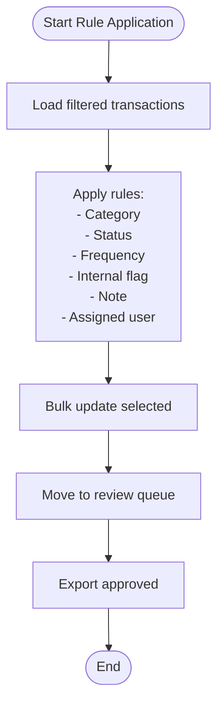

**Diagram sources**
- [transactions.ts](file://midday/apps/api/src/trpc/routers/transactions.ts#L95-L103)
- [transactions.ts](file://midday/apps/api/src/schemas/transactions.ts#L624-L667)

**Section sources**
- [transactions.ts](file://midday/apps/api/src/trpc/routers/transactions.ts#L95-L103)
- [transactions.ts](file://midday/apps/api/src/schemas/transactions.ts#L624-L667)

### Manual Adjustment Processes
Manual adjustments are performed via:
- Single transaction updates (name, amount, currency, date, bank account, category, status, internal, recurring, frequency, note, assigned user, tax fields).
- Bulk updates to apply the same adjustments across many transactions.
- Moving transactions to review to ensure they are fulfilled and not yet exported.

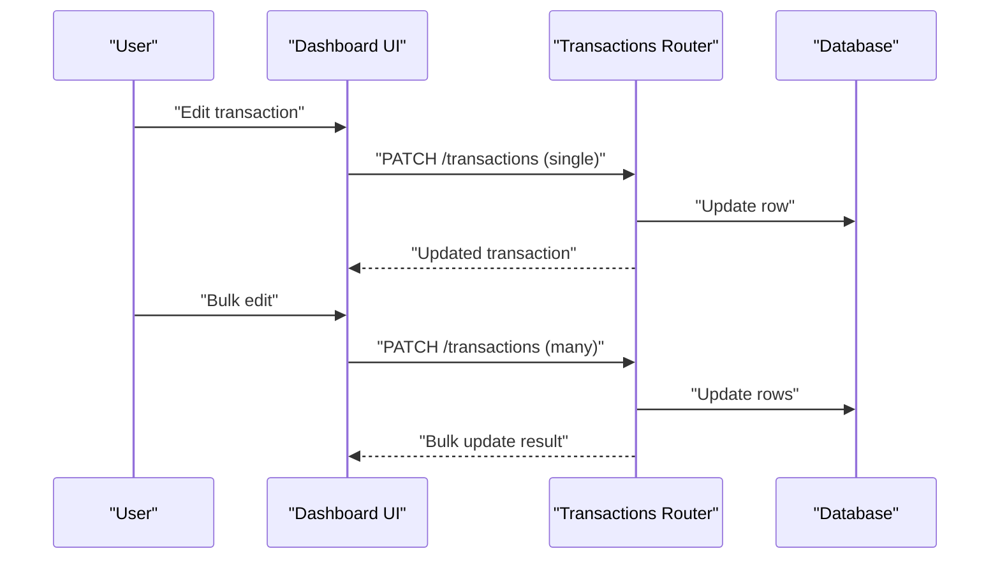

**Diagram sources**
- [transactions.ts](file://midday/apps/api/src/trpc/routers/transactions.ts#L85-L103)
- [transactions.ts](file://midday/apps/api/src/schemas/transactions.ts#L552-L622)

**Section sources**
- [transactions.ts](file://midday/apps/api/src/trpc/routers/transactions.ts#L85-L103)
- [transactions.ts](file://midday/apps/api/src/schemas/transactions.ts#L552-L622)

### Reconciliation Interface
The reconciliation interface includes:
- Review queue: a dedicated view of fulfilled but not exported transactions.
- Match/unmatch components: to propose and finalize matches.
- Onboarding step: guided setup for reconciliation.

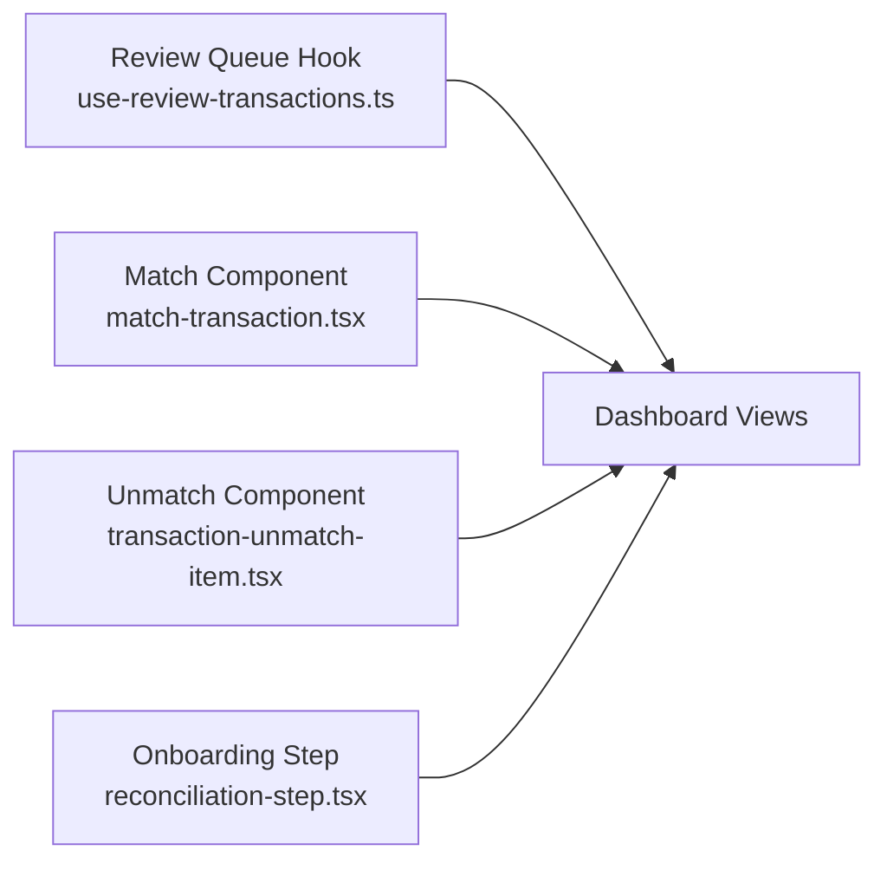

**Diagram sources**
- [use-review-transactions.ts](file://midday/apps/dashboard/src/hooks/use-review-transactions.ts#L10-L39)
- [match-transaction.tsx](file://midday/apps/dashboard/src/components/inbox/match-transaction.tsx)
- [transaction-unmatch-item.tsx](file://midday/apps/dashboard/src/components/inbox/transaction-unmatch-item.tsx)
- [reconciliation-step.tsx](file://midday/apps/dashboard/src/components/onboarding/steps/reconciliation-step.tsx)

**Section sources**
- [use-review-transactions.ts](file://midday/apps/dashboard/src/hooks/use-review-transactions.ts#L10-L39)
- [match-transaction.tsx](file://midday/apps/dashboard/src/components/inbox/match-transaction.tsx)
- [transaction-unmatch-item.tsx](file://midday/apps/dashboard/src/components/inbox/transaction-unmatch-item.tsx)
- [reconciliation-step.tsx](file://midday/apps/dashboard/src/components/onboarding/steps/reconciliation-step.tsx)

### Batch Matching Capabilities
Batch matching leverages:
- searchTransactionMatch to discover matches in bulk.
- updateMany to apply consistent changes across multiple transactions.
- Bulk reconciliation animation indicates progress.

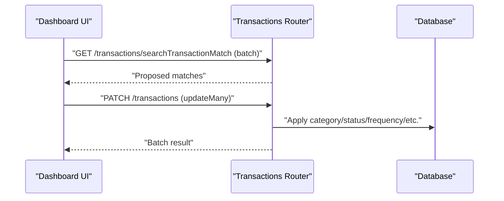

**Diagram sources**
- [transactions.ts](file://midday/apps/api/src/trpc/routers/transactions.ts#L117-L128)
- [transactions.ts](file://midday/apps/api/src/schemas/transactions.ts#L624-L667)
- [bulk-reconciliation-animation.tsx](file://midday/packages/ui/src/components/animations/bulk-reconciliation-animation.tsx)

**Section sources**
- [transactions.ts](file://midday/apps/api/src/trpc/routers/transactions.ts#L117-L128)
- [transactions.ts](file://midday/apps/api/src/schemas/transactions.ts#L624-L667)
- [bulk-reconciliation-animation.tsx](file://midday/packages/ui/src/components/animations/bulk-reconciliation-animation.tsx)

### Conflict Resolution Workflows
Conflict resolution is handled by:
- Unmatch component to remove conflicting matches.
- Review queue ensures only fulfilled, non-exported transactions are considered for export.
- Manual adjustments to override proposed matches.

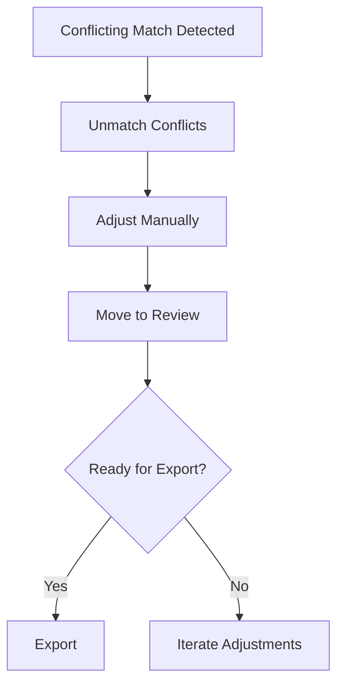

**Diagram sources**
- [transaction-unmatch-item.tsx](file://midday/apps/dashboard/src/components/inbox/transaction-unmatch-item.tsx)
- [transactions.ts](file://midday/apps/api/src/trpc/routers/transactions.ts#L235-L248)
- [use-review-transactions.ts](file://midday/apps/dashboard/src/hooks/use-review-transactions.ts#L10-L39)

**Section sources**
- [transaction-unmatch-item.tsx](file://midday/apps/dashboard/src/components/inbox/transaction-unmatch-item.tsx)
- [transactions.ts](file://midday/apps/api/src/trpc/routers/transactions.ts#L235-L248)
- [use-review-transactions.ts](file://midday/apps/dashboard/src/hooks/use-review-transactions.ts#L10-L39)

### Unmatched Transaction Handling
Unmatched transactions are surfaced in:
- The review queue for manual reconciliation.
- Search endpoints to find similar or related entries.
- Onboarding guidance to help users reconcile unmatched items.

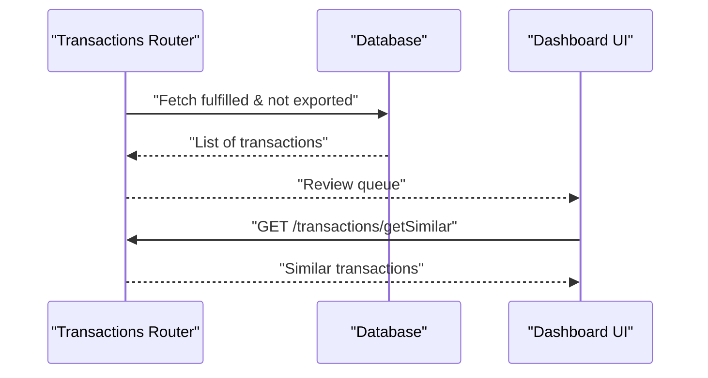

**Diagram sources**
- [transactions.ts](file://midday/apps/api/src/trpc/routers/transactions.ts#L81-L83)
- [transactions.ts](file://midday/apps/api/src/trpc/routers/transactions.ts#L105-L115)
- [use-review-transactions.ts](file://midday/apps/dashboard/src/hooks/use-review-transactions.ts#L10-L39)

**Section sources**
- [transactions.ts](file://midday/apps/api/src/trpc/routers/transactions.ts#L81-L83)
- [transactions.ts](file://midday/apps/api/src/trpc/routers/transactions.ts#L105-L115)
- [use-review-transactions.ts](file://midday/apps/dashboard/src/hooks/use-review-transactions.ts#L10-L39)

### Proposed Matches and User Approval
Proposed matches are generated automatically and presented to users:
- Enrichment and bidirectional matching jobs run after transaction creation.
- Users can approve matches via the match UI or unmatch conflicts.
- Approved transactions are moved to review and exported.

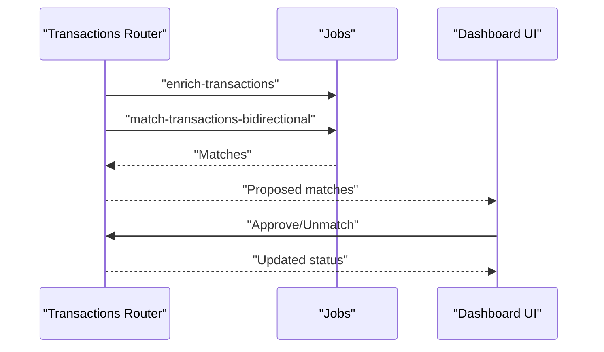

**Diagram sources**
- [transactions.ts](file://midday/apps/api/src/trpc/routers/transactions.ts#L139-L155)
- [match-transaction.tsx](file://midday/apps/dashboard/src/components/inbox/match-transaction.tsx)

**Section sources**
- [transactions.ts](file://midday/apps/api/src/trpc/routers/transactions.ts#L139-L155)
- [match-transaction.tsx](file://midday/apps/dashboard/src/components/inbox/match-transaction.tsx)

### Reconciliation Reporting, Audit Trails, and Variance Analysis
- Export endpoint triggers export jobs with locale, date format, and export settings.
- Audit trail: transaction updates include user and team context.
- Variance analysis: leverage filters and export settings to compare reconciled vs. unreconciled balances.

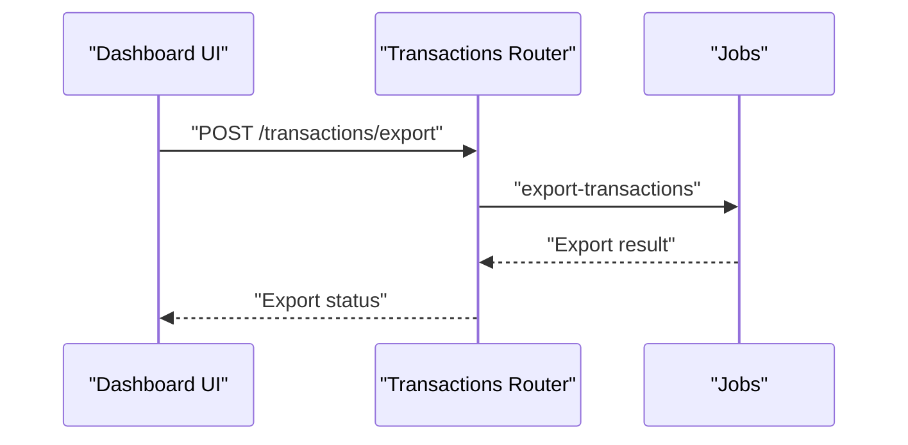

**Diagram sources**
- [transactions.ts](file://midday/apps/api/src/trpc/routers/transactions.ts#L161-L181)

**Section sources**
- [transactions.ts](file://midday/apps/api/src/trpc/routers/transactions.ts#L161-L181)

### Reconciliation Scheduling, Periodic Matching, and Historical Reconciliation
- Manual synchronization action triggers provider syncs for a given connection.
- Historical reconciliation: transactions router supports date-range filters and pagination for historical views.

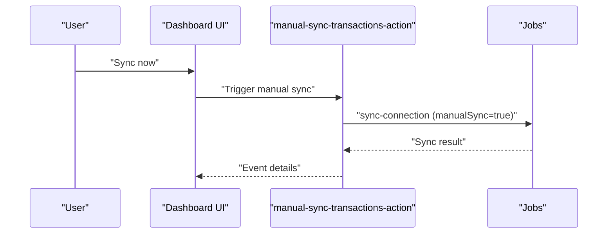

**Diagram sources**
- [manual-sync-transactions-action.ts](file://midday/apps/dashboard/src/actions/transactions/manual-sync-transactions-action.ts#L10-L44)

**Section sources**
- [manual-sync-transactions-action.ts](file://midday/apps/dashboard/src/actions/transactions/manual-sync-transactions-action.ts#L10-L44)
- [transactions.ts](file://midday/apps/api/src/schemas/transactions.ts#L78-L101)

### Multi-Account Reconciliation and Currency Conversion
- Multi-account: transactions are associated with bank accounts; filters support multi-account reconciliation.
- Currency conversion: rates endpoint provides exchange rates; transactions include currency fields.

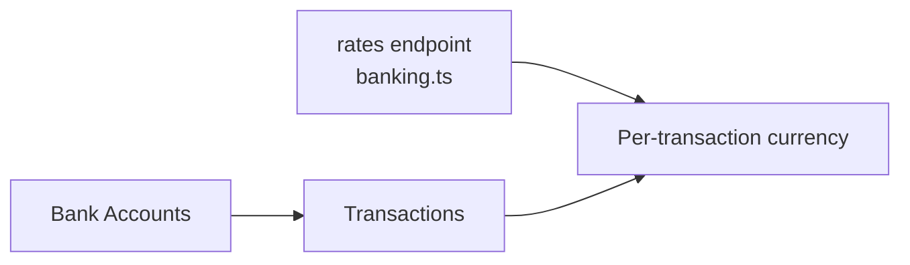

**Diagram sources**
- [banking.ts](file://midday/apps/api/src/trpc/routers/banking.ts#L365-L379)
- [transactions.ts](file://midday/apps/api/src/schemas/transactions.ts#L271-L274)
- [banking.ts](file://midday/apps/api/src/schemas/banking.ts#L77-L82)

**Section sources**
- [banking.ts](file://midday/apps/api/src/trpc/routers/banking.ts#L365-L379)
- [transactions.ts](file://midday/apps/api/src/schemas/transactions.ts#L271-L274)
- [banking.ts](file://midday/apps/api/src/schemas/banking.ts#L77-L82)

## Dependency Analysis
The reconciliation stack depends on:
- Provider facade for bank connectivity
- Transactions router for reconciliation operations
- Dashboard hooks/UI for user workflows
- Jobs for asynchronous enrichment and matching

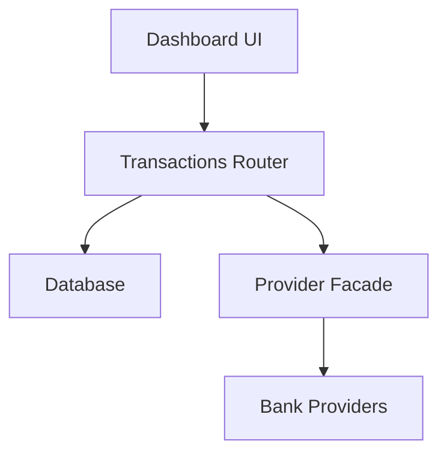

**Diagram sources**
- [index.ts](file://midday/packages/banking/src/index.ts#L18-L136)
- [transactions.ts](file://midday/apps/api/src/trpc/routers/transactions.ts#L54-L299)

**Section sources**
- [index.ts](file://midday/packages/banking/src/index.ts#L18-L136)
- [transactions.ts](file://midday/apps/api/src/trpc/routers/transactions.ts#L54-L299)

## Performance Considerations
- Use bulk operations (updateMany, searchTransactionMatch) to minimize round trips.
- Leverage pagination and filters to reduce payload sizes.
- Offload heavy operations (enrichment, matching, export) to jobs.
- Cache exchange rates and reuse computed mappings for CSV imports.

## Troubleshooting Guide
Common reconciliation issues and resolutions:
- Connection failures: verify provider credentials and connection status via banking router endpoints.
- Transactions not appearing: check filters (fulfilled/exported), date ranges, and account associations.
- Export errors: review export settings and locale/date format; re-run export job.
- Manual sync not working: confirm ownership of connection and trigger manual sync action again.

**Section sources**
- [banking.ts](file://midday/apps/api/src/trpc/routers/banking.ts#L213-L257)
- [transactions.ts](file://midday/apps/api/src/trpc/routers/transactions.ts#L161-L181)
- [manual-sync-transactions-action.ts](file://midday/apps/dashboard/src/actions/transactions/manual-sync-transactions-action.ts#L23-L44)

## Conclusion
Faworra’s reconciliation workflow combines robust provider integrations, automated matching, flexible rule-based adjustments, and a streamlined UI for review and approval. By leveraging batch operations, export jobs, and currency conversion utilities, teams can efficiently reconcile across multiple accounts and currencies while maintaining auditability and variance visibility.

## Appendices

### Best Practices
- Keep transactions fulfilled before export to ensure accurate reconciliation.
- Use category and frequency rules consistently across recurring items.
- Regularly reconcile recent periods and periodically review historical data.
- Utilize the review queue to drive reconciliation to closure.

### Common Scenarios
- New bank connection: sync connection, reconcile recent period, then schedule periodic runs.
- Monthly close: reconcile remaining unmatched, export, and archive.
- Multi-currency: convert using rates endpoint and reconcile per account currency.