# Security & Compliance

<cite>
**Referenced Files in This Document**
- [SECURITY.md](file://SECURITY.md)
- [encryption/index.ts](file://packages/encryption/src/index.ts)
- [auth.ts](file://apps/api/src/utils/auth.ts)
- [oauth.ts](file://apps/api/src/utils/oauth.ts)
- [middleware/index.ts](file://apps/api/src/rest/middleware/index.ts)
- [gocardless-api.ts](file://packages/banking/src/providers/gocardless/gocardless-api.ts)
- [banking-cache.ts](file://packages/cache/src/banking-cache.ts)
- [oauth-flow.ts](file://packages/db/src/queries/oauth-flow.ts)
- [schema.ts](file://packages/db/src/schema.ts)
- [users.ts](file://packages/db/src/queries/users.ts)
- [index.ts](file://packages/logger/src/index.ts)
- [golden-dataset.ts](file://packages/db/src/test/golden-dataset.ts)
- [footer.tsx](file://apps/website/src/components/footer.tsx)
- [page.tsx](file://apps/website/src/app/policy/page.tsx)
- [incident-report-for-june-22-2024.mdx](file://apps/website/src/app/updates/posts/incident-report-for-june-22-2024.mdx)
- [README.md](file://packages/banking/README.md)
</cite>

## Table of Contents
1. [Introduction](#introduction)
2. [Project Structure](#project-structure)
3. [Core Components](#core-components)
4. [Architecture Overview](#architecture-overview)
5. [Detailed Component Analysis](#detailed-component-analysis)
6. [Dependency Analysis](#dependency-analysis)
7. [Performance Considerations](#performance-considerations)
8. [Troubleshooting Guide](#troubleshooting-guide)
9. [Conclusion](#conclusion)
10. [Appendices](#appendices)

## Introduction
This document details Faworra’s (Midday) security and compliance posture with a focus on banking integrations, OAuth token lifecycle, encryption, logging, data handling, and incident response. It aligns implementation details with PCI DSS, SOC 2, GDPR, and CCPA expectations where applicable, and outlines operational controls for secure credential storage, token refresh, audit logging, data anonymization, consent management, data retention, deletion, monitoring, threat detection, and incident response.

## Project Structure
Security and compliance functionality spans several packages and apps:
- Encryption utilities for OAuth state protection and symmetric encryption
- API middleware for authentication, rate limiting, and access control
- OAuth utilities for client secret validation and token revocation
- Banking provider integration with token caching and refresh flows
- Database schema and queries supporting OAuth tokens, institutions, and user data
- Logging and auditing infrastructure
- Website privacy policy and compliance claims
- Incident reporting and security contact procedures

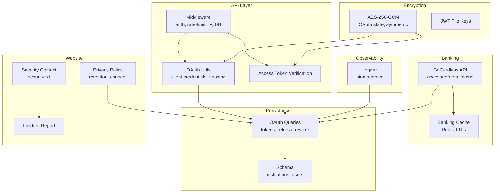

**Diagram sources**
- [middleware/index.ts](file://apps/api/src/rest/middleware/index.ts#L1-L45)
- [oauth.ts](file://apps/api/src/utils/oauth.ts#L1-L24)
- [auth.ts](file://apps/api/src/utils/auth.ts#L1-L44)
- [encryption/index.ts](file://packages/encryption/src/index.ts#L1-L220)
- [gocardless-api.ts](file://packages/banking/src/providers/gocardless/gocardless-api.ts#L42-L139)
- [banking-cache.ts](file://packages/cache/src/banking-cache.ts#L1-L34)
- [oauth-flow.ts](file://packages/db/src/queries/oauth-flow.ts#L287-L517)
- [schema.ts](file://packages/db/src/schema.ts#L1369-L1390)
- [index.ts](file://packages/logger/src/index.ts#L1-L145)
- [page.tsx](file://apps/website/src/app/policy/page.tsx#L328-L351)
- [SECURITY.md](file://SECURITY.md#L1-L57)
- [incident-report-for-june-22-2024.mdx](file://apps/website/src/app/updates/posts/incident-report-for-june-22-2024.mdx#L1-L48)

**Section sources**
- [middleware/index.ts](file://apps/api/src/rest/middleware/index.ts#L1-L45)
- [oauth.ts](file://apps/api/src/utils/oauth.ts#L1-L24)
- [auth.ts](file://apps/api/src/utils/auth.ts#L1-L44)
- [encryption/index.ts](file://packages/encryption/src/index.ts#L1-L220)
- [gocardless-api.ts](file://packages/banking/src/providers/gocardless/gocardless-api.ts#L42-L139)
- [banking-cache.ts](file://packages/cache/src/banking-cache.ts#L1-L34)
- [oauth-flow.ts](file://packages/db/src/queries/oauth-flow.ts#L287-L517)
- [schema.ts](file://packages/db/src/schema.ts#L1369-L1390)
- [index.ts](file://packages/logger/src/index.ts#L1-L145)
- [page.tsx](file://apps/website/src/app/policy/page.tsx#L328-L351)
- [SECURITY.md](file://SECURITY.md#L1-L57)
- [incident-report-for-june-22-2024.mdx](file://apps/website/src/app/updates/posts/incident-report-for-june-22-2024.mdx#L1-L48)

## Core Components
- Authentication and Authorization
  - Access token verification via JWT signature verification
  - Unified middleware chain for protected endpoints with rate limiting and IP tracking
- OAuth Security
  - Timing-safe client secret comparison
  - Hashed secrets stored and compared securely
  - Token refresh and revocation with time-windowed safety checks
- Encryption and Credential Storage
  - AES-256-GCM for OAuth state and symmetric payloads
  - JWT-based file access keys with expiration and grace window
  - Environment-backed keys with validation
- Bank API Security and Token Lifecycle
  - Provider token exchange and refresh with caching and TTLs
  - Cache-backed access/refresh token persistence
- Logging and Auditing
  - Structured logging with context-aware adapters
- Data Handling and Privacy
  - Anonymization of test datasets
  - Privacy policy covering retention and lawful basis
- Incident Response and Security Contact
  - Security contact and responsible disclosure policy
  - Published incident report

**Section sources**
- [auth.ts](file://apps/api/src/utils/auth.ts#L20-L43)
- [middleware/index.ts](file://apps/api/src/rest/middleware/index.ts#L22-L36)
- [oauth.ts](file://apps/api/src/utils/oauth.ts#L10-L23)
- [oauth-flow.ts](file://packages/db/src/queries/oauth-flow.ts#L287-L517)
- [encryption/index.ts](file://packages/encryption/src/index.ts#L49-L84)
- [encryption/index.ts](file://packages/encryption/src/index.ts#L185-L219)
- [gocardless-api.ts](file://packages/banking/src/providers/gocardless/gocardless-api.ts#L67-L124)
- [banking-cache.ts](file://packages/cache/src/banking-cache.ts#L13-L34)
- [index.ts](file://packages/logger/src/index.ts#L39-L114)
- [golden-dataset.ts](file://packages/db/src/test/golden-dataset.ts#L628-L675)
- [page.tsx](file://apps/website/src/app/policy/page.tsx#L328-L351)
- [SECURITY.md](file://SECURITY.md#L1-L57)
- [incident-report-for-june-22-2024.mdx](file://apps/website/src/app/updates/posts/incident-report-for-june-22-2024.mdx#L1-L48)

## Architecture Overview
The security architecture integrates middleware, encryption utilities, OAuth flows, and banking provider APIs with robust logging and database persistence.

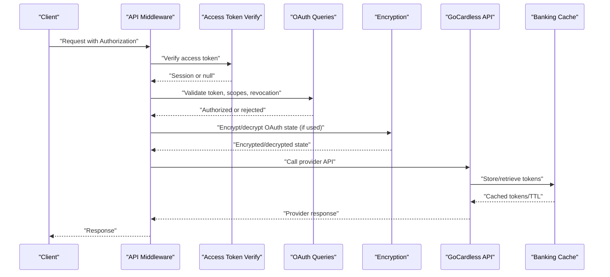

**Diagram sources**
- [middleware/index.ts](file://apps/api/src/rest/middleware/index.ts#L22-L36)
- [auth.ts](file://apps/api/src/utils/auth.ts#L20-L43)
- [oauth-flow.ts](file://packages/db/src/queries/oauth-flow.ts#L246-L285)
- [encryption/index.ts](file://packages/encryption/src/index.ts#L49-L84)
- [gocardless-api.ts](file://packages/banking/src/providers/gocardless/gocardless-api.ts#L67-L124)
- [banking-cache.ts](file://packages/cache/src/banking-cache.ts#L13-L34)

## Detailed Component Analysis

### Authentication and Access Control
- Access token verification uses JWT signature verification against a configured secret, extracting user identity and metadata.
- Protected endpoints apply middleware that enforces authentication, rate limiting per user, IP capture, and database readiness.
- Scope enforcement is supported by middleware exports for granular permissions.

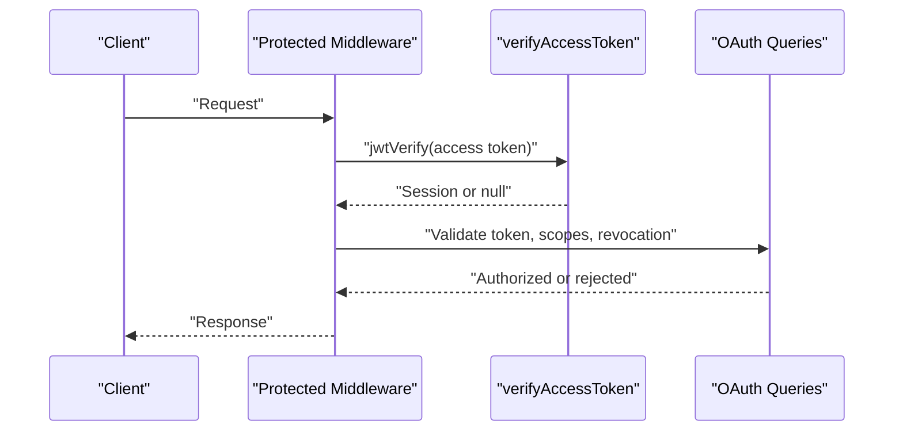

**Diagram sources**
- [auth.ts](file://apps/api/src/utils/auth.ts#L20-L43)
- [middleware/index.ts](file://apps/api/src/rest/middleware/index.ts#L22-L36)
- [oauth-flow.ts](file://packages/db/src/queries/oauth-flow.ts#L246-L285)

**Section sources**
- [auth.ts](file://apps/api/src/utils/auth.ts#L20-L43)
- [middleware/index.ts](file://apps/api/src/rest/middleware/index.ts#L22-L36)
- [oauth-flow.ts](file://packages/db/src/queries/oauth-flow.ts#L246-L285)

### OAuth Security and Token Management
- Client credentials are validated using a constant-time comparison against a hashed secret stored in the database.
- Access tokens are verified for active application status, non-revoked state, and freshness.
- Refresh token handling hashes incoming refresh tokens before comparison, updates last-used timestamps, and supports revocation upon authorization code reuse detection within a defined time window.

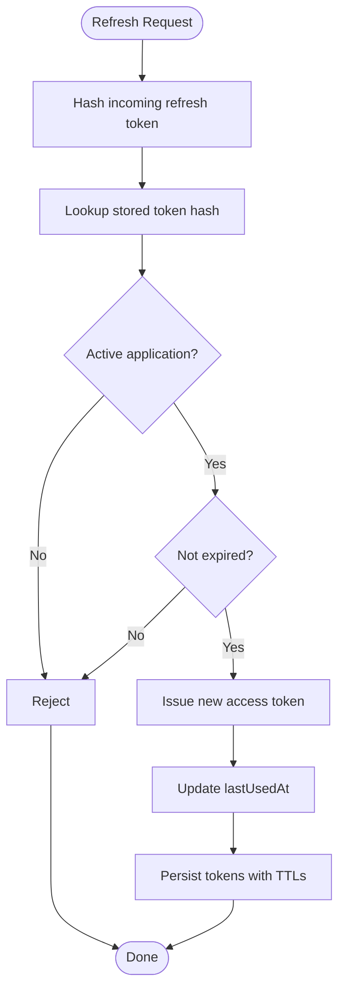

**Diagram sources**
- [oauth.ts](file://apps/api/src/utils/oauth.ts#L10-L23)
- [oauth-flow.ts](file://packages/db/src/queries/oauth-flow.ts#L287-L335)
- [oauth-flow.ts](file://packages/db/src/queries/oauth-flow.ts#L487-L517)

**Section sources**
- [oauth.ts](file://apps/api/src/utils/oauth.ts#L10-L23)
- [oauth-flow.ts](file://packages/db/src/queries/oauth-flow.ts#L287-L335)
- [oauth-flow.ts](file://packages/db/src/queries/oauth-flow.ts#L487-L517)

### Secure Credential Storage and Encryption
- OAuth state payloads are encrypted using AES-256-GCM with URL-safe base64 encoding for transport in query parameters.
- Symmetric encryption utilities validate environment keys and reject invalid configurations.
- JWT-based file keys are generated with expiration and verified with a configurable clock tolerance for grace windows.

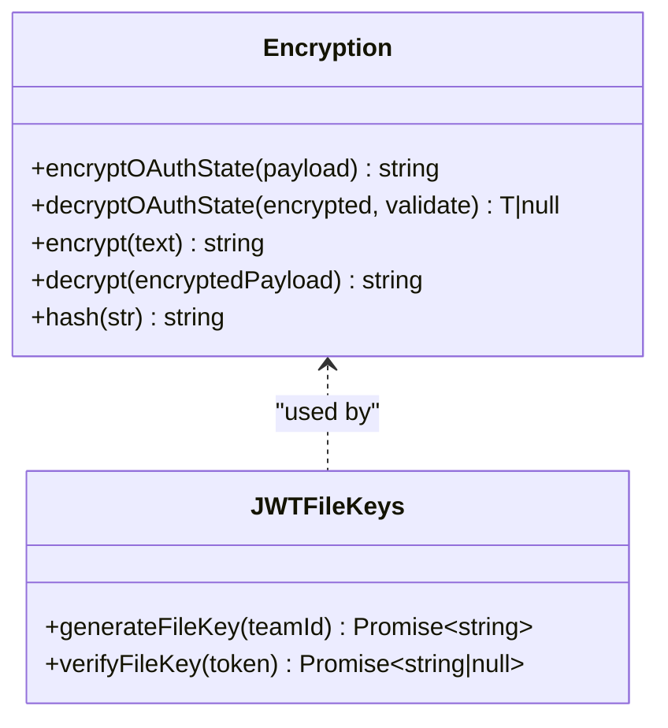

**Diagram sources**
- [encryption/index.ts](file://packages/encryption/src/index.ts#L49-L84)
- [encryption/index.ts](file://packages/encryption/src/index.ts#L112-L171)
- [encryption/index.ts](file://packages/encryption/src/index.ts#L185-L219)

**Section sources**
- [encryption/index.ts](file://packages/encryption/src/index.ts#L49-L84)
- [encryption/index.ts](file://packages/encryption/src/index.ts#L112-L171)
- [encryption/index.ts](file://packages/encryption/src/index.ts#L185-L219)

### Bank API Security Protocols and Token Lifecycle
- GoCardless integration manages access and refresh tokens, with caching and TTL adjustments based on provider-provided expirations.
- Token exchange and refresh are performed via provider endpoints and cached for subsequent requests.
- Caching avoids redundant exchanges and reduces exposure windows.

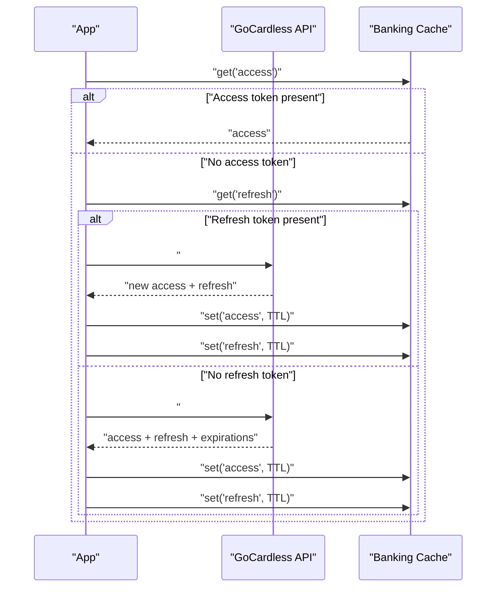

**Diagram sources**
- [gocardless-api.ts](file://packages/banking/src/providers/gocardless/gocardless-api.ts#L67-L124)
- [banking-cache.ts](file://packages/cache/src/banking-cache.ts#L13-L34)
- [README.md](file://packages/banking/README.md#L156-L194)

**Section sources**
- [gocardless-api.ts](file://packages/banking/src/providers/gocardless/gocardless-api.ts#L67-L124)
- [banking-cache.ts](file://packages/cache/src/banking-cache.ts#L13-L34)
- [README.md](file://packages/banking/README.md#L156-L194)

### Audit Logging and Observability
- Structured logging with context-aware child loggers, pretty-printing in development, and JSON in production.
- Logger gracefully handles transport errors to avoid impacting application stability.

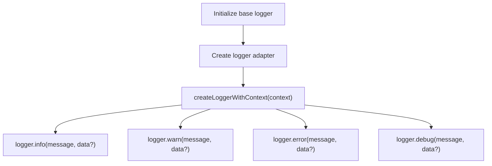

**Diagram sources**
- [index.ts](file://packages/logger/src/index.ts#L11-L34)
- [index.ts](file://packages/logger/src/index.ts#L39-L114)

**Section sources**
- [index.ts](file://packages/logger/src/index.ts#L11-L34)
- [index.ts](file://packages/logger/src/index.ts#L39-L114)

### Data Anonymization and Privacy Controls
- Test datasets are exported with anonymized company and transaction names to protect PII.
- Privacy policy documents lawful basis, retention periods, and data usage.

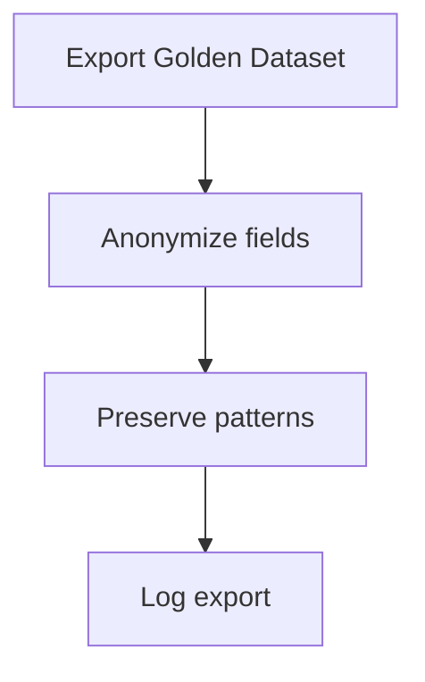

**Diagram sources**
- [golden-dataset.ts](file://packages/db/src/test/golden-dataset.ts#L628-L675)
- [page.tsx](file://apps/website/src/app/policy/page.tsx#L328-L351)

**Section sources**
- [golden-dataset.ts](file://packages/db/src/test/golden-dataset.ts#L628-L675)
- [page.tsx](file://apps/website/src/app/policy/page.tsx#L328-L351)

### Consent Management, Data Retention, and Deletion
- Consent and institution metadata are modeled in the schema, enabling tracking of consent validity windows and provider capabilities.
- User deletion logic cascades to teams when a user is the sole member, ensuring data minimization.

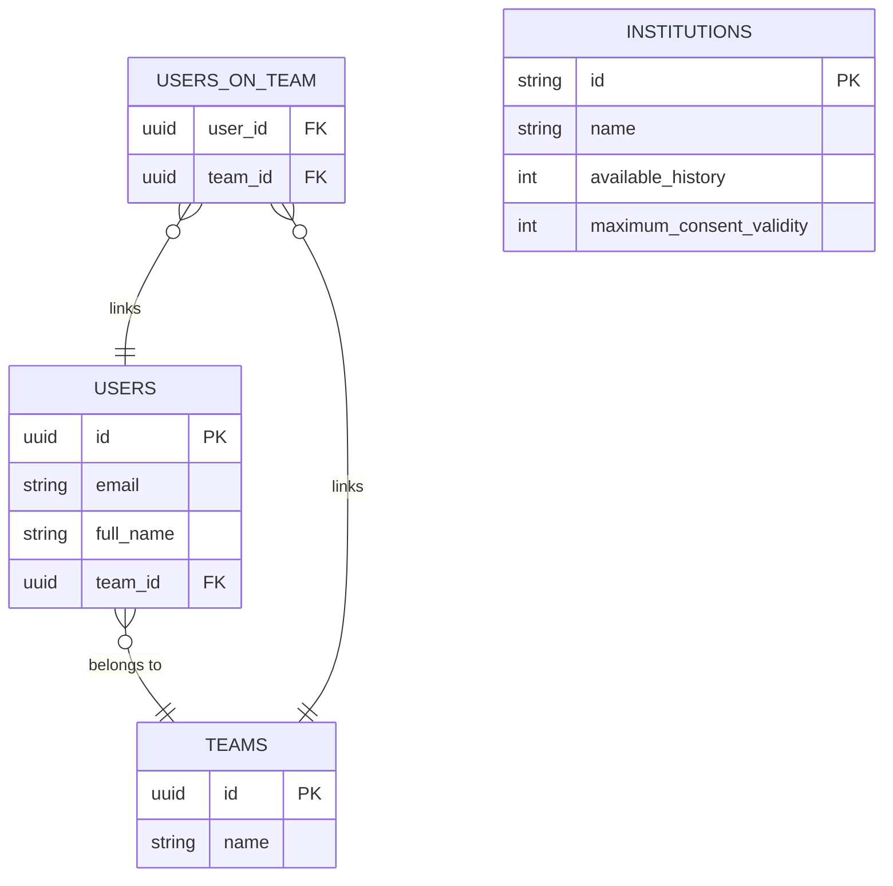

**Diagram sources**
- [schema.ts](file://packages/db/src/schema.ts#L1369-L1390)
- [users.ts](file://packages/db/src/queries/users.ts#L124-L150)

**Section sources**
- [schema.ts](file://packages/db/src/schema.ts#L1369-L1390)
- [users.ts](file://packages/db/src/queries/users.ts#L124-L150)

### Security Monitoring, Threat Detection, and Incident Response
- Security contact and responsible disclosure policy define coordinated vulnerability disclosure and response timelines.
- Published incident report demonstrates transparency and remediation steps.

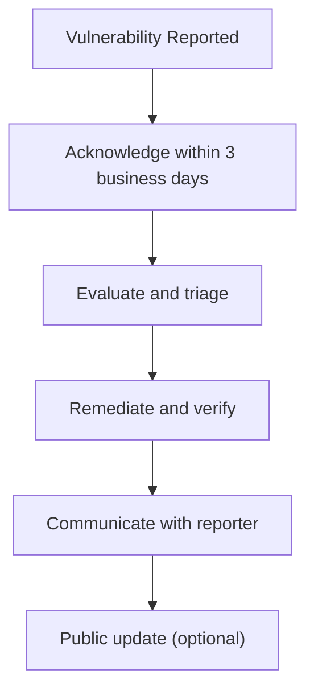

**Diagram sources**
- [SECURITY.md](file://SECURITY.md#L28-L57)
- [incident-report-for-june-22-2024.mdx](file://apps/website/src/app/updates/posts/incident-report-for-june-22-2024.mdx#L1-L48)

**Section sources**
- [SECURITY.md](file://SECURITY.md#L28-L57)
- [incident-report-for-june-22-2024.mdx](file://apps/website/src/app/updates/posts/incident-report-for-june-22-2024.mdx#L1-L48)

## Dependency Analysis
- API middleware depends on authentication utilities and OAuth queries for access control.
- Encryption utilities underpin OAuth state protection and file key generation.
- Banking provider integration relies on caching and environment configuration for token lifecycle.
- Logging provides observability across all components.

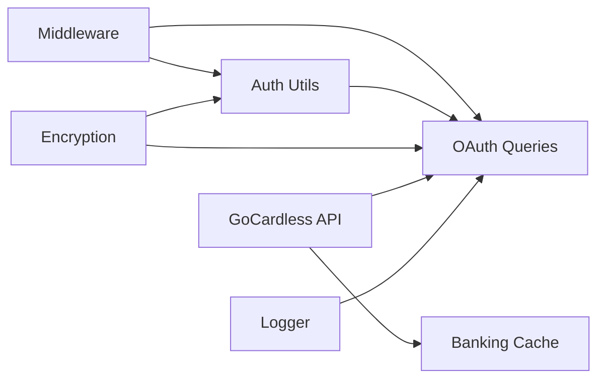

**Diagram sources**
- [middleware/index.ts](file://apps/api/src/rest/middleware/index.ts#L22-L36)
- [auth.ts](file://apps/api/src/utils/auth.ts#L20-L43)
- [oauth-flow.ts](file://packages/db/src/queries/oauth-flow.ts#L246-L285)
- [encryption/index.ts](file://packages/encryption/src/index.ts#L49-L84)
- [gocardless-api.ts](file://packages/banking/src/providers/gocardless/gocardless-api.ts#L67-L124)
- [banking-cache.ts](file://packages/cache/src/banking-cache.ts#L13-L34)
- [index.ts](file://packages/logger/src/index.ts#L39-L114)

**Section sources**
- [middleware/index.ts](file://apps/api/src/rest/middleware/index.ts#L22-L36)
- [auth.ts](file://apps/api/src/utils/auth.ts#L20-L43)
- [oauth-flow.ts](file://packages/db/src/queries/oauth-flow.ts#L246-L285)
- [encryption/index.ts](file://packages/encryption/src/index.ts#L49-L84)
- [gocardless-api.ts](file://packages/banking/src/providers/gocardless/gocardless-api.ts#L67-L124)
- [banking-cache.ts](file://packages/cache/src/banking-cache.ts#L13-L34)
- [index.ts](file://packages/logger/src/index.ts#L39-L114)

## Performance Considerations
- Token caching reduces provider API calls and latency; TTLs are derived from provider expirations minus buffer windows.
- Rate limiting protects endpoints from abuse while allowing legitimate usage per user.
- Structured logging avoids overhead in production and maintains readability in development.

[No sources needed since this section provides general guidance]

## Troubleshooting Guide
- Authentication failures: Verify access token signature and issuer configuration; confirm user session extraction.
- OAuth client validation: Ensure client secret hashing and timing-safe comparison are functioning; check application active status.
- Token refresh issues: Confirm hashed refresh token lookup and revocation window logic; validate cache availability.
- Encryption errors: Check environment key format and length; validate payload structure for decryption.
- Logging issues: Review logger initialization and transport configuration; ensure graceful error handling.

**Section sources**
- [auth.ts](file://apps/api/src/utils/auth.ts#L20-L43)
- [oauth.ts](file://apps/api/src/utils/oauth.ts#L10-L23)
- [oauth-flow.ts](file://packages/db/src/queries/oauth-flow.ts#L287-L335)
- [encryption/index.ts](file://packages/encryption/src/index.ts#L94-L105)
- [index.ts](file://packages/logger/src/index.ts#L11-L34)

## Conclusion
Faworra implements a layered security model combining strong authentication, secure OAuth token handling, encryption for sensitive state, provider token lifecycle management, robust logging, and documented privacy and incident response processes. These controls collectively support PCI DSS-like safeguards, SOC 2 readiness, GDPR and CCPA alignment, and bank-specific security requirements.

[No sources needed since this section summarizes without analyzing specific files]

## Appendices

### Compliance Claims and Certifications
- The website indicates GDPR compliance and SOC 2 in progress, reflecting ongoing efforts toward certification.

**Section sources**
- [footer.tsx](file://apps/website/src/components/footer.tsx#L158-L193)

### Bank-Specific Security Requirements
- Provider token caching and TTL management align with PCI DSS requirement to minimize exposure of sensitive authentication data.
- OAuth state encryption and JWT file keys mitigate man-in-the-middle and replay risks for banking integrations.

**Section sources**
- [gocardless-api.ts](file://packages/banking/src/providers/gocardless/gocardless-api.ts#L67-L124)
- [banking-cache.ts](file://packages/cache/src/banking-cache.ts#L13-L34)
- [encryption/index.ts](file://packages/encryption/src/index.ts#L49-L84)
- [encryption/index.ts](file://packages/encryption/src/index.ts#L185-L219)

### Regional Compliance Variations
- Privacy policy references EU data protection principles and retention obligations; align operational controls with applicable regional regulations.

**Section sources**
- [page.tsx](file://apps/website/src/app/policy/page.tsx#L328-L351)

### Security Assessment Procedures
- Responsible disclosure policy defines vulnerability handling, timelines, and confidentiality commitments.

**Section sources**
- [SECURITY.md](file://SECURITY.md#L28-L57)