# Transaction Processing

<cite>
**Referenced Files in This Document**
- [transactions.ts](file://midday/apps/api/src/schemas/transactions.ts)
- [transactions.ts](file://midday/apps/api/src/rest/routers/transactions.ts)
- [transactions.ts](file://midday/apps/api/src/trpc/routers/transactions.ts)
- [transactions.ts](file://midday/apps/worker/src/queues/transactions.ts)
- [transactions.ts](file://midday/apps/worker/src/schemas/transactions.ts)
- [transactions.ts](file://midday/packages/db/src/queries/transactions.ts)
- [transaction-matching.ts](file://midday/packages/db/src/queries/transaction-matching.ts)
- [transaction-enrichment.ts](file://midday/packages/db/src/queries/transaction-enrichment.ts)
- [index.ts](file://midday/packages/import/src/index.ts)
</cite>

## Table of Contents
1. [Introduction](#introduction)
2. [Project Structure](#project-structure)
3. [Core Components](#core-components)
4. [Architecture Overview](#architecture-overview)
5. [Detailed Component Analysis](#detailed-component-analysis)
6. [Dependency Analysis](#dependency-analysis)
7. [Performance Considerations](#performance-considerations)
8. [Troubleshooting Guide](#troubleshooting-guide)
9. [Conclusion](#conclusion)

## Introduction
This document describes transaction processing workflows in Faworra, focusing on how transactions are imported from bank feeds, streamed in real time, and processed in batches. It covers parsing, normalization, enrichment, automatic categorization, merchant recognition, duplicate detection, status tracking, scheduling, incremental updates, validation, error handling, retry logic, matching rules, category assignment, manual overrides, export formats, CSV processing, and third-party integrations.

## Project Structure
Transaction processing spans three layers:
- API surface: REST and tRPC routers expose endpoints for listing, creating, updating, importing, exporting, and matching transactions.
- Database layer: Queries implement filtering, pagination, enrichment, matching, and export readiness checks.
- Worker layer: Queues and job payloads orchestrate asynchronous tasks such as import, enrichment, matching, and export.

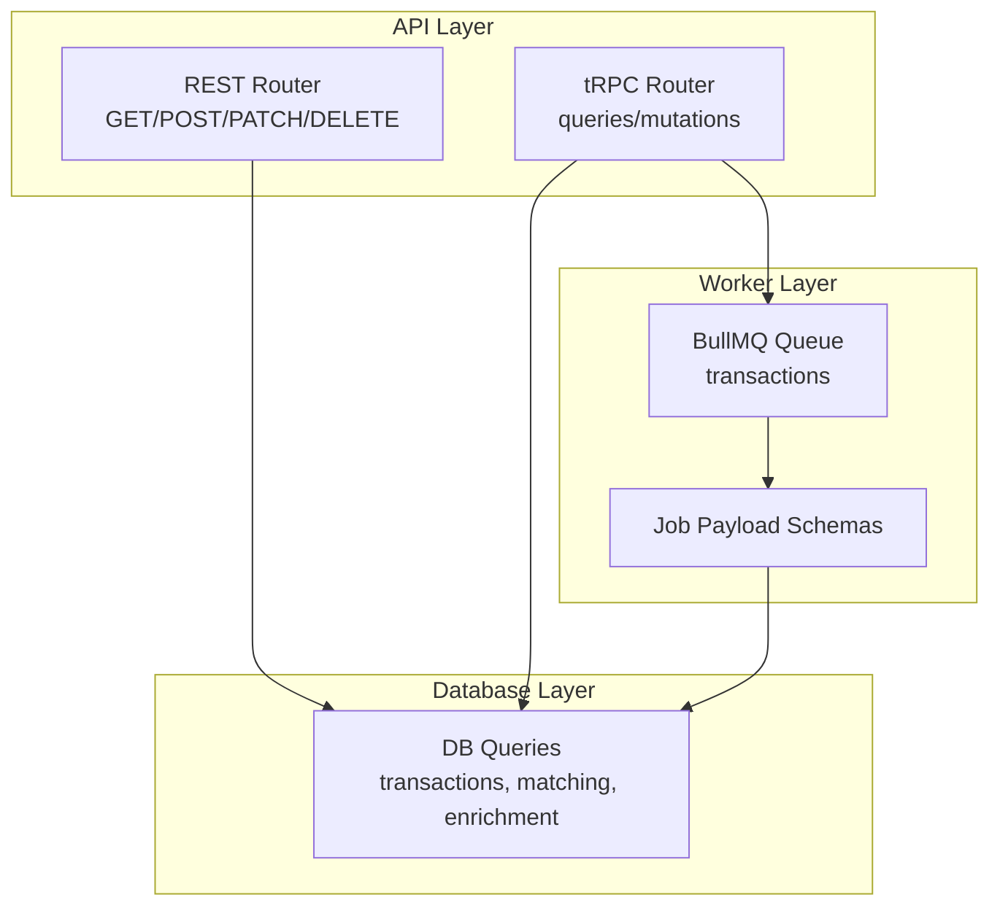

**Diagram sources**
- [transactions.ts](file://midday/apps/api/src/rest/routers/transactions.ts#L1-L489)
- [transactions.ts](file://midday/apps/api/src/trpc/routers/transactions.ts#L1-L299)
- [transactions.ts](file://midday/apps/worker/src/queues/transactions.ts#L1-L13)
- [transactions.ts](file://midday/apps/worker/src/schemas/transactions.ts#L1-L103)
- [transactions.ts](file://midday/packages/db/src/queries/transactions.ts#L1-L800)

**Section sources**
- [transactions.ts](file://midday/apps/api/src/rest/routers/transactions.ts#L1-L489)
- [transactions.ts](file://midday/apps/api/src/trpc/routers/transactions.ts#L1-L299)
- [transactions.ts](file://midday/apps/worker/src/queues/transactions.ts#L1-L13)
- [transactions.ts](file://midday/apps/worker/src/schemas/transactions.ts#L1-L103)
- [transactions.ts](file://midday/packages/db/src/queries/transactions.ts#L1-L800)

## Core Components
- Transaction schema and filtering: Strongly typed request/response schemas define transaction fields, pagination, sorting, and filters (categories, tags, dates, accounts, statuses, fulfillment, export status, etc.).
- REST and tRPC routers: Expose CRUD, bulk operations, CSV mapping generation, import/export triggers, and match search.
- Database queries: Implement complex filtering, full-text search, fulfillment/export state computation, category/tag joins, and pagination.
- Matching engine: Computes name/amount/date/currency scores, applies team-calibrated thresholds, and suggests/auto-matches based on historical patterns.
- Enrichment pipeline: Normalizes merchant names and assigns categories to transactions.
- Worker queues: Encapsulate asynchronous jobs for import, enrichment, matching, and export.

**Section sources**
- [transactions.ts](file://midday/apps/api/src/schemas/transactions.ts#L1-L938)
- [transactions.ts](file://midday/apps/api/src/rest/routers/transactions.ts#L1-L489)
- [transactions.ts](file://midday/apps/api/src/trpc/routers/transactions.ts#L1-L299)
- [transactions.ts](file://midday/packages/db/src/queries/transactions.ts#L52-L793)
- [transaction-matching.ts](file://midday/packages/db/src/queries/transaction-matching.ts#L610-L808)
- [transaction-enrichment.ts](file://midday/packages/db/src/queries/transaction-enrichment.ts#L1-L194)
- [transactions.ts](file://midday/apps/worker/src/schemas/transactions.ts#L1-L103)

## Architecture Overview
The transaction lifecycle integrates API requests, database persistence, and asynchronous workers.

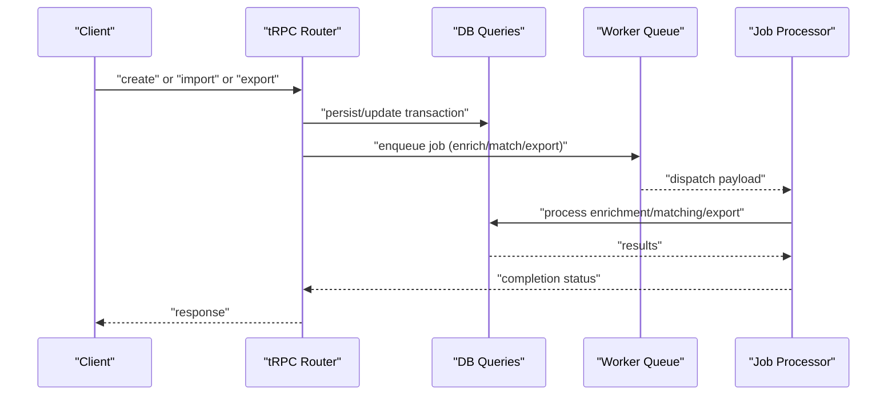

**Diagram sources**
- [transactions.ts](file://midday/apps/api/src/trpc/routers/transactions.ts#L130-L181)
- [transactions.ts](file://midday/apps/worker/src/schemas/transactions.ts#L50-L82)
- [transactions.ts](file://midday/packages/db/src/queries/transaction-enrichment.ts#L70-L152)
- [transaction-matching.ts](file://midday/packages/db/src/queries/transaction-matching.ts#L610-L808)

## Detailed Component Analysis

### Transaction Import from Bank Feeds and CSV Uploads
- CSV mapping generation: tRPC mutation uses AI to suggest column mappings from sample rows and selected columns.
- Import job: tRPC mutation triggers a background job with file path/table data, mappings, currency, and account info.
- Validation: Mappings require either description or counterparty; amount/date are mandatory; optional inverted flag flips signs.
- Manual account backfill: For manual accounts, current balance and currency are updated after import.

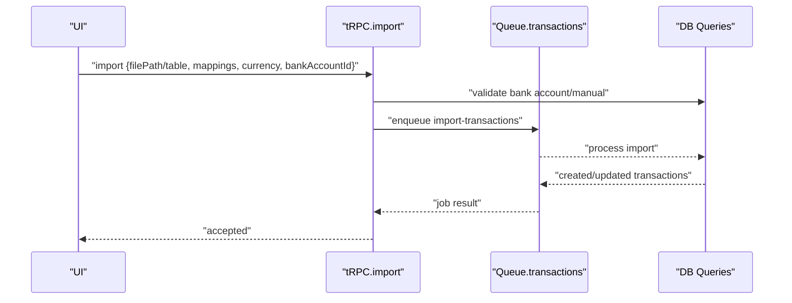

**Diagram sources**
- [transactions.ts](file://midday/apps/api/src/trpc/routers/transactions.ts#L183-L233)
- [transactions.ts](file://midday/apps/worker/src/schemas/transactions.ts#L59-L82)
- [transactions.ts](file://midday/packages/db/src/queries/transactions.ts#L190-L219)

**Section sources**
- [transactions.ts](file://midday/apps/api/src/trpc/routers/transactions.ts#L250-L297)
- [index.ts](file://midday/packages/import/src/index.ts#L1-L3)
- [transactions.ts](file://midday/apps/worker/src/schemas/transactions.ts#L59-L82)
- [transactions.ts](file://midday/packages/db/src/queries/transactions.ts#L190-L219)

### Real-Time Transaction Streaming
- Streaming is not implemented as a dedicated endpoint in the analyzed files. Real-time updates likely rely on tRPC subscriptions or client-side polling of transaction lists. No explicit WebSocket/streaming router was identified in the transaction module.

[No sources needed since this section does not analyze specific files]

### Batch Processing Capabilities
- Bulk endpoints: REST supports bulk create, bulk update, and bulk delete.
- tRPC bulk mutations: Update many transactions atomically (status, category, frequency, tags, etc.).
- Worker batching: Enrichment and export jobs process arrays of IDs with chunking and validation.

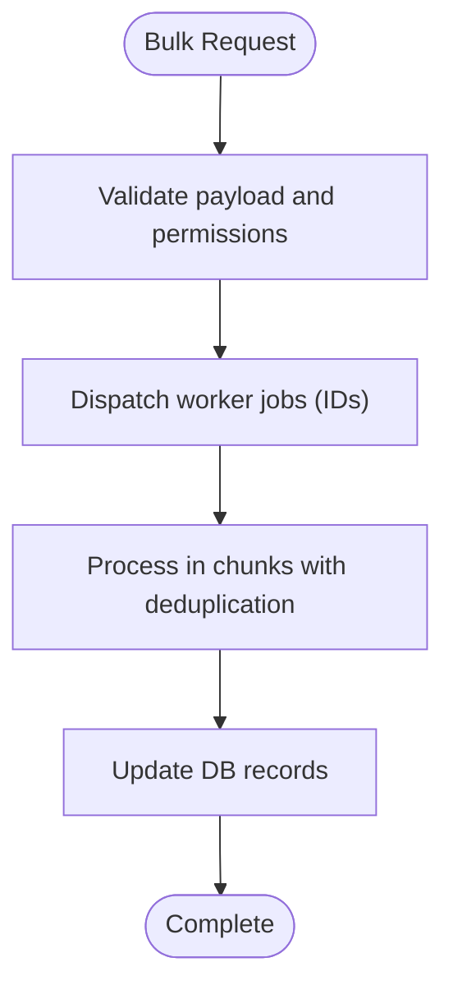

**Diagram sources**
- [transactions.ts](file://midday/apps/api/src/rest/routers/transactions.ts#L364-L404)
- [transactions.ts](file://midday/apps/api/src/trpc/routers/transactions.ts#L95-L103)
- [transaction-enrichment.ts](file://midday/packages/db/src/queries/transaction-enrichment.ts#L70-L152)

**Section sources**
- [transactions.ts](file://midday/apps/api/src/rest/routers/transactions.ts#L364-L404)
- [transactions.ts](file://midday/apps/api/src/trpc/routers/transactions.ts#L95-L103)
- [transaction-enrichment.ts](file://midday/packages/db/src/queries/transaction-enrichment.ts#L70-L152)

### Transaction Parsing, Normalization, and Enrichment
- Parsing: CSV import uses AI-driven mapping suggestions; mappings validated before import.
- Normalization: Merchant name normalization and alias scoring; enrichment marks completion.
- Enrichment: Updates merchantName and categorySlug; deduplicates and chunks updates safely.

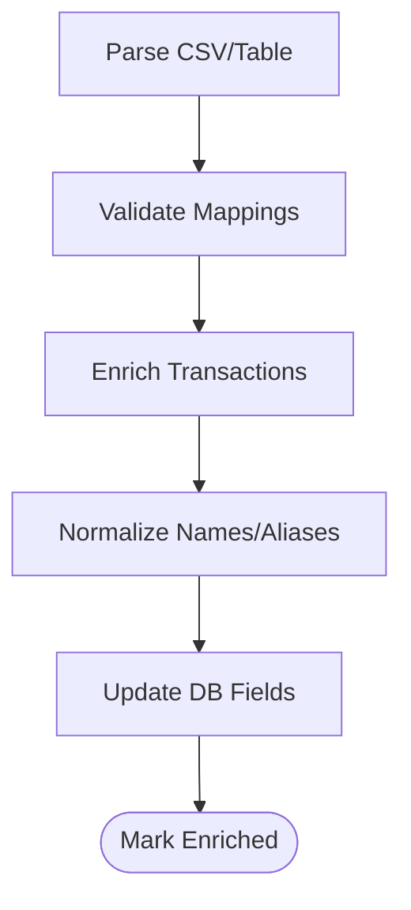

**Diagram sources**
- [transactions.ts](file://midday/apps/api/src/trpc/routers/transactions.ts#L250-L297)
- [transaction-enrichment.ts](file://midday/packages/db/src/queries/transaction-enrichment.ts#L34-L61)
- [transaction-enrichment.ts](file://midday/packages/db/src/queries/transaction-enrichment.ts#L105-L152)

**Section sources**
- [transactions.ts](file://midday/apps/api/src/trpc/routers/transactions.ts#L250-L297)
- [transaction-enrichment.ts](file://midday/packages/db/src/queries/transaction-enrichment.ts#L34-L61)
- [transaction-enrichment.ts](file://midday/packages/db/src/queries/transaction-enrichment.ts#L105-L152)

### Automatic Categorization and Merchant Recognition
- Merchant recognition: Uses word similarity and normalized names; alias and domain token boosts; historical pattern scoring.
- Category assignment: Enrichment sets categorySlug; category joins are included in queries; category taxonomy supports hierarchical slugs.

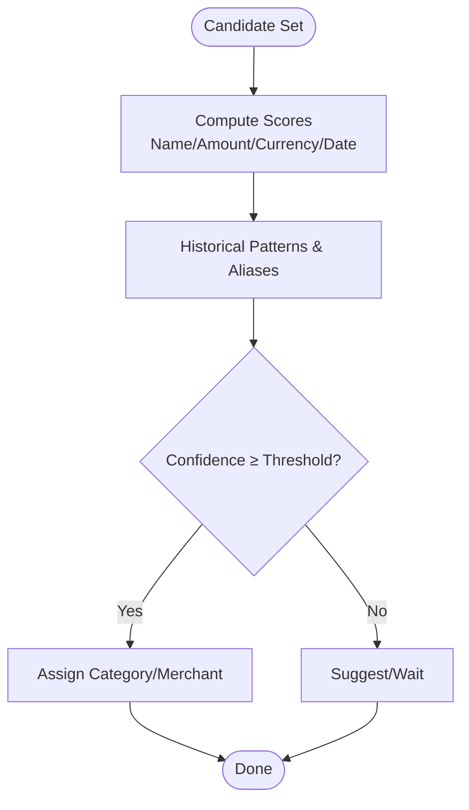

**Diagram sources**
- [transaction-matching.ts](file://midday/packages/db/src/queries/transaction-matching.ts#L740-L808)
- [transaction-enrichment.ts](file://midday/packages/db/src/queries/transaction-enrichment.ts#L26-L29)

**Section sources**
- [transaction-matching.ts](file://midday/packages/db/src/queries/transaction-matching.ts#L740-L808)
- [transaction-enrichment.ts](file://midday/packages/db/src/queries/transaction-enrichment.ts#L26-L29)

### Duplicate Detection Mechanisms
- Candidate selection: Filters out already matched transactions and those with pending suggestions; excludes attachments when needed.
- Scoring: Name similarity, amount tolerance, currency match, date proximity; optional invoice number/domain token boosts.
- Threshold calibration: Team-specific thresholds adapt based on historical feedback; auto-match enabled conditionally.

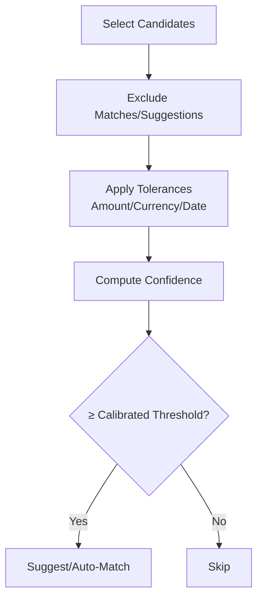

**Diagram sources**
- [transaction-matching.ts](file://midday/packages/db/src/queries/transaction-matching.ts#L645-L715)
- [transaction-matching.ts](file://midday/packages/db/src/queries/transaction-matching.ts#L610-L621)

**Section sources**
- [transaction-matching.ts](file://midday/packages/db/src/queries/transaction-matching.ts#L645-L715)
- [transaction-matching.ts](file://midday/packages/db/src/queries/transaction-matching.ts#L610-L621)

### Transaction Status Tracking, Scheduling, and Incremental Updates
- Statuses: UI statuses map to computed states (blank, receipt_match, in_review, export_error, exported, excluded, archived); DB status preserved.
- Fulfillment/export flags: Computed via attachments or status; export state via accounting sync records.
- Scheduling: tRPC mutations trigger jobs; worker queue encapsulates job configuration.
- Incremental updates: Bulk updates accept arrays of IDs; partial updates supported; export-ready counts exposed.

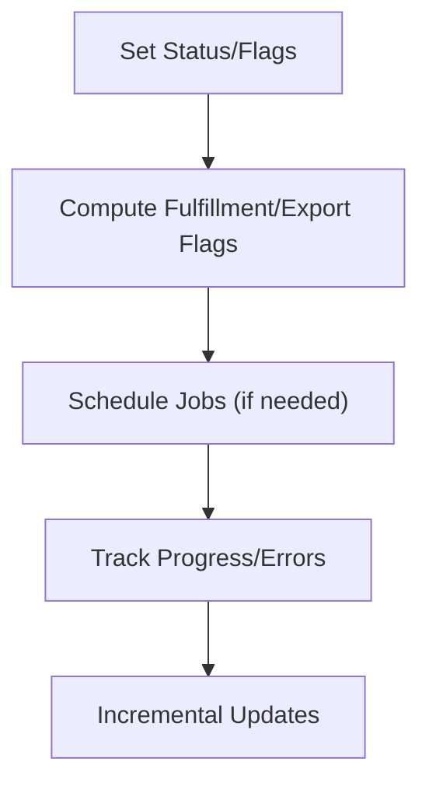

**Diagram sources**
- [transactions.ts](file://midday/packages/db/src/queries/transactions.ts#L148-L183)
- [transactions.ts](file://midday/packages/db/src/queries/transactions.ts#L463-L491)
- [transactions.ts](file://midday/apps/api/src/trpc/routers/transactions.ts#L130-L159)

**Section sources**
- [transactions.ts](file://midday/packages/db/src/queries/transactions.ts#L148-L183)
- [transactions.ts](file://midday/packages/db/src/queries/transactions.ts#L463-L491)
- [transactions.ts](file://midday/apps/api/src/trpc/routers/transactions.ts#L130-L159)

### Transaction Data Validation, Error Handling, and Retry Logic
- Validation: Zod schemas enforce request shapes; CSV mapping generation uses AI with structured output; enrichment validates inputs and deduplicates.
- Error handling: Explicit checks for missing attachments, invalid mappings, and oversized batches; errors logged and returned.
- Retry logic: Not explicitly implemented in the analyzed files; worker jobs are enqueued via BullMQ; external retry policies would be configured at the queue level.

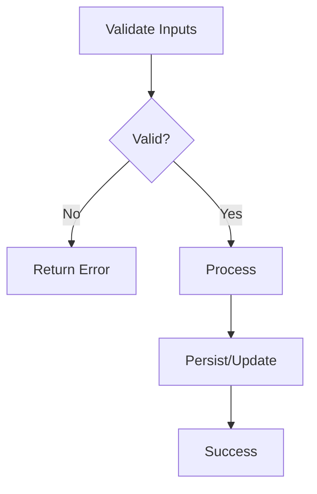

**Diagram sources**
- [transactions.ts](file://midday/apps/api/src/schemas/transactions.ts#L748-L797)
- [transactions.ts](file://midday/apps/api/src/trpc/routers/transactions.ts#L250-L297)
- [transaction-enrichment.ts](file://midday/packages/db/src/queries/transaction-enrichment.ts#L85-L103)

**Section sources**
- [transactions.ts](file://midday/apps/api/src/schemas/transactions.ts#L748-L797)
- [transactions.ts](file://midday/apps/api/src/trpc/routers/transactions.ts#L250-L297)
- [transaction-enrichment.ts](file://midday/packages/db/src/queries/transaction-enrichment.ts#L85-L103)

### Transaction Matching Rules, Category Assignment Workflows, and Manual Overrides
- Matching rules: Name similarity, amount tolerance, currency/base currency alignment, date windows, invoice number/domain token boosts, historical pattern penalties.
- Category assignment: Enrichment updates categorySlug; category joins provide UI metadata.
- Manual overrides: Users can update category/frequency/status via tRPC bulk or single mutations; export-ready counts reflect current state.

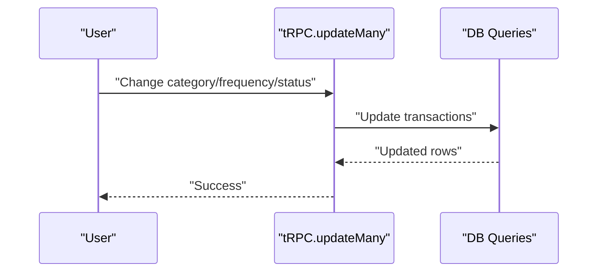

**Diagram sources**
- [transactions.ts](file://midday/apps/api/src/trpc/routers/transactions.ts#L95-L103)
- [transactions.ts](file://midday/packages/db/src/queries/transactions.ts#L52-L85)

**Section sources**
- [transactions.ts](file://midday/apps/api/src/trpc/routers/transactions.ts#L95-L103)
- [transactions.ts](file://midday/packages/db/src/queries/transactions.ts#L52-L85)

### Transaction Export Formats, CSV Processing, and Third-Party Integrations
- Export trigger: tRPC mutation enqueues export job with locale, date format, and settings (CSV/XLSX/email).
- CSV processing: AI-driven mapping suggestions; CSV delimiter and inclusion configurable.
- Third-party integrations: Exported state tracked via accounting sync records; export provider and timestamps recorded.

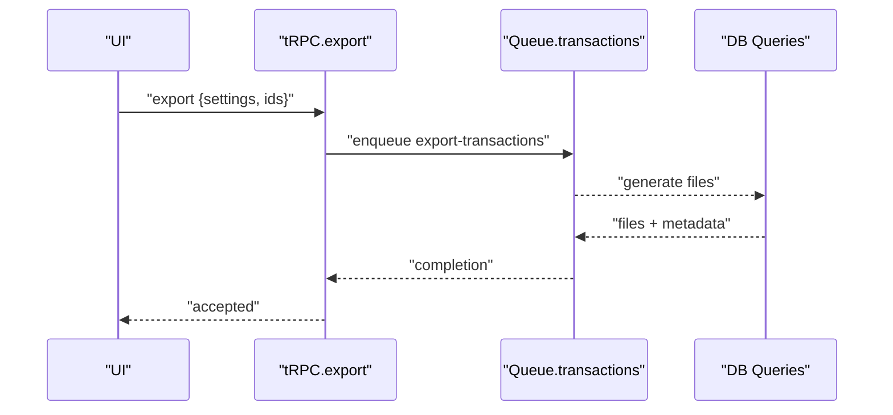

**Diagram sources**
- [transactions.ts](file://midday/apps/api/src/trpc/routers/transactions.ts#L161-L181)
- [transactions.ts](file://midday/apps/worker/src/schemas/transactions.ts#L7-L28)
- [transactions.ts](file://midday/packages/db/src/queries/transactions.ts#L542-L579)

**Section sources**
- [transactions.ts](file://midday/apps/api/src/trpc/routers/transactions.ts#L161-L181)
- [transactions.ts](file://midday/apps/worker/src/schemas/transactions.ts#L7-L28)
- [transactions.ts](file://midday/packages/db/src/queries/transactions.ts#L542-L579)

## Dependency Analysis
- API depends on DB queries for data access and on worker queues for background processing.
- Worker jobs depend on DB for reads/writes and on import utilities for CSV mapping.
- Matching and enrichment depend on shared scoring utilities and category taxonomy.

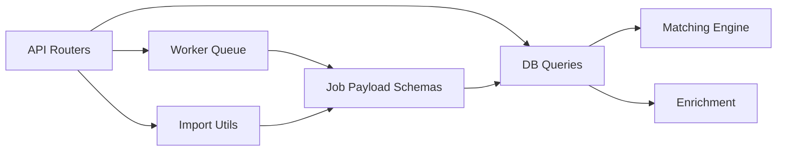

**Diagram sources**
- [transactions.ts](file://midday/apps/api/src/rest/routers/transactions.ts#L1-L489)
- [transactions.ts](file://midday/apps/api/src/trpc/routers/transactions.ts#L1-L299)
- [transactions.ts](file://midday/apps/worker/src/schemas/transactions.ts#L1-L103)
- [transactions.ts](file://midday/packages/db/src/queries/transaction-matching.ts#L1-L80)
- [transactions.ts](file://midday/packages/db/src/queries/transaction-enrichment.ts#L1-L30)

**Section sources**
- [transactions.ts](file://midday/apps/api/src/rest/routers/transactions.ts#L1-L489)
- [transactions.ts](file://midday/apps/api/src/trpc/routers/transactions.ts#L1-L299)
- [transactions.ts](file://midday/apps/worker/src/schemas/transactions.ts#L1-L103)
- [transactions.ts](file://midday/packages/db/src/queries/transaction-matching.ts#L1-L80)
- [transactions.ts](file://midday/packages/db/src/queries/transaction-enrichment.ts#L1-L30)

## Performance Considerations
- Pagination and sorting: Cursor-based pagination with explicit sort columns; avoid heavy sorts on large datasets.
- Filtering: Composite where conditions with indexed fields; full-text search vector leverages PostgreSQL FTS.
- Matching: Limits candidate sets; caches team calibration and pair history; thresholds reduce downstream processing.
- Batching: Chunked enrichment updates minimize query sizes and improve throughput.

[No sources needed since this section provides general guidance]

## Troubleshooting Guide
- CSV mapping errors: Ensure mappings include either description or counterparty; verify delimiter and encoding.
- Import failures: Check bank account validity and manual account balance updates; confirm file/table shape.
- Export errors: Review accounting sync records for failed/partial states; check export settings and provider logs.
- Matching not appearing: Verify thresholds, candidate filters, and pending suggestion exclusions; adjust confidence thresholds if needed.

**Section sources**
- [transactions.ts](file://midday/apps/api/src/trpc/routers/transactions.ts#L183-L233)
- [transactions.ts](file://midday/apps/api/src/trpc/routers/transactions.ts#L250-L297)
- [transactions.ts](file://midday/packages/db/src/queries/transactions.ts#L463-L491)
- [transactions.ts](file://midday/packages/db/src/queries/transaction-matching.ts#L610-L621)

## Conclusion
Faworra’s transaction processing combines robust API endpoints, flexible filtering, AI-assisted CSV mapping, and asynchronous workers to support import, enrichment, matching, and export. The system emphasizes strong typing, team-calibrated thresholds, and incremental updates while providing clear pathways for manual overrides and third-party integrations.