# Business Features

<cite>
**Referenced Files in This Document**
- [invoice.ts](file://midday/apps/api/src/schemas/invoice.ts)
- [invoice-recurring.ts](file://midday/apps/api/src/schemas/invoice-recurring.ts)
- [banking.ts](file://midday/apps/api/src/schemas/banking.ts)
- [documents.ts](file://midday/apps/api/src/schemas/documents.ts)
- [tracker-projects.ts](file://midday/apps/api/src/schemas/tracker-projects.ts)
- [customers.ts](file://midday/apps/api/src/schemas/customers.ts)
- [reports.ts](file://midday/apps/api/src/schemas/reports.ts)
- [transactions.ts](file://midday/apps/api/src/schemas/transactions.ts)
- [types.ts](file://midday/apps/api/src/ai/types.ts)
- [billing.ts](file://midday/apps/api/src/schemas/billing.ts)
</cite>

## Table of Contents
1. [Introduction](#introduction)
2. [Project Structure](#project-structure)
3. [Core Components](#core-components)
4. [Architecture Overview](#architecture-overview)
5. [Detailed Component Analysis](#detailed-component-analysis)
6. [Dependency Analysis](#dependency-analysis)
7. [Performance Considerations](#performance-considerations)
8. [Troubleshooting Guide](#troubleshooting-guide)
9. [Conclusion](#conclusion)

## Introduction
This document explains Faworra’s core business features and how they are modeled and implemented in the codebase. It covers:
- Invoicing system with templates, products, line items, reminders, and recurring invoices
- Banking integration with multiple providers and transaction management
- Document management with AI-powered processing and tagging
- Time tracking and project management
- Customer relationship management
- Financial reporting and forecasting
- Multi-currency support, tax calculations, and compliance considerations

Each feature’s business value, user workflows, and technical implementation are described, along with configuration options, customization capabilities, and integration patterns.

## Project Structure
The business features are primarily defined by strongly typed schemas and related routers/services in the API application. Schemas define request/response contracts, validation rules, and enumerations. UI components and dashboards consume these APIs.

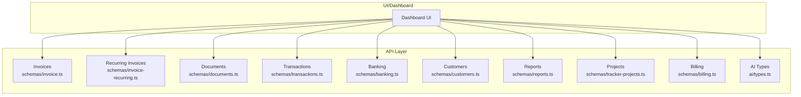

**Diagram sources**
- [invoice.ts](file://midday/apps/api/src/schemas/invoice.ts#L1-L1502)
- [invoice-recurring.ts](file://midday/apps/api/src/schemas/invoice-recurring.ts#L1-L767)
- [documents.ts](file://midday/apps/api/src/schemas/documents.ts#L1-L269)
- [transactions.ts](file://midday/apps/api/src/schemas/transactions.ts#L1-L938)
- [banking.ts](file://midday/apps/api/src/schemas/banking.ts#L1-L92)
- [customers.ts](file://midday/apps/api/src/schemas/customers.ts#L1-L513)
- [reports.ts](file://midday/apps/api/src/schemas/reports.ts#L1-L776)
- [tracker-projects.ts](file://midday/apps/api/src/schemas/tracker-projects.ts#L1-L314)
- [billing.ts](file://midday/apps/api/src/schemas/billing.ts#L1-L37)
- [types.ts](file://midday/apps/api/src/ai/types.ts#L1-L27)

**Section sources**
- [invoice.ts](file://midday/apps/api/src/schemas/invoice.ts#L1-L1502)
- [invoice-recurring.ts](file://midday/apps/api/src/schemas/invoice-recurring.ts#L1-L767)
- [banking.ts](file://midday/apps/api/src/schemas/banking.ts#L1-L92)
- [documents.ts](file://midday/apps/api/src/schemas/documents.ts#L1-L269)
- [tracker-projects.ts](file://midday/apps/api/src/schemas/tracker-projects.ts#L1-L314)
- [customers.ts](file://midday/apps/api/src/schemas/customers.ts#L1-L513)
- [reports.ts](file://midday/apps/api/src/schemas/reports.ts#L1-L776)
- [transactions.ts](file://midday/apps/api/src/schemas/transactions.ts#L1-L938)
- [billing.ts](file://midday/apps/api/src/schemas/billing.ts#L1-L37)
- [types.ts](file://midday/apps/api/src/ai/types.ts#L1-L27)

## Core Components
- Invoicing and Templates: Strongly typed schemas for templates, line items, products, drafts, reminders, and scheduled updates.
- Recurring Invoices: Flexible frequency rules, end conditions, and timezone-aware scheduling.
- Banking and Transactions: Provider integrations (Plaid, GoCardless, Enable Banking, Teller), account and transaction retrieval, and status management.
- Documents: Listing, processing, reprocessing, and signed URL generation for document access.
- Projects and Time Tracking: Project lifecycle, estimates, rates, and aggregation of tracked time and earnings.
- Customers: Rich customer profiles, enrichment, tags, and portal access.
- Reports and Forecasting: Revenue, profit, expenses, burn rate, runway, spending categories, and revenue forecasts with confidence bands.
- Billing: Subscription plans, checkout, and cancellation reasons.

**Section sources**
- [invoice.ts](file://midday/apps/api/src/schemas/invoice.ts#L1-L1502)
- [invoice-recurring.ts](file://midday/apps/api/src/schemas/invoice-recurring.ts#L1-L767)
- [banking.ts](file://midday/apps/api/src/schemas/banking.ts#L1-L92)
- [documents.ts](file://midday/apps/api/src/schemas/documents.ts#L1-L269)
- [tracker-projects.ts](file://midday/apps/api/src/schemas/tracker-projects.ts#L1-L314)
- [customers.ts](file://midday/apps/api/src/schemas/customers.ts#L1-L513)
- [reports.ts](file://midday/apps/api/src/schemas/reports.ts#L1-L776)
- [transactions.ts](file://midday/apps/api/src/schemas/transactions.ts#L1-L938)
- [billing.ts](file://midday/apps/api/src/schemas/billing.ts#L1-L37)

## Architecture Overview
The system exposes REST and tRPC endpoints backed by typed schemas. UI dashboards and clients call these endpoints to manage invoices, reconcile transactions, process documents, track time, and generate reports. Integrations with banking providers and AI tools are orchestrated via schemas and supporting utilities.

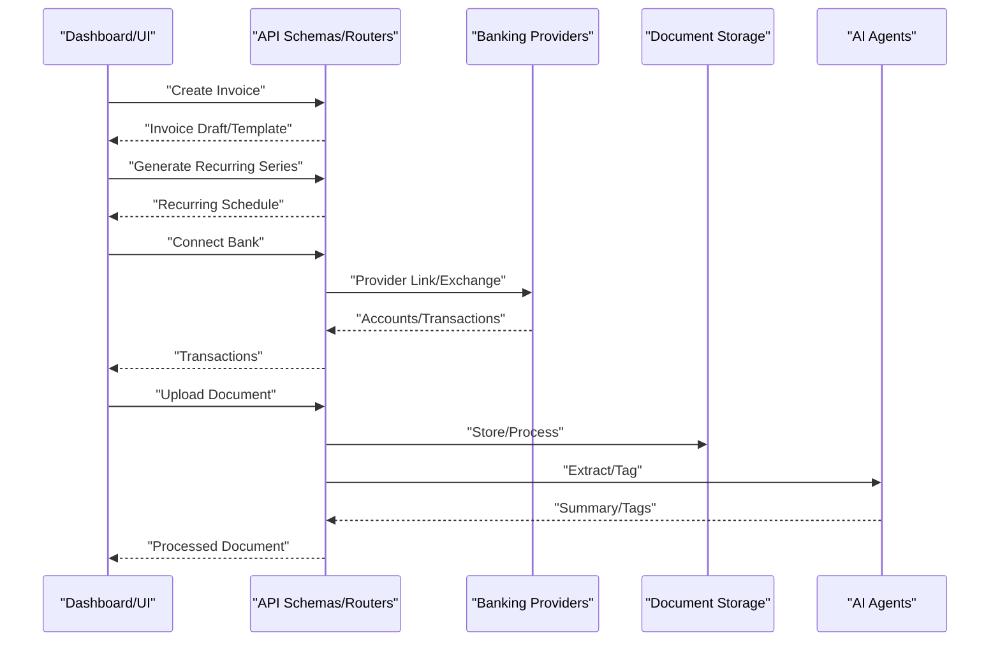

**Diagram sources**
- [invoice.ts](file://midday/apps/api/src/schemas/invoice.ts#L1-L1502)
- [invoice-recurring.ts](file://midday/apps/api/src/schemas/invoice-recurring.ts#L1-L767)
- [banking.ts](file://midday/apps/api/src/schemas/banking.ts#L1-L92)
- [documents.ts](file://midday/apps/api/src/schemas/documents.ts#L1-L269)
- [transactions.ts](file://midday/apps/api/src/schemas/transactions.ts#L1-L938)
- [types.ts](file://midday/apps/api/src/ai/types.ts#L1-L27)

## Detailed Component Analysis

### Invoicing System
Business value:
- Automates professional invoicing with customizable templates, line items, and tax handling.
- Supports reminders, scheduling, duplication, and payment tracking.

Key schemas and workflows:
- Templates: label customization, layout options, currency, date format, timezone, payment details, and optional PDF/email fields.
- Drafts and Products: reusable products, line items with quantities, prices, tax/vat, and optional product linkage.
- Invoices: creation, updates (status, paid date), reminders, duplicates, and scheduled changes.
- Validation: strict numeric ranges, enums, and timezone checks; TipTap JSON content for rich text fields.

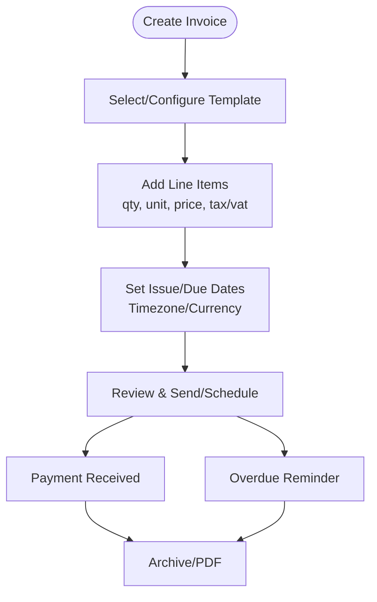

**Diagram sources**
- [invoice.ts](file://midday/apps/api/src/schemas/invoice.ts#L1-L1502)

**Section sources**
- [invoice.ts](file://midday/apps/api/src/schemas/invoice.ts#L1-L1502)

### Recurring Invoices
Business value:
- Automates predictable billing with flexible frequencies, end conditions, and timezone-aware scheduling.

Key schemas and workflows:
- Frequencies: weekly, biweekly, monthly_date, monthly_weekday, monthly_last_day, quarterly, semi_annual, annual, custom.
- End conditions: never, on_date, after_count.
- Validation ensures required parameters per frequency and end condition.
- Upcoming preview and pause/resume controls.

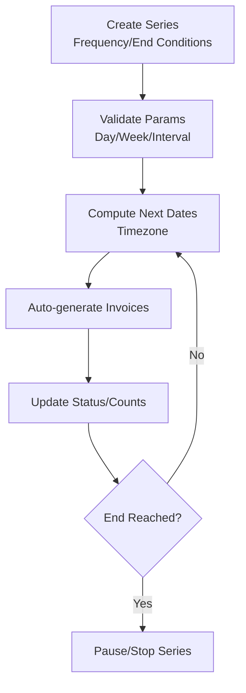

**Diagram sources**
- [invoice-recurring.ts](file://midday/apps/api/src/schemas/invoice-recurring.ts#L1-L767)

**Section sources**
- [invoice-recurring.ts](file://midday/apps/api/src/schemas/invoice-recurring.ts#L1-L767)

### Banking Integration and Automatic Reconciliation
Business value:
- Centralizes bank feeds from multiple providers, normalizes transactions, and supports reconciliation workflows.

Key schemas and workflows:
- Providers: Plaid, GoCardless, Enable Banking, Teller.
- Connections: link/exchange tokens, institution/account retrieval, balance and transaction fetch.
- Transactions: list with filters (categories, tags, dates, amounts), status, recurring flags, and attachments.
- Reconciliation: match transactions to invoices, receipts, and entries; export and archive.

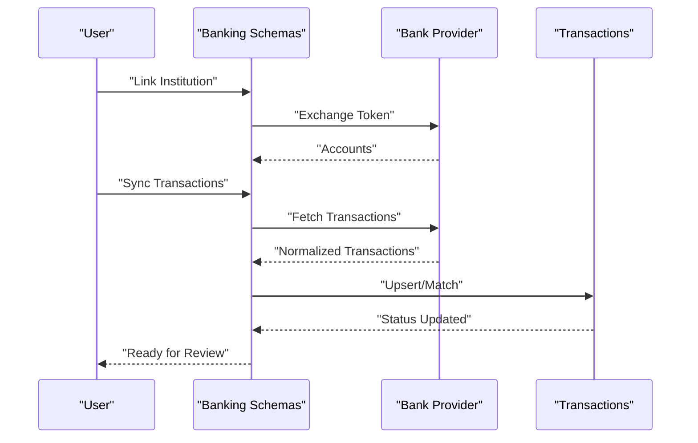

**Diagram sources**
- [banking.ts](file://midday/apps/api/src/schemas/banking.ts#L1-L92)
- [transactions.ts](file://midday/apps/api/src/schemas/transactions.ts#L1-L938)

**Section sources**
- [banking.ts](file://midday/apps/api/src/schemas/banking.ts#L1-L92)
- [transactions.ts](file://midday/apps/api/src/schemas/transactions.ts#L1-L938)

### Document Management with AI Processing
Business value:
- Central repository for financial documents with AI extraction, tagging, and search.

Key schemas and workflows:
- Listing and filtering by tags, dates, and free-text.
- Processing pipeline: upload, extract metadata, summarize, tag, and store.
- Signed URLs for secure access and downloads.
- Reprocessing for failed or outdated extractions.

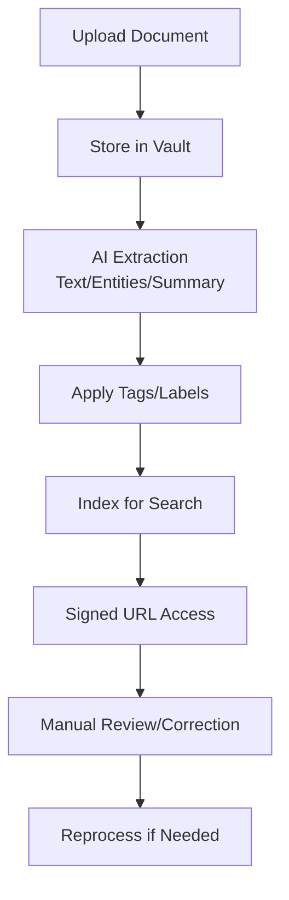

**Diagram sources**
- [documents.ts](file://midday/apps/api/src/schemas/documents.ts#L1-L269)
- [types.ts](file://midday/apps/api/src/ai/types.ts#L1-L27)

**Section sources**
- [documents.ts](file://midday/apps/api/src/schemas/documents.ts#L1-L269)
- [types.ts](file://midday/apps/api/src/ai/types.ts#L1-L27)

### Time Tracking and Project Management
Business value:
- Track billable time per project, compute earnings, and manage project lifecycle.

Key schemas and workflows:
- Projects: name, description, estimate, billable flag, hourly rate, currency, status, customer association, tags, and assigned users.
- Aggregations: total duration and total amount per project.
- Filtering and sorting by name, dates, status, customer, and tags.

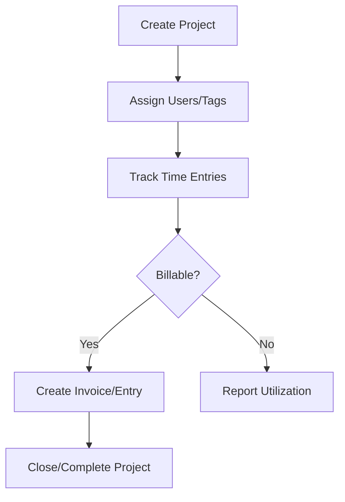

**Diagram sources**
- [tracker-projects.ts](file://midday/apps/api/src/schemas/tracker-projects.ts#L1-L314)

**Section sources**
- [tracker-projects.ts](file://midday/apps/api/src/schemas/tracker-projects.ts#L1-L314)

### Customer Relationship Management
Business value:
- Maintain detailed customer profiles, enrichment, tags, and portal access for self-service.

Key schemas and workflows:
- Profiles: contact info, billing emails, VAT number, address, and enrichment metadata (industry, size, funding).
- Lists and filters: by name/email/search, pagination, and sorting.
- Portal: enable/disable, portal invoices listing, and tokenized access.

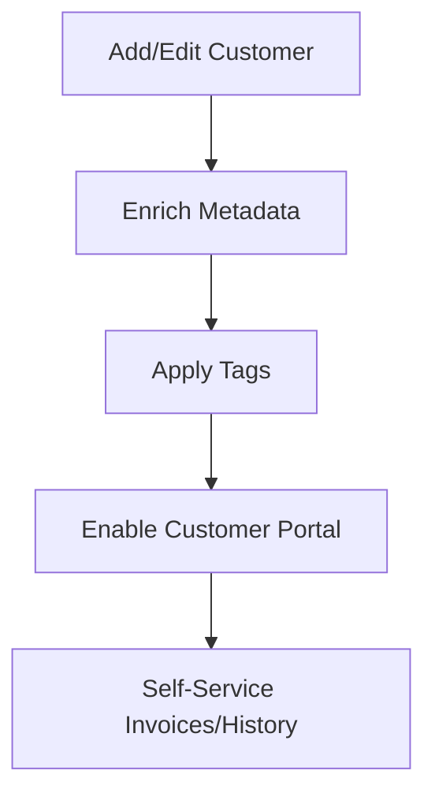

**Diagram sources**
- [customers.ts](file://midday/apps/api/src/schemas/customers.ts#L1-L513)

**Section sources**
- [customers.ts](file://midday/apps/api/src/schemas/customers.ts#L1-L513)

### Financial Reporting and Forecasting
Business value:
- Real-time visibility into revenue, profit, expenses, burn rate, runway, and forecasting.

Key schemas and workflows:
- Metrics: revenue (gross/net), profit (gross/net), expenses, spending by category, burn rate, runway.
- Forecasts: revenue projections with confidence intervals, breakdown by sources (recurring invoices, scheduled, collections, billable hours, new business).
- Sharing: create shareable links with expiration.

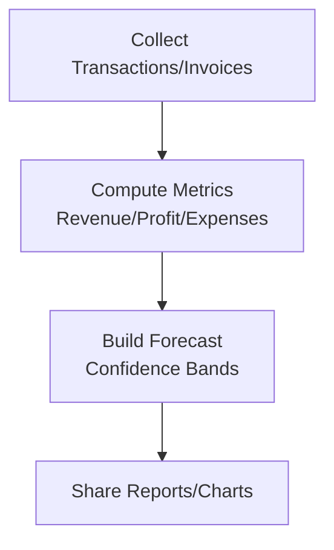

**Diagram sources**
- [reports.ts](file://midday/apps/api/src/schemas/reports.ts#L1-L776)

**Section sources**
- [reports.ts](file://midday/apps/api/src/schemas/reports.ts#L1-L776)

### Billing and Subscriptions
Business value:
- Manage subscription plans, checkout sessions, and cancellations with structured reasons.

Key schemas and workflows:
- Plans: starter plan selection, currency, origin.
- Checkout: session creation and redirection.
- Cancellations: structured reasons and optional comments.

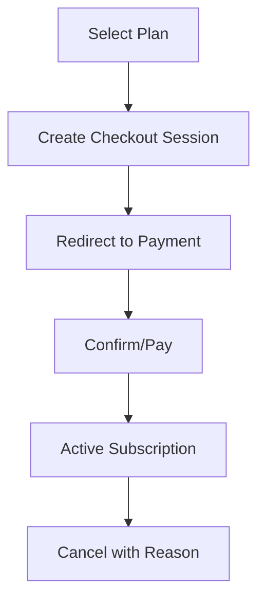

**Diagram sources**
- [billing.ts](file://midday/apps/api/src/schemas/billing.ts#L1-L37)

**Section sources**
- [billing.ts](file://midday/apps/api/src/schemas/billing.ts#L1-L37)

## Dependency Analysis
- Invoices depend on Templates, Products, and Customers.
- Recurring Invoices depend on Invoices and Templates.
- Transactions integrate with Banking Providers and Documents.
- Reports aggregate data from Transactions and Invoices.
- Projects integrate with Customers and optionally Invoices.
- Documents leverage AI extraction and storage.

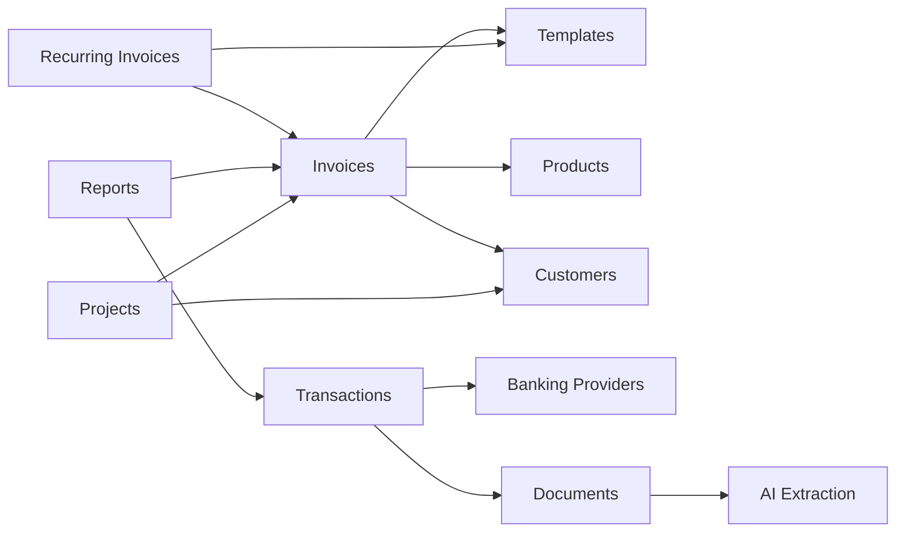

**Diagram sources**
- [invoice.ts](file://midday/apps/api/src/schemas/invoice.ts#L1-L1502)
- [invoice-recurring.ts](file://midday/apps/api/src/schemas/invoice-recurring.ts#L1-L767)
- [banking.ts](file://midday/apps/api/src/schemas/banking.ts#L1-L92)
- [documents.ts](file://midday/apps/api/src/schemas/documents.ts#L1-L269)
- [tracker-projects.ts](file://midday/apps/api/src/schemas/tracker-projects.ts#L1-L314)
- [reports.ts](file://midday/apps/api/src/schemas/reports.ts#L1-L776)
- [types.ts](file://midday/apps/api/src/ai/types.ts#L1-L27)

**Section sources**
- [invoice.ts](file://midday/apps/api/src/schemas/invoice.ts#L1-L1502)
- [invoice-recurring.ts](file://midday/apps/api/src/schemas/invoice-recurring.ts#L1-L767)
- [banking.ts](file://midday/apps/api/src/schemas/banking.ts#L1-L92)
- [documents.ts](file://midday/apps/api/src/schemas/documents.ts#L1-L269)
- [tracker-projects.ts](file://midday/apps/api/src/schemas/tracker-projects.ts#L1-L314)
- [reports.ts](file://midday/apps/api/src/schemas/reports.ts#L1-L776)
- [types.ts](file://midday/apps/api/src/ai/types.ts#L1-L27)

## Performance Considerations
- Pagination and filtering: Use cursor-based pagination and efficient filters (tags, categories, dates) to reduce payload sizes.
- Batch operations: Prefer batch endpoints for transactions and documents to minimize round trips.
- Caching: Cache frequently accessed templates, products, and customer enrichment data.
- Asynchronous processing: Use background jobs for document processing and large exports.
- Multi-currency: Normalize amounts at ingestion time and store base currency conversions for reporting.

## Troubleshooting Guide
Common issues and resolutions:
- Invalid timezone in templates or recurring schedules: Ensure IANA timezone identifiers are used.
- Template validation failures: Verify numeric ranges for tax rates and amounts; confirm TipTap JSON content structure.
- Recurring schedule mismatches: Check frequency parameters (day/week/interval) align with chosen frequency type.
- Bank sync errors: Validate provider tokens and institution IDs; retry with updated credentials.
- Document processing failures: Use reprocess endpoint and inspect extraction logs.
- Transaction status inconsistencies: Match transactions to invoices and receipts; mark as exported or excluded accordingly.

**Section sources**
- [invoice.ts](file://midday/apps/api/src/schemas/invoice.ts#L1-L1502)
- [invoice-recurring.ts](file://midday/apps/api/src/schemas/invoice-recurring.ts#L1-L767)
- [banking.ts](file://midday/apps/api/src/schemas/banking.ts#L1-L92)
- [documents.ts](file://midday/apps/api/src/schemas/documents.ts#L1-L269)
- [transactions.ts](file://midday/apps/api/src/schemas/transactions.ts#L1-L938)

## Conclusion
Faworra’s business features are built on robust, typed schemas that enforce data integrity and enable powerful workflows across invoicing, banking, document processing, time tracking, CRM, and financial reporting. The system supports multi-currency, tax calculations, and compliance through validated fields and standardized providers. By leveraging these schemas and their associated workflows, teams can automate routine tasks, gain insights, and maintain accurate financial records.