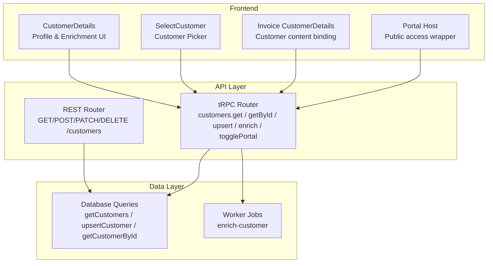
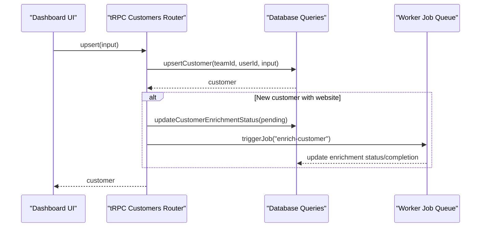
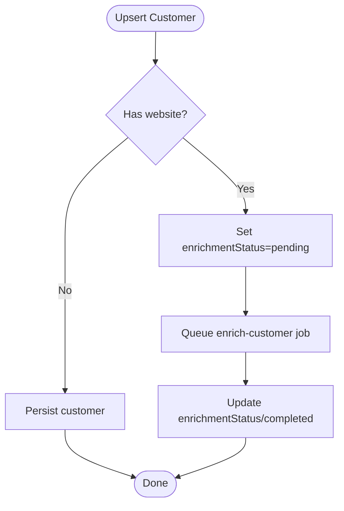
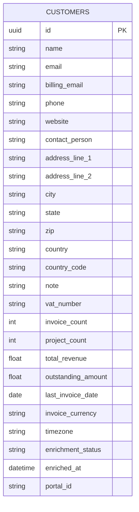
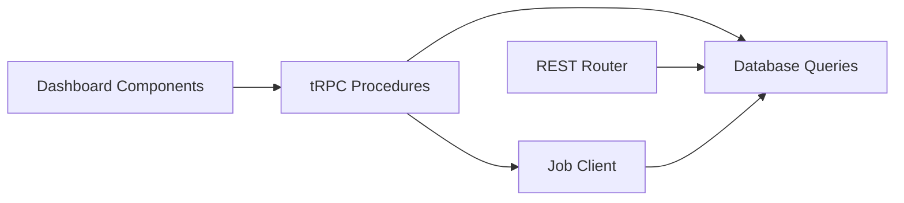

# Customer Relationship Management

<cite>
**Referenced Files in This Document**
- [customers.ts](file://midday/apps/api/src/schemas/customers.ts)
- [customers.ts](file://midday/apps/api/src/rest/routers/customers.ts)
- [customers.ts](file://midday/apps/api/src/trpc/routers/customers.ts)
- [customer-details.tsx](file://midday/apps/dashboard/src/components/customer-details.tsx)
- [select-customer.tsx](file://midday/apps/dashboard/src/components/select-customer.tsx)
- [customer-details.tsx](file://midday/apps/dashboard/src/components/invoice/customer-details.tsx)
- [portal.tsx](file://midday/apps/dashboard/src/components/portal.tsx)
- [invoice.ts](file://midday/apps/api/src/schemas/invoice.ts)
- [customers.ts](file://midday/packages/db/src/queries/customers.ts)
- [customers.ts](file://midday/apps/worker/src/queues/customers.ts)
- [customers.ts](file://midday/apps/worker/src/schemas/customers.ts)
</cite>

## Table of Contents
1. [Introduction](#introduction)
2. [Project Structure](#project-structure)
3. [Core Components](#core-components)
4. [Architecture Overview](#architecture-overview)
5. [Detailed Component Analysis](#detailed-component-analysis)
6. [Dependency Analysis](#dependency-analysis)
7. [Performance Considerations](#performance-considerations)
8. [Troubleshooting Guide](#troubleshooting-guide)
9. [Conclusion](#conclusion)
10. [Appendices](#appendices)

## Introduction
This document describes Faworra’s customer relationship management (CRM) system with a focus on customer profile management, contact information, communication preferences, segmentation, enrichment, invoicing integration, customer portal, and analytics. It explains how customer data is modeled, validated, stored, and exposed via REST and tRPC APIs, and how the frontend integrates with these APIs to support onboarding, profile editing, invoice creation, and portal access.

## Project Structure
The CRM functionality spans three layers:
- API layer: REST and tRPC routers define endpoints and procedures for customer CRUD, enrichment, and portal access.
- Data layer: Database queries encapsulate persistence logic for customers and related metrics.
- Frontend layer: Dashboard components provide customer details, selection, enrichment controls, and invoice integration.

**Diagram sources**
- [customers.ts](file://midday/apps/api/src/rest/routers/customers.ts#L1-L222)
- [customers.ts](file://midday/apps/api/src/trpc/routers/customers.ts#L1-L263)
- [customer-details.tsx](file://midday/apps/dashboard/src/components/customer-details.tsx#L1-L800)
- [select-customer.tsx](file://midday/apps/dashboard/src/components/select-customer.tsx#L1-L133)
- [customer-details.tsx](file://midday/apps/dashboard/src/components/invoice/customer-details.tsx#L1-L105)
- [portal.tsx](file://midday/apps/dashboard/src/components/portal.tsx#L1-L21)

**Section sources**
- [customers.ts](file://midday/apps/api/src/rest/routers/customers.ts#L1-L222)
- [customers.ts](file://midday/apps/api/src/trpc/routers/customers.ts#L1-L263)
- [customer-details.tsx](file://midday/apps/dashboard/src/components/customer-details.tsx#L1-L800)
- [select-customer.tsx](file://midday/apps/dashboard/src/components/select-customer.tsx#L1-L133)
- [customer-details.tsx](file://midday/apps/dashboard/src/components/invoice/customer-details.tsx#L1-L105)
- [portal.tsx](file://midday/apps/dashboard/src/components/portal.tsx#L1-L21)

## Core Components
- Customer schema and validation: Defines searchable fields, contact info, billing contacts, financial metrics, enrichment metadata, and portal identifiers.
- REST router: Exposes list, create, retrieve, update, and delete endpoints with OpenAPI specs and scoped authorization.
- tRPC router: Provides protected and public procedures for customer operations, enrichment orchestration, portal access, and invoice summaries.
- Frontend components: Customer details sheet, customer selector, invoice customer content binding, and portal host wrapper.
- Database queries: Encapsulate customer persistence and enrichment status management.
- Worker jobs: Trigger enrichment workflows asynchronously.

**Section sources**
- [customers.ts](file://midday/apps/api/src/schemas/customers.ts#L1-L513)
- [customers.ts](file://midday/apps/api/src/rest/routers/customers.ts#L1-L222)
- [customers.ts](file://midday/apps/api/src/trpc/routers/customers.ts#L1-L263)
- [customer-details.tsx](file://midday/apps/dashboard/src/components/customer-details.tsx#L1-L800)
- [select-customer.tsx](file://midday/apps/dashboard/src/components/select-customer.tsx#L1-L133)
- [customer-details.tsx](file://midday/apps/dashboard/src/components/invoice/customer-details.tsx#L1-L105)
- [portal.tsx](file://midday/apps/dashboard/src/components/portal.tsx#L1-L21)
- [customers.ts](file://midday/packages/db/src/queries/customers.ts#L1-L200)
- [customers.ts](file://midday/apps/worker/src/queues/customers.ts#L1-L120)
- [customers.ts](file://midday/apps/worker/src/schemas/customers.ts#L1-L120)

## Architecture Overview
The CRM system follows a layered architecture:
- API layer validates requests and delegates to database queries.
- tRPC procedures coordinate enrichment jobs and expose public endpoints for portal access.
- Frontend composes UI around tRPC queries and mutations.
- Worker handles asynchronous enrichment tasks.

**Diagram sources**
- [customers.ts](file://midday/apps/api/src/trpc/routers/customers.ts#L63-L105)
- [customers.ts](file://midday/packages/db/src/queries/customers.ts#L1-L200)
- [customers.ts](file://midday/apps/worker/src/queues/customers.ts#L1-L120)

## Detailed Component Analysis

### Customer Model and Schemas
The customer schema defines:
- Identity: id, name, token
- Contact: email, billingEmail, phone, website, contact
- Address: country, countryCode, address lines, city, state, zip
- Internal: note, tags, vatNumber
- Financial metrics (list view): totalRevenue, outstandingAmount, lastInvoiceDate, invoiceCurrency, invoiceCount, projectCount
- Enrichment: description, industry, companyType, employeeCount, foundedYear, estimatedRevenue, fundingStage, totalFunding, headquartersLocation, timezone, social profiles, finance contact, primaryLanguage, fiscalYearEnd, enrichmentStatus, enrichedAt
- Portal: portalId exposed via public procedures

Validation ensures email lists, sorting tuples, pagination bounds, and enrichment prerequisites (website required for enrichment).

**Section sources**
- [customers.ts](file://midday/apps/api/src/schemas/customers.ts#L63-L279)
- [customers.ts](file://midday/apps/api/src/schemas/customers.ts#L378-L475)
- [customers.ts](file://midday/apps/api/src/schemas/customers.ts#L488-L513)

### REST API: Customer Endpoints
Endpoints:
- GET /customers: List with search, sort, cursor, pageSize
- POST /customers: Create customer
- GET /customers/{id}: Retrieve customer
- PATCH /customers/{id}: Update customer
- DELETE /customers/{id}: Delete customer

Each endpoint enforces scope-based authorization and returns validated responses.

**Section sources**
- [customers.ts](file://midday/apps/api/src/rest/routers/customers.ts#L21-L219)

### tRPC API: Customer Procedures
Key procedures:
- Protected:
  - get(input?): List customers
  - getById({id}): Retrieve by id
  - upsert(input): Upsert customer; auto-trigger enrichment for new customers with website
  - delete({id}): Delete customer
  - enrich({id}): Trigger enrichment (requires website)
  - cancelEnrichment({id}): Reset enrichment status
  - clearEnrichment({id}): Clear enrichment data
  - togglePortal({customerId, enabled}): Enable/disable portal
  - getInvoiceSummary({id}): Financial summary for customer
- Public:
  - getByPortalId({portalId}): Resolve customer by portalId and include invoice summary
  - getPortalInvoices({portalId, cursor?, pageSize?}): Paginated invoices for portal

tRPC orchestrates enrichment status transitions and job triggers, and exposes public routes for customer portal access.

**Section sources**
- [customers.ts](file://midday/apps/api/src/trpc/routers/customers.ts#L35-L262)

### Frontend: Customer Details and Selection
- CustomerDetails sheet:
  - Displays general and enriched company profile
  - Controls for enrichment start/cancel/clear
  - Realtime subscription to customer updates
  - Integrates with invoice list and PDF download
- SelectCustomer:
  - Searchable customer picker with “Create customer” option
  - Navigates to invoice creation with selected customer
- Invoice CustomerDetails:
  - Binds selected customer to invoice content
  - Updates template labels and resets selection when content changes
- Portal:
  - Portal host wrapper for public views

**Section sources**
- [customer-details.tsx](file://midday/apps/dashboard/src/components/customer-details.tsx#L95-L800)
- [select-customer.tsx](file://midday/apps/dashboard/src/components/select-customer.tsx#L19-L133)
- [customer-details.tsx](file://midday/apps/dashboard/src/components/invoice/customer-details.tsx#L15-L105)
- [portal.tsx](file://midday/apps/dashboard/src/components/portal.tsx#L10-L21)

### Invoicing Integration
- Customer selection in invoice form:
  - SelectCustomer opens a popover with customer list
  - Choosing a customer sets invoice parameters and binds customer content
- Customer content rendering:
  - transformCustomerToContent populates invoice customerDetails
  - Template labels (e.g., “To”) can be customized
- Invoice schema supports:
  - Customer reference (id, name)
  - Editor content for sender, payment, and notes
  - Delivery options (create, create_and_send, scheduled)

**Section sources**
- [customer-details.tsx](file://midday/apps/dashboard/src/components/invoice/customer-details.tsx#L15-L105)
- [select-customer.tsx](file://midday/apps/dashboard/src/components/select-customer.tsx#L19-L133)
- [invoice.ts](file://midday/apps/api/src/schemas/invoice.ts#L193-L283)

### Customer Portal
- Public access:
  - getByPortalId resolves customer and computes invoice summary
  - getPortalInvoices returns paginated invoices for portalId
- Portal host:
  - Portal component renders children into document.body for overlay scenarios

**Section sources**
- [customers.ts](file://midday/apps/api/src/trpc/routers/customers.ts#L214-L261)
- [portal.tsx](file://midday/apps/dashboard/src/components/portal.tsx#L10-L21)

### Enrichment Workflow
- Auto-trigger on create for new customers with website
- Manual enrichment via enrich mutation; status transitions to pending, processing, completed
- Cancel or clear enrichment to reset status
- Worker queue handles enrichment jobs

**Diagram sources**
- [customers.ts](file://midday/apps/api/src/trpc/routers/customers.ts#L74-L102)
- [customers.ts](file://midday/apps/worker/src/queues/customers.ts#L1-L120)

**Section sources**
- [customers.ts](file://midday/apps/api/src/trpc/routers/customers.ts#L74-L154)
- [customers.ts](file://midday/apps/worker/src/queues/customers.ts#L1-L120)

### Data Model Overview

**Diagram sources**
- [customers.ts](file://midday/apps/api/src/schemas/customers.ts#L63-L279)

## Dependency Analysis
- API depends on schemas for validation and on database queries for persistence.
- tRPC procedures depend on database queries and job client for enrichment orchestration.
- Frontend components depend on tRPC hooks and react-query for data fetching and mutations.
- Worker consumes jobs from queue and updates enrichment status.

**Diagram sources**
- [customers.ts](file://midday/apps/api/src/trpc/routers/customers.ts#L1-L31)
- [customers.ts](file://midday/packages/db/src/queries/customers.ts#L1-L200)
- [customers.ts](file://midday/apps/worker/src/queues/customers.ts#L1-L120)

**Section sources**
- [customers.ts](file://midday/apps/api/src/trpc/routers/customers.ts#L1-L31)
- [customers.ts](file://midday/packages/db/src/queries/customers.ts#L1-L200)
- [customers.ts](file://midday/apps/worker/src/queues/customers.ts#L1-L120)

## Performance Considerations
- Pagination and sorting: REST and tRPC endpoints accept cursor and sort parameters to efficiently paginate large datasets.
- Realtime updates: Customer details sheet subscribes to realtime events to reflect enrichment status changes without polling.
- Optimistic UI: Enrichment mutations optimistically update status and refetch on settle to improve perceived responsiveness.
- Lazy loading: Infinite query for invoices reduces initial payload and improves UI responsiveness.

[No sources needed since this section provides general guidance]

## Troubleshooting Guide
Common issues and resolutions:
- Enrichment fails or stuck:
  - Use cancelEnrichment to reset status; use clearEnrichment to remove stale data; retry with enrich.
- Customer not found:
  - Verify id/teamId and ensure portalId exists for public routes.
- Website required for enrichment:
  - Ensure customer has a website before triggering enrichment.
- Portal access:
  - Confirm portal is enabled and portalId is correct; use getByPortalId to resolve customer and summary.

**Section sources**
- [customers.ts](file://midday/apps/api/src/trpc/routers/customers.ts#L116-L202)

## Conclusion
Faworra’s CRM integrates customer profile management, enrichment, and invoicing with a clean separation of concerns across REST and tRPC APIs, robust frontend components, and asynchronous job processing. The system supports customer segmentation via tags, enrichment-driven insights, portal access, and seamless invoice creation bound to customer data.

[No sources needed since this section summarizes without analyzing specific files]

## Appendices

### Example Workflows

- Create a customer and auto-enrich:
  - Call tRPC upsert with name, email, website; system sets enrichmentStatus to pending and queues enrich-customer job.
  - Monitor status via realtime updates or refetch.

- Select a customer for invoice creation:
  - Use SelectCustomer to pick a customer; invoice form binds customer content and template labels.

- Access customer portal:
  - Enable portal via togglePortal; share portalId; public user accesses getByPortalId and getPortalInvoices.

- Enrich existing customer:
  - Start enrichment via enrich mutation; cancel or clear if needed.

**Section sources**
- [customers.ts](file://midday/apps/api/src/trpc/routers/customers.ts#L63-L105)
- [select-customer.tsx](file://midday/apps/dashboard/src/components/select-customer.tsx#L19-L133)
- [customer-details.tsx](file://midday/apps/dashboard/src/components/invoice/customer-details.tsx#L15-L105)
- [customers.ts](file://midday/apps/api/src/trpc/routers/customers.ts#L214-L261)