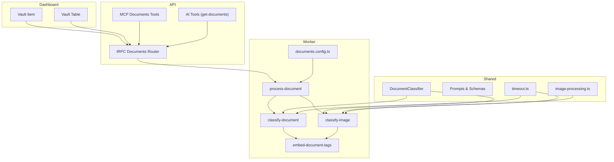
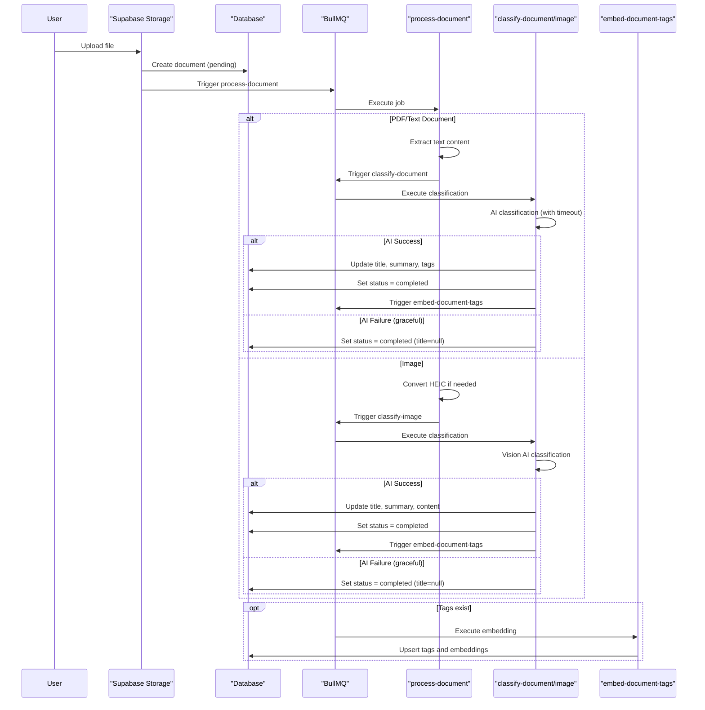
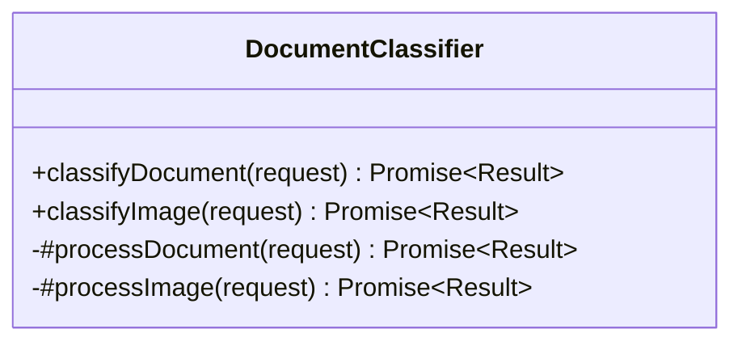
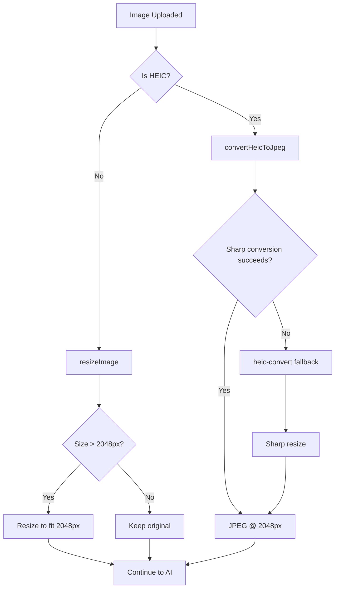
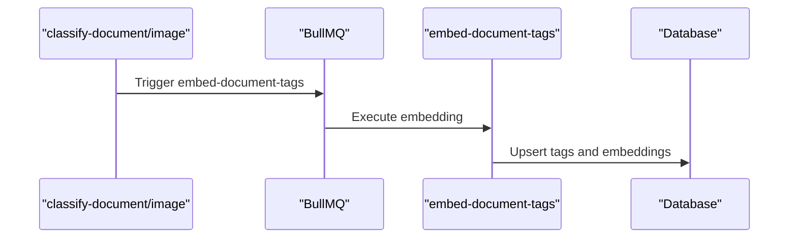
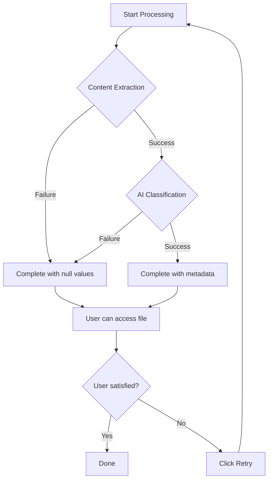
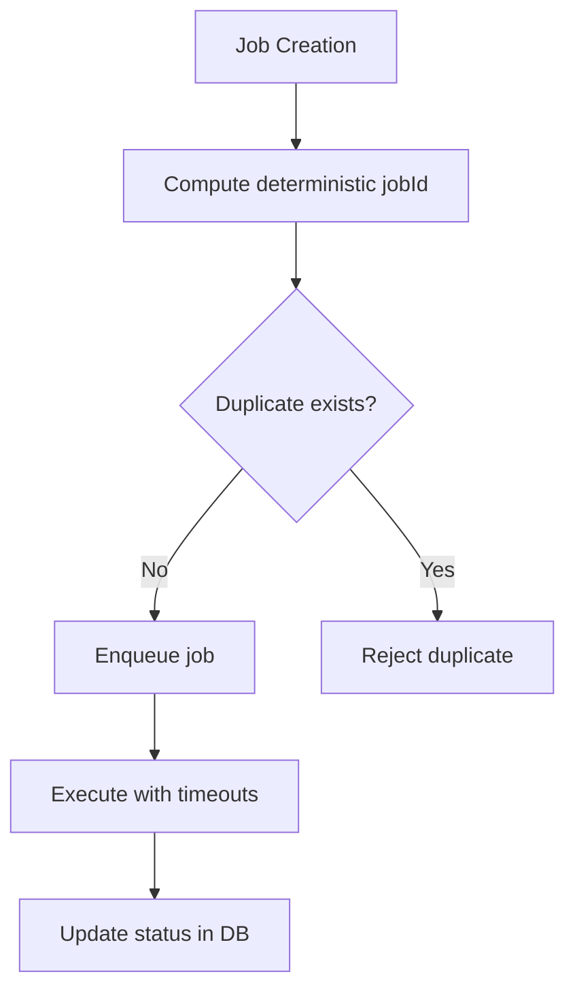
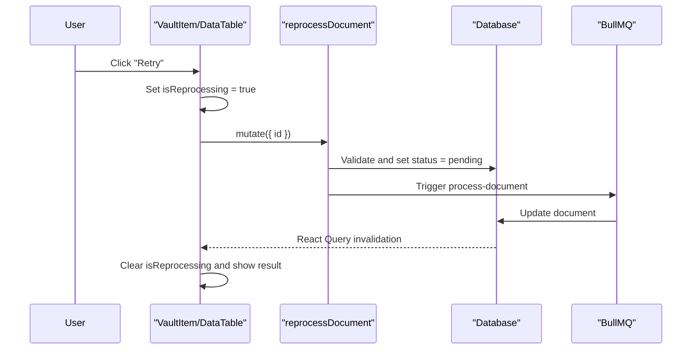
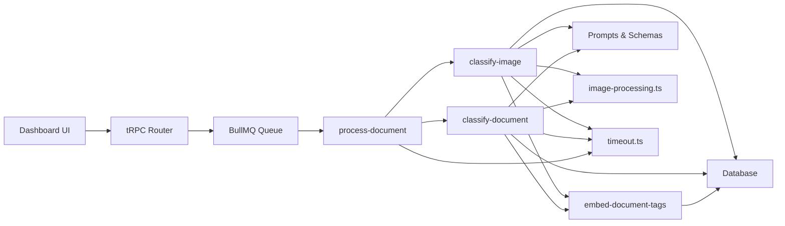

# AI-Powered Document Processing

<cite>
**Referenced Files in This Document**
- [document-processing.md](file://docs/document-processing.md)
- [classifier.ts](file://packages/documents/src/classifier/classifier.ts)
- [prompt.ts](file://packages/documents/src/prompt.ts)
- [process-document.ts](file://apps/worker/src/processors/documents/process-document.ts)
- [classify-document.ts](file://apps/worker/src/processors/documents/classify-document.ts)
- [classify-image.ts](file://apps/worker/src/processors/documents/classify-image.ts)
- [embed-document-tags.ts](file://apps/worker/src/processors/documents/embed-document-tags.ts)
- [documents.config.ts](file://apps/worker/src/queues/documents.config.ts)
- [image-processing.ts](file://apps/worker/src/utils/image-processing.ts)
- [document-update.ts](file://apps/worker/src/utils/document-update.ts)
- [error-classification.ts](file://apps/worker/src/utils/error-classification.ts)
- [timeout.ts](file://apps/worker/src/utils/timeout.ts)
- [vault-item.tsx](file://apps/dashboard/src/components/vault/vault-item.tsx)
- [columns.tsx](file://apps/dashboard/src/components/tables/vault/columns.tsx)
- [data-table.tsx](file://apps/dashboard/src/components/tables/vault/data-table.tsx)
- [documents.ts](file://apps/api/src/trpc/routers/documents.ts)
- [get-documents.ts](file://apps/api/src/ai/tools/get-documents.ts)
- [documents.ts](file://apps/api/src/mcp/tools/documents.ts)
</cite>

## Table of Contents
1. [Introduction](#introduction)
2. [Project Structure](#project-structure)
3. [Core Components](#core-components)
4. [Architecture Overview](#architecture-overview)
5. [Detailed Component Analysis](#detailed-component-analysis)
6. [Dependency Analysis](#dependency-analysis)
7. [Performance Considerations](#performance-considerations)
8. [Troubleshooting Guide](#troubleshooting-guide)
9. [Conclusion](#conclusion)
10. [Appendices](#appendices)

## Introduction
This document explains the AI-powered document processing capabilities of the system. It covers intelligent categorization and classification, data extraction techniques, OCR integration, document enrichment, machine learning models, quality assurance, confidence scoring, human-in-the-loop validation, and integrations with external AI services. It also provides practical examples of processing workflows, classification results, and enrichment outputs.

## Project Structure
The document processing system spans the dashboard UI, API layer, worker queue, and shared packages. The pipeline orchestrates file ingestion, content extraction, AI classification, and metadata enrichment with graceful degradation and retry mechanisms.

**Diagram sources**
- [vault-item.tsx](file://apps/dashboard/src/components/vault/vault-item.tsx)
- [columns.tsx](file://apps/dashboard/src/components/tables/vault/columns.tsx)
- [data-table.tsx](file://apps/dashboard/src/components/tables/vault/data-table.tsx)
- [documents.ts](file://apps/api/src/trpc/routers/documents.ts)
- [documents.ts](file://apps/api/src/mcp/tools/documents.ts)
- [get-documents.ts](file://apps/api/src/ai/tools/get-documents.ts)
- [process-document.ts](file://apps/worker/src/processors/documents/process-document.ts)
- [classify-document.ts](file://apps/worker/src/processors/documents/classify-document.ts)
- [classify-image.ts](file://apps/worker/src/processors/documents/classify-image.ts)
- [embed-document-tags.ts](file://apps/worker/src/processors/documents/embed-document-tags.ts)
- [documents.config.ts](file://apps/worker/src/queues/documents.config.ts)
- [classifier.ts](file://packages/documents/src/classifier/classifier.ts)
- [prompt.ts](file://packages/documents/src/prompt.ts)
- [image-processing.ts](file://apps/worker/src/utils/image-processing.ts)
- [timeout.ts](file://apps/worker/src/utils/timeout.ts)

**Section sources**
- [document-processing.md](file://docs/document-processing.md#L18-L70)

## Core Components
- DocumentClassifier: Implements AI classification for text and images using a generative model, with robust retry logic to ensure non-null titles.
- Prompts and Schemas: Define structured extraction prompts for invoices, receipts, and general document classification, including multilingual support and validation rules.
- Worker Jobs: Orchestrate processing, classification, and embedding with timeouts, deduplication, and graceful degradation.
- Dashboard UI: Provides status indicators, retry controls, and stale detection for user feedback.
- API and AI Tools: Expose document retrieval and filtering to AI agents and external systems via tRPC and MCP.

**Section sources**
- [classifier.ts](file://packages/documents/src/classifier/classifier.ts#L16-L139)
- [prompt.ts](file://packages/documents/src/prompt.ts#L423-L504)
- [process-document.ts](file://apps/worker/src/processors/documents/process-document.ts)
- [classify-document.ts](file://apps/worker/src/processors/documents/classify-document.ts)
- [classify-image.ts](file://apps/worker/src/processors/documents/classify-image.ts)
- [embed-document-tags.ts](file://apps/worker/src/processors/documents/embed-document-tags.ts)
- [vault-item.tsx](file://apps/dashboard/src/components/vault/vault-item.tsx)
- [columns.tsx](file://apps/dashboard/src/components/tables/vault/columns.tsx)
- [data-table.tsx](file://apps/dashboard/src/components/tables/vault/data-table.tsx)
- [documents.ts](file://apps/api/src/trpc/routers/documents.ts)
- [get-documents.ts](file://apps/api/src/ai/tools/get-documents.ts#L19-L82)
- [documents.ts](file://apps/api/src/mcp/tools/documents.ts#L13-L40)

## Architecture Overview
The system follows a queue-driven architecture with BullMQ. On file upload, the storage trigger creates a document record and enqueues a processing job. The worker orchestrates content extraction, AI classification (text or image), and optional tag embedding. The UI reflects real-time status and offers retry and stale recovery.

**Diagram sources**
- [document-processing.md](file://docs/document-processing.md#L127-L177)
- [process-document.ts](file://apps/worker/src/processors/documents/process-document.ts)
- [classify-document.ts](file://apps/worker/src/processors/documents/classify-document.ts)
- [classify-image.ts](file://apps/worker/src/processors/documents/classify-image.ts)
- [embed-document-tags.ts](file://apps/worker/src/processors/documents/embed-document-tags.ts)

## Detailed Component Analysis

### AI Classification Engine
The classification engine uses a generative model to produce structured outputs for both text and image inputs. It enforces non-null titles via explicit retry prompts and strict schemas.

**Diagram sources**
- [classifier.ts](file://packages/documents/src/classifier/classifier.ts#L16-L139)

Key behaviors:
- Text classification: Extracts title, summary, date, and tags from parsed text.
- Image classification: Extracts title, summary, visible text content, and tags from images.
- Retry logic: If the initial classification yields a null title, a stricter prompt is applied to force a descriptive title.
- Structured output: Uses JSON schema validation to ensure consistent fields.

**Section sources**
- [classifier.ts](file://packages/documents/src/classifier/classifier.ts#L16-L139)
- [prompt.ts](file://packages/documents/src/prompt.ts#L423-L504)

### Prompt Engineering and Multilingual Support
Prompts are designed for multilingual financial documents (invoices, receipts) and include:
- Few-shot examples for common layouts.
- Chain-of-thought reasoning steps.
- Field-specific extraction prompts for targeted re-extraction.
- Validation requirements and accuracy guidelines.

Examples of prompt coverage:
- Invoice extraction: vendor, invoice number, dates, totals, tax, currency, and contact info.
- Receipt extraction: merchant, date, totals, tax, currency, payment method, and contact info.
- General document classification: title, summary, date, and tags.

**Section sources**
- [prompt.ts](file://packages/documents/src/prompt.ts#L1-L167)
- [prompt.ts](file://packages/documents/src/prompt.ts#L169-L404)
- [prompt.ts](file://packages/documents/src/prompt.ts#L423-L504)

### OCR Integration and Accuracy Optimization
OCR is integrated into image classification to extract visible text for ambiguous or low-quality images. Image optimization includes:
- Resizing to a fixed maximum dimension to balance OCR quality and cost.
- HEIC conversion with fallbacks for edge cases.
- Memory-constrained processing to prevent out-of-memory errors.

**Diagram sources**
- [document-processing.md](file://docs/document-processing.md#L390-L411)
- [image-processing.ts](file://apps/worker/src/utils/image-processing.ts)

**Section sources**
- [document-processing.md](file://docs/document-processing.md#L375-L492)
- [image-processing.ts](file://apps/worker/src/utils/image-processing.ts)

### Document Enrichment and Tag Embeddings
After classification, the system generates semantic embeddings for document tags to improve searchability. The embedding job is fire-and-forget to avoid blocking the main pipeline.

**Diagram sources**
- [document-processing.md](file://docs/document-processing.md#L173-L176)
- [embed-document-tags.ts](file://apps/worker/src/processors/documents/embed-document-tags.ts)

**Section sources**
- [document-processing.md](file://docs/document-processing.md#L608-L617)
- [embed-document-tags.ts](file://apps/worker/src/processors/documents/embed-document-tags.ts)

### Quality Assurance, Confidence Scoring, and Human-in-the-Loop Validation
- Graceful degradation: Documents are marked completed even if AI classification fails, ensuring accessibility and enabling user retries.
- Stale detection: Pending documents older than a threshold show retry options in the UI.
- Error handling: Distinction between hard failures (non-recoverable) and soft failures (retryable), with categorized retry strategies.
- Human-in-the-loop: Users can reprocess failed or unclassified documents with a single click, updating status and re-running the pipeline.

**Diagram sources**
- [document-processing.md](file://docs/document-processing.md#L249-L269)

**Section sources**
- [document-processing.md](file://docs/document-processing.md#L235-L293)
- [document-processing.md](file://docs/document-processing.md#L356-L373)
- [documents.config.ts](file://apps/worker/src/queues/documents.config.ts)

### Worker Queue Configuration and Job Deduplication
- Deterministic job IDs prevent duplicate processing across triggers and retries.
- Concurrency and rate limiting protect memory and external API quotas.
- Timeouts are configured hierarchically to avoid premature parent job timeouts.

**Diagram sources**
- [document-processing.md](file://docs/document-processing.md#L180-L200)
- [documents.config.ts](file://apps/worker/src/queues/documents.config.ts)

**Section sources**
- [document-processing.md](file://docs/document-processing.md#L179-L234)
- [document-processing.md](file://docs/document-processing.md#L190-L206)
- [timeout.ts](file://apps/worker/src/utils/timeout.ts)

### UI Integration and User Experience
The dashboard components reflect processing states, provide retry actions, and handle stale documents gracefully:
- Vault Item: Shows skeleton for fresh pending, amber indicator for stale or unclassified, and retry button.
- Vault Table: Offers column styling, dropdown retry, and reprocess mutation.
- tRPC Router: Exposes reprocessDocument endpoint for user-initiated retries.

**Diagram sources**
- [document-processing.md](file://docs/document-processing.md#L295-L332)
- [vault-item.tsx](file://apps/dashboard/src/components/vault/vault-item.tsx)
- [columns.tsx](file://apps/dashboard/src/components/tables/vault/columns.tsx)
- [data-table.tsx](file://apps/dashboard/src/components/tables/vault/data-table.tsx)
- [documents.ts](file://apps/api/src/trpc/routers/documents.ts)

**Section sources**
- [vault-item.tsx](file://apps/dashboard/src/components/vault/vault-item.tsx)
- [columns.tsx](file://apps/dashboard/src/components/tables/vault/columns.tsx)
- [data-table.tsx](file://apps/dashboard/src/components/tables/vault/data-table.tsx)
- [documents.ts](file://apps/api/src/trpc/routers/documents.ts)

### External AI Services and Custom Model Training
- External AI service: The classification engine integrates with a generative AI provider via a standardized SDK interface.
- Custom model training: The prompt-driven architecture enables iterative refinement of extraction logic and schemas without changing core code, supporting custom training scenarios by adjusting prompts and validation rules.

**Section sources**
- [classifier.ts](file://packages/documents/src/classifier/classifier.ts#L1-L14)
- [prompt.ts](file://packages/documents/src/prompt.ts#L1-L504)

## Dependency Analysis
The system exhibits clear separation of concerns:
- UI depends on API for document operations and on worker for status updates.
- API depends on worker queues and database for orchestration.
- Worker jobs depend on shared classifier and prompt packages, plus image processing utilities.
- Error handling and timeouts are centralized to ensure consistent behavior.

**Diagram sources**
- [document-processing.md](file://docs/document-processing.md#L18-L70)
- [process-document.ts](file://apps/worker/src/processors/documents/process-document.ts)
- [classify-document.ts](file://apps/worker/src/processors/documents/classify-document.ts)
- [classify-image.ts](file://apps/worker/src/processors/documents/classify-image.ts)
- [embed-document-tags.ts](file://apps/worker/src/processors/documents/embed-document-tags.ts)
- [prompt.ts](file://packages/documents/src/prompt.ts)
- [image-processing.ts](file://apps/worker/src/utils/image-processing.ts)
- [timeout.ts](file://apps/worker/src/utils/timeout.ts)

**Section sources**
- [document-processing.md](file://docs/document-processing.md#L18-L70)

## Performance Considerations
- Concurrency and rate limiting: Controlled via queue configuration to avoid API bursts and memory pressure.
- Image optimization: Fixed maximum dimension and two-stage HEIC conversion reduce processing time and memory usage.
- Fire-and-forget enrichment: Embedding runs independently to avoid blocking the main pipeline.
- Timeouts: Hierarchical timeout configuration ensures reliable parent-child job coordination.

**Section sources**
- [document-processing.md](file://docs/document-processing.md#L207-L234)
- [document-processing.md](file://docs/document-processing.md#L506-L537)
- [image-processing.ts](file://apps/worker/src/utils/image-processing.ts)

## Troubleshooting Guide
Common failure categories and strategies:
- AI content blocked: Non-retryable; document remains accessible.
- Quota/exceeded: Retry after delay.
- Rate limit: Backoff and retry.
- Timeout/network: Retry with exponential backoff.
- Validation/unsupported file type: Not a failure; document marked completed.

Graceful degradation ensures documents are always reachable, with amber indicators and retry buttons guiding users.

**Section sources**
- [document-processing.md](file://docs/document-processing.md#L235-L293)
- [documents.config.ts](file://apps/worker/src/queues/documents.config.ts)
- [error-classification.ts](file://apps/worker/src/utils/error-classification.ts)

## Conclusion
The AI-powered document processing system combines robust classification, multilingual extraction, OCR-enabled image processing, and semantic enrichment with a resilient queue architecture. Its graceful degradation, retry mechanisms, and UI-driven validation deliver a reliable, accessible experience while enabling future enhancements through prompt-driven improvements and external AI integrations.

## Appendices

### Example Workflows and Outputs
- Text document workflow: Extract text → AI classification → update metadata → optional tag embedding.
- Image document workflow: Convert HEIC → resize → AI classification → update metadata → optional tag embedding.
- Classification results: Title, summary, date, and tags for both text and images.
- Enrichment outputs: Tag embeddings for improved searchability.

**Section sources**
- [document-processing.md](file://docs/document-processing.md#L125-L177)
- [prompt.ts](file://packages/documents/src/prompt.ts#L423-L504)
- [embed-document-tags.ts](file://apps/worker/src/processors/documents/embed-document-tags.ts)