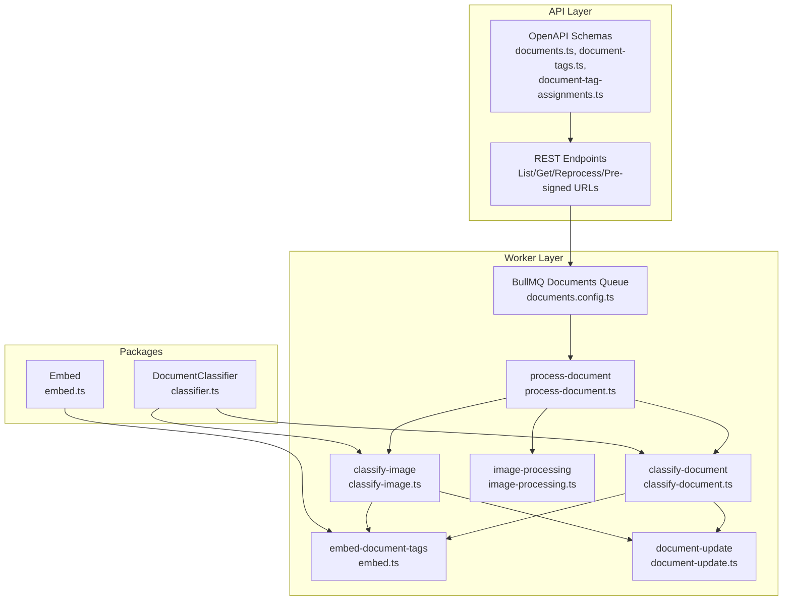
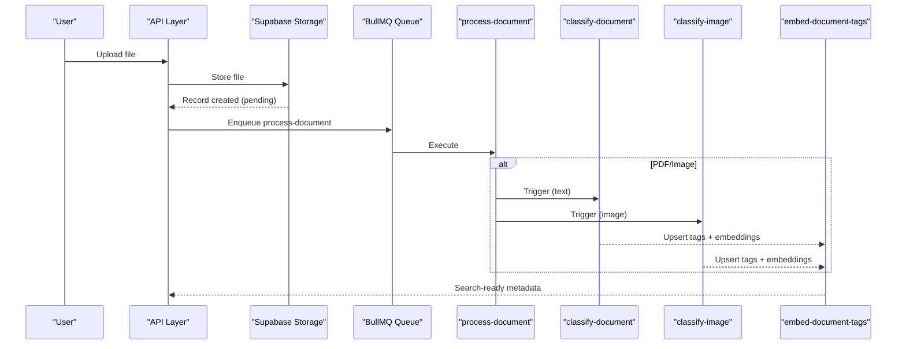
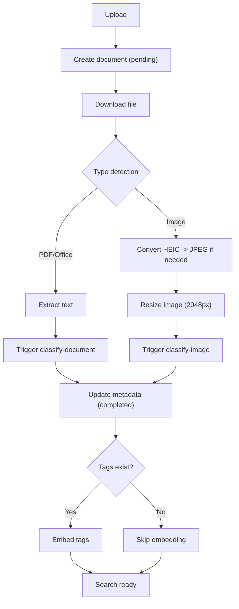
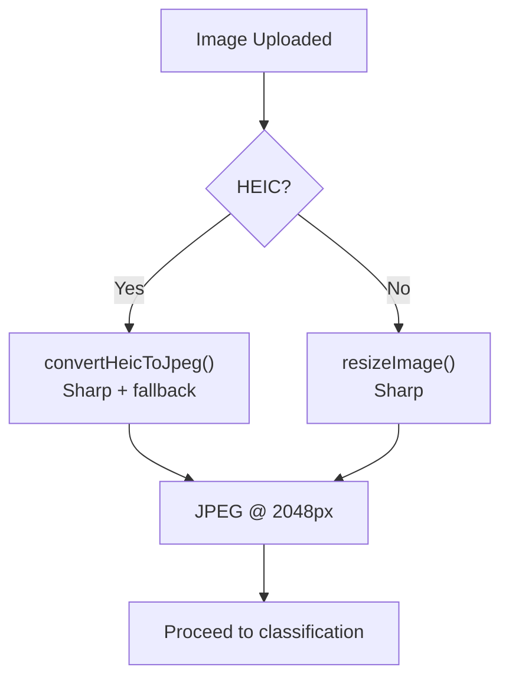
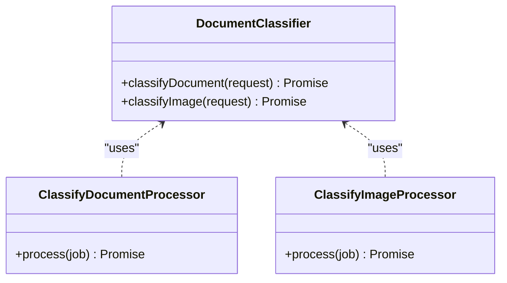
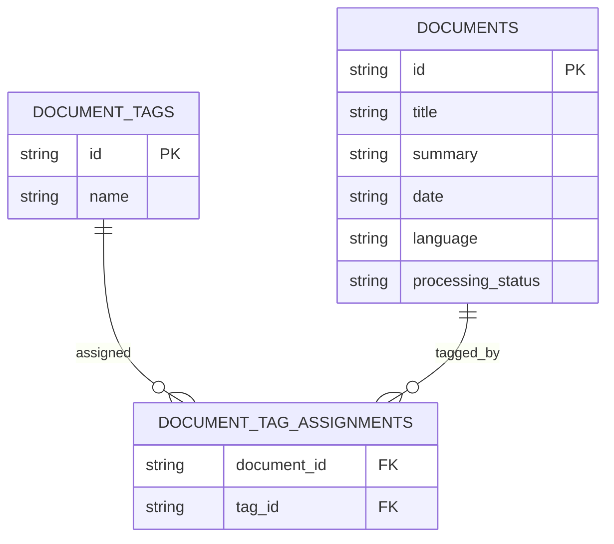
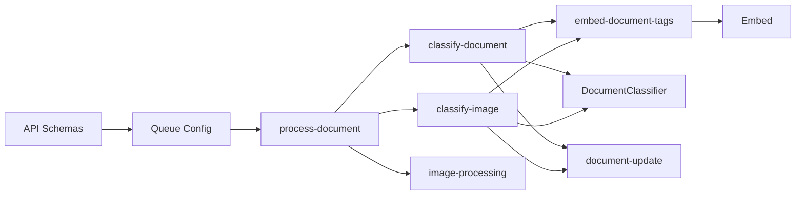

# Document Management

<cite>
**Referenced Files in This Document**
- [document-processing.md](file://midday/docs/document-processing.md)
- [classifier.ts](file://midday/packages/documents/src/classifier/classifier.ts)
- [embed.ts](file://midday/packages/documents/src/embed/embed.ts)
- [documents.ts](file://midday/apps/api/src/schemas/documents.ts)
- [document-tags.ts](file://midday/apps/api/src/schemas/document-tags.ts)
- [document-tag-assignments.ts](file://midday/apps/api/src/schemas/document-tag-assignments.ts)
- [process-document.ts](file://midday/apps/worker/src/processors/documents/process-document.ts)
- [classify-document.ts](file://midday/apps/worker/src/processors/documents/classify-document.ts)
- [classify-image.ts](file://midday/apps/worker/src/processors/documents/classify-image.ts)
- [documents.config.ts](file://midday/apps/worker/src/queues/documents.config.ts)
- [image-processing.ts](file://midday/apps/worker/src/utils/image-processing.ts)
- [document-update.ts](file://midday/apps/worker/src/utils/document-update.ts)
- [package.json](file://midday/packages/documents/package.json)
</cite>

## Table of Contents
1. [Introduction](#introduction)
2. [Project Structure](#project-structure)
3. [Core Components](#core-components)
4. [Architecture Overview](#architecture-overview)
5. [Detailed Component Analysis](#detailed-component-analysis)
6. [Dependency Analysis](#dependency-analysis)
7. [Performance Considerations](#performance-considerations)
8. [Troubleshooting Guide](#troubleshooting-guide)
9. [Conclusion](#conclusion)
10. [Appendices](#appendices)

## Introduction
This document describes Faworra’s document management system end-to-end: from upload to processing, classification, storage, and retrieval. It covers multi-format support (PDFs, images, office documents), file conversion, quality optimization, AI-powered processing (OCR, intelligent categorization, data extraction), tagging and metadata management, search capabilities, security and access controls, vault storage, versioning and audit trails, classification algorithms, quality assurance, error handling, and integrations with external sources and automated workflows.

## Project Structure
The document management system spans three layers:
- API layer: REST/OpenAPI schemas and endpoints for listing, retrieving, and reprocessing documents; signed URLs for secure access.
- Worker layer: BullMQ queues and processors implementing the document lifecycle with graceful degradation and retry strategies.
- Packages: Shared AI classification and embedding utilities.

**Diagram sources**
- [documents.ts](file://midday/apps/api/src/schemas/documents.ts#L1-L269)
- [document-tags.ts](file://midday/apps/api/src/schemas/document-tags.ts#L1-L10)
- [document-tag-assignments.ts](file://midday/apps/api/src/schemas/document-tag-assignments.ts#L1-L12)
- [documents.config.ts](file://midday/apps/worker/src/queues/documents.config.ts#L1-L198)
- [process-document.ts](file://midday/apps/worker/src/processors/documents/process-document.ts#L1-L542)
- [classify-document.ts](file://midday/apps/worker/src/processors/documents/classify-document.ts#L1-L189)
- [classify-image.ts](file://midday/apps/worker/src/processors/documents/classify-image.ts#L1-L218)
- [embed.ts](file://midday/packages/documents/src/embed/embed.ts#L1-L54)
- [image-processing.ts](file://midday/apps/worker/src/utils/image-processing.ts#L1-L210)
- [document-update.ts](file://midday/apps/worker/src/utils/document-update.ts#L1-L57)
- [classifier.ts](file://midday/packages/documents/src/classifier/classifier.ts#L1-L139)

**Section sources**
- [document-processing.md](file://midday/docs/document-processing.md#L1-L617)
- [documents.ts](file://midday/apps/api/src/schemas/documents.ts#L1-L269)
- [documents.config.ts](file://midday/apps/worker/src/queues/documents.config.ts#L1-L198)

## Core Components
- AI Classification Engine: Provides structured extraction of title, summary, date, language, and tags for both text and image content.
- Embedding Service: Generates semantic embeddings for tags to power search.
- Document Processing Pipeline: Orchestrates file ingestion, conversion, classification, and metadata persistence with graceful degradation.
- Tagging and Metadata: Supports creation, assignment, and search by tags and metadata filters.
- Access Control and Security: Signed URLs for secure, time-limited access; strict queue isolation and job deduplication.
- Search and Retrieval: OpenAPI-backed endpoints with filters for text, tags, and date ranges.

**Section sources**
- [classifier.ts](file://midday/packages/documents/src/classifier/classifier.ts#L1-L139)
- [embed.ts](file://midday/packages/documents/src/embed/embed.ts#L1-L54)
- [process-document.ts](file://midday/apps/worker/src/processors/documents/process-document.ts#L1-L542)
- [classify-document.ts](file://midday/apps/worker/src/processors/documents/classify-document.ts#L1-L189)
- [classify-image.ts](file://midday/apps/worker/src/processors/documents/classify-image.ts#L1-L218)
- [documents.ts](file://midday/apps/api/src/schemas/documents.ts#L1-L269)

## Architecture Overview
The system follows a trigger-driven ingestion model with a robust worker pipeline:
- Supabase Storage triggers create document records.
- BullMQ queues orchestrate processing stages with timeouts, deduplication, and retries.
- AI classifiers extract metadata; embeddings enrich tag search.
- Frontend surfaces status, stale detection, and retry controls.

**Diagram sources**
- [document-processing.md](file://midday/docs/document-processing.md#L18-L70)
- [process-document.ts](file://midday/apps/worker/src/processors/documents/process-document.ts#L1-L542)
- [classify-document.ts](file://midday/apps/worker/src/processors/documents/classify-document.ts#L1-L189)
- [classify-image.ts](file://midday/apps/worker/src/processors/documents/classify-image.ts#L1-L218)
- [documents.config.ts](file://midday/apps/worker/src/queues/documents.config.ts#L1-L198)

## Detailed Component Analysis

### Document Lifecycle and Processing Pipeline
- Ingestion: Supabase Storage triggers create a pending document record with path tokens and metadata.
- Processing: The worker downloads the file, detects type, converts HEIC to JPEG, resizes images, extracts text from documents, and triggers classification.
- Classification: AI extracts title, summary, date, language, and tags; results are persisted with graceful fallback to “completed” status even on soft failures.
- Embedding: Tag embeddings are generated asynchronously to improve search relevance.
- Retries: Deterministic job IDs prevent duplicates; UI and API expose retry controls; stale detection highlights stuck jobs (>10 minutes).

**Diagram sources**
- [document-processing.md](file://midday/docs/document-processing.md#L125-L177)
- [process-document.ts](file://midday/apps/worker/src/processors/documents/process-document.ts#L1-L542)
- [classify-document.ts](file://midday/apps/worker/src/processors/documents/classify-document.ts#L1-L189)
- [classify-image.ts](file://midday/apps/worker/src/processors/documents/classify-image.ts#L1-L218)
- [image-processing.ts](file://midday/apps/worker/src/utils/image-processing.ts#L1-L210)

**Section sources**
- [document-processing.md](file://midday/docs/document-processing.md#L1-L617)
- [process-document.ts](file://midday/apps/worker/src/processors/documents/process-document.ts#L1-L542)
- [classify-document.ts](file://midday/apps/worker/src/processors/documents/classify-document.ts#L1-L189)
- [classify-image.ts](file://midday/apps/worker/src/processors/documents/classify-image.ts#L1-L218)

### Multi-format Support and File Conversion
- Formats: PDF, Office documents, and images (including HEIC/HEIF) are supported.
- HEIC Conversion: Two-stage conversion using Sharp (primary) and heic-convert (fallback) to maximize compatibility; large files (>15MB) skip AI classification to avoid memory issues.
- Image Optimization: Images are resized to a maximum dimension optimized for OCR and vision models while preserving aspect ratios.

**Diagram sources**
- [process-document.ts](file://midday/apps/worker/src/processors/documents/process-document.ts#L72-L196)
- [image-processing.ts](file://midday/apps/worker/src/utils/image-processing.ts#L133-L209)

**Section sources**
- [process-document.ts](file://midday/apps/worker/src/processors/documents/process-document.ts#L1-L542)
- [image-processing.ts](file://midday/apps/worker/src/utils/image-processing.ts#L1-L210)

### AI-Powered Classification and Data Extraction
- Document Classifier: Uses a generative model to extract structured fields with retry logic for null titles.
- Image Classifier: Processes images directly with vision capabilities; falls back to descriptive titles when AI fails.
- Language Mapping: Normalizes language codes for database storage.
- Graceful Degradation: On soft failures, documents are marked completed with null metadata; users can retry.

**Diagram sources**
- [classifier.ts](file://midday/packages/documents/src/classifier/classifier.ts#L1-L139)
- [classify-document.ts](file://midday/apps/worker/src/processors/documents/classify-document.ts#L1-L189)
- [classify-image.ts](file://midday/apps/worker/src/processors/documents/classify-image.ts#L1-L218)

**Section sources**
- [classifier.ts](file://midday/packages/documents/src/classifier/classifier.ts#L1-L139)
- [classify-document.ts](file://midday/apps/worker/src/processors/documents/classify-document.ts#L1-L189)
- [classify-image.ts](file://midday/apps/worker/src/processors/documents/classify-image.ts#L1-L218)

### Tagging System and Metadata Management
- Tag Creation and Assignment: Separate schemas define creation and assignment operations.
- Tag Embeddings: Semantic embeddings are generated to improve search relevance.
- Metadata Fields: Title, summary, date, language, and content samples are stored and searchable.

**Diagram sources**
- [document-tags.ts](file://midday/apps/api/src/schemas/document-tags.ts#L1-L10)
- [document-tag-assignments.ts](file://midday/apps/api/src/schemas/document-tag-assignments.ts#L1-L12)
- [documents.ts](file://midday/apps/api/src/schemas/documents.ts#L162-L218)

**Section sources**
- [document-tags.ts](file://midday/apps/api/src/schemas/document-tags.ts#L1-L10)
- [document-tag-assignments.ts](file://midday/apps/api/src/schemas/document-tag-assignments.ts#L1-L12)
- [documents.ts](file://midday/apps/api/src/schemas/documents.ts#L1-L269)

### Search Capabilities
- Filters: Text search, tag IDs, and date range filters are supported via OpenAPI schemas.
- Results: Paginated responses with metadata and status indicators.

**Section sources**
- [documents.ts](file://midday/apps/api/src/schemas/documents.ts#L1-L269)

### Security, Encryption, and Access Controls
- Signed URLs: Pre-signed URLs with expiration windows enable secure, time-limited access to documents.
- Access Control: Queue isolation and deterministic job IDs prevent unauthorized duplication; storage triggers enforce initial state.
- Encryption: Not explicitly implemented in the analyzed files; secure access relies on signed URLs and storage permissions.

**Section sources**
- [documents.ts](file://midday/apps/api/src/schemas/documents.ts#L111-L160)
- [documents.config.ts](file://midday/apps/worker/src/queues/documents.config.ts#L1-L198)

### Vault Storage, Versioning, and Audit Trails
- Vault Storage: Files are stored in a dedicated bucket; triggers initialize records with pending status.
- Versioning: Not explicitly implemented in the analyzed files; versioning would require additional schema and storage policies.
- Audit Trails: Notifications are emitted for document upload and successful processing; job logs capture progress and outcomes.

**Section sources**
- [process-document.ts](file://midday/apps/worker/src/processors/documents/process-document.ts#L43-L63)
- [process-document.ts](file://midday/apps/worker/src/processors/documents/process-document.ts#L496-L518)
- [document-processing.md](file://midday/docs/document-processing.md#L1-L617)

### Classification Algorithms and Quality Assurance
- Classification Algorithms: Generative model-based extraction with retry logic for robustness.
- Quality Assurance: Content sampling, timeouts, and fallbacks ensure usability even when AI fails; stale detection and retry buttons surface stuck jobs.

**Section sources**
- [classifier.ts](file://midday/packages/documents/src/classifier/classifier.ts#L1-L139)
- [classify-document.ts](file://midday/apps/worker/src/processors/documents/classify-document.ts#L1-L189)
- [classify-image.ts](file://midday/apps/worker/src/processors/documents/classify-image.ts#L1-L218)
- [document-processing.md](file://midday/docs/document-processing.md#L235-L294)

### Error Handling and Retry Strategies
- Error Categories: AI quotas, rate limits, timeouts, network failures, validation, unsupported file types.
- Graceful Degradation: Documents complete with null metadata on soft failures; UI indicates retry availability.
- Final Failures: After retries, jobs mark documents failed; unsupported file types are completed without classification.

**Section sources**
- [document-processing.md](file://midday/docs/document-processing.md#L235-L294)
- [documents.config.ts](file://midday/apps/worker/src/queues/documents.config.ts#L98-L145)

### Integration with External Sources and Automated Workflows
- External Sources: Application/octet-stream files are auto-detected; otherwise, processing proceeds based on MIME type.
- Automated Workflows: BullMQ queues orchestrate sequential steps with timeouts and deterministic IDs; notifications integrate with broader systems.

**Section sources**
- [process-document.ts](file://midday/apps/worker/src/processors/documents/process-document.ts#L233-L297)
- [documents.config.ts](file://midday/apps/worker/src/queues/documents.config.ts#L1-L198)

### Examples

#### Example: Document Upload, Processing, Categorization, and Retrieval
- Upload: User uploads a PDF or image; storage creates a pending document record.
- Processing: Worker downloads, detects type, converts HEIC if needed, resizes images, extracts text, triggers classification, and persists metadata.
- Categorization: AI extracts title, summary, date, language, and tags; embeddings are generated for tag search.
- Retrieval: API lists documents with filters; signed URLs provide secure access.

**Section sources**
- [document-processing.md](file://midday/docs/document-processing.md#L125-L177)
- [documents.ts](file://midday/apps/api/src/schemas/documents.ts#L1-L269)

## Dependency Analysis
The system leverages shared packages for AI classification and embeddings, ensuring consistent behavior across workers and minimizing duplication.

**Diagram sources**
- [documents.ts](file://midday/apps/api/src/schemas/documents.ts#L1-L269)
- [documents.config.ts](file://midday/apps/worker/src/queues/documents.config.ts#L1-L198)
- [process-document.ts](file://midday/apps/worker/src/processors/documents/process-document.ts#L1-L542)
- [classify-document.ts](file://midday/apps/worker/src/processors/documents/classify-document.ts#L1-L189)
- [classify-image.ts](file://midday/apps/worker/src/processors/documents/classify-image.ts#L1-L218)
- [embed.ts](file://midday/packages/documents/src/embed/embed.ts#L1-L54)
- [classifier.ts](file://midday/packages/documents/src/classifier/classifier.ts#L1-L139)
- [image-processing.ts](file://midday/apps/worker/src/utils/image-processing.ts#L1-L210)
- [document-update.ts](file://midday/apps/worker/src/utils/document-update.ts#L1-L57)

**Section sources**
- [package.json](file://midday/packages/documents/package.json#L1-L39)

## Performance Considerations
- Concurrency and Rate Limits: Worker concurrency is tuned conservatively to balance memory usage and API rate limits.
- Memory Optimization: Sharp caching and concurrency limits mitigate out-of-memory risks during HEIC conversion and image processing.
- Timeouts: Hierarchical timeouts ensure parent jobs wait for child jobs without premature failure.
- Image Optimization: Resizing to a fixed maximum dimension improves OCR quality and reduces token costs.

**Section sources**
- [documents.config.ts](file://midday/apps/worker/src/queues/documents.config.ts#L32-L52)
- [image-processing.ts](file://midday/apps/worker/src/utils/image-processing.ts#L6-L9)
- [document-processing.md](file://midday/docs/document-processing.md#L506-L536)

## Troubleshooting Guide
- Stuck Jobs: Pending documents older than the stale threshold show retry options in the UI.
- Soft Failures: If AI classification fails, documents remain accessible with a retry button; title remains null until reprocessed.
- Hard Failures: After all retries, documents are marked failed; investigate logs and job IDs.
- Unsupported File Types: Files that cannot be processed are completed without classification; UI shows a descriptive summary.
- Race Conditions: Document updates use retry logic to handle timing between storage triggers and job execution.

**Section sources**
- [document-processing.md](file://midday/docs/document-processing.md#L356-L373)
- [documents.config.ts](file://midday/apps/worker/src/queues/documents.config.ts#L98-L145)
- [document-update.ts](file://midday/apps/worker/src/utils/document-update.ts#L1-L57)

## Conclusion
Faworra’s document management system provides a resilient, AI-enhanced pipeline that supports diverse formats, optimizes quality, and ensures accessibility through graceful degradation and robust retry mechanisms. The combination of structured metadata, tag embeddings, and secure access patterns enables efficient search, categorization, and retrieval across the vault.

## Appendices

### API Endpoints and Schemas
- List Documents: Supports pagination, sorting, text search, tag filters, and date ranges.
- Get Document: Retrieve a single document by ID or file path.
- Reprocess Document: Force re-run classification for a given document ID.
- Pre-signed URLs: Secure, time-limited access to documents.

**Section sources**
- [documents.ts](file://midday/apps/api/src/schemas/documents.ts#L1-L269)