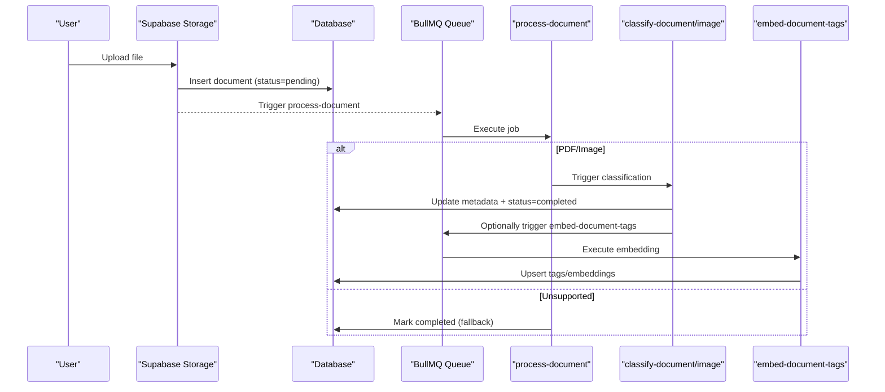
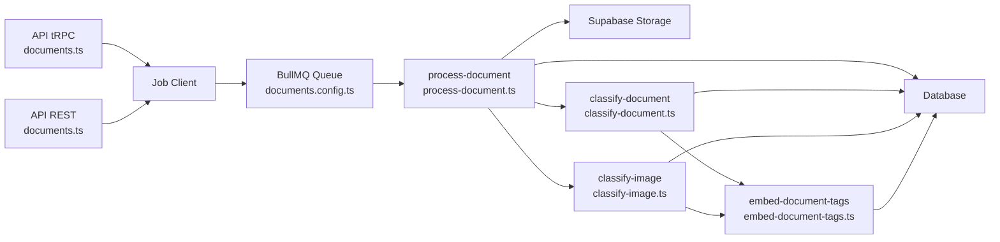

# Document Upload & Processing

<cite>
**Referenced Files in This Document**
- [document-processing.md](file://docs/document-processing.md)
- [documents.ts](file://apps/api/src/trpc/routers/documents.ts)
- [documents.ts](file://apps/api/src/rest/routers/documents.ts)
- [documents.ts](file://apps/api/src/schemas/documents.ts)
- [process-document.ts](file://apps/worker/src/processors/documents/process-document.ts)
- [classify-document.ts](file://apps/worker/src/processors/documents/classify-document.ts)
- [classify-image.ts](file://apps/worker/src/processors/documents/classify-image.ts)
- [embed-document-tags.ts](file://apps/worker/src/processors/documents/embed-document-tags.ts)
- [documents.config.ts](file://apps/worker/src/queues/documents.config.ts)
- [image-processing.ts](file://apps/worker/src/utils/image-processing.ts)
- [index.ts](file://packages/documents/src/index.ts)
</cite>

## Table of Contents
1. [Introduction](#introduction)
2. [Project Structure](#project-structure)
3. [Core Components](#core-components)
4. [Architecture Overview](#architecture-overview)
5. [Detailed Component Analysis](#detailed-component-analysis)
6. [Dependency Analysis](#dependency-analysis)
7. [Performance Considerations](#performance-considerations)
8. [Troubleshooting Guide](#troubleshooting-guide)
9. [Conclusion](#conclusion)
10. [Appendices](#appendices)

## Introduction
This document explains the complete document upload and processing system in the platform. It covers the end-to-end pipeline from file reception to processed document storage, including multi-format support (PDF, images, HEIC), validation and limits, OCR and text extraction, AI-powered classification, tag embeddings, storage integration with Supabase, and robust error handling with graceful degradation. It also includes examples of upload endpoints, processing workflows, and security measures.

## Project Structure
The system spans three layers:
- API layer: exposes endpoints for listing, retrieving, deleting, generating pre-signed URLs, and triggering processing/reprocessing.
- Worker layer: processes jobs asynchronously using BullMQ to orchestrate document/image handling, AI classification, and tag embeddings.
- Storage layer: Supabase Storage (bucket “vault”) persists files and triggers processing workflows.

```mermaid
graph TB
subgraph "API Layer"
TRPC["tRPC Router<br/>documents.ts"]
REST["REST Router<br/>documents.ts"]
SCHEMA["Schemas<br/>documents.ts"]
end
subgraph "Worker Layer"
QUEUE["BullMQ Queue<br/>documents.config.ts"]
PROC["process-document<br/>process-document.ts"]
CLDOC["classify-document<br/>classify-document.ts"]
CLIMG["classify-image<br/>classify-image.ts"]
EMBED["embed-document-tags<br/>embed-document-tags.ts"]
end
subgraph "Storage"
BUCKET["Supabase Storage<br/>bucket: vault"]
end
TRPC --> QUEUE
REST --> QUEUE
QUEUE --> PROC
PROC --> CLDOC
PROC --> CLIMG
CLDOC --> EMBED
CLIMG --> EMBED
BUCKET <- --> PROC
BUCKET <- --> CLIMG
```

**Diagram sources**
- [documents.ts](file://apps/api/src/trpc/routers/documents.ts#L91-L138)
- [documents.ts](file://apps/api/src/rest/routers/documents.ts#L109-L218)
- [documents.ts](file://apps/api/src/schemas/documents.ts#L103-L109)
- [documents.config.ts](file://apps/worker/src/queues/documents.config.ts#L152-L197)
- [process-document.ts](file://apps/worker/src/processors/documents/process-document.ts#L28-L542)
- [classify-document.ts](file://apps/worker/src/processors/documents/classify-document.ts#L27-L189)
- [classify-image.ts](file://apps/worker/src/processors/documents/classify-image.ts#L31-L218)
- [embed-document-tags.ts](file://apps/worker/src/processors/documents/embed-document-tags.ts#L19-L141)

**Section sources**
- [document-processing.md](file://docs/document-processing.md#L18-L70)
- [documents.ts](file://apps/api/src/trpc/routers/documents.ts#L26-L244)
- [documents.ts](file://apps/api/src/rest/routers/documents.ts#L28-L257)
- [documents.ts](file://apps/api/src/schemas/documents.ts#L1-L269)
- [documents.config.ts](file://apps/worker/src/queues/documents.config.ts#L14-L52)

## Core Components
- API endpoints:
  - List/get documents, delete document, generate pre-signed URLs, and trigger processing/reprocessing.
- Worker processors:
  - Orchestration of document/image processing, AI classification, and tag embeddings.
- Storage:
  - Supabase Storage bucket “vault” for file persistence and retrieval.
- Utilities:
  - Image resizing and HEIC conversion, timeout management, and error classification.

**Section sources**
- [documents.ts](file://apps/api/src/trpc/routers/documents.ts#L91-L244)
- [documents.ts](file://apps/api/src/rest/routers/documents.ts#L109-L218)
- [process-document.ts](file://apps/worker/src/processors/documents/process-document.ts#L28-L542)
- [classify-document.ts](file://apps/worker/src/processors/documents/classify-document.ts#L27-L189)
- [classify-image.ts](file://apps/worker/src/processors/documents/classify-image.ts#L31-L218)
- [embed-document-tags.ts](file://apps/worker/src/processors/documents/embed-document-tags.ts#L19-L141)
- [image-processing.ts](file://apps/worker/src/utils/image-processing.ts#L1-L210)

## Architecture Overview
The system follows a trigger-driven pipeline:
- Files are uploaded to the “vault” bucket.
- On upload, the database record is created in a pending state.
- A BullMQ job (“process-document”) is triggered to handle the file.
- Depending on the file type, the processor either extracts text (PDFs/images) or performs AI vision classification.
- AI classification results are persisted, and optional tag embeddings are generated.
- Users can retry processing or classification at any time.



**Diagram sources**
- [document-processing.md](file://docs/document-processing.md#L127-L177)
- [process-document.ts](file://apps/worker/src/processors/documents/process-document.ts#L304-L331)
- [classify-document.ts](file://apps/worker/src/processors/documents/classify-document.ts#L47-L64)
- [classify-image.ts](file://apps/worker/src/processors/documents/classify-image.ts#L71-L92)
- [embed-document-tags.ts](file://apps/worker/src/processors/documents/embed-document-tags.ts#L30-L95)

## Detailed Component Analysis

### API Endpoints and Validation
- tRPC router:
  - processDocument: filters supported MIME types, marks unsupported as completed, and enqueues “process-document” jobs with deterministic IDs.
  - reprocessDocument: validates pathTokens, checks MIME type support, resets status to pending, and enqueues a unique “process-document” job.
  - signedUrl/singedUrls: generates short-lived pre-signed URLs for secure access.
- REST router:
  - Provides list/get/delete endpoints and a pre-signed URL endpoint with explicit scopes and validations.

Validation and limits:
- MIME type filtering occurs before job creation.
- Pre-signed URL generation requires a valid document and pathTokens; returns appropriate HTTP statuses.

**Section sources**
- [documents.ts](file://apps/api/src/trpc/routers/documents.ts#L91-L138)
- [documents.ts](file://apps/api/src/trpc/routers/documents.ts#L140-L212)
- [documents.ts](file://apps/api/src/trpc/routers/documents.ts#L214-L242)
- [documents.ts](file://apps/api/src/rest/routers/documents.ts#L109-L218)
- [documents.ts](file://apps/api/src/schemas/documents.ts#L103-L109)

### Worker Orchestration: process-document
Responsibilities:
- Downloads file from storage.
- Detects and normalizes MIME types (including application/octet-stream).
- Supports HEIC conversion with graceful fallback and large-file thresholds.
- Triggers AI classification for text or images.
- Updates document status with graceful degradation (null metadata allowed).
- Emits notifications on success/failure.

Key behaviors:
- Deterministic job IDs for initial processing to prevent duplicates.
- Unique timestamps for reprocessing to ensure new jobs are created.
- Timeouts for downloads/uploads and content parsing to avoid hangs.
- Progress milestones logged for observability.

**Section sources**
- [process-document.ts](file://apps/worker/src/processors/documents/process-document.ts#L28-L542)
- [documents.config.ts](file://apps/worker/src/queues/documents.config.ts#L152-L197)

### AI Classification: classify-document and classify-image
- classify-document:
  - Extracts content sample, calls AI classifier, and applies graceful fallbacks (empty titles generate inferred titles).
  - Always marks as completed to keep documents accessible.
  - Triggers tag embedding when tags are present.
- classify-image:
  - Resizes images to an optimal maximum dimension for OCR and cost efficiency.
  - Performs AI vision classification with graceful fallbacks.
  - Always marks as completed to keep documents accessible.
  - Triggers tag embedding when tags are present.

Graceful degradation:
- If AI fails or content is empty, the document is marked completed with null metadata, enabling user access and retry.

**Section sources**
- [classify-document.ts](file://apps/worker/src/processors/documents/classify-document.ts#L27-L189)
- [classify-image.ts](file://apps/worker/src/processors/documents/classify-image.ts#L31-L218)
- [image-processing.ts](file://apps/worker/src/utils/image-processing.ts#L57-L118)

### Tag Embeddings: embed-document-tags
- Generates embeddings for new tags, upserts tag records, and assigns tags to the document.
- Designed as a fire-and-forget enrichment step; failures do not mark the document as failed.

**Section sources**
- [embed-document-tags.ts](file://apps/worker/src/processors/documents/embed-document-tags.ts#L19-L141)

### Storage Integration and Security
- Storage: Supabase Storage bucket “vault”.
- Access: Pre-signed URLs with short expiration windows (e.g., 60 seconds) for secure, time-limited access.
- Upload flow: Files land in the bucket and trigger database creation and job processing.

Security measures:
- Pre-signed URLs minimize exposure by limiting lifetime and optionally forcing download.
- Scope-based access controls on API endpoints.
- Deterministic job IDs prevent duplicate processing while allowing controlled retries.

**Section sources**
- [documents.ts](file://apps/api/src/rest/routers/documents.ts#L160-L217)
- [documents.ts](file://apps/api/src/trpc/routers/documents.ts#L214-L242)
- [documents.ts](file://apps/api/src/schemas/documents.ts#L111-L160)

### Error Handling and Retries
- Queue-level retries with exponential backoff and final failure handling.
- Unsupported file types are treated as completed with a fallback title rather than failed.
- Final failure updates document status to failed only after all retries are exhausted.
- Stale detection highlights documents pending for more than 10 minutes, enabling user-triggered retries.

**Section sources**
- [documents.config.ts](file://apps/worker/src/queues/documents.config.ts#L163-L195)
- [document-processing.md](file://docs/document-processing.md#L235-L293)
- [document-processing.md](file://docs/document-processing.md#L356-L373)

## Dependency Analysis


**Diagram sources**
- [documents.ts](file://apps/api/src/trpc/routers/documents.ts#L22-L24)
- [documents.ts](file://apps/api/src/rest/routers/documents.ts#L20-L26)
- [documents.config.ts](file://apps/worker/src/queues/documents.config.ts#L152-L197)
- [process-document.ts](file://apps/worker/src/processors/documents/process-document.ts#L6-L22)
- [classify-document.ts](file://apps/worker/src/processors/documents/classify-document.ts#L1-L9)
- [classify-image.ts](file://apps/worker/src/processors/documents/classify-image.ts#L1-L12)
- [embed-document-tags.ts](file://apps/worker/src/processors/documents/embed-document-tags.ts#L1-L13)

**Section sources**
- [documents.ts](file://apps/api/src/trpc/routers/documents.ts#L11-L24)
- [documents.ts](file://apps/api/src/rest/routers/documents.ts#L1-L28)
- [documents.config.ts](file://apps/worker/src/queues/documents.config.ts#L14-L52)

## Performance Considerations
- Concurrency and rate limiting:
  - Worker concurrency tuned to memory constraints and AI API rate limits.
  - Global limiter throttles job throughput to prevent bursts.
- Memory optimization:
  - Sharp cache and concurrency limits configured to prevent out-of-memory errors.
  - HEIC conversion falls back to heic-convert with reduced quality to balance memory and performance.
- Timeouts:
  - Strict timeouts for downloads/uploads, parsing, AI classification, and embeddings to avoid resource starvation.
- Image optimization:
  - Images resized to a fixed maximum dimension to improve OCR quality and reduce token costs.

**Section sources**
- [documents.config.ts](file://apps/worker/src/queues/documents.config.ts#L32-L52)
- [image-processing.ts](file://apps/worker/src/utils/image-processing.ts#L6-L9)
- [image-processing.ts](file://apps/worker/src/utils/image-processing.ts#L133-L209)
- [document-processing.md](file://docs/document-processing.md#L506-L530)

## Troubleshooting Guide
Common scenarios and resolutions:
- Corrupted or unsupported files:
  - Unsupported file types are marked completed with a fallback title; no hard failure.
  - Large HEIC files (> threshold) skip AI classification and complete with filename summary.
- Stuck jobs:
  - Documents pending for more than 10 minutes are considered stale; users can retry via UI or API.
- AI failures:
  - Classification failures result in completed documents with null metadata; users can retry.
- Storage/network errors:
  - Queue retries with exponential backoff; final failure updates status to failed after all attempts.

Operational tips:
- Use reprocessDocument to retry classification or processing.
- Monitor job logs for progress milestones and error messages.
- Verify MIME type support and pathTokens before triggering jobs.

**Section sources**
- [documents.config.ts](file://apps/worker/src/queues/documents.config.ts#L58-L93)
- [process-document.ts](file://apps/worker/src/processors/documents/process-document.ts#L105-L130)
- [process-document.ts](file://apps/worker/src/processors/documents/process-document.ts#L168-L196)
- [document-processing.md](file://docs/document-processing.md#L356-L373)

## Conclusion
The document upload and processing system is designed for reliability and accessibility. It supports multiple formats, validates inputs, resists failure through graceful degradation, and integrates securely with Supabase Storage. The asynchronous job architecture, combined with timeouts, memory safeguards, and retry strategies, ensures robust processing even under adverse conditions.

## Appendices

### Upload Endpoints and Examples
- tRPC:
  - processDocument: Enqueue processing for supported files; unsupported files are marked completed.
  - reprocessDocument: Reset status to pending and enqueue a new job for retry.
  - signedUrl/singedUrls: Generate short-lived pre-signed URLs for secure access.
- REST:
  - GET /documents, GET /documents/{id}, DELETE /documents/{id}, POST /documents/{id}/presigned-url.

**Section sources**
- [documents.ts](file://apps/api/src/trpc/routers/documents.ts#L91-L242)
- [documents.ts](file://apps/api/src/rest/routers/documents.ts#L30-L218)
- [documents.ts](file://apps/api/src/schemas/documents.ts#L103-L160)

### Processing Workflows
- PDF/Image text extraction and AI classification.
- Image vision classification with resizing and fallbacks.
- Tag embedding enrichment (non-critical).

**Section sources**
- [process-document.ts](file://apps/worker/src/processors/documents/process-document.ts#L333-L494)
- [classify-document.ts](file://apps/worker/src/processors/documents/classify-document.ts#L47-L144)
- [classify-image.ts](file://apps/worker/src/processors/documents/classify-image.ts#L71-L178)
- [embed-document-tags.ts](file://apps/worker/src/processors/documents/embed-document-tags.ts#L56-L104)

### Storage Configurations
- Bucket: “vault”
- Pre-signed URL expiration: short-lived (e.g., 60 seconds)
- Access control: scoped endpoints and admin client for URL generation

**Section sources**
- [documents.ts](file://apps/api/src/rest/routers/documents.ts#L180-L217)
- [documents.ts](file://apps/api/src/trpc/routers/documents.ts#L214-L242)