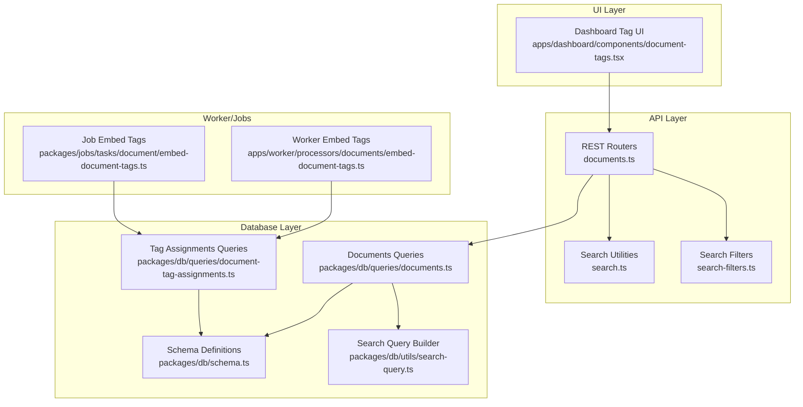
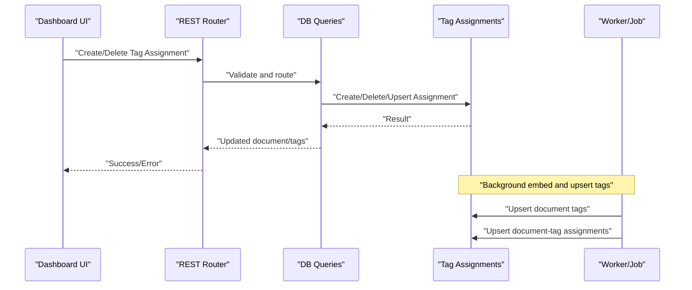
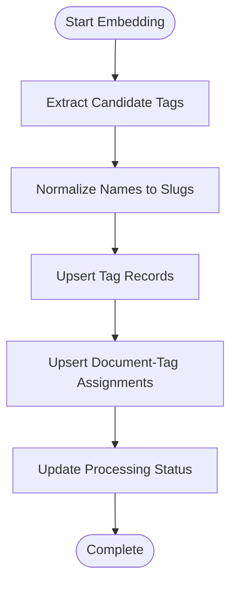
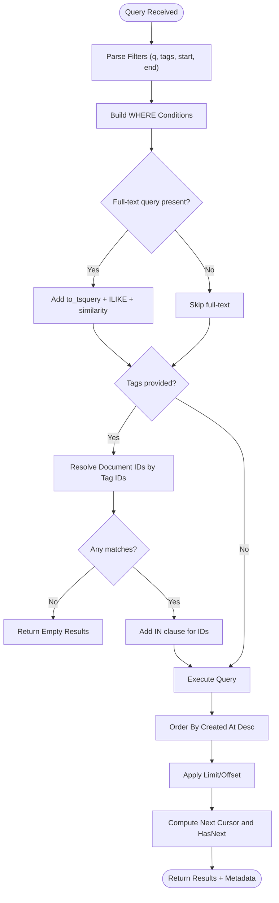
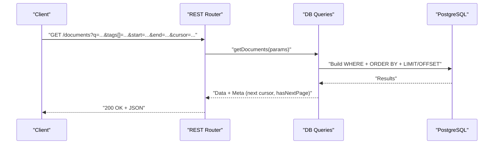
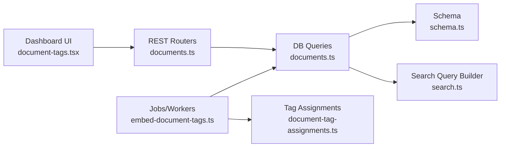

# Search & Tagging System

<cite>
**Referenced Files in This Document**
- [documents.ts](file://midday/packages/db/src/queries/documents.ts)
- [document-tag-assignments.ts](file://midday/packages/db/src/queries/document-tag-assignments.ts)
- [document-tag-assignments.ts](file://midday/apps/api/src/schemas/document-tag-assignments.ts)
- [embed-document-tags.ts](file://midday/packages/jobs/src/tasks/document/embed-document-tags.ts)
- [embed-document-tags.ts](file://midday/apps/worker/src/processors/documents/embed-document-tags.ts)
- [document-tags.tsx](file://midday/apps/dashboard/src/components/document-tags.tsx)
- [documents.ts](file://midday/apps/api/src/rest/routers/documents.ts)
- [search.ts](file://midday/apps/api/src/utils/search.ts)
- [search-filters.ts](file://midday/apps/api/src/utils/search-filters.ts)
- [search.ts](file://midday/packages/db/src/utils/search-query.ts)
- [documents.ts](file://midday/packages/db/src/schema.ts)
</cite>

## Table of Contents
1. [Introduction](#introduction)
2. [Project Structure](#project-structure)
3. [Core Components](#core-components)
4. [Architecture Overview](#architecture-overview)
5. [Detailed Component Analysis](#detailed-component-analysis)
6. [Dependency Analysis](#dependency-analysis)
7. [Performance Considerations](#performance-considerations)
8. [Troubleshooting Guide](#troubleshooting-guide)
9. [Conclusion](#conclusion)
10. [Appendices](#appendices)

## Introduction
This document describes the document search and tagging system, covering tag hierarchies, assignment workflows, dynamic tag generation, full-text search, faceted filtering, relevance ranking, metadata extraction and indexing, tag recommendation/auto-categorization, search API endpoints, query syntax, filtering capabilities, performance optimizations, and integration with external search engines and custom configurations.

## Project Structure
The search and tagging system spans multiple layers:
- Database queries and schema define storage, indexing, and retrieval logic
- Worker/job processors handle asynchronous embedding and tag assignment
- API utilities provide search parsing and filters
- Dashboard components expose tag assignment UI
- REST routers expose search endpoints

**Diagram sources**
- [documents.ts](file://midday/apps/api/src/rest/routers/documents.ts)
- [search.ts](file://midday/apps/api/src/utils/search.ts)
- [search-filters.ts](file://midday/apps/api/src/utils/search-filters.ts)
- [documents.ts](file://midday/packages/db/src/queries/documents.ts)
- [document-tag-assignments.ts](file://midday/packages/db/src/queries/document-tag-assignments.ts)
- [search.ts](file://midday/packages/db/src/utils/search-query.ts)
- [embed-document-tags.ts](file://midday/packages/jobs/src/tasks/document/embed-document-tags.ts)
- [embed-document-tags.ts](file://midday/apps/worker/src/processors/documents/embed-document-tags.ts)
- [document-tags.tsx](file://midday/apps/dashboard/src/components/document-tags.tsx)

**Section sources**
- [documents.ts](file://midday/packages/db/src/queries/documents.ts#L1-L493)
- [document-tag-assignments.ts](file://midday/packages/db/src/queries/document-tag-assignments.ts#L1-L72)
- [embed-document-tags.ts](file://midday/packages/jobs/src/tasks/document/embed-document-tags.ts#L80-L118)
- [embed-document-tags.ts](file://midday/apps/worker/src/processors/documents/embed-document-tags.ts#L115-L140)
- [document-tags.tsx](file://midday/apps/dashboard/src/components/document-tags.tsx#L1-L82)
- [documents.ts](file://midday/apps/api/src/rest/routers/documents.ts)
- [search.ts](file://midday/apps/api/src/utils/search.ts)
- [search-filters.ts](file://midday/apps/api/src/utils/search-filters.ts)
- [search.ts](file://midday/packages/db/src/utils/search-query.ts)

## Core Components
- Documents query engine: supports pagination, full-text search, date range filtering, tag-based faceting, and similarity matching
- Tag assignment engine: creates, deletes, and upserts document-tag assignments
- Dynamic tag generation: job/worker embeds tags and upserts tag records and assignments
- Search utilities: parse and normalize search queries and filters
- Dashboard UI: allows selecting/removing tags for documents via mutations

**Section sources**
- [documents.ts](file://midday/packages/db/src/queries/documents.ts#L60-L163)
- [document-tag-assignments.ts](file://midday/packages/db/src/queries/document-tag-assignments.ts#L11-L72)
- [embed-document-tags.ts](file://midday/packages/jobs/src/tasks/document/embed-document-tags.ts#L80-L118)
- [search.ts](file://midday/apps/api/src/utils/search.ts)
- [search-filters.ts](file://midday/apps/api/src/utils/search-filters.ts)
- [document-tags.tsx](file://midday/apps/dashboard/src/components/document-tags.tsx#L17-L82)

## Architecture Overview
The system integrates UI, API, database, and background processing:
- UI triggers tag assignment mutations
- API routes validate requests and delegate to database queries
- Database queries apply full-text search, tag faceting, and pagination
- Background workers/jobs extract and embed tags, upsert tag records, and assign them to documents

**Diagram sources**
- [document-tags.tsx](file://midday/apps/dashboard/src/components/document-tags.tsx#L17-L82)
- [documents.ts](file://midday/apps/api/src/rest/routers/documents.ts)
- [documents.ts](file://midday/packages/db/src/queries/documents.ts#L60-L163)
- [document-tag-assignments.ts](file://midday/packages/db/src/queries/document-tag-assignments.ts#L11-L72)
- [embed-document-tags.ts](file://midday/packages/jobs/src/tasks/document/embed-document-tags.ts#L80-L118)
- [embed-document-tags.ts](file://midday/apps/worker/src/processors/documents/embed-document-tags.ts#L115-L140)

## Detailed Component Analysis

### Tagging Architecture and Workflows
- Tag hierarchy: The system stores hierarchical tag slugs via tag records and assigns them to documents through assignments. Tag slugs enable hierarchical categorization and efficient filtering.
- Assignment workflows:
  - Create assignment: insert a record linking documentId, tagId, and teamId
  - Delete assignment: remove a specific document-tag relationship
  - Upsert assignments: insert without duplicates using composite constraint
- Dynamic tag generation:
  - Jobs/workers extract candidate tags from processed documents
  - Upsert tag records to ensure uniqueness by name and teamId
  - Upsert assignments to link extracted tags to the document
  - Update document processing status to completed upon successful assignment

**Diagram sources**
- [embed-document-tags.ts](file://midday/packages/jobs/src/tasks/document/embed-document-tags.ts#L80-L118)
- [embed-document-tags.ts](file://midday/apps/worker/src/processors/documents/embed-document-tags.ts#L115-L140)
- [document-tag-assignments.ts](file://midday/packages/db/src/queries/document-tag-assignments.ts#L57-L72)

**Section sources**
- [document-tag-assignments.ts](file://midday/packages/db/src/queries/document-tag-assignments.ts#L1-L72)
- [embed-document-tags.ts](file://midday/packages/jobs/src/tasks/document/embed-document-tags.ts#L80-L118)
- [embed-document-tags.ts](file://midday/apps/worker/src/processors/documents/embed-document-tags.ts#L115-L140)

### Search Functionality: Full-Text, Faceted Filtering, Relevance Ranking
- Full-text search:
  - Uses PostgreSQL to_tsquery with websearch against an ftsEnglish field
  - Combines exact filename matching and trigram similarity for robust recall
- Date range filtering:
  - Applies start/end date boundaries to document timestamps
- Tag-based faceting:
  - Resolves document IDs matching selected tag IDs
  - Short-circuits to empty results if no matches
- Pagination:
  - Cursor-based offset pagination with next/hasNextPage metadata
- Relevance ranking:
  - Orders by document creation time (newest first)
  - Full-text ranking leverages PostgreSQL ts_rank ordering implicitly via query planner

**Diagram sources**
- [documents.ts](file://midday/packages/db/src/queries/documents.ts#L60-L163)
- [search.ts](file://midday/packages/db/src/utils/search-query.ts)

**Section sources**
- [documents.ts](file://midday/packages/db/src/queries/documents.ts#L60-L163)
- [search.ts](file://midday/packages/db/src/utils/search-query.ts)

### Metadata Extraction and Indexing
- Metadata fields:
  - Documents include metadata JSON, pathTokens, processingStatus, and indexed ftsEnglish for full-text search
- Indexing strategy:
  - PostgreSQL GIN index on ftsEnglish enables fast websearch
  - Filename similarity uses trigram indexes for ILIKE and similarity matching
  - Tag assignments indexed by documentId and tagId for efficient faceting
- Extraction pipeline:
  - Workers/jobs compute normalized tags and embeddings, then upsert tags and assignments

**Section sources**
- [documents.ts](file://midday/packages/db/src/queries/documents.ts#L126-L149)
- [documents.ts](file://midday/packages/db/src/schema.ts)

### Tag Recommendation and Auto-Categorization
- Recommendation mechanism:
  - Background jobs/workers propose tags based on document content
  - Tags are normalized to unique slugs and upserted
  - Assignments are created without duplication
- Auto-categorization:
  - Automatic assignment occurs after successful tag extraction and upsert
  - Processing status transitions to completed upon success

**Section sources**
- [embed-document-tags.ts](file://midday/packages/jobs/src/tasks/document/embed-document-tags.ts#L80-L118)
- [embed-document-tags.ts](file://midday/apps/worker/src/processors/documents/embed-document-tags.ts#L115-L140)

### Search API Endpoints, Query Syntax, and Filtering
- Endpoint: GET /documents with query parameters
- Query parameters:
  - q: full-text search query
  - tags: array of tag IDs for faceted filtering
  - start/end: ISO date range for document dates
  - cursor: pagination offset
  - pageSize: page size (default applied)
- Request validation:
  - Schemas validate create/delete tag assignment payloads
- Filtering capabilities:
  - Full-text search with websearch
  - Exact filename match and similarity
  - Tag-based faceting with multi-value tag IDs
  - Date range filtering
  - Cursor-based pagination

**Diagram sources**
- [documents.ts](file://midday/apps/api/src/rest/routers/documents.ts)
- [documents.ts](file://midday/packages/db/src/queries/documents.ts#L60-L163)

**Section sources**
- [documents.ts](file://midday/apps/api/src/rest/routers/documents.ts)
- [document-tag-assignments.ts](file://midday/apps/api/src/schemas/document-tag-assignments.ts#L1-L11)
- [documents.ts](file://midday/packages/db/src/queries/documents.ts#L60-L163)

### Integration with External Search Engines and Custom Configurations
- Current implementation relies on PostgreSQL full-text search and local similarity
- To integrate external engines:
  - Replace or augment the search query builder with external provider APIs
  - Maintain equivalent filtering semantics (date range, tag facets, pagination)
  - Preserve query normalization and schema compatibility
- Custom configurations:
  - Adjust stemming/language configuration via to_tsquery parameters
  - Tune similarity thresholds and weighting
  - Extend schema to support external indices and embeddings

**Section sources**
- [search.ts](file://midday/packages/db/src/utils/search-query.ts)
- [documents.ts](file://midday/packages/db/src/queries/documents.ts#L78-L91)

## Dependency Analysis
- UI depends on API routes and TRPC for mutations
- API routes depend on database queries and search utilities
- Database queries depend on schema definitions and search query builder
- Worker/jobs depend on database queries for upserts and status updates

**Diagram sources**
- [document-tags.tsx](file://midday/apps/dashboard/src/components/document-tags.tsx#L17-L82)
- [documents.ts](file://midday/apps/api/src/rest/routers/documents.ts)
- [documents.ts](file://midday/packages/db/src/queries/documents.ts#L60-L163)
- [search.ts](file://midday/packages/db/src/utils/search-query.ts)
- [document-tag-assignments.ts](file://midday/packages/db/src/queries/document-tag-assignments.ts#L11-L72)
- [embed-document-tags.ts](file://midday/packages/jobs/src/tasks/document/embed-document-tags.ts#L80-L118)

**Section sources**
- [document-tags.tsx](file://midday/apps/dashboard/src/components/document-tags.tsx#L17-L82)
- [documents.ts](file://midday/apps/api/src/rest/routers/documents.ts)
- [documents.ts](file://midday/packages/db/src/queries/documents.ts#L60-L163)
- [document-tag-assignments.ts](file://midday/packages/db/src/queries/document-tag-assignments.ts#L11-L72)
- [embed-document-tags.ts](file://midday/packages/jobs/src/tasks/document/embed-document-tags.ts#L80-L118)

## Performance Considerations
- Indexing:
  - Ensure GIN index on ftsEnglish for full-text search
  - Maintain trigram indexes for filename ILIKE and similarity
  - Index documentTagAssignments by documentId and tagId for faceting
- Query patterns:
  - Use cursor-based pagination to avoid deep offset scans
  - Short-circuit tag faceting when no matching document IDs are found
  - Prefer exact tag ID matching over complex joins
- Caching:
  - Cache frequent tag lists and recent documents
  - Cache tag assignment counts per document for quick UI rendering
- Asynchronous processing:
  - Offload tag extraction and embedding to workers/jobs
  - Batch upsert operations to reduce round trips

[No sources needed since this section provides general guidance]

## Troubleshooting Guide
- Empty search results:
  - Verify full-text index exists and is populated
  - Confirm query normalization and language settings
- Slow faceted search:
  - Ensure tag assignment indexes are present
  - Check tag ID arrays passed to the query
- Tag assignment failures:
  - Validate teamId and documentId relationships
  - Confirm upsert constraints and conflict resolution
- UI not updating after tag changes:
  - Invalidate related query caches (by query keys)
  - Verify mutation callbacks and query invalidation triggers

**Section sources**
- [document-tags.tsx](file://midday/apps/dashboard/src/components/document-tags.tsx#L21-L55)
- [document-tag-assignments.ts](file://midday/packages/db/src/queries/document-tag-assignments.ts#L11-L72)
- [documents.ts](file://midday/packages/db/src/queries/documents.ts#L94-L123)

## Conclusion
The system provides a robust, extensible foundation for document search and tagging. It combines PostgreSQL full-text search with tag-based faceting, asynchronous tag generation, and a clean separation of concerns across UI, API, database, and background processing layers. Extensibility points allow integration with external search providers and custom configurations while maintaining strong performance characteristics.

## Appendices

### Example Scenarios
- Tag creation:
  - Use the tag assignment mutation to create a new assignment for a document
  - Backend upserts tag records and assignments, then updates processing status
- Search queries:
  - Full-text: pass q with websearch-compatible terms
  - Faceted: pass tags as an array of tag IDs
  - Date range: pass start and end ISO dates
- Advanced filtering:
  - Combine q with tags and date range for precise results
  - Use cursor pagination for large result sets

**Section sources**
- [document-tags.tsx](file://midday/apps/dashboard/src/components/document-tags.tsx#L17-L82)
- [documents.ts](file://midday/packages/db/src/queries/documents.ts#L60-L163)
- [embed-document-tags.ts](file://midday/packages/jobs/src/tasks/document/embed-document-tags.ts#L80-L118)