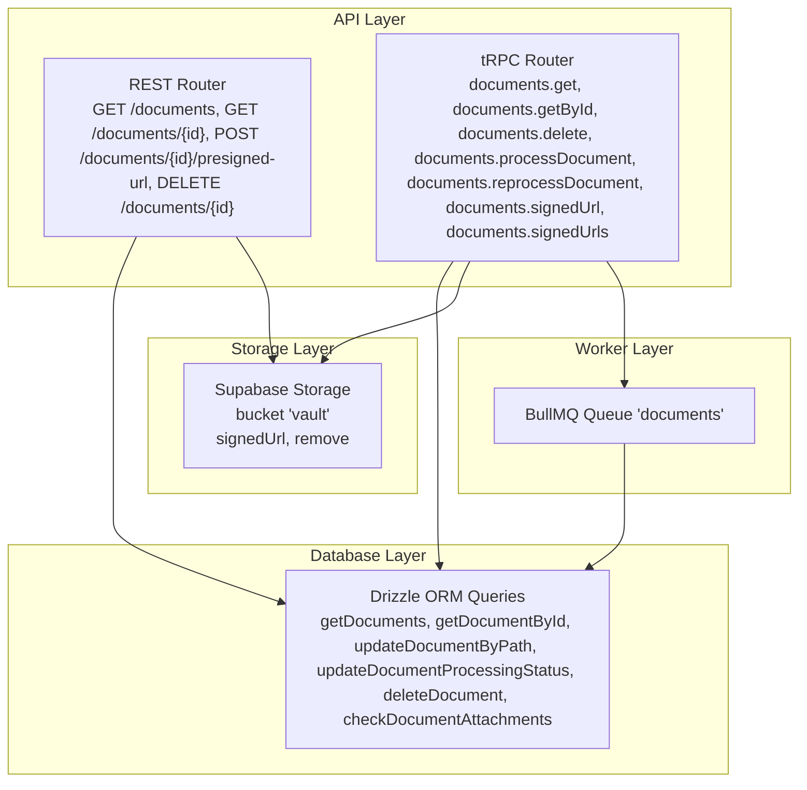
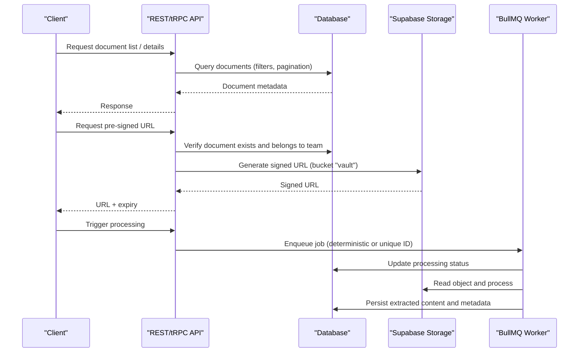
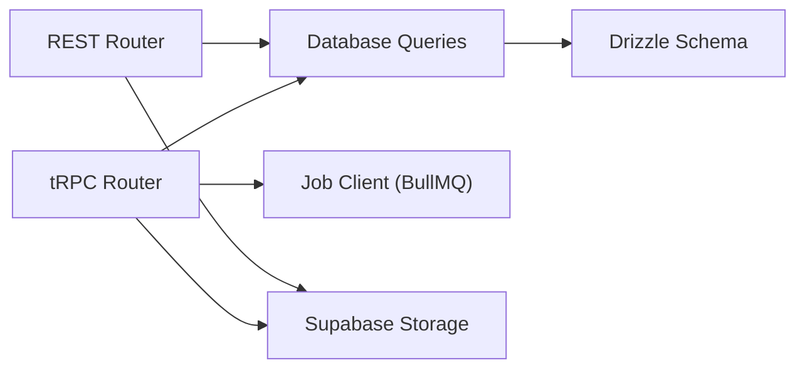

# Storage & Security

<cite>
**Referenced Files in This Document**
- [documents.ts](file://apps/api/src/schemas/documents.ts)
- [documents.ts](file://apps/api/src/rest/routers/documents.ts)
- [documents.ts](file://apps/api/src/trpc/routers/documents.ts)
- [documents.ts](file://apps/worker/src/queues/documents.ts)
- [documents.ts](file://packages/db/src/queries/documents.ts)
- [documents.ts](file://apps/api/src/mcp/tools/documents.ts)
- [documents.ts](file://apps/api/src/schemas/documents.ts)
- [documents.ts](file://apps/api/src/rest/routers/documents.ts)
- [documents.ts](file://apps/api/src/trpc/routers/documents.ts)
- [documents.ts](file://apps/worker/src/queues/documents.ts)
- [documents.ts](file://packages/db/src/queries/documents.ts)
</cite>

## Table of Contents
1. [Introduction](#introduction)
2. [Project Structure](#project-structure)
3. [Core Components](#core-components)
4. [Architecture Overview](#architecture-overview)
5. [Detailed Component Analysis](#detailed-component-analysis)
6. [Dependency Analysis](#dependency-analysis)
7. [Performance Considerations](#performance-considerations)
8. [Security Measures](#security-measures)
9. [Backup and Disaster Recovery](#backup-and-disaster-recovery)
10. [Compliance and Auditing](#compliance-and-auditing)
11. [Troubleshooting Guide](#troubleshooting-guide)
12. [Conclusion](#conclusion)

## Introduction
This document explains the document storage architecture and security measures in the project. It covers the multi-tiered storage system, encryption at rest and in transit, key management, access control, document versioning, audit trails, lifecycle management, compliance reporting, and operational resilience including backup and disaster recovery. The focus is on how documents are stored, accessed, processed, and secured across the API, worker, and database layers.

## Project Structure
The document storage system spans several layers:
- API layer: exposes REST and tRPC endpoints for listing, retrieving, generating pre-signed URLs, deleting, and triggering processing.
- Worker layer: enqueues and processes document jobs asynchronously.
- Database layer: persists document metadata, relationships, and lifecycle states.
- Storage layer: integrates with Supabase Storage for encrypted object storage and pre-signed URL generation.

**Diagram sources**
- [documents.ts](file://apps/api/src/rest/routers/documents.ts#L1-L257)
- [documents.ts](file://apps/api/src/trpc/routers/documents.ts#L1-L244)
- [documents.ts](file://apps/worker/src/queues/documents.ts#L1-L13)
- [documents.ts](file://packages/db/src/queries/documents.ts#L1-L493)

**Section sources**
- [documents.ts](file://apps/api/src/rest/routers/documents.ts#L1-L257)
- [documents.ts](file://apps/api/src/trpc/routers/documents.ts#L1-L244)
- [documents.ts](file://apps/worker/src/queues/documents.ts#L1-L13)
- [documents.ts](file://packages/db/src/queries/documents.ts#L1-L493)

## Core Components
- Document metadata persistence: Drizzle queries manage document records, tags, recent items, and related matches.
- Access control: API routes enforce scope-based permissions ("documents.read", "documents.write").
- Temporary access: Pre-signed URLs grant time-limited access to stored objects.
- Lifecycle orchestration: tRPC triggers asynchronous processing via BullMQ jobs.
- Deletion safety: Deletion removes both metadata and storage objects, and checks for related attachments.

Key responsibilities:
- REST router: list, fetch, generate pre-signed URL, delete documents.
- tRPC router: list, fetch, related documents, deletion, processing, reprocessing, signed URL generation.
- Worker queue: processes document jobs with deduplication and idempotency strategies.
- Database queries: robust filtering, pagination, FTS search, tag joins, and cascading deletions.

**Section sources**
- [documents.ts](file://apps/api/src/rest/routers/documents.ts#L30-L218)
- [documents.ts](file://apps/api/src/trpc/routers/documents.ts#L26-L243)
- [documents.ts](file://apps/worker/src/queues/documents.ts#L9-L12)
- [documents.ts](file://packages/db/src/queries/documents.ts#L17-L493)

## Architecture Overview
The system uses a distributed, event-driven architecture:
- API validates scope and delegates to database and storage.
- tRPC triggers asynchronous processing with deterministic job IDs for upload deduplication and unique IDs for reprocessing.
- Database stores document metadata and relationships; storage stores encrypted objects in a dedicated bucket.
- Pre-signed URLs provide secure, time-limited access to objects.

**Diagram sources**
- [documents.ts](file://apps/api/src/rest/routers/documents.ts#L160-L217)
- [documents.ts](file://apps/api/src/trpc/routers/documents.ts#L91-L138)
- [documents.ts](file://apps/api/src/trpc/routers/documents.ts#L140-L212)
- [documents.ts](file://packages/db/src/queries/documents.ts#L60-L163)

## Detailed Component Analysis

### REST Documents Router
Responsibilities:
- List documents with pagination and filters.
- Fetch a single document by ID or file path.
- Generate a pre-signed URL for a document with a short TTL.
- Delete a document after verifying ownership and removing the object from storage.

Security and access control:
- Uses scope middleware to require "documents.read" for listing and fetching, and "documents.write" for deletion.

Pre-signed URL generation:
- Validates document existence and path tokens.
- Creates an admin Supabase client and requests a signed URL against bucket "vault".
- Returns URL with a fixed 60-second TTL and calculates expiry timestamp.

Deletion:
- Deletes the document record and the underlying object from storage.

**Section sources**
- [documents.ts](file://apps/api/src/rest/routers/documents.ts#L30-L68)
- [documents.ts](file://apps/api/src/rest/routers/documents.ts#L70-L107)
- [documents.ts](file://apps/api/src/rest/routers/documents.ts#L109-L218)
- [documents.ts](file://apps/api/src/rest/routers/documents.ts#L220-L254)

### tRPC Documents Router
Responsibilities:
- Retrieve documents and related documents.
- Check for document attachments before deletion.
- Delete a document and remove the object from storage.
- Trigger processing jobs with deduplication for supported MIME types.
- Regenerate pre-signed URLs for single or multiple paths.

Processing workflow:
- Filters supported MIME types and enqueues jobs with deterministic IDs to prevent duplicate uploads.
- For reprocessing, resets status to pending and enqueues with a unique job ID to ensure retries are accepted.

Signed URL generation:
- Supports single and batch URL generation with configurable expiry.

**Section sources**
- [documents.ts](file://apps/api/src/trpc/routers/documents.ts#L26-L89)
- [documents.ts](file://apps/api/src/trpc/routers/documents.ts#L91-L138)
- [documents.ts](file://apps/api/src/trpc/routers/documents.ts#L140-L212)
- [documents.ts](file://apps/api/src/trpc/routers/documents.ts#L214-L243)

### Worker Queue
The worker queue named "documents" is used to enqueue processing jobs. Job IDs are chosen to ensure:
- Upload deduplication: deterministic IDs derived from team and file path.
- Reprocessing uniqueness: timestamps included to avoid BullMQ skipping new jobs.

**Section sources**
- [documents.ts](file://apps/worker/src/queues/documents.ts#L9-L12)
- [documents.ts](file://apps/api/src/trpc/routers/documents.ts#L120-L133)
- [documents.ts](file://apps/api/src/trpc/routers/documents.ts#L194-L205)

### Database Queries
Capabilities:
- List documents with text search, date range, and tag filters.
- Fetch a single document with nested tag associations.
- Retrieve related documents using a similarity function executed on a replica.
- Update document metadata, processing status, and content.
- Delete a document and cascade removal of related transaction attachments.

Search and filtering:
- Full-text search leverages a dedicated field and trigram similarity.
- Tag filtering uses a join with assignment table and array containment.

Audit-friendly fields:
- Creation timestamps and processing status provide lifecycle visibility.

**Section sources**
- [documents.ts](file://packages/db/src/queries/documents.ts#L60-L163)
- [documents.ts](file://packages/db/src/queries/documents.ts#L176-L255)
- [documents.ts](file://packages/db/src/queries/documents.ts#L312-L345)
- [documents.ts](file://packages/db/src/queries/documents.ts#L353-L368)
- [documents.ts](file://packages/db/src/queries/documents.ts#L384-L423)
- [documents.ts](file://packages/db/src/queries/documents.ts#L439-L474)
- [documents.ts](file://packages/db/src/queries/documents.ts#L481-L492)

### Document Schema Definitions
Defines request/response shapes for:
- Listing documents with pagination and filters.
- Retrieving a single document.
- Generating pre-signed URLs with expiry.
- Deleting documents and reprocessing requests.

These schemas guide API behavior and validation.

**Section sources**
- [documents.ts](file://apps/api/src/schemas/documents.ts#L1-L269)

## Dependency Analysis
High-level dependencies:
- REST and tRPC routers depend on database queries and Supabase Storage.
- tRPC router also depends on the BullMQ job client to enqueue processing tasks.
- Database queries depend on Drizzle schema and helper utilities for search.

**Diagram sources**
- [documents.ts](file://apps/api/src/rest/routers/documents.ts#L20-L26)
- [documents.ts](file://apps/api/src/trpc/routers/documents.ts#L11-L24)
- [documents.ts](file://packages/db/src/queries/documents.ts#L1-L10)

**Section sources**
- [documents.ts](file://apps/api/src/rest/routers/documents.ts#L20-L26)
- [documents.ts](file://apps/api/src/trpc/routers/documents.ts#L11-L24)
- [documents.ts](file://packages/db/src/queries/documents.ts#L1-L10)

## Performance Considerations
- Asynchronous processing: Offloads heavy operations (extraction, embedding, classification) to workers, preventing API latency.
- Deterministic job IDs: Prevents duplicate processing during uploads by using team and file path in the job ID.
- Unique reprocessing IDs: Ensures retries are accepted by including timestamps.
- Pagination and filtering: Database queries support efficient pagination and composite filtering to reduce payload sizes.
- Read replica usage: Related document similarity uses a replica to offload reads.

[No sources needed since this section provides general guidance]

## Security Measures

### Encryption at Rest and in Transit
- Encrypted storage: Objects are stored in a dedicated Supabase Storage bucket configured for encryption at rest.
- Secure transport: Pre-signed URLs are generated server-side and returned to clients, ensuring traffic remains encrypted in transit.
- Access control: Pre-signed URLs are time-limited and scoped to the requesting team.

### Key Management
- Pre-signed URL generation uses an administrative client to sign URLs, leveraging platform-managed keys.
- No client-side key material is exposed; signing occurs server-side.

### Access Control Policies
- Scope-based permissions: REST endpoints require "documents.read" or "documents.write" depending on operation.
- Ownership verification: Before generating URLs or deleting, the system verifies the document belongs to the authenticated team.
- Bucket scoping: All operations target the "vault" bucket, isolating document storage.

### Audit Trails and Lifecycle Management
- Processing status: Documents maintain a processing status that reflects current lifecycle stage.
- Creation timestamps: Metadata includes creation time for auditability.
- Deletion safeguards: Before deletion, the system checks for related attachments and removes them to prevent orphaned references.

**Section sources**
- [documents.ts](file://apps/api/src/rest/routers/documents.ts#L52-L52)
- [documents.ts](file://apps/api/src/rest/routers/documents.ts#L243-L243)
- [documents.ts](file://apps/api/src/rest/routers/documents.ts#L167-L179)
- [documents.ts](file://apps/api/src/trpc/routers/documents.ts#L67-L89)
- [documents.ts](file://packages/db/src/queries/documents.ts#L312-L345)
- [documents.ts](file://packages/db/src/queries/documents.ts#L481-L492)

## Backup and Disaster Recovery
Operational model:
- Storage: Objects are stored in a managed Supabase Storage bucket with built-in durability and replication.
- Database: Document metadata is stored in a managed Postgres database; use platform-provided backups and point-in-time recovery.
- Jobs: BullMQ queues persist jobs and retry logic; ensure queue persistence and monitoring in deployment environments.

Recovery steps:
- Restore database from backups and replay logs as needed.
- Rebuild queue state by re-triggering failed jobs if necessary.
- Recreate pre-signed URLs for active sessions if required.

[No sources needed since this section provides general guidance]

## Compliance and Auditing
- Data residency and encryption: Objects are encrypted at rest in the storage bucket; transport is encrypted via HTTPS and pre-signed URLs.
- Access logging: Pre-signed URL generation and document access occur through controlled API endpoints; maintain API logs for access tracking.
- Retention and deletion: Implement retention policies aligned with compliance needs; leverage the deletion flow to remove both metadata and objects.
- Auditability: Processing status and timestamps enable lifecycle tracking; consider extending logs for regulatory reporting.

[No sources needed since this section provides general guidance]

## Troubleshooting Guide
Common issues and resolutions:
- Pre-signed URL generation fails: Verify document exists, has a valid path, and the admin client can sign URLs.
- Deletion returns not found: Confirm the document ID and team ownership; ensure the object path exists before deletion.
- Unsupported MIME type: Unsupported files are marked as completed; verify supported types and update accordingly.
- Reprocessing not starting: Ensure unique job IDs are used for reprocessing; confirm job queue is running and healthy.

**Section sources**
- [documents.ts](file://apps/api/src/rest/routers/documents.ts#L166-L217)
- [documents.ts](file://apps/api/src/trpc/routers/documents.ts#L67-L89)
- [documents.ts](file://apps/api/src/trpc/routers/documents.ts#L102-L112)
- [documents.ts](file://apps/api/src/trpc/routers/documents.ts#L169-L181)
- [documents.ts](file://apps/api/src/trpc/routers/documents.ts#L194-L205)

## Conclusion
The document storage architecture combines secure, time-limited access via pre-signed URLs, robust metadata management, asynchronous processing, and strong access controls. Encryption at rest and in transit, combined with lifecycle tracking and deletion safeguards, provides a solid foundation for secure document handling. Operational practices around queue management, backups, and compliance reporting further strengthen reliability and adherence to data protection requirements.