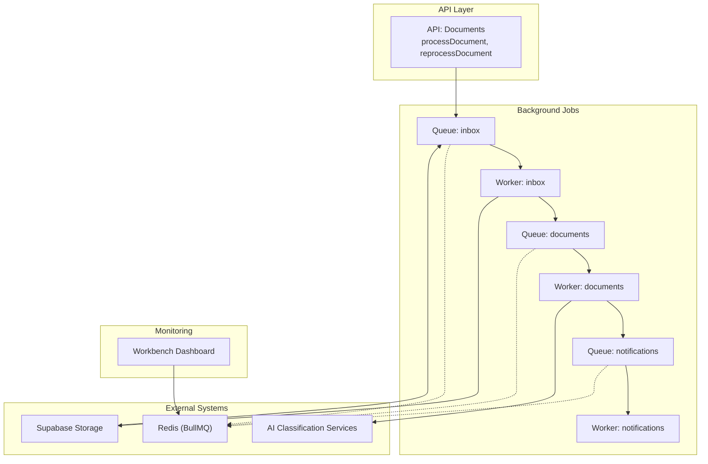
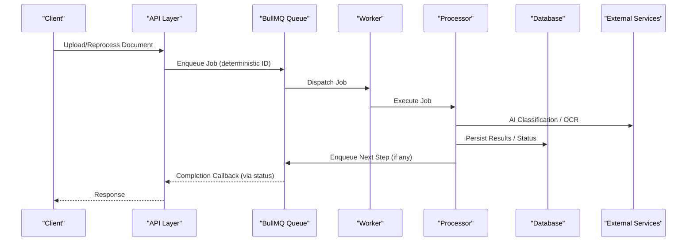
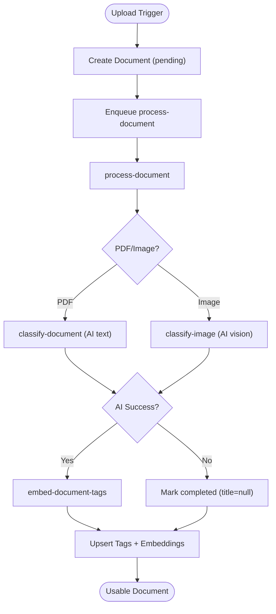
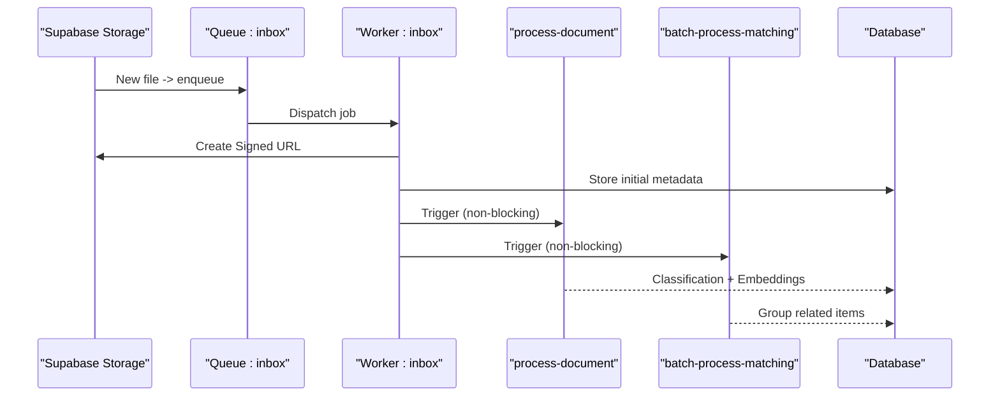
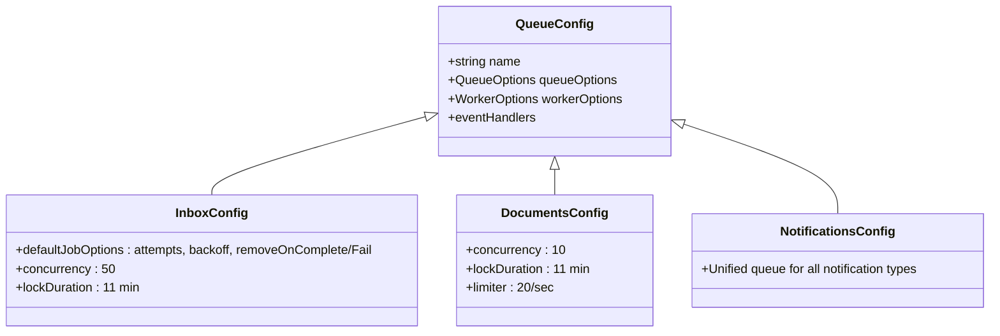
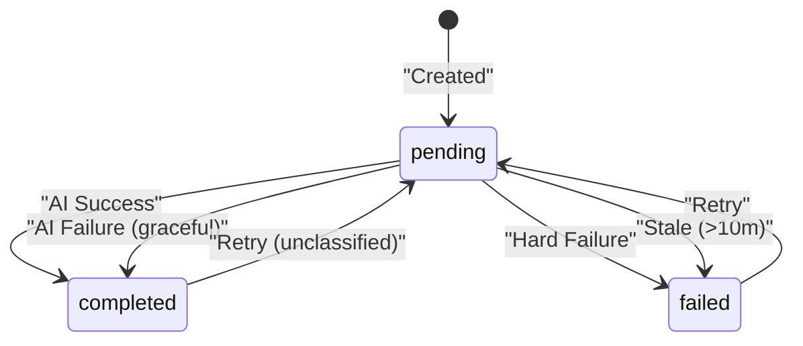
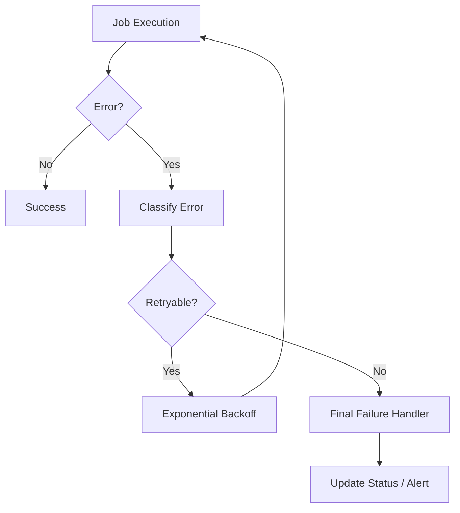
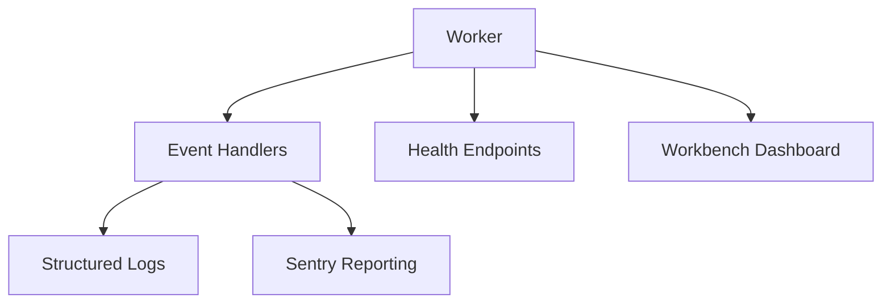
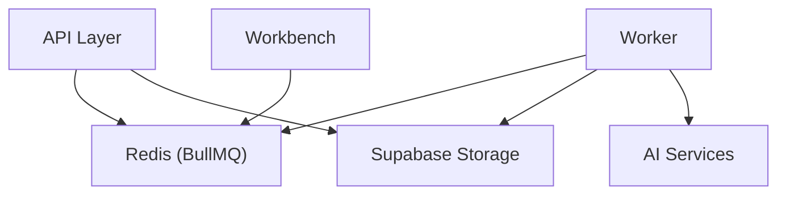

# Workflow & Automation

<cite>
**Referenced Files in This Document**
- [document-processing.md](file://docs/document-processing.md)
- [process-attachment.ts](file://apps/worker/src/processors/inbox/process-attachment.ts)
- [documents.config.ts](file://apps/worker/src/queues/documents.config.ts)
- [inbox.config.ts](file://apps/worker/src/queues/inbox.config.ts)
- [notifications.config.ts](file://apps/worker/src/queues/notifications.config.ts)
- [config.ts](file://apps/worker/src/config.ts)
- [index.ts](file://apps/worker/src/index.ts)
- [db-retry.ts](file://apps/worker/src/utils/db-retry.ts)
- [error-classification.ts](file://apps/worker/src/utils/error-classification.ts)
- [base.ts](file://apps/worker/src/processors/base.ts)
- [generate-team-insights.ts](file://apps/worker/src/processors/insights/generate-team-insights.ts)
- [trigger-batch.ts](file://packages/jobs/src/utils/trigger-batch.ts)
- [notifications.ts](file://packages/jobs/src/tasks/notifications/notifications.ts)
- [queue-manager.ts](file://packages/workbench/src/core/queue-manager.ts)
- [index.ts](file://packages/workbench/src/index.ts)
- [documents.ts](file://apps/api/src/schemas/documents.ts)
</cite>

## Table of Contents
1. [Introduction](#introduction)
2. [Project Structure](#project-structure)
3. [Core Components](#core-components)
4. [Architecture Overview](#architecture-overview)
5. [Detailed Component Analysis](#detailed-component-analysis)
6. [Dependency Analysis](#dependency-analysis)
7. [Performance Considerations](#performance-considerations)
8. [Troubleshooting Guide](#troubleshooting-guide)
9. [Conclusion](#conclusion)
10. [Appendices](#appendices)

## Introduction
This document explains the end-to-end workflow and automation system for document processing and background jobs. It covers automated pipelines for batch operations, scheduled processing, conditional workflows, queue management with priorities, orchestration of document routing and approval-like states, integration with external document sources, robust error handling and retry strategies, failure recovery, monitoring and alerting, and extensibility points for custom handlers and third-party integrations.

## Project Structure
The workflow system spans three primary layers:
- API layer: exposes endpoints for document operations and triggers background jobs.
- Worker layer: runs BullMQ workers and processors that execute jobs and orchestrate flows.
- Monitoring and dashboards: Workbench provides queue inspection, metrics, and operational visibility.

**Diagram sources**
- [index.ts](file://apps/worker/src/index.ts#L25-L118)
- [inbox.config.ts](file://apps/worker/src/queues/inbox.config.ts#L1-L40)
- [documents.config.ts](file://apps/worker/src/queues/documents.config.ts#L151-L197)
- [notifications.config.ts](file://apps/worker/src/queues/notifications.config.ts#L39-L67)
- [config.ts](file://apps/worker/src/config.ts#L46-L97)
- [queue-manager.ts](file://packages/workbench/src/core/queue-manager.ts#L30-L51)

**Section sources**
- [index.ts](file://apps/worker/src/index.ts#L25-L118)
- [config.ts](file://apps/worker/src/config.ts#L46-L97)
- [queue-manager.ts](file://packages/workbench/src/core/queue-manager.ts#L30-L51)

## Core Components
- Queue and Worker orchestration: Dynamic workers are created from queue configurations, with centralized event handling and graceful shutdown.
- Document processing pipeline: A multi-stage flow with deterministic job IDs, timeouts, and graceful degradation.
- Inbox ingestion: Triggers document processing and matching workflows upon file uploads.
- Notifications: Unified queue for system notifications, including insight readiness.
- Error handling and retry: Centralized classification, retry utilities, and final failure handling.
- Monitoring: Workbench dashboard for queue inspection, metrics caching, and operational controls.

**Section sources**
- [index.ts](file://apps/worker/src/index.ts#L25-L118)
- [document-processing.md](file://docs/document-processing.md#L1-L617)
- [process-attachment.ts](file://apps/worker/src/processors/inbox/process-attachment.ts#L237-L455)
- [documents.config.ts](file://apps/worker/src/queues/documents.config.ts#L151-L197)
- [notifications.config.ts](file://apps/worker/src/queues/notifications.config.ts#L39-L67)
- [db-retry.ts](file://apps/worker/src/utils/db-retry.ts#L1-L57)
- [error-classification.ts](file://apps/worker/src/utils/error-classification.ts#L178-L229)
- [base.ts](file://apps/worker/src/processors/base.ts#L153-L190)
- [queue-manager.ts](file://packages/workbench/src/core/queue-manager.ts#L30-L51)

## Architecture Overview
The system uses BullMQ queues and workers to implement a reliable, observable, and scalable background processing architecture. Jobs are triggered by API endpoints or storage triggers, processed asynchronously, and coordinated through deterministic IDs and timeouts. Notifications are emitted for user-visible outcomes.

**Diagram sources**
- [document-processing.md](file://docs/document-processing.md#L127-L177)
- [process-attachment.ts](file://apps/worker/src/processors/inbox/process-attachment.ts#L237-L455)
- [documents.config.ts](file://apps/worker/src/queues/documents.config.ts#L151-L197)
- [index.ts](file://apps/worker/src/index.ts#L25-L118)

## Detailed Component Analysis

### Document Processing Pipeline
The document pipeline orchestrates multi-stage processing with deterministic job IDs, timeouts, and graceful degradation. It supports both text and image documents, with AI classification and optional tag embeddings.

**Diagram sources**
- [document-processing.md](file://docs/document-processing.md#L127-L177)
- [document-processing.md](file://docs/document-processing.md#L190-L206)
- [document-processing.md](file://docs/document-processing.md#L235-L293)

**Section sources**
- [document-processing.md](file://docs/document-processing.md#L1-L617)

### Inbox Ingestion and Matching
Inbox ingestion creates signed URLs, fetches team context, performs OCR/LLM extraction, stores initial metadata, groups related items, and triggers downstream document processing and matching.

**Diagram sources**
- [process-attachment.ts](file://apps/worker/src/processors/inbox/process-attachment.ts#L237-L455)
- [document-processing.md](file://docs/document-processing.md#L127-L177)

**Section sources**
- [process-attachment.ts](file://apps/worker/src/processors/inbox/process-attachment.ts#L237-L455)

### Queue Management and Priority Handling
Queue configurations define concurrency, backoff, retention, and event handlers. Workers are dynamically created from queue configs, with centralized error and completion handlers. Deterministic job IDs prevent duplicates.

**Diagram sources**
- [inbox.config.ts](file://apps/worker/src/queues/inbox.config.ts#L1-L40)
- [documents.config.ts](file://apps/worker/src/queues/documents.config.ts#L151-L197)
- [notifications.config.ts](file://apps/worker/src/queues/notifications.config.ts#L39-L67)

**Section sources**
- [inbox.config.ts](file://apps/worker/src/queues/inbox.config.ts#L1-L40)
- [documents.config.ts](file://apps/worker/src/queues/documents.config.ts#L151-L197)
- [notifications.config.ts](file://apps/worker/src/queues/notifications.config.ts#L39-L67)
- [index.ts](file://apps/worker/src/index.ts#L25-L118)

### Workflow Orchestration and Status Tracking
The system tracks document processing states and presents UI-friendly indicators. Stale detection helps recover stuck jobs. Retries are user-initiated or automatic depending on error categories.

**Diagram sources**
- [document-processing.md](file://docs/document-processing.md#L84-L113)

**Section sources**
- [document-processing.md](file://docs/document-processing.md#L74-L113)

### Error Handling, Retry, and Failure Recovery
Centralized error classification determines retryability. Database operations use retry utilities for transient connection errors. Final failure handlers update statuses and notify stakeholders.

**Diagram sources**
- [base.ts](file://apps/worker/src/processors/base.ts#L153-L190)
- [error-classification.ts](file://apps/worker/src/utils/error-classification.ts#L178-L229)
- [db-retry.ts](file://apps/worker/src/utils/db-retry.ts#L1-L57)
- [documents.config.ts](file://apps/worker/src/queues/documents.config.ts#L151-L197)

**Section sources**
- [base.ts](file://apps/worker/src/processors/base.ts#L153-L190)
- [error-classification.ts](file://apps/worker/src/utils/error-classification.ts#L178-L229)
- [db-retry.ts](file://apps/worker/src/utils/db-retry.ts#L1-L57)
- [documents.config.ts](file://apps/worker/src/queues/documents.config.ts#L151-L197)

### Monitoring and Alerting
The worker initializes a Workbench dashboard and attaches centralized logging and Sentry reporting. Health checks verify dependencies and readiness. Workers log errors and completion events, and custom handlers can update statuses.

**Diagram sources**
- [index.ts](file://apps/worker/src/index.ts#L128-L203)
- [index.ts](file://apps/worker/src/index.ts#L40-L118)
- [queue-manager.ts](file://packages/workbench/src/core/queue-manager.ts#L30-L51)

**Section sources**
- [index.ts](file://apps/worker/src/index.ts#L128-L203)
- [index.ts](file://apps/worker/src/index.ts#L40-L118)
- [queue-manager.ts](file://packages/workbench/src/core/queue-manager.ts#L30-L51)

### Extensibility and Third-Party Integrations
- Custom processors: Add new job types by registering processors and queue configs.
- Batch operations: Utilities support batching large sets of items efficiently.
- Notifications: Unified queue for system notifications integrates with external channels.
- Workbench: Provides dashboard access for queue inspection and metrics.

**Section sources**
- [trigger-batch.ts](file://packages/jobs/src/utils/trigger-batch.ts#L1-L25)
- [notifications.ts](file://packages/jobs/src/tasks/notifications/notifications.ts#L1-L23)
- [index.ts](file://packages/workbench/src/index.ts#L1-L14)
- [queue-manager.ts](file://packages/workbench/src/core/queue-manager.ts#L1984-L1998)

## Dependency Analysis
The worker depends on Redis for queue persistence, Supabase Storage for signed URLs, and AI services for classification. The API layer triggers jobs and surfaces status to clients.

**Diagram sources**
- [config.ts](file://apps/worker/src/config.ts#L46-L97)
- [index.ts](file://apps/worker/src/index.ts#L25-L118)
- [document-processing.md](file://docs/document-processing.md#L18-L70)

**Section sources**
- [config.ts](file://apps/worker/src/config.ts#L46-L97)
- [index.ts](file://apps/worker/src/index.ts#L25-L118)
- [document-processing.md](file://docs/document-processing.md#L18-L70)

## Performance Considerations
- Concurrency tuning: Queues balance throughput with resource constraints (memory, API rate limits).
- Backoff and timeouts: Exponential backoff and strict timeouts prevent resource contention and improve resilience.
- Caching and metrics: Workbench caches expensive operations to reduce dashboard latency.
- Image optimization: Pre-processing minimizes AI costs and improves OCR quality.

**Section sources**
- [document-processing.md](file://docs/document-processing.md#L207-L234)
- [document-processing.md](file://docs/document-processing.md#L506-L530)
- [queue-manager.ts](file://packages/workbench/src/core/queue-manager.ts#L35-L50)

## Troubleshooting Guide
Common issues and remedies:
- Duplicate processing: Deterministic job IDs prevent duplication; verify IDs match expectations.
- Stuck jobs: Pending state beyond stale threshold indicates recovery; trigger retry or investigate upstream.
- Hard vs soft failures: Soft failures (AI) mark as completed with null title; hard failures require corrective action.
- Redis connectivity: Worker reconnects on READONLY or timeouts; verify credentials and network.
- Database retries: Transient connection errors are retried with backoff; inspect logs for persistent issues.

**Section sources**
- [document-processing.md](file://docs/document-processing.md#L190-L206)
- [document-processing.md](file://docs/document-processing.md#L356-L371)
- [base.ts](file://apps/worker/src/processors/base.ts#L153-L190)
- [config.ts](file://apps/worker/src/config.ts#L61-L86)
- [db-retry.ts](file://apps/worker/src/utils/db-retry.ts#L15-L55)

## Conclusion
The system provides a robust, observable, and extensible framework for document workflow automation. It combines deterministic job IDs, graceful degradation, centralized error handling, and a unified dashboard to ensure reliability and operability at scale.

## Appendices

### Example Scenarios
- Automated ingestion: Upload triggers inbox processing, which enqueues document classification and matching.
- Scheduled insights: Insights generation emits notifications when enabled.
- Batch operations: Large-scale tagging or reprocessing can leverage batch utilities.

**Section sources**
- [process-attachment.ts](file://apps/worker/src/processors/inbox/process-attachment.ts#L375-L455)
- [generate-team-insights.ts](file://apps/worker/src/processors/insights/generate-team-insights.ts#L242-L287)
- [trigger-batch.ts](file://packages/jobs/src/utils/trigger-batch.ts#L1-L25)

### API and Schema References
- Document reprocessing endpoint and schema definitions are available in the API schemas.

**Section sources**
- [documents.ts](file://apps/api/src/schemas/documents.ts#L90-L105)