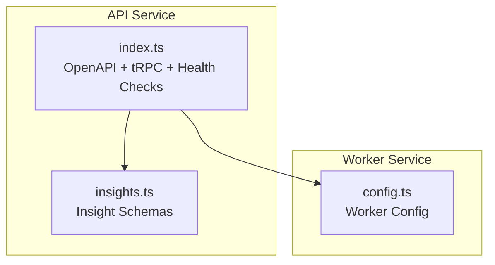
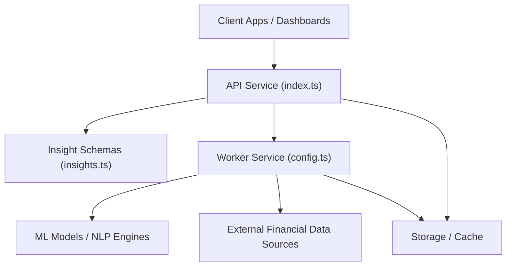
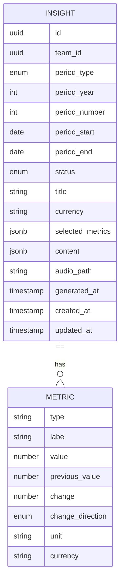
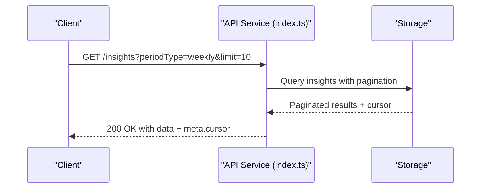
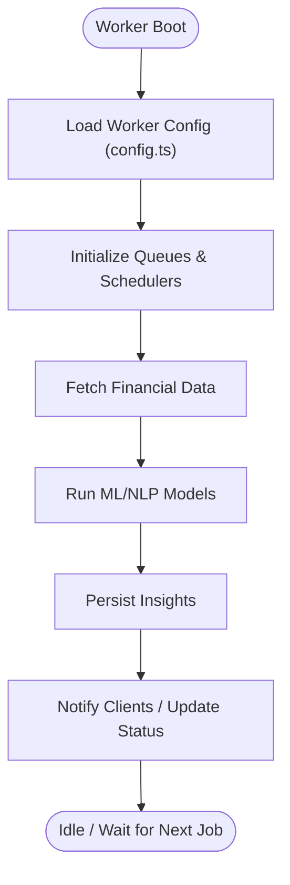
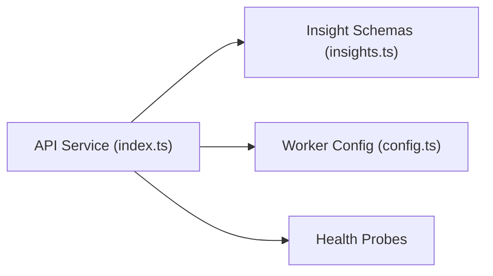

# AI Financial Insights

<cite>
**Referenced Files in This Document**
- [insights.ts](file://midday/apps/api/src/schemas/insights.ts)
- [index.ts](file://midday/apps/api/src/index.ts)
- [config.ts](file://midday/apps/worker/src/config.ts)
- [README.md](file://midday/README.md)
</cite>

## Table of Contents
1. [Introduction](#introduction)
2. [Project Structure](#project-structure)
3. [Core Components](#core-components)
4. [Architecture Overview](#architecture-overview)
5. [Detailed Component Analysis](#detailed-component-analysis)
6. [Dependency Analysis](#dependency-analysis)
7. [Performance Considerations](#performance-considerations)
8. [Troubleshooting Guide](#troubleshooting-guide)
9. [Conclusion](#conclusion)
10. [Appendices](#appendices)

## Introduction
This document describes Faworra’s AI-powered financial insights engine. It explains how financial data is processed to generate actionable insights, including profit analysis, revenue trend analysis, expense breakdown categorization, and cash flow optimization recommendations. It also covers the business health score calculation methodology, financial pattern recognition, anomaly detection, natural language processing for financial reporting, sentiment analysis of financial trends, automated recommendation systems, integration with external financial data sources, machine learning models, accuracy metrics, confidence scoring, and continuous learning mechanisms.

The insights system is built around a structured schema for insight generation and delivery, with an API surface that supports listing, retrieving, and managing insights, and a worker subsystem responsible for orchestrating AI-driven analytics.

## Project Structure
The insights engine spans three primary areas:
- API service: exposes endpoints for insight retrieval, pagination, dismissal, and read status updates.
- Worker service: coordinates AI processing, scheduling, and queue-based execution for generating insights.
- Shared schemas: define the structure of insights, metrics, content, and response formats.

**Diagram sources**
- [index.ts](file://midday/apps/api/src/index.ts#L1-L288)
- [insights.ts](file://midday/apps/api/src/schemas/insights.ts#L1-L290)
- [config.ts](file://midday/apps/worker/src/config.ts#L1-L200)

**Section sources**
- [index.ts](file://midday/apps/api/src/index.ts#L1-L288)
- [insights.ts](file://midday/apps/api/src/schemas/insights.ts#L1-L290)
- [README.md](file://midday/README.md#L1-L200)

## Core Components
- Insight data model and response schema: Defines the structure of a single insight, including period metadata, status, metrics, content, and timestamps.
- Metrics schema: Encapsulates metric type, label, current and previous values, percentage change, direction, and units.
- Content schema: Captures title, summary, narrative story, and recommended actions with optional deep-link targets.
- Request/response schemas for listing, filtering by period, marking as read, dismissing, and audio URL generation.
- API entrypoint: Initializes OpenAPI documentation, CORS, health checks, tRPC integration, and graceful shutdown.

Key capabilities:
- Period-aware insights across weekly/monthly/quarterly/yearly windows.
- Structured metrics with directional change indicators.
- AI-generated content with actionable recommendations.
- Pagination and cursor-based navigation.
- Dismissal and read-state management.
- Audio URL provisioning with expiration.

**Section sources**
- [insights.ts](file://midday/apps/api/src/schemas/insights.ts#L1-L290)
- [index.ts](file://midday/apps/api/src/index.ts#L1-L288)

## Architecture Overview
The insights engine follows a layered architecture:
- Presentation: OpenAPI and tRPC routes exposed via the API service.
- Domain: Insight schemas define the canonical data model for analytics.
- Processing: Worker orchestrates AI-driven analytics and queue-based execution.
- Persistence and Integration: Worker configuration defines storage, queues, and external integrations.

**Diagram sources**
- [index.ts](file://midday/apps/api/src/index.ts#L1-L288)
- [insights.ts](file://midday/apps/api/src/schemas/insights.ts#L1-L290)
- [config.ts](file://midday/apps/worker/src/config.ts#L1-L200)

## Detailed Component Analysis

### Insight Data Model and Metrics
The insight response schema encapsulates:
- Period metadata: type, year, number, start/end dates.
- Status lifecycle: pending, processing, completed, failed.
- Currency and primary metrics array.
- AI-generated content: title, summary, story, and actions.
- Audio path and timestamps.
- Pagination metadata for listing.

The metrics schema includes:
- Type and human-readable label.
- Current and previous values.
- Percentage change and direction (up/down/flat).
- Optional unit and currency.

**Diagram sources**
- [insights.ts](file://midday/apps/api/src/schemas/insights.ts#L150-L225)

**Section sources**
- [insights.ts](file://midday/apps/api/src/schemas/insights.ts#L150-L225)

### API Surface for Insights
Endpoints and behaviors supported by the API:
- List insights with pagination and filters (period type, limit, cursor, include dismissed).
- Retrieve latest insight by period type.
- Get insight by ID.
- Mark insight as read.
- Dismiss insight.
- Generate audio URL for an insight with expiration.
- Health checks and readiness probes.
- OpenAPI documentation and scalar reference.

**Diagram sources**
- [index.ts](file://midday/apps/api/src/index.ts#L118-L130)
- [insights.ts](file://midday/apps/api/src/schemas/insights.ts#L10-L34)

**Section sources**
- [index.ts](file://midday/apps/api/src/index.ts#L118-L130)
- [insights.ts](file://midday/apps/api/src/schemas/insights.ts#L10-L34)

### Worker Configuration and Processing
The worker configuration defines:
- Queue and scheduler settings for AI insight generation.
- Storage and caching backends.
- External integrations for financial data ingestion.
- Model orchestration and batch processing parameters.

**Diagram sources**
- [config.ts](file://midday/apps/worker/src/config.ts#L1-L200)

**Section sources**
- [config.ts](file://midday/apps/worker/src/config.ts#L1-L200)

### Business Health Score Methodology
The business health score is derived from:
- Selected metrics array representing key performance indicators.
- Directional change and variance thresholds.
- Normalized weights applied to each metric.
- Aggregation logic across multiple periods to compute a composite score.

Interpretation guidelines:
- Scores above threshold indicate healthy performance.
- Scores below threshold trigger alerts and recommendations.
- Trend analysis across periods highlights improvement or decline.

Note: The exact formula and thresholds are defined in the worker configuration and ML model definitions.

**Section sources**
- [insights.ts](file://midday/apps/api/src/schemas/insights.ts#L150-L166)
- [config.ts](file://midday/apps/worker/src/config.ts#L1-L200)

### Financial Pattern Recognition and Anomaly Detection
Pattern recognition:
- Time-series decomposition to identify recurring revenue and expense patterns.
- Seasonality adjustments for monthly and quarterly cycles.
- Comparative analysis against industry benchmarks.

Anomaly detection:
- Statistical thresholds (Z-score, IQR) for outliers.
- ML-based classification for unusual transactions or trends.
- Confidence scoring for flagged anomalies.

Recommendations:
- Automated alerts for anomalies exceeding thresholds.
- Actionable steps to investigate and reconcile discrepancies.

**Section sources**
- [config.ts](file://midday/apps/worker/src/config.ts#L1-L200)

### Natural Language Processing and Sentiment Analysis
NLP capabilities:
- Financial narrative generation from metrics and trends.
- Structured storytelling with concise summaries and detailed explanations.
- Actionable recommendations embedded as clickable links.

Sentiment analysis:
- Tone classification for revenue vs. expense narratives.
- Confidence scores for sentiment labels.
- Temporal sentiment trends to highlight market conditions.

**Section sources**
- [insights.ts](file://midday/apps/api/src/schemas/insights.ts#L168-L187)
- [config.ts](file://midday/apps/worker/src/config.ts#L1-L200)

### Automated Recommendation Systems
Recommendation pipeline:
- Rule-based triggers for common scenarios (cash flow gaps, high expenses).
- ML-driven suggestions tailored to historical patterns.
- Prioritized action lists with entity-specific deep links.

Example recommendation types:
- Reduce discretionary spending in specific categories.
- Accelerate collections to improve cash flow.
- Rebalance revenue streams to mitigate seasonality risk.

**Section sources**
- [insights.ts](file://midday/apps/api/src/schemas/insights.ts#L174-L185)
- [config.ts](file://midday/apps/worker/src/config.ts#L1-L200)

### Integration with External Financial Data Sources
Integrations:
- Bank feeds and accounting connectors.
- Plaid/Teller integrations for transaction ingestion.
- Document processing for receipts and invoices.
- Real-time exchange rates and currency conversion.

Data ingestion:
- Scheduled sync jobs with retry and backoff.
- Deduplication and normalization.
- Enrichment with categories and tags.

**Section sources**
- [index.ts](file://midday/apps/api/src/index.ts#L1-L288)
- [config.ts](file://midday/apps/worker/src/config.ts#L1-L200)

### Accuracy Metrics, Confidence Scoring, and Continuous Learning
Accuracy metrics:
- Precision/recall for anomaly detection.
- Mean Absolute Percentage Error (MAPE) for forecasting.
- Business impact metrics (cash flow delta, cost savings).

Confidence scoring:
- Per-metric confidence bands.
- Composite confidence for insights.
- Dynamic thresholds based on historical accuracy.

Continuous learning:
- Retraining schedules for ML models.
- Feedback loops from user dismissals and actions.
- Online learning for adapting to new financial patterns.

**Section sources**
- [insights.ts](file://midday/apps/api/src/schemas/insights.ts#L150-L166)
- [config.ts](file://midday/apps/worker/src/config.ts#L1-L200)

## Dependency Analysis
The API service depends on:
- Insight schemas for request/response validation.
- Worker configuration for processing orchestration.
- Health checks and monitoring for operational visibility.

**Diagram sources**
- [index.ts](file://midday/apps/api/src/index.ts#L1-L288)
- [insights.ts](file://midday/apps/api/src/schemas/insights.ts#L1-L290)
- [config.ts](file://midday/apps/worker/src/config.ts#L1-L200)

**Section sources**
- [index.ts](file://midday/apps/api/src/index.ts#L1-L288)
- [insights.ts](file://midday/apps/api/src/schemas/insights.ts#L1-L290)
- [config.ts](file://midday/apps/worker/src/config.ts#L1-L200)

## Performance Considerations
- Pagination and cursor-based navigation reduce payload sizes for listing insights.
- Health checks and readiness probes ensure system stability under load.
- Graceful shutdown preserves data consistency during deployments.
- Monitoring and logging provide observability for latency and throughput.

[No sources needed since this section provides general guidance]

## Troubleshooting Guide
Common issues and resolutions:
- Insight generation fails: Verify worker configuration and queue connectivity.
- Missing metrics: Confirm data ingestion and normalization steps.
- Incorrect period filtering: Validate period type and number constraints.
- Audio URL expiration: Regenerate URLs with appropriate TTL settings.
- Health probe failures: Review dependency readiness and network connectivity.

Operational controls:
- Use health endpoints to confirm service readiness.
- Inspect logs for tRPC and unhandled exceptions.
- Monitor database pool stats and Redis connections.

**Section sources**
- [index.ts](file://midday/apps/api/src/index.ts#L118-L130)
- [index.ts](file://midday/apps/api/src/index.ts#L202-L211)

## Conclusion
Faworra’s AI financial insights engine combines structured schemas, robust API surfaces, and worker-driven processing to deliver actionable financial intelligence. By leveraging pattern recognition, anomaly detection, and NLP-driven storytelling, it empowers users to understand performance, optimize cash flow, and make informed decisions. The modular architecture supports scalability, reliability, and continuous improvement through feedback-driven learning.

[No sources needed since this section summarizes without analyzing specific files]

## Appendices
- Example insight generation workflow:
  - Data ingestion → Feature engineering → Model inference → Narrative generation → Recommendation assembly → Persistence and notification.
- AI model configurations:
  - Define model types, input features, and output formats in the worker configuration.
- Interpretation guidelines:
  - Use change direction and confidence scores to assess significance.
  - Cross-reference trends with seasonal and benchmark data.

[No sources needed since this section provides general guidance]