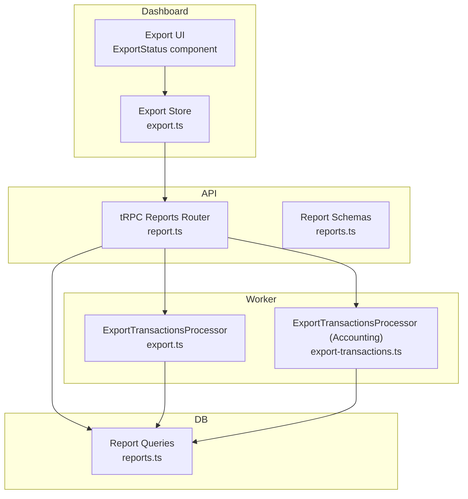
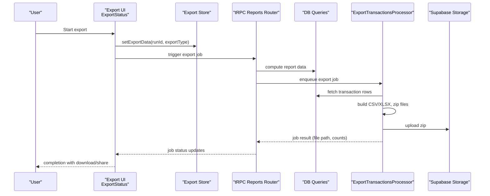
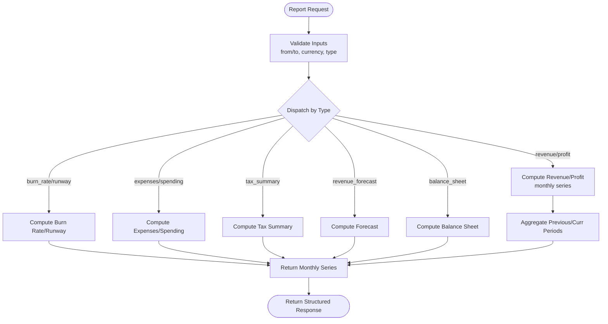
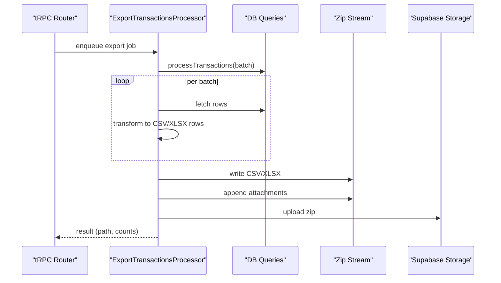
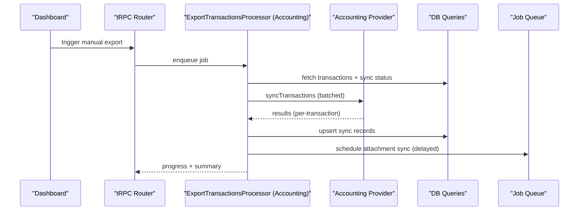
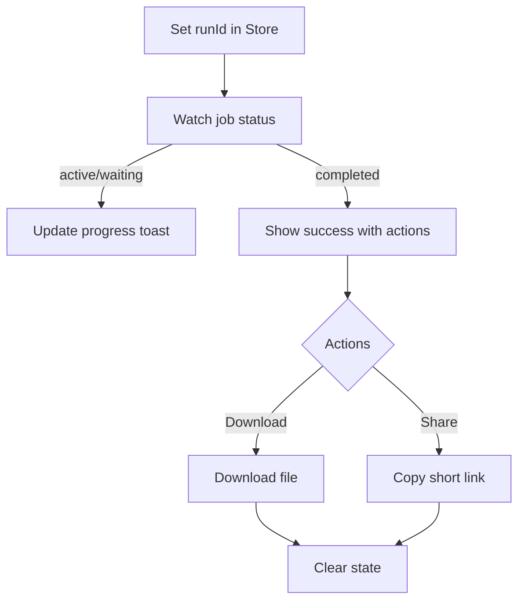
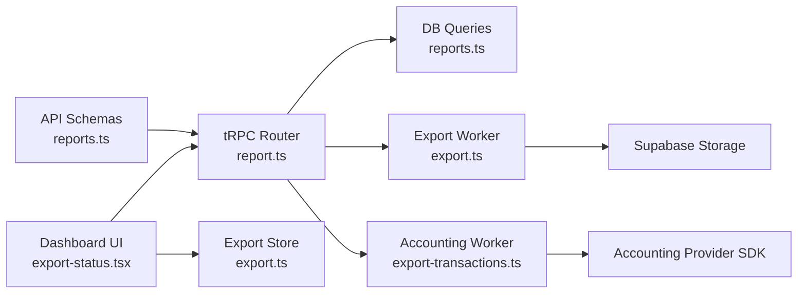

# Export & Reporting

<cite>
**Referenced Files in This Document**
- [reports.ts](file://midday/apps/api/src/schemas/reports.ts)
- [reports.ts](file://midday/apps/api/src/trpc/routers/report.ts)
- [reports.ts](file://midday/packages/db/src/queries/reports.ts)
- [export.ts](file://midday/apps/worker/src/processors/transactions/export.ts)
- [export-transactions.ts](file://midday/apps/worker/src/processors/accounting/export-transactions.ts)
- [export.ts](file://midday/apps/dashboard/src/store/export.ts)
- [export-status.tsx](file://midday/apps/dashboard/src/components/export-status.tsx)
</cite>

## Table of Contents
1. [Introduction](#introduction)
2. [Project Structure](#project-structure)
3. [Core Components](#core-components)
4. [Architecture Overview](#architecture-overview)
5. [Detailed Component Analysis](#detailed-component-analysis)
6. [Dependency Analysis](#dependency-analysis)
7. [Performance Considerations](#performance-considerations)
8. [Security and Access Controls](#security-and-access-controls)
9. [Troubleshooting Guide](#troubleshooting-guide)
10. [Conclusion](#conclusion)

## Introduction
This document explains Faworra’s export and reporting capabilities. It covers multi-format export options (CSV and Excel via ZIP packaging), automated transaction export workflows, sharing and distribution mechanisms, and the underlying report generation APIs. It also details accounting provider integrations for exporting transactions, progress tracking, storage, and notifications. Security, performance, and error handling are addressed to help operators configure reliable, scalable export operations.

## Project Structure
Faworra’s export and reporting spans the API layer, database queries, worker processors, and the dashboard UI:
- API schemas define report types and parameters.
- tRPC routes expose report endpoints and mutation for creating shareable links.
- Database queries compute financial metrics and organize data for export.
- Worker processors orchestrate file generation, compression, storage, and optional email notifications.
- Dashboard stores export state and displays progress and completion actions.

**Diagram sources**
- [export-status.tsx](file://midday/apps/dashboard/src/components/export-status.tsx#L81-L324)
- [export.ts](file://midday/apps/dashboard/src/store/export.ts#L1-L32)
- [reports.ts](file://midday/apps/api/src/trpc/routers/report.ts#L1-L187)
- [reports.ts](file://midday/apps/api/src/schemas/reports.ts#L613-L647)
- [export.ts](file://midday/apps/worker/src/processors/transactions/export.ts#L51-L299)
- [export-transactions.ts](file://midday/apps/worker/src/processors/accounting/export-transactions.ts#L123-L584)
- [reports.ts](file://midday/packages/db/src/queries/reports.ts#L140-L611)

**Section sources**
- [reports.ts](file://midday/apps/api/src/schemas/reports.ts#L613-L647)
- [reports.ts](file://midday/apps/api/src/trpc/routers/report.ts#L1-L187)
- [reports.ts](file://midday/packages/db/src/queries/reports.ts#L140-L611)
- [export.ts](file://midday/apps/worker/src/processors/transactions/export.ts#L51-L299)
- [export-transactions.ts](file://midday/apps/worker/src/processors/accounting/export-transactions.ts#L123-L584)
- [export.ts](file://midday/apps/dashboard/src/store/export.ts#L1-L32)
- [export-status.tsx](file://midday/apps/dashboard/src/components/export-status.tsx#L81-L324)

## Core Components
- Report schemas and tRPC router: Define supported report types, parameters, and endpoints for generating and sharing reports.
- Report database queries: Compute revenue, profit, burn rate, runway, expenses, spending, tax summaries, forecasts, and related metadata.
- Transaction export worker: Builds CSV and XLSX files, zips them, uploads to storage, optionally emails download links, and marks transactions exported.
- Accounting export worker: Exports transactions to provider systems (e.g., Xero, QuickBooks), manages retries, attachments, and error classification.
- Dashboard export store and UI: Tracks export runs, shows progress, and offers download/share actions.

**Section sources**
- [reports.ts](file://midday/apps/api/src/schemas/reports.ts#L613-L647)
- [reports.ts](file://midday/apps/api/src/trpc/routers/report.ts#L1-L187)
- [reports.ts](file://midday/packages/db/src/queries/reports.ts#L140-L611)
- [export.ts](file://midday/apps/worker/src/processors/transactions/export.ts#L51-L299)
- [export-transactions.ts](file://midday/apps/worker/src/processors/accounting/export-transactions.ts#L123-L584)
- [export.ts](file://midday/apps/dashboard/src/store/export.ts#L1-L32)
- [export-status.tsx](file://midday/apps/dashboard/src/components/export-status.tsx#L81-L324)

## Architecture Overview
The export and reporting pipeline integrates UI, API, workers, and storage:

**Diagram sources**
- [export-status.tsx](file://midday/apps/dashboard/src/components/export-status.tsx#L81-L324)
- [export.ts](file://midday/apps/dashboard/src/store/export.ts#L1-L32)
- [reports.ts](file://midday/apps/api/src/trpc/routers/report.ts#L1-L187)
- [reports.ts](file://midday/packages/db/src/queries/reports.ts#L140-L611)
- [export.ts](file://midday/apps/worker/src/processors/transactions/export.ts#L51-L299)

## Detailed Component Analysis

### Report Types and Parameters
Supported report types include revenue, profit, burn rate, runway, expenses, spending, tax summary, revenue forecast, and balance sheet. Each endpoint validates inputs and returns structured results with summary, metadata, and per-period arrays.

**Diagram sources**
- [reports.ts](file://midday/apps/api/src/schemas/reports.ts#L3-L776)
- [reports.ts](file://midday/apps/api/src/trpc/routers/report.ts#L38-L186)
- [reports.ts](file://midday/packages/db/src/queries/reports.ts#L157-L611)

**Section sources**
- [reports.ts](file://midday/apps/api/src/schemas/reports.ts#L3-L776)
- [reports.ts](file://midday/apps/api/src/trpc/routers/report.ts#L38-L186)
- [reports.ts](file://midday/packages/db/src/queries/reports.ts#L157-L611)

### Transaction Export Workflow (CSV/XLSX/ZIP)
The transaction export worker:
- Processes batches of transaction IDs.
- Generates CSV and/or XLSX from processed rows.
- Zips files and uploads to storage.
- Optionally emails a short-lived download link.
- Marks transactions exported and updates document metadata.

**Diagram sources**
- [export.ts](file://midday/apps/worker/src/processors/transactions/export.ts#L51-L299)

**Section sources**
- [export.ts](file://midday/apps/worker/src/processors/transactions/export.ts#L51-L299)

### Accounting Export to Providers
The accounting export processor:
- Initializes provider with credentials.
- Categorizes transactions (new vs. attachment changes).
- Syncs transactions in batches with rate-limit-aware delays.
- Triggers attachment sync jobs with staggered delays.
- Records sync status and error codes.

**Diagram sources**
- [export-transactions.ts](file://midday/apps/worker/src/processors/accounting/export-transactions.ts#L123-L584)

**Section sources**
- [export-transactions.ts](file://midday/apps/worker/src/processors/accounting/export-transactions.ts#L123-L584)

### Dashboard Export UI and State
The dashboard tracks export runs, shows progress, and provides download/share actions. It supports:
- Progress updates via job status.
- Copy-to-clipboard for share URLs.
- Download button with authenticated URLs.
- Completion sound and query invalidation.

**Diagram sources**
- [export-status.tsx](file://midday/apps/dashboard/src/components/export-status.tsx#L81-L324)
- [export.ts](file://midday/apps/dashboard/src/store/export.ts#L1-L32)

**Section sources**
- [export-status.tsx](file://midday/apps/dashboard/src/components/export-status.tsx#L81-L324)
- [export.ts](file://midday/apps/dashboard/src/store/export.ts#L1-L32)

## Dependency Analysis
- API schemas depend on OpenAPI/Zod for validation.
- tRPC router depends on DB queries and exposes report endpoints and a shareable link creation mutation.
- Workers depend on DB queries for data retrieval and on storage clients for uploads.
- Dashboard depends on tRPC and job status hooks to render progress and actions.

**Diagram sources**
- [reports.ts](file://midday/apps/api/src/schemas/reports.ts#L613-L647)
- [reports.ts](file://midday/apps/api/src/trpc/routers/report.ts#L1-L187)
- [reports.ts](file://midday/packages/db/src/queries/reports.ts#L140-L611)
- [export.ts](file://midday/apps/worker/src/processors/transactions/export.ts#L51-L299)
- [export-transactions.ts](file://midday/apps/worker/src/processors/accounting/export-transactions.ts#L123-L584)
- [export-status.tsx](file://midday/apps/dashboard/src/components/export-status.tsx#L81-L324)
- [export.ts](file://midday/apps/dashboard/src/store/export.ts#L1-L32)

**Section sources**
- [reports.ts](file://midday/apps/api/src/schemas/reports.ts#L613-L647)
- [reports.ts](file://midday/apps/api/src/trpc/routers/report.ts#L1-L187)
- [reports.ts](file://midday/packages/db/src/queries/reports.ts#L140-L611)
- [export.ts](file://midday/apps/worker/src/processors/transactions/export.ts#L51-L299)
- [export-transactions.ts](file://midday/apps/worker/src/processors/accounting/export-transactions.ts#L123-L584)
- [export-status.tsx](file://midday/apps/dashboard/src/components/export-status.tsx#L81-L324)
- [export.ts](file://midday/apps/dashboard/src/store/export.ts#L1-L32)

## Performance Considerations
- Batch processing: Workers process transactions in fixed-size batches to reduce memory pressure and improve throughput.
- Parallelization: Report computations and independent tasks are executed concurrently where possible.
- Streaming: ZIP creation streams data to minimize memory usage.
- Rate limiting: Accounting exports stagger jobs to respect provider rate limits.
- Caching: Currency and category caches reduce repeated DB lookups.

Recommendations:
- Increase batch sizes cautiously based on memory and provider limits.
- Monitor worker queue backlogs and scale horizontally.
- Use compression level appropriate for storage and bandwidth trade-offs.
- Consider partitioning large date ranges into smaller windows for report queries.

[No sources needed since this section provides general guidance]

## Security and Access Controls
- Authentication and authorization: tRPC procedures enforce protected/public access depending on endpoint.
- Short-lived sharing: Shareable links are created with expiration and short IDs.
- Signed URLs: Download links use signed URLs with controlled expiry.
- Provider credentials: Accounting exports rely on stored provider tokens managed securely by the provider SDKs.
- Audit and logging: Workers log progress, errors, and outcomes for traceability.

Best practices:
- Limit share link lifetimes.
- Restrict provider scopes to required permissions.
- Monitor error codes and retry policies for failed exports.
- Review logs for unauthorized access attempts.

**Section sources**
- [reports.ts](file://midday/apps/api/src/trpc/routers/report.ts#L134-L151)
- [export.ts](file://midday/apps/worker/src/processors/transactions/export.ts#L240-L286)
- [export-transactions.ts](file://midday/apps/worker/src/processors/accounting/export-transactions.ts#L17-L67)

## Troubleshooting Guide
Common issues and resolutions:
- Export timeouts: Verify storage upload timeouts and network connectivity; adjust timeouts if needed.
- Provider rate limits: Inspect error codes and ensure delayed job scheduling is applied.
- Missing attachments: Confirm blob availability and filenames; logs capture failures per attachment.
- Incomplete exports: Check job status and re-run; review partial sync records for reprocessing.
- Email delivery: Ensure notification jobs are enqueued and provider SMTP settings are configured.

Operational checks:
- Validate tRPC inputs against schemas.
- Inspect worker logs for batch-level errors and error codes.
- Confirm storage bucket permissions and quotas.
- Re-fetch job status if UI progress stalls.

**Section sources**
- [export.ts](file://midday/apps/worker/src/processors/transactions/export.ts#L213-L224)
- [export-transactions.ts](file://midday/apps/worker/src/processors/accounting/export-transactions.ts#L17-L67)
- [export-transactions.ts](file://midday/apps/worker/src/processors/accounting/export-transactions.ts#L384-L435)

## Conclusion
Faworra provides robust, extensible export and reporting capabilities:
- Multi-format transaction exports (CSV/XLSX) packaged in ZIP with optional email delivery.
- Automated workflows with progress tracking, batching, and storage integration.
- Provider-ready accounting exports with intelligent categorization, retries, and attachment sync.
- Secure sharing via short-lived links and signed URLs.
- Strong observability through job status, logs, and structured error codes.

These components enable efficient, compliant, and scalable financial data workflows for teams and accountants.