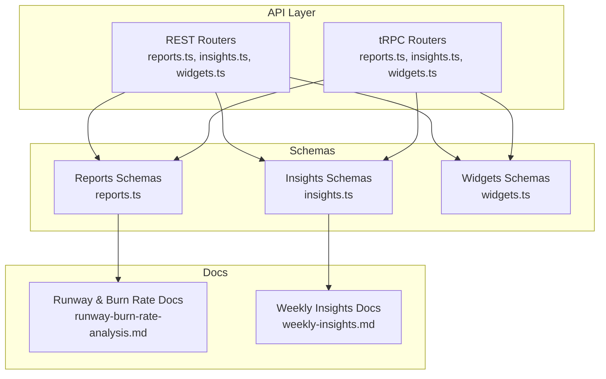
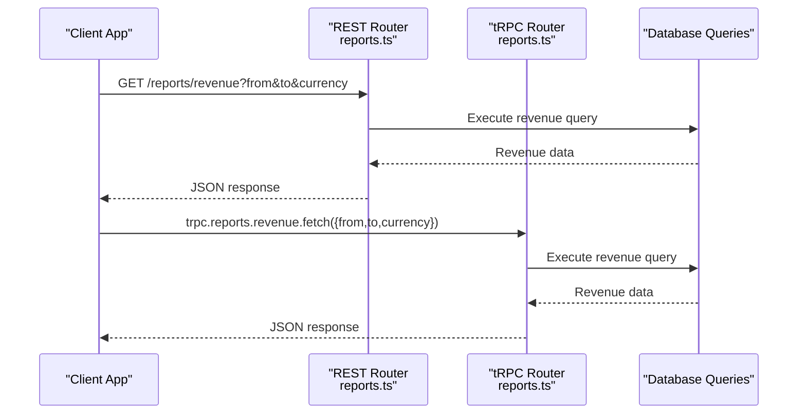
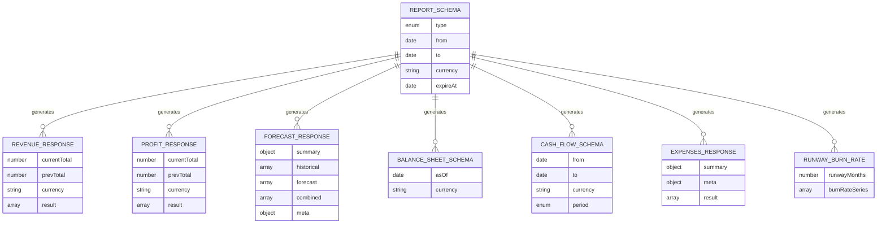
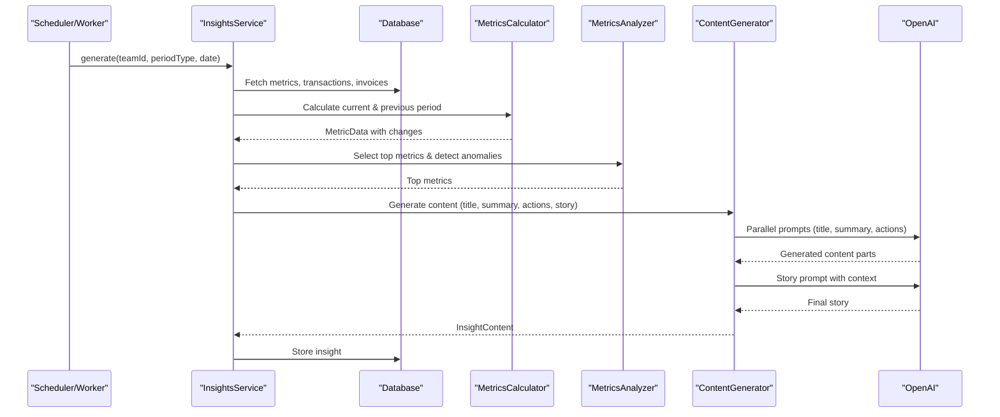
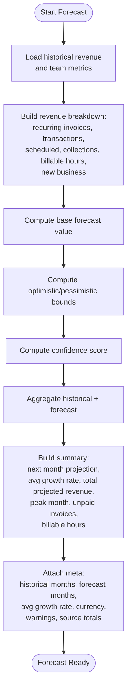
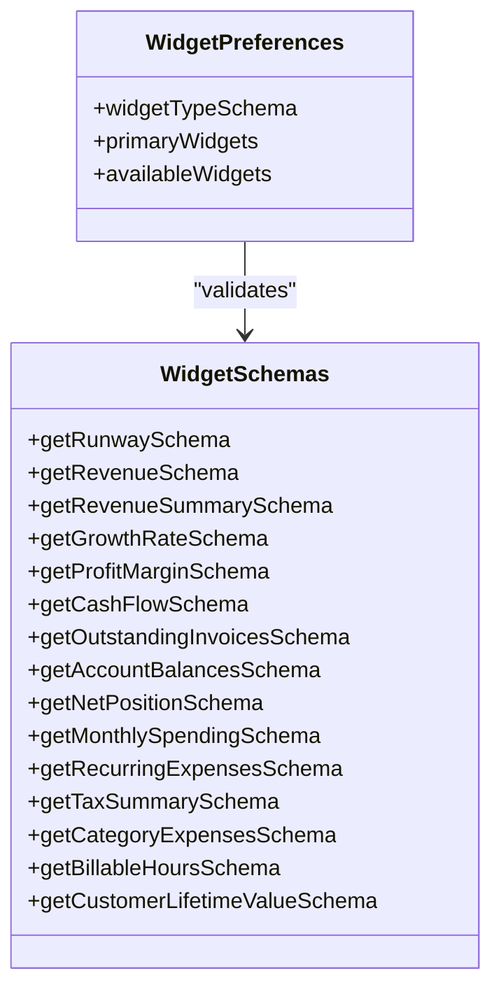
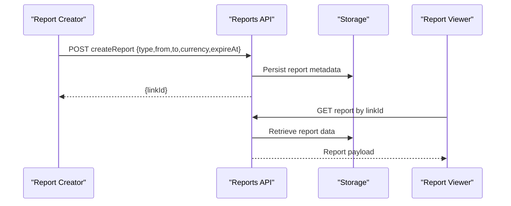
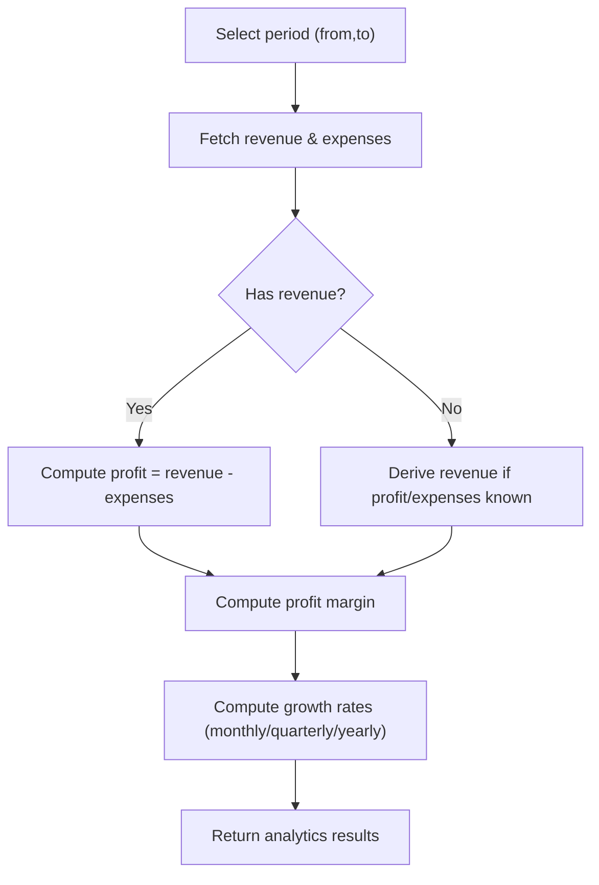
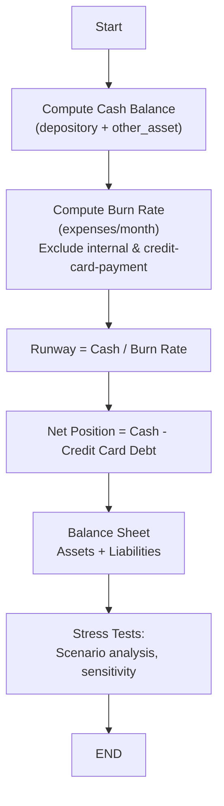
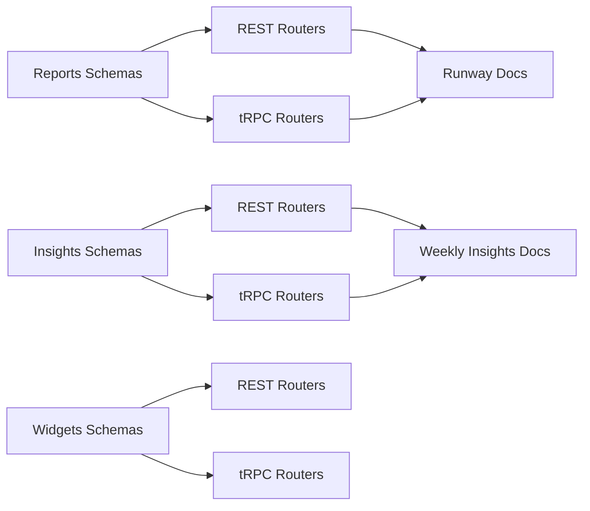

# Financial Reporting & Analytics

<cite>
**Referenced Files in This Document**
- [reports.ts](file://midday/apps/api/src/schemas/reports.ts)
- [insights.ts](file://midday/apps/api/src/schemas/insights.ts)
- [widgets.ts](file://midday/apps/api/src/schemas/widgets.ts)
- [runway-burn-rate-analysis.md](file://midday/docs/runway-burn-rate-analysis.md)
- [weekly-insights.md](file://midday/docs/weekly-insights.md)
- [reports.ts](file://midday/apps/api/src/rest/routers/reports.ts)
- [reports.ts](file://midday/apps/api/src/trpc/routers/reports.ts)
- [insights.ts](file://midday/apps/api/src/rest/routers/insights.ts)
- [insights.ts](file://midday/apps/api/src/trpc/routers/insights.ts)
- [widgets.ts](file://midday/apps/api/src/rest/routers/widgets.ts)
- [widgets.ts](file://midday/apps/api/src/trpc/routers/widgets.ts)
</cite>

## Table of Contents
1. [Introduction](#introduction)
2. [Project Structure](#project-structure)
3. [Core Components](#core-components)
4. [Architecture Overview](#architecture-overview)
5. [Detailed Component Analysis](#detailed-component-analysis)
6. [Dependency Analysis](#dependency-analysis)
7. [Performance Considerations](#performance-considerations)
8. [Troubleshooting Guide](#troubleshooting-guide)
9. [Conclusion](#conclusion)
10. [Appendices](#appendices)

## Introduction
This document describes Faworra’s financial reporting and analytics capabilities. It covers the comprehensive reporting suite (profit and loss, balance sheet, cash flow), custom and shared reports, AI-powered insights generation, trend analysis, predictive forecasting, the metrics dashboard with customizable widgets, KPI tracking, automated report generation and distribution, financial analytics (revenue trends, expense analysis, profitability), export capabilities, business health scoring, runway analysis, and financial stress testing. It also provides examples of report creation, dashboard customization, and automated reporting workflows.

## Project Structure
Faworra’s financial reporting and analytics span three layers:
- REST and tRPC routers expose endpoints for reports, insights, and widgets.
- Schemas define request/response contracts for robust API design.
- Documentation explains financial calculations, data flows, and troubleshooting for runway, burn rate, and balance sheet reporting.

**Diagram sources**
- [reports.ts](file://midday/apps/api/src/rest/routers/reports.ts)
- [reports.ts](file://midday/apps/api/src/trpc/routers/reports.ts)
- [insights.ts](file://midday/apps/api/src/rest/routers/insights.ts)
- [insights.ts](file://midday/apps/api/src/trpc/routers/insights.ts)
- [widgets.ts](file://midday/apps/api/src/rest/routers/widgets.ts)
- [widgets.ts](file://midday/apps/api/src/trpc/routers/widgets.ts)
- [reports.ts](file://midday/apps/api/src/schemas/reports.ts)
- [insights.ts](file://midday/apps/api/src/schemas/insights.ts)
- [widgets.ts](file://midday/apps/api/src/schemas/widgets.ts)
- [runway-burn-rate-analysis.md](file://midday/docs/runway-burn-rate-analysis.md)
- [weekly-insights.md](file://midday/docs/weekly-insights.md)

**Section sources**
- [reports.ts](file://midday/apps/api/src/schemas/reports.ts#L1-L776)
- [insights.ts](file://midday/apps/api/src/schemas/insights.ts#L1-L290)
- [widgets.ts](file://midday/apps/api/src/schemas/widgets.ts#L1-L130)
- [runway-burn-rate-analysis.md](file://midday/docs/runway-burn-rate-analysis.md#L1-L352)
- [weekly-insights.md](file://midday/docs/weekly-insights.md#L1-L425)

## Core Components
- Reports API: Defines endpoints and schemas for revenue, profit, burn rate, runway, expenses, spending, cash flow, balance sheet, revenue forecasts, growth rates, and profit margins. Supports shared report creation and retrieval via link identifiers.
- Insights API: Provides paginated listing, latest, and period-specific retrieval of AI-generated insights, including metrics, content, and audio URLs. Includes dismissal and read tracking.
- Widgets API: Supplies schemas for dashboard widgets such as revenue, profit margin, cash flow, outstanding invoices, account balances, recurring expenses, tax summary, category expenses, billable hours, and more. Includes preferences for primary and available widgets.

**Section sources**
- [reports.ts](file://midday/apps/api/src/schemas/reports.ts#L1-L776)
- [insights.ts](file://midday/apps/api/src/schemas/insights.ts#L1-L290)
- [widgets.ts](file://midday/apps/api/src/schemas/widgets.ts#L1-L130)

## Architecture Overview
The reporting and analytics architecture integrates REST and tRPC routers with strongly typed schemas. Data flows from backend queries to frontend dashboards and shared report views. AI-driven insights are generated asynchronously and surfaced through dedicated endpoints.

**Diagram sources**
- [reports.ts](file://midday/apps/api/src/rest/routers/reports.ts)
- [reports.ts](file://midday/apps/api/src/trpc/routers/reports.ts)
- [reports.ts](file://midday/apps/api/src/schemas/reports.ts#L1-L220)

## Detailed Component Analysis

### Reporting Suite
The reporting suite supports:
- Profit and Loss: Revenue, profit, profit margin, growth rate, and revenue forecasts.
- Balance Sheet: As-of-date asset and liability positions.
- Cash Flow: Aggregated monthly or quarterly cash flow.
- Expenses and Spending: Periodic totals, recurring expenses, and category spending breakdowns.
- Runway and Burn Rate: Runway in months and burn rate series.
- Shared Reports: Create and retrieve shared report links with expiration.

**Diagram sources**
- [reports.ts](file://midday/apps/api/src/schemas/reports.ts#L1-L776)

**Section sources**
- [reports.ts](file://midday/apps/api/src/schemas/reports.ts#L1-L776)

### AI-Powered Insights Generation
The insights system:
- Orchestrates data fetching, metric calculation, anomaly detection, and content generation.
- Produces structured insights with metrics, content, and recommended actions.
- Supports pagination, latest retrieval, period-based lookup, dismissal, and read tracking.
- Provides audio URLs for accessibility.

**Diagram sources**
- [weekly-insights.md](file://midday/docs/weekly-insights.md#L18-L54)
- [insights.ts](file://midday/apps/api/src/schemas/insights.ts#L1-L290)

**Section sources**
- [weekly-insights.md](file://midday/docs/weekly-insights.md#L1-L425)
- [insights.ts](file://midday/apps/api/src/schemas/insights.ts#L1-L290)

### Predictive Forecasting
Revenue forecasting uses a bottom-up methodology incorporating recurring invoices, recurring transactions, scheduled invoices, expected collections, billable hours, and new business projections. The forecast includes base, optimistic, and pessimistic scenarios with confidence scores and warnings.

**Diagram sources**
- [reports.ts](file://midday/apps/api/src/schemas/reports.ts#L420-L611)

**Section sources**
- [reports.ts](file://midday/apps/api/src/schemas/reports.ts#L420-L611)

### Metrics Dashboard and Customizable Widgets
The dashboard exposes numerous widgets for KPIs and performance indicators:
- Revenue, revenue summary, growth rate, profit margin
- Cash flow, outstanding invoices, account balances, net position
- Monthly spending, recurring expenses, tax summary, category expenses
- Billable hours, customer lifetime value
- Preferences allow selecting primary and available widgets.

**Diagram sources**
- [widgets.ts](file://midday/apps/api/src/schemas/widgets.ts#L1-L130)

**Section sources**
- [widgets.ts](file://midday/apps/api/src/schemas/widgets.ts#L1-L130)

### Automated Report Generation, Scheduling, and Distribution
Shared reports can be created with optional expiration dates and retrieved via link identifiers. While the repository documentation focuses on schemas and flows, the presence of shared report schemas indicates a framework for automated generation and distribution.

**Diagram sources**
- [reports.ts](file://midday/apps/api/src/schemas/reports.ts#L624-L666)

**Section sources**
- [reports.ts](file://midday/apps/api/src/schemas/reports.ts#L624-L666)

### Financial Analytics: Revenue Trends, Expense Analysis, Profitability
- Revenue trends: Period-over-period revenue with percentage change and currency-aware values.
- Expense analysis: Average expenses, recurring vs total, and category breakdowns.
- Profitability: Profit totals, profit margin, and growth rates across periods.

**Diagram sources**
- [reports.ts](file://midday/apps/api/src/schemas/reports.ts#L1-L776)

**Section sources**
- [reports.ts](file://midday/apps/api/src/schemas/reports.ts#L1-L776)

### Export Capabilities
The repository defines shared report schemas and widgets but does not include explicit export endpoints in the referenced files. Teams can integrate export functionality by extending the reports router to support PDF, Excel, and CSV generation using the existing schemas and data.

[No sources needed since this section provides general guidance]

### Business Health Score, Runway Analysis, and Financial Stress Testing
- Runway: Months of operation based on cash and average monthly burn rate.
- Burn Rate: Excludes internal transfers and credit card payments to avoid double counting.
- Net Position: Cash minus credit card debt.
- Balance Sheet: Assets and liabilities including accounts receivable and loans.
- Stress testing: Use forecast scenarios (optimistic/pessimistic) and sensitivity analysis around key assumptions.

**Diagram sources**
- [runway-burn-rate-analysis.md](file://midday/docs/runway-burn-rate-analysis.md#L68-L168)

**Section sources**
- [runway-burn-rate-analysis.md](file://midday/docs/runway-burn-rate-analysis.md#L1-L352)

### Examples
- Report Creation: Use the shared report schema to create a report with type, date range, currency, and optional expiration. Retrieve via link identifier.
- Dashboard Customization: Update widget preferences to set primary widgets and available widgets.
- Automated Reporting Workflow: Schedule periodic generation of forecasts or runways and distribute via shared links.

**Section sources**
- [reports.ts](file://midday/apps/api/src/schemas/reports.ts#L624-L666)
- [widgets.ts](file://midday/apps/api/src/schemas/widgets.ts#L122-L130)
- [weekly-insights.md](file://midday/docs/weekly-insights.md#L1-L425)

## Dependency Analysis
The reporting and analytics stack depends on:
- Strongly typed schemas to enforce request/response contracts.
- REST and tRPC routers to expose endpoints consistently.
- Documentation to guide financial calculations and troubleshooting.

**Diagram sources**
- [reports.ts](file://midday/apps/api/src/schemas/reports.ts#L1-L776)
- [insights.ts](file://midday/apps/api/src/schemas/insights.ts#L1-L290)
- [widgets.ts](file://midday/apps/api/src/schemas/widgets.ts#L1-L130)
- [runway-burn-rate-analysis.md](file://midday/docs/runway-burn-rate-analysis.md#L1-L352)
- [weekly-insights.md](file://midday/docs/weekly-insights.md#L1-L425)

**Section sources**
- [reports.ts](file://midday/apps/api/src/schemas/reports.ts#L1-L776)
- [insights.ts](file://midday/apps/api/src/schemas/insights.ts#L1-L290)
- [widgets.ts](file://midday/apps/api/src/schemas/widgets.ts#L1-L130)
- [runway-burn-rate-analysis.md](file://midday/docs/runway-burn-rate-analysis.md#L1-L352)
- [weekly-insights.md](file://midday/docs/weekly-insights.md#L1-L425)

## Performance Considerations
- Use appropriate aggregation periods (monthly/quarterly) to reduce payload sizes.
- Cache frequently accessed metrics and leverage widget polling configurations.
- Apply filters (date ranges, currencies) to minimize dataset size.
- For AI insights, batch generation and parallel prompt execution improve throughput.

[No sources needed since this section provides general guidance]

## Troubleshooting Guide
Common issues and resolutions:
- Runway shows zero or incorrect values: verify cash accounts, currency alignment, and transaction availability.
- Credit card balance appears positive: expected behavior; stored as positive values representing amounts owed.
- Net position cash mismatch: confirm only depository and other_asset accounts are counted and accounts are enabled.
- Double-counted expenses in burn rate: ensure credit-card-payment and internal-transfer categories are excluded.
- Provider sync issues: ingestion-time normalization and query-time Math.abs() handle provider differences.

**Section sources**
- [runway-burn-rate-analysis.md](file://midday/docs/runway-burn-rate-analysis.md#L226-L352)

## Conclusion
Faworra’s financial reporting and analytics provide a robust foundation for revenue and profit tracking, cash flow monitoring, forecasting, and AI-driven insights. The schema-first design, dashboard widgets, and shared reporting capabilities enable teams to build custom dashboards, automate reporting, and drive data-informed decisions. Extending export and advanced stress-testing features can further enhance the platform’s analytical depth.

## Appendices
- API Endpoints: Reports, insights, and widgets routers expose endpoints for all major financial views.
- Financial Calculations: Runway, burn rate, net position, and balance sheet definitions are documented with data flow diagrams and troubleshooting steps.

**Section sources**
- [reports.ts](file://midday/apps/api/src/rest/routers/reports.ts)
- [reports.ts](file://midday/apps/api/src/trpc/routers/reports.ts)
- [insights.ts](file://midday/apps/api/src/rest/routers/insights.ts)
- [insights.ts](file://midday/apps/api/src/trpc/routers/insights.ts)
- [widgets.ts](file://midday/apps/api/src/rest/routers/widgets.ts)
- [widgets.ts](file://midday/apps/api/src/trpc/routers/widgets.ts)
- [runway-burn-rate-analysis.md](file://midday/docs/runway-burn-rate-analysis.md#L1-L352)
- [weekly-insights.md](file://midday/docs/weekly-insights.md#L1-L425)