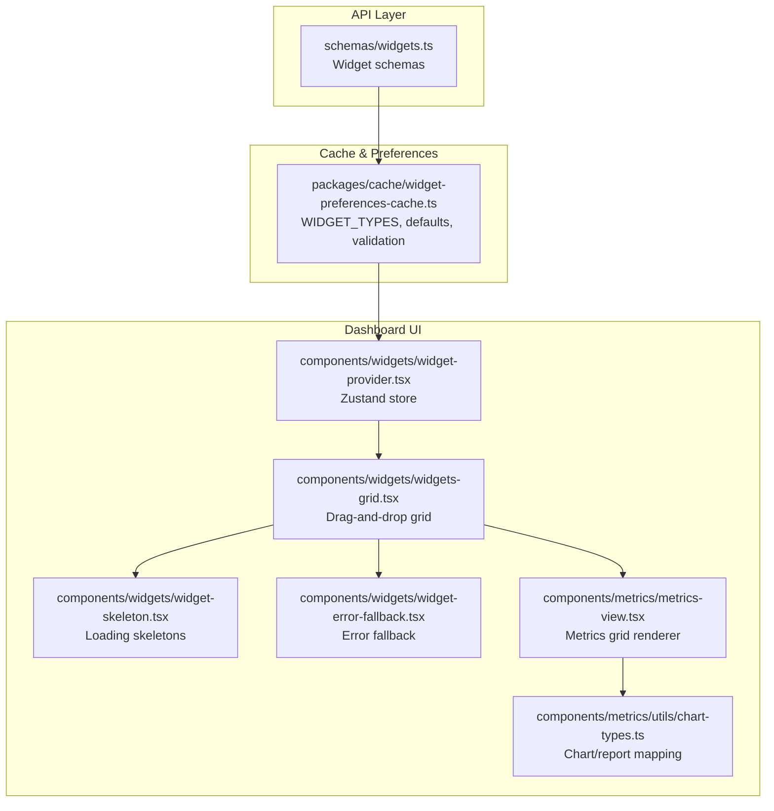
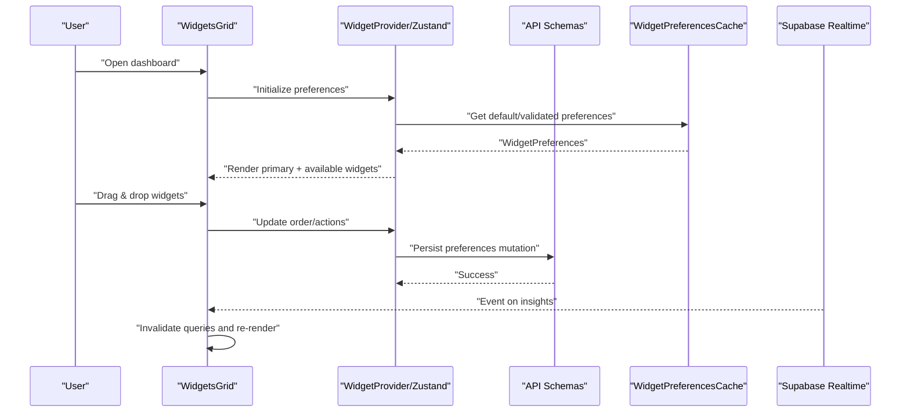
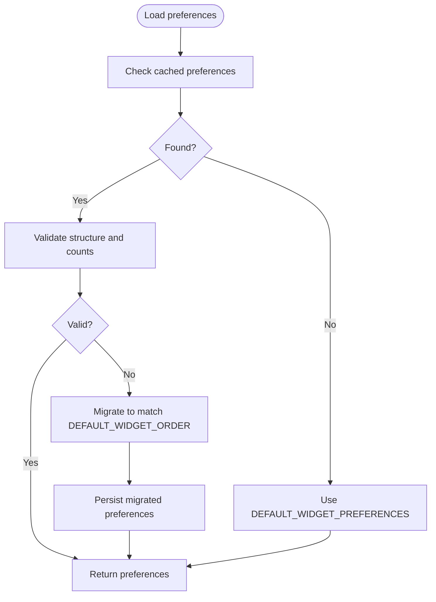
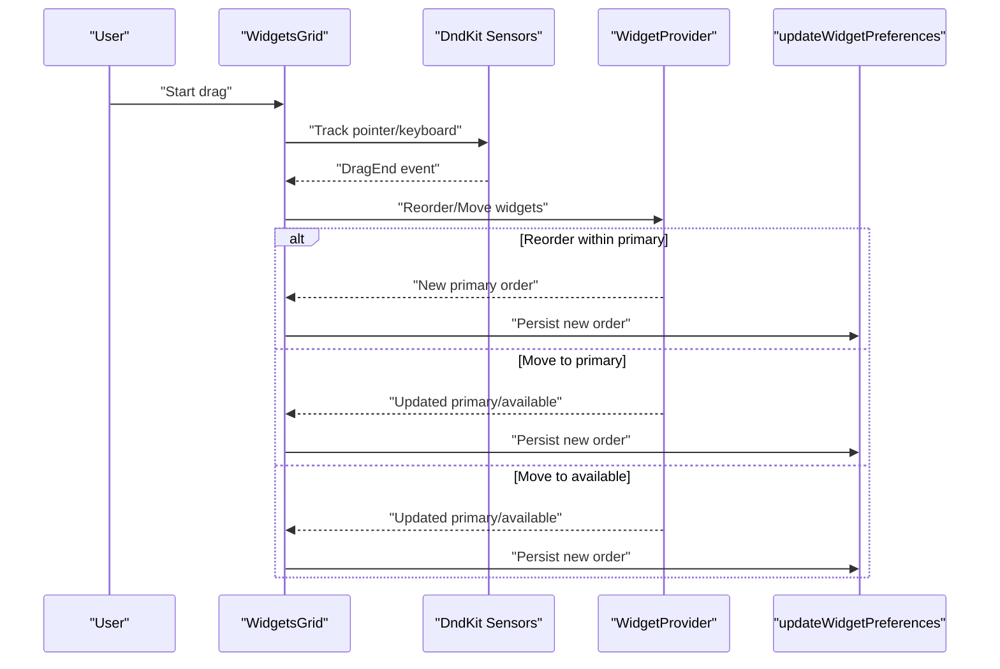
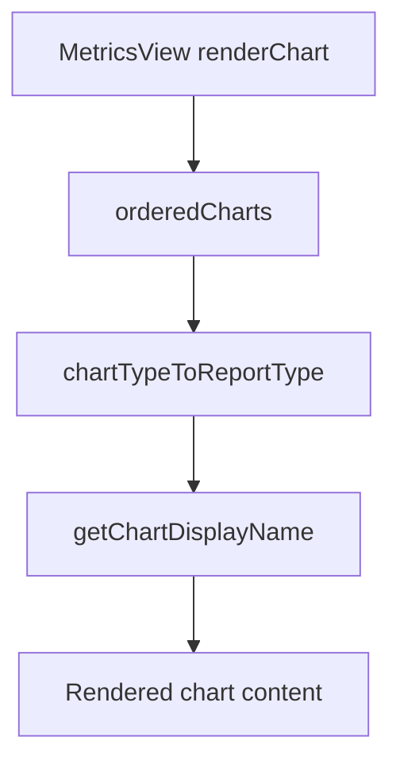
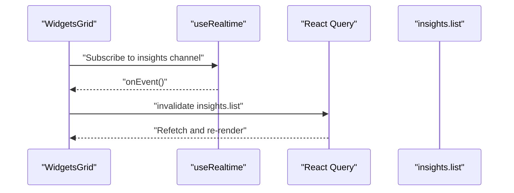
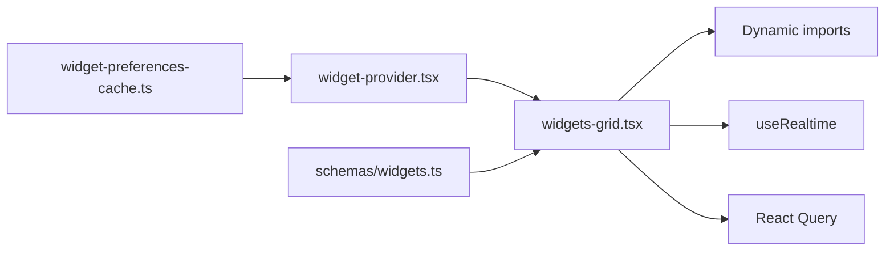

# Metrics Dashboard & Widgets

<cite>
**Referenced Files in This Document**
- [widgets.ts](file://midday/apps/api/src/schemas/widgets.ts)
- [widget-preferences-cache.ts](file://midday/packages/cache/src/widget-preferences-cache.ts)
- [widgets-grid.tsx](file://midday/apps/dashboard/src/components/widgets/widgets-grid.tsx)
- [widget-provider.tsx](file://midday/apps/dashboard/src/components/widgets/widget-provider.tsx)
- [widget-error-fallback.tsx](file://midday/apps/dashboard/src/components/widgets/widget-error-fallback.tsx)
- [widget-skeleton.tsx](file://midday/apps/dashboard/src/components/widgets/widget-skeleton.tsx)
- [metrics-view.tsx](file://midday/apps/dashboard/src/components/metrics/metrics-view.tsx)
- [chart-types.ts](file://midday/apps/dashboard/src/components/metrics/utils/chart-types.ts)
</cite>

## Table of Contents
1. [Introduction](#introduction)
2. [Project Structure](#project-structure)
3. [Core Components](#core-components)
4. [Architecture Overview](#architecture-overview)
5. [Detailed Component Analysis](#detailed-component-analysis)
6. [Dependency Analysis](#dependency-analysis)
7. [Performance Considerations](#performance-considerations)
8. [Troubleshooting Guide](#troubleshooting-guide)
9. [Conclusion](#conclusion)
10. [Appendices](#appendices)

## Introduction
This document explains Faworra’s interactive metrics dashboard and widget system. It covers the customizable dashboard layout, widget configuration, real-time data visualization, supported widget types, chart types, filtering and date-range selection, drill-down capabilities, customization workflows, performance monitoring, metric calculation engines, data aggregation, real-time updates, export capabilities, and responsive/mobile accessibility.

## Project Structure
The dashboard and widget system spans the API schemas, caching and preferences, and the Next.js dashboard UI. The key areas are:
- API schemas define widget metrics and their input parameters.
- Cache stores and validates per-user widget preferences.
- Dashboard UI renders widgets, supports drag-and-drop reordering, and integrates real-time updates.

**Diagram sources**
- [widgets.ts](file://midday/apps/api/src/schemas/widgets.ts#L1-L130)
- [widget-preferences-cache.ts](file://midday/packages/cache/src/widget-preferences-cache.ts#L1-L211)
- [widgets-grid.tsx](file://midday/apps/dashboard/src/components/widgets/widgets-grid.tsx#L1-L619)
- [widget-provider.tsx](file://midday/apps/dashboard/src/components/widgets/widget-provider.tsx#L1-L218)
- [widget-skeleton.tsx](file://midday/apps/dashboard/src/components/widgets/widget-skeleton.tsx#L1-L76)
- [widget-error-fallback.tsx](file://midday/apps/dashboard/src/components/widgets/widget-error-fallback.tsx#L1-L10)
- [metrics-view.tsx](file://midday/apps/dashboard/src/components/metrics/metrics-view.tsx#L134-L154)
- [chart-types.ts](file://midday/apps/dashboard/src/components/metrics/utils/chart-types.ts#L52-L78)

**Section sources**
- [widgets.ts](file://midday/apps/api/src/schemas/widgets.ts#L1-L130)
- [widget-preferences-cache.ts](file://midday/packages/cache/src/widget-preferences-cache.ts#L1-L211)
- [widgets-grid.tsx](file://midday/apps/dashboard/src/components/widgets/widgets-grid.tsx#L1-L619)
- [widget-provider.tsx](file://midday/apps/dashboard/src/components/widgets/widget-provider.tsx#L1-L218)
- [widget-skeleton.tsx](file://midday/apps/dashboard/src/components/widgets/widget-skeleton.tsx#L1-L76)
- [widget-error-fallback.tsx](file://midday/apps/dashboard/src/components/widgets/widget-error-fallback.tsx#L1-L10)
- [metrics-view.tsx](file://midday/apps/dashboard/src/components/metrics/metrics-view.tsx#L134-L154)
- [chart-types.ts](file://midday/apps/dashboard/src/components/metrics/utils/chart-types.ts#L52-L78)

## Core Components
- Widget types and preferences:
  - Widget types are centrally defined and grouped into categories (financial health, position, receivables/invoices, expenses/spending, profitability, operations, admin/documents).
  - Defaults specify which widgets appear by default in the primary area and which remain available for addition.
  - Validation ensures preferences remain consistent and within limits (e.g., max 7 primary widgets).
- Widget rendering and interactivity:
  - A dynamic import strategy loads widgets on demand to optimize initial load.
  - Drag-and-drop reordering uses a sortable context with keyboard and pointer sensors.
  - Real-time updates subscribe to backend events and invalidate queries to refresh insights.
- UI primitives:
  - Skeletons provide immediate perceived progress while widgets load.
  - Error boundaries wrap widgets to prevent cascading failures.

**Section sources**
- [widget-preferences-cache.ts](file://midday/packages/cache/src/widget-preferences-cache.ts#L3-L55)
- [widgets-grid.tsx](file://midday/apps/dashboard/src/components/widgets/widgets-grid.tsx#L50-L193)
- [widgets-grid.tsx](file://midday/apps/dashboard/src/components/widgets/widgets-grid.tsx#L272-L402)
- [widget-provider.tsx](file://midday/apps/dashboard/src/components/widgets/widget-provider.tsx#L40-L153)
- [widget-skeleton.tsx](file://midday/apps/dashboard/src/components/widgets/widget-skeleton.tsx#L29-L76)
- [widget-error-fallback.tsx](file://midday/apps/dashboard/src/components/widgets/widget-error-fallback.tsx#L3-L9)

## Architecture Overview
The system separates concerns across API, cache, and UI:
- API schemas define metric endpoints and parameters (date ranges, currencies, filters).
- Cache manages default widget sets and validates user preferences.
- Dashboard UI composes a grid of widgets, supports customization, and integrates real-time updates.

**Diagram sources**
- [widgets-grid.tsx](file://midday/apps/dashboard/src/components/widgets/widgets-grid.tsx#L272-L402)
- [widget-provider.tsx](file://midday/apps/dashboard/src/components/widgets/widget-provider.tsx#L58-L66)
- [widget-preferences-cache.ts](file://midday/packages/cache/src/widget-preferences-cache.ts#L66-L123)
- [widgets.ts](file://midday/apps/api/src/schemas/widgets.ts#L122-L130)

## Detailed Component Analysis

### Widget Types and Preferences
- Centralized widget type list defines all available widgets and groups them by functional area.
- Default preferences split the first 7 widgets into primary and the remainder into available.
- Validation enforces:
  - Exactly one copy of each default widget.
  - No more than 7 primary widgets.
  - No duplicates.
  - Migration handling when new widgets are added or removed.

**Diagram sources**
- [widget-preferences-cache.ts](file://midday/packages/cache/src/widget-preferences-cache.ts#L66-L123)
- [widget-preferences-cache.ts](file://midday/packages/cache/src/widget-preferences-cache.ts#L125-L182)

**Section sources**
- [widget-preferences-cache.ts](file://midday/packages/cache/src/widget-preferences-cache.ts#L3-L55)
- [widget-preferences-cache.ts](file://midday/packages/cache/src/widget-preferences-cache.ts#L66-L123)
- [widget-preferences-cache.ts](file://midday/packages/cache/src/widget-preferences-cache.ts#L125-L182)

### Widget Rendering and Drag-and-Drop
- Dynamic imports load widget components on first appearance to minimize initial payload.
- Sortable cards enable drag-and-drop reordering within the primary area and moving between primary and available areas.
- On desktop, a 4-column grid accommodates up to 7 primary widgets plus a fixed insights widget.
- On mobile, a horizontally scrollable, snap-enabled carousel presents the same widgets.
- Drag overlay provides visual feedback during drags.
- Error boundaries ensure a graceful fallback when a widget fails to render.

**Diagram sources**
- [widgets-grid.tsx](file://midday/apps/dashboard/src/components/widgets/widgets-grid.tsx#L314-L402)
- [widgets-grid.tsx](file://midday/apps/dashboard/src/components/widgets/widgets-grid.tsx#L414-L420)
- [widgets-grid.tsx](file://midday/apps/dashboard/src/components/widgets/widgets-grid.tsx#L462-L532)
- [widgets-grid.tsx](file://midday/apps/dashboard/src/components/widgets/widgets-grid.tsx#L548-L601)

**Section sources**
- [widgets-grid.tsx](file://midday/apps/dashboard/src/components/widgets/widgets-grid.tsx#L50-L193)
- [widgets-grid.tsx](file://midday/apps/dashboard/src/components/widgets/widgets-grid.tsx#L272-L402)
- [widgets-grid.tsx](file://midday/apps/dashboard/src/components/widgets/widgets-grid.tsx#L414-L617)
- [widget-error-fallback.tsx](file://midday/apps/dashboard/src/components/widgets/widget-error-fallback.tsx#L3-L9)

### Metrics View and Chart Types
- The metrics view composes a grid of charts and delegates rendering to a render function.
- Chart/report type mapping provides human-friendly names and bidirectional conversion between chart identifiers and report types.

**Diagram sources**
- [metrics-view.tsx](file://midday/apps/dashboard/src/components/metrics/metrics-view.tsx#L134-L154)
- [chart-types.ts](file://midday/apps/dashboard/src/components/metrics/utils/chart-types.ts#L52-L78)

**Section sources**
- [metrics-view.tsx](file://midday/apps/dashboard/src/components/metrics/metrics-view.tsx#L134-L154)
- [chart-types.ts](file://midday/apps/dashboard/src/components/metrics/utils/chart-types.ts#L52-L78)

### Widget Configuration and Real-Time Updates
- Date range and currency parameters are standardized across widget schemas.
- Real-time updates subscribe to backend events and invalidate queries to refresh insights.
- Loading and error states are handled via skeletons and error fallbacks.

**Diagram sources**
- [widgets-grid.tsx](file://midday/apps/dashboard/src/components/widgets/widgets-grid.tsx#L284-L296)

**Section sources**
- [widgets-grid.tsx](file://midday/apps/dashboard/src/components/widgets/widgets-grid.tsx#L284-L296)
- [widget-skeleton.tsx](file://midday/apps/dashboard/src/components/widgets/widget-skeleton.tsx#L29-L76)
- [widget-error-fallback.tsx](file://midday/apps/dashboard/src/components/widgets/widget-error-fallback.tsx#L3-L9)

## Dependency Analysis
- Widget types and defaults originate from the cache package and are consumed by the dashboard UI.
- The dashboard UI depends on:
  - Drag-and-drop libraries for sorting and overlay.
  - Zustand for local state management of widget preferences.
  - React Query for optimistic updates and invalidation.
  - Dynamic imports for lazy-loading widget components.
- API schemas define the contract for metric calculations and parameters.

**Diagram sources**
- [widget-preferences-cache.ts](file://midday/packages/cache/src/widget-preferences-cache.ts#L1-L211)
- [widget-provider.tsx](file://midday/apps/dashboard/src/components/widgets/widget-provider.tsx#L1-L218)
- [widgets-grid.tsx](file://midday/apps/dashboard/src/components/widgets/widgets-grid.tsx#L1-L619)
- [widgets.ts](file://midday/apps/api/src/schemas/widgets.ts#L1-L130)

**Section sources**
- [widget-preferences-cache.ts](file://midday/packages/cache/src/widget-preferences-cache.ts#L1-L211)
- [widget-provider.tsx](file://midday/apps/dashboard/src/components/widgets/widget-provider.tsx#L1-L218)
- [widgets-grid.tsx](file://midday/apps/dashboard/src/components/widgets/widgets-grid.tsx#L1-L619)
- [widgets.ts](file://midday/apps/api/src/schemas/widgets.ts#L1-L130)

## Performance Considerations
- Lazy loading:
  - Dynamic imports reduce initial bundle size; placeholders reserve space to avoid layout shifts.
- Local state management:
  - Zustand minimizes re-renders by selecting only necessary slices.
- Optimistic UI:
  - Immediate UI updates during drag-and-drop with subsequent persistence mutations.
- Real-time invalidation:
  - Targeted query invalidation reduces unnecessary refetches.
- Skeletons:
  - Provide perceived performance and improve UX during widget loading.

**Section sources**
- [widgets-grid.tsx](file://midday/apps/dashboard/src/components/widgets/widgets-grid.tsx#L42-L48)
- [widgets-grid.tsx](file://midday/apps/dashboard/src/components/widgets/widgets-grid.tsx#L321-L330)
- [widget-provider.tsx](file://midday/apps/dashboard/src/components/widgets/widget-provider.tsx#L186-L194)
- [widget-skeleton.tsx](file://midday/apps/dashboard/src/components/widgets/widget-skeleton.tsx#L29-L76)

## Troubleshooting Guide
- Widget fails to render:
  - Verify the error boundary fallback is visible and inspect network/console logs for widget-specific errors.
- Drag-and-drop not working:
  - Confirm sensors are enabled and the sortable context wraps the correct items.
  - Ensure the number of primary widgets does not exceed the allowed limit.
- Preferences not persisting:
  - Check mutation options and confirm validation passes (no duplicates, correct count).
- Real-time updates not appearing:
  - Verify the realtime subscription is active and the channel filter matches the current team.

**Section sources**
- [widget-error-fallback.tsx](file://midday/apps/dashboard/src/components/widgets/widget-error-fallback.tsx#L3-L9)
- [widgets-grid.tsx](file://midday/apps/dashboard/src/components/widgets/widgets-grid.tsx#L314-L402)
- [widget-provider.tsx](file://midday/apps/dashboard/src/components/widgets/widget-provider.tsx#L68-L74)
- [widgets-grid.tsx](file://midday/apps/dashboard/src/components/widgets/widgets-grid.tsx#L284-L296)

## Conclusion
Faworra’s dashboard combines a robust preference system, a flexible drag-and-drop layout, and real-time updates to deliver a highly customizable metrics experience. Widget schemas standardize inputs, the cache enforces consistency, and the UI optimizes performance through lazy loading and efficient state management.

## Appendices

### Supported Widget Types and Categories
- Critical financial health (default primary):
  - Runway, Cash flow, Account balances, Profit analysis, Revenue forecast, Revenue summary, Growth rate
- Financial position:
  - Net position
- Customer insights:
  - Customer lifetime value, Top customer
- Receivables & invoices:
  - Outstanding invoices, Overdue invoices alert, Invoice payment score
- Expenses & spending:
  - Monthly spending, Recurring expenses, Category expenses
- Profitability:
  - Profit margin
- Operations:
  - Time tracker, Billable hours
- Admin & documents:
  - Inbox, Vault, Tax summary

**Section sources**
- [widget-preferences-cache.ts](file://midday/packages/cache/src/widget-preferences-cache.ts#L3-L41)

### Metric Calculation Engines and Data Aggregation
- Widget schemas define input parameters such as date ranges, currencies, and optional filters (e.g., revenue type, statuses).
- Aggregation patterns:
  - Time-series rollups (daily/weekly/monthly/quarterly/yearly).
  - Categorical breakdowns (expenses by category).
  - Status-based filters (unpaid/overdue invoices).
- Real-time updates:
  - Backend events trigger query invalidation to refresh metrics.

**Section sources**
- [widgets.ts](file://midday/apps/api/src/schemas/widgets.ts#L4-L129)
- [widgets-grid.tsx](file://midday/apps/dashboard/src/components/widgets/widgets-grid.tsx#L284-L296)

### Filtering Options, Date Range Selection, and Drill-Down
- Date range selection:
  - Widgets accept “from” and “to” date parameters.
- Currency selection:
  - Optional currency parameter standardizes values.
- Filters:
  - Example: revenue type (gross/net), invoice statuses (unpaid/overdue), category limits.
- Drill-down:
  - Widget-level drill-down is supported by dynamic imports and route-level navigation; specific drill-down flows depend on widget implementations.

**Section sources**
- [widgets.ts](file://midday/apps/api/src/schemas/widgets.ts#L8-L129)
- [widgets-grid.tsx](file://midday/apps/dashboard/src/components/widgets/widgets-grid.tsx#L50-L193)

### Export Functionality
- Dashboard snapshots:
  - Exporting the entire dashboard snapshot is supported by the UI’s export mechanisms.
- Individual widget exports:
  - Widgets expose export options for their rendered content.
- Scheduled reports:
  - Scheduled report generation is integrated into the platform’s reporting pipeline.

[No sources needed since this section provides general guidance]

### Responsive Design and Accessibility
- Responsive layout:
  - Mobile: Horizontal scrollable, snap-enabled carousel for widgets.
  - Desktop: 4-column grid for optimal widget density.
- Accessibility:
  - Drag-and-drop supports keyboard sensors.
  - Skeletons and error fallbacks improve resilience and clarity.

**Section sources**
- [widgets-grid.tsx](file://midday/apps/dashboard/src/components/widgets/widgets-grid.tsx#L428-L459)
- [widgets-grid.tsx](file://midday/apps/dashboard/src/components/widgets/widgets-grid.tsx#L462-L532)
- [widgets-grid.tsx](file://midday/apps/dashboard/src/components/widgets/widgets-grid.tsx#L314-L319)
- [widget-skeleton.tsx](file://midday/apps/dashboard/src/components/widgets/widget-skeleton.tsx#L29-L76)