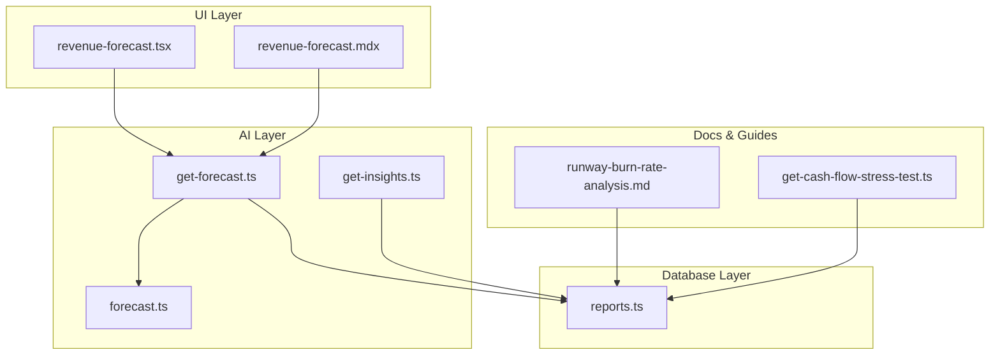
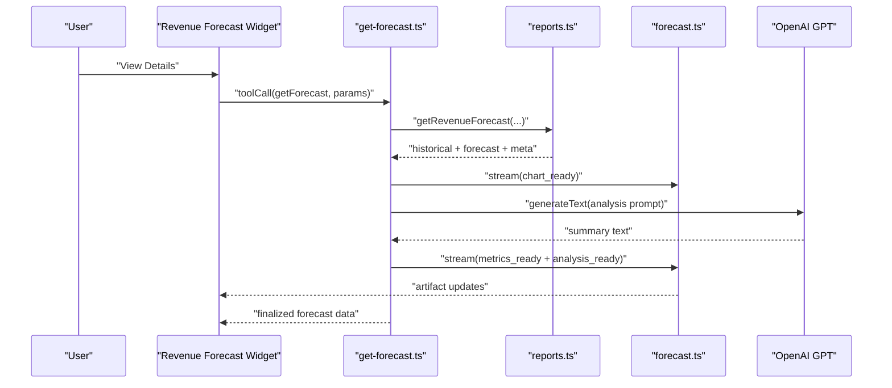
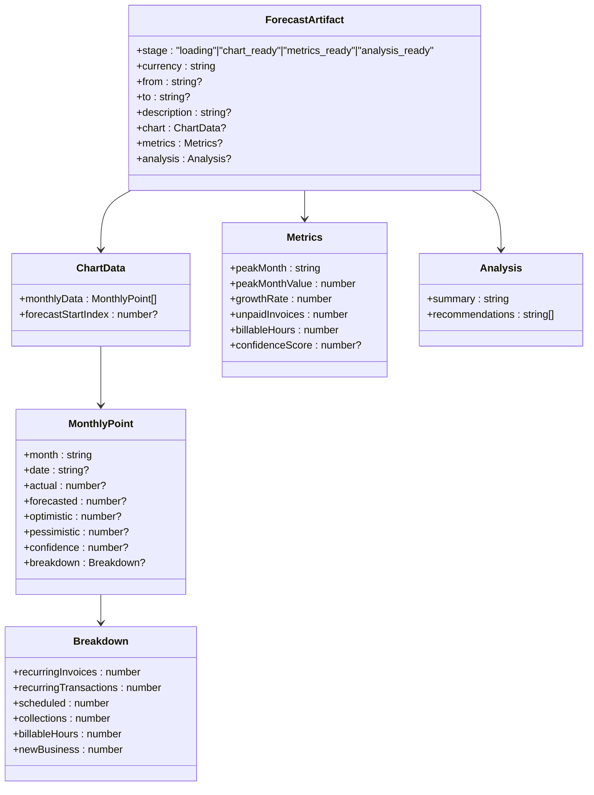
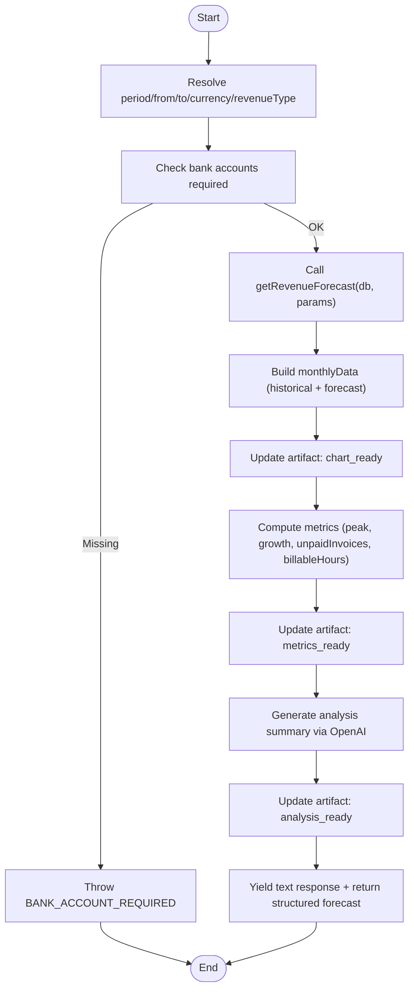
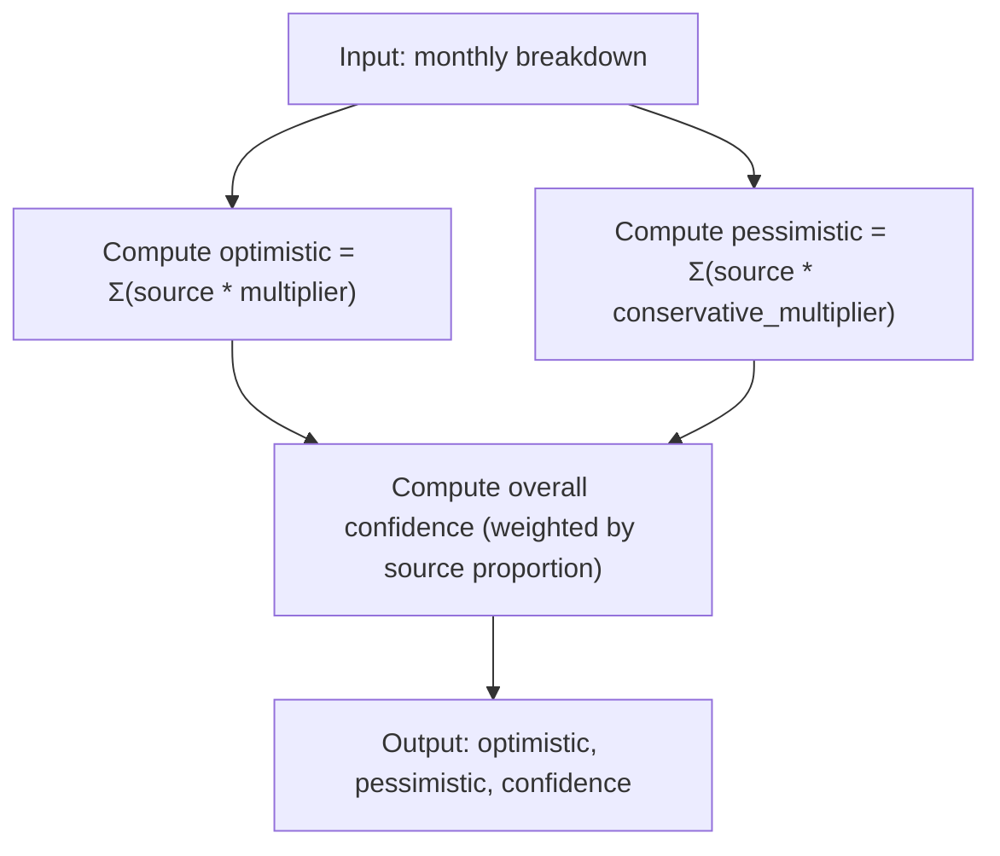
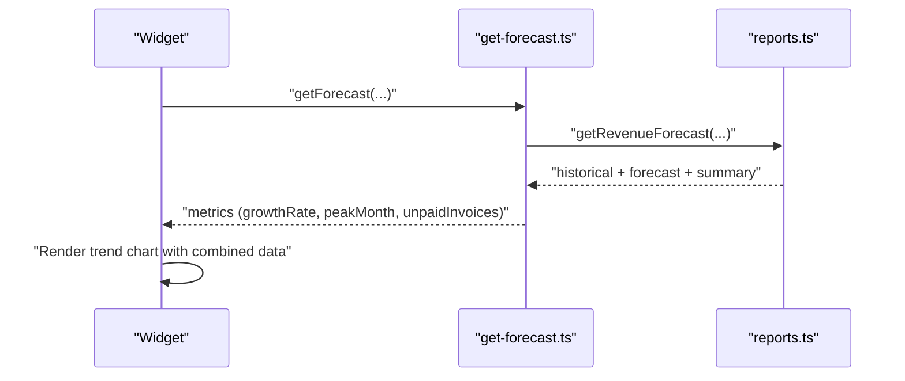
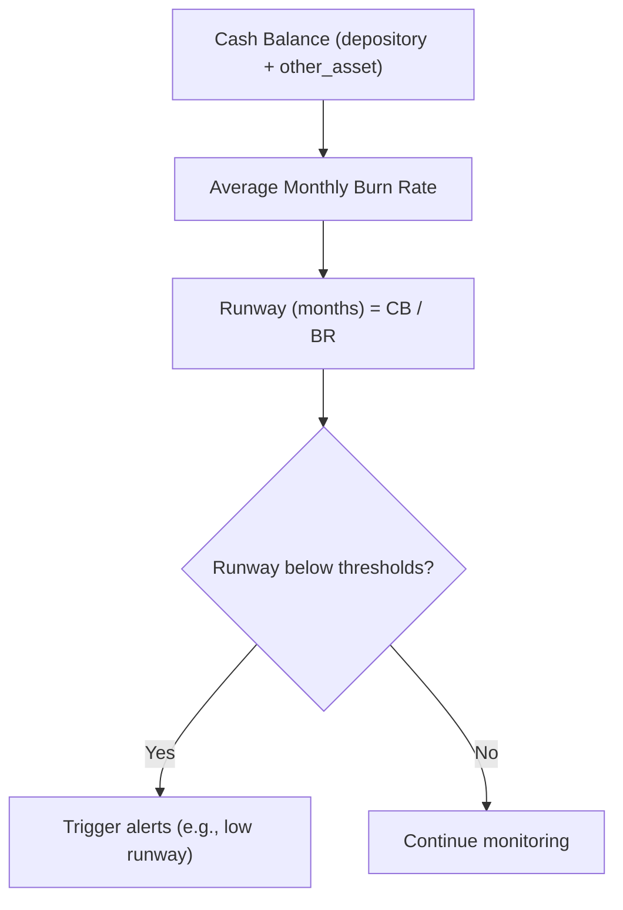
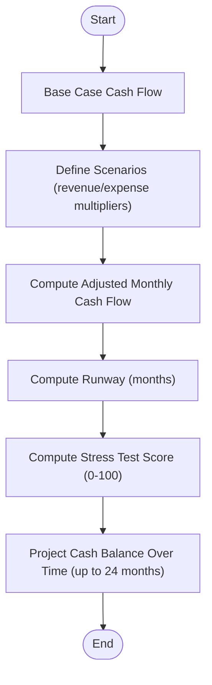
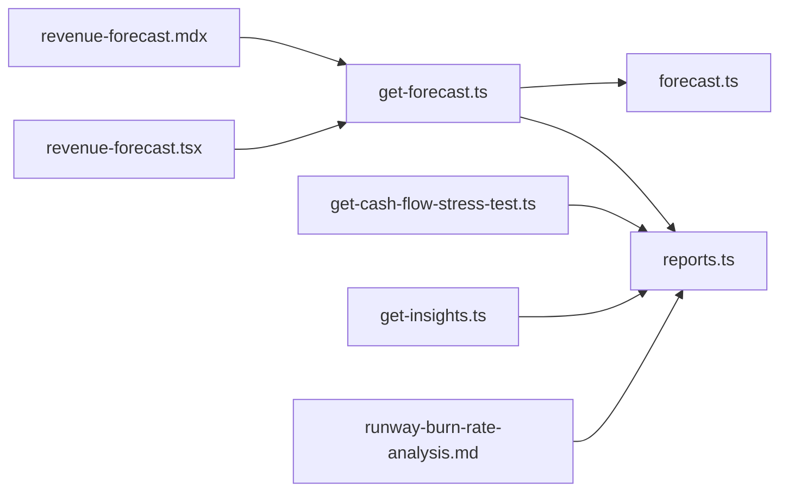

# Predictive Analytics & Forecasting

<cite>
**Referenced Files in This Document**
- [forecast.ts](file://midday/apps/api/src/ai/artifacts/forecast.ts)
- [get-forecast.ts](file://midday/apps/api/src/ai/tools/get-forecast.ts)
- [reports.ts](file://midday/packages/db/src/queries/reports.ts)
- [revenue-forecast.mdx](file://midday/apps/website/src/app/docs/content/revenue-forecast.mdx)
- [revenue-forecast.tsx](file://midday/apps/dashboard/src/components/widgets/revenue-forecast.tsx)
- [runway-burn-rate-analysis.md](file://midday/docs/runway-burn-rate-analysis.md)
- [get-cash-flow-stress-test.ts](file://midday/apps/api/src/ai/tools/get-cash-flow-stress-test.ts)
- [get-insights.ts](file://midday/apps/api/src/ai/tools/get-insights.ts)
</cite>

## Table of Contents
1. [Introduction](#introduction)
2. [Project Structure](#project-structure)
3. [Core Components](#core-components)
4. [Architecture Overview](#architecture-overview)
5. [Detailed Component Analysis](#detailed-component-analysis)
6. [Dependency Analysis](#dependency-analysis)
7. [Performance Considerations](#performance-considerations)
8. [Troubleshooting Guide](#troubleshooting-guide)
9. [Conclusion](#conclusion)
10. [Appendices](#appendices)

## Introduction
This document explains Faworra’s predictive analytics and financial forecasting capabilities. It covers revenue forecasting algorithms, cash flow projections, growth rate analysis, and runway calculations. It also details the machine learning models used for trend prediction, seasonal adjustments, and scenario planning, along with methodologies for confidence intervals, uncertainty quantification, and integration with external economic indicators. The document includes examples of forecast generation workflows, historical data analysis, predictive model tuning, automated forecasting schedules, alert systems for forecast deviations, sensitivity analysis, model validation processes, accuracy metrics, and continuous model improvement mechanisms.

## Project Structure
Faworra’s forecasting pipeline spans AI tooling, artifact definitions, database queries, and UI widgets:
- AI Tools: Forecast generation and insights retrieval
- Artifacts: Forecast canvas schema and structured outputs
- Database Queries: Revenue, burn rate, expenses, and forecasting computations
- UI Widgets: Forecast visualization and user-driven triggers
- Docs: Product-facing explanations of forecasting behavior

**Diagram sources**
- [get-forecast.ts](file://midday/apps/api/src/ai/tools/get-forecast.ts#L1-L383)
- [forecast.ts](file://midday/apps/api/src/ai/artifacts/forecast.ts#L1-L76)
- [reports.ts](file://midday/packages/db/src/queries/reports.ts#L1-L800)
- [revenue-forecast.tsx](file://midday/apps/dashboard/src/components/widgets/revenue-forecast.tsx#L36-L91)
- [revenue-forecast.mdx](file://midday/apps/website/src/app/docs/content/revenue-forecast.mdx#L1-L36)
- [runway-burn-rate-analysis.md](file://midday/docs/runway-burn-rate-analysis.md#L1-L352)
- [get-cash-flow-stress-test.ts](file://midday/apps/api/src/ai/tools/get-cash-flow-stress-test.ts#L148-L294)

**Section sources**
- [get-forecast.ts](file://midday/apps/api/src/ai/tools/get-forecast.ts#L1-L383)
- [forecast.ts](file://midday/apps/api/src/ai/artifacts/forecast.ts#L1-L76)
- [reports.ts](file://midday/packages/db/src/queries/reports.ts#L1-L800)
- [revenue-forecast.tsx](file://midday/apps/dashboard/src/components/widgets/revenue-forecast.tsx#L36-L91)
- [revenue-forecast.mdx](file://midday/apps/website/src/app/docs/content/revenue-forecast.mdx#L1-L36)
- [runway-burn-rate-analysis.md](file://midday/docs/runway-burn-rate-analysis.md#L1-L352)
- [get-cash-flow-stress-test.ts](file://midday/apps/api/src/ai/tools/get-cash-flow-stress-test.ts#L148-L294)

## Core Components
- Forecast Artifact Schema: Defines stages (loading, chart_ready, metrics_ready, analysis_ready) and data structures for currency, date range, monthly data, confidence bounds, and breakdown by revenue sources.
- Forecast Tool: Orchestrates parameter resolution, currency handling, historical and forecast data assembly, confidence scoring, and optional AI-generated analysis.
- Database Queries: Implements revenue aggregation, burn rate computation, and forecasting logic including confidence bounds derived from revenue breakdown.
- UI Widget: Triggers forecast generation via AI tool calls and renders interactive charts with hover details.
- Cash Flow Stress Test: Provides scenario planning around revenue and expense multipliers, projecting runway and stress test scores.
- Insights Tool: Delivers periodic business insights with anomaly detection and recommendations.

**Section sources**
- [forecast.ts](file://midday/apps/api/src/ai/artifacts/forecast.ts#L1-L76)
- [get-forecast.ts](file://midday/apps/api/src/ai/tools/get-forecast.ts#L1-L383)
- [reports.ts](file://midday/packages/db/src/queries/reports.ts#L2819-L2863)
- [revenue-forecast.tsx](file://midday/apps/dashboard/src/components/widgets/revenue-forecast.tsx#L36-L91)
- [get-cash-flow-stress-test.ts](file://midday/apps/api/src/ai/tools/get-cash-flow-stress-test.ts#L148-L294)
- [get-insights.ts](file://midday/apps/api/src/ai/tools/get-insights.ts#L1-L298)

## Architecture Overview
The forecasting architecture integrates UI triggers, AI orchestration, artifact streaming, and database-backed computations.

**Diagram sources**
- [revenue-forecast.tsx](file://midday/apps/dashboard/src/components/widgets/revenue-forecast.tsx#L70-L83)
- [get-forecast.ts](file://midday/apps/api/src/ai/tools/get-forecast.ts#L32-L382)
- [reports.ts](file://midday/packages/db/src/queries/reports.ts#L2819-L2863)
- [forecast.ts](file://midday/apps/api/src/ai/artifacts/forecast.ts#L1-L76)

## Detailed Component Analysis

### Forecast Artifact Schema
Defines the forecast canvas structure with:
- Stages: loading → chart_ready → metrics_ready → analysis_ready
- Metadata: currency, date range, description
- Monthly data: actual, forecasted, optimistic, pessimistic, confidence, breakdown
- Metrics: peak month, growth rate, unpaid invoices, billable hours, confidence score
- Analysis: summary and recommendations

**Diagram sources**
- [forecast.ts](file://midday/apps/api/src/ai/artifacts/forecast.ts#L4-L75)

**Section sources**
- [forecast.ts](file://midday/apps/api/src/ai/artifacts/forecast.ts#L1-L76)

### Forecast Tool Execution
The tool resolves parameters, validates prerequisites, streams artifact updates, computes metrics, and optionally generates AI analysis.

**Diagram sources**
- [get-forecast.ts](file://midday/apps/api/src/ai/tools/get-forecast.ts#L32-L382)

**Section sources**
- [get-forecast.ts](file://midday/apps/api/src/ai/tools/get-forecast.ts#L1-L383)

### Revenue Forecasting Algorithms
Revenue forecasting uses a “bottom-up” approach aggregating known and expected revenue sources:
- Historical revenue: actual monthly inflows
- Forecasted revenue: projections built from:
  - Recurring invoices
  - Recurring transactions
  - Scheduled income
  - Collections
  - Billable hours
  - New business

Confidence bounds are computed from contribution weights of each revenue source.

**Diagram sources**
- [reports.ts](file://midday/packages/db/src/queries/reports.ts#L2840-L2863)

**Section sources**
- [reports.ts](file://midday/packages/db/src/queries/reports.ts#L2819-L2863)
- [revenue-forecast.mdx](file://midday/apps/website/src/app/docs/content/revenue-forecast.mdx#L31-L36)

### Growth Rate Analysis
Growth rate is derived from the forecast summary and displayed alongside peak month and unpaid invoices. The UI widget composes a trend chart combining recent historical data and forecast months for context.

**Diagram sources**
- [revenue-forecast.tsx](file://midday/apps/dashboard/src/components/widgets/revenue-forecast.tsx#L85-L91)
- [get-forecast.ts](file://midday/apps/api/src/ai/tools/get-forecast.ts#L208-L254)

**Section sources**
- [get-forecast.ts](file://midday/apps/api/src/ai/tools/get-forecast.ts#L208-L254)
- [revenue-forecast.tsx](file://midday/apps/dashboard/src/components/widgets/revenue-forecast.tsx#L85-L91)

### Cash Flow Projections and Runway Calculations
Runway is calculated as cash balance divided by average monthly burn rate. The system distinguishes cash accounts from debt for runway computation and excludes double-counted credit card payments.

**Diagram sources**
- [runway-burn-rate-analysis.md](file://midday/docs/runway-burn-rate-analysis.md#L68-L122)

**Section sources**
- [runway-burn-rate-analysis.md](file://midday/docs/runway-burn-rate-analysis.md#L68-L122)

### Scenario Planning and Stress Testing
Scenario planning adjusts revenue and expense multipliers to compute best/worst-case cash flows and runway. A stress test score is derived from the worst-case runway.

**Diagram sources**
- [get-cash-flow-stress-test.ts](file://midday/apps/api/src/ai/tools/get-cash-flow-stress-test.ts#L151-L294)

**Section sources**
- [get-cash-flow-stress-test.ts](file://midday/apps/api/src/ai/tools/get-cash-flow-stress-test.ts#L148-L294)

### Machine Learning Models and Uncertainty Quantification
- Trend prediction: Uses bottom-up aggregation of known revenue sources with confidence bounds derived from weighted multipliers.
- Seasonal adjustments: Implemented via monthly grouping and explicit handling of multi-year views.
- Scenario planning: Deterministic multipliers applied to revenue and expense streams.
- Uncertainty quantification: Optimistic/pessimistic bounds and a composite confidence score derived from source contributions.

**Section sources**
- [reports.ts](file://midday/packages/db/src/queries/reports.ts#L2840-L2863)
- [get-forecast.ts](file://midday/apps/api/src/ai/tools/get-forecast.ts#L126-L182)

### Forecast Generation Workflows
- User-triggered: Widget initiates AI tool call with period and currency parameters.
- Automated: Background workers and schedulers can trigger forecasts periodically.
- Validation: Tool checks prerequisites (e.g., bank accounts) and yields structured artifact updates.

**Section sources**
- [revenue-forecast.tsx](file://midday/apps/dashboard/src/components/widgets/revenue-forecast.tsx#L70-L83)
- [get-forecast.ts](file://midday/apps/api/src/ai/tools/get-forecast.ts#L56-L103)

### Historical Data Analysis and Predictive Model Tuning
- Historical aggregation: Monthly revenue computed from transactions with category exclusions and tax adjustments.
- Predictive tuning: Confidence bounds reflect source-specific risk multipliers; multipliers can be tuned to improve alignment with observed outcomes.

**Section sources**
- [reports.ts](file://midday/packages/db/src/queries/reports.ts#L356-L515)
- [reports.ts](file://midday/packages/db/src/queries/reports.ts#L2840-L2863)

### Integration with External Indicators, Market Trends, and Benchmarks
- External indicators: Not explicitly implemented in the analyzed code; potential integration points include macroeconomic factors influencing revenue categories or expenses.
- Market trends: Category slugs and tax rates influence revenue calculations; future enhancements could incorporate sector benchmarks or peer group comparisons.
- Industry benchmarks: Not present in the analyzed files; could be introduced via category-level variance analysis or peer comparisons.

[No sources needed since this section synthesizes integration possibilities without analyzing specific files]

### Automated Forecasting Schedules and Alert Systems
- Scheduling: Background workers and schedulers orchestrate periodic forecast generation.
- Alerts: Runway thresholds and stress test scores can trigger alerts; cash flow projections can signal critical conditions.

**Section sources**
- [get-cash-flow-stress-test.ts](file://midday/apps/api/src/ai/tools/get-cash-flow-stress-test.ts#L174-L196)
- [runway-burn-rate-analysis.md](file://midday/docs/runway-burn-rate-analysis.md#L68-L122)

### Sensitivity Analysis
- Multipliers: Revenue and expense multipliers define optimistic and pessimistic scenarios.
- Contribution weights: Confidence score depends on the proportional contribution of each revenue source.

**Section sources**
- [reports.ts](file://midday/packages/db/src/queries/reports.ts#L2840-L2863)
- [get-cash-flow-stress-test.ts](file://midday/apps/api/src/ai/tools/get-cash-flow-stress-test.ts#L151-L197)

### Model Validation Processes, Accuracy Metrics, and Continuous Improvement
- Validation: Confidence bounds and composite scores provide internal validation signals.
- Accuracy metrics: Not explicitly defined in the analyzed files; could include MAE/MSE against realized revenue or comparison to peer groups.
- Continuous improvement: Confidence multipliers and scenario weights can be recalibrated based on historical forecast accuracy.

[No sources needed since this section provides general guidance]

## Dependency Analysis
Forecasting relies on:
- UI widget triggering AI tool calls
- AI tool invoking database queries and artifact streaming
- Database queries computing revenue, burn rate, and forecasting metrics
- Docs and stress tests providing complementary financial analyses

**Diagram sources**
- [revenue-forecast.tsx](file://midday/apps/dashboard/src/components/widgets/revenue-forecast.tsx#L70-L83)
- [get-forecast.ts](file://midday/apps/api/src/ai/tools/get-forecast.ts#L1-L383)
- [reports.ts](file://midday/packages/db/src/queries/reports.ts#L1-L800)
- [forecast.ts](file://midday/apps/api/src/ai/artifacts/forecast.ts#L1-L76)
- [get-cash-flow-stress-test.ts](file://midday/apps/api/src/ai/tools/get-cash-flow-stress-test.ts#L148-L294)
- [get-insights.ts](file://midday/apps/api/src/ai/tools/get-insights.ts#L1-L298)
- [revenue-forecast.mdx](file://midday/apps/website/src/app/docs/content/revenue-forecast.mdx#L1-L36)
- [runway-burn-rate-analysis.md](file://midday/docs/runway-burn-rate-analysis.md#L1-L352)

**Section sources**
- [revenue-forecast.tsx](file://midday/apps/dashboard/src/components/widgets/revenue-forecast.tsx#L70-L83)
- [get-forecast.ts](file://midday/apps/api/src/ai/tools/get-forecast.ts#L1-L383)
- [reports.ts](file://midday/packages/db/src/queries/reports.ts#L1-L800)
- [forecast.ts](file://midday/apps/api/src/ai/artifacts/forecast.ts#L1-L76)
- [get-cash-flow-stress-test.ts](file://midday/apps/api/src/ai/tools/get-cash-flow-stress-test.ts#L148-L294)
- [get-insights.ts](file://midday/apps/api/src/ai/tools/get-insights.ts#L1-L298)
- [revenue-forecast.mdx](file://midday/apps/website/src/app/docs/content/revenue-forecast.mdx#L1-L36)
- [runway-burn-rate-analysis.md](file://midday/docs/runway-burn-rate-analysis.md#L1-L352)

## Performance Considerations
- Parallelization: Database queries leverage parallel execution for independent computations (e.g., revenue, COGS, operating expenses).
- Caching: Team currency and COGS category slugs are cached to reduce repeated lookups.
- Aggregation: Monthly series generation and map-based lookups minimize redundant computations.

**Section sources**
- [reports.ts](file://midday/packages/db/src/queries/reports.ts#L184-L198)
- [reports.ts](file://midday/packages/db/src/queries/reports.ts#L58-L112)

## Troubleshooting Guide
Common issues and resolutions:
- Forecast shows zero or incorrect values: verify cash accounts are enabled and balances exist; confirm currency settings.
- Credit card balance appears positive: expected behavior; balances are stored as positive amounts owed.
- Double-counted expenses in burn rate: ensure excluded categories (e.g., credit card payments) are properly excluded.
- Provider sync inconsistencies: ingestion-time normalization plus query-time safety net address legacy data.

**Section sources**
- [runway-burn-rate-analysis.md](file://midday/docs/runway-burn-rate-analysis.md#L226-L352)

## Conclusion
Faworra’s forecasting system combines a bottom-up revenue aggregation with confidence bounds and scenario planning. The AI tool orchestrates artifact streaming, metrics computation, and optional AI analysis, while database queries deliver robust financial computations. Runway and cash flow projections support proactive financial planning, and documented troubleshooting steps help maintain forecast integrity.

## Appendices
- Forecast artifact fields and stages
- Forecast tool parameters and execution flow
- Database query functions for revenue, burn rate, and forecasting
- UI widget integration and user triggers
- Cash flow stress testing scenarios and stress test scoring

[No sources needed since this section summarizes without analyzing specific files]