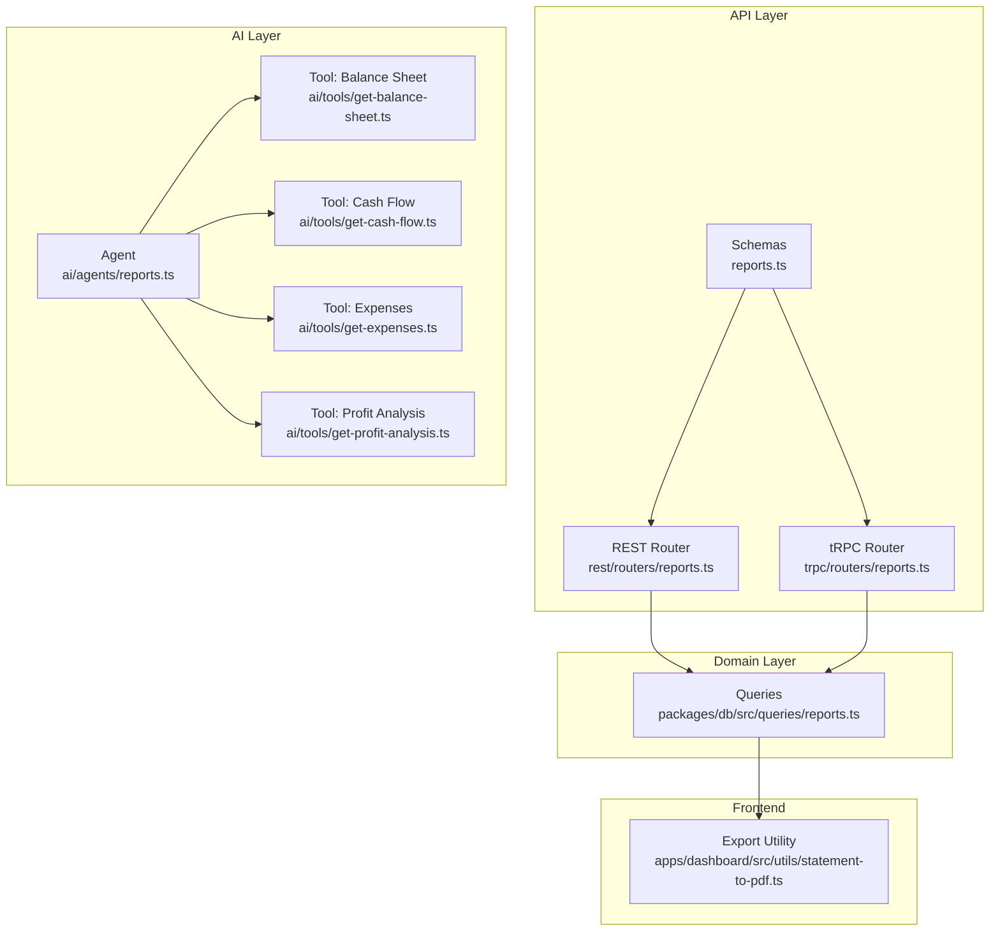
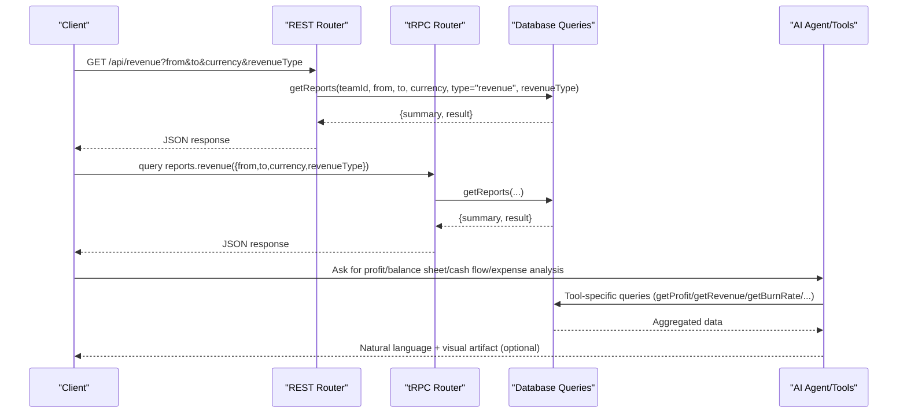
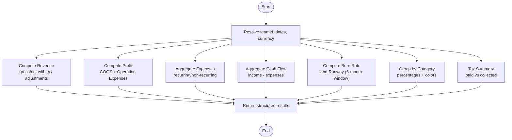
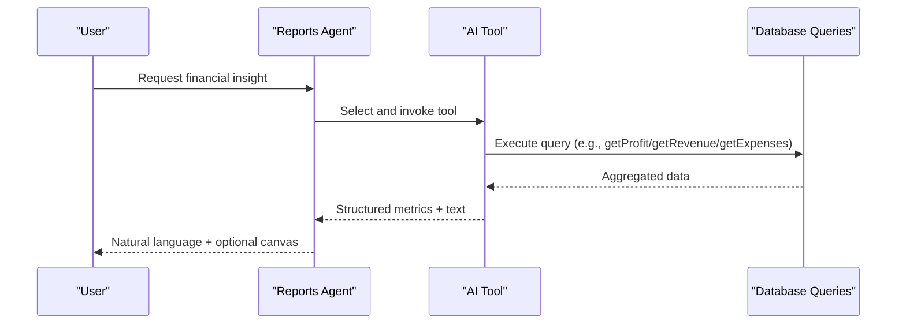
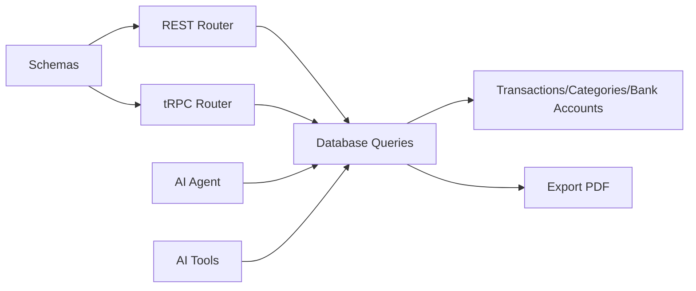

# Standard Financial Statements

<cite>
**Referenced Files in This Document**
- [reports.ts](file://midday/apps/api/src/schemas/reports.ts)
- [reports.ts](file://midday/apps/api/src/rest/routers/reports.ts)
- [reports.ts](file://midday/apps/api/src/trpc/routers/reports.ts)
- [reports.ts](file://midday/packages/db/src/queries/reports.ts)
- [statement-to-pdf.ts](file://midday/apps/dashboard/src/utils/statement-to-pdf.ts)
- [reports.ts](file://midday/apps/api/src/ai/agents/reports.ts)
- [get-balance-sheet.ts](file://midday/apps/api/src/ai/tools/get-balance-sheet.ts)
- [get-cash-flow.ts](file://midday/apps/api/src/ai/tools/get-cash-flow.ts)
- [get-expenses.ts](file://midday/apps/api/src/ai/tools/get-expenses.ts)
- [get-profit-analysis.ts](file://midday/apps/api/src/ai/tools/get-profit-analysis.ts)
</cite>

## Table of Contents
1. [Introduction](#introduction)
2. [Project Structure](#project-structure)
3. [Core Components](#core-components)
4. [Architecture Overview](#architecture-overview)
5. [Detailed Component Analysis](#detailed-component-analysis)
6. [Dependency Analysis](#dependency-analysis)
7. [Performance Considerations](#performance-considerations)
8. [Troubleshooting Guide](#troubleshooting-guide)
9. [Conclusion](#conclusion)
10. [Appendices](#appendices)

## Introduction
This document explains how Faworra (Midday) generates standard financial statements and related reports automatically. It covers the automated creation of profit and loss statements, balance sheets, cash flow statements, and expense reports. It also documents the AI-powered financial data processing, automated calculations, real-time updates, statement templates and formatting, customization capabilities, export functionality, and integration with accounting systems. Regulatory compliance considerations are addressed at a high level.

## Project Structure
Faworra’s financial reporting spans three layers:
- API schemas define request/response contracts for financial reports.
- REST and tRPC routers expose endpoints for clients and internal services.
- Database queries implement financial calculations, currency handling, and aggregation.
- AI agents and tools orchestrate LLM-driven insights and visualizations.
- Frontend utilities export statements to PDF.

**Diagram sources**
- [reports.ts](file://midday/apps/api/src/schemas/reports.ts#L1-L776)
- [reports.ts](file://midday/apps/api/src/rest/routers/reports.ts#L1-L272)
- [reports.ts](file://midday/apps/api/src/trpc/routers/reports.ts#L1-L187)
- [reports.ts](file://midday/packages/db/src/queries/reports.ts#L1-L4522)
- [reports.ts](file://midday/apps/api/src/ai/agents/reports.ts#L1-L99)
- [get-balance-sheet.ts](file://midday/apps/api/src/ai/tools/get-balance-sheet.ts#L1-L444)
- [get-cash-flow.ts](file://midday/apps/api/src/ai/tools/get-cash-flow.ts#L1-L325)
- [get-expenses.ts](file://midday/apps/api/src/ai/tools/get-expenses.ts#L1-L299)
- [get-profit-analysis.ts](file://midday/apps/api/src/ai/tools/get-profit-analysis.ts#L1-L462)
- [statement-to-pdf.ts](file://midday/apps/dashboard/src/utils/statement-to-pdf.ts#L1-L449)

**Section sources**
- [reports.ts](file://midday/apps/api/src/schemas/reports.ts#L1-L776)
- [reports.ts](file://midday/apps/api/src/rest/routers/reports.ts#L1-L272)
- [reports.ts](file://midday/apps/api/src/trpc/routers/reports.ts#L1-L187)
- [reports.ts](file://midday/packages/db/src/queries/reports.ts#L1-L4522)
- [reports.ts](file://midday/apps/api/src/ai/agents/reports.ts#L1-L99)
- [get-balance-sheet.ts](file://midday/apps/api/src/ai/tools/get-balance-sheet.ts#L1-L444)
- [get-cash-flow.ts](file://midday/apps/api/src/ai/tools/get-cash-flow.ts#L1-L325)
- [get-expenses.ts](file://midday/apps/api/src/ai/tools/get-expenses.ts#L1-L299)
- [get-profit-analysis.ts](file://midday/apps/api/src/ai/tools/get-profit-analysis.ts#L1-L462)
- [statement-to-pdf.ts](file://midday/apps/dashboard/src/utils/statement-to-pdf.ts#L1-L449)

## Core Components
- Financial report schemas define inputs and outputs for revenue, profit, burn rate, runway, expenses, spending, tax summary, growth rate, profit margin, cash flow, recurring expenses, and balance sheet.
- REST and tRPC routers expose endpoints for clients and internal services, validating inputs and returning standardized JSON responses.
- Database queries implement robust financial calculations including currency conversion, tax handling, COGS/operating expense segregation, and aggregation by month or period.
- AI agent orchestrates tools to produce natural-language insights and visual canvases for balance sheet, cash flow, expenses, and profit analysis.
- Frontend export utility converts rendered statements to PDF with configurable theme, quality, and layout.

**Section sources**
- [reports.ts](file://midday/apps/api/src/schemas/reports.ts#L1-L776)
- [reports.ts](file://midday/apps/api/src/rest/routers/reports.ts#L1-L272)
- [reports.ts](file://midday/apps/api/src/trpc/routers/reports.ts#L1-L187)
- [reports.ts](file://midday/packages/db/src/queries/reports.ts#L1-L4522)
- [reports.ts](file://midday/apps/api/src/ai/agents/reports.ts#L1-L99)
- [statement-to-pdf.ts](file://midday/apps/dashboard/src/utils/statement-to-pdf.ts#L1-L449)

## Architecture Overview
The system follows a layered architecture:
- API layer validates and routes requests.
- Domain layer encapsulates financial logic and data access.
- AI layer augments results with LLM-generated insights and visual artifacts.
- Export layer transforms rendered content into PDF.

**Diagram sources**
- [reports.ts](file://midday/apps/api/src/rest/routers/reports.ts#L1-L272)
- [reports.ts](file://midday/apps/api/src/trpc/routers/reports.ts#L1-L187)
- [reports.ts](file://midday/packages/db/src/queries/reports.ts#L1-L4522)
- [reports.ts](file://midday/apps/api/src/ai/agents/reports.ts#L1-L99)
- [get-balance-sheet.ts](file://midday/apps/api/src/ai/tools/get-balance-sheet.ts#L1-L444)
- [get-cash-flow.ts](file://midday/apps/api/src/ai/tools/get-cash-flow.ts#L1-L325)
- [get-expenses.ts](file://midday/apps/api/src/ai/tools/get-expenses.ts#L1-L299)
- [get-profit-analysis.ts](file://midday/apps/api/src/ai/tools/get-profit-analysis.ts#L1-L462)

## Detailed Component Analysis

### Financial Report Schemas
- Define typed inputs and outputs for revenue, profit, burn rate, runway, expenses, spending, tax summary, growth rate, profit margin, cash flow, recurring expenses, and balance sheet.
- Include currency handling, revenue type (gross/net), and period aggregation (monthly/quarterly/yearly).
- Provide OpenAPI metadata for documentation and validation.

**Section sources**
- [reports.ts](file://midday/apps/api/src/schemas/reports.ts#L1-L776)

### REST Router: Financial Reports
- Exposes endpoints for revenue, profit, burn rate, runway, expenses, and spending.
- Validates query parameters against schemas and delegates to database queries.
- Returns validated JSON responses with appropriate middleware scopes.

**Section sources**
- [reports.ts](file://midday/apps/api/src/rest/routers/reports.ts#L1-L272)

### tRPC Router: Financial Reports
- Provides typed procedures for clients using tRPC.
- Supports both protected and public procedures for report retrieval and shared links.
- Handles errors via TRPCError mapping.

**Section sources**
- [reports.ts](file://midday/apps/api/src/trpc/routers/reports.ts#L1-L187)

### Database Queries: Financial Calculations
- Currency handling:
  - Resolves target currency per team with caching.
  - Uses CASE expressions to handle NULL baseAmount gracefully.
- Revenue:
  - Supports gross and net revenue with tax adjustments.
  - Excludes contra-revenue categories.
- Profit:
  - Computes gross profit (revenue - COGS) and net profit (gross - operating expenses).
  - Segregates COGS vs operating expenses by category slugs.
- Expenses:
  - Aggregates monthly expenses, separates recurring vs non-recurring.
  - Calculates average expense and total spending.
- Spending:
  - Groups by category with percentages and colors.
  - Includes uncategorized transactions.
- Burn Rate and Runway:
  - Computes monthly burn rate over a date range.
  - Calculates runway using a fixed 6-month trailing window and cash balances.
- Cash Flow:
  - Aggregates income and expenses by period (monthly/quarterly).
  - Produces monthly net cash flow with cumulative totals.
- Tax Summary:
  - Computes paid vs collected taxes by category and tax type.
- Growth Rate and Profit Margin:
  - Compares periods (monthly/quarterly/yearly) and computes margin using net revenue.

**Diagram sources**
- [reports.ts](file://midday/packages/db/src/queries/reports.ts#L1-L4522)

**Section sources**
- [reports.ts](file://midday/packages/db/src/queries/reports.ts#L1-L4522)

### AI Agent and Tools: Insights and Visualizations
- Agent orchestrates tools for balance sheet, cash flow, expenses, and profit analysis.
- Tools:
  - Balance Sheet: Generates ratios (current ratio, debt-to-equity, working capital, equity ratio) and narrative.
  - Cash Flow: Produces monthly trends, metrics, and AI analysis.
  - Expenses: Summarizes category breakdowns and top spenders.
  - Profit Analysis: Computes margins, YoY changes, and monthly trends.
- Artifacts stream visual canvases and metrics for interactive dashboards.

**Diagram sources**
- [reports.ts](file://midday/apps/api/src/ai/agents/reports.ts#L1-L99)
- [get-balance-sheet.ts](file://midday/apps/api/src/ai/tools/get-balance-sheet.ts#L1-L444)
- [get-cash-flow.ts](file://midday/apps/api/src/ai/tools/get-cash-flow.ts#L1-L325)
- [get-expenses.ts](file://midday/apps/api/src/ai/tools/get-expenses.ts#L1-L299)
- [get-profit-analysis.ts](file://midday/apps/api/src/ai/tools/get-profit-analysis.ts#L1-L462)

**Section sources**
- [reports.ts](file://midday/apps/api/src/ai/agents/reports.ts#L1-L99)
- [get-balance-sheet.ts](file://midday/apps/api/src/ai/tools/get-balance-sheet.ts#L1-L444)
- [get-cash-flow.ts](file://midday/apps/api/src/ai/tools/get-cash-flow.ts#L1-L325)
- [get-expenses.ts](file://midday/apps/api/src/ai/tools/get-expenses.ts#L1-L299)
- [get-profit-analysis.ts](file://midday/apps/api/src/ai/tools/get-profit-analysis.ts#L1-L462)

### Export to PDF
- Captures rendered statement content using html2canvas.
- Converts canvas to JPEG and composes a PDF with configurable padding and background.
- Supports light/dark themes and hides/shows elements for print-friendly output.
- Provides both download and blob generation for sharing.

**Section sources**
- [statement-to-pdf.ts](file://midday/apps/dashboard/src/utils/statement-to-pdf.ts#L1-L449)

## Dependency Analysis
- REST and tRPC routers depend on schemas for validation and on database queries for data.
- Database queries depend on:
  - Team base currency resolution and caching.
  - Transaction and category tables for revenue, expenses, and tax computations.
  - Bank accounts for cash balances in runway calculations.
- AI tools depend on database queries and optionally on LLMs for analysis.
- Export utility depends on frontend rendering and PDF libraries.

**Diagram sources**
- [reports.ts](file://midday/apps/api/src/schemas/reports.ts#L1-L776)
- [reports.ts](file://midday/apps/api/src/rest/routers/reports.ts#L1-L272)
- [reports.ts](file://midday/apps/api/src/trpc/routers/reports.ts#L1-L187)
- [reports.ts](file://midday/packages/db/src/queries/reports.ts#L1-L4522)
- [reports.ts](file://midday/apps/api/src/ai/agents/reports.ts#L1-L99)
- [get-balance-sheet.ts](file://midday/apps/api/src/ai/tools/get-balance-sheet.ts#L1-L444)
- [get-cash-flow.ts](file://midday/apps/api/src/ai/tools/get-cash-flow.ts#L1-L325)
- [get-expenses.ts](file://midday/apps/api/src/ai/tools/get-expenses.ts#L1-L299)
- [get-profit-analysis.ts](file://midday/apps/api/src/ai/tools/get-profit-analysis.ts#L1-L462)
- [statement-to-pdf.ts](file://midday/apps/dashboard/src/utils/statement-to-pdf.ts#L1-L449)

**Section sources**
- [reports.ts](file://midday/apps/api/src/schemas/reports.ts#L1-L776)
- [reports.ts](file://midday/apps/api/src/rest/routers/reports.ts#L1-L272)
- [reports.ts](file://midday/apps/api/src/trpc/routers/reports.ts#L1-L187)
- [reports.ts](file://midday/packages/db/src/queries/reports.ts#L1-L4522)
- [reports.ts](file://midday/apps/api/src/ai/agents/reports.ts#L1-L99)
- [statement-to-pdf.ts](file://midday/apps/dashboard/src/utils/statement-to-pdf.ts#L1-L449)

## Performance Considerations
- Caching:
  - Team currency resolution cached with TTL to reduce repeated lookups.
  - COGS category slugs cached to avoid repeated category scans.
- Parallelization:
  - Independent queries executed concurrently (e.g., revenue vs expenses, burn rate vs runway).
- Efficient aggregations:
  - Single-pass SQL aggregations with CASE expressions for currency conversion.
  - Group-by month truncation for scalable time-series results.
- Pagination and limits:
  - Monthly series generated with date-fns to avoid scanning entire histories unnecessarily.

[No sources needed since this section provides general guidance]

## Troubleshooting Guide
Common issues and resolutions:
- Missing team currency:
  - Symptom: Zero or unexpected results.
  - Cause: Team base currency not set.
  - Resolution: Ensure team base currency is configured; queries rely on it for conversions.
- NULL baseAmount:
  - Symptom: Transactions excluded from revenue/expense totals.
  - Cause: Transactions not yet converted to base currency.
  - Resolution: Allow time for exchange rate processing; queries exclude NULL baseAmount when currency is not specified.
- Bank account requirements:
  - Symptom: Agent yields BANK_ACCOUNT_REQUIRED.
  - Cause: Balance sheet or cash flow requires cash account balances.
  - Resolution: Connect supported bank accounts and retry.
- Report not found or expired:
  - Symptom: tRPC throws NOT_FOUND for shared links.
  - Cause: Link does not exist or expired.
  - Resolution: Regenerate the shared link; verify expiration settings.

**Section sources**
- [reports.ts](file://midday/packages/db/src/queries/reports.ts#L58-L138)
- [reports.ts](file://midday/apps/api/src/ai/agents/reports.ts#L1-L99)
- [reports.ts](file://midday/apps/api/src/trpc/routers/reports.ts#L153-L185)

## Conclusion
Faworra automates financial reporting through strongly typed APIs, robust database queries, and AI-driven insights. It supports profit and loss statements, balance sheets, cash flow statements, and expense reports with flexible currency handling, period aggregation, and export to PDF. Integrations with accounting systems are facilitated by bank connections and category-based categorization. Compliance considerations are addressed through accurate tax computations and clear financial metrics.

[No sources needed since this section summarizes without analyzing specific files]

## Appendices

### Statement Generation Workflows
- Profit and Loss:
  - Input: from/to, currency, revenueType (gross/net).
  - Process: compute revenue (net with tax adjustments), COGS, operating expenses, profit.
  - Output: monthly totals, YoY comparisons, and summaries.
- Balance Sheet:
  - Input: asOf date, currency.
  - Process: aggregate assets/liabilities/equity; compute ratios.
  - Output: line items, ratios, and recommendations.
- Cash Flow:
  - Input: from/to, currency, period (monthly/quarterly).
  - Process: income minus expenses; cumulative totals.
  - Output: monthly trends and metrics.
- Expense Reports:
  - Input: from/to, currency.
  - Process: category grouping, recurring vs non-recurring, averages.
  - Output: top categories, totals, and distributions.

**Section sources**
- [reports.ts](file://midday/apps/api/src/schemas/reports.ts#L721-L776)
- [reports.ts](file://midday/packages/db/src/queries/reports.ts#L157-L348)
- [get-balance-sheet.ts](file://midday/apps/api/src/ai/tools/get-balance-sheet.ts#L1-L444)
- [get-cash-flow.ts](file://midday/apps/api/src/ai/tools/get-cash-flow.ts#L1-L325)
- [get-expenses.ts](file://midday/apps/api/src/ai/tools/get-expenses.ts#L1-L299)

### Data Sources and Integrations
- Transactions and categories feed revenue, expenses, and tax computations.
- Bank accounts supply cash balances for runway and cash flow.
- Exchange rates enable currency conversions and consistent reporting.

**Section sources**
- [reports.ts](file://midday/packages/db/src/queries/reports.ts#L1-L49)
- [reports.ts](file://midday/apps/api/src/ai/tools/get-balance-sheet.ts#L1-L444)
- [reports.ts](file://midday/apps/api/src/ai/tools/get-cash-flow.ts#L1-L325)

### Export Formats
- PDF export supports:
  - Theme-aware rendering (light/dark/system).
  - Configurable quality and padding.
  - Print-friendly element visibility controls.

**Section sources**
- [statement-to-pdf.ts](file://midday/apps/dashboard/src/utils/statement-to-pdf.ts#L1-L449)