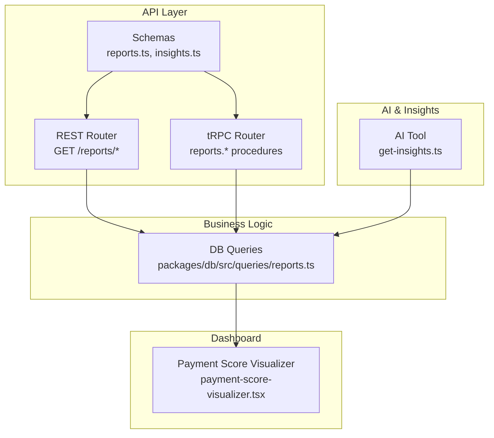
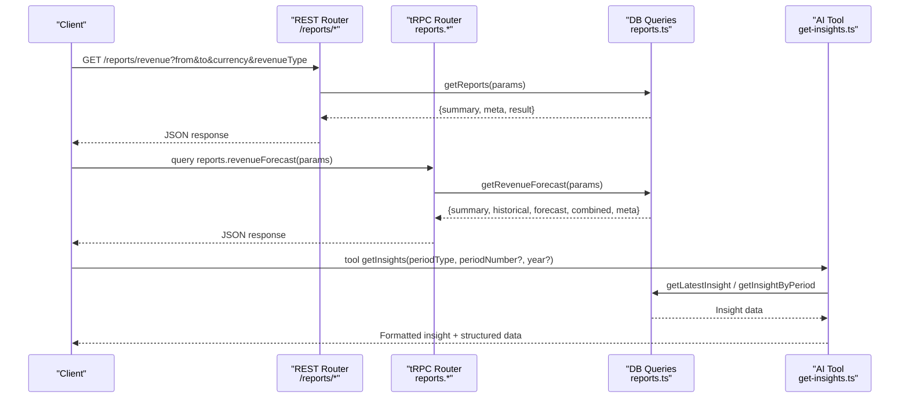
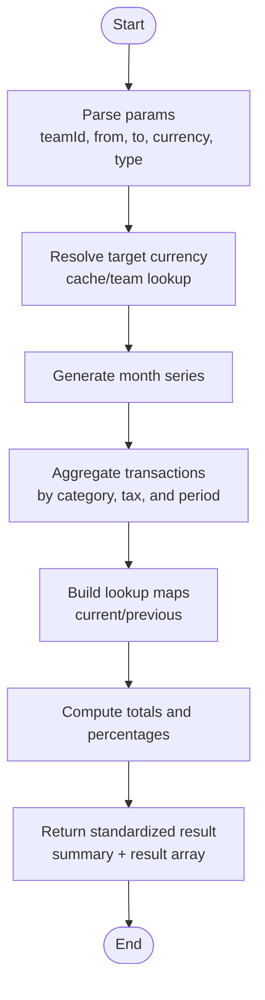
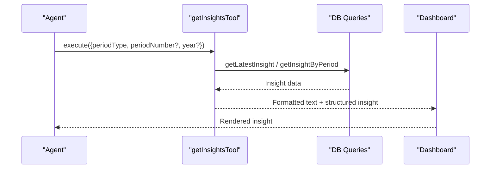
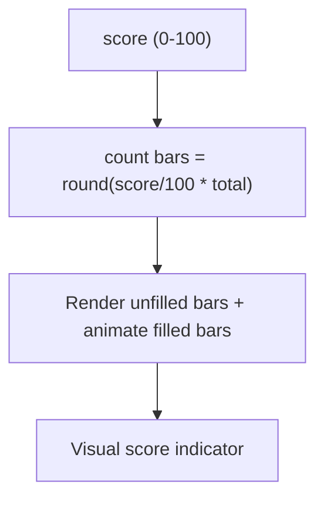
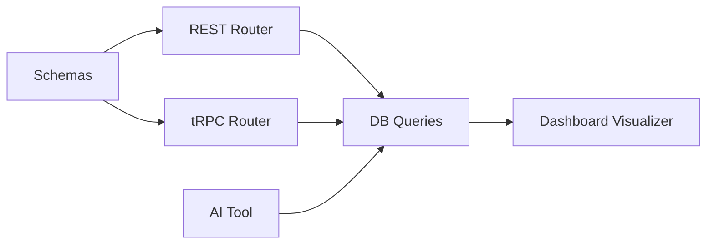

# Invoice Analytics & Reporting

<cite>
**Referenced Files in This Document**
- [reports.ts](file://apps/api/src/schemas/reports.ts)
- [insights.ts](file://apps/api/src/schemas/insights.ts)
- [reports.ts](file://apps/api/src/rest/routers/reports.ts)
- [reports.ts](file://apps/api/src/trpc/routers/reports.ts)
- [reports.ts](file://packages/db/src/queries/reports.ts)
- [get-insights.ts](file://apps/api/src/ai/tools/get-insights.ts)
- [payment-score-visualizer.tsx](file://apps/dashboard/src/components/payment-score-visualizer.tsx)
</cite>

## Table of Contents
1. [Introduction](#introduction)
2. [Project Structure](#project-structure)
3. [Core Components](#core-components)
4. [Architecture Overview](#architecture-overview)
5. [Detailed Component Analysis](#detailed-component-analysis)
6. [Dependency Analysis](#dependency-analysis)
7. [Performance Considerations](#performance-considerations)
8. [Troubleshooting Guide](#troubleshooting-guide)
9. [Conclusion](#conclusion)
10. [Appendices](#appendices)

## Introduction
This document explains the invoice analytics and reporting capabilities of the system. It covers payment analysis tools, trend visualization, performance metrics, AI-generated insights, forecasting models, and the reporting dashboard. It also details customizable metrics, export capabilities, revenue analytics, customer payment behavior analysis, and collection efficiency metrics. Practical examples demonstrate how to generate payment reports, analyze invoice trends, interpret AI insights, and create custom dashboards, along with the interactive visualization components.

## Project Structure
The analytics and reporting stack spans three layers:
- API schemas define request/response contracts for reports and insights.
- REST and tRPC routers expose endpoints for clients.
- Database queries implement financial computations, forecasts, and KPI aggregation.

**Diagram sources**
- [reports.ts](file://apps/api/src/rest/routers/reports.ts#L29-L272)
- [reports.ts](file://apps/api/src/trpc/routers/reports.ts#L38-L187)
- [reports.ts](file://apps/api/src/schemas/reports.ts#L1-L776)
- [insights.ts](file://apps/api/src/schemas/insights.ts#L1-L290)
- [reports.ts](file://packages/db/src/queries/reports.ts#L140-L1599)
- [get-insights.ts](file://apps/api/src/ai/tools/get-insights.ts#L27-L212)
- [payment-score-visualizer.tsx](file://apps/dashboard/src/components/payment-score-visualizer.tsx#L10-L41)

**Section sources**
- [reports.ts](file://apps/api/src/schemas/reports.ts#L1-L776)
- [insights.ts](file://apps/api/src/schemas/insights.ts#L1-L290)
- [reports.ts](file://apps/api/src/rest/routers/reports.ts#L1-L272)
- [reports.ts](file://apps/api/src/trpc/routers/reports.ts#L1-L187)
- [reports.ts](file://packages/db/src/queries/reports.ts#L140-L1599)
- [get-insights.ts](file://apps/api/src/ai/tools/get-insights.ts#L1-L298)
- [payment-score-visualizer.tsx](file://apps/dashboard/src/components/payment-score-visualizer.tsx#L1-L42)

## Core Components
- Reports API: REST and tRPC endpoints for revenue, profit, burn rate, runway, expenses, spending, tax summaries, growth rates, cash flow, balance sheet, and revenue forecasting.
- Insights API: Listing, fetching, and managing AI-generated insights with metrics, narratives, and recommended actions.
- Database Queries: Financial computations, currency normalization, forecasting, anomaly detection, and KPI aggregation.
- Dashboard Components: Visualizers for payment scores and other metrics.

Key capabilities:
- Revenue and profit analysis with gross/net options and period comparisons.
- Burn rate and runway calculations using trailing windows.
- Spending categorization and top categories.
- Tax summaries by category and tax type.
- Growth rate computation across monthly, quarterly, and yearly periods.
- Revenue forecasting with confidence bands and source breakdown.
- AI insights with metrics, stories, and actions.
- Payment score visualization for customer payment behavior.

**Section sources**
- [reports.ts](file://apps/api/src/schemas/reports.ts#L1-L776)
- [reports.ts](file://apps/api/src/rest/routers/reports.ts#L29-L272)
- [reports.ts](file://apps/api/src/trpc/routers/reports.ts#L38-L187)
- [reports.ts](file://packages/db/src/queries/reports.ts#L140-L1599)
- [insights.ts](file://apps/api/src/schemas/insights.ts#L1-L290)
- [get-insights.ts](file://apps/api/src/ai/tools/get-insights.ts#L27-L212)
- [payment-score-visualizer.tsx](file://apps/dashboard/src/components/payment-score-visualizer.tsx#L10-L41)

## Architecture Overview
The reporting pipeline integrates API contracts, routers, database queries, and AI tools to deliver analytics and insights.

**Diagram sources**
- [reports.ts](file://apps/api/src/rest/routers/reports.ts#L29-L272)
- [reports.ts](file://apps/api/src/trpc/routers/reports.ts#L38-L187)
- [reports.ts](file://packages/db/src/queries/reports.ts#L517-L611)
- [get-insights.ts](file://apps/api/src/ai/tools/get-insights.ts#L27-L212)

## Detailed Component Analysis

### Reports API and Data Contracts
- Request schemas define parameters for revenue, profit, burn rate, runway, expenses, spending, tax summary, growth rate, cash flow, recurring expenses, and balance sheet.
- Response schemas standardize summaries, meta information, and result arrays with currency and comparative values.
- Forecast schema supports confidence intervals and breakdown by revenue sources.

Practical usage patterns:
- Generate revenue reports with gross or net revenue types.
- Compute burn rate over a selected period and derive runway using a fixed trailing window.
- Retrieve spending by category with percentages and top categories.
- Summarize taxes paid or collected by category and tax type.
- Calculate growth rates across monthly, quarterly, or yearly periods.
- Obtain revenue forecasts with confidence bands and projected totals.

**Section sources**
- [reports.ts](file://apps/api/src/schemas/reports.ts#L1-L776)
- [reports.ts](file://apps/api/src/rest/routers/reports.ts#L29-L272)
- [reports.ts](file://apps/api/src/trpc/routers/reports.ts#L38-L187)

### Database Queries: Financial Computations and Forecasts
Key implementations:
- Revenue and profit calculations with tax adjustments and category exclusions.
- Burn rate aggregation using negative amounts and currency normalization.
- Runway computation using cash balances and averaged burn rate over a fixed 6-month window.
- Expenses with recurring/non-recurring split and average expense computation.
- Spending by category with uncategorized fallback and percentage allocations.
- Tax summary aggregations by category and tax type.
- Growth rate calculations across configurable periods.
- Forecasting with bottom-up breakdown and confidence scoring.

**Diagram sources**
- [reports.ts](file://packages/db/src/queries/reports.ts#L517-L611)

**Section sources**
- [reports.ts](file://packages/db/src/queries/reports.ts#L140-L1599)

### AI-Generated Insights
- Insights include metrics, narratives, and recommended actions.
- Tools fetch the latest or a specific period’s insight and format a conversational summary.
- Supports anomalies (e.g., expense spikes), overdue invoices, and key metrics presentation.

**Diagram sources**
- [get-insights.ts](file://apps/api/src/ai/tools/get-insights.ts#L27-L212)

**Section sources**
- [insights.ts](file://apps/api/src/schemas/insights.ts#L1-L290)
- [get-insights.ts](file://apps/api/src/ai/tools/get-insights.ts#L27-L212)

### Payment Score Visualization
- A bar-based visualizer renders a payment score out of 100, animating bars to indicate score progression.
- Useful for displaying customer payment reliability or collection efficiency.

**Diagram sources**
- [payment-score-visualizer.tsx](file://apps/dashboard/src/components/payment-score-visualizer.tsx#L10-L41)

**Section sources**
- [payment-score-visualizer.tsx](file://apps/dashboard/src/components/payment-score-visualizer.tsx#L1-L42)

## Dependency Analysis
- API schemas depend on Zod for validation and OpenAPI documentation.
- REST router depends on tRPC router for shared logic and DB queries.
- DB queries depend on Drizzle ORM, date-fns, and caching for performance.
- AI tools depend on DB queries and formatting utilities.

**Diagram sources**
- [reports.ts](file://apps/api/src/schemas/reports.ts#L1-L776)
- [reports.ts](file://apps/api/src/rest/routers/reports.ts#L29-L272)
- [reports.ts](file://apps/api/src/trpc/routers/reports.ts#L38-L187)
- [reports.ts](file://packages/db/src/queries/reports.ts#L140-L1599)
- [get-insights.ts](file://apps/api/src/ai/tools/get-insights.ts#L27-L212)
- [payment-score-visualizer.tsx](file://apps/dashboard/src/components/payment-score-visualizer.tsx#L10-L41)

**Section sources**
- [reports.ts](file://apps/api/src/schemas/reports.ts#L1-L776)
- [reports.ts](file://apps/api/src/rest/routers/reports.ts#L29-L272)
- [reports.ts](file://apps/api/src/trpc/routers/reports.ts#L38-L187)
- [reports.ts](file://packages/db/src/queries/reports.ts#L140-L1599)
- [get-insights.ts](file://apps/api/src/ai/tools/get-insights.ts#L27-L212)
- [payment-score-visualizer.tsx](file://apps/dashboard/src/components/payment-score-visualizer.tsx#L1-L42)

## Performance Considerations
- Currency normalization and caching reduce repeated DB lookups for team base currency and COGS category slugs.
- Parallelized queries compute multiple report series concurrently.
- Aggregated queries minimize round trips and leverage grouped results for fast lookups.
- Forecasting uses a bottom-up methodology with confidence bands to avoid double-counting and improve accuracy.

[No sources needed since this section provides general guidance]

## Troubleshooting Guide
Common issues and resolutions:
- Invalid report type or expired link: tRPC router throws specific errors for invalid types and expired reports.
- Missing team context in AI tool: Ensure teamId is present when invoking insights tool.
- Currency mismatch: Verify target currency resolution and amount expressions in queries.

**Section sources**
- [reports.ts](file://apps/api/src/trpc/routers/reports.ts#L153-L185)
- [get-insights.ts](file://apps/api/src/ai/tools/get-insights.ts#L38-L43)

## Conclusion
The system provides robust invoice analytics and reporting through validated APIs, efficient database queries, and AI-driven insights. Users can analyze revenue trends, monitor burn rate and runway, categorize spending, forecast revenues with confidence, and visualize payment scores. The modular architecture enables extensibility for additional metrics and dashboards.

[No sources needed since this section summarizes without analyzing specific files]

## Appendices

### Practical Examples

- Generate a revenue report
  - REST: GET /reports/revenue?from=YYYY-MM-DD&to=YYYY-MM-DD&currency=XXX&revenueType=gross|net
  - tRPC: query reports.revenue({ from, to, currency, revenueType })
  - Expected output: summary totals, currency, and per-period results with previous/current values and percentage change.

- Analyze invoice trends
  - Use revenue or profit endpoints with quarterly/yearly period comparisons via growth rate endpoints.
  - Interpret percentage changes and trend direction from result arrays.

- Interpret AI insights
  - Invoke insights tool with periodType and optional periodNumber/year.
  - Review formatted narrative, key metrics, anomalies, overdue invoices, and recommended actions.

- Create custom dashboards
  - Combine forecast data (summary, historical, forecast, combined) with payment score visualizer.
  - Use spending categories and tax summaries to highlight top cost drivers and compliance metrics.

- Export capabilities
  - Reports can be embedded in dashboards or exported via shared links created by the create endpoint.
  - Chart data can be retrieved by linkId for external integrations.

[No sources needed since this section provides general guidance]