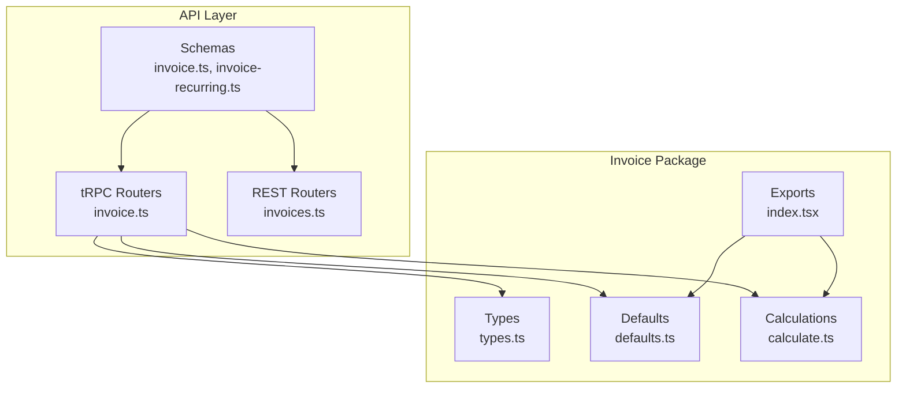
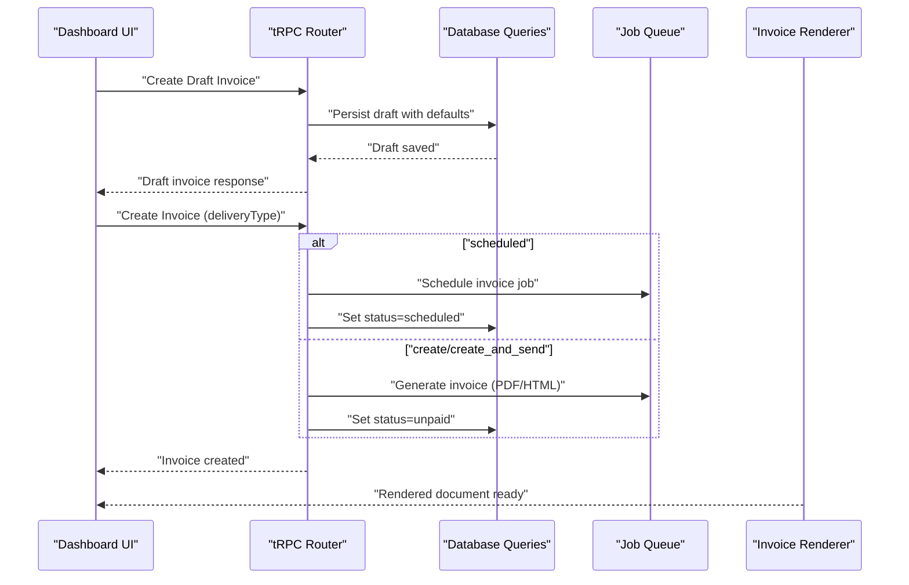
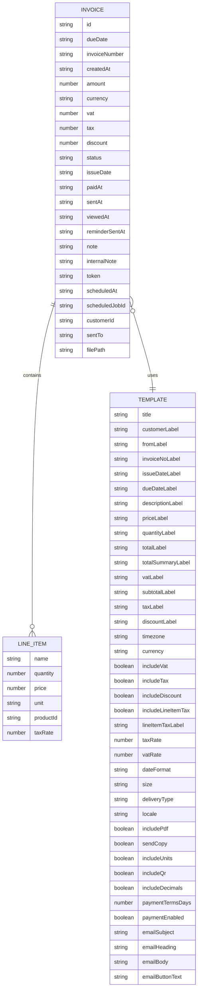
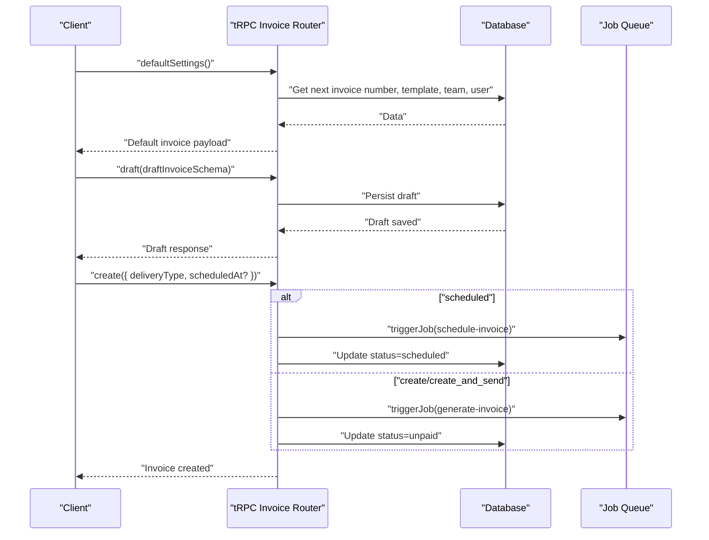
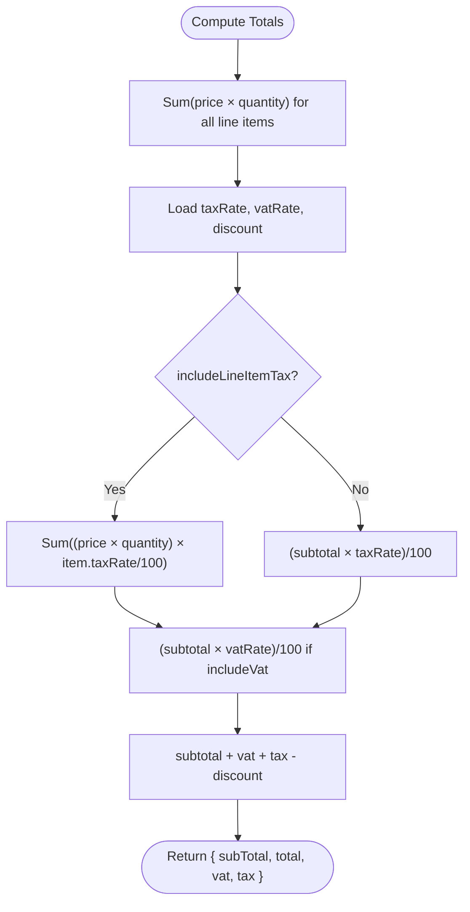
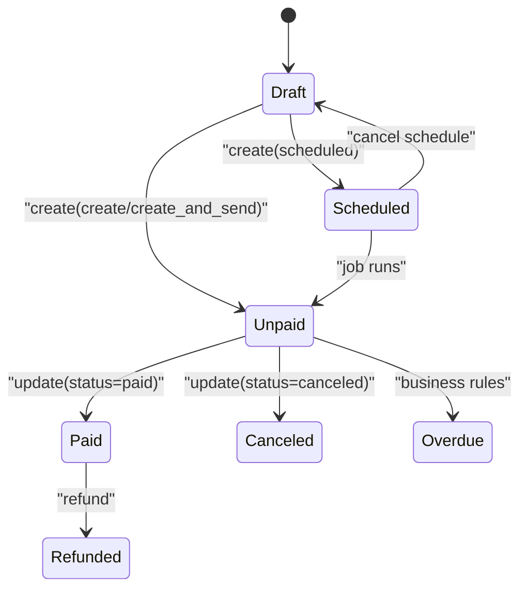
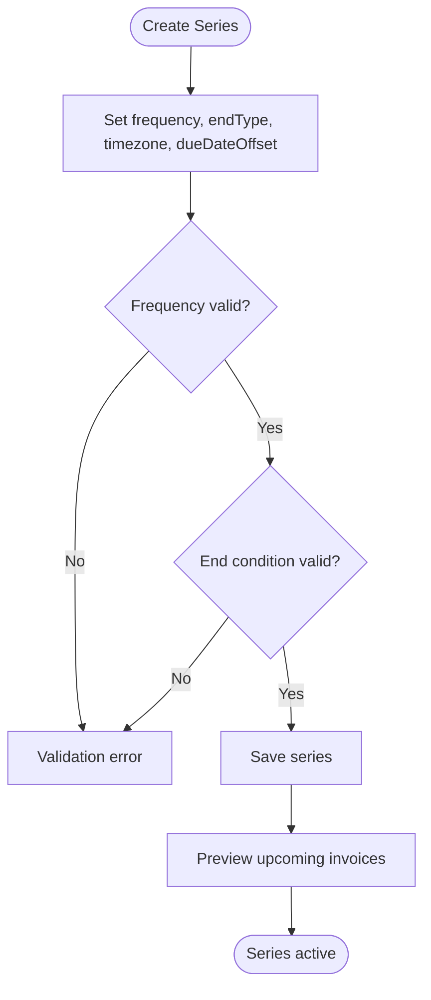
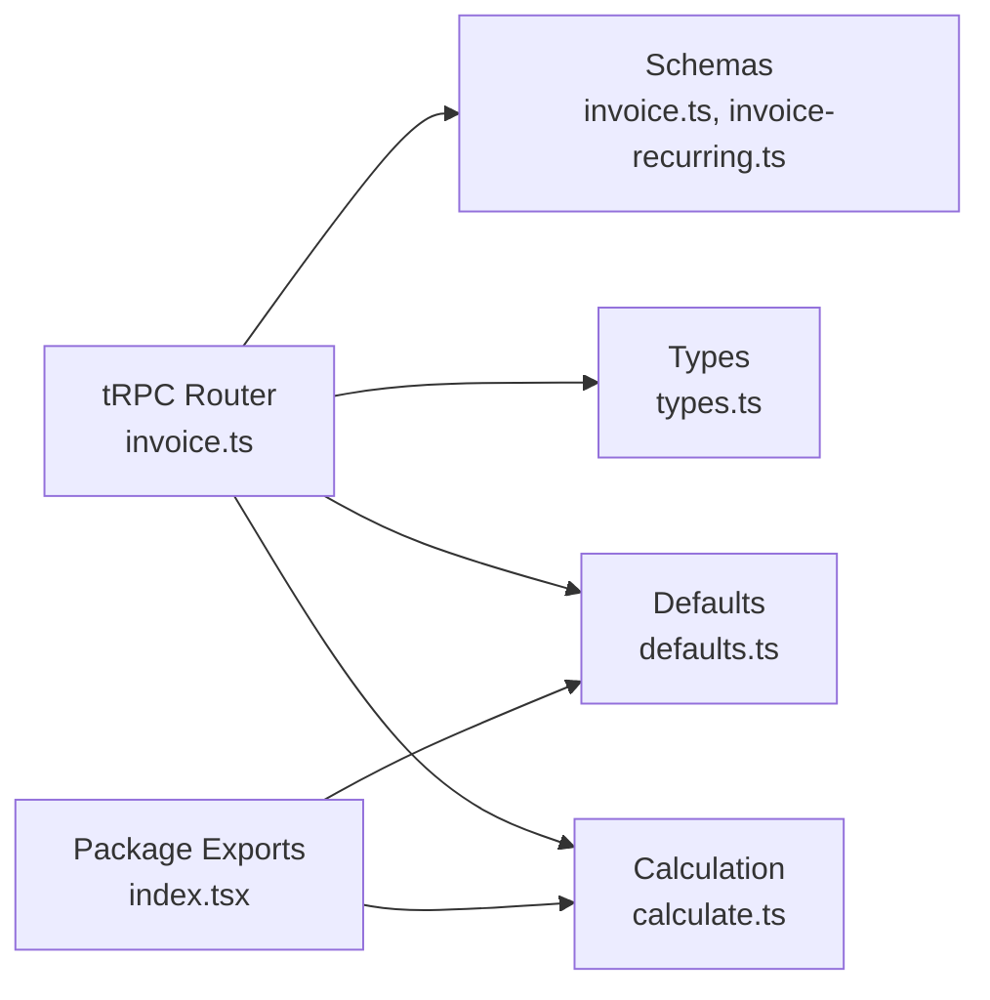

# Invoice Creation & Management

<cite>
**Referenced Files in This Document**
- [invoice.ts](file://midday/apps/api/src/schemas/invoice.ts)
- [invoice-recurring.ts](file://midday/apps/api/src/schemas/invoice-recurring.ts)
- [invoice.ts](file://midday/apps/api/src/trpc/routers/invoice.ts)
- [calculate.ts](file://midday/packages/invoice/src/utils/calculate.ts)
- [types.ts](file://midday/packages/invoice/src/types.ts)
- [defaults.ts](file://midday/packages/invoice/src/defaults.ts)
- [index.tsx](file://midday/packages/invoice/src/index.tsx)
- [invoices.ts](file://midday/apps/api/src/rest/routers/invoices.ts)
</cite>

## Table of Contents
1. [Introduction](#introduction)
2. [Project Structure](#project-structure)
3. [Core Components](#core-components)
4. [Architecture Overview](#architecture-overview)
5. [Detailed Component Analysis](#detailed-component-analysis)
6. [Dependency Analysis](#dependency-analysis)
7. [Performance Considerations](#performance-considerations)
8. [Troubleshooting Guide](#troubleshooting-guide)
9. [Conclusion](#conclusion)
10. [Appendices](#appendices)

## Introduction
This document explains the end-to-end invoice creation and management functionality in the system. It covers the complete workflow from customer selection and line item management, through tax and discount calculations, template application, and invoice status management. It also documents the underlying API endpoints, data models, and business rules that govern invoice creation, updates, scheduling, reminders, duplication, and recurring invoicing.

## Project Structure
The invoice feature spans three primary areas:
- API schemas and REST/tRPC routers define typed contracts and orchestrate business logic.
- The invoice package provides reusable calculation utilities, defaults, types, and rendering exports.
- The dashboard integrates UI components for invoice creation and management (referenced via component imports and actions).

**Diagram sources**
- [invoice.ts](file://midday/apps/api/src/schemas/invoice.ts#L1-L1502)
- [invoice-recurring.ts](file://midday/apps/api/src/schemas/invoice-recurring.ts#L1-L767)
- [invoice.ts](file://midday/apps/api/src/trpc/routers/invoice.ts#L1-L812)
- [types.ts](file://midday/packages/invoice/src/types.ts#L1-L153)
- [defaults.ts](file://midday/packages/invoice/src/defaults.ts#L1-L80)
- [calculate.ts](file://midday/packages/invoice/src/utils/calculate.ts#L1-L80)
- [index.tsx](file://midday/packages/invoice/src/index.tsx#L1-L10)

**Section sources**
- [invoice.ts](file://midday/apps/api/src/schemas/invoice.ts#L1-L1502)
- [invoice-recurring.ts](file://midday/apps/api/src/schemas/invoice-recurring.ts#L1-L767)
- [invoice.ts](file://midday/apps/api/src/trpc/routers/invoice.ts#L1-L812)
- [types.ts](file://midday/packages/invoice/src/types.ts#L1-L153)
- [defaults.ts](file://midday/packages/invoice/src/defaults.ts#L1-L80)
- [calculate.ts](file://midday/packages/invoice/src/utils/calculate.ts#L1-L80)
- [index.tsx](file://midday/packages/invoice/src/index.tsx#L1-L10)

## Core Components
- Invoice schemas define the shape of invoice data, line items, templates, and query filters for retrieval and summaries.
- Recurring invoice schemas define series configuration, frequency rules, and end conditions.
- tRPC router orchestrates invoice lifecycle: creation, drafting, scheduling, reminders, duplication, and status updates.
- Calculation utilities compute totals, subtotals, taxes, VAT, and per-line-item totals.
- Types and defaults provide shared contracts and sensible defaults across API, worker, and dashboard.

Key responsibilities:
- Customer selection and details binding during invoice creation.
- Line item management with product integration and quantity/price adjustments.
- Tax and discount computation modes (invoice-level vs line-item tax).
- Template application and rendering (HTML/PDF/OG).
- Status transitions and scheduling workflows.
- Recurring invoice series management.

**Section sources**
- [invoice.ts](file://midday/apps/api/src/schemas/invoice.ts#L151-L800)
- [invoice-recurring.ts](file://midday/apps/api/src/schemas/invoice-recurring.ts#L34-L485)
- [invoice.ts](file://midday/apps/api/src/trpc/routers/invoice.ts#L62-L812)
- [calculate.ts](file://midday/packages/invoice/src/utils/calculate.ts#L1-L80)
- [types.ts](file://midday/packages/invoice/src/types.ts#L1-L153)
- [defaults.ts](file://midday/packages/invoice/src/defaults.ts#L1-L80)

## Architecture Overview
The invoice system follows a layered architecture:
- Presentation/UI: Dashboard components handle invoice creation and editing.
- API: tRPC and REST routers expose typed endpoints for invoice operations.
- Domain: Schemas enforce validation and business rules.
- Utilities: Calculation and defaults encapsulate shared logic.
- Persistence: Database queries are invoked by routers to persist and retrieve data.

**Diagram sources**
- [invoice.ts](file://midday/apps/api/src/trpc/routers/invoice.ts#L448-L609)
- [calculate.ts](file://midday/packages/invoice/src/utils/calculate.ts#L1-L80)
- [defaults.ts](file://midday/packages/invoice/src/defaults.ts#L1-L80)

## Detailed Component Analysis

### Invoice Data Model and Templates
- Templates define labels, display flags, tax/VAT inclusion, currency, locale, date format, QR inclusion, PDF/email attachments, payment terms, and email content.
- Invoice drafts and finalized invoices carry template metadata and computed totals (subtotal, tax, VAT, discount, amount).
- Editor fields (TipTap JSON) support rich text for sender details, payment details, notes, and custom blocks.

**Diagram sources**
- [invoice.ts](file://midday/apps/api/src/schemas/invoice.ts#L77-L149)
- [invoice.ts](file://midday/apps/api/src/schemas/invoice.ts#L151-L190)
- [invoice.ts](file://midday/apps/api/src/schemas/invoice.ts#L192-L283)
- [types.ts](file://midday/packages/invoice/src/types.ts#L29-L76)

**Section sources**
- [invoice.ts](file://midday/apps/api/src/schemas/invoice.ts#L77-L149)
- [invoice.ts](file://midday/apps/api/src/schemas/invoice.ts#L151-L190)
- [invoice.ts](file://midday/apps/api/src/schemas/invoice.ts#L192-L283)
- [types.ts](file://midday/packages/invoice/src/types.ts#L29-L76)

### Invoice Creation Workflow
- Default settings endpoint aggregates next invoice number, template, team, and user preferences to prefill the editor.
- Draft creation persists a draft invoice with parsed TipTap content and computed dates.
- Final creation supports three delivery types:
  - Create: sets status to unpaid and triggers generation.
  - Create and send: same as create plus sends the invoice.
  - Scheduled: schedules a future run, replacing any prior job safely.

**Diagram sources**
- [invoice.ts](file://midday/apps/api/src/trpc/routers/invoice.ts#L279-L407)
- [invoice.ts](file://midday/apps/api/src/trpc/routers/invoice.ts#L429-L446)
- [invoice.ts](file://midday/apps/api/src/trpc/routers/invoice.ts#L448-L609)

**Section sources**
- [invoice.ts](file://midday/apps/api/src/trpc/routers/invoice.ts#L279-L407)
- [invoice.ts](file://midday/apps/api/src/trpc/routers/invoice.ts#L429-L446)
- [invoice.ts](file://midday/apps/api/src/trpc/routers/invoice.ts#L448-L609)

### Line Items System and Product Integration
- Line items support name, quantity, price, unit, optional product ID, and per-line-item tax rate.
- Products can be saved/upserted/searched and later referenced by productId to populate line items.
- Pricing calculations:
  - Per-line-item total = price × quantity.
  - Subtotal = sum of per-line-item totals.
  - VAT = subtotal × (VAT rate)/100 (when included).
  - Tax can be computed either per line item (when enabled) or at invoice level.
  - Total = subtotal + VAT + Tax − discount.

**Diagram sources**
- [calculate.ts](file://midday/packages/invoice/src/utils/calculate.ts#L1-L80)

**Section sources**
- [invoice.ts](file://midday/apps/api/src/schemas/invoice.ts#L407-L417)
- [calculate.ts](file://midday/packages/invoice/src/utils/calculate.ts#L1-L80)
- [types.ts](file://midday/packages/invoice/src/types.ts#L1-L10)

### Tax and Discount Application
- Tax and VAT are configurable per template and can be toggled on/off.
- Two tax modes:
  - Line-item tax: each line item contributes tax based on its own taxRate.
  - Invoice-level tax: a single tax computed on subtotal.
- Discount is subtracted from subtotal + tax + vat.
- Defaults provide sensible off-by-default behavior with user-configurable rates.

**Section sources**
- [invoice.ts](file://midday/apps/api/src/schemas/invoice.ts#L77-L149)
- [calculate.ts](file://midday/packages/invoice/src/utils/calculate.ts#L1-L80)
- [defaults.ts](file://midday/packages/invoice/src/defaults.ts#L34-L61)

### Invoice Status Management and Editing Workflows
- Supported statuses: draft, overdue, paid, unpaid, canceled, scheduled, refunded.
- Status transitions:
  - Draft → Unpaid (create).
  - Draft → Scheduled (create with scheduled delivery).
  - Scheduled → Unpaid (job executes).
  - Unpaid → Paid/Canceled (manual update).
- Editing workflows:
  - Update invoice fields (dates, amounts, status).
  - Duplicate invoice to a new draft with incremented number.
  - Remind customers about unpaid invoices.
  - Reschedule or cancel scheduled invoices.

**Diagram sources**
- [invoice.ts](file://midday/apps/api/src/schemas/invoice.ts#L662-L675)
- [invoice.ts](file://midday/apps/api/src/trpc/routers/invoice.ts#L410-L418)
- [invoice.ts](file://midday/apps/api/src/trpc/routers/invoice.ts#L629-L640)
- [invoice.ts](file://midday/apps/api/src/trpc/routers/invoice.ts#L642-L734)
- [invoice.ts](file://midday/apps/api/src/trpc/routers/invoice.ts#L737-L774)

**Section sources**
- [invoice.ts](file://midday/apps/api/src/schemas/invoice.ts#L662-L675)
- [invoice.ts](file://midday/apps/api/src/trpc/routers/invoice.ts#L410-L418)
- [invoice.ts](file://midday/apps/api/src/trpc/routers/invoice.ts#L629-L640)
- [invoice.ts](file://midday/apps/api/src/trpc/routers/invoice.ts#L642-L734)
- [invoice.ts](file://midday/apps/api/src/trpc/routers/invoice.ts#L737-L774)

### Recurring Invoices
- Series configuration includes frequency (weekly, biweekly, monthly_date, monthly_weekday, quarterly, semi_annual, annual, custom), end conditions (never, on_date, after_count), timezone, and due-date offsets.
- Validation enforces required parameters per frequency and end condition.
- Upcoming invoices preview and summary provide visibility into future obligations.

**Diagram sources**
- [invoice-recurring.ts](file://midday/apps/api/src/schemas/invoice-recurring.ts#L35-L299)
- [invoice-recurring.ts](file://midday/apps/api/src/schemas/invoice-recurring.ts#L302-L485)

**Section sources**
- [invoice-recurring.ts](file://midday/apps/api/src/schemas/invoice-recurring.ts#L34-L485)
- [invoice-recurring.ts](file://midday/apps/api/src/schemas/invoice-recurring.ts#L550-L623)

### API Endpoints and Business Rules
- tRPC endpoints:
  - defaultSettings: assemble defaults and initial payload.
  - draft: persist draft invoice with parsed editor content.
  - create: create invoice with delivery type handling.
  - update: update status and related fields.
  - duplicate: clone invoice with new number.
  - remind: send reminder job and record timestamp.
  - updateSchedule/cancelSchedule: reschedule or cancel future runs.
  - get/getById/getInvoiceByToken: fetch invoices with token verification.
  - invoiceSummary/searchInvoiceNumber/paymentStatus: analytics and lookup helpers.
- REST endpoints:
  - invoices router exposes REST routes for invoice operations (paths and handlers defined in the file).

Business rules:
- Scheduled invoices must be in the future; rescheduling replaces the job safely.
- Delivery type “scheduled” requires a future scheduledAt.
- Token-based access validates JWT and resolves invoice ID.

**Section sources**
- [invoice.ts](file://midday/apps/api/src/trpc/routers/invoice.ts#L62-L812)
- [invoices.ts](file://midday/apps/api/src/rest/routers/invoices.ts)

### Practical Examples
- Creating an invoice:
  - Call defaultSettings to prefill template and dates.
  - Call draft with customer details and line items.
  - Call create with deliveryType "create" or "create_and_send".
- Managing line items:
  - Add/remove line items; adjust quantity/price; optionally link productId.
  - Recompute totals using the calculation utilities.
- Applying taxes:
  - Enable includeVat/includeTax in template; set rates; choose per-line-item or invoice-level tax.
- Handling modifications:
  - Use update to change status or dates.
  - Use duplicate to create a new draft from an existing invoice.
  - Use updateSchedule/cancelSchedule to manage future deliveries.

[No sources needed since this section provides practical guidance without analyzing specific files]

## Dependency Analysis
The invoice package exports calculation utilities and defaults for use across API, worker, and dashboard. The tRPC router depends on schemas for validation and invokes database queries and job queues for persistence and asynchronous tasks.

**Diagram sources**
- [invoice.ts](file://midday/apps/api/src/trpc/routers/invoice.ts#L1-L56)
- [invoice.ts](file://midday/apps/api/src/schemas/invoice.ts#L1-L1502)
- [invoice-recurring.ts](file://midday/apps/api/src/schemas/invoice-recurring.ts#L1-L767)
- [types.ts](file://midday/packages/invoice/src/types.ts#L1-L153)
- [defaults.ts](file://midday/packages/invoice/src/defaults.ts#L1-L80)
- [calculate.ts](file://midday/packages/invoice/src/utils/calculate.ts#L1-L80)
- [index.tsx](file://midday/packages/invoice/src/index.tsx#L1-L10)

**Section sources**
- [invoice.ts](file://midday/apps/api/src/trpc/routers/invoice.ts#L1-L56)
- [index.tsx](file://midday/packages/invoice/src/index.tsx#L1-L10)

## Performance Considerations
- Prefer batching database reads/writes for bulk operations (e.g., listing invoices, generating previews).
- Use pagination cursors for large datasets to reduce memory overhead.
- Offload heavy tasks (PDF generation, email sending) to job queues to keep API responses fast.
- Cache frequently accessed template defaults and next invoice numbers at the application layer when appropriate.

[No sources needed since this section provides general guidance]

## Troubleshooting Guide
Common issues and resolutions:
- Scheduled invoice not running:
  - Verify scheduledAt is in the future and job exists in queue.
  - Check logs for job creation and invoice update failures.
- Token access denied:
  - Ensure token is valid and decodes to a proper invoice ID.
- Validation errors on creation:
  - Confirm required fields (customerId, dates) and deliveryType constraints.
- Tax/VAT not appearing:
  - Check template include flags and rates; confirm calculation mode (line-item vs invoice-level).

**Section sources**
- [invoice.ts](file://midday/apps/api/src/trpc/routers/invoice.ts#L452-L583)
- [invoice.ts](file://midday/apps/api/src/trpc/routers/invoice.ts#L81-L102)

## Conclusion
The invoice system provides a robust, schema-driven foundation for creating, managing, and automating invoices. It supports flexible templates, precise tax computations, scheduled delivery, reminders, duplication, and recurring series. The separation of concerns across schemas, routers, utilities, and defaults ensures maintainability and extensibility.

[No sources needed since this section summarizes without analyzing specific files]

## Appendices

### Appendix A: Invoice Editor and Real-Time Calculations
- The editor supports TipTap JSON content for rich text fields (sender details, payment details, notes).
- Real-time calculations:
  - Subtotal updates as quantities/prices change.
  - VAT and tax computed based on template flags and rates.
  - Discount applied to produce final total.

**Section sources**
- [invoice.ts](file://midday/apps/api/src/schemas/invoice.ts#L5-L74)
- [calculate.ts](file://midday/packages/invoice/src/utils/calculate.ts#L1-L80)

### Appendix B: Rendering and Templates
- HTML, PDF, and OG renderers are exported from the invoice package.
- Defaults provide consistent label and setting fallbacks across environments.

**Section sources**
- [index.tsx](file://midday/packages/invoice/src/index.tsx#L1-L10)
- [defaults.ts](file://midday/packages/invoice/src/defaults.ts#L1-L80)