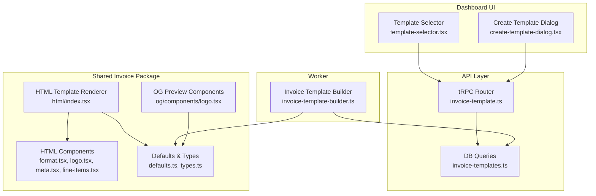
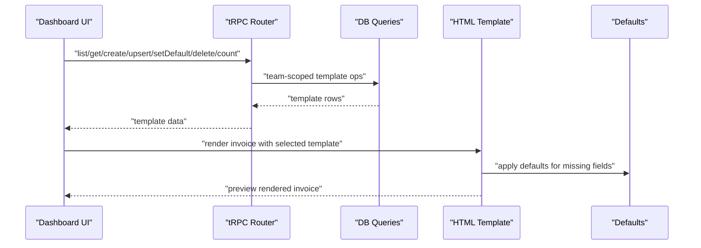
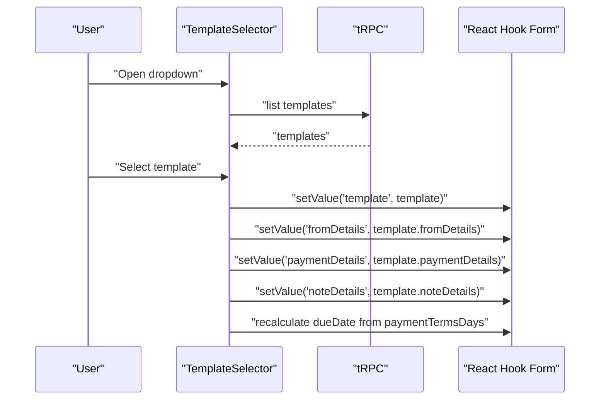
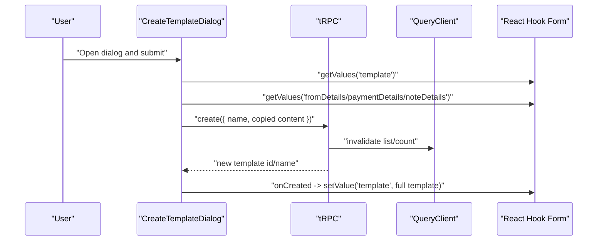
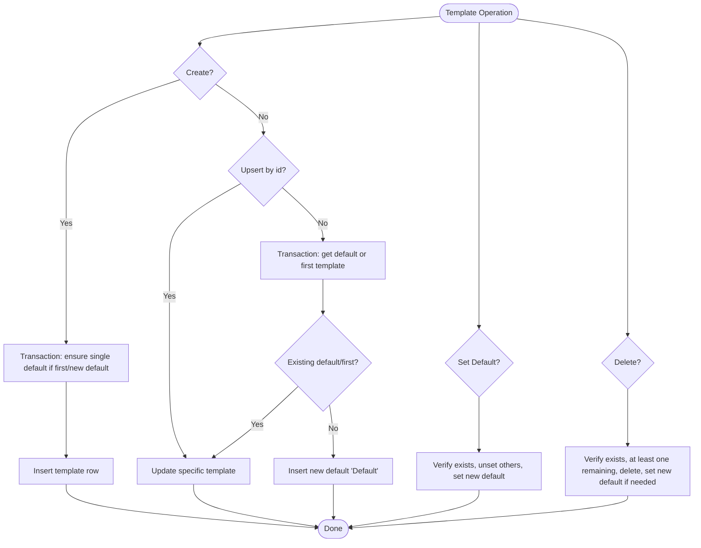
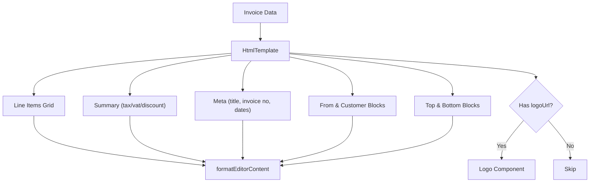
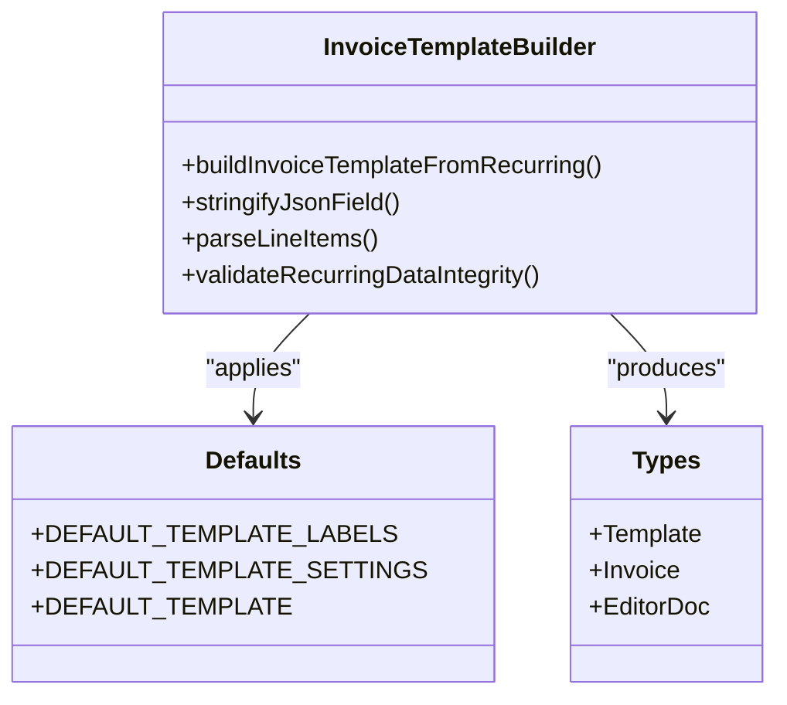
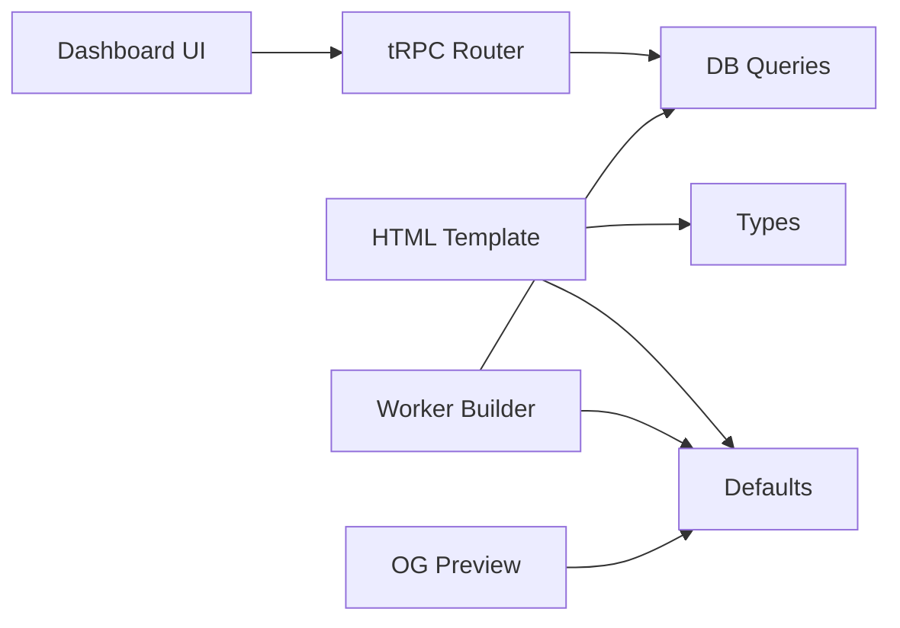

# Invoice Templates & Customization

<cite>
**Referenced Files in This Document**
- [invoice-template.ts](file://midday/apps/api/src/trpc/routers/invoice-template.ts)
- [template-selector.tsx](file://midday/apps/dashboard/src/components/invoice/template-selector.tsx)
- [create-template-dialog.tsx](file://midday/apps/dashboard/src/components/invoice/create-template-dialog.tsx)
- [invoice-templates.ts](file://midday/packages/db/src/queries/invoice-templates.ts)
- [html/index.tsx](file://midday/packages/invoice/src/templates/html/index.tsx)
- [html/format.tsx](file://midday/packages/invoice/src/templates/html/format.tsx)
- [html/components/logo.tsx](file://midday/packages/invoice/src/templates/html/components/logo.tsx)
- [html/components/meta.tsx](file://midday/packages/invoice/src/templates/html/components/meta.tsx)
- [html/components/line-items.tsx](file://midday/packages/invoice/src/templates/html/components/line-items.tsx)
- [invoice-template-builder.ts](file://midday/apps/worker/src/utils/invoice-template-builder.ts)
- [defaults.ts](file://midday/packages/invoice/src/defaults.ts)
- [types.ts](file://midday/packages/invoice/src/types.ts)
- [og/components/logo.tsx](file://midday/packages/invoice/src/templates/og/components/logo.tsx)
</cite>

## Table of Contents
1. [Introduction](#introduction)
2. [Project Structure](#project-structure)
3. [Core Components](#core-components)
4. [Architecture Overview](#architecture-overview)
5. [Detailed Component Analysis](#detailed-component-analysis)
6. [Dependency Analysis](#dependency-analysis)
7. [Performance Considerations](#performance-considerations)
8. [Troubleshooting Guide](#troubleshooting-guide)
9. [Conclusion](#conclusion)
10. [Appendices](#appendices)

## Introduction
This document explains the invoice template system and customization options across the API, dashboard, worker, and shared invoice packages. It covers template selection, creation, branding, styling, and rendering. It also documents the template inheritance model via defaults, per-template overrides, and per-customer variations. Finally, it describes the rendering pipeline for HTML previews and the export pathways for PDF generation.

## Project Structure
The template system spans three main areas:
- API layer: tRPC router for CRUD and default template management
- Dashboard UI: template selector, creation dialog, and preview wiring
- Shared invoice package: HTML template renderer, OG preview, defaults, and types
- Worker: template builder for recurring invoices and data validation

**Diagram sources**
- [invoice-template.ts](file://midday/apps/api/src/trpc/routers/invoice-template.ts#L1-L83)
- [invoice-templates.ts](file://midday/packages/db/src/queries/invoice-templates.ts#L1-L475)
- [template-selector.tsx](file://midday/apps/dashboard/src/components/invoice/template-selector.tsx#L1-L160)
- [create-template-dialog.tsx](file://midday/apps/dashboard/src/components/invoice/create-template-dialog.tsx#L1-L161)
- [html/index.tsx](file://midday/packages/invoice/src/templates/html/index.tsx#L1-L146)
- [html/format.tsx](file://midday/packages/invoice/src/templates/html/format.tsx#L1-L77)
- [html/components/logo.tsx](file://midday/packages/invoice/src/templates/html/components/logo.tsx#L1-L20)
- [html/components/meta.tsx](file://midday/packages/invoice/src/templates/html/components/meta.tsx#L1-L84)
- [html/components/line-items.tsx](file://midday/packages/invoice/src/templates/html/components/line-items.tsx#L1-L102)
- [invoice-template-builder.ts](file://midday/apps/worker/src/utils/invoice-template-builder.ts#L1-L285)
- [defaults.ts](file://midday/packages/invoice/src/defaults.ts#L1-L80)
- [types.ts](file://midday/packages/invoice/src/types.ts#L1-L153)
- [og/components/logo.tsx](file://midday/packages/invoice/src/templates/og/components/logo.tsx#L1-L10)

**Section sources**
- [invoice-template.ts](file://midday/apps/api/src/trpc/routers/invoice-template.ts#L1-L83)
- [invoice-templates.ts](file://midday/packages/db/src/queries/invoice-templates.ts#L1-L475)
- [template-selector.tsx](file://midday/apps/dashboard/src/components/invoice/template-selector.tsx#L1-L160)
- [create-template-dialog.tsx](file://midday/apps/dashboard/src/components/invoice/create-template-dialog.tsx#L1-L161)
- [html/index.tsx](file://midday/packages/invoice/src/templates/html/index.tsx#L1-L146)
- [invoice-template-builder.ts](file://midday/apps/worker/src/utils/invoice-template-builder.ts#L1-L285)
- [defaults.ts](file://midday/packages/invoice/src/defaults.ts#L1-L80)
- [types.ts](file://midday/packages/invoice/src/types.ts#L1-L153)

## Core Components
- Template management API: list, get, create, upsert (including default template), set default, delete, count
- Dashboard template selector: choose among team templates, apply template fields, recalculate due dates
- Create template dialog: capture current invoice-level content and persist as a new template
- HTML template renderer: composes Meta, Logo, From/Customer blocks, Line Items, Summary, and Editor content
- Defaults and types: centralized defaults for labels, settings, and TypeScript contracts
- Worker template builder: merges recurring invoice data with template defaults for consistent rendering
- OG preview: minimal logo rendering for social sharing previews

**Section sources**
- [invoice-template.ts](file://midday/apps/api/src/trpc/routers/invoice-template.ts#L15-L82)
- [template-selector.tsx](file://midday/apps/dashboard/src/components/invoice/template-selector.tsx#L23-L89)
- [create-template-dialog.tsx](file://midday/apps/dashboard/src/components/invoice/create-template-dialog.tsx#L39-L99)
- [html/index.tsx](file://midday/packages/invoice/src/templates/html/index.tsx#L17-L145)
- [defaults.ts](file://midday/packages/invoice/src/defaults.ts#L10-L80)
- [types.ts](file://midday/packages/invoice/src/types.ts#L78-L121)
- [invoice-template-builder.ts](file://midday/apps/worker/src/utils/invoice-template-builder.ts#L102-L200)
- [og/components/logo.tsx](file://midday/packages/invoice/src/templates/og/components/logo.tsx#L6-L9)

## Architecture Overview
The template system follows a layered pattern:
- UI triggers template selection and creation
- tRPC routes validate and persist template metadata and content
- Defaults ensure consistent fallbacks
- HTML renderer composes the invoice using template fields and editor content
- Worker builds templates for recurring invoices using defaults and DB-provided overrides

**Diagram sources**
- [invoice-template.ts](file://midday/apps/api/src/trpc/routers/invoice-template.ts#L15-L82)
- [invoice-templates.ts](file://midday/packages/db/src/queries/invoice-templates.ts#L112-L170)
- [html/index.tsx](file://midday/packages/invoice/src/templates/html/index.tsx#L17-L145)
- [defaults.ts](file://midday/packages/invoice/src/defaults.ts#L34-L61)

## Detailed Component Analysis

### Template Selection and Application
- The selector lists templates for the team, highlights the current selection, and applies template fields to the invoice form
- Switching templates updates fromDetails, paymentDetails, noteDetails, and recalculates dueDate based on paymentTermsDays

**Diagram sources**
- [template-selector.tsx](file://midday/apps/dashboard/src/components/invoice/template-selector.tsx#L29-L63)

**Section sources**
- [template-selector.tsx](file://midday/apps/dashboard/src/components/invoice/template-selector.tsx#L23-L89)

### Creating a New Template
- The dialog captures a template name and copies current invoice-level content (fromDetails, paymentDetails, noteDetails) into the new template
- On success, it invalidates queries and selects the newly created template

**Diagram sources**
- [create-template-dialog.tsx](file://midday/apps/dashboard/src/components/invoice/create-template-dialog.tsx#L51-L99)

**Section sources**
- [create-template-dialog.tsx](file://midday/apps/dashboard/src/components/invoice/create-template-dialog.tsx#L39-L99)

### Template Persistence and Defaults
- The API supports create, upsert (by id or default), setDefault, and delete with transactional safety
- Defaults ensure consistent behavior when fields are missing

**Diagram sources**
- [invoice-template.ts](file://midday/apps/api/src/trpc/routers/invoice-template.ts#L28-L76)
- [invoice-templates.ts](file://midday/packages/db/src/queries/invoice-templates.ts#L178-L311)

**Section sources**
- [invoice-template.ts](file://midday/apps/api/src/trpc/routers/invoice-template.ts#L15-L82)
- [invoice-templates.ts](file://midday/packages/db/src/queries/invoice-templates.ts#L112-L170)

### HTML Template Rendering Pipeline
- The HTML renderer composes Meta, Logo, From/Customer details, top/bottom blocks, Line Items, and Summary
- Editor content is formatted with basic inline formatting and links
- Responsive layout uses grid and flex utilities

**Diagram sources**
- [html/index.tsx](file://midday/packages/invoice/src/templates/html/index.tsx#L39-L141)
- [html/format.tsx](file://midday/packages/invoice/src/templates/html/format.tsx#L3-L76)
- [html/components/meta.tsx](file://midday/packages/invoice/src/templates/html/components/meta.tsx#L13-L83)
- [html/components/logo.tsx](file://midday/packages/invoice/src/templates/html/components/logo.tsx#L6-L19)
- [html/components/line-items.tsx](file://midday/packages/invoice/src/templates/html/components/line-items.tsx#L20-L101)

**Section sources**
- [html/index.tsx](file://midday/packages/invoice/src/templates/html/index.tsx#L17-L145)
- [html/format.tsx](file://midday/packages/invoice/src/templates/html/format.tsx#L3-L76)
- [html/components/meta.tsx](file://midday/packages/invoice/src/templates/html/components/meta.tsx#L13-L83)
- [html/components/logo.tsx](file://midday/packages/invoice/src/templates/html/components/logo.tsx#L6-L19)
- [html/components/line-items.tsx](file://midday/packages/invoice/src/templates/html/components/line-items.tsx#L20-L101)

### Template Inheritance, Defaults, and Variations
- Defaults define label texts, display flags, currency, locale, date format, sizes, and email/PDF settings
- The worker’s builder merges recurring invoice data with template overrides and applies defaults for missing fields
- Per-customer variations are supported by storing template overrides per invoice and falling back to defaults

**Diagram sources**
- [defaults.ts](file://midday/packages/invoice/src/defaults.ts#L10-L77)
- [invoice-template-builder.ts](file://midday/apps/worker/src/utils/invoice-template-builder.ts#L102-L200)
- [types.ts](file://midday/packages/invoice/src/types.ts#L78-L121)

**Section sources**
- [defaults.ts](file://midday/packages/invoice/src/defaults.ts#L34-L61)
- [invoice-template-builder.ts](file://midday/apps/worker/src/utils/invoice-template-builder.ts#L102-L200)
- [types.ts](file://midday/packages/invoice/src/types.ts#L78-L121)

### Branding and Styling Options
- Branding: logoUrl is supported and rendered when present
- Typography and layout: serif title, monospace line items grid, responsive grids, and spacing tokens
- Formatting: inline bold, italic, strikethrough, links, and hard breaks in editor content
- Locale-aware formatting for amounts and dates

**Section sources**
- [html/index.tsx](file://midday/packages/invoice/src/templates/html/index.tsx#L49-L141)
- [html/format.tsx](file://midday/packages/invoice/src/templates/html/format.tsx#L10-L76)
- [html/components/meta.tsx](file://midday/packages/invoice/src/templates/html/components/meta.tsx#L23-L36)
- [html/components/line-items.tsx](file://midday/packages/invoice/src/templates/html/components/line-items.tsx#L35-L53)

### Logo Upload and Placement
- Logo URL is stored in the template and rendered in the top-right area of the HTML preview
- OG preview renders a fixed-size logo for social sharing

**Section sources**
- [html/components/logo.tsx](file://midday/packages/invoice/src/templates/html/components/logo.tsx#L6-L19)
- [og/components/logo.tsx](file://midday/packages/invoice/src/templates/og/components/logo.tsx#L6-L9)

### Template Editor Content Model
- EditorDoc defines a ProseMirror-like structure with nodes and inline content
- Marks support bold, italic, strike, and link attributes
- Links are detected and converted to mailto when appropriate

**Section sources**
- [types.ts](file://midday/packages/invoice/src/types.ts#L123-L144)
- [html/format.tsx](file://midday/packages/invoice/src/templates/html/format.tsx#L10-L76)

### PDF Generation and Export Formats
- The HTML renderer is used for web previews
- The worker’s builder includes an includePdf flag and deliveryType for email attachments and scheduling
- The system supports “create,” “create_and_send,” and “scheduled” delivery modes

**Section sources**
- [html/index.tsx](file://midday/packages/invoice/src/templates/html/index.tsx#L17-L145)
- [invoice-template-builder.ts](file://midday/apps/worker/src/utils/invoice-template-builder.ts#L54-L93)
- [defaults.ts](file://midday/packages/invoice/src/defaults.ts#L50-L55)

## Dependency Analysis
- UI depends on tRPC for template operations
- tRPC depends on DB queries for persistence
- HTML renderer depends on defaults and types
- Worker depends on defaults and DB queries for recurring invoices
- OG preview depends on defaults for rendering

**Diagram sources**
- [template-selector.tsx](file://midday/apps/dashboard/src/components/invoice/template-selector.tsx#L24-L30)
- [invoice-template.ts](file://midday/apps/api/src/trpc/routers/invoice-template.ts#L15-L19)
- [invoice-templates.ts](file://midday/packages/db/src/queries/invoice-templates.ts#L112-L118)
- [html/index.tsx](file://midday/packages/invoice/src/templates/html/index.tsx#L17-L37)
- [defaults.ts](file://midday/packages/invoice/src/defaults.ts#L34-L61)
- [invoice-template-builder.ts](file://midday/apps/worker/src/utils/invoice-template-builder.ts#L102-L104)

**Section sources**
- [template-selector.tsx](file://midday/apps/dashboard/src/components/invoice/template-selector.tsx#L23-L31)
- [invoice-template.ts](file://midday/apps/api/src/trpc/routers/invoice-template.ts#L15-L19)
- [invoice-templates.ts](file://midday/packages/db/src/queries/invoice-templates.ts#L112-L118)
- [html/index.tsx](file://midday/packages/invoice/src/templates/html/index.tsx#L17-L37)
- [defaults.ts](file://midday/packages/invoice/src/defaults.ts#L34-L61)
- [invoice-template-builder.ts](file://midday/apps/worker/src/utils/invoice-template-builder.ts#L102-L104)

## Performance Considerations
- Template operations use transactions to avoid race conditions during default assignment and deletions
- Query invalidation in the UI minimizes redundant fetches after mutations
- HTML rendering leverages lightweight components and responsive CSS for smooth scrolling and layout
- Defaults reduce branching and improve predictability

[No sources needed since this section provides general guidance]

## Troubleshooting Guide
- Template not found when setting default or deleting: the API validates ownership and existence; ensure the correct teamId and id are used
- Cannot delete the last template: the API enforces at least one template remains
- Default template selection fallback: if no explicit default exists, the first template is used
- Editor content formatting: ensure inline marks and links conform to the expected schema; malformed content may render as plain text

**Section sources**
- [invoice-templates.ts](file://midday/packages/db/src/queries/invoice-templates.ts#L319-L362)
- [invoice-templates.ts](file://midday/packages/db/src/queries/invoice-templates.ts#L370-L410)
- [invoice-templates.ts](file://midday/packages/db/src/queries/invoice-templates.ts#L144-L170)
- [html/format.tsx](file://midday/packages/invoice/src/templates/html/format.tsx#L10-L76)

## Conclusion
The invoice template system combines a robust API with a flexible UI and a strongly typed renderer. Defaults ensure consistent behavior, while per-template overrides and per-customer variations provide customization. The HTML renderer and worker builder deliver reliable previews and recurring invoice generation, with clear pathways for branding, styling, and export.

[No sources needed since this section summarizes without analyzing specific files]

## Appendices

### Practical Examples

- Create a custom template
  - Open the Create Template dialog, enter a name, and confirm
  - The system copies current invoice-level content into the new template
  - After creation, the new template is selected automatically

  **Section sources**
  - [create-template-dialog.tsx](file://midday/apps/dashboard/src/components/invoice/create-template-dialog.tsx#L51-L99)

- Upload a logo
  - Store a logoUrl in the template; it appears in the HTML preview
  - For OG previews, a fixed-size logo is rendered

  **Section sources**
  - [html/components/logo.tsx](file://midday/packages/invoice/src/templates/html/components/logo.tsx#L6-L19)
  - [og/components/logo.tsx](file://midday/packages/invoice/src/templates/og/components/logo.tsx#L6-L9)

- Configure colors and fonts
  - Use the template’s label and summary labels to guide content
  - The HTML renderer applies monospace for line items and a serif title for emphasis
  - Adjust includeDecimals and includeUnits to control numeric presentation

  **Section sources**
  - [html/index.tsx](file://midday/packages/invoice/src/templates/html/index.tsx#L49-L141)
  - [html/components/line-items.tsx](file://midday/packages/invoice/src/templates/html/components/line-items.tsx#L33-L53)

- Apply branded designs
  - Customize labels and content blocks (fromDetails, paymentDetails, noteDetails)
  - Choose includeVat/includeTax/includeDiscount based on your region and policy
  - Set includePdf and deliveryType for email workflows

  **Section sources**
  - [defaults.ts](file://midday/packages/invoice/src/defaults.ts#L34-L61)
  - [invoice-template-builder.ts](file://midday/apps/worker/src/utils/invoice-template-builder.ts#L54-L93)

- Template inheritance and defaults
  - Missing fields fall back to DEFAULT_TEMPLATE_SETTINGS and DEFAULT_TEMPLATE_LABELS
  - Worker builder merges recurring data with template overrides and defaults

  **Section sources**
  - [defaults.ts](file://midday/packages/invoice/src/defaults.ts#L34-L77)
  - [invoice-template-builder.ts](file://midday/apps/worker/src/utils/invoice-template-builder.ts#L102-L200)

- Rendering pipeline and export
  - HTML preview uses HtmlTemplate and components
  - Worker prepares built templates for recurring invoices and email delivery

  **Section sources**
  - [html/index.tsx](file://midday/packages/invoice/src/templates/html/index.tsx#L17-L145)
  - [invoice-template-builder.ts](file://midday/apps/worker/src/utils/invoice-template-builder.ts#L102-L200)