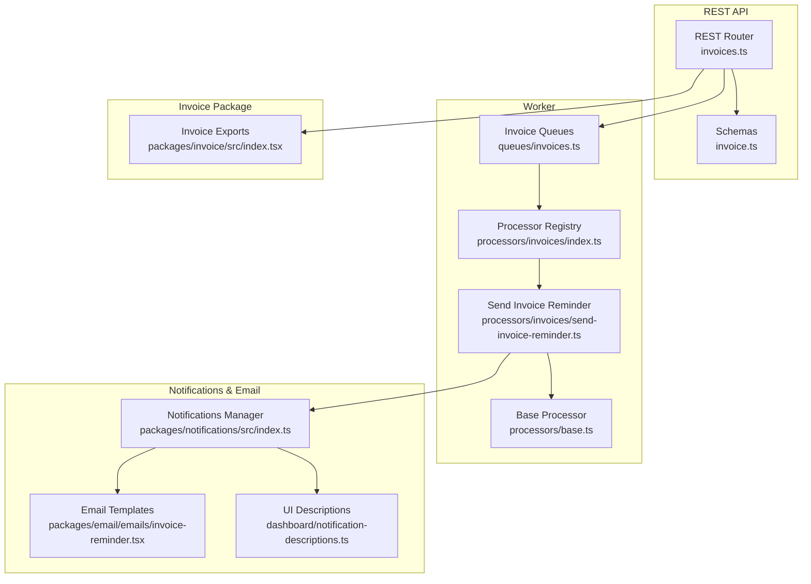
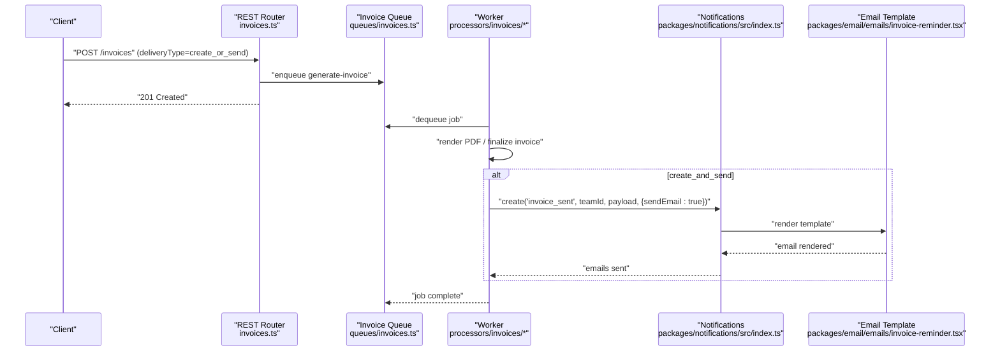
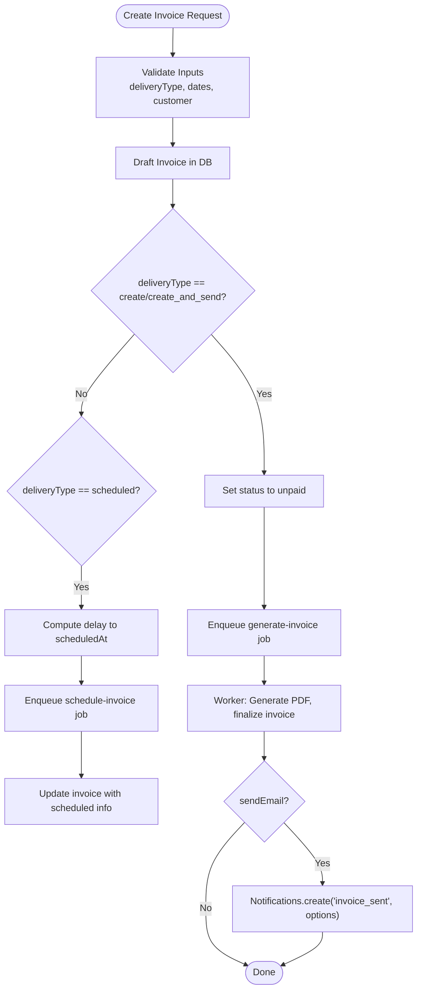
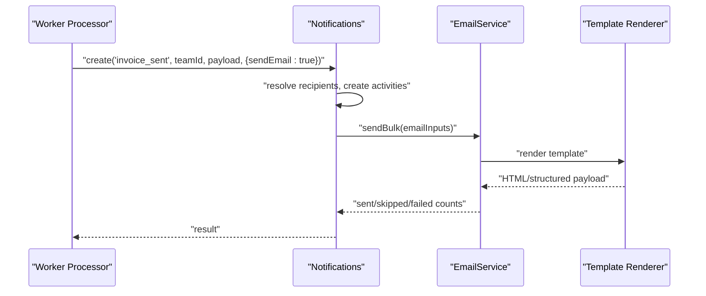
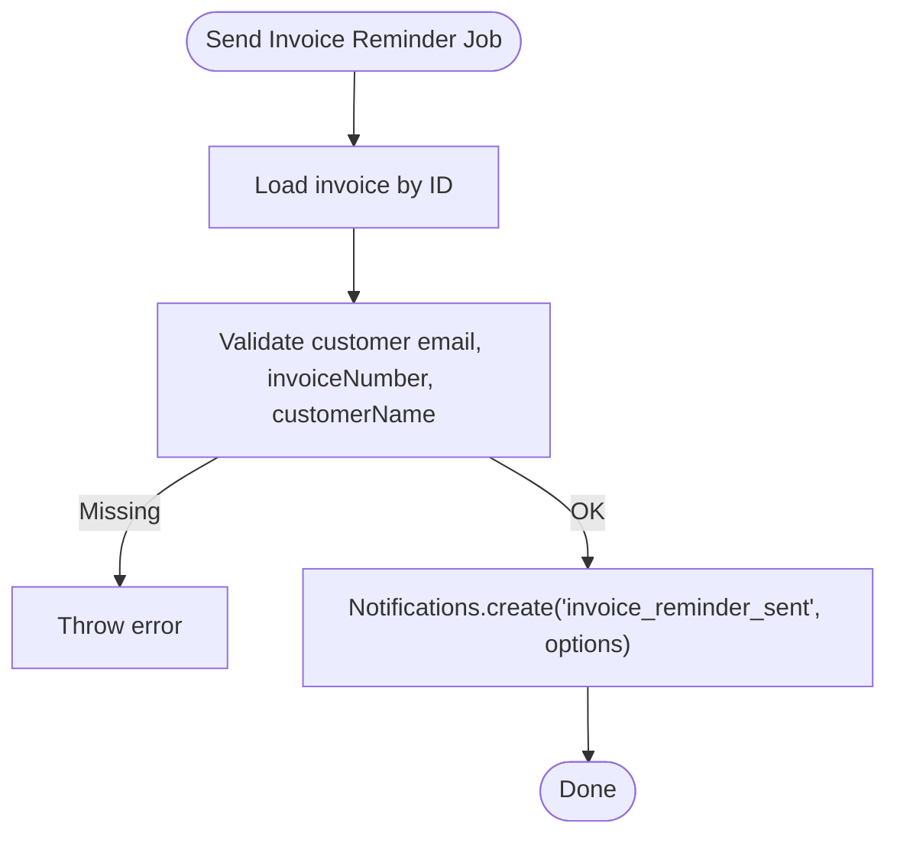
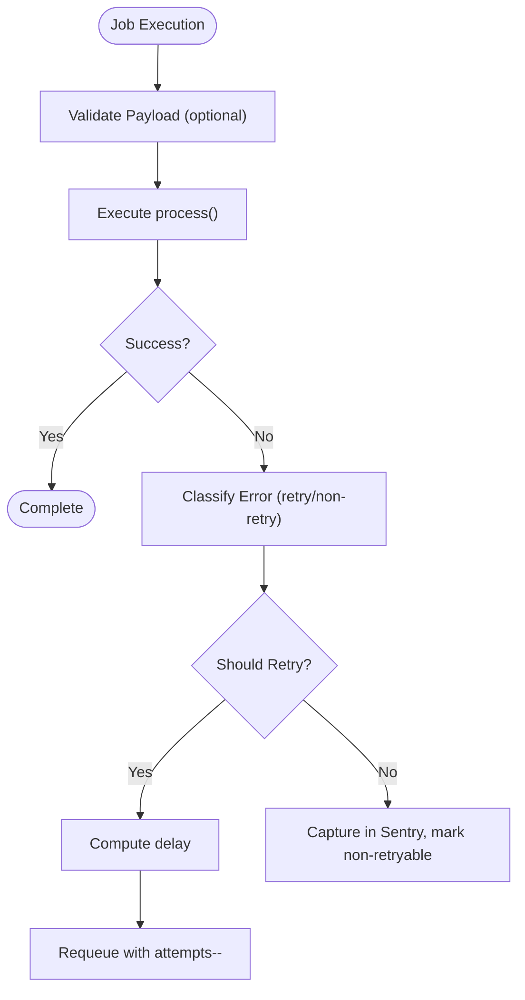
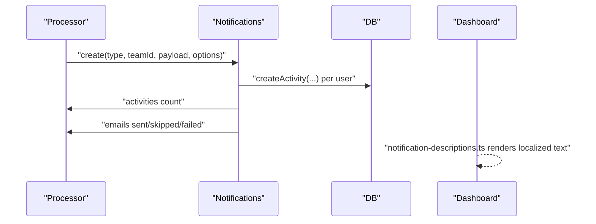
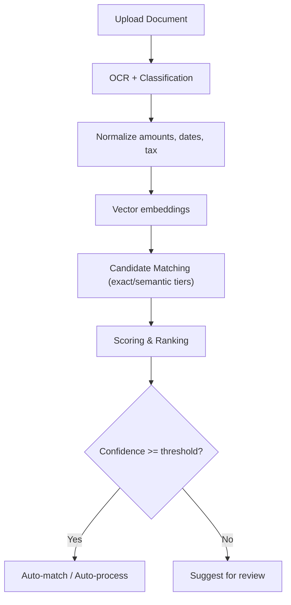
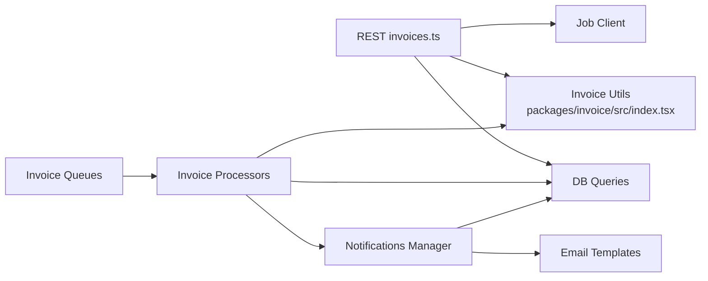

# Invoice Workflow Automation

<cite>
**Referenced Files in This Document**
- [invoices.ts](file://midday/apps/api/src/rest/routers/invoices.ts)
- [invoice.ts](file://midday/apps/api/src/schemas/invoice.ts)
- [index.tsx](file://midday/packages/invoice/src/index.tsx)
- [send-invoice-reminder.ts](file://midday/apps/worker/src/processors/invoices/send-invoice-reminder.ts)
- [index.ts](file://midday/apps/worker/src/processors/invoices/index.ts)
- [invoices.ts](file://midday/apps/worker/src/queues/invoices.ts)
- [index.ts](file://midday/apps/worker/src/queues/index.ts)
- [base.ts](file://midday/apps/worker/src/processors/base.ts)
- [index.ts](file://midday/packages/notifications/src/index.ts)
- [invoice-overdue.ts](file://midday/packages/notifications/src/types/invoice-overdue.ts)
- [invoice-reminder.tsx](file://midday/packages/email/emails/invoice-reminder.tsx)
- [notification-descriptions.ts](file://midday/apps/dashboard/src/components/notification-center/notification-descriptions.ts)
- [invoices.ts](file://midday/apps/api/src/ai/agents/invoices.ts)
- [merging.ts](file://midday/packages/documents/src/utils/merging.ts)
</cite>

## Table of Contents
1. [Introduction](#introduction)
2. [Project Structure](#project-structure)
3. [Core Components](#core-components)
4. [Architecture Overview](#architecture-overview)
5. [Detailed Component Analysis](#detailed-component-analysis)
6. [Dependency Analysis](#dependency-analysis)
7. [Performance Considerations](#performance-considerations)
8. [Troubleshooting Guide](#troubleshooting-guide)
9. [Conclusion](#conclusion)
10. [Appendices](#appendices)

## Introduction
This document explains the end-to-end invoice workflow automation and intelligent processing system. It covers automated invoice generation, email delivery, reminder systems, background job processing with retries and error handling, notification orchestration, and AI-assisted invoice management. Practical examples demonstrate how invoices are created, delivered, reminded, and processed, along with integration points for external systems and webhook-style notifications.

## Project Structure
The invoice workflow spans three layers:
- REST API layer: HTTP endpoints for invoice lifecycle operations and job triggering
- Worker layer: Background job processing for generation, sending, reminders, and scheduling
- Notifications and email layer: Delivery of in-app and email notifications with templating

**Diagram sources**
- [invoices.ts](file://midday/apps/api/src/rest/routers/invoices.ts#L1-L760)
- [invoice.ts](file://midday/apps/api/src/schemas/invoice.ts#L1-L800)
- [index.ts](file://midday/apps/worker/src/queues/invoices.ts#L1-L200)
- [index.ts](file://midday/apps/worker/src/processors/invoices/index.ts#L1-L29)
- [send-invoice-reminder.ts](file://midday/apps/worker/src/processors/invoices/send-invoice-reminder.ts#L1-L81)
- [base.ts](file://midday/apps/worker/src/processors/base.ts#L1-L226)
- [index.ts](file://midday/packages/notifications/src/index.ts#L1-L434)
- [invoice-reminder.tsx](file://midday/packages/email/emails/invoice-reminder.tsx#L89-L108)
- [notification-descriptions.ts](file://midday/apps/dashboard/src/components/notification-center/notification-descriptions.ts#L126-L217)
- [index.tsx](file://midday/packages/invoice/src/index.tsx#L1-L10)

**Section sources**
- [invoices.ts](file://midday/apps/api/src/rest/routers/invoices.ts#L1-L760)
- [index.ts](file://midday/apps/worker/src/queues/index.ts#L1-L65)

## Core Components
- REST API router for invoice operations and job triggers
- Worker processors for invoice generation, sending, reminders, scheduling, and recurring generation
- Notifications manager orchestrating in-app and email delivery
- Invoice package exporting rendering utilities and templates
- AI agent for invoice insights and suggestions

Key responsibilities:
- REST endpoints validate inputs, persist drafts, and enqueue background jobs
- Worker processors execute long-running tasks with robust error handling and retries
- Notifications manager creates activities and emails per user preferences
- Invoice package renders PDFs and HTML templates for email previews

**Section sources**
- [invoices.ts](file://midday/apps/api/src/rest/routers/invoices.ts#L415-L634)
- [index.ts](file://midday/apps/worker/src/processors/invoices/index.ts#L1-L29)
- [index.ts](file://midday/packages/notifications/src/index.ts#L67-L390)
- [index.tsx](file://midday/packages/invoice/src/index.tsx#L1-L10)
- [invoices.ts](file://midday/apps/api/src/ai/agents/invoices.ts#L1-L26)

## Architecture Overview
The system uses a queue-driven architecture:
- REST routes accept requests and enqueue jobs into dedicated invoice queues
- Worker processes consume jobs, perform operations (PDF generation, email sending), and emit notifications
- Notifications manager persists activities and sends emails via provider integrations
- UI surfaces notifications and links to invoice details

**Diagram sources**
- [invoices.ts](file://midday/apps/api/src/rest/routers/invoices.ts#L507-L515)
- [index.ts](file://midday/apps/worker/src/queues/invoices.ts#L1-L200)
- [index.ts](file://midday/apps/worker/src/processors/invoices/index.ts#L1-L29)
- [index.ts](file://midday/packages/notifications/src/index.ts#L212-L390)
- [invoice-reminder.tsx](file://midday/packages/email/emails/invoice-reminder.tsx#L89-L108)

## Detailed Component Analysis

### Automated Invoice Generation Pipeline
- Endpoint accepts invoice creation with deliveryType and optional scheduledAt
- For immediate delivery, endpoint drafts invoice, sets status to unpaid, and enqueues generate-invoice
- Worker processor validates invoice existence and required fields, then renders PDF and finalizes invoice
- If deliveryType is create_and_send, worker triggers email notification with sendEmail option

**Diagram sources**
- [invoices.ts](file://midday/apps/api/src/rest/routers/invoices.ts#L415-L634)
- [send-invoice-reminder.ts](file://midday/apps/worker/src/processors/invoices/send-invoice-reminder.ts#L1-L81)
- [index.ts](file://midday/packages/notifications/src/index.ts#L212-L390)

**Section sources**
- [invoices.ts](file://midday/apps/api/src/rest/routers/invoices.ts#L415-L634)
- [invoice.ts](file://midday/apps/api/src/schemas/invoice.ts#L686-L713)

### Email Sending Workflows
- Worker processor invokes Notifications.create with invoice context and sendEmail flag
- Notifications manager resolves recipients, creates activities, and conditionally sends emails
- Email templates render subject, body, and CTA links; structured data can be attached for providers

**Diagram sources**
- [send-invoice-reminder.ts](file://midday/apps/worker/src/processors/invoices/send-invoice-reminder.ts#L48-L74)
- [index.ts](file://midday/packages/notifications/src/index.ts#L212-L390)
- [invoice-reminder.tsx](file://midday/packages/email/emails/invoice-reminder.tsx#L89-L108)

**Section sources**
- [send-invoice-reminder.ts](file://midday/apps/worker/src/processors/invoices/send-invoice-reminder.ts#L48-L74)
- [index.ts](file://midday/packages/notifications/src/index.ts#L212-L390)

### Reminder Systems
- Worker processor fetches invoice and validates presence of required fields
- Sends reminder notification with customer email, invoice token, and structured data
- Logs success or throws error for downstream retry handling

**Diagram sources**
- [send-invoice-reminder.ts](file://midday/apps/worker/src/processors/invoices/send-invoice-reminder.ts#L13-L81)

**Section sources**
- [send-invoice-reminder.ts](file://midday/apps/worker/src/processors/invoices/send-invoice-reminder.ts#L13-L81)

### Background Job Processing, Retries, and Error Handling
- BaseProcessor provides centralized error handling, Sentry tagging, and retry classification
- Jobs are retried according to configured delays and max attempts; non-retryable errors are marked appropriately
- Worker emits logs and Sentry events for visibility and observability

**Diagram sources**
- [base.ts](file://midday/apps/worker/src/processors/base.ts#L17-L226)

**Section sources**
- [base.ts](file://midday/apps/worker/src/processors/base.ts#L17-L226)

### Notification Systems, Status Updates, and Orchestration
- Notifications manager creates activities per user and applies priority rules based on preferences
- Email dispatch respects emailType (owners/customer/team) and merges metadata when supported
- Dashboard displays localized notification descriptions for invoice events

**Diagram sources**
- [index.ts](file://midday/packages/notifications/src/index.ts#L99-L185)
- [notification-descriptions.ts](file://midday/apps/dashboard/src/components/notification-center/notification-descriptions.ts#L126-L217)

**Section sources**
- [index.ts](file://midday/packages/notifications/src/index.ts#L99-L185)
- [notification-descriptions.ts](file://midday/apps/dashboard/src/components/notification-center/notification-descriptions.ts#L126-L217)

### AI-Assisted Invoice Processing and Intelligent Suggestions
- AI agent specializes in invoice management, leveraging shared agent configuration and tools
- Extraction and merging utilities compute confidence scores for invoice data, aiding intelligent categorization and suggestions
- The system can suggest matches and auto-process high-confidence candidates during document ingestion

**Diagram sources**
- [invoices.ts](file://midday/apps/api/src/ai/agents/invoices.ts#L1-L26)
- [merging.ts](file://midday/packages/documents/src/utils/merging.ts#L12-L44)

**Section sources**
- [invoices.ts](file://midday/apps/api/src/ai/agents/invoices.ts#L1-L26)
- [merging.ts](file://midday/packages/documents/src/utils/merging.ts#L12-L44)

### Practical Examples
- Automated invoice creation:
  - POST /invoices with deliveryType=create_or_send triggers PDF generation and optional email sending
- Email delivery:
  - Worker sends invoice_sent notification with customer email and preview link
- Payment reminders:
  - Worker sends invoice_reminder_sent notification with structured data for provider integration
- AI-assisted processing:
  - Agent assists with invoice insights; merging utilities compute extraction confidence for suggestions

**Section sources**
- [invoices.ts](file://midday/apps/api/src/rest/routers/invoices.ts#L507-L515)
- [send-invoice-reminder.ts](file://midday/apps/worker/src/processors/invoices/send-invoice-reminder.ts#L48-L74)
- [index.ts](file://midday/packages/notifications/src/index.ts#L212-L390)

## Dependency Analysis
- REST router depends on database queries, invoice calculation utilities, and job client to enqueue jobs
- Worker processors depend on database access, Notifications manager, and invoice rendering utilities
- Notifications manager depends on email service and localization utilities
- Invoice package exports rendering functions used by worker processors

**Diagram sources**
- [invoices.ts](file://midday/apps/api/src/rest/routers/invoices.ts#L32-L36)
- [index.tsx](file://midday/packages/invoice/src/index.tsx#L1-L10)
- [index.ts](file://midday/apps/worker/src/queues/invoices.ts#L1-L200)
- [index.ts](file://midday/apps/worker/src/processors/invoices/index.ts#L1-L29)
- [index.ts](file://midday/packages/notifications/src/index.ts#L1-L434)

**Section sources**
- [invoices.ts](file://midday/apps/api/src/rest/routers/invoices.ts#L32-L36)
- [index.ts](file://midday/apps/worker/src/queues/index.ts#L1-L65)

## Performance Considerations
- Use delayed job scheduling for future-dated invoices to avoid immediate processing overhead
- Batch notifications where appropriate to reduce email service calls
- Prefer idempotent operations in processors to minimize duplicate work
- Monitor queue backlogs and scale workers proportionally to invoice volume

## Troubleshooting Guide
Common issues and resolutions:
- Invoice not found during reminder processing:
  - Ensure invoice exists and has required fields populated before enqueueing reminder jobs
- Missing customer email:
  - Validate customer association and email address prior to sending reminders
- Email delivery failures:
  - Inspect Notifications.create result and Sentry logs for provider errors
- Job retries:
  - Review BaseProcessor classification and adjust retry delays or mark non-retryable as needed

**Section sources**
- [send-invoice-reminder.ts](file://midday/apps/worker/src/processors/invoices/send-invoice-reminder.ts#L26-L45)
- [index.ts](file://midday/packages/notifications/src/index.ts#L212-L390)
- [base.ts](file://midday/apps/worker/src/processors/base.ts#L17-L226)

## Conclusion
The invoice workflow automation integrates REST APIs, background job processing, intelligent notifications, and AI assistance to deliver a robust, scalable system. With structured retries, comprehensive error handling, and flexible notification channels, teams can automate invoice creation, delivery, reminders, and intelligent processing while maintaining reliability and transparency.

## Appendices
- External system integrations:
  - Email provider integration via Notifications manager and email templates
  - Webhook-style notifications through job-triggered events and dashboard descriptions
- Schemas and types:
  - Invoice creation, update, and scheduling schemas define request/response contracts

**Section sources**
- [invoice.ts](file://midday/apps/api/src/schemas/invoice.ts#L686-L713)
- [notification-descriptions.ts](file://midday/apps/dashboard/src/components/notification-center/notification-descriptions.ts#L126-L217)