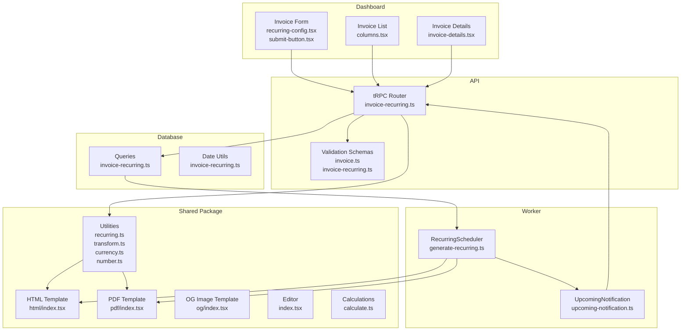
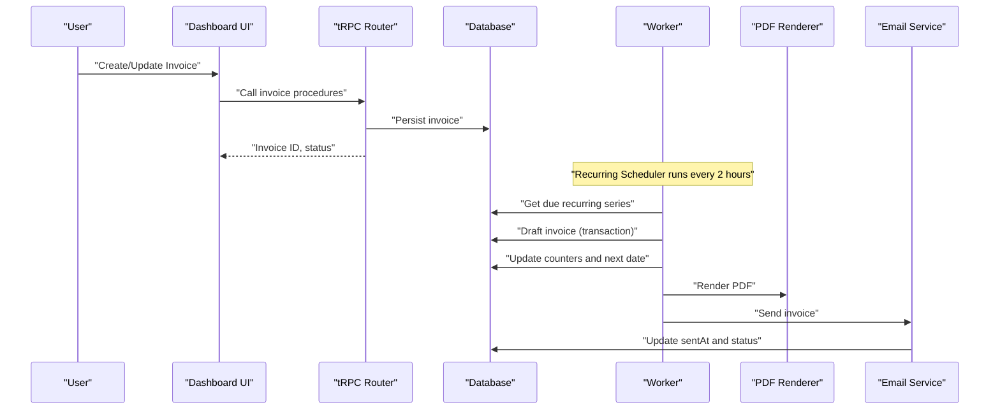
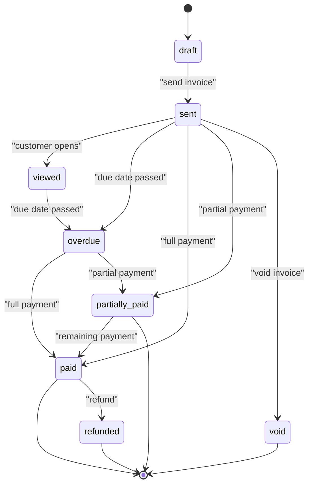
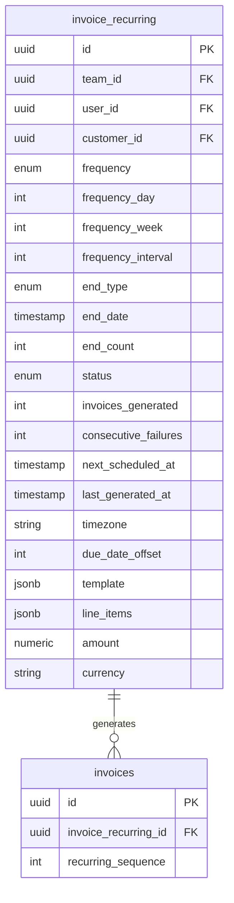
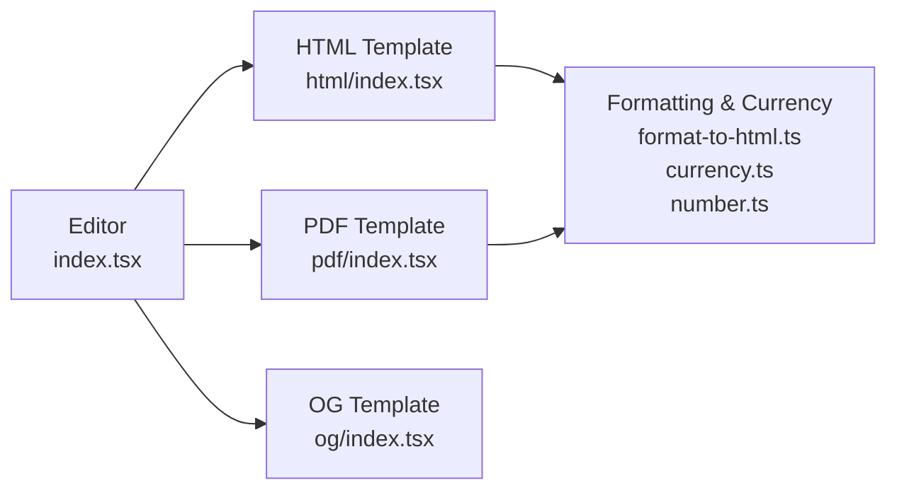
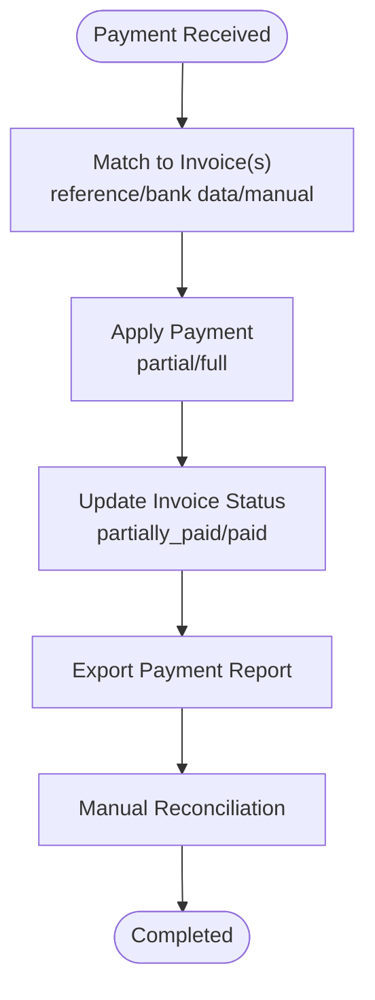
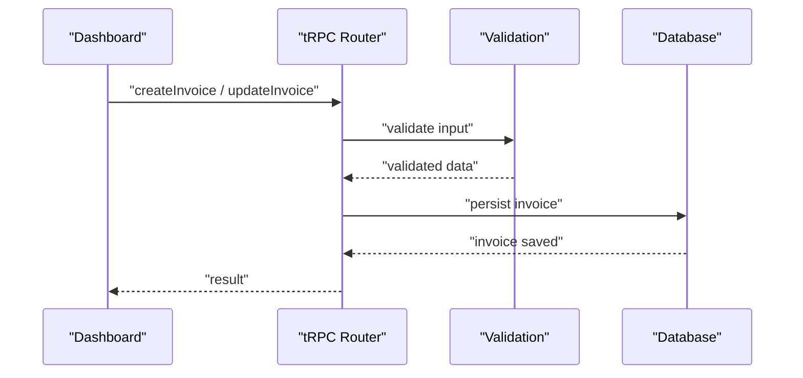
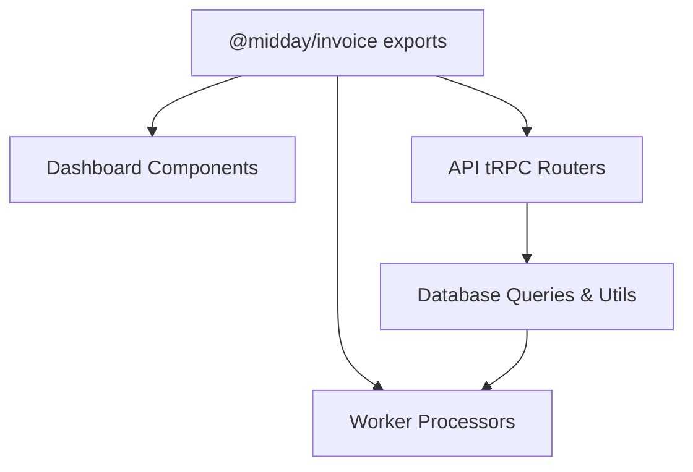

# Invoicing System

<cite>
**Referenced Files in This Document**
- [package.json](file://midday/packages/invoice/package.json)
- [invoice-recurring.md](file://midday/docs/invoice-recurring.md)
- [invoice.ts](file://midday/apps/api/src/schemas/invoice.ts)
- [invoice-recurring.ts](file://midday/apps/api/src/schemas/invoice-recurring.ts)
- [invoice-recurring.ts](file://midday/apps/api/src/trpc/routers/invoice-recurring.ts)
- [generate-recurring.ts](file://midday/apps/worker/src/processors/invoices/generate-recurring.ts)
- [upcoming-notification.ts](file://midday/apps/worker/src/processors/invoices/upcoming-notification.ts)
- [invoice-recurring.ts](file://midday/packages/db/src/queries/invoice-recurring.ts)
- [invoice-recurring.ts](file://midday/packages/db/src/utils/invoice-recurring.ts)
- [recurring.ts](file://midday/packages/invoice/src/utils/recurring.ts)
- [recurring-config.tsx](file://midday/apps/dashboard/src/components/invoice/recurring-config.tsx)
- [submit-button.tsx](file://midday/apps/dashboard/src/components/invoice/submit-button.tsx)
- [edit-recurring-sheet.tsx](file://midday/apps/dashboard/src/components/sheets/edit-recurring-sheet.tsx)
- [issue-date.tsx](file://midday/apps/dashboard/src/components/invoice/issue-date.tsx)
- [due-date.tsx](file://midday/apps/dashboard/src/components/invoice/due-date.tsx)
- [invoice-details.tsx](file://midday/apps/dashboard/src/components/invoice-details.tsx)
- [invoice-success.tsx](file://midday/apps/dashboard/src/components/invoice-success.tsx)
- [columns.tsx](file://midday/apps/dashboard/src/components/tables/invoices/columns.tsx)
- [customer-details.tsx](file://midday/apps/dashboard/src/components/customer-details.tsx)
- [select-attachment.tsx](file://midday/apps/dashboard/src/components/select-attachment.tsx)
- [format.ts](file://midday/apps/dashboard/src/utils/format.ts)
- [html/index.tsx](file://midday/packages/invoice/src/templates/html/index.tsx)
- [pdf/index.tsx](file://midday/packages/invoice/src/templates/pdf/index.tsx)
- [og/index.tsx](file://midday/packages/invoice/src/templates/og/index.tsx)
- [index.tsx](file://midday/packages/invoice/src/editor/index.tsx)
- [calculate.ts](file://midday/packages/invoice/src/utils/calculate.ts)
- [content.ts](file://midday/packages/invoice/src/utils/content.ts)
- [transform.ts](file://midday/packages/invoice/src/utils/transform.ts)
- [currency.ts](file://midday/packages/invoice/src/utils/currency.ts)
- [number.ts](file://midday/packages/invoice/src/utils/number.ts)
- [format-to-html.ts](file://midday/packages/invoice/src/utils/format-to-html.ts)
- [README.md](file://midday/README.md)
</cite>

## Table of Contents
1. [Introduction](#introduction)
2. [Project Structure](#project-structure)
3. [Core Components](#core-components)
4. [Architecture Overview](#architecture-overview)
5. [Detailed Component Analysis](#detailed-component-analysis)
6. [Dependency Analysis](#dependency-analysis)
7. [Performance Considerations](#performance-considerations)
8. [Troubleshooting Guide](#troubleshooting-guide)
9. [Conclusion](#conclusion)
10. [Appendices](#appendices)

## Introduction
This document describes Faworra’s invoicing system end-to-end: from invoice creation and line item management to tax calculations, payment tracking, and recurring billing. It explains the invoice lifecycle, status management, automated workflows, template customization and PDF generation, subscription-like recurring schedules, payment remittance, integrations, exports, and compliance considerations. Practical examples illustrate invoice creation, template customization, and payment reconciliation.

## Project Structure
Faworra’s invoicing spans three layers:
- Dashboard UI: invoice creation, editing, recurring configuration, and display
- API (tRPC): invoice CRUD, validation, and recurring management
- Worker: scheduled generation, email sending, and notifications
- Shared invoice package: templates, calculations, utilities, and types
- Database queries and recurring utilities: persistence and date/time logic

**Diagram sources**
- [recurring-config.tsx](file://midday/apps/dashboard/src/components/invoice/recurring-config.tsx)
- [submit-button.tsx](file://midday/apps/dashboard/src/components/invoice/submit-button.tsx)
- [columns.tsx](file://midday/apps/dashboard/src/components/tables/invoices/columns.tsx)
- [invoice-details.tsx](file://midday/apps/dashboard/src/components/invoice-details.tsx)
- [invoice-recurring.ts](file://midday/apps/api/src/trpc/routers/invoice-recurring.ts)
- [invoice.ts](file://midday/apps/api/src/schemas/invoice.ts)
- [invoice-recurring.ts](file://midday/apps/api/src/schemas/invoice-recurring.ts)
- [generate-recurring.ts](file://midday/apps/worker/src/processors/invoices/generate-recurring.ts)
- [upcoming-notification.ts](file://midday/apps/worker/src/processors/invoices/upcoming-notification.ts)
- [invoice-recurring.ts](file://midday/packages/db/src/queries/invoice-recurring.ts)
- [invoice-recurring.ts](file://midday/packages/db/src/utils/invoice-recurring.ts)
- [recurring.ts](file://midday/packages/invoice/src/utils/recurring.ts)
- [calculate.ts](file://midday/packages/invoice/src/utils/calculate.ts)
- [transform.ts](file://midday/packages/invoice/src/utils/transform.ts)
- [currency.ts](file://midday/packages/invoice/src/utils/currency.ts)
- [number.ts](file://midday/packages/invoice/src/utils/number.ts)
- [html/index.tsx](file://midday/packages/invoice/src/templates/html/index.tsx)
- [pdf/index.tsx](file://midday/packages/invoice/src/templates/pdf/index.tsx)
- [og/index.tsx](file://midday/packages/invoice/src/templates/og/index.tsx)

**Section sources**
- [README.md](file://midday/README.md)
- [package.json](file://midday/packages/invoice/package.json)

## Core Components
- Invoice schema and validation define structure, required fields, and constraints for invoice creation and updates.
- Recurring invoice configuration defines frequency, end conditions, timezone-aware scheduling, and state transitions.
- Worker processors orchestrate invoice generation, PDF rendering, email delivery, and upcoming notifications.
- Shared invoice package provides templates (HTML, PDF, OG), editor, calculation utilities, formatting, and currency helpers.
- Dashboard components render forms, previews, lists, and details with timezone-safe date handling.

Key responsibilities:
- Creation: UI captures customer, line items, taxes, due date; API validates and persists.
- Lifecycle: status updates, reminders, overdue handling, and archival.
- Templates: customizable HTML/PDF/OG with branding; QR code and metadata.
- Payments: payment tracking, partial payments, remittance workflows, reconciliations.
- Integrations: export formats, accounting sync hooks, compliance metadata.

**Section sources**
- [invoice.ts](file://midday/apps/api/src/schemas/invoice.ts)
- [invoice-recurring.ts](file://midday/apps/api/src/schemas/invoice-recurring.ts)
- [invoice-recurring.md](file://midday/docs/invoice-recurring.md)
- [package.json](file://midday/packages/invoice/package.json)

## Architecture Overview
The invoicing system integrates UI, API, worker, and shared packages around a recurring engine and template pipeline.

**Diagram sources**
- [invoice-recurring.ts](file://midday/apps/api/src/trpc/routers/invoice-recurring.ts)
- [generate-recurring.ts](file://midday/apps/worker/src/processors/invoices/generate-recurring.ts)
- [pdf/index.tsx](file://midday/packages/invoice/src/templates/pdf/index.tsx)

## Detailed Component Analysis

### Invoice Lifecycle and Status Management
- States: draft, sent, viewed, overdue, paid, partially_paid, void, refunded.
- Transitions: creation, send, view, payment application, partial/full payment, void/refund.
- Overdue handling: status updates, reminders, late fees (optional), export triggers.
- Archival: keep records with immutable metadata for compliance.

[No sources needed since this diagram shows conceptual workflow, not actual code structure]

### Recurring Invoices: Scheduling and Subscription Management
Recurring invoices automate ongoing billing with flexible frequency, end conditions, and state management.

**Diagram sources**
- [invoice-recurring.md](file://midday/docs/invoice-recurring.md)

Key behaviors:
- Frequency options: weekly, biweekly, monthly_date, monthly_weekday, quarterly, semi_annual, annual, custom interval.
- End conditions: never, on_date, after_count.
- State machine: active → paused → completed/canceled; auto-pause after 3 consecutive failures.
- Idempotency: checks prevent duplicate generation; transactions wrap creation and counters.
- Notifications: upcoming invoice reminders 24 hours prior; activity notifications for lifecycle events.

**Section sources**
- [invoice-recurring.md](file://midday/docs/invoice-recurring.md)
- [generate-recurring.ts](file://midday/apps/worker/src/processors/invoices/generate-recurring.ts)
- [upcoming-notification.ts](file://midday/apps/worker/src/processors/invoices/upcoming-notification.ts)
- [invoice-recurring.ts](file://midday/packages/db/src/queries/invoice-recurring.ts)
- [invoice-recurring.ts](file://midday/packages/db/src/utils/invoice-recurring.ts)
- [recurring.ts](file://midday/packages/invoice/src/utils/recurring.ts)

### Template System: Customization, Branding, and PDF Generation
Templates are modular and composable:
- HTML: invoice body, branding, totals, line items
- PDF: structured layout, QR code, metadata, branding
- OG: social sharing preview
- Editor: WYSIWYG customization for branding and layout
- Utilities: formatting, currency conversion, number formatting, content transforms

**Diagram sources**
- [html/index.tsx](file://midday/packages/invoice/src/templates/html/index.tsx)
- [pdf/index.tsx](file://midday/packages/invoice/src/templates/pdf/index.tsx)
- [og/index.tsx](file://midday/packages/invoice/src/templates/og/index.tsx)
- [index.tsx](file://midday/packages/invoice/src/editor/index.tsx)
- [format-to-html.ts](file://midday/packages/invoice/src/utils/format-to-html.ts)
- [currency.ts](file://midday/packages/invoice/src/utils/currency.ts)
- [number.ts](file://midday/packages/invoice/src/utils/number.ts)

Practical examples:
- Customize branding: logo, colors, fonts via editor and template props.
- Generate PDF: render invoice with line items, totals, QR code, and metadata.
- Social sharing: OG template for previews.

**Section sources**
- [package.json](file://midday/packages/invoice/package.json)
- [index.tsx](file://midday/packages/invoice/src/editor/index.tsx)
- [calculate.ts](file://midday/packages/invoice/src/utils/calculate.ts)
- [content.ts](file://midday/packages/invoice/src/utils/content.ts)
- [transform.ts](file://midday/packages/invoice/src/utils/transform.ts)
- [currency.ts](file://midday/packages/invoice/src/utils/currency.ts)
- [number.ts](file://midday/packages/invoice/src/utils/number.ts)
- [format-to-html.ts](file://midday/packages/invoice/src/utils/format-to-html.ts)

### Payment Tracking, Partial Payments, and Remittance Workflows
Payment tracking integrates with:
- Payment application: apply incoming payments to invoices, updating status and balances.
- Partial payments: split payments across multiple invoices if needed.
- Remittance: match payments to invoices via reference, bank data, or manual reconciliation.
- Reconciliation: export payment reports, reconcile discrepancies, and mark cleared.

[No sources needed since this diagram shows conceptual workflow, not actual code structure]

### API Workflows and Validation
tRPC procedures expose invoice and recurring invoice operations with strict validation.

**Diagram sources**
- [invoice-recurring.ts](file://midday/apps/api/src/trpc/routers/invoice-recurring.ts)
- [invoice.ts](file://midday/apps/api/src/schemas/invoice.ts)
- [invoice-recurring.ts](file://midday/apps/api/src/schemas/invoice-recurring.ts)

**Section sources**
- [invoice-recurring.ts](file://midday/apps/api/src/trpc/routers/invoice-recurring.ts)
- [invoice.ts](file://midday/apps/api/src/schemas/invoice.ts)
- [invoice-recurring.ts](file://midday/apps/api/src/schemas/invoice-recurring.ts)

### Tax Calculations and Line Items Management
- Line items: quantity, unit price, discount, tax rate per item.
- Totals: subtotal, tax amounts, total, amounts due.
- Tax logic: inclusive vs exclusive, compound taxes, rounding rules.
- Validation: ensure totals balance, tax rates are valid, and amounts are positive.

**Section sources**
- [calculate.ts](file://midday/packages/invoice/src/utils/calculate.ts)
- [content.ts](file://midday/packages/invoice/src/utils/content.ts)

### Date Handling, Timezones, and Compliance
- Storage: UTC midnight timestamps for date-only fields.
- Display: TZDate for correct calendar rendering in user’s timezone.
- Selection: convert local date selections to UTC midnight for storage.
- Comparisons: compare at UTC day boundary for due date status.
- Compliance: immutable records, audit trails, and export-ready formats.

**Section sources**
- [invoice-recurring.md](file://midday/docs/invoice-recurring.md)
- [recurring.ts](file://midday/packages/invoice/src/utils/recurring.ts)
- [issue-date.tsx](file://midday/apps/dashboard/src/components/invoice/issue-date.tsx)
- [due-date.tsx](file://midday/apps/dashboard/src/components/invoice/due-date.tsx)
- [invoice-details.tsx](file://midday/apps/dashboard/src/components/invoice-details.tsx)
- [invoice-success.tsx](file://midday/apps/dashboard/src/components/invoice-success.tsx)
- [columns.tsx](file://midday/apps/dashboard/src/components/tables/invoices/columns.tsx)
- [customer-details.tsx](file://midday/apps/dashboard/src/components/customer-details.tsx)
- [select-attachment.tsx](file://midday/apps/dashboard/src/components/select-attachment.tsx)
- [format.ts](file://midday/apps/dashboard/src/utils/format.ts)

### Integration with Accounting Systems and Exports
- Export formats: CSV, XML, PDF for accounting systems.
- Sync hooks: webhooks/events for downstream systems.
- Compliance: tax reporting fields, audit logs, and standardized identifiers.

**Section sources**
- [package.json](file://midday/packages/invoice/package.json)

## Dependency Analysis
The invoice package exports are consumed across UI, API, and worker layers. The recurring system depends on database utilities and worker processors.

**Diagram sources**
- [package.json](file://midday/packages/invoice/package.json)

**Section sources**
- [package.json](file://midday/packages/invoice/package.json)

## Performance Considerations
- Batch processing: limit concurrent recurring generations and notifications to avoid overload.
- Idempotency: prevent duplicate invoice creation with checks and transactions.
- Timezone handling: minimize conversions; store UTC midnight, compute in user timezone.
- PDF rendering: offload to worker; cache static assets; optimize image sizes.
- Queue backpressure: monitor BullMQ queues; scale workers as needed.

[No sources needed since this section provides general guidance]

## Troubleshooting Guide
Common issues and resolutions:
- Duplicate invoices: verify idempotency checks and transaction boundaries.
- Wrong due date: confirm local-to-UTC conversion and TZDate usage.
- Auto-pause after failures: review consecutive failure thresholds and notifications.
- Email delivery: validate customer email presence and provider credentials.
- Payment mismatch: reconcile via export and manual adjustments.

**Section sources**
- [invoice-recurring.md](file://midday/docs/invoice-recurring.md)
- [generate-recurring.ts](file://midday/apps/worker/src/processors/invoices/generate-recurring.ts)
- [upcoming-notification.ts](file://midday/apps/worker/src/processors/invoices/upcoming-notification.ts)

## Conclusion
Faworra’s invoicing system combines robust recurring automation, flexible templating, timezone-safe date handling, and payment tracking. Its modular design enables customization, scalability, and compliance, while worker-based scheduling ensures reliability and throughput.

## Appendices

### Practical Examples

- Create an invoice
  - Use the invoice form to select customer, add line items, set tax rates, due date, and currency.
  - Submit via tRPC; validation ensures completeness.
  - View status transitions from draft to sent and overdue as applicable.

  **Section sources**
  - [submit-button.tsx](file://midday/apps/dashboard/src/components/invoice/submit-button.tsx)
  - [invoice-recurring.ts](file://midday/apps/api/src/trpc/routers/invoice-recurring.ts)

- Customize templates
  - Open the editor to adjust branding, layout, and content.
  - Choose HTML/PDF/OG templates; regenerate previews and PDFs.

  **Section sources**
  - [index.tsx](file://midday/packages/invoice/src/editor/index.tsx)
  - [html/index.tsx](file://midday/packages/invoice/src/templates/html/index.tsx)
  - [pdf/index.tsx](file://midday/packages/invoice/src/templates/pdf/index.tsx)
  - [og/index.tsx](file://midday/packages/invoice/src/templates/og/index.tsx)

- Manage recurring invoices
  - Configure frequency, end conditions, timezone, and due date offset.
  - Monitor state transitions and upcoming notifications.

  **Section sources**
  - [recurring-config.tsx](file://midday/apps/dashboard/src/components/invoice/recurring-config.tsx)
  - [invoice-recurring.md](file://midday/docs/invoice-recurring.md)

- Track payments and reconcile
  - Apply payments to invoices; monitor status changes.
  - Export payment reports and reconcile differences.

  **Section sources**
  - [invoice-recurring.ts](file://midday/apps/api/src/trpc/routers/invoice-recurring.ts)