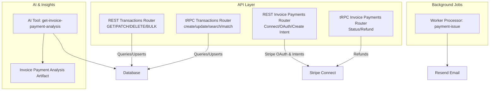
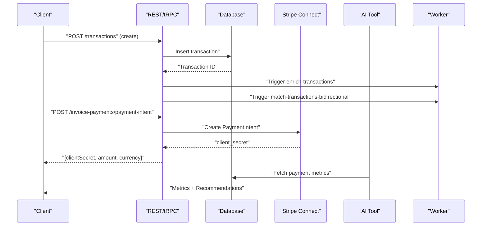
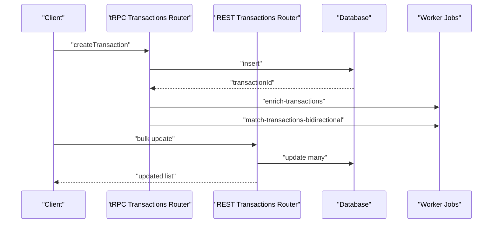
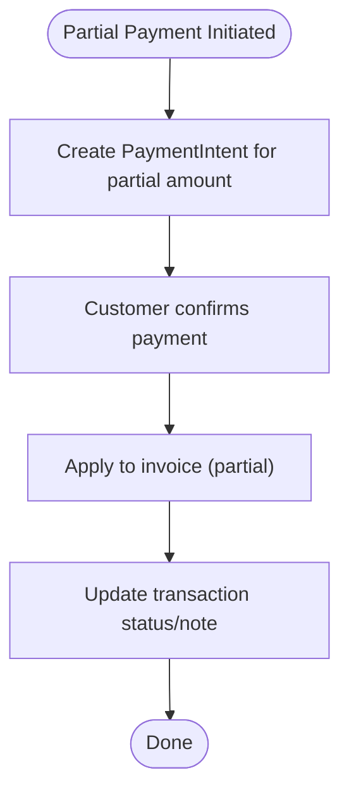
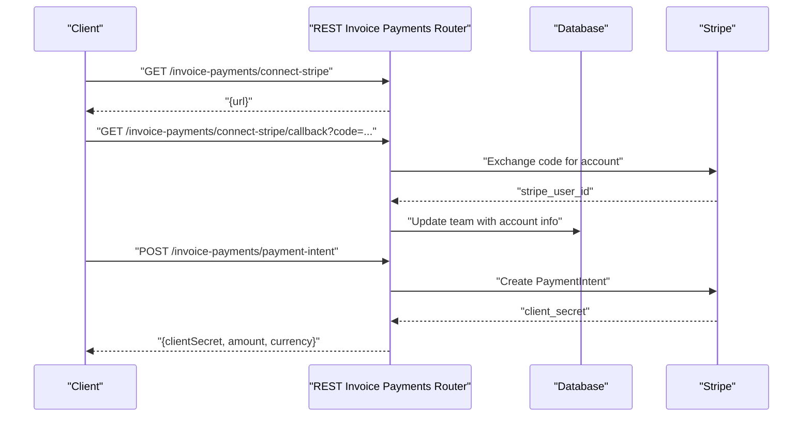
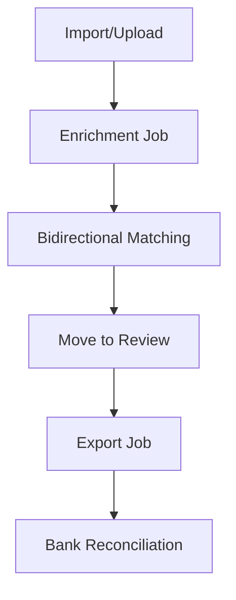
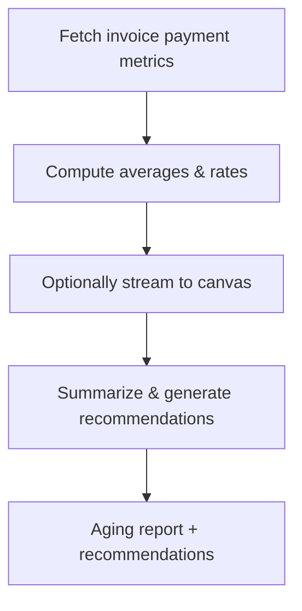
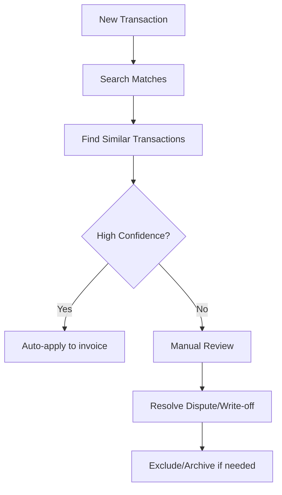
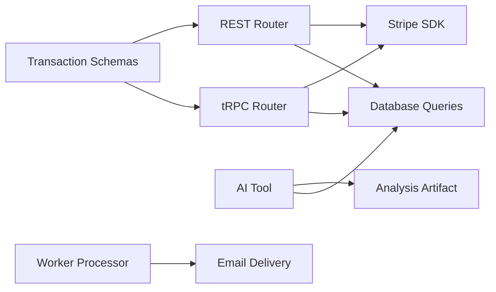

# Payment Tracking & Remittance

<cite>
**Referenced Files in This Document**
- [transactions.ts](file://apps/api/src/schemas/transactions.ts)
- [transactions.ts](file://apps/api/src/trpc/routers/transactions.ts)
- [transactions.ts](file://apps/api/src/rest/routers/transactions.ts)
- [invoice-payments.ts](file://apps/api/src/trpc/routers/invoice-payments.ts)
- [invoice-payments.ts](file://apps/api/src/rest/routers/invoice-payments.ts)
- [invoice-payment-analysis.ts](file://apps/api/src/ai/artifacts/invoice-payment-analysis.ts)
- [get-invoice-payment-analysis.ts](file://apps/api/src/ai/tools/get-invoice-payment-analysis.ts)
- [payment-issue.ts](file://apps/worker/src/processors/teams/payment-issue.ts)
- [config.ts](file://packages/app-store/src/stripe-payments/config.ts)
</cite>

## Table of Contents
1. [Introduction](#introduction)
2. [Project Structure](#project-structure)
3. [Core Components](#core-components)
4. [Architecture Overview](#architecture-overview)
5. [Detailed Component Analysis](#detailed-component-analysis)
6. [Dependency Analysis](#dependency-analysis)
7. [Performance Considerations](#performance-considerations)
8. [Troubleshooting Guide](#troubleshooting-guide)
9. [Conclusion](#conclusion)
10. [Appendices](#appendices)

## Introduction
This document explains how Midday tracks payments and manages remittances across imported transactions, invoice payments, and AI-driven cash flow insights. It covers:
- Recording payments and reconciling bank feeds
- Partial payments and credit applications
- Payment method integration (Stripe Connect)
- Bank reconciliation and cash flow tracking
- Automated matching and review workflows
- Dispute resolution and write-off procedures
- Aging reports and collection management
- AI-powered payment analysis and recommendations

## Project Structure
The payment and remittance domain spans API routes, transaction schemas, AI analysis tools, and background workers:
- Transaction ingestion and enrichment via REST and tRPC
- Bank account and transaction schemas
- Invoice payment orchestration via Stripe Connect
- AI analysis artifacts and tools for payment trends and recommendations
- Background job processor for payment issue notifications

**Diagram sources**
- [transactions.ts](file://apps/api/src/rest/routers/transactions.ts#L1-L489)
- [transactions.ts](file://apps/api/src/trpc/routers/transactions.ts#L1-L299)
- [invoice-payments.ts](file://apps/api/src/rest/routers/invoice-payments.ts#L1-L630)
- [invoice-payments.ts](file://apps/api/src/trpc/routers/invoice-payments.ts#L1-L194)
- [invoice-payment-analysis.ts](file://apps/api/src/ai/artifacts/invoice-payment-analysis.ts#L1-L71)
- [get-invoice-payment-analysis.ts](file://apps/api/src/ai/tools/get-invoice-payment-analysis.ts#L1-L276)
- [payment-issue.ts](file://apps/worker/src/processors/teams/payment-issue.ts#L1-L36)

**Section sources**
- [transactions.ts](file://apps/api/src/schemas/transactions.ts#L1-L938)
- [transactions.ts](file://apps/api/src/trpc/routers/transactions.ts#L1-L299)
- [transactions.ts](file://apps/api/src/rest/routers/transactions.ts#L1-L489)
- [invoice-payments.ts](file://apps/api/src/trpc/routers/invoice-payments.ts#L1-L194)
- [invoice-payments.ts](file://apps/api/src/rest/routers/invoice-payments.ts#L1-L630)
- [invoice-payment-analysis.ts](file://apps/api/src/ai/artifacts/invoice-payment-analysis.ts#L1-L71)
- [get-invoice-payment-analysis.ts](file://apps/api/src/ai/tools/get-invoice-payment-analysis.ts#L1-L276)
- [payment-issue.ts](file://apps/worker/src/processors/teams/payment-issue.ts#L1-L36)

## Core Components
- Transaction schemas define the canonical shape for income/expense records, including amounts, dates, categories, attachments, and status flags.
- REST and tRPC routers expose CRUD and batch operations, CSV mapping, and “move to review” workflows.
- Invoice payments integrate Stripe Connect for OAuth, payment intent creation, refunds, and status checks.
- AI analysis tool generates payment metrics, overdue summaries, and recommendations with optional visual canvas updates.
- Worker processor sends payment failure emails to customers.

**Section sources**
- [transactions.ts](file://apps/api/src/schemas/transactions.ts#L1-L938)
- [transactions.ts](file://apps/api/src/trpc/routers/transactions.ts#L1-L299)
- [transactions.ts](file://apps/api/src/rest/routers/transactions.ts#L1-L489)
- [invoice-payments.ts](file://apps/api/src/trpc/routers/invoice-payments.ts#L1-L194)
- [invoice-payments.ts](file://apps/api/src/rest/routers/invoice-payments.ts#L1-L630)
- [invoice-payment-analysis.ts](file://apps/api/src/ai/artifacts/invoice-payment-analysis.ts#L1-L71)
- [get-invoice-payment-analysis.ts](file://apps/api/src/ai/tools/get-invoice-payment-analysis.ts#L1-L276)
- [payment-issue.ts](file://apps/worker/src/processors/teams/payment-issue.ts#L1-L36)

## Architecture Overview
The system separates concerns across ingestion, enrichment, matching, export, and payment processing:
- Bank feeds and CSV uploads populate transactions; enrichment and bidirectional matching jobs run afterward.
- Invoice payments use Stripe Connect for secure, compliant payments and refunds.
- AI tools analyze historical invoice payment behavior and surface insights.

**Diagram sources**
- [transactions.ts](file://apps/api/src/trpc/routers/transactions.ts#L130-L159)
- [transactions.ts](file://apps/api/src/rest/routers/transactions.ts#L230-L265)
- [invoice-payments.ts](file://apps/api/src/rest/routers/invoice-payments.ts#L352-L575)
- [get-invoice-payment-analysis.ts](file://apps/api/src/ai/tools/get-invoice-payment-analysis.ts#L84-L136)

## Detailed Component Analysis

### Transaction Recording and Matching Workflow
- Create transactions via REST or tRPC; both persist to the database and trigger downstream jobs for enrichment and matching.
- Bulk operations support mass updates and deletions (manual-only).
- Search and similarity endpoints help identify matches against invoices or other transactions.

**Diagram sources**
- [transactions.ts](file://apps/api/src/trpc/routers/transactions.ts#L130-L159)
- [transactions.ts](file://apps/api/src/rest/routers/transactions.ts#L317-L362)

**Section sources**
- [transactions.ts](file://apps/api/src/trpc/routers/transactions.ts#L1-L299)
- [transactions.ts](file://apps/api/src/rest/routers/transactions.ts#L1-L489)
- [transactions.ts](file://apps/api/src/schemas/transactions.ts#L748-L800)

### Partial Payments and Credit Application
- Transactions represent individual line items; partial payments are modeled as multiple transactions against the same invoice.
- Use bulk update endpoints to apply credits or adjust amounts; status flags and notes can track partial fulfillment.
- For Stripe payments, PaymentIntents can be created with amounts derived from invoice totals; partial payments require separate intents or adjustments.

[No sources needed since this diagram shows conceptual workflow, not actual code structure]

**Section sources**
- [invoice-payments.ts](file://apps/api/src/rest/routers/invoice-payments.ts#L527-L575)
- [transactions.ts](file://apps/api/src/trpc/routers/transactions.ts#L95-L103)

### Payment Method Integration (Stripe Connect)
- Teams connect Stripe via OAuth; the router exposes endpoints to get a Connect URL, handle callbacks, disconnect, and refund payments.
- Payment intents are created on the connected account; idempotency keys prevent duplicates.
- Refund operations update invoice status and log outcomes.

**Diagram sources**
- [invoice-payments.ts](file://apps/api/src/rest/routers/invoice-payments.ts#L51-L119)
- [invoice-payments.ts](file://apps/api/src/rest/routers/invoice-payments.ts#L155-L262)
- [invoice-payments.ts](file://apps/api/src/rest/routers/invoice-payments.ts#L352-L575)

**Section sources**
- [invoice-payments.ts](file://apps/api/src/trpc/routers/invoice-payments.ts#L1-L194)
- [invoice-payments.ts](file://apps/api/src/rest/routers/invoice-payments.ts#L1-L630)
- [config.ts](file://packages/app-store/src/stripe-payments/config.ts#L1-L9)

### Bank Reconciliation and Cash Flow Tracking
- Transactions include bank account and connection metadata, enabling reconciliation views.
- Manual vs. imported flags distinguish user-entered entries from bank-synced data.
- Export jobs prepare data for external systems; “move to review” helps triage transactions awaiting export.

**Diagram sources**
- [transactions.ts](file://apps/api/src/trpc/routers/transactions.ts#L130-L181)

**Section sources**
- [transactions.ts](file://apps/api/src/schemas/transactions.ts#L354-L405)
- [transactions.ts](file://apps/api/src/trpc/routers/transactions.ts#L235-L248)

### Aging Reports and Collection Management
- AI tool computes average days to pay, payment rates, overdue counts, and scores; supports visual canvas updates.
- Overdue summary and recommendations can guide collection efforts.

**Diagram sources**
- [get-invoice-payment-analysis.ts](file://apps/api/src/ai/tools/get-invoice-payment-analysis.ts#L84-L136)
- [invoice-payment-analysis.ts](file://apps/api/src/ai/artifacts/invoice-payment-analysis.ts#L1-L71)

**Section sources**
- [get-invoice-payment-analysis.ts](file://apps/api/src/ai/tools/get-invoice-payment-analysis.ts#L1-L276)
- [invoice-payment-analysis.ts](file://apps/api/src/ai/artifacts/invoice-payment-analysis.ts#L1-L71)

### Automated Payment Matching and Dispute Resolution
- Similarity and search endpoints assist in auto-matching transactions to invoices.
- Disputes can be resolved by adjusting transaction status, adding notes, and excluding or archiving entries as needed.
- Write-offs are supported by status updates and tagging for audit trails.

**Diagram sources**
- [transactions.ts](file://apps/api/src/trpc/routers/transactions.ts#L105-L128)
- [transactions.ts](file://apps/api/src/schemas/transactions.ts#L669-L746)

**Section sources**
- [transactions.ts](file://apps/api/src/trpc/routers/transactions.ts#L105-L128)
- [transactions.ts](file://apps/api/src/schemas/transactions.ts#L669-L746)

### Practical Examples
- Recording a payment:
  - Use the REST create endpoint to insert a transaction with name, amount, date, and bank account.
  - Alternatively, use the tRPC create endpoint for programmatic integrations.
- Handling partial payments:
  - Create separate transactions for each partial amount; update statuses and notes accordingly.
  - For Stripe, create multiple PaymentIntents or adjust amounts on existing intents where allowed.
- Generating payment reports:
  - Run the AI tool to compute metrics and recommendations; optionally stream to the visual canvas.
- Managing overdue accounts:
  - Use AI insights to identify overdue patterns; apply collection actions and status updates.

**Section sources**
- [transactions.ts](file://apps/api/src/rest/routers/transactions.ts#L230-L265)
- [transactions.ts](file://apps/api/src/trpc/routers/transactions.ts#L130-L159)
- [invoice-payments.ts](file://apps/api/src/rest/routers/invoice-payments.ts#L527-L575)
- [get-invoice-payment-analysis.ts](file://apps/api/src/ai/tools/get-invoice-payment-analysis.ts#L218-L243)

## Dependency Analysis
- REST and tRPC routers depend on shared schemas and database queries.
- Invoice payments rely on Stripe SDK and team configuration.
- AI tool depends on database metrics and artifact streaming.
- Worker processor depends on email rendering and delivery service.

**Diagram sources**
- [transactions.ts](file://apps/api/src/schemas/transactions.ts#L1-L938)
- [transactions.ts](file://apps/api/src/trpc/routers/transactions.ts#L1-L299)
- [transactions.ts](file://apps/api/src/rest/routers/transactions.ts#L1-L489)
- [invoice-payments.ts](file://apps/api/src/rest/routers/invoice-payments.ts#L1-L630)
- [get-invoice-payment-analysis.ts](file://apps/api/src/ai/tools/get-invoice-payment-analysis.ts#L1-L276)
- [payment-issue.ts](file://apps/worker/src/processors/teams/payment-issue.ts#L1-L36)

**Section sources**
- [transactions.ts](file://apps/api/src/schemas/transactions.ts#L1-L938)
- [transactions.ts](file://apps/api/src/trpc/routers/transactions.ts#L1-L299)
- [transactions.ts](file://apps/api/src/rest/routers/transactions.ts#L1-L489)
- [invoice-payments.ts](file://apps/api/src/trpc/routers/invoice-payments.ts#L1-L194)
- [invoice-payments.ts](file://apps/api/src/rest/routers/invoice-payments.ts#L1-L630)
- [get-invoice-payment-analysis.ts](file://apps/api/src/ai/tools/get-invoice-payment-analysis.ts#L1-L276)
- [payment-issue.ts](file://apps/worker/src/processors/teams/payment-issue.ts#L1-L36)

## Performance Considerations
- Use pagination and filtering (date ranges, categories, statuses) to limit result sets.
- Prefer bulk endpoints for mass updates to reduce round trips.
- Leverage CSV mapping AI to speed up onboarding and reduce manual effort.
- Stream AI analysis to the UI progressively to improve perceived responsiveness.

[No sources needed since this section provides general guidance]

## Troubleshooting Guide
- Stripe Connect not configured:
  - Verify client ID and secret key environment variables; ensure the Connect URL endpoint returns a valid URL.
- Payment intent creation fails:
  - Check invoice status, template payment enablement, and amount validity; confirm idempotency keys are set.
- Refund errors:
  - Ensure the invoice is paid and has a payment intent; handle known Stripe error codes (e.g., already refunded).
- Transaction deletion blocked:
  - Only manually created transactions can be deleted; bank-imported transactions must be excluded or archived via status updates.
- Payment issue notifications:
  - Worker logs indicate successful dispatch; verify email provider credentials and recipient address.

**Section sources**
- [invoice-payments.ts](file://apps/api/src/rest/routers/invoice-payments.ts#L88-L93)
- [invoice-payments.ts](file://apps/api/src/rest/routers/invoice-payments.ts#L406-L431)
- [invoice-payments.ts](file://apps/api/src/rest/routers/invoice-payments.ts#L564-L574)
- [transactions.ts](file://apps/api/src/rest/routers/transactions.ts#L406-L450)
- [payment-issue.ts](file://apps/worker/src/processors/teams/payment-issue.ts#L10-L36)

## Conclusion
Midday’s payment tracking and remittance pipeline integrates transaction ingestion, AI-driven insights, and Stripe-powered payments. It supports partial payments, automated matching, aging analytics, and collection workflows while maintaining robust reconciliation and auditability through status flags, notes, and export-ready datasets.

[No sources needed since this section summarizes without analyzing specific files]

## Appendices

### API Endpoints Overview
- Transactions (REST):
  - GET /: list with filters
  - GET /{id}: get by ID
  - POST /{transactionId}/attachments/{attachmentId}/presigned-url: signed URL for attachments
  - POST /: create single
  - PATCH /{id}: update single
  - PATCH /bulk: bulk update
  - POST /bulk: bulk create
  - DELETE /bulk: bulk delete
  - DELETE /{id}: delete single
- Transactions (tRPC):
  - get, getById, update, updateMany, deleteMany, getSimilarTransactions, searchTransactionMatch, create, export, import, moveToReview, generateCsvMapping
- Invoice Payments (REST):
  - GET /connect-stripe, GET /connect-stripe/callback, POST /disconnect-stripe, POST /payment-intent, GET /stripe-status
- Invoice Payments (tRPC):
  - stripeStatus, getConnectUrl, disconnectStripe, refundPayment

**Section sources**
- [transactions.ts](file://apps/api/src/rest/routers/transactions.ts#L1-L489)
- [transactions.ts](file://apps/api/src/trpc/routers/transactions.ts#L1-L299)
- [invoice-payments.ts](file://apps/api/src/rest/routers/invoice-payments.ts#L1-L630)
- [invoice-payments.ts](file://apps/api/src/trpc/routers/invoice-payments.ts#L1-L194)