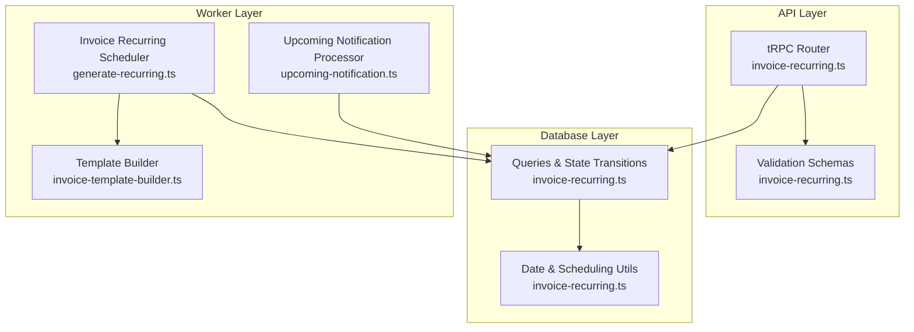
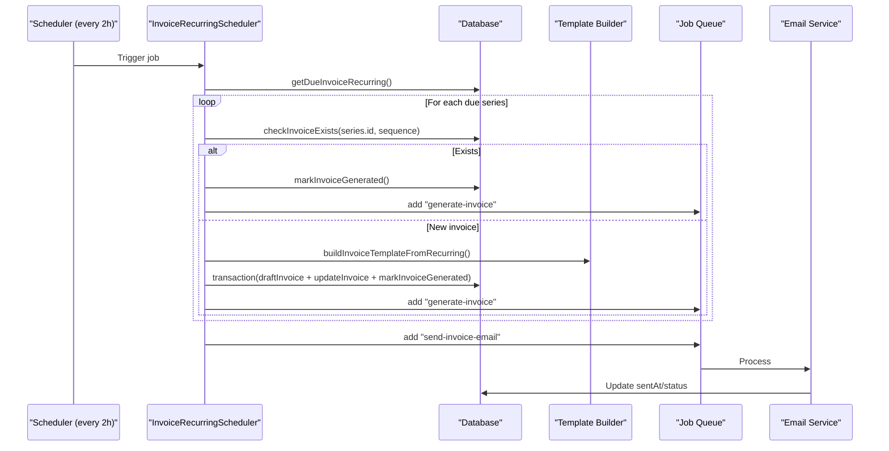
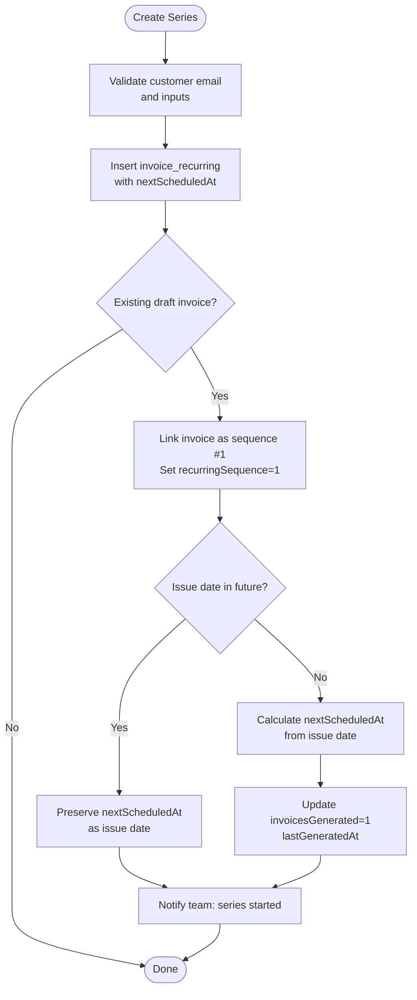
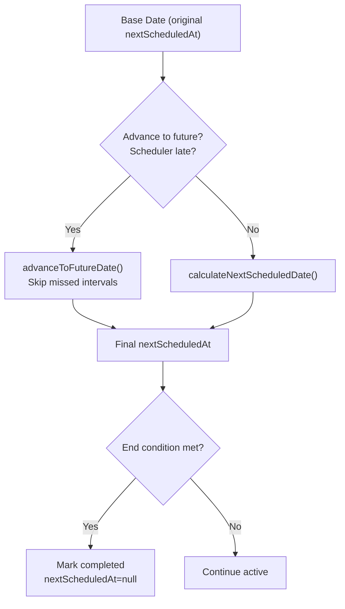
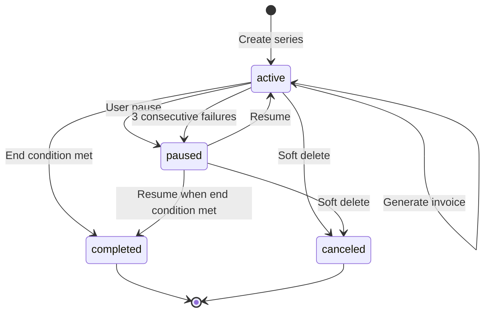
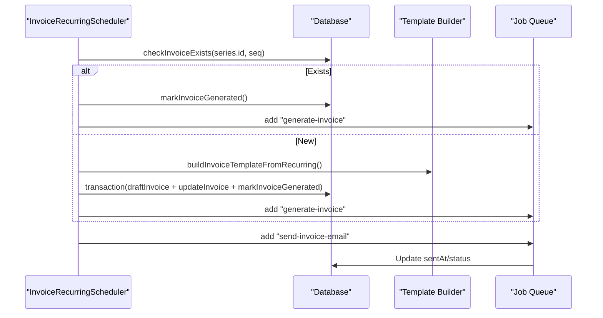
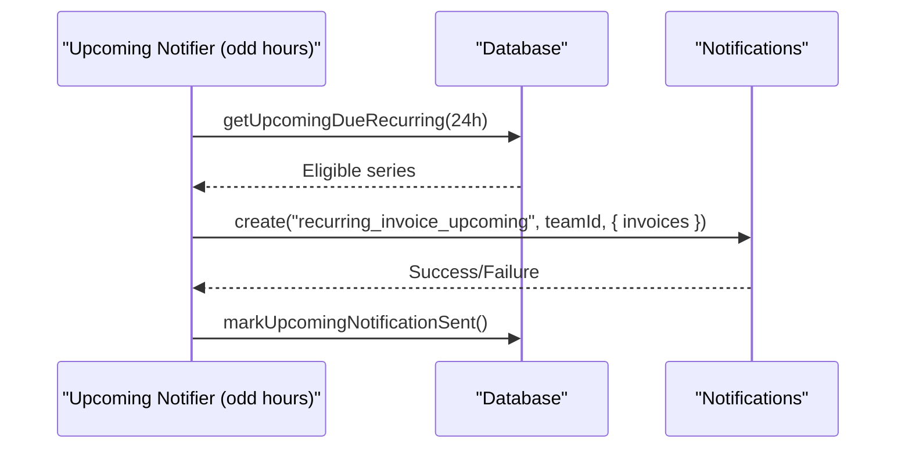
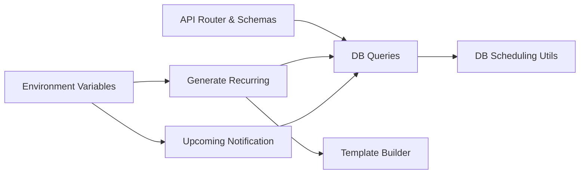

# Recurring Invoices

<cite>
**Referenced Files in This Document**
- [invoice-recurring.md](file://midday/docs/invoice-recurring.md)
- [invoice-recurring.ts](file://midday/apps/api/src/schemas/invoice-recurring.ts)
- [invoice-recurring.ts](file://midday/apps/api/src/trpc/routers/invoice-recurring.ts)
- [invoice-recurring.ts](file://midday/packages/db/src/queries/invoice-recurring.ts)
- [invoice-recurring.ts](file://midday/packages/db/src/utils/invoice-recurring.ts)
- [generate-recurring.ts](file://midday/apps/worker/src/processors/invoices/generate-recurring.ts)
- [upcoming-notification.ts](file://midday/apps/worker/src/processors/invoices/upcoming-notification.ts)
- [recurring.ts](file://midday/packages/invoice/src/utils/recurring.ts)
- [invoice-template-builder.ts](file://midday/apps/worker/src/utils/invoice-template-builder.ts)
</cite>

## Table of Contents
1. [Introduction](#introduction)
2. [Project Structure](#project-structure)
3. [Core Components](#core-components)
4. [Architecture Overview](#architecture-overview)
5. [Detailed Component Analysis](#detailed-component-analysis)
6. [Dependency Analysis](#dependency-analysis)
7. [Performance Considerations](#performance-considerations)
8. [Troubleshooting Guide](#troubleshooting-guide)
9. [Conclusion](#conclusion)
10. [Appendices](#appendices)

## Introduction
This document explains the recurring invoice functionality: how recurring series are created, scheduled, and automated; how billing cycles and date calculations work; how subscriptions and end conditions are managed; and how invoice generation, retries, and failure handling operate. It also covers administrative controls, API endpoints, and practical examples for setting up and managing recurring invoices.

## Project Structure
The recurring invoice system spans three layers:
- API layer: tRPC router and Zod schemas define the contract and validation for creating, updating, listing, pausing/resuming, and previewing recurring invoices.
- Database layer: queries and utilities implement persistence, scheduling logic, and state transitions.
- Worker layer: scheduled processors generate invoices, send notifications, and handle retries.

**Diagram sources**
- [invoice-recurring.ts](file://midday/apps/api/src/trpc/routers/invoice-recurring.ts#L32-L689)
- [invoice-recurring.ts](file://midday/apps/api/src/schemas/invoice-recurring.ts#L1-L767)
- [invoice-recurring.ts](file://midday/packages/db/src/queries/invoice-recurring.ts#L1-L1218)
- [invoice-recurring.ts](file://midday/packages/db/src/utils/invoice-recurring.ts#L1-L456)
- [generate-recurring.ts](file://midday/apps/worker/src/processors/invoices/generate-recurring.ts#L1-L566)
- [upcoming-notification.ts](file://midday/apps/worker/src/processors/invoices/upcoming-notification.ts#L1-L276)
- [invoice-template-builder.ts](file://midday/apps/worker/src/utils/invoice-template-builder.ts#L1-L285)

**Section sources**
- [invoice-recurring.md](file://midday/docs/invoice-recurring.md#L13-L55)

## Core Components
- Recurring series configuration and state: stored in the invoice_recurring table with fields for frequency, end conditions, timezone, due date offset, and counters.
- API surface: tRPC router with mutations and queries for create/update/delete/get/list/pause/resume/getUpcoming.
- Scheduling engine: server-side date calculations using timezone-aware utilities; batched processing with idempotency guarantees.
- Automation: two workers—one for generating invoices and another for sending upcoming notifications—both with kill switches and staging modes.

**Section sources**
- [invoice-recurring.md](file://midday/docs/invoice-recurring.md#L57-L124)
- [invoice-recurring.ts](file://midday/apps/api/src/trpc/routers/invoice-recurring.ts#L32-L689)
- [invoice-recurring.ts](file://midday/packages/db/src/queries/invoice-recurring.ts#L22-L149)
- [invoice-recurring.ts](file://midday/packages/db/src/utils/invoice-recurring.ts#L114-L244)

## Architecture Overview
The system uses a scheduler-driven model:
- A recurring scheduler runs periodically and finds due series.
- For each due series, it checks idempotency, creates a draft invoice, updates the series, and queues generation and email jobs.
- An upcoming notification scheduler runs offset from the generation scheduler to warn users about invoices due within 24 hours.

**Diagram sources**
- [generate-recurring.ts](file://midday/apps/worker/src/processors/invoices/generate-recurring.ts#L62-L566)
- [invoice-recurring.ts](file://midday/packages/db/src/queries/invoice-recurring.ts#L447-L506)
- [invoice-template-builder.ts](file://midday/apps/worker/src/utils/invoice-template-builder.ts#L102-L200)

**Section sources**
- [invoice-recurring.md](file://midday/docs/invoice-recurring.md#L174-L213)
- [generate-recurring.ts](file://midday/apps/worker/src/processors/invoices/generate-recurring.ts#L62-L566)

## Detailed Component Analysis

### API Endpoints and Business Logic
- Create: Validates customer email, constructs the series with first scheduled date, optionally links an existing draft invoice, and notifies the team.
- Update: Enforces cross-field validation (e.g., frequencyDay vs frequency, endType vs endDate/endCount), and customer email requirement when changing customer.
- Pause/Resume: Pauses active series and reverts scheduled invoices to draft; resume recalculates next date from now and resets failure counters.
- Delete: Soft deletes the series (status=canceled) and reverts any scheduled invoices back to draft.
- List/Get/Upcoming: CRUD and preview endpoints backed by database queries.

**Diagram sources**
- [invoice-recurring.ts](file://midday/apps/api/src/trpc/routers/invoice-recurring.ts#L33-L211)
- [invoice-recurring.ts](file://midday/packages/db/src/queries/invoice-recurring.ts#L58-L149)
- [invoice-recurring.ts](file://midday/packages/db/src/utils/invoice-recurring.ts#L272-L285)

**Section sources**
- [invoice-recurring.ts](file://midday/apps/api/src/trpc/routers/invoice-recurring.ts#L32-L689)
- [invoice-recurring.ts](file://midday/apps/api/src/schemas/invoice-recurring.ts#L35-L299)

### Scheduling and Date Calculations
- Frequency options: weekly, biweekly, monthly_date, monthly_weekday, monthly_last_day, quarterly, semi_annual, annual, custom.
- End conditions: never, on_date, after_count.
- Server-side calculation: timezone-aware date arithmetic using @date-fns/tz; ensures consistent scheduling across timezones.
- Batch limits: default batch size of 50 for generation and 100 for upcoming notifications to prevent overload.

**Diagram sources**
- [invoice-recurring.ts](file://midday/packages/db/src/utils/invoice-recurring.ts#L430-L455)
- [invoice-recurring.ts](file://midday/packages/db/src/utils/invoice-recurring.ts#L114-L244)
- [invoice-recurring.ts](file://midday/packages/db/src/queries/invoice-recurring.ts#L517-L587)

**Section sources**
- [invoice-recurring.md](file://midday/docs/invoice-recurring.md#L103-L124)
- [invoice-recurring.ts](file://midday/packages/db/src/utils/invoice-recurring.ts#L114-L244)
- [invoice-recurring.ts](file://midday/packages/db/src/queries/invoice-recurring.ts#L433-L506)

### State Machine and Transitions
- States: active, paused, completed, canceled.
- Transitions: creation sets active; successful generation keeps active; auto-pause occurs after 3 consecutive failures; manual pause/resume; end conditions lead to completion; deletion soft-cancels.

**Diagram sources**
- [invoice-recurring.md](file://midday/docs/invoice-recurring.md#L125-L158)
- [invoice-recurring.ts](file://midday/packages/db/src/queries/invoice-recurring.ts#L641-L735)
- [invoice-recurring.ts](file://midday/packages/db/src/queries/invoice-recurring.ts#L599-L636)

**Section sources**
- [invoice-recurring.md](file://midday/docs/invoice-recurring.md#L160-L173)
- [invoice-recurring.ts](file://midday/packages/db/src/queries/invoice-recurring.ts#L641-L735)

### Invoice Generation Workflow
- Idempotency: checkInvoiceExists prevents duplicates; transaction ensures atomicity of invoice creation and series update.
- Template building: buildInvoiceTemplateFromRecurring merges recurring settings with defaults.
- Job queuing: generate-invoice and send-invoice-email jobs are queued after successful database commit.
- Completion: when end conditions are met, series is marked completed and nextScheduledAt cleared.

**Diagram sources**
- [generate-recurring.ts](file://midday/apps/worker/src/processors/invoices/generate-recurring.ts#L176-L566)
- [invoice-template-builder.ts](file://midday/apps/worker/src/utils/invoice-template-builder.ts#L102-L200)
- [invoice-recurring.ts](file://midday/packages/db/src/queries/invoice-recurring.ts#L517-L587)

**Section sources**
- [generate-recurring.ts](file://midday/apps/worker/src/processors/invoices/generate-recurring.ts#L176-L566)
- [invoice-template-builder.ts](file://midday/apps/worker/src/utils/invoice-template-builder.ts#L102-L200)

### Upcoming Notifications
- Offset scheduler runs every 2 hours to detect invoices due within 24 hours.
- Groups notifications by team and marks each invoice’s upcoming_notification_sent_at to avoid duplicate notifications.
- Kill switch DISABLE_UPCOMING_NOTIFICATIONS=true disables notifications.

**Diagram sources**
- [upcoming-notification.ts](file://midday/apps/worker/src/processors/invoices/upcoming-notification.ts#L33-L276)
- [invoice-recurring.ts](file://midday/packages/db/src/queries/invoice-recurring.ts#L1-L1218)

**Section sources**
- [invoice-recurring.md](file://midday/docs/invoice-recurring.md#L261-L282)
- [upcoming-notification.ts](file://midday/apps/worker/src/processors/invoices/upcoming-notification.ts#L33-L276)

### Administrative Controls and Safety Mechanisms
- Kill switches:
  - DISABLE_RECURRING_INVOICES=true disables the recurring scheduler.
  - DISABLE_UPCOMING_NOTIFICATIONS=true disables upcoming notifications.
- Staging mode: logs planned actions without executing, simulating results.
- Batch limits: prevents system overload during peak due-date scenarios.
- Auto-pause: series pauses automatically after 3 consecutive failures; team is notified.

**Section sources**
- [generate-recurring.ts](file://midday/apps/worker/src/processors/invoices/generate-recurring.ts#L67-L79)
- [upcoming-notification.ts](file://midday/apps/worker/src/processors/invoices/upcoming-notification.ts#L37-L49)
- [invoice-recurring.ts](file://midday/packages/db/src/queries/invoice-recurring.ts#L599-L636)

### Practical Examples
- Setting up a recurring invoice:
  - Choose frequency (e.g., monthly_date on day 15), end condition (e.g., after_count=12), timezone, dueDateOffset.
  - Ensure customer has an email; create series; optionally link an existing draft invoice.
- Configuring billing schedules:
  - Weekly/biweekly: specify frequencyDay (0–6).
  - Monthly patterns: monthly_date (1–31), monthly_weekday (1st–5th occurrence), monthly_last_day.
  - Quarterly/Semi-annual/Annual: specify frequencyDay (1–31).
  - Custom: set frequencyInterval (days).
- Managing subscriptions:
  - Pause/resume to temporarily halt or restart billing.
  - Soft-delete to cancel without losing historical invoices.
- Handling payment failures:
  - Auto-pause after 3 failures; review and fix template/email; resume manually.

**Section sources**
- [invoice-recurring.md](file://midday/docs/invoice-recurring.md#L297-L336)
- [invoice-recurring.ts](file://midday/apps/api/src/schemas/invoice-recurring.ts#L52-L158)
- [invoice-recurring.ts](file://midday/apps/api/src/trpc/routers/invoice-recurring.ts#L569-L662)

## Dependency Analysis
The system exhibits clear separation of concerns:
- API schemas depend on shared constants/types from @midday/invoice/recurring.
- Database queries depend on scheduling utilities for accurate date calculations.
- Worker processors depend on database queries and template builder utilities.
- Both workers depend on environment variables for kill switches and staging detection.

**Diagram sources**
- [invoice-recurring.ts](file://midday/apps/api/src/schemas/invoice-recurring.ts#L1-L767)
- [invoice-recurring.ts](file://midday/apps/api/src/trpc/routers/invoice-recurring.ts#L1-L690)
- [invoice-recurring.ts](file://midday/packages/db/src/queries/invoice-recurring.ts#L1-L1218)
- [invoice-recurring.ts](file://midday/packages/db/src/utils/invoice-recurring.ts#L1-L456)
- [generate-recurring.ts](file://midday/apps/worker/src/processors/invoices/generate-recurring.ts#L1-L566)
- [upcoming-notification.ts](file://midday/apps/worker/src/processors/invoices/upcoming-notification.ts#L1-L276)
- [invoice-template-builder.ts](file://midday/apps/worker/src/utils/invoice-template-builder.ts#L1-L285)

**Section sources**
- [invoice-recurring.ts](file://midday/apps/api/src/schemas/invoice-recurring.ts#L1-L767)
- [invoice-recurring.ts](file://midday/packages/db/src/utils/invoice-recurring.ts#L11-L31)

## Performance Considerations
- Batched processing: default batch sizes balance throughput and resource usage.
- Idempotency: reduces wasted work and prevents duplicate invoices.
- Atomic transactions: minimize partial states and improve reliability.
- Timezone-aware calculations: avoid off-by-one errors and ensure predictable scheduling.

[No sources needed since this section provides general guidance]

## Troubleshooting Guide
Common issues and resolutions:
- Series not generating:
  - Check DISABLE_RECURRING_INVOICES environment variable.
  - Verify customer email exists; recurring invoices auto-send.
  - Confirm nextScheduledAt is in the past and status is active.
- Excessive failures:
  - Auto-pause occurs after 3 failures; inspect logs and fix template/email; resume manually.
- Duplicate invoices:
  - Idempotency checks prevent duplicates; investigate job queue issues if anomalies persist.
- Upcoming notifications not sent:
  - Check DISABLE_UPCOMING_NOTIFICATIONS environment variable.
  - Verify upcoming_notification_sent_at is not prematurely set.

**Section sources**
- [generate-recurring.ts](file://midday/apps/worker/src/processors/invoices/generate-recurring.ts#L67-L79)
- [invoice-recurring.ts](file://midday/packages/db/src/queries/invoice-recurring.ts#L599-L636)
- [upcoming-notification.ts](file://midday/apps/worker/src/processors/invoices/upcoming-notification.ts#L37-L49)

## Conclusion
The recurring invoice system combines robust scheduling, strict validation, and resilient automation. Its design emphasizes correctness (timezone-aware calculations), reliability (idempotency and transactions), and operability (kill switches, staging, and admin controls). Administrators can confidently configure billing cycles, monitor upcoming invoices, and recover from failures with minimal intervention.

[No sources needed since this section summarizes without analyzing specific files]

## Appendices

### API Endpoints Summary
- create: mutation to create a recurring series; supports linking an existing draft invoice.
- update: mutation to update series configuration with cross-field validation.
- delete: mutation to soft-cancel a series.
- get: query to fetch a series by ID.
- list: query to list series with pagination and filters.
- pause/resume: mutations to pause/resume active series.
- getUpcoming: query to preview upcoming invoices.

**Section sources**
- [invoice-recurring.md](file://midday/docs/invoice-recurring.md#L297-L311)
- [invoice-recurring.ts](file://midday/apps/api/src/trpc/routers/invoice-recurring.ts#L32-L689)

### Timezone and Date Handling
- Storage: UTC midnight timestamps for date-only fields.
- Display: TZDate for correct calendar rendering.
- Selection: localDateToUTCMidnight converts local midnight to UTC midnight.
- Server-side scheduling: calculateNextScheduledDate uses timezone-aware date-fns/tz.

**Section sources**
- [invoice-recurring.md](file://midday/docs/invoice-recurring.md#L337-L464)
- [recurring.ts](file://midday/packages/invoice/src/utils/recurring.ts#L14-L89)
- [invoice-recurring.ts](file://midday/packages/db/src/utils/invoice-recurring.ts#L114-L244)