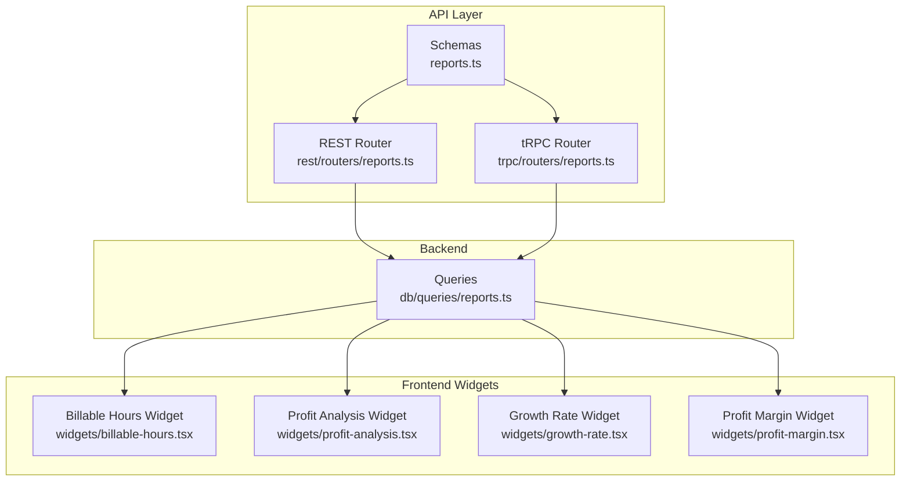
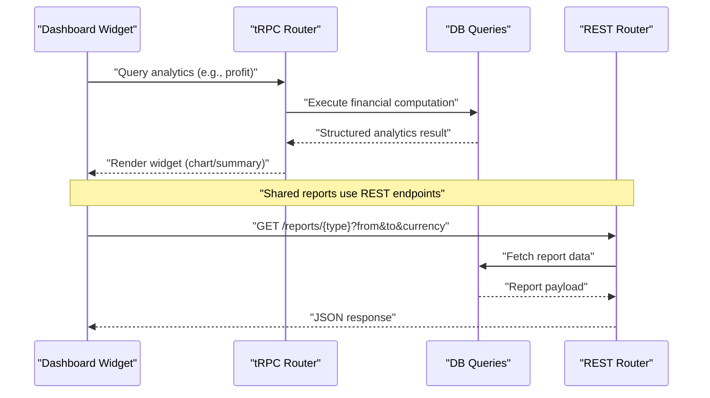
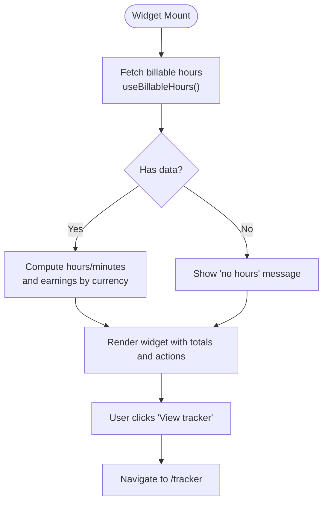
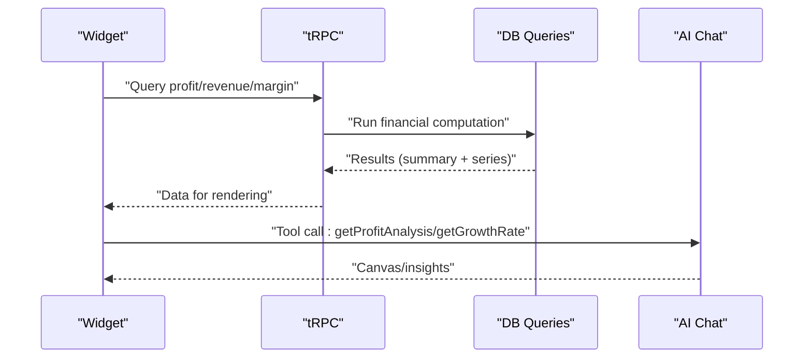
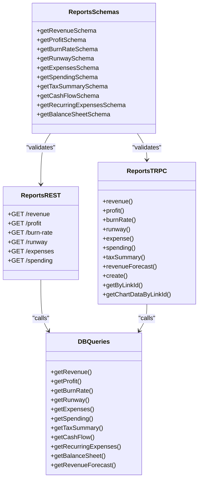
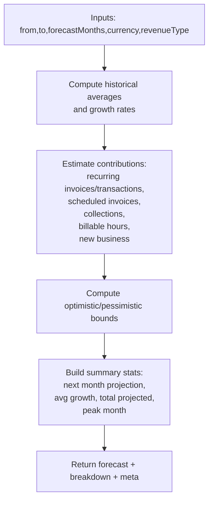
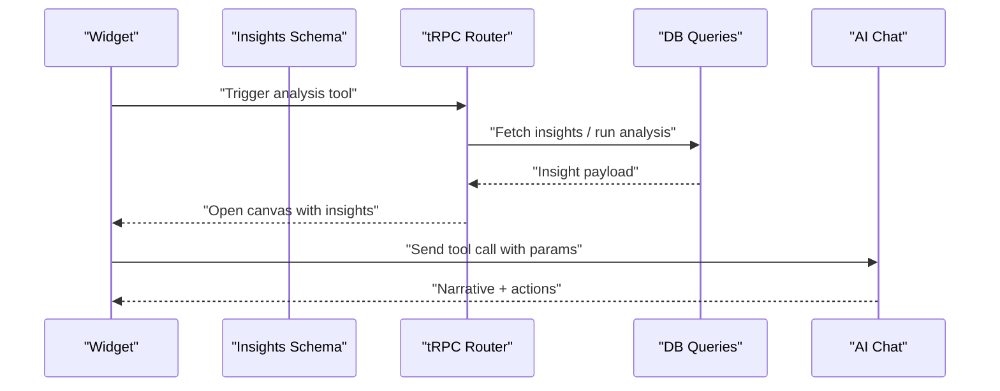
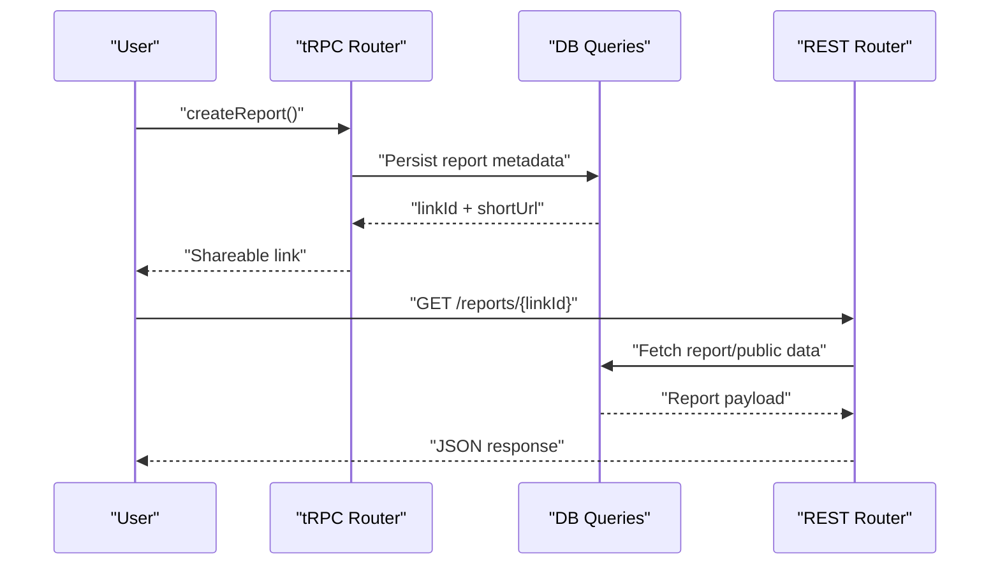
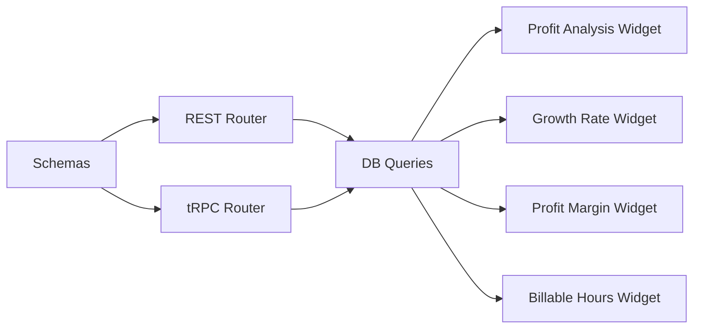

# Analytics & Reporting

<cite>
**Referenced Files in This Document**
- [reports.ts](file://midday/apps/api/src/schemas/reports.ts)
- [reports.ts](file://midday/apps/api/src/rest/routers/reports.ts)
- [reports.ts](file://midday/apps/api/src/trpc/routers/reports.ts)
- [reports.ts](file://midday/packages/db/src/queries/reports.ts)
- [insights.ts](file://midday/apps/api/src/schemas/insights.ts)
- [billable-hours.tsx](file://midday/apps/dashboard/src/components/widgets/billable-hours.tsx)
- [profit-analysis.tsx](file://midday/apps/dashboard/src/components/widgets/profit-analysis.tsx)
- [growth-rate.tsx](file://midday/apps/dashboard/src/components/widgets/growth-rate.tsx)
- [profit-margin.tsx](file://midday/apps/dashboard/src/components/widgets/profit-margin.tsx)
- [page.tsx](file://midday/apps/dashboard/src/app/[locale]/(app)/(sidebar)/tracker/page.tsx)
</cite>

## Table of Contents
1. [Introduction](#introduction)
2. [Project Structure](#project-structure)
3. [Core Components](#core-components)
4. [Architecture Overview](#architecture-overview)
5. [Detailed Component Analysis](#detailed-component-analysis)
6. [Dependency Analysis](#dependency-analysis)
7. [Performance Considerations](#performance-considerations)
8. [Troubleshooting Guide](#troubleshooting-guide)
9. [Conclusion](#conclusion)
10. [Appendices](#appendices)

## Introduction
This document explains Faworra’s analytics and reporting capabilities with a focus on time tracking analytics, dashboard widgets, financial metrics, forecasting, and shared report features. It covers:
- Time tracking widgets and billable hours analytics
- Dashboard widgets for revenue, profit, growth rate, and profit margin
- Financial metrics: revenue, profit, burn rate, runway, expenses, spending, taxes, cash flow, recurring expenses, balance sheet
- Revenue forecasting with confidence bands and breakdown
- Profitability and margin calculations
- Custom report creation, sharing, and public access
- Team and individual productivity insights
- Trend analysis, benchmarking, and AI-powered insights

## Project Structure
Faworra’s analytics stack spans API schemas, REST and tRPC routes, backend database queries, and frontend widgets:
- API schemas define request/response contracts for reports and insights
- REST and tRPC routers expose endpoints for analytics and shared reports
- Database queries implement financial calculations and forecasting
- Dashboard widgets consume analytics via tRPC and render charts and summaries

**Diagram sources**
- [reports.ts](file://midday/apps/api/src/schemas/reports.ts#L1-L776)
- [reports.ts](file://midday/apps/api/src/rest/routers/reports.ts#L1-L272)
- [reports.ts](file://midday/apps/api/src/trpc/routers/reports.ts#L1-L187)
- [reports.ts](file://midday/packages/db/src/queries/reports.ts#L1-L800)
- [billable-hours.tsx](file://midday/apps/dashboard/src/components/widgets/billable-hours.tsx#L1-L92)
- [profit-analysis.tsx](file://midday/apps/dashboard/src/components/widgets/profit-analysis.tsx#L1-L154)
- [growth-rate.tsx](file://midday/apps/dashboard/src/components/widgets/growth-rate.tsx#L1-L110)
- [profit-margin.tsx](file://midday/apps/dashboard/src/components/widgets/profit-margin.tsx#L1-L103)

**Section sources**
- [reports.ts](file://midday/apps/api/src/schemas/reports.ts#L1-L776)
- [reports.ts](file://midday/apps/api/src/rest/routers/reports.ts#L1-L272)
- [reports.ts](file://midday/apps/api/src/trpc/routers/reports.ts#L1-L187)
- [reports.ts](file://midday/packages/db/src/queries/reports.ts#L1-L800)
- [billable-hours.tsx](file://midday/apps/dashboard/src/components/widgets/billable-hours.tsx#L1-L92)
- [profit-analysis.tsx](file://midday/apps/dashboard/src/components/widgets/profit-analysis.tsx#L1-L154)
- [growth-rate.tsx](file://midday/apps/dashboard/src/components/widgets/growth-rate.tsx#L1-L110)
- [profit-margin.tsx](file://midday/apps/dashboard/src/components/widgets/profit-margin.tsx#L1-L103)

## Core Components
- Analytics schemas: Define inputs and outputs for revenue, profit, burn rate, runway, expenses, spending, tax summary, growth rate, profit margin, cash flow, recurring expenses, balance sheet, and revenue forecasting.
- REST and tRPC routers: Expose endpoints for retrieving analytics and managing shared reports.
- Database queries: Implement financial computations, currency conversions, forecasting, and data aggregation.
- Dashboard widgets: Render analytics in the UI with charts and summaries, and integrate with AI insights.

Examples of key capabilities:
- Revenue and profit over time with comparative percentages
- Burn rate and runway projections
- Expense and spending breakdowns
- Tax summaries by category and type
- Growth rate and profit margin
- Revenue forecasting with confidence intervals and breakdown
- Shared report creation and public access

**Section sources**
- [reports.ts](file://midday/apps/api/src/schemas/reports.ts#L1-L776)
- [reports.ts](file://midday/apps/api/src/rest/routers/reports.ts#L1-L272)
- [reports.ts](file://midday/apps/api/src/trpc/routers/reports.ts#L1-L187)
- [reports.ts](file://midday/packages/db/src/queries/reports.ts#L140-L611)

## Architecture Overview
The analytics pipeline connects frontend widgets to backend analytics via tRPC, with REST endpoints for legacy integrations and shared report access. Database queries compute financial metrics and forecasts.

**Diagram sources**
- [reports.ts](file://midday/apps/api/src/trpc/routers/reports.ts#L38-L186)
- [reports.ts](file://midday/apps/api/src/rest/routers/reports.ts#L29-L269)
- [reports.ts](file://midday/packages/db/src/queries/reports.ts#L517-L611)

## Detailed Component Analysis

### Time Tracking Analytics and Billable Hours
- Widget: Billable Hours displays total tracked duration and earnings per currency for the selected period, with navigation to the tracker.
- Backend: Billable hours are aggregated and earnings computed per currency; the widget polls for updates.

**Diagram sources**
- [billable-hours.tsx](file://midday/apps/dashboard/src/components/widgets/billable-hours.tsx#L12-L91)
- [page.tsx](file://midday/apps/dashboard/src/app/[locale]/(app)/(sidebar)/tracker/page.tsx)

**Section sources**
- [billable-hours.tsx](file://midday/apps/dashboard/src/components/widgets/billable-hours.tsx#L1-L92)
- [page.tsx](file://midday/apps/dashboard/src/app/[locale]/(app)/(sidebar)/tracker/page.tsx)

### Dashboard Widgets: Revenue, Profit, Growth, and Margin
- Profit Analysis Widget: Renders a bar chart of profit over the last 12 months and triggers AI analysis via tool calls.
- Growth Rate Widget: Shows quarterly growth rate and opens an AI-driven analysis.
- Profit Margin Widget: Displays profit margin and opens an analysis view.

**Diagram sources**
- [profit-analysis.tsx](file://midday/apps/dashboard/src/components/widgets/profit-analysis.tsx#L25-L153)
- [growth-rate.tsx](file://midday/apps/dashboard/src/components/widgets/growth-rate.tsx#L12-L109)
- [profit-margin.tsx](file://midday/apps/dashboard/src/components/widgets/profit-margin.tsx#L12-L102)
- [reports.ts](file://midday/packages/db/src/queries/reports.ts#L517-L611)

**Section sources**
- [profit-analysis.tsx](file://midday/apps/dashboard/src/components/widgets/profit-analysis.tsx#L1-L154)
- [growth-rate.tsx](file://midday/apps/dashboard/src/components/widgets/growth-rate.tsx#L1-L110)
- [profit-margin.tsx](file://midday/apps/dashboard/src/components/widgets/profit-margin.tsx#L1-L103)

### Financial Metrics APIs
- Revenue: Monthly revenue series with gross vs net options and comparative summary.
- Profit: Monthly profit series supporting gross and net profit margins.
- Burn Rate: Monthly cash outflow for runway modeling.
- Runway: Remaining months based on current burn rate and cash balances.
- Expenses: Monthly expenses with average and recurring breakdowns.
- Spending: Category-wise spending distribution.
- Tax Summary: Paid vs collected taxes by category and type.
- Cash Flow: Monthly cash flow aggregates.
- Recurring Expenses: Recurring expense analysis.
- Balance Sheet: As-of-date balance sheet.

**Diagram sources**
- [reports.ts](file://midday/apps/api/src/schemas/reports.ts#L1-L776)
- [reports.ts](file://midday/apps/api/src/rest/routers/reports.ts#L29-L269)
- [reports.ts](file://midday/apps/api/src/trpc/routers/reports.ts#L38-L186)
- [reports.ts](file://midday/packages/db/src/queries/reports.ts#L140-L776)

**Section sources**
- [reports.ts](file://midday/apps/api/src/schemas/reports.ts#L1-L776)
- [reports.ts](file://midday/apps/api/src/rest/routers/reports.ts#L1-L272)
- [reports.ts](file://midday/apps/api/src/trpc/routers/reports.ts#L1-L187)
- [reports.ts](file://midday/packages/db/src/queries/reports.ts#L140-L776)

### Revenue Forecasting
- Inputs: Historical period, forecast months, currency, revenue type.
- Outputs: Next month projection, average monthly growth, total projected revenue, peak month, confidence bands, and a breakdown of contributions (recurring invoices, scheduled invoices, collections, billable hours, new business).
- Methodology: Bottom-up forecasting with confidence scores and warnings.

**Diagram sources**
- [reports.ts](file://midday/apps/api/src/schemas/reports.ts#L420-L611)
- [reports.ts](file://midday/packages/db/src/queries/reports.ts#L517-L611)

**Section sources**
- [reports.ts](file://midday/apps/api/src/schemas/reports.ts#L420-L611)
- [reports.ts](file://midday/packages/db/src/queries/reports.ts#L517-L611)

### Insights and AI-Powered Analysis
- Insights: Paginated retrieval, latest, by period, audio URL, mark as read, dismiss.
- Widgets integrate with AI chat to trigger analysis tool calls for deeper insights.

**Diagram sources**
- [insights.ts](file://midday/apps/api/src/schemas/insights.ts#L1-L290)
- [profit-analysis.tsx](file://midday/apps/dashboard/src/components/widgets/profit-analysis.tsx#L53-L89)

**Section sources**
- [insights.ts](file://midday/apps/api/src/schemas/insights.ts#L1-L290)
- [profit-analysis.tsx](file://midday/apps/dashboard/src/components/widgets/profit-analysis.tsx#L1-L154)

### Shared Reports and Public Access
- Create a report with type, date range, currency, and optional expiration.
- Retrieve report by link ID or chart data by link ID.
- Public procedures allow access without authentication.

**Diagram sources**
- [reports.ts](file://midday/apps/api/src/trpc/routers/reports.ts#L134-L151)
- [reports.ts](file://midday/apps/api/src/trpc/routers/reports.ts#L153-L185)
- [reports.ts](file://midday/apps/api/src/rest/routers/reports.ts#L29-L269)

**Section sources**
- [reports.ts](file://midday/apps/api/src/trpc/routers/reports.ts#L134-L185)
- [reports.ts](file://midday/apps/api/src/rest/routers/reports.ts#L29-L269)

## Dependency Analysis
- Schemas define strict contracts for all analytics endpoints.
- REST and tRPC routers depend on database queries for computations.
- Frontend widgets depend on tRPC for live data and on AI chat for contextual analysis.
- Currency handling and caching reduce repeated DB calls for team base currency and COGS slugs.

**Diagram sources**
- [reports.ts](file://midday/apps/api/src/schemas/reports.ts#L1-L776)
- [reports.ts](file://midday/apps/api/src/rest/routers/reports.ts#L1-L272)
- [reports.ts](file://midday/apps/api/src/trpc/routers/reports.ts#L1-L187)
- [reports.ts](file://midday/packages/db/src/queries/reports.ts#L1-L800)
- [profit-analysis.tsx](file://midday/apps/dashboard/src/components/widgets/profit-analysis.tsx#L1-L154)
- [growth-rate.tsx](file://midday/apps/dashboard/src/components/widgets/growth-rate.tsx#L1-L110)
- [profit-margin.tsx](file://midday/apps/dashboard/src/components/widgets/profit-margin.tsx#L1-L103)
- [billable-hours.tsx](file://midday/apps/dashboard/src/components/widgets/billable-hours.tsx#L1-L92)

**Section sources**
- [reports.ts](file://midday/apps/api/src/schemas/reports.ts#L1-L776)
- [reports.ts](file://midday/apps/api/src/rest/routers/reports.ts#L1-L272)
- [reports.ts](file://midday/apps/api/src/trpc/routers/reports.ts#L1-L187)
- [reports.ts](file://midday/packages/db/src/queries/reports.ts#L1-L800)

## Performance Considerations
- Caching: Team base currency and COGS slugs are cached with TTL to minimize DB queries.
- Parallelization: Independent computations (e.g., revenue, COGS, operating expenses) run concurrently.
- Aggregation: Monthly series are generated and joined via maps for O(n) lookups.
- Currency conversion: Uses base amounts when available; falls back to original amounts when converted amounts are missing.
- Polling: Widgets poll at configured intervals to keep data fresh without over-fetching.

[No sources needed since this section provides general guidance]

## Troubleshooting Guide
Common issues and resolutions:
- Invalid report type: Thrown when a shared report type is unsupported; ensure the type is one of the supported report types.
- Report not found or expired: Public access attempts return appropriate errors when the link is invalid or expired.
- Currency mismatch: Ensure the requested currency aligns with team base currency and available exchange data.
- Missing converted amounts: Some transactions may lack base amounts; queries handle NULLs appropriately.

**Section sources**
- [reports.ts](file://midday/apps/api/src/trpc/routers/reports.ts#L159-L185)
- [reports.ts](file://midday/packages/db/src/queries/reports.ts#L114-L138)

## Conclusion
Faworra’s analytics and reporting system combines robust financial computations, flexible forecasting, and intuitive dashboard widgets. Time tracking integrates with billable hours analytics, while shared reports and AI-powered insights enhance collaboration and decision-making. The modular architecture supports extensibility for team and project-level analytics.

[No sources needed since this section summarizes without analyzing specific files]

## Appendices

### Example Workflows
- Generate a profit analysis widget:
  - Select date range and revenue type (gross/net)
  - tRPC fetches monthly profit series
  - Widget renders a bar chart and summary
  - Optional: trigger AI analysis via tool call
- Create a shared revenue forecast:
  - Set from/to, forecast months, currency, revenue type
  - tRPC persists report metadata and returns a shareable link
  - REST endpoint serves public access to report data

[No sources needed since this section provides general guidance]