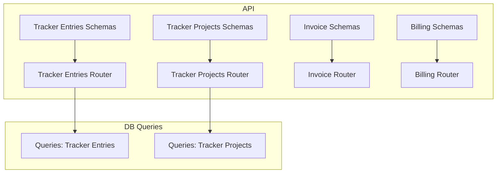
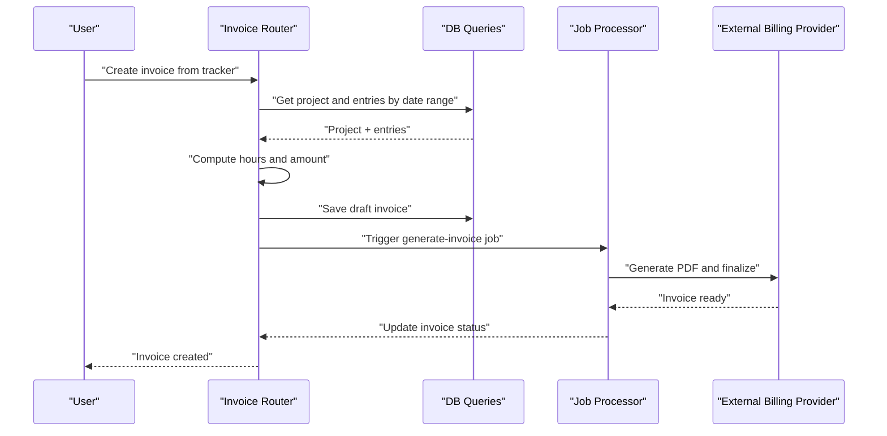
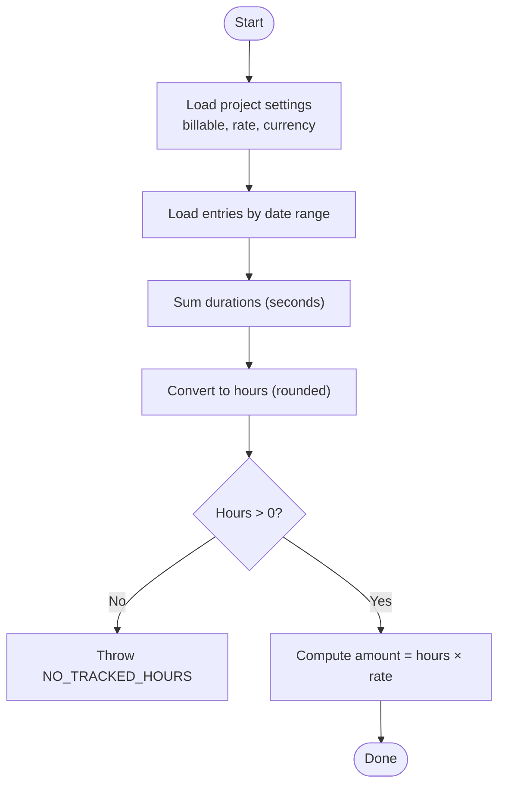
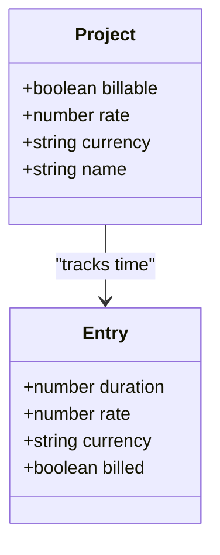
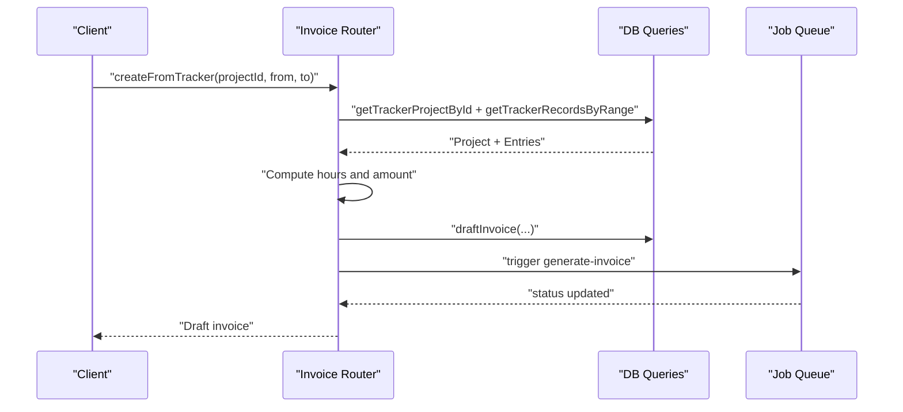
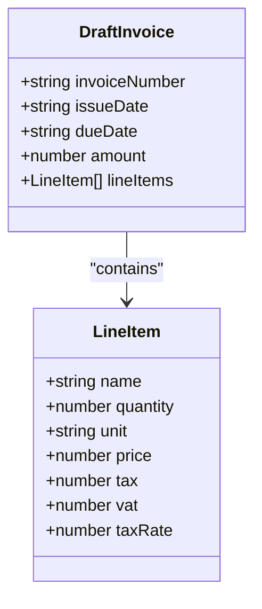
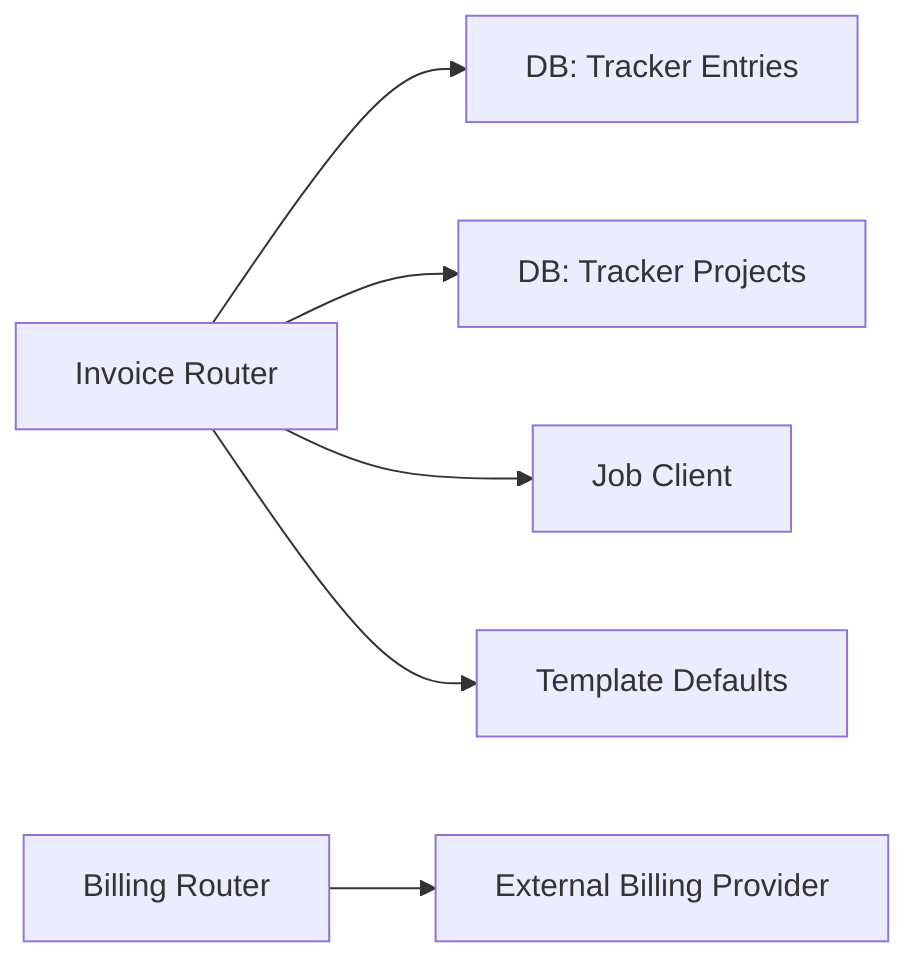

# Billing & Invoicing Integration

<cite>
**Referenced Files in This Document**
- [billing.ts](file://midday/apps/api/src/schemas/billing.ts)
- [billing.ts](file://midday/apps/api/src/trpc/routers/billing.ts)
- [invoice.ts](file://midday/apps/api/src/schemas/invoice.ts)
- [invoice.ts](file://midday/apps/api/src/trpc/routers/invoice.ts)
- [tracker-entries.ts](file://midday/apps/api/src/schemas/tracker-entries.ts)
- [tracker-projects.ts](file://midday/apps/api/src/schemas/tracker-projects.ts)
- [invoices.ts](file://midday/apps/api/src/rest/routers/invoices.ts)
- [invoice-payments.ts](file://midday/apps/api/src/trpc/routers/invoice-payments.ts)
- [invoice-products.ts](file://midday/apps/api/src/trpc/routers/invoice-products.ts)
- [invoice-recurring.ts](file://midday/apps/api/src/trpc/routers/invoice-recurring.ts)
- [invoice-template.ts](file://midday/apps/api/src/trpc/routers/invoice-template.ts)
- [tracker-entries.ts](file://midday/apps/api/src/trpc/routers/tracker-entries.ts)
- [tracker-projects.ts](file://midday/apps/api/src/trpc/routers/tracker-projects.ts)
- [tracker-entries.ts](file://midday/packages/db/src/queries/tracker-entries.ts)
- [tracker-projects.ts](file://midday/packages/db/src/queries/tracker-projects.ts)
- [invoices.ts](file://midday/apps/api/src/__tests__/routers/invoices.test.ts)
- [invoice.ts](file://midday/apps/api/src/__tests__/factories/invoice.ts)
</cite>

## Table of Contents
1. [Introduction](#introduction)
2. [Project Structure](#project-structure)
3. [Core Components](#core-components)
4. [Architecture Overview](#architecture-overview)
5. [Detailed Component Analysis](#detailed-component-analysis)
6. [Dependency Analysis](#dependency-analysis)
7. [Performance Considerations](#performance-considerations)
8. [Troubleshooting Guide](#troubleshooting-guide)
9. [Conclusion](#conclusion)
10. [Appendices](#appendices)

## Introduction
This document explains Faworra’s billing and invoicing integration with time tracking. It covers how tracked time is transformed into billable hours, how hourly rates and billing configurations are managed, and how automated invoices are generated. It also documents invoice templates, line item formatting, billing cycles, payment tracking, and reporting capabilities such as revenue and profitability analysis.

## Project Structure
The billing and invoicing system spans the API application and database queries:
- Time tracking schemas and routers define how tracked time is recorded and queried.
- Invoice schemas and routers define invoice creation, templates, payments, and recurring billing.
- Billing router integrates with an external subscription/invoice provider via typed procedures.
- Database queries underpin retrieval and aggregation of tracker entries and projects.

**Diagram sources**
- [tracker-entries.ts](file://midday/apps/api/src/schemas/tracker-entries.ts#L1-L409)
- [tracker-projects.ts](file://midday/apps/api/src/schemas/tracker-projects.ts#L1-L314)
- [invoice.ts](file://midday/apps/api/src/schemas/invoice.ts#L1-L1502)
- [billing.ts](file://midday/apps/api/src/schemas/billing.ts#L1-L37)
- [tracker-entries.ts](file://midday/apps/api/src/trpc/routers/tracker-entries.ts)
- [tracker-projects.ts](file://midday/apps/api/src/trpc/routers/tracker-projects.ts)
- [invoice.ts](file://midday/apps/api/src/trpc/routers/invoice.ts#L1-L812)
- [billing.ts](file://midday/apps/api/src/trpc/routers/billing.ts#L1-L331)
- [tracker-entries.ts](file://midday/packages/db/src/queries/tracker-entries.ts)
- [tracker-projects.ts](file://midday/packages/db/src/queries/tracker-projects.ts)

**Section sources**
- [tracker-entries.ts](file://midday/apps/api/src/schemas/tracker-entries.ts#L1-L409)
- [tracker-projects.ts](file://midday/apps/api/src/schemas/tracker-projects.ts#L1-L314)
- [invoice.ts](file://midday/apps/api/src/schemas/invoice.ts#L1-L1502)
- [billing.ts](file://midday/apps/api/src/schemas/billing.ts#L1-L37)
- [tracker-entries.ts](file://midday/apps/api/src/trpc/routers/tracker-entries.ts)
- [tracker-projects.ts](file://midday/apps/api/src/trpc/routers/tracker-projects.ts)
- [invoice.ts](file://midday/apps/api/src/trpc/routers/invoice.ts#L1-L812)
- [billing.ts](file://midday/apps/api/src/trpc/routers/billing.ts#L1-L331)
- [tracker-entries.ts](file://midday/packages/db/src/queries/tracker-entries.ts)
- [tracker-projects.ts](file://midday/packages/db/src/queries/tracker-projects.ts)

## Core Components
- Time tracking:
  - Entry schema defines start/stop/duration and optional assignment to a project and user.
  - Project schema defines billable flag, hourly rate, currency, and customer association.
- Invoice system:
  - Templates define labels, layout, taxes, and delivery options.
  - Line items capture quantity, unit, price, and tax/vat.
  - Invoice router supports creation from tracker data, scheduling, reminders, and reporting.
- Billing integration:
  - Subscription checkout, orders, invoice retrieval, status checks, and cancellation are exposed via typed procedures.

Key capabilities:
- Billable hours calculation from tracked time.
- Hourly rate management per project and per entry.
- Automated invoice generation from time ranges.
- Line item formatting with date ranges and units.
- Invoice templates and payment terms.
- Payment tracking and reporting.

**Section sources**
- [tracker-entries.ts](file://midday/apps/api/src/schemas/tracker-entries.ts#L1-L409)
- [tracker-projects.ts](file://midday/apps/api/src/schemas/tracker-projects.ts#L1-L314)
- [invoice.ts](file://midday/apps/api/src/schemas/invoice.ts#L1-L1502)
- [invoice.ts](file://midday/apps/api/src/trpc/routers/invoice.ts#L126-L277)
- [billing.ts](file://midday/apps/api/src/trpc/routers/billing.ts#L17-L105)

## Architecture Overview
The system orchestrates time tracking and invoicing through typed procedures and database queries. Automated workflows trigger invoice generation and scheduling, while templates and payment settings govern invoice presentation and collection.

**Diagram sources**
- [invoice.ts](file://midday/apps/api/src/trpc/routers/invoice.ts#L126-L277)
- [tracker-entries.ts](file://midday/packages/db/src/queries/tracker-entries.ts)
- [tracker-projects.ts](file://midday/packages/db/src/queries/tracker-projects.ts)

## Detailed Component Analysis

### Time Tracking and Billable Hours
- Project-level configuration:
  - billable flag determines whether time can be invoiced.
  - rate and currency define the pricing model for the project.
- Entry-level configuration:
  - duration is accumulated in seconds and converted to decimal hours.
  - Each entry can carry an applied rate and currency.
- Calculation:
  - Total tracked seconds are summed per project and converted to hours.
  - Amount equals total hours × project rate.

**Diagram sources**
- [invoice.ts](file://midday/apps/api/src/trpc/routers/invoice.ts#L126-L184)
- [tracker-entries.ts](file://midday/apps/api/src/schemas/tracker-entries.ts#L13-L40)
- [tracker-projects.ts](file://midday/apps/api/src/schemas/tracker-projects.ts#L132-L143)

**Section sources**
- [tracker-entries.ts](file://midday/apps/api/src/schemas/tracker-entries.ts#L1-L409)
- [tracker-projects.ts](file://midday/apps/api/src/schemas/tracker-projects.ts#L1-L314)
- [invoice.ts](file://midday/apps/api/src/trpc/routers/invoice.ts#L126-L184)

### Hourly Rate Management and Billing Rate Configuration
- Per-project rates:
  - rate and currency configured at the project level.
  - Used when generating invoices from tracker data.
- Per-entry rates:
  - entries include an optional rate and currency for override scenarios.
- Currency handling:
  - Project currency or team base currency is used for invoice currency.
- Validation:
  - Project must be billable and must have a positive rate.

**Diagram sources**
- [tracker-projects.ts](file://midday/apps/api/src/schemas/tracker-projects.ts#L132-L143)
- [tracker-entries.ts](file://midday/apps/api/src/schemas/tracker-entries.ts#L160-L171)

**Section sources**
- [tracker-projects.ts](file://midday/apps/api/src/schemas/tracker-projects.ts#L132-L143)
- [tracker-entries.ts](file://midday/apps/api/src/schemas/tracker-entries.ts#L160-L171)
- [invoice.ts](file://midday/apps/api/src/trpc/routers/invoice.ts#L155-L169)

### Automated Invoice Generation from Tracked Time
- Endpoint: create invoice from tracker.
- Steps:
  - Validate project is billable and has a rate.
  - Sum tracked seconds and compute hours.
  - Build line item with date range description and hours as quantity.
  - Apply template defaults and payment terms.
  - Save draft invoice and optionally schedule generation.

**Diagram sources**
- [invoice.ts](file://midday/apps/api/src/trpc/routers/invoice.ts#L126-L277)
- [tracker-entries.ts](file://midday/packages/db/src/queries/tracker-entries.ts)
- [tracker-projects.ts](file://midday/packages/db/src/queries/tracker-projects.ts)

**Section sources**
- [invoice.ts](file://midday/apps/api/src/trpc/routers/invoice.ts#L126-L277)

### Invoice Item Creation and Line Item Formatting
- Line item schema supports:
  - name/description (TipTap JSON content).
  - quantity (hours), unit (e.g., hours).
  - price (rate), tax/vat, taxRate.
- Automatic formatting:
  - Date range description built from from/to dates.
  - User’s date format preference applied to descriptions.
- Tax and currency:
  - Template-driven defaults for VAT/Sales tax inclusion and rates.
  - Currency applied from project or team.

**Diagram sources**
- [invoice.ts](file://midday/apps/api/src/schemas/invoice.ts#L151-L190)
- [invoice.ts](file://midday/apps/api/src/schemas/invoice.ts#L267-L283)

**Section sources**
- [invoice.ts](file://midday/apps/api/src/schemas/invoice.ts#L151-L190)
- [invoice.ts](file://midday/apps/api/src/schemas/invoice.ts#L267-L283)
- [invoice.ts](file://midday/apps/api/src/trpc/routers/invoice.ts#L209-L213)

### Billing Rate Tiers, Overtime, and Special Rates
- Current implementation:
  - Project-level rate applies uniformly.
  - Entry-level rate overrides project rate when present.
- Overtime and tiered rates:
  - Not implemented in the analyzed code. If needed, extend project schema with tier definitions and implement tiered computation in the invoice creation routine.

[No sources needed since this section provides conceptual guidance]

### Project-Based, Client-Based, and Team Member Billing
- Project-based billing:
  - Project must be billable and have a rate.
  - Invoices derive from project totals and currency.
- Client-based billing:
  - Projects link to customers; invoices target the project’s customer.
- Team member billing:
  - Entries record user assignments; totals can be aggregated per user in reports.

**Section sources**
- [tracker-projects.ts](file://midday/apps/api/src/schemas/tracker-projects.ts#L132-L152)
- [tracker-entries.ts](file://midday/apps/api/src/schemas/tracker-entries.ts#L176-L194)
- [invoice.ts](file://midday/apps/api/src/trpc/routers/invoice.ts#L186-L199)

### Billing Reports, Revenue Tracking, and Profitability
- Reporting endpoints:
  - Most active client, top revenue client, inactive clients count, new customers count.
  - Average days to payment and average invoice size.
- Revenue tracking:
  - Aggregations derived from invoices and payments.
- Profitability:
  - Can be computed by subtracting costs from revenue; cost data is not present in the analyzed files.

**Section sources**
- [invoice.ts](file://midday/apps/api/src/trpc/routers/invoice.ts#L776-L811)

### Billing Cycle Configuration, Templates, and Payment Terms
- Billing cycle:
  - Invoices default to due dates based on payment terms (e.g., 30 days).
- Templates:
  - Rich template schema supports labels, layout, taxes, QR, PDF, locale, timezone, and email customization.
  - Default template values are merged with user/team preferences.
- Payment terms:
  - Template includes paymentEnabled and paymentTermsDays.
  - Due date computed as issue date plus paymentTermsDays.

**Section sources**
- [invoice.ts](file://midday/apps/api/src/trpc/routers/invoice.ts#L279-L407)
- [invoice.ts](file://midday/apps/api/src/schemas/invoice.ts#L76-L149)
- [invoice.ts](file://midday/apps/api/src/schemas/invoice.ts#L520-L630)

### Payment Tracking and Integration with Invoicing System
- Payment status endpoint provides system-wide payment metrics.
- Invoice payments router exposes payment-related operations.
- Public token-based access allows secure invoice viewing.

**Section sources**
- [invoice.ts](file://midday/apps/api/src/trpc/routers/invoice.ts#L104-L106)
- [invoice-payments.ts](file://midday/apps/api/src/trpc/routers/invoice-payments.ts)
- [invoice.ts](file://midday/apps/api/src/trpc/routers/invoice.ts#L81-L102)

### Recurring Invoices and Approval Processes
- Recurring invoices supported via dedicated router.
- Approval processes:
  - Not visible in the analyzed files; could be implemented as pre-approval steps before invoice creation or scheduling.

**Section sources**
- [invoice-recurring.ts](file://midday/apps/api/src/trpc/routers/invoice-recurring.ts)

### Examples

- Billing setup
  - Configure a project as billable and set rate and currency.
  - Assign a customer to the project so invoices target the correct client.
  - Set up invoice template with labels, tax settings, and payment terms.

- Rate configuration
  - Set project rate and currency; optionally override per entry rate.

- Invoice generation
  - Call createFromTracker with a project and date range to auto-generate an invoice draft.
  - Publish the invoice and optionally schedule delivery.

- Revenue reporting
  - Use reporting endpoints to retrieve top clients, average invoice size, and days to payment.

**Section sources**
- [tracker-projects.ts](file://midday/apps/api/src/schemas/tracker-projects.ts#L132-L143)
- [invoice.ts](file://midday/apps/api/src/trpc/routers/invoice.ts#L126-L277)
- [invoice.ts](file://midday/apps/api/src/trpc/routers/invoice.ts#L776-L811)

## Dependency Analysis
- Invoice router depends on:
  - DB queries for tracker projects and entries.
  - Job client for scheduling and generation.
  - Template defaults and user/team preferences.
- Billing router integrates with an external provider for:
  - Subscriptions, orders, invoices, and customer sessions.

**Diagram sources**
- [invoice.ts](file://midday/apps/api/src/trpc/routers/invoice.ts#L1-L812)
- [billing.ts](file://midday/apps/api/src/trpc/routers/billing.ts#L1-L331)

**Section sources**
- [invoice.ts](file://midday/apps/api/src/trpc/routers/invoice.ts#L1-L812)
- [billing.ts](file://midday/apps/api/src/trpc/routers/billing.ts#L1-L331)

## Performance Considerations
- Batch operations:
  - Bulk creation of tracker entries is constrained to prevent overload.
- Pagination:
  - Invoice and project queries support cursor-based pagination.
- Scheduling:
  - Invoice scheduling uses job queues with retry and cleanup strategies to avoid orphaned jobs.
- Timezone handling:
  - Date parsing avoids timezone shifts by using ISO parsing utilities.

[No sources needed since this section provides general guidance]

## Troubleshooting Guide
- Common errors during invoice creation from tracker:
  - PROJECT_NOT_FOUND: Project does not exist or is not accessible.
  - PROJECT_NOT_BILLABLE: Project must be marked billable.
  - PROJECT_NO_RATE: Project must have a positive rate.
  - NO_TRACKED_HOURS: No time recorded in the selected range.
- Invoice scheduling:
  - scheduledAt must be in the future; otherwise, BAD_REQUEST is thrown.
  - Job creation failures lead to SERVICE_UNAVAILABLE; ensure job queue is healthy.
- Payment and status:
  - Payment status endpoint aggregates system metrics; verify invoice/payment data.

**Section sources**
- [invoice.ts](file://midday/apps/api/src/trpc/routers/invoice.ts#L149-L184)
- [invoice.ts](file://midday/apps/api/src/trpc/routers/invoice.ts#L452-L469)
- [invoice.ts](file://midday/apps/api/src/trpc/routers/invoice.ts#L104-L106)

## Conclusion
Faworra’s billing and invoicing integration leverages time tracking to automatically generate invoices with configurable templates and payment terms. Projects define billable rates and currencies, entries accumulate hours, and invoices are drafted and published with robust scheduling and reporting capabilities. Extensions for tiered rates, overtime, and approval workflows can be added to the existing schema and router patterns.

## Appendices

### API Definitions and Workflows

- Create invoice from tracker
  - Method: Mutation
  - Path: createFromTracker
  - Inputs: projectId, dateFrom, dateTo
  - Outputs: Draft invoice with computed hours and amount

- Default invoice settings
  - Method: Query
  - Path: defaultSettings
  - Outputs: Template defaults, due date, currency, locale, timezone

- Invoice creation and scheduling
  - Method: Mutation
  - Path: create
  - Inputs: deliveryType, scheduledAt (when applicable)
  - Outputs: Invoice with status updated

- Payment status and reminders
  - Method: Query/Mutation
  - Paths: paymentStatus, remind
  - Outputs: Metrics and reminder triggers

- Billing integration
  - Methods: createCheckout, orders, getInvoice, checkInvoiceStatus, getActiveSubscription, getPortalUrl, cancelSubscription, reactivateSubscription
  - Integrates with external billing provider

**Section sources**
- [invoice.ts](file://midday/apps/api/src/trpc/routers/invoice.ts#L126-L277)
- [invoice.ts](file://midday/apps/api/src/trpc/routers/invoice.ts#L279-L407)
- [invoice.ts](file://midday/apps/api/src/trpc/routers/invoice.ts#L448-L609)
- [invoice.ts](file://midday/apps/api/src/trpc/routers/invoice.ts#L611-L627)
- [billing.ts](file://midday/apps/api/src/trpc/routers/billing.ts#L17-L331)